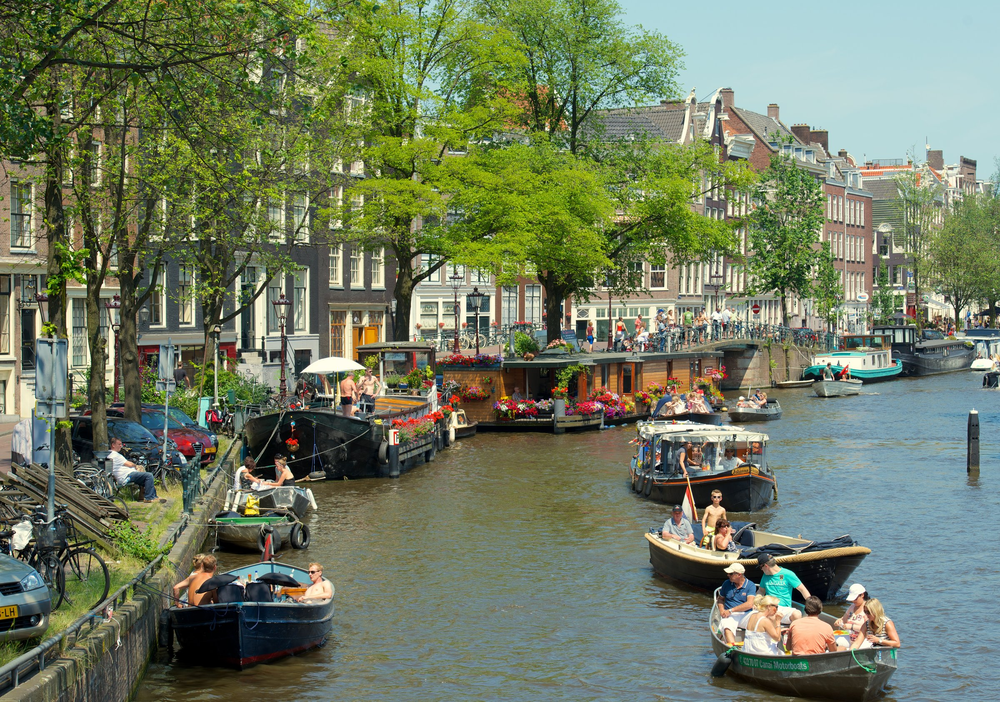
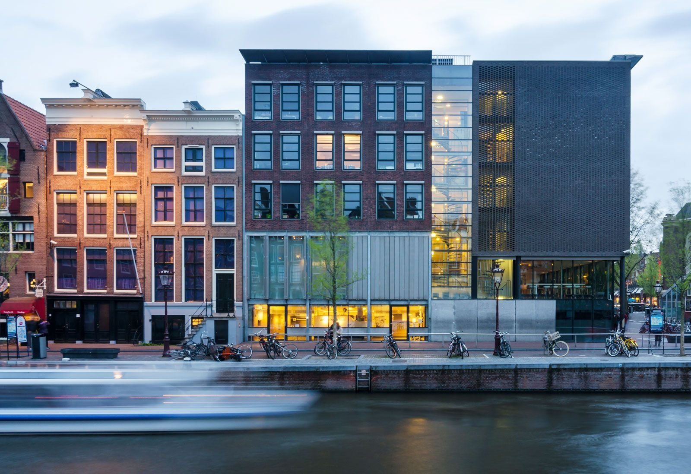
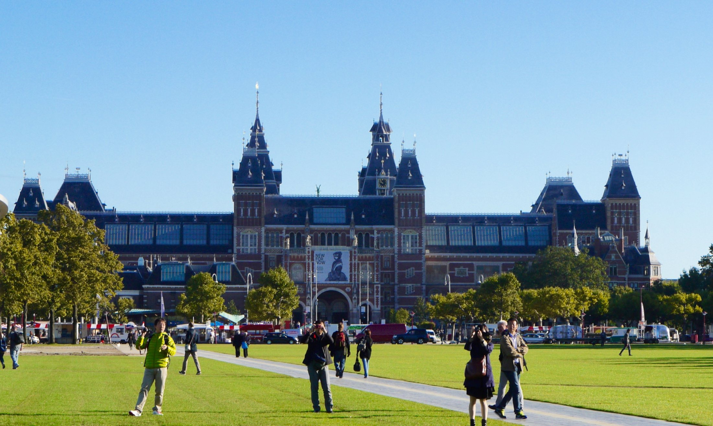

**St Pancras to Amsterdam Centraal is about four hours direct on Eurostar — 4h19 outbound, 4h09 back — and Standard fares start from £39 one-way.** That's twice the journey time of the Eurostar to Paris, and the border admin costs you the same 75 to 90 minutes at both ends, not just one. Do the maths honestly and a day trip works only for an early riser; a night in the city is what actually lets Amsterdam breathe.

This guide covers both: the honest hours if you're determined to do it in a day, and what changes if you stay over — plus the three tickets in this city that need booking ahead of time, because two of them sell out.

> 💡 **The Short Version:** **St Pancras to Amsterdam Centraal, about 4 hours direct**, no change of train (it calls at Brussels-Midi and Rotterdam Centraal on the way). Eurostar Standard **from £39** one-way, booked 10–11 months ahead for the cheapest fares. **Arrive 75–90 minutes before departure at both ends** — Amsterdam's own "UK Terminal" opened February 2025 and runs full UK and Dutch border checks before you board, same as St Pancras. You need **a passport, not an ID card**, issued within **10 years** and valid **3 months** after you leave; **ETIAS isn't required yet**. **As a day trip**, the realistic 08:16 train gives you under four hours in the city before you need to be back at the station — **one or two nights suits Amsterdam far better**. **Staying over?** See Where to stay below for four hotels, from opposite Centraal Station to the canal ring. **Van Gogh Museum tickets sell out**; Anne Frank House releases tickets exactly **six weeks ahead**, every Tuesday at 10am. **Or book a canal cruise now** — <a href="https://www.getyourguide.com/activity/-t56671?partner_id=WWP7I0R&amp;cmp=amsterdam-from-london" target="_blank" rel="sponsored nofollow noopener" data-affiliate="gyg">from £11</a>, with daytime departures near Centraal Station.

**Book direct:**

- **From £11** — <a href="https://www.getyourguide.com/activity/-t56671?partner_id=WWP7I0R&amp;cmp=amsterdam-from-london" target="_blank" rel="sponsored nofollow noopener" data-affiliate="gyg">Canal Cruise from Anne Frank House, Rijksmuseum or Centraal Station</a> — 4.3 from 21,641 reviews, 1 hour, several daytime departure points so it fits around a day-tripper's schedule
- **From £23** — <a href="https://www.getyourguide.com/activity/-t56969?partner_id=WWP7I0R&amp;cmp=amsterdam-from-london" target="_blank" rel="sponsored nofollow noopener" data-affiliate="gyg">Van Gogh Museum entry ticket</a> — 4.7 from 57,513 reviews, and the one ticket in this guide worth buying well before you travel
- **From £23** — <a href="https://www.getyourguide.com/activity/-t7135?partner_id=WWP7I0R&amp;cmp=amsterdam-from-london" target="_blank" rel="sponsored nofollow noopener" data-affiliate="gyg">Rijksmuseum entry ticket</a> — 4.7 from 33,424 reviews, and the easier of the two big museums to get into at short notice

Powered by <a target="_blank" rel="sponsored" href="https://www.getyourguide.com/london-l57/">GetYourGuide</a>

## Getting there: the Eurostar

| | London St Pancras → Amsterdam Centraal |
| --- | --- |
| **Operator** | Eurostar, direct (calls at Brussels-Midi and Rotterdam Centraal) |
| **Journey time** | **4h19** outbound, **4h09** back |
| Eurostar Standard | **From £39** one-way, lead-in fare |
| Recommended arrival, St Pancras | **75 min** before (Standard/Plus), 45 min (Premier) |
| Booking window | Released **10–11 months** ahead |

Eurostar's own site was quoting Standard fares to Amsterdam from £39 one-way on 27 September 2026. Like every Eurostar fare it's dynamically priced — the cheapest seat on the cheapest date, climbing the closer you book to travel — so treat it as a lead-in figure, not a quote for your date. Plus and Premier cost more for a wider seat, food service and lounge access; the three classes work the same way on every Eurostar route from London, and this site's [Paris day trip](/articles/paris-day-trip/) guide breaks down exactly what each one adds.

"Direct" means no change of train, not nonstop: the Amsterdam service calls at Brussels-Midi and Rotterdam Centraal on the way, picking up and setting down passengers for those cities while you stay in your seat. There are five direct departures a day from St Pancras on a weekday (06:16, 08:16, 11:04, 15:04, 18:04), three on Saturday, and four on Sunday — noticeably fewer than the Paris route, so check the timetable for your date rather than assuming an hourly service.

### Booking ahead, and Eurostar Snap

Eurostar tickets to Amsterdam are released **10 to 11 months ahead**, the same window as every other route to or from London, and the price only goes one way as the date gets closer. If your dates are flexible, **Eurostar Snap** sells discounted last-minute Standard fares on this route too, bookable up to **10 days before travel** — worth checking if you decide on the trip at short notice rather than months out.

Powered by <a target="_blank" rel="sponsored" href="https://www.getyourguide.com/london-l57/">GetYourGuide</a>

## Check-in and the border

This is the one place Amsterdam genuinely differs from Paris or Brussels: **both ends of the journey now run a full border process**, not just the outbound leg.

| Station | Class | Recommended arrival | Gate closes |
| --- | --- | --- | --- |
| **St Pancras** (outbound) | Standard / Plus | **75 min before** | 30 min before |
| St Pancras (outbound) | Premier | 45 min before | 15 min before |
| **Amsterdam Centraal** (return) | Standard / Plus | **75–90 min before** | 30 min before |
| Amsterdam Centraal (return) | Premier | 30 min before | 15 min before |

> ⚠️ **This is not the 20-minute advice Eurostar gives for its other European routes.** Journeys between Paris, Brussels, Amsterdam and Cologne that don't touch London recommend arriving 20 minutes ahead. Both ends of a London–Amsterdam trip are longer because of the passport checks — don't apply the shorter number to either station.

The Amsterdam Centraal side of this is newer than most guides assume. Until a dedicated Eurostar "UK Terminal" opened there **on 10 February 2025**, there was no way to check in for a direct London train at Amsterdam Centraal at all — passengers went via Brussels instead. That terminal now processes up to 650 passengers per departure (the old, temporary one held 250), and the process is close to what you'd meet at Gare du Nord: a ticket check, security screening, then Dutch passport control followed by UK Border Force, before a departure lounge with seating, plug sockets and a café. Boarding starts around 20 minutes before departure.

**You need a passport, not an ID card.** Since Brexit, UK nationals are non-EU travellers on this route. Your passport must have been **issued less than 10 years before** the date you enter the Netherlands and stay **valid for at least 3 months after** the day you leave — a passport that fails either rule is turned away at the gate.

**EU Entry/Exit System (EES) registration** happens at the station before you board: a passport scan, a facial photo and, on your first crossing, fingerprints, at a self-service kiosk ahead of the ticket gates. It's free and needs no advance application.

**ETIAS, the EU's separate pre-travel authorisation scheme for visa-exempt visitors, is not required yet.** The EU had been targeting the last quarter of 2026 for launch, then quietly dropped that date from its own site in August 2026 without setting a new one. No ETA or visa is needed for a UK citizen travelling out to the Netherlands either; the UK's own Electronic Travel Authorisation only applies to foreign nationals entering Britain.

**Luggage:** one handbag or daypack plus two further items up to 85cm at their widest point for Standard and Plus, three bags plus the daypack for Premier. No weight limit, but you carry and store it yourself.

## Is Amsterdam actually doable as a day trip?

Only with an early start, and even then the hours are thin next to Paris.

On a weekday, the **realistic option without checking in before dawn is the 08:16 from St Pancras**, which — after calling at Brussels-Midi and Rotterdam Centraal — reaches Amsterdam Centraal at **13:20** local time. The **last train that gets you home the same night leaves Amsterdam at 18:40**, arriving St Pancras at 21:57. Work backwards from the 75–90 minute check-in at the UK Terminal and you need to be inside by around 17:10 — which leaves **well under four hours** in the city.

Take the very first departure instead — **06:16**, which means checking in at St Pancras by around 05:00 — and you land in Amsterdam at 11:20, stretching the day to a still-modest **six hours**. That's the ceiling: there is no way to get more than that out of a single day on this route.

> 💡 **Compare that with Paris.** The Eurostar to Paris takes half as long, so the same early-start, late-return pattern there gives a reader seven to eight hours in the city rather than four to six. Amsterdam's journey time is the whole difference.

Weekends are tighter still: **Saturday runs only three direct trains each way**, and the last one back leaves Amsterdam at 16:40 — over two hours earlier than the weekday cut-off. If a day trip is the plan, go midweek.

None of this makes Amsterdam a bad day trip so much as a demanding one. If your dates allow it, **one night turns a rushed afternoon into an actual visit**: a full evening for dinner and a first canal walk, then a full day with the shops open and the museums at a normal pace, rather than a sprint between a morning train and an early check-in.

## Getting into the centre from Centraal Station

Amsterdam Centraal sits right on the water at the edge of the old city, and the centre itself is compact enough that most of what's in this guide is a walk or one tram ride away.

| From Centraal Station to | Getting there |
| --- | --- |
| **Dam Square** | 10-minute walk |
| **Anne Frank House / Jordaan** | 20-minute walk, or tram 13 or 17 to Westermarkt |
| **Museumplein** (Rijksmuseum, Van Gogh Museum) | Tram 2, 5 or 24 |

There's no need to book anything for the ride in — trams accept contactless bank cards the same way London buses do, tapping in at the start of the journey and out at the end.

## The canal ring and the Jordaan

The concentric canals that ring the old centre — the Prinsengracht, Herengracht and Keizersgracht — are UNESCO World Heritage, listed in 2010 as the **"Seventeenth-Century Canal Ring Area of Amsterdam inside the Singelgracht."** They were dug as one planned expansion of the city in the 1600s, which is why the gabled merchant houses along them still line up so uniformly: this was a single, ambitious building project, not centuries of accretion.

**The Jordaan**, just west of the canal ring, is the neighbourhood to wander rather than tick off: narrower streets, houseboats moored along the smaller canals, and independent shops and cafés rather than chains. Nothing here needs a ticket or a booking — it rewards an hour with no destination more than any single sight does.

*A canal in the Jordaan.*

A **canal cruise** is the easiest way to see the ring from the water rather than the towpath, and unlike Bruges' boats, you don't need to queue at a jetty — book a time slot in advance. Cruises run from several points around the centre, including near Anne Frank House, the Rijksmuseum and Centraal Station itself, which makes one easy to fit in around a train time rather than the other way round.

## The three tickets worth booking ahead

Amsterdam's big three sights all require a timed-entry ticket, but they don't sell out at the same rate. Knowing which is which decides how far ahead you need to plan.

**Anne Frank House is the strictest of the three.** Tickets go on sale **every Tuesday at 10am CEST, for a visit exactly six weeks later**, and only through the museum's own website — no reseller, including GetYourGuide, sells them. Adult admission is **€16.50** (including a €1 booking fee), €7.00 for ages 10–17, and €1.00 for under-10s. The museum is open daily, 9:00 to 22:00. If your trip is inside six weeks away when you plan it, there is no way to book a ticket to this one — an Anne Frank–themed walking tour of the surrounding Jewish Quarter is the fallback, not a substitute for the House itself.

*The Anne Frank House, on the Prinsengracht.*

**The Van Gogh Museum is also online-only, with no ticket sold at the door.** Adult admission is **€25**, students €16, under-18s free, and the museum runs no waiting list if your date shows as sold out. Checked on GetYourGuide on 27 September 2026, the museum's own entry ticket was flagged **"Likely to sell out"** and showed nothing available before **6 October — nine days out**. Book this one as soon as your dates are fixed, not the week before.

**The Rijksmuseum is the easiest of the three to get into at short notice.** Booking a start time is required for every visitor, including Museumkaart holders, but the museum still sells tickets at the entrance, subject to availability, and its GetYourGuide listing was still showing slots the next day when we checked. Adult admission is **€25**, free for under-18s. The Rijksmuseum and the Van Gogh Museum both sit on Museumplein, a few minutes' walk apart, so a booked Van Gogh slot and a same-day, on-the-door Rijksmuseum visit pair up easily.

*The Rijksmuseum, seen from Museumplein.*

Powered by <a target="_blank" rel="sponsored" href="https://www.getyourguide.com/london-l57/">GetYourGuide</a>

## Where to stay

Stay by Centraal Station if getting to an early train home matters more than the evening; stay in the canal ring or the old centre if you'd rather have dinner and a first canal walk on your doorstep.

- **[ibis Styles Amsterdam Central Station](hotelscom:h1211201)** — directly across the square from Centraal Station, 5 minutes' walk from Dam Square; a straightforward 3-star with breakfast included, the simplest base for an early train home. £
- **[The Hoxton, Amsterdam](hotelscom:h8482)** — on the Herengracht, 5 minutes' walk from Dam Square and about 15 on foot from Centraal; its ground-floor restaurant and cocktail bar double as the evening out. ££
- **[The Toren Amsterdam](hotelscom:h20507)** — two 17th-century canal houses on the Keizersgracht, a few minutes from the Jordaan and Anne Frank House; quieter rooms, some over the canal or a private garden. £££
- **[Stayokay Amsterdam Stadsdoelen](hotelscom:h22415222)** — on the Kloveniersburgwal near Nieuwmarkt, a 10-minute walk from Dam Square; a hostel with private rooms as well as dorms, the cheapest base in the old centre. £

## What people get wrong

- **Assuming "direct" means nonstop.** The Eurostar to Amsterdam calls at Brussels-Midi and Rotterdam Centraal on the way — it's still one train and no change, but it's not a straight run.
- **Budgeting border time for St Pancras only.** Amsterdam Centraal's own UK Terminal runs the same 75–90 minute process on the way home, and it's easy to miss if you're used to Paris or Brussels, where only the outbound leg is longer.
- **Leaving the Van Gogh Museum until the day before.** It has no door sale and no waiting list — book it as soon as your dates are set.
- **Trying to book Anne Frank House less than six weeks out.** Tickets for a given date only exist from the Tuesday six weeks before it, released at 10am CEST — there is nothing to buy earlier or later than that window.
- **Treating Amsterdam like Paris and planning a rushed single day.** The journey alone is twice as long each way; a night changes the trip from a sprint to an actual visit.
- **Assuming a UK driving licence works.** It doesn't — you need a passport that clears both the 10-year issue rule and the 3-month validity rule.

All prices and times checked 27 September 2026.

## Continue planning your trip

- 🗺️ **[Day trips from London](/articles/day-trips-from-london/)** — how Amsterdam compares with Paris, Bruges and the rest for time and cost.
- 🇫🇷 **[Paris day trip](/articles/paris-day-trip/)** — the shorter Eurostar day trip, and how the border process and the hours compare.
- 🍫 **[Bruges from London](/articles/bruges-day-trip/)** — a Eurostar to Brussels plus a separate Belgian train, and how that maths compares.
- 🇧🇪 **[Brussels from London](/articles/brussels-day-trip/)** — the shortest of the Eurostar trips, if a full day abroad isn't what you're after.
- 🚂 **[St Pancras hotels: where to stay in King's Cross](/articles/where-to-stay-kings-cross/)** — for the earliest trains, when checking in the night before beats a 5am alarm.
- 🗺️ **[King's Cross area guide](/articles/kings-cross-area-guide/)** — what's around St Pancras if you arrive back with the evening still ahead of you.
