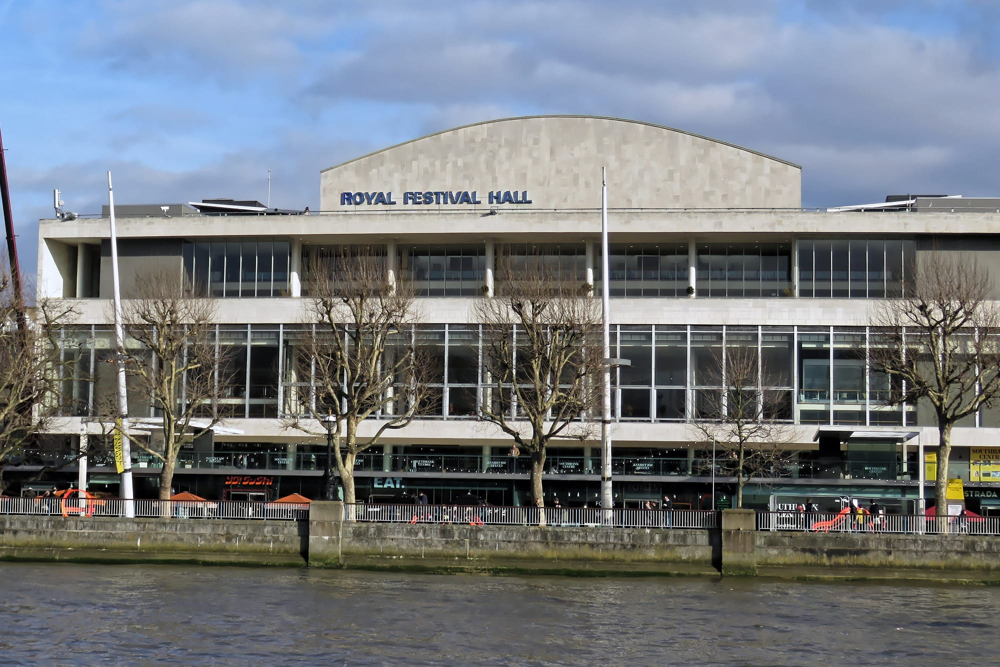

**The BAFTA ceremonies are invitation only, but the red carpet is not.** BAFTA gives away a limited number of free places in fan pens outside the venue, where you can watch the stars arrive. The only way to one is to apply in advance.

> 💡 **The Short Version:** The ceremony is **invitation only**. The public can apply for a **free fan-pen place outside the venue** at the **EE BAFTA Film Awards** and the **BAFTA Television Awards**, the two ceremonies where BAFTA has viewing areas. Applications go through **Applause Store**. **You cannot turn up on the day**, you must be **12 or over**, and **any place sold for money is void**. The 2026 Film Awards places were fully booked; **registration for the 2027 Film Awards is open** on Applause Store, with the date to follow.

*Dates, ages and rules come from BAFTA's public FAQs and Applause Store's BAFTA listings for 2026 and 2027.*

---

## Two ceremonies, one route

BAFTA's public FAQs say it has red carpet viewing areas at two awards each year. Both were held at the Royal Festival Hall on the South Bank in 2026.

| Ceremony | 2026 date | Fan-pen places |
| --- | --- | --- |
| **EE BAFTA Film Awards** | Sunday 22 February 2026 | Free, through Applause Store. Applications closed 8 February 2026 and the places were fully booked. Registration for 2027 is open and the date is to be released |
| **BAFTA Television Awards with P&O Cruises** | Sunday 10 May 2026 | Free, through Applause Store. The 2026 application is closed; register on the listing to hear about the next |

The Film and Television ceremonies are the two with a public red carpet.

*The Royal Festival Hall on the South Bank, seen from across the Thames. Photo: [Acabashi](https://commons.wikimedia.org/wiki/File:Royal_Festival_Hall_01.jpg), [CC BY-SA 4.0](https://creativecommons.org/licenses/by-sa/4.0/).*

## How to apply

1. **Create one free [Applause Store](https://www.applausestore.com/) account.** Applause bans anyone found with duplicate accounts, and the name on the account has to match your photo ID.
2. **Open the [2027 EE BAFTA Film Awards Red Carpet](https://www.applausestore.com/book-2027-ee-bafta-film-awards-red-carpet) listing and choose Register Interest.** Applause says it will email you when the date is released. Location is shown as London SE1 and the minimum age as 12.
3. **Apply when the window opens, and say if you need an accessible viewing area.** Applause says BAFTA will have accessible viewing areas and that access adjustments are indicated on the application.
4. **Wait for the email.** For the 2026 Film Awards, requests closed on 8 February 2026 and successful applicants had their eTicket from the week of 11 February 2026. That left under two weeks' notice of a place before the ceremony on 22 February.

Applause's own wording is that it has "a very limited number" of invitations. BAFTA's [public FAQs page](https://www.bafta.org/awards/public-faqs/) headlines the process as a red carpet ballot and says applications for the 2026 Television Awards are closed.

**It is free, and it stays free.** Vouchers are not valid for these listings, and Applause says it voids the allocation of anyone found selling a ticket, and may take formal action. Brokers selling red carpet "access" are not offering these places.

## What the rules are

BAFTA's last published viewing-area FAQ is for the [2024 ceremony](https://static.bafta.org/uploads_pre_202411/redcarpetballotfaq.pdf), when places were drawn from a public ballot on BAFTA's own form. Its rules for the area itself were:

- **Photo ID is required to collect your wristband.** You could not buy or apply for a wristband on the day.
- **No leaving and re-entering.** If you walk out, you cannot go back in.
- **No luggage.** There was no cloakroom or space to store bags.
- **No toilets** in the viewing area.
- **Outdoors and uncovered**, with no seating and no room to bring your own. People with reduced mobility applied separately for the accessible area, where you can sit.
- **Phone cameras only.** Professional camera equipment was not allowed.
- **Cold food and water** in a reusable bottle were allowed; hot food and alcohol were not.
- **Guest names could not be changed** once the application was submitted.

Applause's 2026 and 2027 listings repeat the age rule (12 or over, under 18s with an adult) and say the places are for the pens outside the venue only. Read the confirmation email when it arrives for the rules that apply to your date.

## What you will see

The fan pens are outside the venue, beside the carpet. Applause's listing says the stars walk that carpet with the press alongside them. BAFTA's 2024 FAQ said the area opened during the afternoon, with exact timings sent to successful applicants. The ceremony itself happens inside, out of sight.

Dress for the weather: the 2024 area was open air, with standing room only.

## If you do not get a place

- **Join the waiting list.** The 2026 Film Awards listing was marked fully booked, with a Register Interest option for any places released through cancellations.
- **Watch it at home.** The 2026 Film Awards were on BBC One on 22 February 2026, with the red carpet show on BAFTA's YouTube. The 2026 Television Awards, on 10 May 2026, had the full show on BBC iPlayer and a red carpet show on YouTube.
- **Try another carpet.** The [Olivier Awards](/articles/olivier-awards-tickets/) green carpet outside the Royal Albert Hall used Applause Store for free fan-pen places in 2026, with a minimum age of 5. Premieres work the same way: see [how to see stars at a London film premiere](/articles/film-premieres-london/).

## Other London ceremonies

BAFTA is one of several London award nights with a public way in, and many have none. [Award ceremonies in London: which ones the public can get into](/articles/award-ceremonies-london/) sets out the route, the price and the date for each.

---

## Continue planning your London trip

- 🏆 **[Award ceremonies in London](/articles/award-ceremonies-london/)** — which nights the public can get into, and how
- 🎬 **[How to See Stars at a London Film Premiere](/articles/film-premieres-london/)** — fan pens, ballots and the ticketed premieres
- 🎭 **[Olivier Awards Tickets](/articles/olivier-awards-tickets/)** — green-carpet fan pens outside the Royal Albert Hall
- 🎞️ **[BFI London Film Festival](/articles/london-film-festival/)** — galas at the Royal Festival Hall on public sale
- 📺 **[Free TV and Radio Tickets in London](/articles/free-tv-show-tickets-london/)** — the same Applause Store account, for studio audiences
- 🌉 **[The South Bank Area Guide](/articles/south-bank-area-guide/)** — the Royal Festival Hall and what is around it
