The [South Bank walk](/articles/south-bank-walk/) crosses this ground in two stops: a look at Southwark Cathedral, lunch at Borough Market, and on to Tower Bridge. That is the riverside version.

**This is the one that goes inland.** Southwark was the road into London from the south and the place the City's rules did not reach. It had the coaching inns, the bishops' palace and prison, the brothels, the bear pits and, from 1587, the theatres. Most of it is still here, and much of it is up alleys and yards off the main street.

The route runs from **London Bridge station to the Millennium Bridge**: eleven numbered stops, about **3km**, an hour of walking and **two and a half to three hours** with stops. Almost all of it is free.

For hotels, restaurants and the rest of the riverside, see the [South Bank area guide](/articles/south-bank-area-guide/). [Bermondsey](/articles/bermondsey-area-guide/) starts on the other side of London Bridge station.

> 💡 **The Short Version:** Start at **London Bridge** and walk south down Borough High Street first, into the yards of the old coaching inns and the **George**, London's last galleried inn. **Thursday** is the day everything is open: the **Cross Bones** garden opens Wednesday to Friday, 12–2pm, and the **Rose** opens only for Thursday tours. **Not on a Monday**: Borough Market is closed. The **Globe** opens for tours and performances only, and the **first Globe** is a free outline on Park Street, four minutes away.

## The route

  

    Map of the walk, numbered in walking order
  

  

    
Loading the map…

  

  

    <i class="route-map-marker" aria-hidden="true">1</i> On the route, in walking order
    <i class="route-map-marker route-map-marker--alt" aria-hidden="true">+</i> Optional detour
  

  <noscript>
    
The map needs JavaScript. Every stop below is numbered in walking order with its nearest station.

  </noscript>

**[Open the whole route in Google Maps →](https://www.google.com/maps/dir/?api=1&origin=51.504574,-0.089203&destination=51.509888,-0.098508&waypoints=51.50419,-0.089994%7C51.503881,-0.093373%7C51.505526,-0.090438%7C51.506129,-0.089625%7C51.506887,-0.090325%7C51.506872,-0.090956%7C51.507107,-0.095324%7C51.508121,-0.097186%7C51.507429,-0.099342&travelmode=walking)**: all eleven stops in walking order, set to walking directions, which is the version to put on your phone.

| # | Stop | Cost | Open |
| --- | --- | --- | --- |
| **1** | The inn yards of Borough High Street | Free | Always |
| **2** | The George Inn & Talbot Yard | Free to look | Daily from 11am |
| **3** | Cross Bones Graveyard | Free | Gates always; **garden Wed–Fri 12–2pm** |
| **4** | Borough Market | Free | **Closed Mondays** |
| **5** | Southwark Cathedral | **Free** | Daily |
| **6** | The Golden Hinde | £6 | Daily |
| **7** | Winchester Palace & the Clink | Palace free; Clink £10 | Palace always; Clink daily |
| **8** | The first Globe & the Rose | Site free; Rose £12 | Rose **Thursday tours only** |
| **9** | Shakespeare's Globe | Tour £31 | Tours and performances only |
| **10** | Tate Modern | **Free** | Daily, late Fri–Sat |
| **11** | The Millennium Bridge | Free | Always |
| **+** | The Old Operating Theatre | £10 | **Thu–Sun only** |

---

## 1. The inn yards of Borough High Street

Leave London Bridge station by the Borough High Street exit and walk south on the station side of the road. The narrow openings on your left are the point of the first half-hour.

Until Westminster Bridge opened in 1750, this street was the only road into London from the south, and it was lined with coaching inns serving the traffic from Dover, Portsmouth and the rest of the south-east. Each inn was built round a long yard behind its street front. The inns have gone, all but one, but the yards kept their names and their shape.

**King's Head Yard** comes first, then **White Hart Yard** beside it. The White Hart was Jack Cade's headquarters during his rebellion of 1450, which puts it in Shakespeare's *Henry VI, Part 2*, and it is where Mr Pickwick first meets Sam Weller in Dickens's *The Pickwick Papers*. It was demolished in 1889. The yard is what is left.

## 2. The George Inn and Talbot Yard

**The George is London's last remaining galleried inn**, as the National Trust, which owns it, puts it. The inn on this site burned in the Southwark fire of 1676 and was rebuilt straight away, and what you see is one side of that building: two tiers of open wooden galleries over a cobbled yard. Dickens knew it and mentions it in *Little Dorrit*.

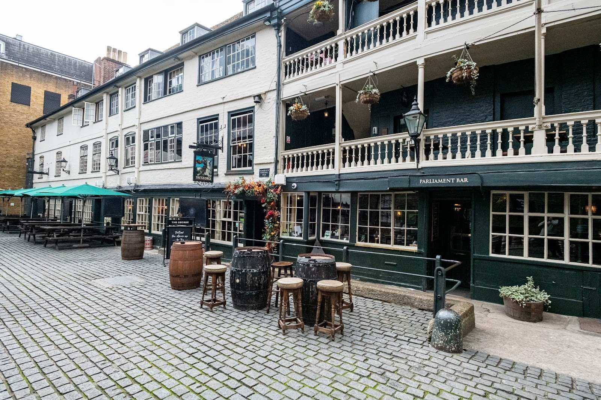

*The George Inn's galleries.*

It is still a pub, run by Greene King and **open daily from 11am**, with tables in the yard under the galleries.

Next door, **Talbot Yard** is the site of the **Tabard**, the inn where Chaucer's pilgrims meet before setting out for Canterbury in *The Canterbury Tales*. It was renamed the Talbot and demolished in 1873; a blue plaque in the yard marks it.

Powered by <a target="_blank" rel="sponsored" href="https://www.getyourguide.com/london-l57/">GetYourGuide</a>

## 3. Cross Bones Graveyard

Cross Borough High Street, walk west along Union Street and turn right into Redcross Way. The graveyard is behind red iron gates covered in ribbons, flowers and messages.

**Cross Bones was a paupers' burial ground until 1853**, and an estimated 15,000 people are buried under it. The plaque on the gates says it began as an unconsecrated graveyard for the sex workers of Bankside, known as "Winchester Geese" because the Bishop of Winchester licensed the brothels; Bankside Open Spaces Trust, which runs the site, calls that a widely held belief. Part of it was dug up in the 1990s during work on the Jubilee line extension. After years of local campaigning it is now a garden of remembrance, run by the trust on a 30-year lease.

> ⚠️ **The garden opens Wednesday, Thursday and Friday, and the first Saturday of the month, 12–2pm only.** Volunteer wardens open it, so times can vary. The gates and the shrine on them are on the street and there to see at any hour. A vigil is held at the gates at **7pm on the 23rd of every month**, and anyone can go.

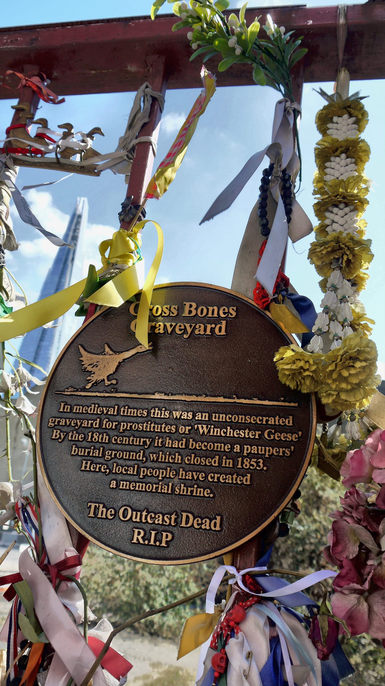

*Cross Bones gates, Redcross Way. Photo: [Duncan Harris](https://commons.wikimedia.org/wiki/File:Crossbones_Cemetery_Gates,_Southwark.jpg), [CC BY 2.0](https://creativecommons.org/licenses/by/2.0/).*

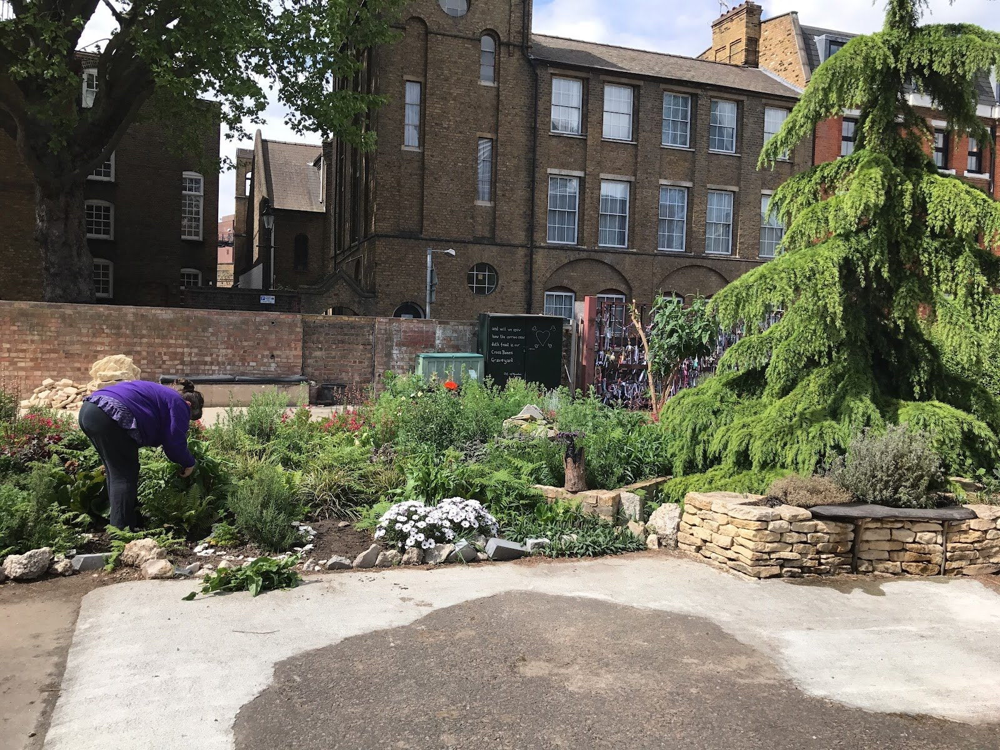

*The Cross Bones garden, from inside.*

## 4. Borough Market

Five minutes north up Redcross Way, under the railway and across Southwark Street.

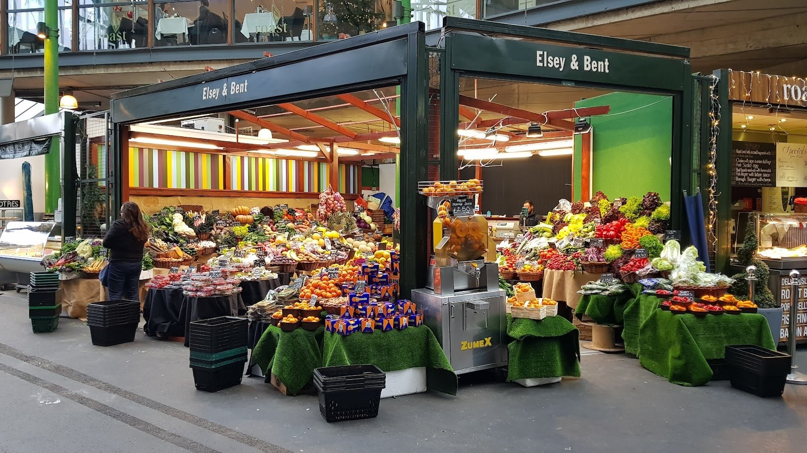

*A greengrocer's stall in Borough Market.*

> ⚠️ **Borough Market is closed on Mondays.** Tuesday to Friday **10am–5pm**, Saturday **9am–5pm**, Sunday **10am–4pm**. Hours change at bank holidays and over Christmas. The market's own advice is that Saturday afternoon is its busiest time, and some passages are only 1.5 metres wide.

This is lunch. The [London markets guide](/articles/best-london-markets/#borough-market-southwark) covers which stalls trade on which days and what to queue for. On this walk it is also the way through to the cathedral, at the market's north-east corner.

## 5. Southwark Cathedral

**Free to enter**, open **Monday to Saturday 9am–6pm and Sunday 8.30am–5pm**. There has been a church here since at least 1086: a minster in the Domesday Book, an Augustinian priory from 1106, the parish church of St Saviour, and a cathedral only since 1905. The cathedral calls Shakespeare its best-known parishioner.

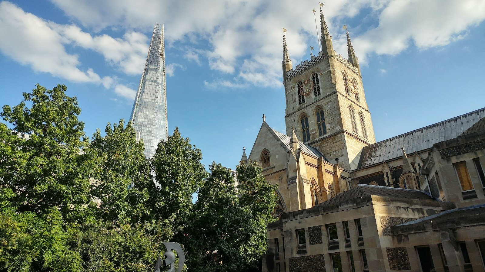

*Southwark Cathedral's tower.*

What to find inside:

- **The Shakespeare memorial** in the south aisle: a 1911 figure of him lying in a Bankside meadow, under a 1954 window of characters from his plays. A tablet to **Sam Wanamaker**, who founded the rebuilt Globe, is beside it.
- **Edmund Shakespeare**, the playwright's younger brother, an actor who died in 1607, and **John Fletcher**, who co-wrote *Henry VIII* with Shakespeare. Both have memorial stones in the choir. **Philip Henslowe**, who built the Rose at stop 8, is buried here too.
- **John Gower's tomb** in the nave. Gower was a poet and a friend of Chaucer, and lived and died in the priory.
- **The Harvard Chapel**. John Harvard was baptised here in 1607, the son of a Southwark butcher, and left his library to the college in Massachusetts that took his name.

> 💡 **Prayers are said on the half hour from 10.30am to 4.30pm.** They last about two minutes, and visitors are asked to stand still. Services restrict access, so on Sunday the cathedral recommends visiting between 12.30 and 3pm or 4 and 5pm.

## 6. The Golden Hinde

Round the cathedral's river side into St Mary Overie Dock. **A full-size reconstruction of the ship Francis Drake sailed round the world in 1577–1580**, the first English ship to do it. It was built by hand in Appledore, Devon, and launched in 1973.

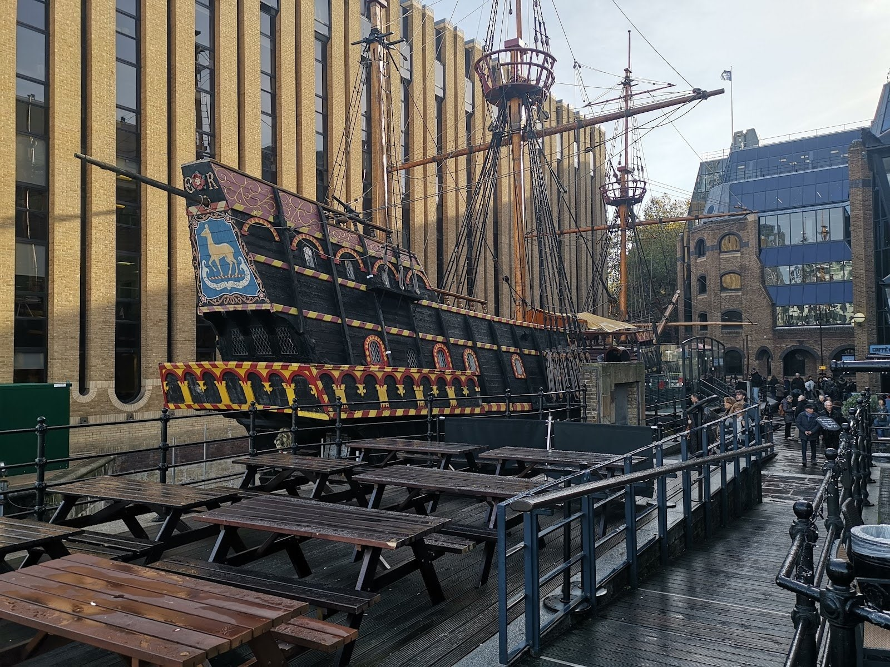

*The Golden Hinde.*

**£6 for adults and children, £20 for a family of four**, with an audio guide. Open daily, **10am–6pm April to October and 10am–5pm November to March**, and occasionally shut for private hire. No booking needed.

> ⚠️ **The ship is under restoration**, and parts of it are closed to visitors while the work goes on. Boarding is up five steps from the street, and inside are steep stairs and ladders, with no step-free access.

## 7. Winchester Palace and the Clink

A few steps west along Clink Street stands a single gable wall with a **rose window** high up in it. It is **the great hall of Winchester Palace**, the London house of the Bishops of Winchester, who ran Bankside as their own jurisdiction outside the City's control. Most of the palace burned down in 1814. English Heritage keeps it, **free to see at any time** from the street, with no access inside; the trust that runs Cross Bones has planted a medieval-style garden in the hall's footprint.

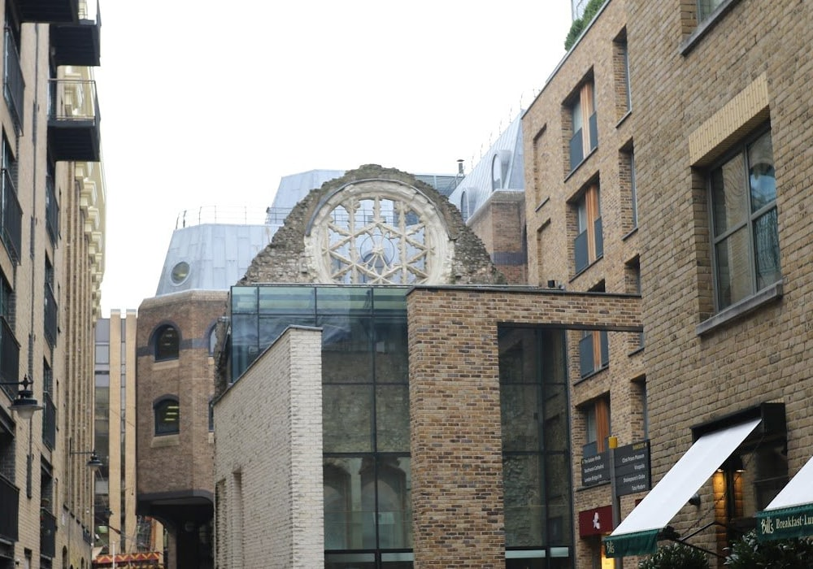

*Look up for the rose window.*

The bishops kept their prison here too. **The Clink** stood in the palace grounds from the 12th century until 1780, when the Gordon rioters broke in, freed the prisoners and burned it down. It was never rebuilt. The museum, a minute further along the street, says it gave its name to every prison since: "in the clink".

The **Clink Prison Museum** is open **daily 10am–6pm** (last entry 5.30pm). Tickets are **£10 for adults, £8 for children and concessions, £29 for a family**. It is a hands-on museum aimed at families, including torture devices you can pick up. It is **not wheelchair accessible**.

Carry on along Clink Street to **The Anchor** on the riverside, then turn left down Bank End to Park Street.

## 8. The first Globe and the Rose

Turn right along Park Street. Just before Southwark Bridge Road, behind Anchor Terrace, a line in the paving marks **the foundations of the original Globe**. Shakespeare's company built it in 1599, and *Julius Caesar* was probably the first play it staged. In 1613 a cannon fired during *Henry VIII* set the thatch alight and the theatre burned down in two hours. It was rebuilt with a tiled roof and closed by Parliament in 1642. Part of the foundations was found in 1989; most of the rest lies under Anchor Terrace, a listed building, and has never been excavated.

Across Southwark Bridge Road, at **56 Park Street**, is **the Rose**. Philip Henslowe opened it in **1587**, the first purpose-built playhouse on Bankside. Marlowe's *Doctor Faustus* and *Tamburlaine* were staged here, and so was Shakespeare's earliest tragedy, *Titus Andronicus*. It closed around 1605. Its remains were found by chance in 1989. They are now kept under water, with the outline of both versions of the building and its stage picked out in rope lights.

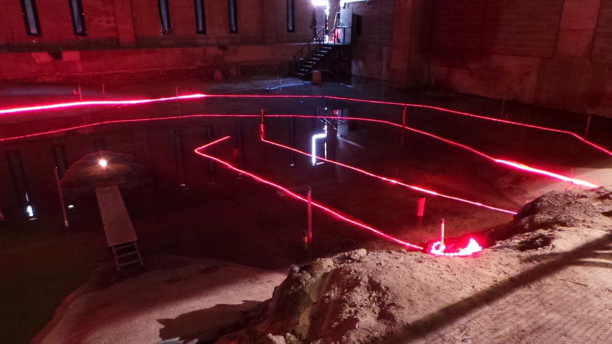

*The Rose, underwater.*

> ⚠️ **The Rose opens by guided tour only, and in autumn 2026 only on Thursdays**, from 17 September to 26 November. Tours last about 45 minutes and cost **£12, or £8 for concessions**, and must be [booked in advance](https://www.trybooking.com/uk/GTZW). On other days, 56 Park Street is shut.

Rose Alley, beside it, leads back to the river. Turn left.

Powered by <a target="_blank" rel="sponsored" href="https://www.getyourguide.com/london-l57/">GetYourGuide</a>

## 9. Shakespeare's Globe

The Globe you can visit is a reconstruction, opened in 1997 after a campaign Sam Wanamaker began in 1970. He died in 1993, four years before it opened. It is built of oak, lime plaster and water-reed thatch, and it is **the only thatched building in London**: it needed special permission, because thatch has been banned in the city since the Great Fire of 1666.

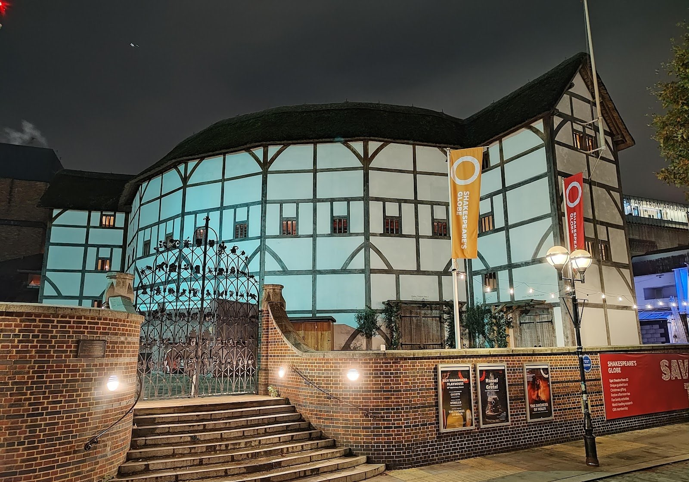

*Shakespeare's Globe at night.*

> ⚠️ **The theatre opens for tours and performances only.** The **guided tour costs £31 for adults and £14 for under-16s**, runs daily and takes about an hour and a half, including the exhibition. [Book on the Globe's site](https://www.shakespearesglobe.com/whats-on/globe-theatre-guided-tour/). Standing tickets in the yard for performances are **£5 or £10**. The shop on New Globe Walk (10am–5pm daily) and the **Swan** bar and restaurant are open to anyone.

The Globe also runs its own **Shakespeare's Walking Tour** of Bankside, 90 minutes at **£25**, which covers some of the ground you have just walked, with a guide.

## 10. Tate Modern

Four minutes west, in the former Bankside power station. **Free**, open **Sunday to Thursday 10am–6pm and Friday and Saturday 10am–9pm**.

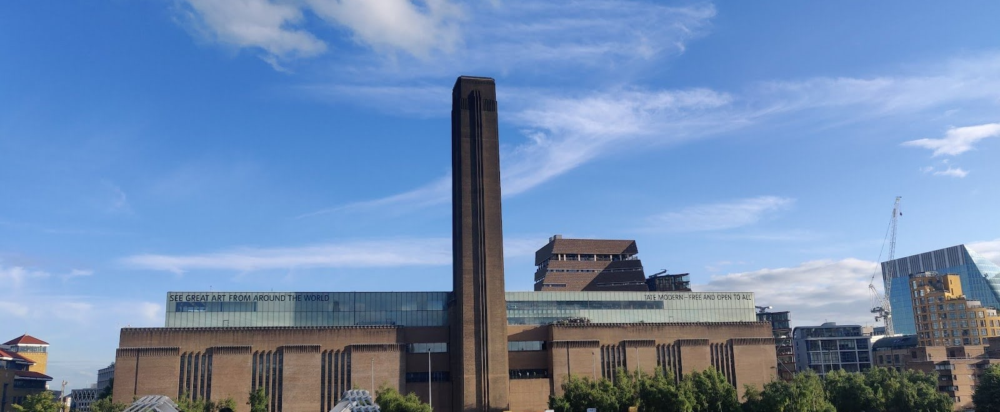

*The Blavatnik Building, behind the chimney.*

Walk through the **Turbine Hall** even if you are not staying, then take the lift in the Blavatnik Building to the **Level 10 café**, which looks across the river to St Paul's and down on the Millennium Bridge. Free 45-minute tours start at 12, 1 and 2pm on most days, from Level 2 of the Natalie Bell Building.

## 11. The Millennium Bridge

Out of Tate's river entrance and on to the bridge. It is a **325-metre steel footbridge**, the first new pedestrian crossing of the Thames in more than a century, and it opened on 10 June 2000. St Paul's is framed at the far end.

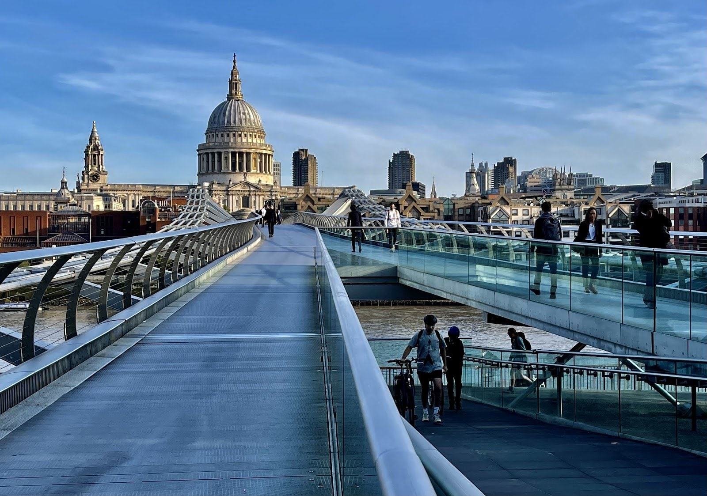

*Looking north across the Millennium Bridge.*

Cross it and walk up Peter's Hill to St Paul's to finish, in the [City of London](/articles/city-of-london-area-guide/). The [South Bank walk](/articles/south-bank-walk/) passes the south end of the bridge at its stop 8.

---

## The detour: the Old Operating Theatre

**Two minutes from London Bridge station on St Thomas Street, before you start.** It is in the roof space of St Thomas' Church, up a **52-step spiral staircase**, and the museum describes it as Europe's oldest surviving operating theatre. The attic was St Thomas' Hospital's herb garret, where the apothecary dried plants for medicines, until it was made into a women's operating theatre in 1822. Surgery was done here before anaesthetics, in front of students. The hospital moved to Lambeth in 1862 to make room for London Bridge station, and the room was boarded up until 1956.

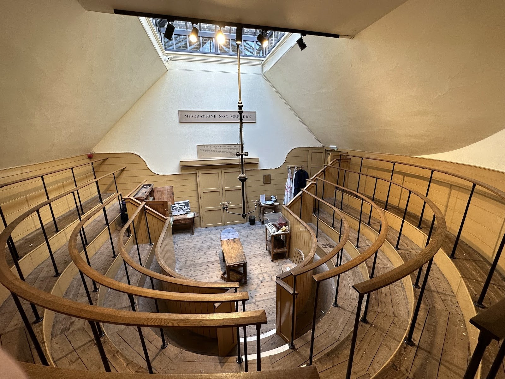

*The Old Operating Theatre.*

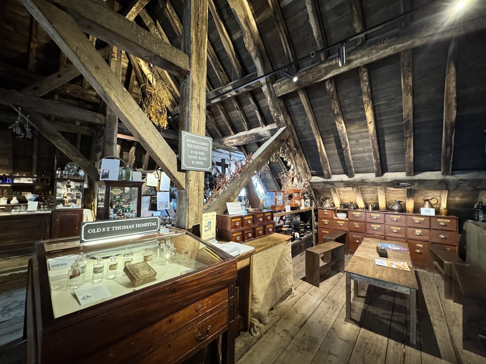

*The herb garret.*

It links to stop 5: the hospital began as the infirmary of the priory that is now Southwark Cathedral.

**Thursday to Sunday only, 10.30am–5pm.** Adults **£10**, concessions £8, children £6.50, families £22.

## Where to eat

- **[Borough Market](/articles/best-london-markets/#borough-market-southwark)** (£–££) at stop 4 is the obvious lunch, Tuesday to Sunday. Eat standing up or in the seating in Borough Market Kitchen.
- **The George** (££) at stop 2: pub food, Sunday roasts and the galleried yard, **daily from 11am**. It is also the Monday answer. Our [historic pubs guide](/articles/historic-pubs-dining-rooms-london/#the-george-southwark) has more on the building.
- **The Anchor** (££) at the end of stop 7, on the river at Bank End. Its **riverside garden is walk-in only** and takes no bookings. Open from 11am daily, 10am on Saturday.
- **The Swan** (££–£££) at the Globe, stop 9: a bar and restaurant looking over the river, open Monday to Saturday from noon and Sunday from 11.30am.

For restaurants worth booking further inland, see the [South Bank area guide](/articles/south-bank-area-guide/#where-to-eat-and-drink).

## The best day to go

**Thursday**, the only day every stop on the route can be seen.

| Day | What you get |
| --- | --- |
| **Monday** | **Borough Market closed**, Cross Bones garden and the Rose shut, Old Operating Theatre closed. Everything else runs. Eat at the George |
| **Tuesday** | Market open. Cross Bones gates only; Rose and Old Operating Theatre shut |
| **Wednesday** | Market open and the **Cross Bones garden 12–2pm**. Rose and Old Operating Theatre shut |
| **Thursday** | **Everything:** market, Cross Bones garden 12–2pm, **Rose tours**, Old Operating Theatre |
| **Friday** | Market, Cross Bones garden 12–2pm, Old Operating Theatre. **Tate open until 9pm** |
| **Saturday** | Market from 9am and at its busiest in the afternoon. Cross Bones garden only on the **first Saturday** of the month. Rose shut. Tate until 9pm |
| **Sunday** | Market 10am–4pm. Cross Bones garden and the Rose shut. Services limit the cathedral outside 12.30–3pm and 4–5pm |

**Thursday walks best from about 11am**: the George's yard, Cross Bones at noon, lunch in the market, and a Rose tour booked for the afternoon. On a Monday, do it the other way round: go into the Globe or the Clink, and eat at the George instead of the market.

**What never closes:** the inn yards, the Cross Bones gates, Winchester Palace, the first Globe's outline, and the bridge. The cathedral, Golden Hinde, Clink, Globe tours and Tate run seven days.

Powered by <a target="_blank" rel="sponsored" href="https://www.getyourguide.com/london-l57/">GetYourGuide</a>

## Getting there and back

**Start:** London Bridge (Jubilee, Northern, National Rail), Borough High Street exit. **Finish:** across the Millennium Bridge at St Paul's (Central line) or Blackfriars (District, Circle, Thameslink), or Southwark (Jubilee) from Tate Modern if you don't cross.

Borough Market has cobbles and narrow passages, and the Golden Hinde, the Clink and the Old Operating Theatre all have steps. The cathedral has step-free access from the Millennium Courtyard on its river side.

The walk also works in reverse, from Tate Modern to London Bridge, which puts the George at the end of the day instead of the start.

## Carry on walking

- **[The South Bank: Westminster to Tower Bridge](/articles/south-bank-walk/)**: the riverside walk, which shares Tate Modern, the Globe and the cathedral with this one. From the cathedral, its last three stops run east past HMS Belfast to Tower Bridge.
- **[The City of London: Bank to Tower Bridge](/articles/city-of-london-walk/)**: starts at Bank, ten minutes east of St Paul's along Cheapside, where this walk finishes.

## What to do with the rest of the day

- **[The South Bank area guide](/articles/south-bank-area-guide/)**: the river from the London Eye to Tower Bridge, where to stay and what to book.
- **[Where to stay on the South Bank](/articles/where-to-stay-south-bank/)**: hotels from County Hall to Borough, including around Bankside and London Bridge.
- **[The Bermondsey area guide](/articles/bermondsey-area-guide/)**: Bermondsey Street, Maltby Street Market and the Beer Mile, starting just east of London Bridge station.
- **[Historic pubs and dining rooms](/articles/historic-pubs-dining-rooms-london/)**: the George and London's other old pubs.
- **[Walks along the Thames](/articles/london-walks-along-the-thames/)**: more of the river on foot.
