Most Banksy maps of London are lists of walls where something used to be. You walk twenty minutes, find a patch of fresh paint, and read on your phone that it was removed in 2012.

**This route only goes where the work is still there.** Every stop was checked against dated reports from 2026, and the pieces that have gone, or that nobody can currently confirm, are simply not on it.

It runs from **Waterloo Place in St James's to Stoke Newington**, past **ten original Banksys at eight stops**: a 2026 statue, a 2025 mural, three rats spanning twenty years, two tributes to Basquiat, two stencils rescued from a demolished nightclub, a pink car in a perspex box, and one of the earliest pieces he painted in London.

**Two legs are ridden rather than walked.** The Central line takes you from Centre Point to the City, which saves a long trek with nothing to see, and the Overground takes you from Liverpool Street up to Stoke Newington for the finale. Everything else is on foot. Allow **about three and a half hours**.

For every surviving Banksy in London, including the ones this route does not reach, see our [guide to Banksy and London street art](/articles/london-street-art/).

> 💡 **The Short Version:** Go on a **Sunday** and start at **Blind Patriotism** on Waterloo Place at about 11am. Walk to **Centre Point**, take the **Central line from Tottenham Court Road to Bank**, and eat at **The Oyster Shed** by the Cannon Street rat. Walk up through the Barbican to Shoreditch and the **Pink Car** off Brick Lane, then take the **Weaver line from Liverpool Street to Stoke Newington** for the **Royal Family**. Short on time? Stop at the Pink Car.

## The route

  

    Map of the route, numbered in order
  

  

    
Loading the map…

  

  

    <i class="route-map-marker" aria-hidden="true">1</i> On the route, in order
    <i class="route-map-marker route-map-marker--alt" aria-hidden="true">+</i> Detour — indoors
  

  <noscript>
    
The map needs JavaScript. Every stop below is numbered in order with its nearest station.

  </noscript>

*The dashed line joins the stops in order. From 2 to 3 and from 7 to 8 you are on a train, so across those two legs it is a straight line rather than a street route.*

**Put it on your phone in three parts:**

- **[Part 1: Waterloo Place to Centre Point →](https://www.google.com/maps/dir/?api=1&origin=51.506878,-0.132431&destination=51.51611,-0.130139&travelmode=walking)** on foot.
- **[Centre Point to the Cannon Street rat →](https://www.google.com/maps/dir/?api=1&origin=51.51611,-0.130139&destination=51.509389,-0.090914&travelmode=transit)** by Tube.
- **[Part 2: Cannon Street to the Pink Car →](https://www.google.com/maps/dir/?api=1&origin=51.509389,-0.090914&destination=51.521055,-0.073417&waypoints=51.520855,-0.094043%7C51.521038,-0.091486%7C51.526219,-0.083246&travelmode=walking)** on foot, through stops 4, 5 and 6.
- **[Part 3: The Pink Car to the Royal Family →](https://www.google.com/maps/dir/?api=1&origin=51.521055,-0.073417&destination=51.561867,-0.080576&travelmode=transit)** by Overground.

| # | Stop | Banksys | Cost | Getting there |
| --- | --- | --- | --- | --- |
| **1** | Waterloo Place | Blind Patriotism | Free | Start, near Piccadilly Circus |
| **2** | Centre Point | Stargazing Children | Free | Walk, 15 min |
| **+** | London Transport Museum | The Croydon clock rat | **Ticket** | Detour, before the Tube |
| **3** | Steelyard Passage | The Cannon Street rat | Free | **Central line** to Bank, about 27 min door to door |
| **4** | Beech Street tunnel | The Basquiat pair | Free | Walk, 25 min |
| **+** | London Museum, Smithfield | The piranhas | Free | Detour, 11 min — **from 28 November 2026** |
| **5** | Chiswell Street | The I Love London rat | Free | Walk, 3 min |
| **6** | art'otel Hoxton | The Foundry pair | Free | Walk, 15 min |
| **7** | Ely's Yard, Old Truman Brewery | The Pink Car | Free | Walk, 15 min |
| **8** | Stoke Newington Church Street | The Royal Family | Free | **Weaver line** to Stoke Newington, about 47 min door to door |

---

## 1. Blind Patriotism, Waterloo Place

**The newest Banksy in London, and the only one that is a statue.** A man in a business suit steps off his plinth while the flag he is carrying blows back across his face, so he is walking off the edge blind.

It went up overnight on **29 April 2026**, outside the Athenaeum club, and Banksy confirmed it was his the next day. Waterloo Place is lined with imperial and military monuments, and most commentators read the setting as the point.

**Westminster City Council fenced it but kept it open to the public**, and it is still deciding whether the statue stays for good. You can walk up to the fencing at any hour.

**Start here because it is the easiest.** No perspex, no tunnel and no residential street: it is a few minutes from Piccadilly Circus, and it is the one work on this route you cannot walk past without noticing.

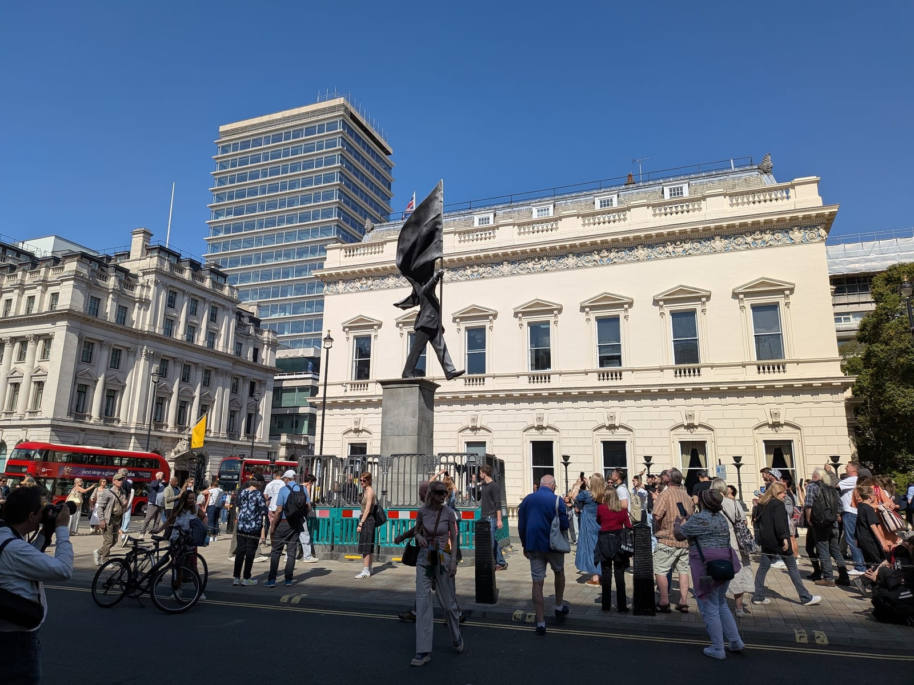

*Blind Patriotism on Waterloo Place, behind the council's barriers. On a sunny weekend, this is the crowd.*

**To stop 2:** north up Regent Street St James's and through Soho to Centre Point, about fifteen minutes.

## 2. Stargazing Children, Centre Point

**Two children lying on their backs on the pavement, one pointing up at the sky**, stencilled at the foot of Centre Point in **December 2025**. The same image appeared on Queen's Mews in Bayswater the same week.

The Centre Point version is on **St Giles Square**, at the junction of New Oxford Street and Charing Cross Road. It is **behind perspex and it has been damaged with paint**, but it is still there and still readable. The Bayswater one has been boarded over, so this is the only one of the pair you can see.

**Look at it from a little way back.** The joke depends on the scale of the tower above: two children staring up at the sky from underneath one of London's most recognisable office blocks.

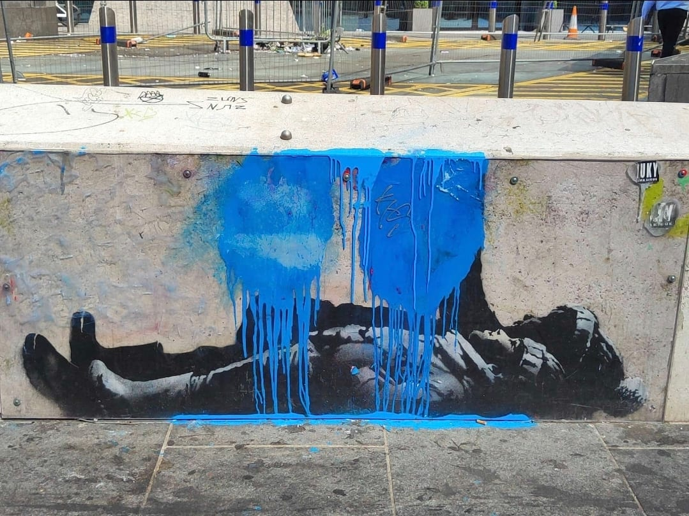

*The Stargazing Children after the blue paint attack. The figures are still there underneath.*

> ⚠️ **The Art of Banksy exhibition is two minutes down Charing Cross Road**, at number 100, and it **closes for good on 29 September 2026**. It is ticketed, and our [street art guide covers it](/articles/london-street-art/#the-art-of-banksy-soho).

**To stop 3: take the Tube.** Walking from here to the next Banksy is about 45 minutes across town with nothing to see on the way. Instead, walk to **Tottenham Court Road** and take the **Central line eastbound to Bank**, four stops. TfL's journey planner puts the whole leg at **about 27 minutes door to door**: six minutes to the station, seven on the train, and fourteen from Bank down Cousin Lane to the river.

Powered by <a target="_blank" rel="sponsored" href="https://www.getyourguide.com/london-l57/">GetYourGuide</a>

## The detour: the rat in the London Transport Museum

**A Banksy you can see up close, indoors, on a rainy day.** A rat dangling from a clock face, painted in **October 2019** on the door of a Transport for London signal cabinet on Church Street in Croydon, outside Banksy's pop-up shop Gross Domestic Product.

TfL took the door away to protect it. Since **August 2025** it has been fixed to a matching cabinet and put on show in a glass case at the museum on **Covent Garden Piazza**, a short walk south of Centre Point. Do it before you take the Tube; Covent Garden station is on the Piccadilly line, so from there change at Holborn for the Central line to Bank.

**It is inside the paid museum.** Entry is an **annual pass: £27 for an adult**, with **under-18s free**, and you also book a free timed ticket for the day. An off-peak pass is **£22.50**, but it is only valid on weekdays after 2pm in term time and the summer holidays. The museum is open **every day, 10am to 6pm**, with last entry at 5.15pm.

**Worth it if you like transport museums anyway**, because the pass covers a year of visits. If the rat is the only reason, the rest of this route is free.

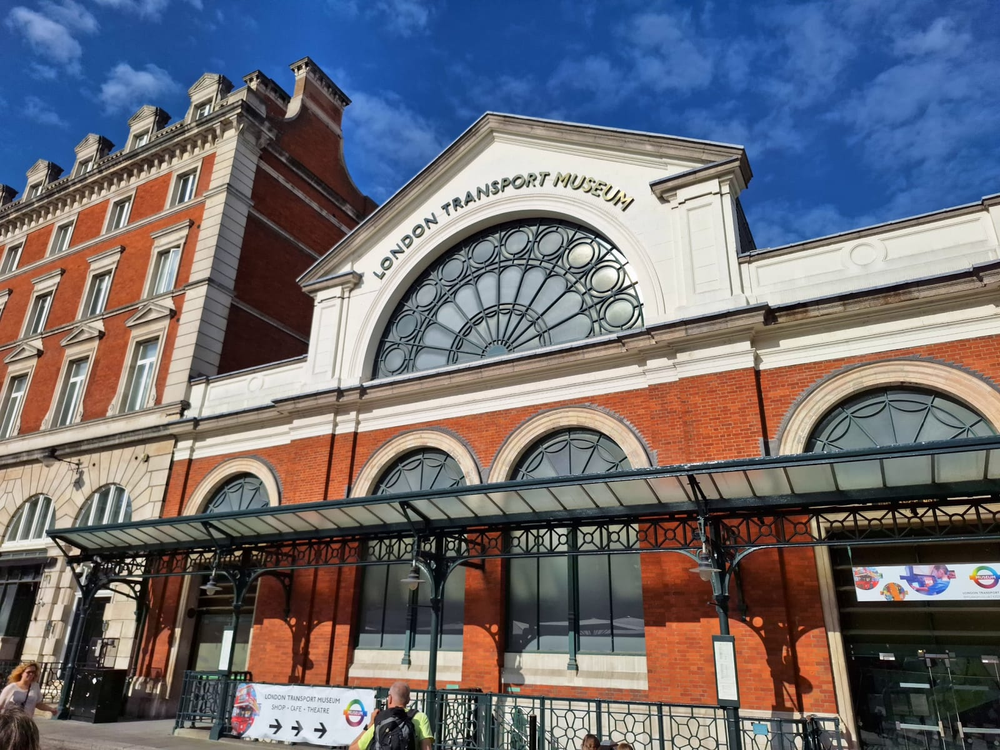

*The London Transport Museum, in the old flower market on Covent Garden Piazza.*

## 3. The Cannon Street rat

**One of the last of Banksy's early London rats**, stencilled in **Steelyard Passage**, the lit footpath that takes the Thames Path underneath Cannon Street station.

It is **small and faded**, with no sign or frame. Walk the passage slowly and look along the walls, because it is very easy to walk straight past. Londonist reported it still visible in May 2026.

The passage is named after the **Steelyard**, the walled trading post of the Hanseatic League's German merchants, which stood on this spot until the Great Fire. A plaque on **Hanseatic Walk**, on the side of the station, marks it.

**Go at the weekend if you can.** This is the City, and the riverside passages are commuter routes on weekdays and almost empty on a Sunday morning.

**To stop 4:** north through Bank and Moorgate to the Barbican, about 25 minutes.

## 4. The Basquiat pair, Beech Street

**Two murals painted in 2017** for the Barbican's Basquiat exhibition. One reworks Basquiat's crown as a ferris wheel. The other shows a figure in Basquiat's own style being searched by the police, a few metres from the gallery that was showing his work.

**Both are in the Beech Street tunnel**, the road that runs underneath the Barbican, towards the Golden Lane end. They are a few seconds apart, and they were put behind perspex soon after they appeared, so they are **in good condition**.

> ⚠️ **Beech Street is a road tunnel, not a walkway.** The pavement is narrow and the traffic is loud. Look, photograph and move on.

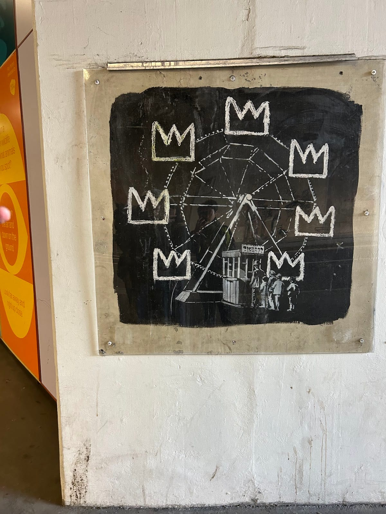

*The ferris wheel, with Basquiat's crowns as the cars.*

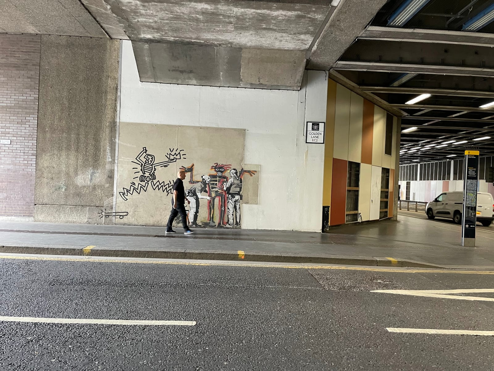

*The police search mural in the tunnel. The Golden Lane sign on the pillar is how you know you are at the right end.*

**To stop 5:** out of the tunnel's eastern end and along Chiswell Street, three minutes.

## The detour: the piranhas at the London Museum

**From 28 November 2026, one of the 2024 animals is back on show.** Banksy's piranhas — a shoal painted on the glass of a City of London police sentry box, so it read as an aquarium — appeared on Ludgate Hill in August 2024, were moved to Guildhall Yard, and then went into storage.

They go on display when the **new London Museum opens at Smithfield on 28 November 2026**. The museum is **free to enter**, and it is about **11 minutes' walk west** of the Basquiat murals, so it slots in between stops 4 and 5. Before that date, there is nothing to see.

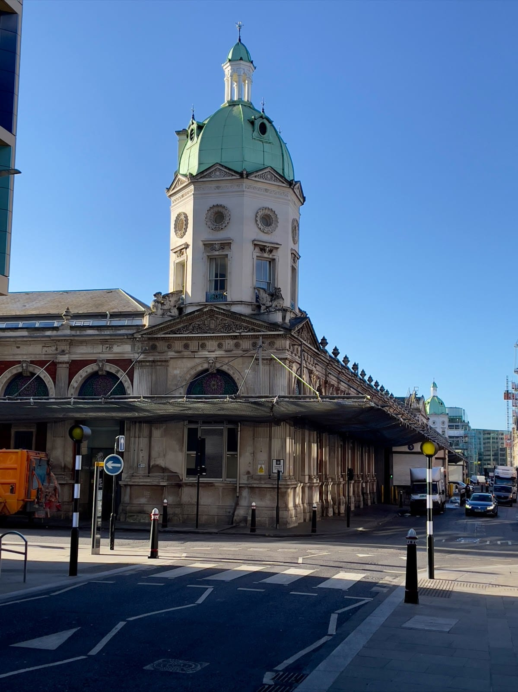

*The old market buildings at Smithfield, the London Museum's new home.*

## 5. The I Love London rat, Chiswell Street

**The best-preserved of Banksy's early rats in London.** A rat wearing a medallion holds up a placard that says **I Love London**, on the wall at **52 Chiswell Street**.

It has been given a plastic cover and has still been attacked several times. The panel under "London" refers to **Robbo**, the graffiti writer with whom Banksy had a long-running feud, and it has been blacked out and written over more than once.

**It is the rat to photograph.** The Cannon Street one is a faded outline; this one still has its detail.

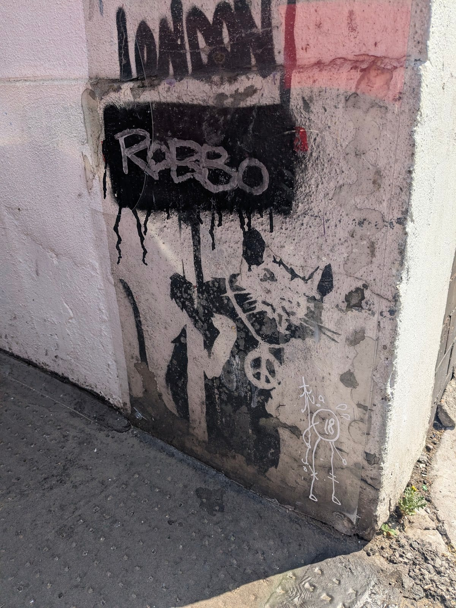

*The I Love London rat, at pavement level on the corner of the building. Look down, not up.*

**To stop 6:** north-east to the Old Street end of Great Eastern Street, about fifteen minutes.

Powered by <a target="_blank" rel="sponsored" href="https://www.getyourguide.com/london-l57/">GetYourGuide</a>

## 6. The Foundry pair, art'otel Hoxton

**Banksy's largest rat, and a television being thrown out of a window**, both painted in **2004** on the back wall of The Foundry, the bar that stood on this corner.

When The Foundry closed they were boarded over, and they spent most of the next two decades out of sight. They were salvaged when the site was demolished and mounted on the **art'otel London Hoxton**, the drum-shaped hotel built in its place, coming back into view in **2023**.

They are on the outside of the hotel at **1–3 Rivington Street**, on the Great Eastern Street corner. **You do not need to go in.** The rat is holding a knife and fork.

**To stop 7:** east across Shoreditch High Street to Brick Lane and south to the Truman Brewery, about fifteen minutes.

## 7. The Pink Car, Old Truman Brewery

**An old pink car sealed in a perspex box** in **Ely's Yard**, the yard behind the Old Truman Brewery. It sits next to another old car by the street artist D*Face.

It has been here for years and it looks it: **the paint is weathered**, and a figure that was painted in the car's window has since been removed and boarded over. It is the least impressive Banksy on the route. It is also the one you end up eating next to.

**Ely's Yard is a public car park** that the Truman Brewery says is open seven days a week and staffed 24 hours a day. At weekends the markets take over most of the yard, which makes it a much better place to stop.

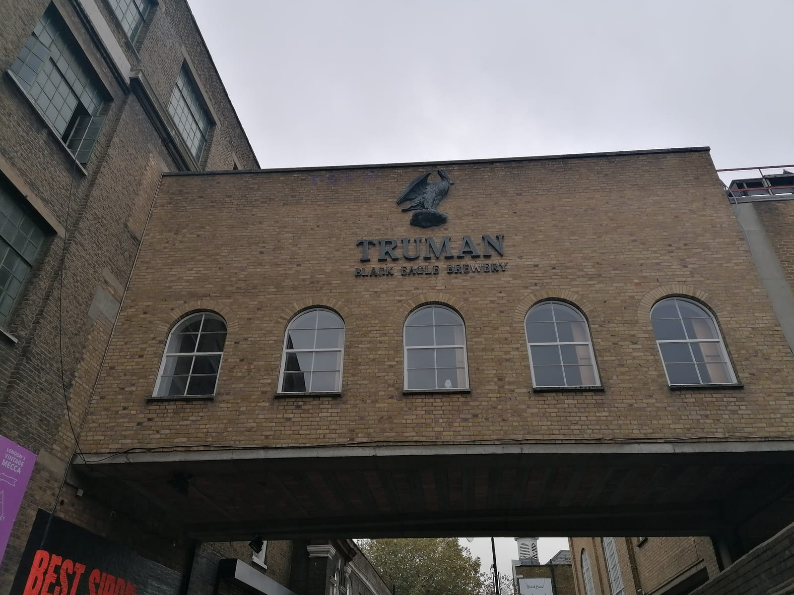

*The Truman Brewery's bridge over Brick Lane. Ely's Yard, and the Pink Car, is just behind it.*

**To stop 8: take the Overground.** Walk to **Liverpool Street** and take the **Weaver line to Stoke Newington**, then walk up to Church Street. TfL's journey planner puts it at **about 47 minutes door to door**: 18 minutes to Liverpool Street, 13 on the train and 16 from Stoke Newington station.

## 8. The Royal Family, Stoke Newington

**One of Banksy's earliest London works, and one of the best preserved.** A mock royal family waves from a balcony halfway up the side of a building on **Stoke Newington Church Street**, where it has been since 2001.

It has survived several attempts to remove it. In 2009 the council started painting the wall black, until locals realised what was happening and got the work stopped — which is why the family is now surrounded by black paint.

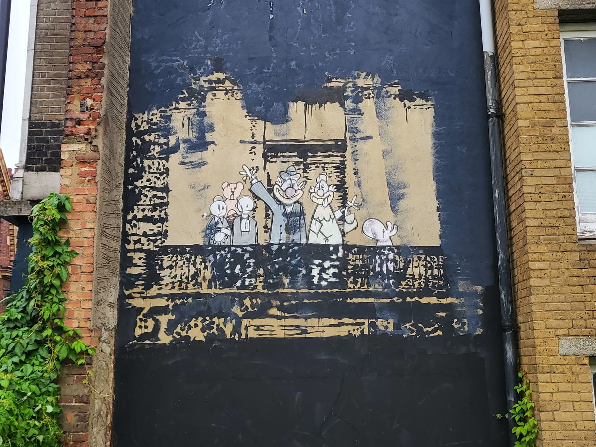

*The Royal Family, still waving, in the square of original wall the council's black paint did not reach.*

**Finish here because it is the other end of the story.** You started at a statue that appeared this year; this is one of the first things he put on a London wall, twenty-five years earlier, still waving.

It is free and visible from the pavement at any hour. Stoke Newington station, on the Weaver line back to Liverpool Street, is about 15 minutes' walk.

---

## Where to eat

**The Oyster Shed, at stop 3.** A Young's pub at **1 Angel Lane**, right by Steelyard Passage. Open **Monday to Saturday 10am to 11pm** with food from noon to 10pm, and **Sunday 11am to 5pm** with food from noon to 4pm.

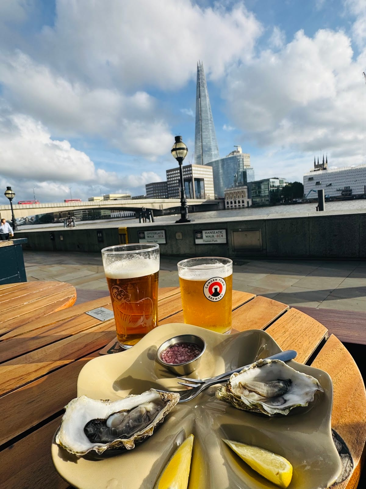

*Oysters and a pint at the Oyster Shed, with the Shard across the river.*

**Upmarket and Ely's Yard, at stop 7.** **Upmarket, at 83 Brick Lane**, is the Truman Brewery's food hall, with more than forty street food traders. It is open **every day, 11am to 6pm Monday to Saturday and 10am to 6pm on Sunday**. The food trucks in Ely's Yard, next to the Pink Car, also trade **seven days a week**. Eat here before the train if you are going on to Stoke Newington.

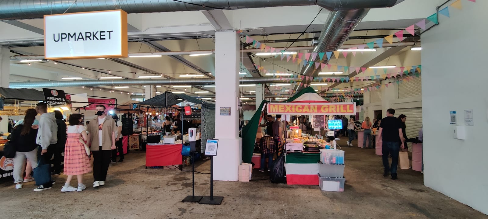

*Upmarket, the Truman Brewery's food hall, a couple of minutes from the Pink Car.*

**Beigel Bake, 159 Brick Lane**, five minutes north, is **open 24 hours a day, seven days a week**.

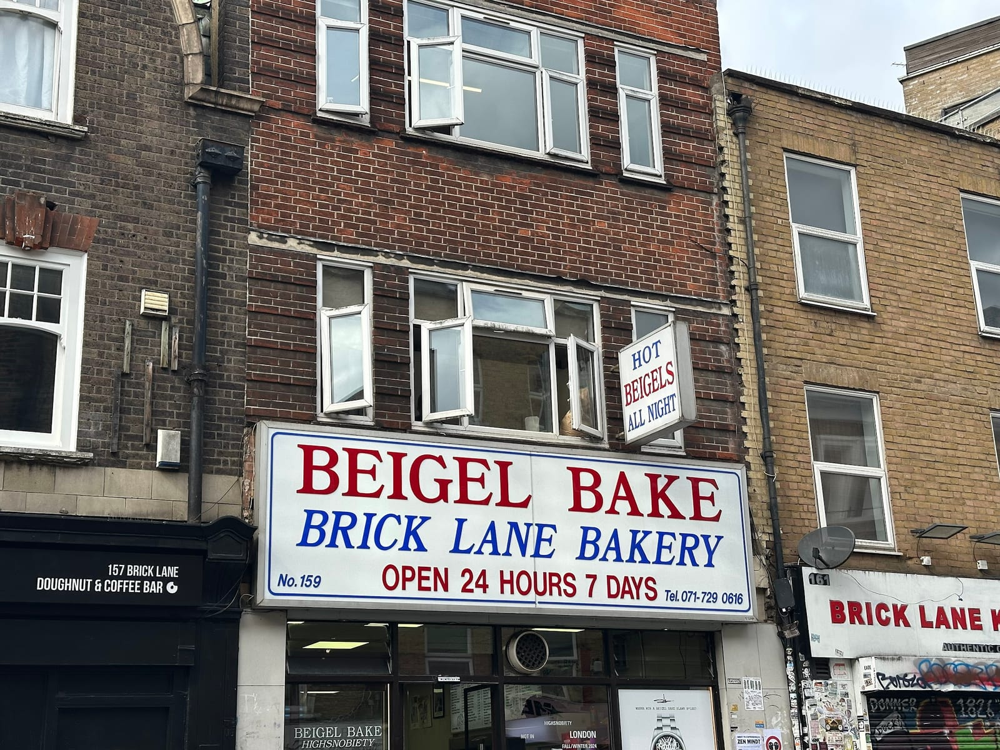

*Beigel Bake at 159 Brick Lane. The sign is not exaggerating.*

For the rest of Brick Lane and Spitalfields, see the [Shoreditch area guide](/articles/shoreditch-area-guide/#where-to-eat-and-drink).

## The best day to go

**Sunday.** Every Banksy on this route is outdoors and can be seen on any day, so the day decides what happens around them rather than whether you see them.

| Day | What you get |
| --- | --- |
| **Sunday** | The best day. The City is empty, so Steelyard Passage and Beech Street are quiet, and you reach Brick Lane on the one day its street market runs. The Oyster Shed closes at 5pm |
| **Saturday** | Nearly as good. City quiet, the Backyard Market open on Brick Lane, Upmarket open. No Brick Lane street market |
| **Monday–Friday** | Everything on the route is there, but the City is at full volume: commuters in Steelyard Passage, traffic in the Beech Street tunnel and busier trains |

**Nothing on the route has opening hours** except the two museum detours and the places to eat. The street art does not close.

**What does change is the future.** Blind Patriotism is waiting on a council decision, and paint does not last: the Stargazing Children was damaged within months of appearing. If there is one work you want to see, see it soon.

**On time of day:** on a Sunday, leave Waterloo Place at about 11am. The Tube gets you to Steelyard Passage around noon, when the Oyster Shed's Sunday kitchen opens. After lunch you are through the empty City and at the Pink Car by about 2pm, an hour before Brick Lane's street market packs up at 3pm, and in Stoke Newington by about 3pm.

Powered by <a target="_blank" rel="sponsored" href="https://www.getyourguide.com/london-l57/">GetYourGuide</a>

## Getting there and back

**Start:** Piccadilly Circus (Bakerloo, Piccadilly) is a few minutes from Waterloo Place; Charing Cross is about ten. **Finish:** Stoke Newington, on the Weaver line back to Liverpool Street.

**The easy place to stop is stop 7.** The Pink Car is a few minutes' walk from Shoreditch High Street station, you have seen nine of the ten works, and it is where the food is. Stoke Newington is worth the extra 47 minutes if the Royal Family is the piece you most want to see.

**Paying for the rides:** tap in and out with the same contactless card or phone on both the Tube and the Overground. Our [guide to London fares](/articles/london-public-transport-costs-and-fares/) explains the daily cap.

## Carry on walking

- **[Shoreditch and Spitalfields](/articles/shoreditch-spitalfields-walk/)** — its stop 5 is the Old Truman Brewery, beside the Pink Car at stop 7. Break off there for Brick Lane, Christ Church and Spitalfields Market.
- **[Westminster: the bridge to Trafalgar Square](/articles/westminster-walk/)** — finishes five minutes from Waterloo Place, so walk it first and start this one straight after.
- **[The City of London](/articles/city-of-london-walk/)** — starts at Bank, where the Central line drops you before stop 3.

## What to do with the rest of the day

- **[Banksy and London street art](/articles/london-street-art/)** — every surviving Banksy in London, the 2024 animals and the indoor collections.
- **[The Shoreditch area guide](/articles/shoreditch-area-guide/)** — the murals on Rivington, Redchurch and Hanbury Streets, which change month to month.
- **[Free things to do in London](/free/)** — every Banksy on this route costs nothing.
- **[London's best markets](/articles/best-london-markets/)** — where Brick Lane and the Truman Brewery markets sit among the rest.
