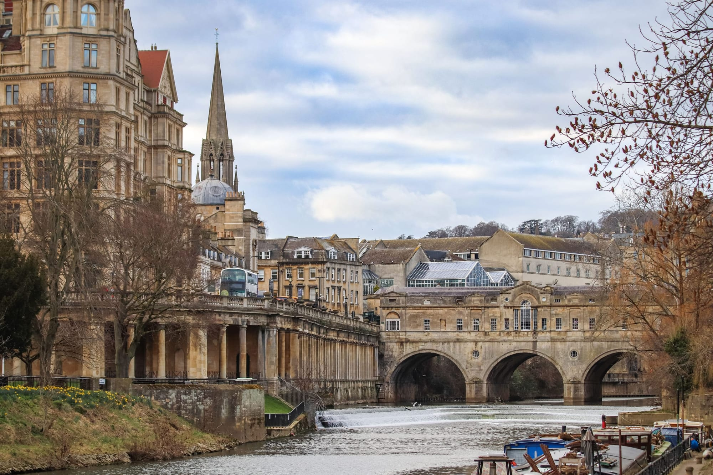
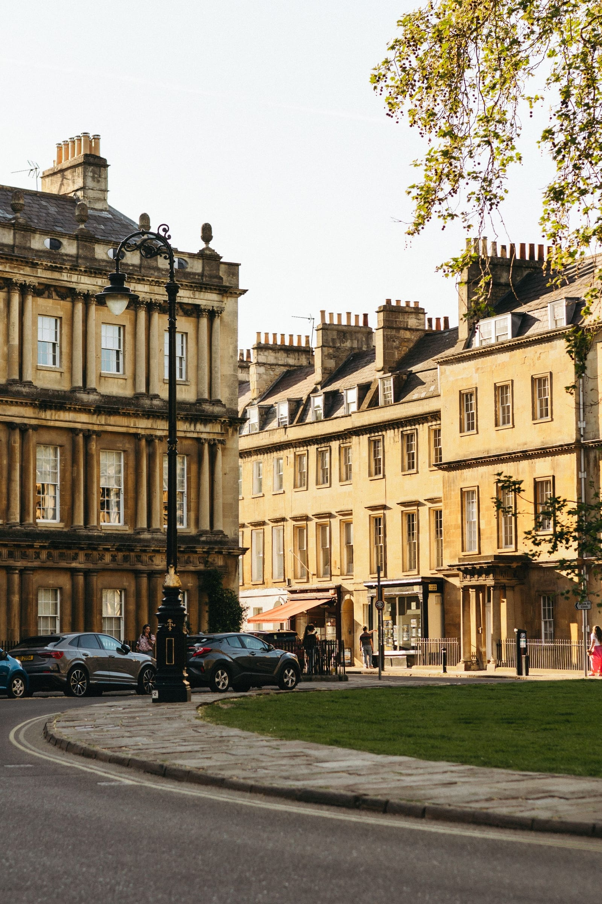
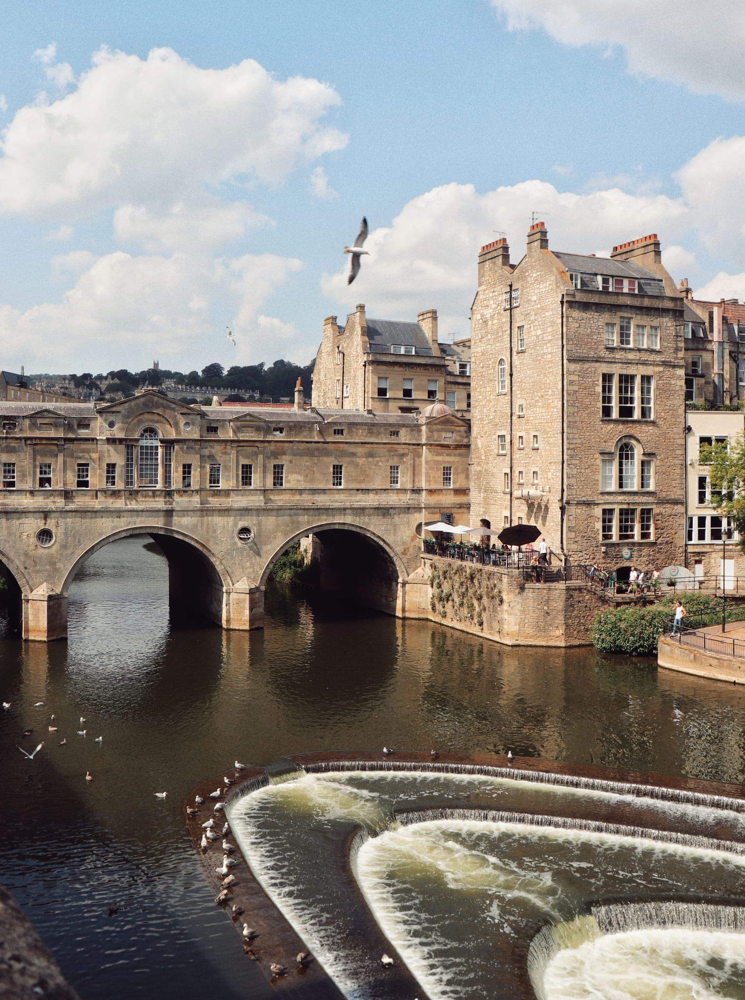
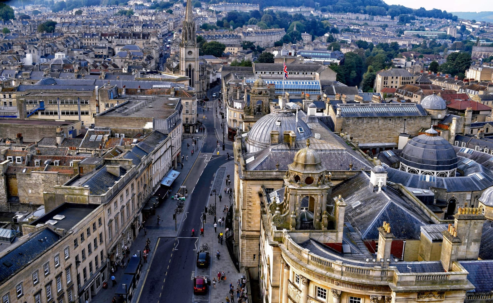

**Paddington to Bath Spa is 1 hour 15 minutes on a direct train, and the Roman Baths cost £26.50 on a weekday against £29.00 at the weekend.** Both of those numbers decide the day: Bath is close enough that you do not need to leave early, and its one unmissable attraction is cheaper Monday to Friday.

It is also the rare day trip where the station puts you in the middle of everything. The Roman Baths, the Abbey, Pulteney Bridge, the Circus and the Royal Crescent are all within fifteen minutes' walk of each other, and under ten minutes from the platform.

> 💡 **The Short Version:** **Paddington to Bath Spa, 1h15 direct.** Off-Peak Return **£75.90**, or **£47.60** in Advance singles booked a month out. **Roman Baths £26.50 weekday, £29.00 weekend** in advance, **£2 more on the door**, timed slots, **allow 90 minutes to 2 hours**. **Thermae Bath Spa rooftop pool £44 weekdays, £49 weekends**, two hours, **16 and over only**, and walk-in slots run out. **Bath Abbey £9**, tower tour **£18**, and Sunday visiting is only **13:00–15:30**. **No.1 Royal Crescent £16**, closed Mondays. **Cars pay nothing in the Clean Air Zone**; older vans pay £9. **2FOR1 covers almost nothing here.** Last direct train back **23:05** on a weekday.

Powered by <a target="_blank" rel="sponsored" href="https://www.getyourguide.com/london-l57/">GetYourGuide</a>

*Photo: Lebele, Pexels.*

## Getting there

### The train

| | London Paddington → Bath Spa |
| --- | --- |
| **Operator** | Great Western Railway, direct |
| **Fastest** | **1h 15** — the 09:30 arrives 10:45 |
| Off-Peak Return, walk-up | **£75.90** |
| Off-Peak single | £40.50 |
| **Advance singles, a month out** | **£22.60 out, £25.00 back** |
| Walk to the Roman Baths | Under 10 minutes |

**Advance is the whole saving on this route: £47.60 against £75.90, about £28 or 37% cheaper.** Unlike Cambridge, where the walk-up fare is already low, Bath punishes you for turning up and buying a ticket. Book the specific trains and take the hit on flexibility.

> ⚠️ **The cheapest fare on the day is a trap.** On the Tuesday we checked, the lowest same-day single from Paddington was £29.40 — but that is the 09:44 routed via Waterloo and Salisbury, 3 hours 26 minutes with two changes. The direct 09:30 was £47.50 that morning.

### The coach

**National Express service 403 runs from Victoria Coach Station to Bath Spa Bus Station up to ten times a day, fastest in 2 hours 50 minutes, from £5.40 one way** including the £1.50 booking fee. The first leaves Victoria at 07:00 and arrives 10:00; the last leaves at 22:30 and gets in at 01:20. The bus station is on Dorchester Street, a minute from the rail station, so you arrive in the same spot the train does.

It is a third of the train's price and more than twice the journey time. For a day trip that means roughly six hours in Bath instead of nine.

### Driving, and the Clean Air Zone

Bath is **100 miles west of London** and **10 miles from M4 Junction 18** down the A46. The city runs a charging clean air zone over the centre, seven days a week, midnight to midnight, all year — and the thing visitors get wrong is assuming it works like London's.

> 💡 **Cars and motorbikes are never charged in Bath.** It is a Class C zone. M1 cars, SUVs, four-by-fours and campervans registered as M1, cars with a historical vehicle tax class, pre-March-2001 PLG cars and almost all motorcycles pay nothing, whatever their emissions, even when used for work.

| Vehicle | Daily charge |
| --- | --- |
| **Cars and motorbikes** | **No charge** |
| Taxis and private hire (M1 car or M2 minibus) | **£9** |
| Minibuses (M2) | **£9** |
| **Vans, light goods, pick-ups and some campervans and four-by-fours (N1 under 3.5t, or pre-2001 PLG vans)** | **£9** |
| Coaches and buses (M3) | **£100** |
| Trucks and lorries (N2 over 3.5t, N3 over 12t) | **£100** |
| Private HGVs — horse transporters, motorhomes (PHGV) | £100, or £9 if registered with the council |

Charges apply only to **Euro 1–5/V diesel and Euro 1–3 petrol or earlier**, and they apply whether the vehicle is private or commercial.

> ⚠️ **The hire-car trap is the vehicle category, not the car.** Some SUVs, four-by-fours and campervans are registered as **N1** rather than M1, which makes them chargeable at £9. The council's own advice is to check the registration number on the GOV.UK vehicle checker before you drive in.

**The three park and ride sites all sit outside the zone**, which is the simplest way to sidestep the question entirely: Lansdown on service 31 into Milsom Street, Newbridge on the 21 into Westgate Buildings, and Odd Down on the 41 and 4 into SouthGate. Parking is free at most sites and you pay only the bus fare. In the centre, **Charlotte Street is the long-stay car park with no height restriction**, open 24 hours with no maximum stay — and the one the council points vans, motorhomes and campervans towards. On-street parking charges apply every day from 08:00 to 19:00, and it is free outside those hours and on bank holidays.

## The coach day trips, and what they include

**Most people who visit Bath from London do it on a coach tour, usually paired with Stonehenge**, and that is a fair choice: the two are 40 minutes apart and awkward to link by train. Prices from London, at the time of writing:

| Trip | From |
| --- | --- |
| **Stonehenge and Bath** | **£69** |
| Windsor, Stonehenge and Bath | £71 |
| **Stonehenge and Bath, with Stonehenge entry included** | **£85** |
| Bath, Avebury and Lacock village | £84 |
| Oxford and Bath, small group | £99 |
| Bath and the Cotswolds | £102 |
| Small group Stonehenge, Bath and the Cotswolds | £154 |

**The train still wins if Bath itself is the point.** A tour gives you two or three hours in the city, which is enough for the Roman Baths or a wander, not both. Advance train tickets at £47.60 return give you the whole day.

> ⚠️ **No Bath coach tour we checked includes Roman Baths admission as standard.** Several name it in the title and then sell entry as an optional extra, so you pay the £26.50 on top. Read the includes list, not the title, and budget for the ticket.

Powered by <a target="_blank" rel="sponsored" href="https://www.getyourguide.com/london-l57/">GetYourGuide</a>

## The Roman Baths

This is the reason to come, and its pricing moves on two axes at once: the day of the week and the time of year.

| Ticket, booked in advance, 1 Sep – 31 Oct 2026 | Weekday | Weekend / bank holiday |
| --- | --- | --- |
| **Adult (19+)** | **£26.50** | **£29.00** |
| Student | £25.50 | £28.00 |
| Senior (65+) | £25.50 | £28.00 |
| **Child (6–18)** | **£19.50** | **£22.00** |
| **Family, 2 adults + 2–4 children** | **£69.00** | **£77.00** |
| Family, 2 adults + 1 child | £63.00 | £70.00 |
| Family, 1 adult + 2–4 children | £51.00 | £57.00 |

**Tickets bought on the day cost £2 more each.** Under-6s are free but still need a reserved ticket.

**November is the cheapest month on the calendar**: £23.50 adult on a weekday, £26.50 at the weekend, with children at £16.50 and £19.50 and a 2+2 family at £59.00. December goes straight back to the September level, because of the Christmas market.

> ⚠️ **Every ticket carries an allocated time slot and you cannot join the queue without one.** Tickets often sell out in advance, especially over the summer; the museum recommends booking at least 24 hours ahead. You have a 15-minute grace period from your slot. Tickets are non-refundable, but the date and time can be moved before your visit by phone or email, subject to availability.

**Allow 90 minutes to 2 hours — that is the museum's own figure, and the site warns the last slots of the day may not be long enough to see everything.** There is **no re-entry**, because the route runs one way.

**The audio guide is included**, in thirteen languages, with a children's version narrated by Michael Rosen, a hand-held BSL video guide and an enhanced audio-description version. A new recording brings spoken Latin back to the site with Sir Stephen Fry. Admission also includes a taste of the spa water.

**If you want a guide instead:** shared one-hour tours leave the Great Bath hourly from 10:00 to 15:00, **£8 per person on top of admission**, free for under-6s, capped at sixteen people. Private tours run at 11:00 and 15:00 for up to ten people at **£80 per tour** plus admission. Book the admission ticket for an hour before the tour so you have time to reach the Great Bath.

**Opening hours, 1 September to 31 October 2026: daily 09:00–18:00, last admission 17:00.** The Roman Baths open every day of the year except Christmas Day and Boxing Day.

**Cheap ways in, if they apply to you.** £1 tickets for UK visitors on Universal Credit, Pension Credit or ESA. Free entry for full-time students at Bath Spa University, the University of Bath and Bath College with ID, and for Discovery Card holders. Free carer or companion ticket. Blue Peter badge holders get in free with a paying adult.

**Two practical rules people hit at the door:** there is a threat-detection screening and possible bag search on the way in, and **backpacks over 30 litres and wheeled luggage are not allowed on site, with no storage available.**

## Thermae Bath Spa

Bath is the only city in Britain with naturally hot springs you can actually get into, and the rooftop pool is where you do it.

| | Price |
| --- | --- |
| **Thermae Welcome, 2 hours, Mon–Fri** | **£44** |
| **Thermae Welcome, 2 hours, Sat–Sun** | **£49** |
| **Twilight package** | **£60 for one, £100 for two** |
| Cross Bath, 90 minutes, Tuesdays only | £40 per person |
| Treatment packages | £130–£190, or £300–£320 for two |

**The £44 session covers the open-air rooftop pool, the indoor Minerva Bath, the Wellness Suite and the Springs Café**, with towel and robe included. The spa is open 09:00–21:30, with pools and the Wellness Suite closing at 21:00.

> ⚠️ **Minimum age 16, and the pre-bookable slots are limited.** Thermae Bath Spa is adults-only — 16 to get in, 18 for treatments. Only a limited number of Thermae Welcome slots can be booked ahead; the rest are released on the day as walk-ins, first come first served, run as a virtual queue until the day's capacity is gone. The spa's own advice is to arrive early.

**The Twilight package is the one worth knowing about for a day trip**, because it maps onto the late train home. £60 for one person or £100 for two — the two-person price flagged as a Monday-to-Thursday September offer, full price on Monday and Friday. You get a two-hour session each plus a sharing platter with a seasonal side and a glass of wine, beer, juice or water each in the Springs Café. Monday to Friday only, excluding bank holidays, entry from **15:00 with last full entry at 18:00**, and it is booked by phone on 01225 33 1234. Friday evenings go first.

> 💡 **Travelling with a 12 to 15-year-old? The Cross Bath, not the main spa.** The separate open-air Cross Bath runs 90-minute sessions on **Tuesdays only**, at 10:00, 12:00, 14:00, 16:00 and 18:00, at **£40 a head**. Under-12s are not allowed, but 12 to 15s can go accompanied one-to-one — which the main spa does not permit at any age under 16.

Date and time changes cost £5 with 24 hours' notice; cancelling carries a £10 admin charge.

> ⚠️ **Read the includes list, not the title, on any coach tour.** A large share of the Bath products sold out of London name an attraction in the title and then make its entry an optional paid extra — one called "Bath and Cotswolds Day Trip with Roman Baths" lists "Entry to the Roman Baths (ONLY IF PURCHASED)" and adds that admission fees are not included unless the paid option is selected. Another of the most-booked trips puts "Admissions to Windsor Castle, Stonehenge and Roman Baths (IF PURCHASED)" in its inclusions. **Assume the Roman Baths ticket is yours to buy**, and treat the includes list as the only thing that counts. The three tours above are the ones whose pages say plainly what is and is not in the price.

Most Stonehenge trips from London bundle Bath in, which is the other way round to think about this day — see [Stonehenge from London](/articles/stonehenge-day-trip/) for which of those actually include the stones.

## The rest of the day

*Photo: Amine Kubranur Cakiroglu, Pexels.*

### Bath Abbey

| Ticket | Price |
| --- | --- |
| **Abbey and Discovery Museum, adult** | **£9.00** |
| Student with ID | £7.50 |
| **Child (5–15)** | **£5.00** |
| Families | 10% off |
| **Tower Tour, adult** | **£18.00** |
| Tower Tour, student / child 5–15 | £15.00 / £12.00 |
| Audio guide | £3.50 |

**The Tower Tour ticket includes the Abbey and the Discovery Museum, so you buy one or the other, not both.** It runs Monday to Saturday subject to availability. No under-5s, 5 to 15s must be accompanied, no bags up the tower, and sensible closed shoes are required — no flip flops, heels or sandals. It is not advised if you struggle with mobility, claustrophobia or vertigo.

> ⚠️ **Sunday visiting is 13:00 to 15:30 only.** Monday to Friday the Abbey is open 10:00–17:30 and Saturday 10:00–18:00, with last entry 30 minutes before closing. It also closes for services and events at short notice: in the autumn of 2026 that includes **19 October (closed all day)**, **22 October (closed to visitors, though tower tours and the shop run)** and **8 November (closed for Remembrance services)**.

Free for Discovery Card holders and BA1 and BA2 residents with proof of address; carers free.

### The Royal Crescent, the Circus and Pulteney Bridge

*Pulteney Bridge and the weir, free and two minutes from the Baths. Photo: yoldakocayanlaar uk, Pexels.*

**These are free, and they are the best thing in Bath after the Baths.** The **Royal Crescent** is thirty Bath stone houses built between 1767 and 1775 to designs by John Wood the Younger; **the Circus**, by his father John Wood the Elder, came first, in 1754 to 1769, and **Queen Square** before that, in 1729 to 1734. Walk up from the Abbey through Queen Square, the Circus and Brock Street and you get all three in about fifteen minutes, finishing on the lawn in front of the Crescent.

**Pulteney Bridge** is Grade I listed, designed by Robert Adam between 1769 and 1774 for William Johnstone Pulteney, with shops across both sides — you can cross it without realising you are on a bridge at all, which is the point of it. Free, and the weir below is the other view everyone photographs.

**No.1 Royal Crescent** is the one you can go inside. **£16.00 adult, £14.50 concessions, and under-18s free with an accompanying adult** at up to four children per adult. A temporary exhibition is £7 on its own or £2.50 added to main entry. Discovery Card holders get 25% off with the code DISCOVERY26 and Art Fund members 50% with ARTFUND26.

> 💡 **Your No.1 Royal Crescent ticket is good for a year.** Keep it and the named holder gets free entry for up to 12 months.

**Open Tuesday to Sunday 10:00–17:30, last entry 16:30, and closed Mondays** except during local school holidays and bank holidays. It is also shut **16–28 November and 25–26 December 2026**. Prams and buggies cannot go through the house.

### The Jane Austen Centre

**£18 adult online, £9.95 child, £16.30 concessions for students and over-60s, £40.95 for two adults and up to three children, £30.45 for one adult and up to three children** — prices include booking fees, and pre-booking is recommended. It is at **40 Gay Street, BA1 2NT**, on the walk between Queen Square and the Circus, with a Regency Tea Room on site and costumed character actors in the exhibition.

Hours move with the season: 09:45–18:00 daily from 1 July to 21 September, 10:00–17:30 daily from 22 September to 2 November, then 10:00–16:30 Sunday to Friday and 10:00–17:30 on Saturdays through the winter. **Last entry is one hour before closing.**

### Two free museums, and one that is shut

**The Bath World Heritage Centre is free and open daily 10:00–17:00**, closed only on 25 and 26 December. Interactive displays on the hot springs, the Roman remains and the Georgian town planning, plus walking trails and guides to take away — a sensible twenty minutes before or after the Baths.

**The Victoria Art Gallery's Upper Gallery is free**, with a bookable ticket, and takes about 45 minutes to an hour. Its ticketed exhibitions in the lower galleries are £9.00 adult, £4.00 child aged 6 to 18 and £20.50 for two adults and up to four children until 19 November 2026, rising to £10.00, £5.00 and £22.50 from 20 November. Art Fund members pay half.

**Fashion Museum Bath is temporarily closed and reopening in 2030**, in a new building in the centre of the city. The collection is out on the road in the meantime as a travelling mini museum, so check where it has got to rather than walking to the Assembly Rooms expecting to find it.

### Prior Park and the Bath Skyline

**Prior Park Landscape Garden** is National Trust, **£12.00 adult and £6.00 child 5–17 without Gift Aid**, £30.00 for two adults and up to three children, under-5s free, no pre-booking needed. The draw is one of only four Palladian bridges in the world. On the day we checked, the garden and Tea Cabin were open 10:00–16:00.

> ⚠️ **There is no parking at Prior Park, and none at Prior Park College either, despite sharing the postcode.** Take the **number 2 bus from Dorchester Street or North Parade**, which stops in front of the entrance gate every 10 minutes Monday to Saturday and every 20 minutes on Sunday. On foot it is a mile from the back of the station and very steep.

**The Bath Skyline is free.** The full circuit is a **6-mile circular walk** through meadows, woodland and farmland with the city below you; there is a **3-mile circular** from the city centre out and back, and a **2-mile accessible loop** around Claverton Down. The nearest point to the centre is Bathwick Fields, 0.9 miles from the Abbey, and the start of the walk is 0.8 miles from Bath Spa station — or take the U1 or U18 from Dorchester Street and get off at Cleveland Walk on Bathwick Hill. Sheep and cattle graze parts of it, so dogs go on leads through livestock fields.

## What 2FOR1 covers in Bath

Less than anywhere else worth visiting this far from London, and none of the headline attractions.

- **Mary Shelley's House of Frankenstein** — 2FOR1
- **Bridgerton Tour of Bath walking tour** — 20% off

**The Roman Baths, Thermae Bath Spa, Bath Abbey and the Jane Austen Centre are not in the scheme at all.** The offer needs a valid National Rail ticket in the first place, which on this route you will be buying anyway. Full rules in our guide to [National Rail 2FOR1](/articles/national-rail-2for1-london-attractions/).

## How long the day takes, and the trains home

*Photo: Jocelyn Erskine-Kellie, Pexels.*

**Leave Paddington at 09:30 and you are in Bath at 10:45, which makes this a genuine full day rather than a rush.** A working shape: Roman Baths on a pre-booked late-morning slot, lunch, the walk up through Queen Square to the Circus and the Royal Crescent, the Abbey or No.1 Royal Crescent in the afternoon, and the spa from 15:00 if you have booked the Twilight package.

| Last direct train, Bath Spa → Paddington | Departs | Arrives |
| --- | --- | --- |
| **Weekday** | **23:05** | 00:39 |
| Weekday, previous | 22:13 | 23:59 |
| **Saturday** | **22:45** | 00:24 |
| **Sunday** | **22:41** | 00:15 |

> ⚠️ **Sundays are a different railway on this route.** After the 22:41 the next service takes **6 hours 54 minutes** with a change, arriving 06:29 — so the last Sunday direct is a hard deadline, not a soft one. Sunday mornings are affected too: on the three Sundays we checked, departures around 09:30 ran 1h49 to 1h51 with a change, and the first direct train was not until about 10:30. One of them also showed a 2h56 routing with two changes. Check your actual date before planning a Sunday around an early arrival.

## What people get wrong

- **Buying the train ticket on the day.** £75.90 walk-up against £47.60 in Advance singles is the single biggest saving on this trip.
- **Taking the £29.40 "cheapest" same-day fare** and discovering it goes via Salisbury in 3 hours 26 minutes.
- **Visiting the Roman Baths at the weekend** when the same ticket is £2.50 cheaper on a weekday, and £3 cheaper again in November.
- **Booking a late Roman Baths slot.** The museum itself says the last slots may be too short, and there is no re-entry.
- **Turning up at Thermae Bath Spa expecting to walk in.** Pre-bookable slots are limited and the day's walk-in capacity runs out.
- **Taking a 15-year-old to the rooftop pool.** Minimum age 16 — the Cross Bath on a Tuesday is the only way in under that.
- **Going to Bath Abbey on a Sunday afternoon.** Visiting is 13:00 to 15:30, and the tower tours do not run at all.
- **Planning around No.1 Royal Crescent on a Monday.** Closed, outside school holidays and bank holidays.
- **Worrying about the Clean Air Zone in a hire car.** Cars pay nothing. Check the category if it is an SUV, four-by-four or campervan, because some are registered as vans.
- **Driving to Prior Park.** There is no car park, and the postcode leads you to a school that is not the garden.
- **Booking a coach tour whose title names the Roman Baths.** Read the includes list — entry is usually an optional extra.

All prices checked 12 September 2026.

## Continue planning your day out

- 🗿 **[Stonehenge from London](/articles/stonehenge-day-trip/)** — the trip most Bath coach tours are really selling, and which ones include the stones.
- 🏰 **[Windsor from London](/articles/windsor-day-trip/)** — the shortest of the big day trips, and the one with a closed-on-Tuesdays problem.
- 🎓 **[Cambridge from London](/articles/cambridge-day-trip/)** — priced and timed the same way, with a cheaper walk-up fare.
- 🎟️ **[National Rail 2FOR1](/articles/national-rail-2for1-london-attractions/)** — the rules, the eVouchers, and why contactless disqualifies you.
- 🗺️ **[Day trips from London](/articles/day-trips-from-london/)** — what the others cost, how long they take, and which days they are shut.
