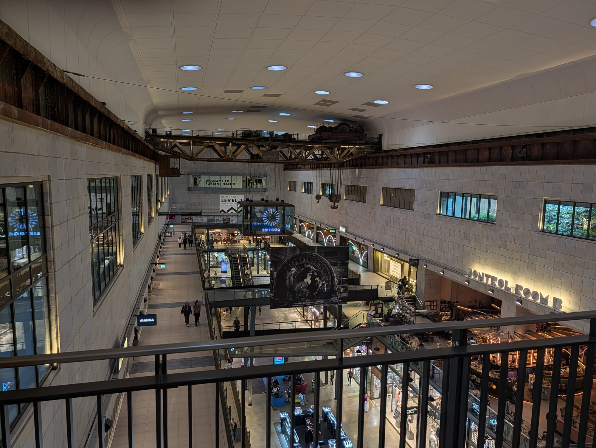
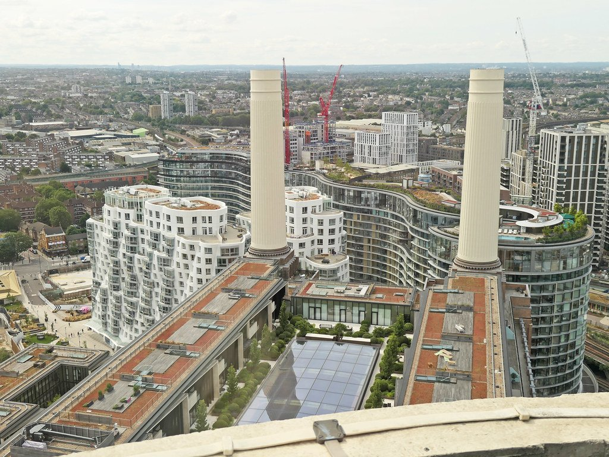
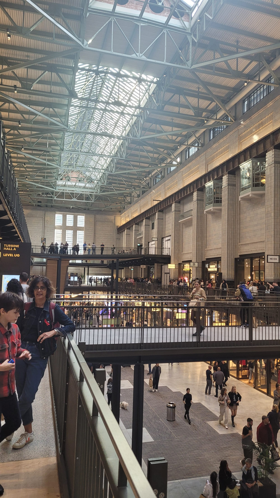
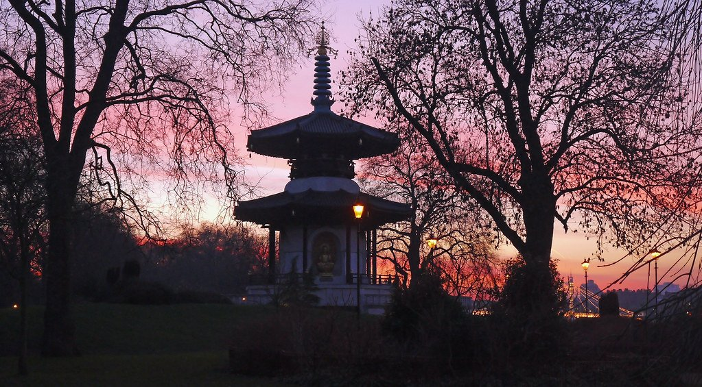

For forty years Battersea Power Station was a ruin with four chimneys — the most recognisable derelict building in Britain, familiar from the cover of Pink Floyd's *Animals*. It reopened in 2022 after one of the largest restoration projects in Europe, and you can now walk into both turbine halls for free.

Fifteen minutes west is Battersea Park, which was here long before the power station and is the better half of the visit.

Battersea has its own share of the commemorative plaques marking where notable people lived or worked - see them on our [interactive map](/plaques/?area=battersea).

## Why visit — and who should skip it

**Come here if** you like industrial architecture, or you want a park with a river view that is not full of tourists. The two turbine halls are genuinely impressive and cost nothing to walk into.

**Skip it if** you dislike shopping centres. Beyond the shell and the turbine halls, much of the Power Station is a mall — a very handsome one, but a mall. If that is not the draw, the park alone justifies the trip.

## Top sights and activities

1. **Battersea Power Station** — Free to enter. **Turbine Hall A** is restored 1930s art deco; **Turbine Hall B** is 1950s, plainer and more industrial. Walking between the two is the point.
2. **The Chimney Lift** — A glass lift 109 metres up inside the north-west chimney, opening at the top for a 360-degree view. **Renamed from Lift 109**, and **closed for maintenance at the time of writing** — check before travelling. Adult tickets from £16 online against £24 on the day.
3. **Battersea Park** — 200 acres with a boating lake, a Grade II listed Victorian layout, and a riverside path facing Chelsea.
4. **The Peace Pagoda** — A Buddhist monument given to London in 1985, built by monks to mark 40 years since Hiroshima and Nagasaki. On the riverside path, with a resident monk.
5. **Albert Bridge** — Cast-iron, painted pink and green, and still signed asking troops to break step. **Closed to motor traffic since February 2026** after a crack was found in a cast-iron component; **pedestrians and cyclists still cross**, and reopening to vehicles is promised for 2027.
6. **Battersea Park Children's Zoo** — Small, well run and good for young children. Ticketed.
7. **The Thames Path** — East towards Vauxhall and Westminster, west towards Wandsworth. Flat the whole way.

*Inside the restored power station. Control Room B is a bar anyone can walk into; Control Room A is a private events space, open to the public only on the Monday guided tour.*

*The view from the Chimney Lift, which takes you up inside one of the chimneys. The glass lift is the only way to the top. Photo: [amandabhslater](https://www.flickr.com/photos/15181848@N02/53077081501), [CC BY-SA 2.0](https://creativecommons.org/licenses/by-sa/2.0/).*

## Key streets and micro-districts

*Turbine Hall A, restored to its 1930s art deco scheme. Free to walk into.*

### The Power Station and Electric Boulevard

The building reopened in **October 2022** after decades derelict, and the thing worth knowing before you go is that **walking into it is free**. Over 170 shops, bars and restaurants now fill it, but the fabric is the reason to come: only the Chimney Lift, the cinemas and the ticketed exhibitions cost anything.

**Walk between the two turbine halls, because they are not the same building.** **Turbine Hall A** is the 1930s one — Art Deco, restrained, the better room. **Turbine Hall B** is 1950s, plainer and frankly industrial, built when the money and the mood had changed. Standing in one and then the other is the clearest architectural lesson in the place and it costs nothing.

**Control Room B** is a bar on a mezzanine over Turbine Hall B, surrounded by the original 1950s dials and switchgear, and **anyone can walk in** — children welcome until 5pm. **Control Room A is not open** in the same way: it is a private events space, and the only way in is the official **guided tour, which runs on Mondays only** and releases tickets four weeks ahead. Most guides imply you can wander into both.

The free heritage bits people miss: the **Power of Place** exhibition on Level 1, the original plant machinery displayed as sculpture across Power Station Park, and **a cut section of one of the original chimneys** taken down during the rebuild.

**Electric Boulevard** is the pedestrian street running south, with its own Tube entrance since October 2025. Two Frank Gehry-designed buildings are still to come and **construction started in summer 2026**, so expect hoardings — roughly half the 42-acre site is still a building site.

### Circus West Village

The **first phase**, opened before the Power Station itself and laid out along the railway arches beside the Grosvenor Bridge viaduct. It is the part that feels least like a shopping centre, and it is where most of the good eating is.

**The restaurants are in the arches rather than in the Power Station**, which catches people out: **Cinnamon Kitchen** for Vivek Singh's pan-Indian, **Roti King** for Malaysian, **Tonkotsu** for ramen, **Battersea Brewery** in a working micro-brewery, and a run of riverside rooms — Brindisa, Wright Brothers, Fiume — with outdoor tables facing the water.

**There are two cinemas on the estate, not one** — the Cinema in the Arches here, and a separate one inside the Power Station. **NEON** is the big immersive exhibitions venue on this side, and there is padel and ping pong if you want something to do rather than something to eat.

**Arriving from Chelsea Bridge**, come down the steps on the south side and along the river walk; the enormous **"POWER" installation by Morag Myerscough** is the landmark. One thing to note: the 100-seat **Arches Lane Theatre closes at the end of September 2026** after the landlord exercised a break clause, so the estate is about to have no theatre.

### Nine Elms and the riverside

East towards Vauxhall, and the least finished part of the area. The **US Embassy** moved here from Grosvenor Square in 2018 — a translucent glass cube by KieranTimberlake, with **no public access and nothing to visit**; the pond and public realm around it are what you get.

**The Thames Path is not continuous here, whatever the maps suggest.** Heathwall Quay opened in October 2025 and removed one diversion, but walking west you still have to leave the river, go along Battersea Park Road and up **Pump House Lane**, round the east side of the Power Station, before dropping back down. Past the Power Station it runs cleanly under the railway bridge into Battersea Park.

The **"linear park"** that plans show running from here to Vauxhall is being built plot by plot and **is not finished**, so do not plan a green walk along it. The **Sky Pool** — the transparent pool slung between two towers at Embassy Gardens — is **residents only**, and not a sight.

This is the largest regeneration zone in central London, 227 hectares of it, and it reads that way: worth walking through for the scale and the strangeness rather than for anything specific at the end.

### Battersea Park

**200 acres, laid out between 1854 and 1870**, Grade II\* listed, and the reason a lot of people come to Battersea at all. **Open 8am until dusk.**

The **boating lake** is ten acres with rowing and pedal boats from a kiosk by the Pear Tree Cafe — **weekends, bank holidays and school holidays only**, roughly March to September, weather permitting, and **no booking: first come, first served**. Prices are posted at the kiosk rather than online.

The **Peace Pagoda** on the riverside path was built in 1985 by fifty monks, nuns and volunteers of the Nipponzan Myohoji order to mark forty years since Hiroshima and Nagasaki. A monk still tends it. **The upper platform is not open to the public** — it is his to maintain, and the Buddhas in the alcoves are sacred objects rather than climbing frames. While they were building it the monks lived in what is now the Children's Zoo, and the temple the monk uses today is a converted council storeroom in the trees near the Old English Garden.

Also here: the **Pump House Gallery** in an 1861 water tower, free and showing contemporary art; a Victorian **bandstand**; the **Children's Zoo** (adult £17.50, child £13.95, no booking needed); **Go Ape**, mini golf and a boules pitch; and the **Millennium Arena** for athletics.

**Worth knowing:** the park's 1860s **Pulhamite cascades** have not run properly in nearly a century and are being restored with Heritage Fund money, to run on solar power.

### Battersea Village and Battersea Square

South-west past the park, and the **actual old Battersea** — low-rise, unglamorous, and a useful corrective if the Power Station has left you thinking the whole area was built in 2022.

**St Mary's Battersea** on the riverbank is the anchor and the **only Grade I listed church in Wandsworth**. There has been a church on the site since the eighth century; the present one opened in **1777**, and the east window is older still, dating from **1379** and moved from the previous building. **William Blake married Catherine Boucher here in 1782**, and **Turner painted from the churchyard** — both are commemorated in modern stained glass. It is generally open on weekday daytimes rather than to a fixed schedule.

**Battersea High Street and Battersea Square** have the pubs, including **The Woodman**, and the buildings are the scale the whole area used to be. It is a fifteen-minute walk from the Power Station and almost nobody makes it, which is rather the point.

**A neat coincidence for anyone doing both**: Blake married in Battersea, and as a boy claimed to have seen a vision of angels on **Peckham Rye** — and the **345 bus** runs directly between Battersea High Street and Peckham.

*The Peace Pagoda, given to London in 1985 by a Japanese Buddhist order. A monk still tends it. Photo: [It's No Game](https://www.flickr.com/photos/29057345@N04/8558114758), [CC BY 2.0](https://creativecommons.org/licenses/by/2.0/).*

Powered by <a target="_blank" rel="sponsored" href="https://www.getyourguide.com/london-l57/">GetYourGuide</a>

## Where to eat and drink

| Spot | Style | Price | Why go |
| --- | --- | --- | --- |
| **Arcade Battersea** | Food hall | ££ | Inside the Power Station; a dozen kitchens, no booking |
| **Cinnamon Kitchen** | Indian | ££ | In the Power Station with terrace seating |
| **Pear Tree Cafe** | Park cafe | £ | Beside the boating lake in Battersea Park |
| **Circus West Village** | Mixed | ££ | Railway-arch restaurants with outdoor tables |
| **The Woodman** | Traditional pub | £ | Battersea High Street; the old Battersea, away from the development |
| **Battersea Power Station market** | Street food | £ | Weekends on Electric Boulevard |

## Getting there

**By Tube.** The **Northern line** was extended here in 2021, with stops at **Nine Elms** and **Battersea Power Station**. Both are on the Charing Cross branch — check the front of the train, as Bank-branch services will not come here.

**By rail.** **Battersea Park** station (National Rail) from Victoria takes about four minutes and is closest to the park itself.

**By river.** A pier serves the Power Station with Uber Boat services east to Westminster and the City. Slower but far better looking — see the [river boats guide](/articles/how-to-use-london-river-boats/).

**On foot.** Fifteen minutes across Albert Bridge to Chelsea, twenty-five along the river to Westminster.

## How long to spend, and when to go

| If you have | Do this |
| --- | --- |
| **One hour** | Both turbine halls and Electric Boulevard |
| **Half a day** | Add Battersea Park, the pagoda and the boating lake |
| **A full day** | Add the Chimney Lift and the walk over Albert Bridge into Chelsea |

**Best time:** Late afternoon. The park faces north across the river, so the light on Chelsea and Albert Bridge in the evening is the best of the day.

**Book ahead:** the Chimney Lift is timed entry and sells out at weekends — and check it is open at all, as it closes for maintenance.

## Suggested half-day route

1. **Start:** Battersea Power Station station (Northern line, Charing Cross branch).
2. **The turbine halls:** Both of them — art deco first, then the 1950s hall.
3. **Electric Boulevard:** South through the new street, then back to the river.
4. **Battersea Park:** West along the Thames Path to the **Peace Pagoda**.
5. **The boating lake:** Into the park proper for the Victorian layout.
6. **Finish:** North over **Albert Bridge** into Chelsea, ideally at dusk when it is lit.

Powered by <a target="_blank" rel="sponsored" href="https://www.getyourguide.com/london-l57/">GetYourGuide</a>

## Common mistakes to avoid

1. **Taking a Bank-branch Northern line train.** Battersea is on the Charing Cross branch only.
2. **Assuming you have to pay to get in.** The Power Station and both turbine halls are free. Only the Chimney Lift, the cinemas and the ticketed exhibitions charge.
3. **Turning up for the Chimney Lift without checking.** Timed entry, weekends sell out, and it shuts for maintenance — it was closed through August 2026.
4. **Skipping the park.** It is the better half of Battersea and fifteen minutes west.
5. **Missing the Peace Pagoda.** It is on the riverside path and easy to walk past.
6. **Coming only for the shops.** The architecture is the reason; the retail is incidental.

## Where to stay

New, well connected since the Tube extension, and quiet in the evening.

- **Battersea Power Station and Nine Elms** — Modern hotels and apartments, direct on the Northern line.
- **Battersea Park** — Quieter, older streets near the park, four minutes from Victoria by rail.
- **Chelsea** — Across the bridge, more attractive, considerably more expensive.
