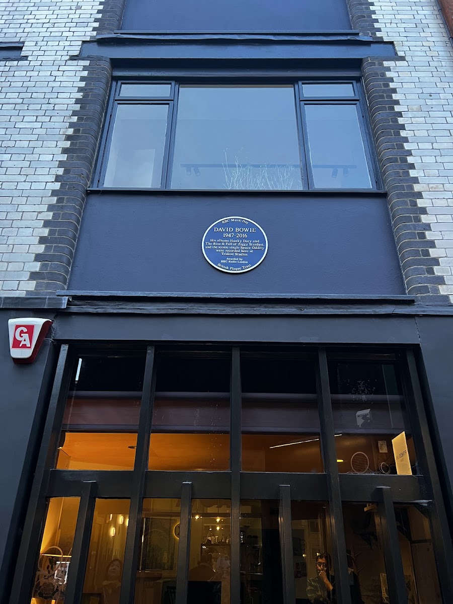
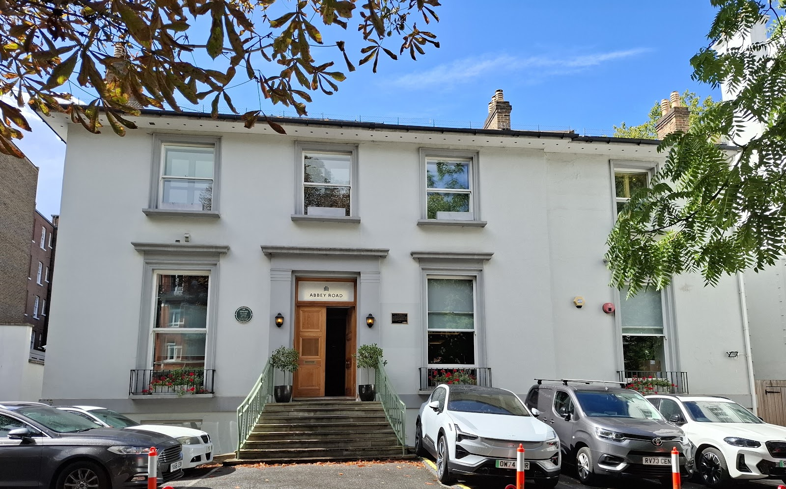
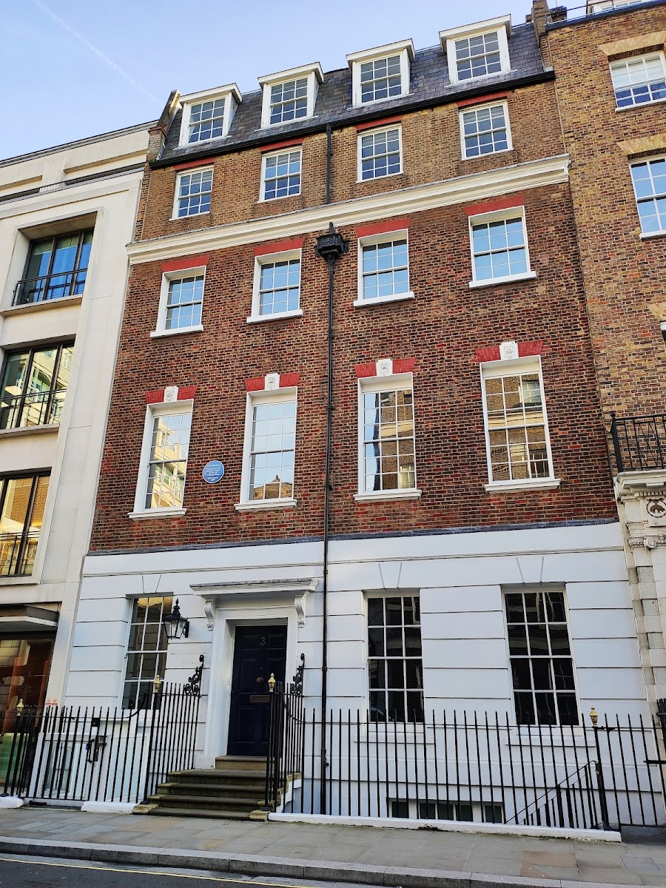
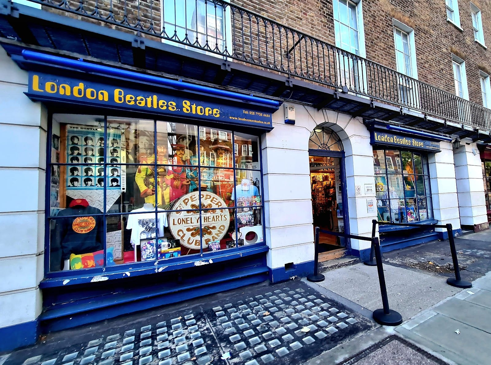
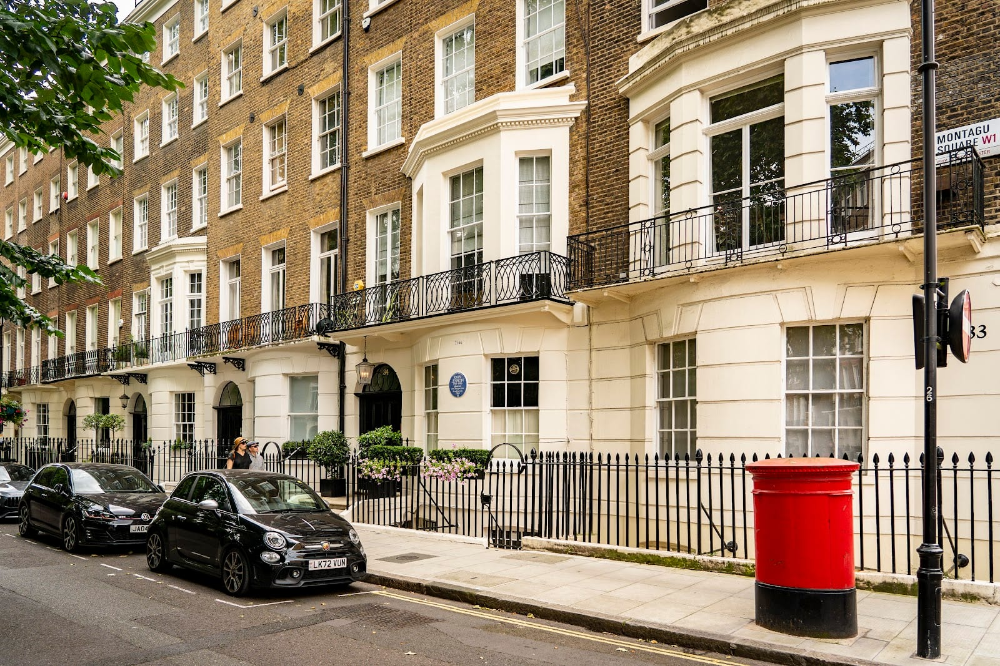
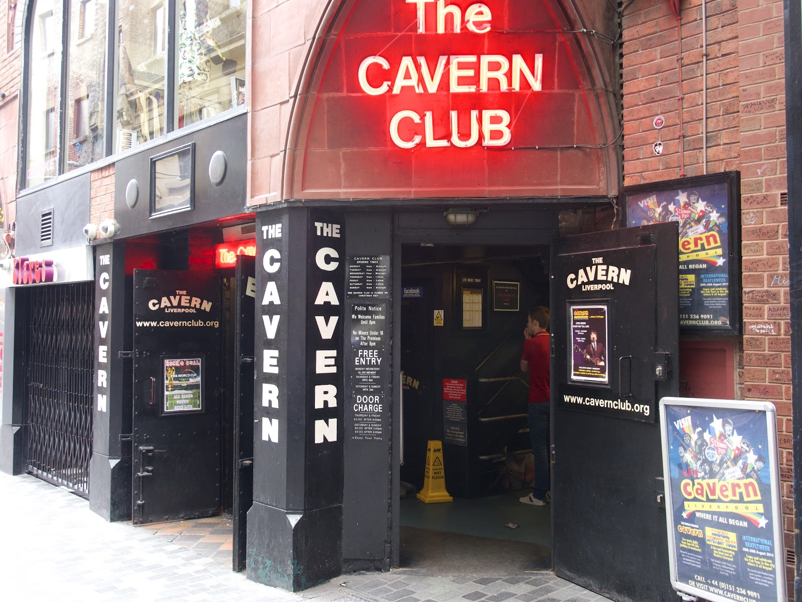
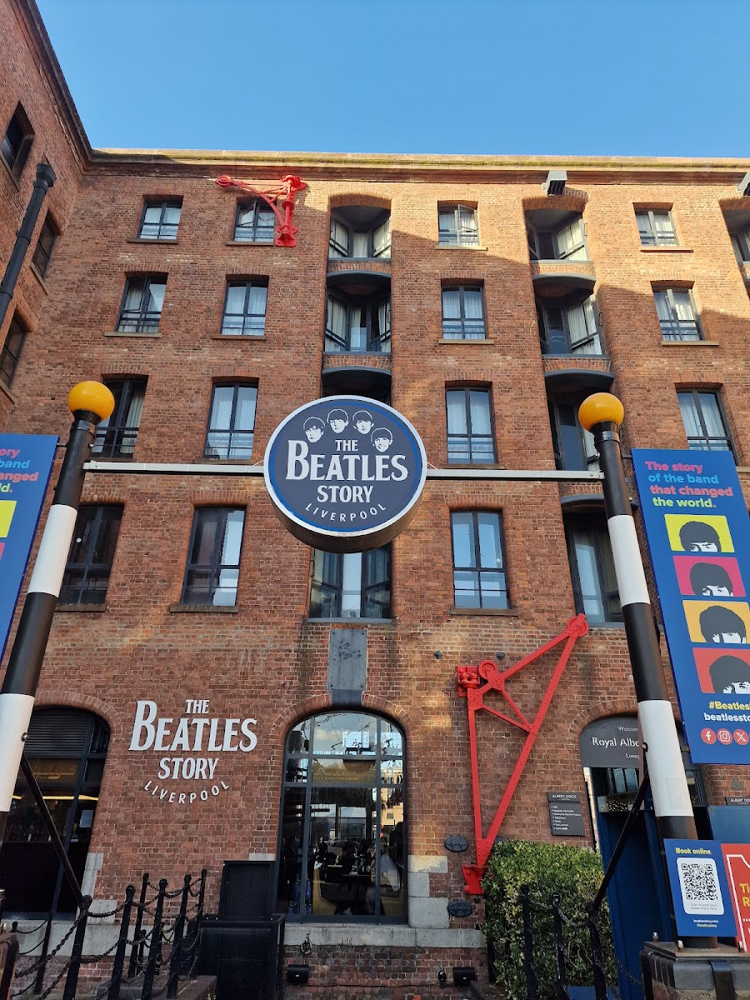

**The Abbey Road crossing costs nothing and needs no ticket.** Every London site on this page is free to see from the street. The spend is a guided walk, from £17, or the trip to Liverpool.

> 💡 **The Short Version:** **The Abbey Road crossing is free** and needs no ticket. **Or book a two-hour guided walk, from £17**, and skip working out a route between sites spread across St John's Wood, Marylebone, Mayfair and Soho; "In My Life" with Richard Porter has the most reviews, 4.6 from 272. **The Beatles played their last gig on the roof of 3 Savile Row on 30 January 1969**; a blue plaque has marked it since 2019. **The Beatles Store is at 231/233 Baker Street**, open daily 10am–6.30pm, and isn't run by Apple Corps. **Liverpool is a genuine day trip:** Euston to Lime Street from £14 one-way, 2h15 at the fastest, or a packaged tour from about £194 that bundles the train, the Magical Mystery Tour bus and the Beatles Story.

> ⚠️ **You can't go inside Abbey Road Studios or 3 Savile Row.** Both are working private buildings. The crossing, the studio wall and the rooftop plaque are what you visit, and there is no Beatles attraction in London run by the band's own company.

## What it all costs

| What | Cost per adult | Status |
| --- | --- | --- |
| Abbey Road crossing, wall and webcam | £0 | Official (Abbey Road Studios) |
| 3 Savile Row rooftop plaque, viewed from the street | £0 | Free |
| Beatles Store, Baker Street, to browse | £0 | Independent shop |
| Blue plaques: Baker Street, Montagu Square, Trident Studios | £0 | Free |
| Cavern Club, Liverpool, all-day pass | £8.50 | Rebuilt venue |
| The Beatles Walking Tour of Soho and Mayfair | £17 | Independent operator |
| "In My Life" Walking Tour with Richard Porter | £20 | Independent operator |
| The Beatles Story, Liverpool, adult | £20 | Independent museum |
| Beatles: Abbey Road, Savile Row & Trident walking tour | £49 | Independent operator |
| Liverpool and the Beatles day tour from London | From £194 | Independent operator |

## Tours

Most of the London sites are a plaque, a crossing or a shopfront that takes two minutes once you've found it, spread across St John's Wood, Marylebone, Mayfair and Soho. A guide gets you the route and the stories rather than access: everything below is free to see on your own.

### The best-reviewed: "In My Life" with Richard Porter

**<a href="https://www.getyourguide.com/activity/-t452936?partner_id=WWP7I0R&amp;cmp=beatles-london" target="_blank" rel="sponsored nofollow noopener" data-affiliate="gyg">London: Beatles In My Life Walking Tour with Richard Porter</a>** is **£20**, runs **two hours**, and is rated **4.6 from 272 reviews**, the most of any Beatles walking tour we found. The guide, Richard Porter, is the author of *Guide to the Beatles' London*; the operator's own listing describes a walk through the places the band recorded, lived and socialised in Swinging London. Free cancellation, and you need to book at least two hours ahead.

Powered by <a target="_blank" rel="sponsored" href="https://www.getyourguide.com/london-l57/">GetYourGuide</a>

### The specialist: Abbey Road, Savile Row and Trident

**<a href="https://www.getyourguide.com/activity/-t1042501?partner_id=WWP7I0R&amp;cmp=beatles-london" target="_blank" rel="sponsored nofollow noopener" data-affiliate="gyg">Beatles Magical Mystery Tour: Abbey Road, Savile Row</a>** costs more, **£49** for **two hours**, and is rated **4.9 from 108 reviews**. It's built around exactly the three sites this guide leads with: Abbey Road, Savile Row and Trident Studios in Soho, where "Hey Jude" was recorded. It starts outside the Dominion Theatre on Tottenham Court Road. **Best for** readers who want the story behind those three specific sites rather than the wider scene.

*The only plaque on the building credits David Bowie, not the Beatles, whose "Hey Jude" session here in 1968 goes unmarked.*

### The cheapest

**<a href="https://www.getyourguide.com/activity/-t401002?partner_id=WWP7I0R&amp;cmp=beatles-london" target="_blank" rel="sponsored nofollow noopener" data-affiliate="gyg">The Beatles Walking Tour of Soho and Mayfair</a>** is the cheapest at **£17** for two hours, covering Soho, Mayfair and St James's. It's rated **4.9**, but from only **4 reviews**, so treat that score as early rather than proven.

Liverpool day tours, with the train included, are [further down](#book-it-as-a-package-instead).

## Abbey Road Studios

**Abbey Road Studios, 3 Abbey Road, St John's Wood, London NW8 9AY.** It's still a working recording studio, owned by Universal Music Group, and the building itself is not open to visitors. What draws fans is entirely outside it, and all of it is free.

*A green plaque beside the door credits Sir Edward Elgar, who opened the studio in 1931 — the building has outlasted several eras of British music.*

### The crossing, the wall and the webcam

The zebra crossing is a public road, so nobody can stop you walking it. It's famous because it's the cover of the Beatles' 1969 album *Abbey Road*: photographer Iain Macmillan shot it at 11.35am on 8 August 1969, given ten minutes while standing on a stepladder as a policeman held up traffic. Go early to get it without a queue of other fans doing the same pose.

The studio's own **graffiti wall** at the front is fair game for a message in marker pen, repainted over as it fills up. The studio also runs an **Abbey Road Crossing Cam**, a live webcam trained on the crossing with an online archive — wave as you cross and look yourself up afterwards.

### Getting there

**St John's Wood Underground station (Jubilee line)** is a few minutes' walk: cross onto Grove End Road from the station and walk downhill until you reach Abbey Road, then turn right for the crossing. Buses **139** and **189** stop directly outside the Studios. Once you've done the crossing and the wall, St John's Wood High Street is a short walk away for food.

### The shop

The **Official Abbey Road Shop** is on site, open **Monday to Saturday, 9.30am–5.30pm, and Sunday, 10am–5pm**. It sells studio merchandise and a wider "Abbey Road Originals" range.

Powered by <a target="_blank" rel="sponsored" href="https://www.getyourguide.com/london-l57/">GetYourGuide</a>

## 3 Savile Row: the rooftop concert

**3 Savile Row, Mayfair.** On **30 January 1969**, the Beatles played their **last live performance** on the roof of this building, then the headquarters of their own Apple Corps and Apple Studio. The studio closed in May 1975, and the building today is private; there's nothing to go inside for.

A **blue plaque** was mounted on the façade on **5 April 2019**, the concert's 50th-anniversary year, with Westminster Council's permission.

*The building is occupied by a retail tenant today; only the plaque marks its Apple Corps years.*

Savile Row tailor **Tommy Nutter** dressed Paul McCartney, John Lennon and Ringo Starr for the *Abbey Road* cover shoot; George Harrison wore denim.

## Baker Street: the shop and the boutique that vanished

**The Beatles Store, 231/233 Baker Street, London NW1 6XE**, open **daily, 10am–6.30pm**, a minute's walk from Baker Street Underground. It's run by an independent company, Come Together Ltd, not by Apple Corps, and it's free to browse. It bills itself as stocking the world's largest range of Beatles merchandise: clothing, pins, prints, autographs and guidebooks.

*The shop spans two adjoining units on Baker Street, each signed separately above its own door.*

Ten minutes' walk south, **94 Baker Street** is the honest disappointment. The Beatles' Apple Corps opened the **Apple Boutique** here on 7 December 1967, its ground floor painted in a psychedelic mural by the Dutch design collective the Fool, funded with £100,000 of the band's money. Westminster City Council never approved the mural and forced it to be painted over within six months; the shop itself lost so much money it closed on 31 July 1968, just eight months after opening, with the remaining stock given away rather than sold. The 18th-century house it stood in was demolished by 1972 and replaced with an office block, **Travelscene House, 94 Baker Street, W1U 6FZ**. A **blue plaque** on the building, unveiled 17 March 2013 and crediting both John Lennon and George Harrison (Apple Corps' first office was on the floors above the shop), is the only trace left.

## Other sites worth the detour

| Site | What happened there | Worth the trip? |
| --- | --- | --- |
| 34 Montagu Square, Marylebone | Ringo's flat, later Hendrix's, later Lennon and Ono's | Yes — free, 2 minutes, see below |
| Trident Studios, 17 St Anne's Court, Soho | "Hey Jude" recorded here, 31 July 1968 | Yes — free, a blue plaque marks the building (for David Bowie, not the Beatles) |
| HMV, 363 Oxford Street | The Beatles' demo disc was cut here in 1962, leading to their EMI contract | Only if you're passing — HMV reopened in the building in November 2023 |
| Mason's Yard, St James's, SW1Y 6BU | Lennon met Yoko Ono here, 7 November 1966, at the Indica Gallery | No — the gallery's long gone and nothing marks it |
| 57 Wimpole Street, Marylebone | Paul McCartney's home through the mid-1960s, at Jane Asher's family house | No — private residence, nothing to see |

**34 Montagu Square** is the one address on this list that's worth an actual detour. Ringo Starr leased the ground-floor flat in 1965; Paul McCartney rented it from him that year and turned it into a demo studio, recording an early version of "I'm Looking Through You" and working on "Eleanor Rigby" there. Starr later sublet it to **Jimi Hendrix**, who wrote "The Wind Cries Mary" in the flat before being evicted for throwing whitewash over the walls. In 1968, **John Lennon and Yoko Ono** rented it for three months, photographed the cover of their *Two Virgins* album there, and were raided by police looking for drugs. English Heritage put up the blue plaque on **23 October 2010**, and Yoko Ono herself unveiled it. It's a private home today, so you're looking at the plaque from the pavement, not going in.

*Ringo Starr, Jimi Hendrix, and John Lennon and Yoko Ono all rented this same flat within a three-year stretch.*

## Liverpool: the day trip

Liverpool is where the Beatles are actually from, and it's a genuine day trip from London rather than a stretch.

### Getting there

Trains run from **London Euston to Liverpool Lime Street** on **Avanti West Coast**, covering 178 miles. The fastest journey is **2 hours 15 minutes**; the average, allowing for stops, is closer to 2 hours 50 minutes. There are **54 trains a day**, and advance singles start from **£14**. Lime Street is in the city centre, within walking distance of Mathew Street and the Albert Dock.

### The Cavern Club

**8–10 Mathew Street, Liverpool.** This isn't quite the club the Beatles played nearly 300 times between 1961 and 1963: that Cavern closed in 1973 and was filled in during building work for the Merseyrail loop, and the club reopened on Mathew Street in 1984. It's open **seven days a week**, with live music from **11.15am daily**. Hours: **Sunday–Wednesday 11am–midnight, Thursday 11am–1am, Friday and Saturday 11am–2am**. It's **cashless**, card or contactless only. **Single entry (18+) is £6**, or **£8.50 for an all-day, all-night pass** covering more than 12 hours of live music; under-12s go free, and 12–17s pay £3 but must leave by 8pm unless with an adult. Cloakroom is £2 an item.

*The club runs its own live line-up most days — check what's on before you go, since the acts change nightly.*

### The Beatles Story

At the **Royal Albert Dock**, open **9am–6.30pm, last entry 5pm**. **Adult tickets are £20**, concessions (seniors and students) £16, children aged 5–15 £11, and under-5s go free. That covers the museum, the Discovery Zone for kids (weekends and school holidays), and the on-site Fab4 cafés.

*The museum occupies a restored Victorian dock warehouse, not a purpose-built building.*

### Book it as a package instead

**<a href="https://www.getyourguide.com/activity/-t2271?partner_id=WWP7I0R&amp;cmp=beatles-london" target="_blank" rel="sponsored nofollow noopener" data-affiliate="gyg">Liverpool and The Beatles Day Tour from London</a>** bundles the lot for **£199**: the return train, a **two-hour, live-guided Magical Mystery Tour** minibus around the sites that inspired the songs, entry to the **Cavern Club**, and entry to the **Beatles Story** with its audio guide. Food and drink aren't included, and there's no guide beyond the minibus leg. Rated **4.5 from 179 reviews**.

A near-identical option, **<a href="https://www.getyourguide.com/activity/-t16138?partner_id=WWP7I0R&amp;cmp=beatles-london" target="_blank" rel="sponsored nofollow noopener" data-affiliate="gyg">Full-Day Beatles and Liverpool Tour from London</a>**, runs **£194** with reserved seats on Avanti West Coast trains, the Magical Mystery Tour and Beatles Story entry, rated **4.4 from 54 reviews** — its listing doesn't confirm Cavern Club entry, so check before booking if that matters to you. Either way, booking one ticket removes the admin of buying train tickets, a Magical Mystery Tour seat and two separate admissions yourself.

## A costed day or two

### One day, London only

Start at Abbey Road for the crossing and the wall, take the Jubilee line one stop from St John's Wood to Baker Street for the shop, walk south past 94 Baker Street to Montagu Square, then on to Savile Row and Trident Studios.

| Item | Cost |
| --- | --- |
| Contactless daily cap, Zones 1–2 | £8.90 |
| Abbey Road crossing, wall, webcam | £0.00 |
| Beatles Store, Baker Street plaques, Savile Row, Trident, Montagu Square | £0.00 |
| Lunch allowance | £12.00 |
| "In My Life" walking tour, evening | £20.00 |
| Total per adult | £40.90 |

Skip the tour and it's **£20.90**.

### Add Liverpool

| Item | Cost |
| --- | --- |
| Day one, as above, without the tour | £20.90 |
| Euston–Liverpool Lime Street, two advance singles from £14 each | £28.00 |
| Cavern Club, all-day pass | £8.50 |
| The Beatles Story, adult | £20.00 |
| Food and local travel in Liverpool, allowance | £15.00 |
| Total per adult, two days | £92.40 |

Or replace the whole Liverpool leg with the **£199 packaged day tour**, which trades a bit of cash for not having to plan the train, the minibus and two separate admissions yourself.

Powered by <a target="_blank" rel="sponsored" href="https://www.getyourguide.com/london-l57/">GetYourGuide</a>

## What isn't worth it

**94 Baker Street on its own.** The Apple Boutique lasted eight months, the building it stood in is gone, and what's there now is an office block with a plaque. Fine to glance at on the way to the actual shop; not worth a special trip.

**Expecting to go inside 3 Savile Row or Abbey Road Studios.** Both are working private premises. You're looking at a plaque and a crossing, not walking through a door.

**Mason's Yard, just for the Lennon-met-Ono story.** Nothing on the yard marks what happened there, and the gallery itself has been gone for decades. Only worth the diversion if you're already in St James's for something else.

**Assuming Apple Corps runs any of it.** It doesn't run shops, tours or attractions in London. Every "official-sounding" name in this guide — the Beatles Store, the Cavern Club, the Beatles Story — is an independent business trading on the connection, not the band's own company.

## Continue planning your London trip

- 🪄 **[Harry Potter in London](/articles/harry-potter-london/)**
- 🚶 **[Best Walking Tours in London](/articles/best-walking-tours-london/)**
- 🏘️ **[Marylebone Area Guide](/articles/marylebone-area-guide/)**
- 🎥 **[London Filming Locations](/articles/london-filming-locations/)**
- 🎸 **[Best Live Music Venues in London](/articles/best-live-music-venues-london/)**
- 💷 **[London on a Budget](/articles/london-on-a-budget/)**

*Checked 15 September 2026 against operators' own websites.*
