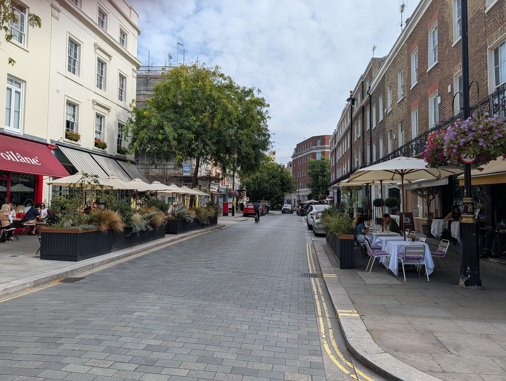
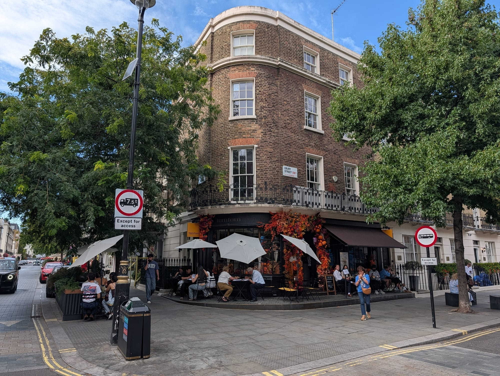
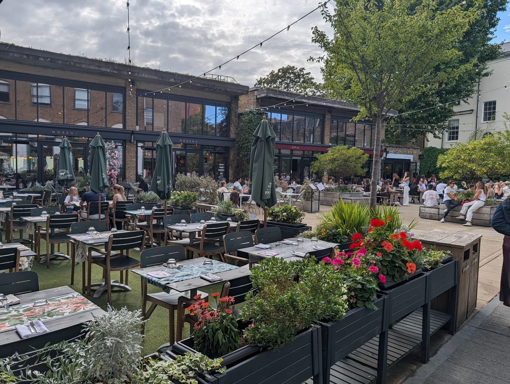
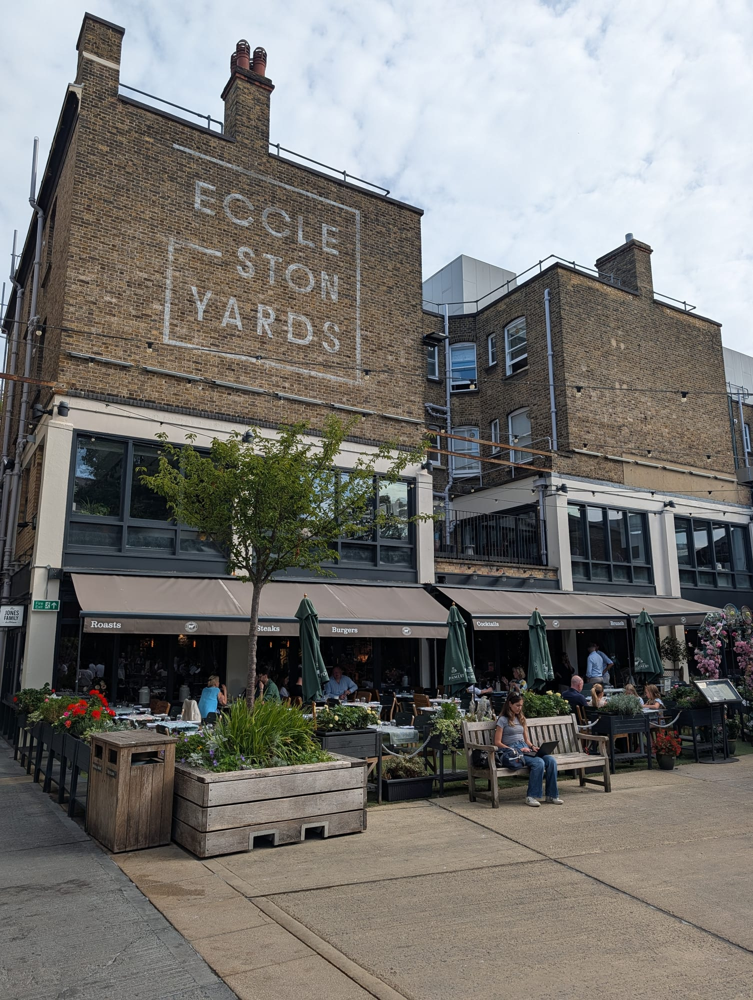

Belgravia is the wealthiest square mile in London and one of the least visited, which is not a contradiction — **there is nothing here to see**. No museum, no landmark, no view. What there is instead is white stucco, embassy flags, garden squares you cannot get into, and streets so quiet on a weekday that the loudest thing is a delivery van.

That makes it a genuinely good walk and a poor destination. Two or three hours, on foot, ideally on the way somewhere else.

Belgravia has its own share of the commemorative plaques marking where notable people lived or worked - see them on our [interactive map](/plaques/?area=belgravia).

## Why visit — and who should skip it

**Come here if** you like walking and architecture, you want the best blue-plaque route in London in a fifteen-minute loop, or you are staying nearby and want somewhere civilised to eat that is not Victoria station.

**Skip it if** you are on a short trip. Belgravia has no attraction, and on a three-day first visit every hour spent here is an hour not spent at the British Museum. It is a return-trip area, or a detour on the way from Victoria to Sloane Square.

**One honest warning about Sundays.** The streets are at their most beautiful and almost every shop is shut. Eccleston Yards keeps some life; Elizabeth Street largely does not.

## Top sights and activities

1. **Elizabeth Street** — The best short shopping street in this part of London: independent, walkable end to end in ten minutes, and not a chain in sight.
2. **Eccleston Yards** — A converted industrial courtyard of food, coffee and design, five minutes from Victoria and the one place here with a crowd.
3. **The blue-plaque loop** — Mozart, Mary Shelley, Ian Fleming and Tennyson, four plaques in fifteen minutes. The densest walk of its kind in Britain.
4. **Belgrave Square** — The centrepiece: enormous, white, and ringed by embassies. The garden in the middle is private and you will not be getting in.
5. **Eaton Square** — Longer and thinner than Belgrave, and the more handsome of the two if you only walk one.

## Key streets and micro-districts

### Elizabeth Street

**The reason to come.** A short run of independents between Eaton Square and Ebury Bridge Road — a milliner, a perfumer, bakeries, a butcher, florists spilling onto the pavement — with almost no chains and enough outdoor tables to sit down.

It is about ten minutes from Victoria station and most people arriving there walk the other way.

### Eccleston Yards

A pedestrianised courtyard of converted industrial buildings, five minutes from Victoria, with independent food, coffee, a gym, design studios and a great deal of outdoor seating.

**It is the least Belgravia-feeling place in Belgravia**, which is precisely why it works and why it is the busiest corner of the area. If the stucco is starting to feel airless, this is the antidote.

### Belgrave Square and Eaton Square

The set pieces, and the part people photograph. Belgrave Square is vast, white and almost entirely embassies — around twenty of them — which is why there are more police here than pedestrians.

**The gardens in the middle are private.** They are keyholders' squares for the surrounding houses, locked, and no amount of walking round the railings changes that. Eaton Square is the better walk of the two: longer, thinner, and with more life at its Sloane Square end.

### Motcomb Street and the mews

Motcomb Street is the third shopping street, smaller than Elizabeth Street and more expensive. Around it are the mews — Kinnerton Street, Wilton Row, Ebury Mews — which are where Belgravia is at its prettiest and quietest.

**Wilton Row hides the Grenadier**, a pub tucked so far into a mews that people who work in Belgravia walk past the entrance for years without noticing it.

Powered by <a target="_blank" rel="sponsored" href="https://www.getyourguide.com/london-l57/">GetYourGuide</a>

## The blue-plaque walk

This is the single best thing to do here and it takes about fifteen minutes.

**Four plaques, close together**: Mozart, who composed his first symphony in Belgravia as a child; Mary Shelley; Ian Fleming; and Alfred, Lord Tennyson. It is the densest concentration of English Heritage plaques anywhere in Britain, and it is free.

Our [blue plaques guide](/articles/london-blue-plaques/) has the addresses and the order to walk them in.

## Where to eat and drink

Belgravia eats expensively and quietly. There is no cheap end to speak of, which is worth knowing before you arrive hungry.

| Spot | Style | Price | Why go |
| --- | --- | --- | --- |
| **Weezie's** | Pizza | ££ | Thin crust, Guinness and a serious wine list, in the Eccleston Yards courtyard |
| **La Poule au Pot** | French bistro | £££ | Trading since the 1960s on coq au vin and candlelight; the most reliably romantic room in London |
| **The Goring** | British, afternoon tea | ££££ | The last family-owned grand hotel in London, and the quietest of the big afternoon teas |
| **Brooklands** | French, rooftop | ££££ | Claude Bosi on the roof of The Peninsula, over Hyde Park Corner |
| **Canton Blue** | Cantonese | ££££ | Inside The Peninsula, themed on a 19th-century trading ship |

*Weezie's, in the Eccleston Yards courtyard — the one place in Belgravia where a good dinner does not need a reservation weeks out.*

**For anything under £20**, walk to Eccleston Yards or back towards Victoria. The residential streets have nothing.

## Getting there

**By Tube.** **Victoria** (Victoria, District, Circle) is the practical entrance and puts you five minutes from Eccleston Yards and ten from Elizabeth Street. **Sloane Square** (District, Circle) is better for the western end and for combining with Chelsea. **Hyde Park Corner** (Piccadilly) is best for Belgrave Square and The Peninsula.

**On foot.** Belgravia is small — you can cross it in twenty minutes — and it is flat, quiet and almost entirely step-free.

**Combine it with something.** This is the important one. Belgravia works best as the middle of a walk rather than the point of one: Victoria to Sloane Square, or Hyde Park Corner down to Chelsea.

## How long to spend, and when to go

| Time | What it gets you |
| --- | --- |
| **One hour** | Eccleston Yards and Elizabeth Street |
| **Two hours** | Add the blue-plaque loop and Belgrave Square |
| **Half a day** | Add the mews, Motcomb Street and lunch, then walk on to Chelsea |

**Weekdays are best.** Saturday is fine. **Sunday is the trap** — the streets look their best and almost everything is closed.

Powered by <a target="_blank" rel="sponsored" href="https://www.getyourguide.com/london-l57/">GetYourGuide</a>

## Common mistakes to avoid

1. **Treating it as a destination.** There is no sight here. Walk it on the way to somewhere else.
2. **Expecting the garden squares to be open.** They are private, locked, and for residents.
3. **Arriving on a Sunday for the shops.** Elizabeth Street is largely shut.
4. **Confusing it with Knightsbridge.** Harrods is a different area, north-west across Sloane Street.
5. **Coming hungry with a budget.** The cheap options are at Eccleston Yards or back at Victoria, and nowhere in between.
