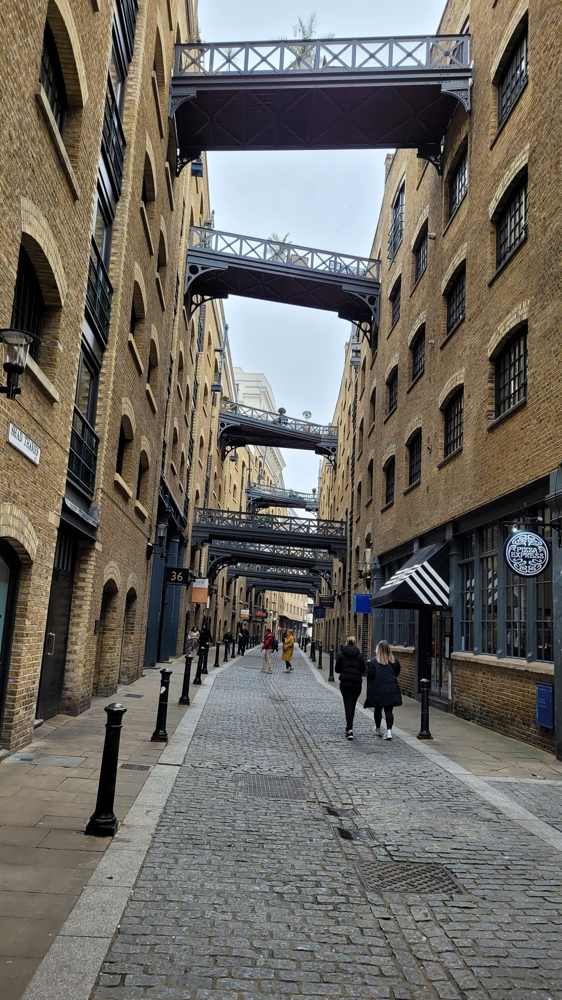
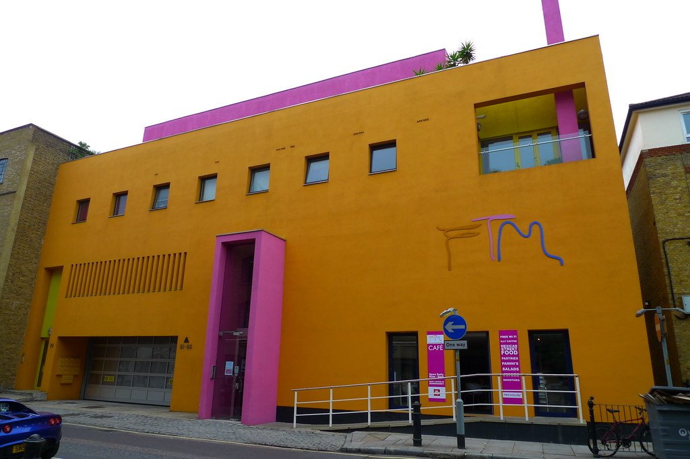

Bermondsey is what happens when a Victorian goods yard is left alone long enough. The railway viaducts that carved it up are now full of breweries, the leather warehouses are flats, and a narrow alley under the arches holds one of the best food markets in London two days a week.

It sits immediately east of Borough Market, and the two make an obvious pair.

Bermondsey has its own share of the commemorative plaques marking where notable people lived or worked - see them on our [interactive map](/plaques/?area=bermondsey).

## Why visit — and who should skip it

**Come here if** it is a weekend and you like eating and drinking. Maltby Street Market and the Beer Mile are both Saturday propositions, both under railway arches, and both about fifteen minutes apart on foot.

**Skip it if** you come midweek. Maltby Street does not run, most of the breweries are shut, and Bermondsey Street is a pleasant but ordinary road. Come Saturday or not at all.

## Top sights and activities

1. **Maltby Street Market** — Saturdays and Sundays along **Ropewalk**, a narrow alley beneath the arches. Small, excellent and genuinely cramped. Go before midday.
2. **The Bermondsey Beer Mile** — Breweries and taprooms in the arches between Bermondsey and South Bermondsey, mostly open at weekends. Not an official route and the line-up changes — check before you go.
3. **White Cube Bermondsey** — The largest commercial gallery in Europe, free, showing major contemporary work in huge industrial rooms on Bermondsey Street.
4. **Shad Thames** — The warehouse canyon east of Tower Bridge, with the original iron gantries still spanning the street overhead. The most photogenic street in the area.
5. **Bermondsey Antiques Market** — Friday mornings on Bermondsey Square, starting around 04:00. A working trade market; the real dealing is finished by 08:00.
6. **Fashion and Textile Museum** — Zandra Rhodes's bright orange and pink building on Bermondsey Street. Small, ticketed, and focused on textiles and design.
7. **The Thames Path and Bermondsey Beach** — East from Tower Bridge past Butler's Wharf. At low tide a shingle foreshore is exposed with views back to the bridge.

*Shad Thames. The overhead walkways moved sacks of spice between warehouses; the buildings are flats now, the bridges left in place. Photo: [Rob Oo](https://commons.wikimedia.org/w/index.php?curid=152631540), [CC BY 2.0](https://creativecommons.org/licenses/by/2.0/).*

Powered by <a target="_blank" rel="sponsored" href="https://www.getyourguide.com/london-l57/">GetYourGuide</a>

## Key streets and micro-districts

### Bermondsey Street
The spine. White Cube, the Fashion and Textile Museum, restaurants and Georgian houses. Runs south from London Bridge.

### Maltby Street and Ropewalk
The arches. Market at weekends, and a handful of permanent traders through the week.

### Shad Thames and Butler's Wharf
East of Tower Bridge. Warehouse conversions, overhead gantries and riverside restaurants.

*Shad Thames. The gantries were working bridges — porters wheeled tea, coffee and spices across them between the warehouses, which is why they are at every floor rather than just one.*

### The Beer Mile arches
South-east, along the viaduct towards South Bermondsey. Breweries, taprooms and very little else.

### Bermondsey Square
The Friday antiques market, a cinema and a hotel, at the southern end of Bermondsey Street.

*The Fashion and Textile Museum, painted orange and pink by the Mexican architect Ricardo Legorreta. Impossible to walk past. Photo: [Ewan-M](https://www.flickr.com/photos/55935853@N00/3612012652), [CC BY-SA 2.0](https://creativecommons.org/licenses/by-sa/2.0/).*

## Where to eat and drink

| Spot | Style | Price | Why go |
| --- | --- | --- | --- |
| **Maltby Street Market** | Street food | £ | Weekends only; the reason most people come |
| **St. John Bakery** | Bakery | £ | On Ropewalk; the custard doughnuts sell out |
| **Casse-Croûte** | French bistro | ££ | Tiny, chalkboard menu, book ahead |
| **José Tapas Bar** | Spanish | ££ | Bermondsey Street; standing room, no bookings |
| **The Woolpack** | Pub | £ | Proper local pub away from the market crowds |
| **Butler's Wharf Chop House** | British | £££ | Riverside with a Tower Bridge view |

## Getting there

**By Tube.** **London Bridge** (Jubilee, Northern, National Rail) is the main gateway and puts you at the top of Bermondsey Street. **Bermondsey** on the Jubilee line is closer to the Beer Mile arches.

**Best exit.** From London Bridge, follow signs for **Tooley Street** and walk south-east — Bermondsey Street starts under the railway bridge.

**On foot.** Ten minutes west to Borough Market, fifteen north over Tower Bridge to the City. The Thames Path runs east past Butler's Wharf.

## How long to spend, and when to go

| If you have | Do this |
| --- | --- |
| **Two hours** | Maltby Street Market and Bermondsey Street |
| **Half a day** | Add White Cube, Shad Thames and Tower Bridge |
| **A full day** | Add the Beer Mile, or combine with Borough Market |

**Best time:** Saturday, before midday. Ropewalk is a genuinely narrow alley and it becomes very slow by lunchtime.

**Avoid:** Midweek if the market is your reason for coming. Friday very early is the exception, for the antiques market.

## Suggested half-day route

1. **Start:** London Bridge station, **Tooley Street** exit.
2. **Bermondsey Street:** South past **White Cube** and the Fashion and Textile Museum.
3. **Maltby Street:** East to **Ropewalk** for the market. Before midday.
4. **Shad Thames:** North to the warehouse canyon and the overhead gantries.
5. **Tower Bridge:** West along the river for the view back.
6. **Finish:** Borough Market ten minutes west, or the Beer Mile arches to the south-east.

## Common mistakes to avoid

1. **Coming midweek for Maltby Street.** Weekends only.
2. **Arriving at Ropewalk after midday on a Saturday.** It is one alley wide and it does not move.
3. **Treating the Beer Mile as a fixed route.** Breweries open and close; check current hours before setting out.
4. **Confusing Bermondsey with Borough.** Ten minutes apart — easy to do together, but not the same place.
5. **Missing Shad Thames.** The gantried warehouse street east of Tower Bridge is the best-looking part of the area.
6. **Turning up to the antiques market at 10am.** The trade is done by eight.

## Where to stay

Well connected, cheaper than the north bank, and increasingly well served for food.

- **Bermondsey Street** — Small hotels and rentals along the street, walkable to Borough and Tower Bridge.
- **London Bridge** — Larger hotels, excellent transport, direct Thameslink to Gatwick.
- **Shad Thames** — Warehouse conversions on the river, quiet and central.
