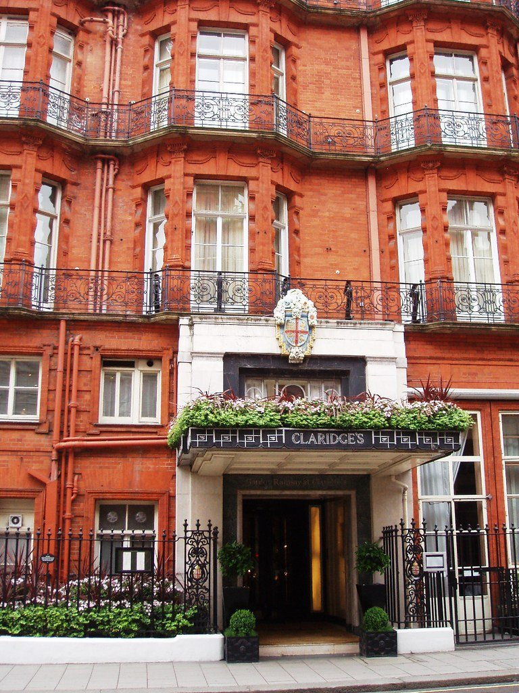
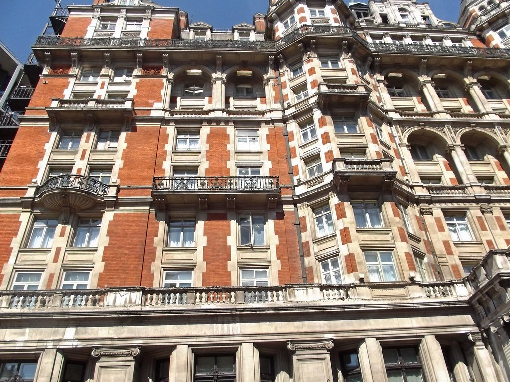
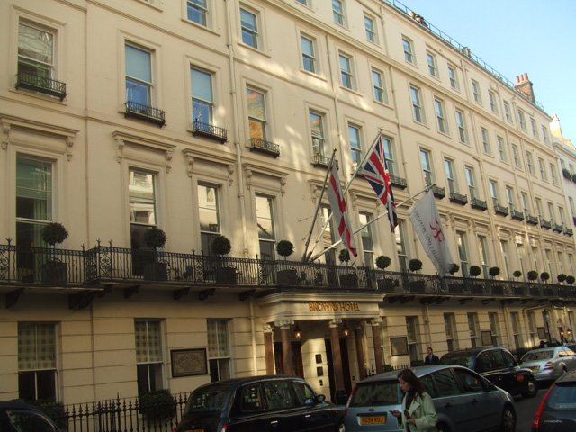
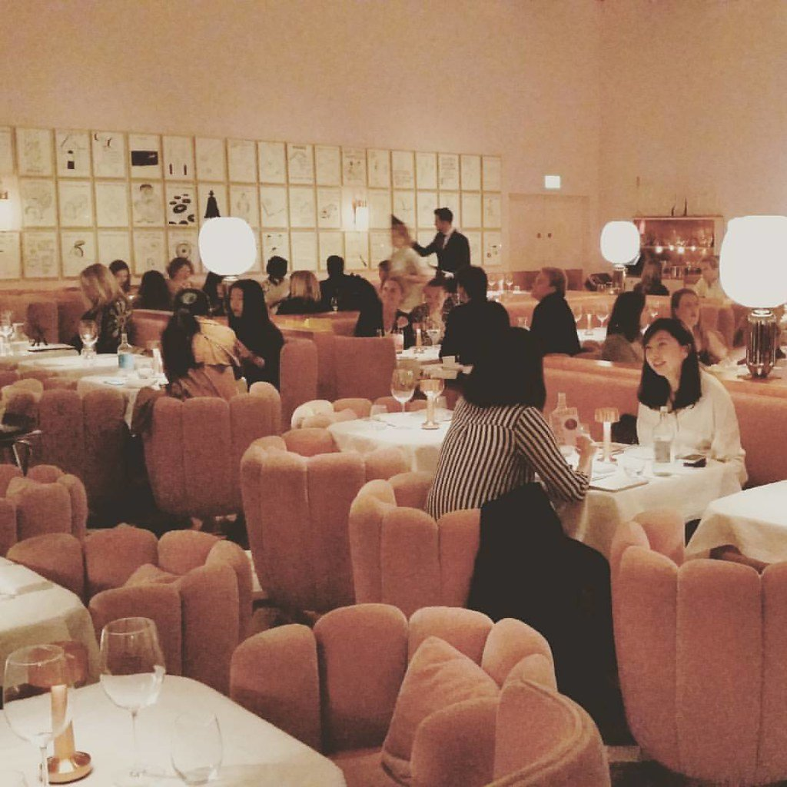

Afternoon tea is the one London ritual that is genuinely worth doing as a tourist and genuinely easy to overpay for. The difference between a £95 sitting and a £55 one is very often the address rather than the food.

Arranged by **what you are actually buying** — the historic claim, the room, the spectacle, or the tea itself.

> 💡 **The Short Version:** **The Langham** is where the ritual began and still the benchmark. **The Ritz** is the most recognised and the most formal. **The Berkeley** does fashion-week pastries. **Sketch** is an art installation. **The Wolseley** and **The Connaught** give you most of it for less. **One Aldwych** is the one that works with children.

> 📊 **The evidence behind this guide**
> Nothing here is ranked on one visit. This pass reads **7 sources carrying 100 citations** across **62 named tea rooms** — the editorial mastheads (Time Out, The Infatuation, Olive, LuxLife) and three specialists, two of them writing specifically about doing this cheaply. **23 tea rooms are named by two or more independent sources.**
> **The known weakness in this topic: there is no award, and no inspectorate.** Nothing here has been judged. Afternoon tea is also the hardest topic on this site to count, because half the sources name the TEA ROOM and half name the HOTEL — "The Palm Court at The Ritz" and "The Ritz" — so the two most famous teas in London read as four weakly-supported venues until they are merged by hand. Several rooms in this guide carry no citation at all; each says so.
> *Evidence rebuilt 30 August 2026 · [How we rank →](/how-we-rank/)*

## Where they are

  

    Map of the best afternoon tea in London
  

  

    
Loading the interactive map…

  

  <noscript>
    
The interactive map requires JavaScript. Every entry below lists its area.

  </noscript>

| If you are near… | Where to eat |
| --- | --- |
| **Mayfair & Piccadilly** | The Ritz, Claridge's, The Dorchester, Brown's, The Connaught, Sketch, Fortnum & Mason, The Wolseley, The Stafford |
| **Knightsbridge** | The Berkeley, The Lanesborough, Mandarin Oriental, Jumeirah Carlton Tower |
| **Marylebone** | The Langham, Winter Garden (The Landmark) |
| **Covent Garden & Strand** | The Savoy, One Aldwych |
| **Belgravia & Westminster** | The Goring, Corinthia |
| **Kensington** | The Milestone, The Ampersand |
| **Bloomsbury** | Rosewood London |

**Price guide:** **£££** £45–£65 · **££££** £70+.

Powered by <a target="_blank" rel="sponsored" href="https://www.getyourguide.com/london-l57/">GetYourGuide</a>

---

## Where the ritual began

### The Langham, Marylebone

*££££ · 3 min from Oxford Circus · Cited by 4 sources*

The **Palm Court claims to be where afternoon tea began** in the 1860s, and it is still the benchmark against which the others are judged. Book weeks ahead.

### The Ritz, Piccadilly

*££££ · 2 min from Green Park · dress code enforced · Cited by 4 sources*

The most recognised afternoon tea in London, served in the Palm Court with a pianist.

> ⚠️ **The dress code is real and enforced.** Jacket and tie for men; no jeans or trainers. Weekend sittings book months out.

### Claridge's, Mayfair

*££££ · 5 min from Bond Street · Cited by 1 source*

Art Deco Mayfair, with its own house blend of Assam and Darjeeling, served in the Foyer and Reading Room.

*The most formal of the grand teas, in a foyer designed to be walked through slowly. Photo: [Ewan-M](https://www.flickr.com/photos/55935853@N00/2611316232), [CC BY-SA 2.0](https://creativecommons.org/licenses/by-sa/2.0/).*

### Fortnum & Mason, Piccadilly

*££££ · the tea merchant's own salon · Cited by 2 sources*

Opened by the Queen in 2012, and **the one place where the tea list is the point** rather than the pastries. If you care about the leaf rather than the room, come here.

---

## The grand hotels

### The Dorchester, Mayfair

*££££ · the Promenade · named by no source in this corpus*

Served the length of the Promenade, opening with a glass of Veuve Clicquot poured tableside. The grandest of the grand.

### The Savoy, Covent Garden

*££££ · the Thames Foyer · Cited by 3 sources*

Under the glass cupola of the Thames Foyer, with a pianist, in London's first purpose-built luxury hotel.

### The Lanesborough, Knightsbridge

*££££ · under a glass dome · named by no source in this corpus*

Taken under the glass dome of the Céleste dining room at Hyde Park Corner — the brightest of the grand-hotel rooms.

### Corinthia London, Westminster

*££££ · a tea master · Cited by 2 sources*

Under a Baccarat crystal chandelier with a Steinway playing, and a tea master who weighs and blends each pot.

### Mandarin Oriental Hyde Park, Knightsbridge

*££££ · a garden view · Cited by 3 sources*

The Rosebery lounge backs onto Hyde Park — the one grand tea with a park view rather than a room view.

*The tea room looks over Hyde Park, which is worth the surcharge over the ones that look at a lobby. Photo: [ell brown](https://www.flickr.com/photos/39415781@N06/20826604740), [CC BY-SA 2.0](https://creativecommons.org/licenses/by-sa/2.0/).*

---

## Easier to book

### Brown's Hotel, Mayfair

*££££ · 4 min from Green Park · Cited by 1 source*

The **intimate, club-like** option — panelled and low-ceilinged where The Dorchester is a long bright promenade. The one to pick if the grand hotels feel like too much room.

*London's oldest hotel, and its afternoon tea is the least stiff of the grand ones. Photo: [Londonmatt](https://commons.wikimedia.org/w/index.php?curid=8743312), [CC BY 2.0](https://creativecommons.org/licenses/by/2.0/).*

### Rosewood London, Bloomsbury

*££££ · 4 min from Holborn · Cited by 3 sources*

Taken in the **Mirror Room** of a Belle Époque building off High Holborn — the grand-hotel format, well outside the Mayfair cluster and easier to book because of it.

### Jumeirah Carlton Tower, Knightsbridge

*££££ · 7 min from Knightsbridge · named by no source in this corpus*

The **Chinoiserie tea room serves all afternoon rather than in fixed sittings**, which makes it one of the easier Knightsbridge teas to get into at short notice — genuinely useful if you have not booked weeks ahead.

---

## The spectacle

### Winter Garden, Marylebone

*££££ · The Landmark London, 222 Marylebone Road · named by no source in this corpus*

Afternoon tea taken on the floor of an **eight-storey glass atrium among full-grown palm trees**, with a pianist and a harpist playing. The most theatrical tea room in London that is not a palace, and the one that photographs best by a distance.

> ⚠️ **Go for the room.** Reviews of the food itself are genuinely mixed for something over £70 a head. The atrium is extraordinary; the sandwiches are not. Ask for a table on the atrium floor rather than the gallery above.

### The Berkeley, Knightsbridge

*££££ · Prêt-à-Portea · named by no source in this corpus*

Pastries modelled on the **current season's runway** — handbags, heels, a new collection each time the shows change. The most photographed tea in London and genuinely skilful.

### Sketch, Mayfair

*££££ · the pink room · Cited by 2 sources*

Afternoon tea **inside an art installation**. The pink Gallery room and the egg-shaped lavatories are as photographed as the food.

*The Gallery, David Shrigley's pink room, is where afternoon tea is served. Photo: [Glam UK](https://www.flickr.com/photos/135288089@N05/27039938264), [CC BY-SA 2.0](https://creativecommons.org/licenses/by-sa/2.0/).*

---

## Quieter, and better value

### The Wolseley, Piccadilly

*£££ · 3 min from Green Park · Cited by 5 sources*

A 1920s car showroom turned Viennese-style grand café. The London power breakfast, and one of the best-value teas in the centre.

### The Connaught, Mayfair

*£££ · 8 min from Bond Street · Cited by 1 source*

Understated where the rest of Mayfair is gilded — precision and craft rather than spectacle, and cheaper for it.

### The Stafford, Piccadilly

*£££ · a St James's cul-de-sac · named by no source in this corpus*

Down a cul-de-sac with 380-year-old wine cellars beneath, and far fewer tourists than the Piccadilly names a two-minute walk away.

### The Goring, Belgravia

*££££ · 2 min from Victoria · Cited by 2 sources*

The last family-owned grand hotel in London, and the quietest of the big teas — taken in the garden room.

### The Milestone, Kensington

*£££ · opposite Kensington Palace · named by no source in this corpus*

A small townhouse hotel and the quietest listed tea here.

---

## With children

### One Aldwych, Covent Garden

*£££ · 5 min from Temple · named by no source in this corpus*

A themed tea built around **Charlie and the Chocolate Factory** — the one that works with children who would be bored anywhere else.

### The Ampersand, South Kensington

*£££ · 1 min from South Kensington · named by no source in this corpus*

Themed around the museums on its doorstep: planets, fossils and periodic-table biscuits. Sensible if you are doing the Science Museum the same day.

---

## Afternoon tea on a budget

The grand hotels run from about £75 to well over £100 a head. These do the same three tiers for a third of that, and several are in better buildings.

#### The museums and galleries

The most reliable value in London afternoon tea, and the rooms are the reason to go.

* **The Wallace Collection**, Marylebone — tea in the glass-roofed courtyard of a Manchester Square townhouse full of Old Masters, and the museum itself is free.
* **The British Museum** — around **£40**, in the Great Court under the Foster roof.
* **Tate Modern** — around **£30**, with the river and St Paul's through the window.
* **The Royal Albert Hall** — tea inside the building rather than a hotel dining room, which is a different kind of occasion.

#### Under £30

* **Memoir Club**, Bloomsbury — a classic afternoon tea from about **£27.50**.
* **The Chocolate Cocktail Club** — **£27.50** with unlimited tea, coffee or hot chocolate, and a chocolate-led menu rather than the standard tiers.
* **Bishops Park Tea House**, Fulham — **£29** for finger sandwiches, scones with jam and clotted cream and mini cakes on a proper three-tier stand, in a park rather than a hotel.
* **Candella Tea Room**, Kensington — a small independent tea room a few minutes from the palace, and a fraction of what the hotels opposite charge.

#### Different, and cheaper

* **Cinnamon Bazaar**, Covent Garden — an Indian-spiced afternoon tea rather than the English format, which is both more interesting and less expensive.
* **Cutter & Squidge**, Soho — a pared-back signature tea with three sandwiches and two scones.
* **Dean Street Townhouse**, Soho — a proper English tea in a Georgian room, at Soho rather than Mayfair prices.

#### How to spend less at the grand hotels

* **Go on a weekday.** Almost every hotel here charges less Monday to Thursday than at a weekend, for the identical menu.
* **Skip the champagne.** It adds £15–£25 and the tea is the same either way.
* **Ask for more sandwiches and scones.** They are refillable at most grand hotels and almost nobody asks, which changes the value calculation considerably.

> Prices move every season and these were checked in August 2026. Treat them as indicative and confirm when you book.

---

## What to know

* **Book weeks ahead**, months for The Ritz at a weekend.
* **Check the dress code when booking.** Only The Ritz strictly enforces one, but several prefer smart-casual and it is awkward to discover at the door.
* **Sittings are timed**, usually 90 minutes to two hours. You will be asked to leave on time.
* **Dietary requirements need 24–48 hours' notice** at most of these — vegetarian and gluten-free versions are near-universal but rarely available on the day.
* **Champagne adds £15–£25.** The tea is the same either way.
* **You can ask for more.** Sandwiches and scones are refillable at most grand hotels and almost nobody asks.

---

## Continue planning your London trip

- 🍽️ **[Eat in London: Restaurants, Food Markets & Quick Food Hub](/articles/eat-in-london-guide/)**
- 🏛️ **[Historic Pubs and Dining Rooms in London](/articles/historic-pubs-dining-rooms-london/)**
- 🥩 **[The Best Sunday Roast in London](/articles/best-sunday-roast-london/)**
- 🎭 **[Covent Garden Area Guide](/articles/covent-garden-area-guide/)**
- 👑 **[Westminster Area Guide](/articles/westminster-area-guide/)**
- 🛍️ **[Mayfair Area Guide](/articles/mayfair-area-guide/)**
