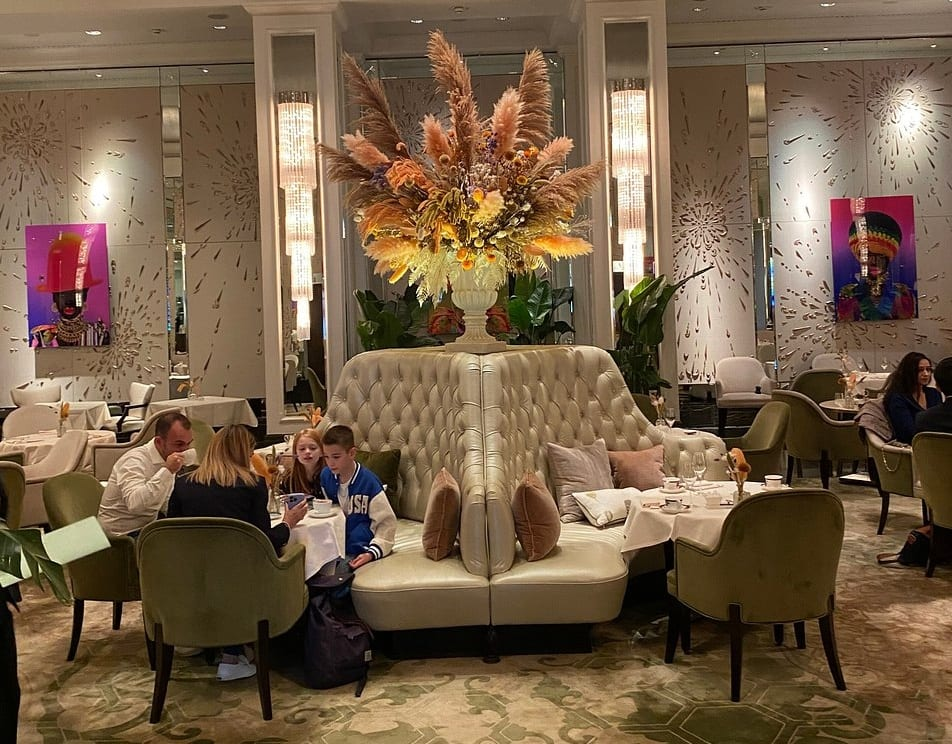
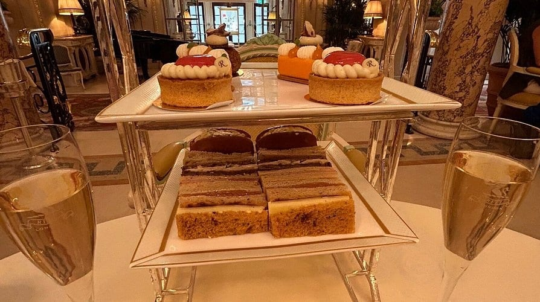
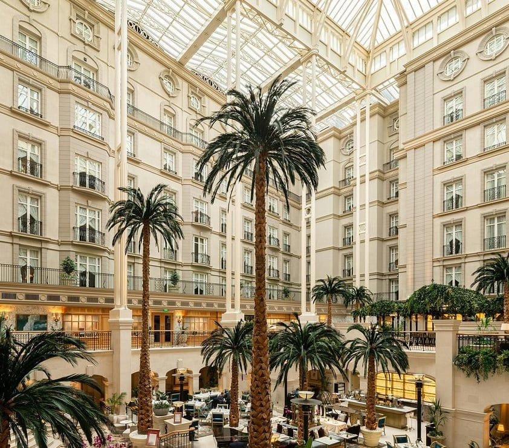

Afternoon tea is the one London ritual that is genuinely worth doing as a tourist and genuinely easy to overpay for. The difference between a £95 sitting and a £55 one is very often the address rather than the food.

Arranged by **what you are actually buying** — the historic claim, the room, the spectacle, or the tea itself.

> 💡 **The Short Version:** **The Langham** is where the ritual began and still the benchmark. **The Ritz** is the most recognised and the most formal. **The Berkeley** does fashion-week pastries. **Sketch** is an art installation. **The Wolseley** and **The Connaught** give you most of it for less. **One Aldwych** is the one that works with children.

> 📊 **The evidence behind this guide**
> Nothing here is ranked on one visit. This pass reads **7 sources carrying 100 citations** across **62 named tea rooms**. **23 tea rooms are named by two or more independent sources.**
> **Built on:** the room rather than the hotel — "The Palm Court at The Ritz" and "The Ritz" are merged by hand, so the counts reflect real agreement.
> *Evidence rebuilt 30 August 2026 · [How we rank →](/how-we-rank/)*

## Where they are

  

    Map of the best afternoon tea in London
  

  

    
Loading the interactive map…

  

  <noscript>
    
The interactive map requires JavaScript. Every entry below lists its area.

  </noscript>

| If you are near… | Where to eat |
| --- | --- |
| **Mayfair & Piccadilly** | The Ritz, Claridge's, The Dorchester, Brown's, The Connaught, Sketch, Fortnum & Mason, The Wolseley, The Stafford |
| **Knightsbridge** | The Berkeley, The Lanesborough, Mandarin Oriental, Jumeirah Carlton Tower |
| **Marylebone** | The Langham, Winter Garden (The Landmark) |
| **Covent Garden & Strand** | The Savoy, One Aldwych |
| **Belgravia & Westminster** | The Goring, Corinthia |
| **Kensington** | The Milestone, The Ampersand |
| **Bloomsbury** | Rosewood London |

**Price guide:** **£££** £45–£65 · **££££** £70+.

Powered by <a target="_blank" rel="sponsored" href="https://www.getyourguide.com/london-l57/">GetYourGuide</a>

---

## Where the ritual began

### The Langham, Marylebone

*££££ · 3 min from Oxford Circus · Cited by 4 sources*

The Palm Court is **where the ritual was invented** — The Langham opened in 1865 and was the first hotel in the world to serve afternoon tea, moving it out of aristocratic drawing rooms and into a place anyone could book. It is still the benchmark the others are judged against.

The stand is Victorian-inspired but not museum-piece: sandwiches, scones, and pastries built by **Michel Roux with pastry chef Andrew Gravett**, who changes the sweets seasonally. Vegan, gluten-free and children's versions are all made properly rather than improvised.

Sixty-five seats on the ground floor, a pianist from 1pm to 7pm, and enough room between tables to talk. Smart casual — no sportswear or flip-flops, but no jacket-and-tie either. **Book weeks ahead for a weekend.**

*The Palm Court at The Langham, where afternoon tea was invented in 1865. The room seats sixty-five and there is genuinely space between the tables.*

### The Ritz, Piccadilly

*££££ · 2 min from Green Park · dress code enforced · Cited by 4 sources*

The most recognised afternoon tea in London, and the most formal. Served in the Palm Court of the **18th-century William Kent House** under gilt and mirrors, with a pianist or harpist through most sittings and a piano, cello and violin trio on weekday evenings.

Finely cut sandwiches, **scones with Cornish clotted cream and strawberry preserve**, and a cake trolley wheeled to the table so you choose by eye rather than off a menu. Twenty loose-leaf teas including the house Ritz Royal Blend.

**£95 a head, £73 for children**, champagne from £26 a glass. Five sittings a day, seven days a week — 11.30am, 1.30pm, 3.30pm, 5.30pm and 7.30pm.

*Tea at the Ritz. The pastries carry the hotel's monogram, and the cake trolley comes round afterwards so you pick by eye.*

> ⚠️ **The dress code is real and enforced.** Jacket and tie for men, no jeans or trainers — waived only for under-16s. Weekend sittings book months out.

### Claridge's, Mayfair

*££££ · 5 min from Bond Street · Cited by 1 source*

Art Deco Mayfair at its most composed, in the **Foyer and Reading Room** — an ornate gilded space laid with the hotel's signature jade-and-white striped china, which is as recognisable as the building.

Savouries lean British and specific: **smoked Scottish salmon**, seasonal pastries that change through the year, and a tea list running from a rich Oolong to the house Claridge's Blend, made for the room by a tea buyer rather than bought in.

**£95 a head, £110 with champagne, £125 with rosé.** The festive menu from early November to 3 January runs £120 on weekdays and £130 at weekends. This is the one where people dress up without being told to.

*The most formal of the grand teas, in a foyer designed to be walked through slowly. Photo: [Ewan-M](https://www.flickr.com/photos/55935853@N00/2611316232), [CC BY-SA 2.0](https://creativecommons.org/licenses/by-sa/2.0/).*

### Fortnum & Mason, Piccadilly

*££££ · the tea merchant's own salon · Cited by 2 sources*

The **Diamond Jubilee Tea Salon**, opened by the Queen in 2012 on the fourth floor of the shop, and the one place in London where the tea list is the point rather than the pastries. Fortnum's has been selling leaf since 1707 and the salon exists to show it off.

Savouries are properly British and properly specific: **Suffolk cured ham with piccalilli**, rare breed hen egg with cress, soft smoked salmon. Plain and fruit scones arrive warm with clotted cream, lemon curd and preserves, and the patisserie changes with the season.

**£84 a head** with a pot of Fortnum's tea, and refills of both the stand and the pot come without asking. Come here if you care about the leaf; come to a hotel if you care about the room.

---

## The grand hotels

### The Dorchester, Mayfair

*££££ · the Promenade*

Taken the full length of **The Promenade** — a hundred-foot room running the spine of the hotel, done in marble, mirrors and heavy silk, and one of the most opulently decorated spaces in Mayfair. A pianist plays through the afternoon and the room never quite empties.

The stand opens with a glass of Veuve Clicquot poured tableside. Sandwiches run to **Dorrington ham with truffle**, and the pastry section is where the kitchen shows off — a spiced apple choux among the seasonal ones. Warm scones with clotted cream throughout.

There are no fixed sittings, which is unusual at this level: tea runs continuously through the afternoon, so it is one of the more forgiving grand hotels to get into if your plans move.

### The Savoy, Covent Garden

*££££ · the Thames Foyer · Cited by 3 sources*

London's first purpose-built luxury hotel, and the tea is now taken in **The Gallery** rather than the Thames Foyer — peach-lit, with sculpted palms, stained glass and a marble catwalk down the middle of the room.

A procession of finger sandwiches, the hotel's **signature scones**, and sweets brought in waves rather than all at once. The tea list runs to **over thirty leaves**, which is among the longest in London.

Served daily from noon to 6.45pm, with a separate **Twilight Tea from 6pm to 9.30pm** for anyone who would rather have it as an evening. Dress elegantly; there is no jacket-and-tie rule.

### The Lanesborough, Knightsbridge

*££££ · under a glass dome*

Taken under the **glass dome of the Céleste dining room** at Hyde Park Corner — Regency plasterwork, Wedgwood blue and white, and the brightest of the grand-hotel rooms by a distance. Daylight rather than chandeliers.

The stand is built by head pastry chef **Jolan Thiry** and currently runs as a **Bridgerton tea**, themed to the series that films in this part of London. Conventional savouries, then pastry work that is genuinely technical rather than novelty.

**£92 a head, £102 with a cocktail, £110 with Laurent-Perrier La Cuvée.** Hyde Park Corner is the tube; the room is quietest at the earliest sitting.

### Corinthia London, Westminster

*££££ · a tea master · Cited by 2 sources*

The **Crystal Moon Lounge**, under a Baccarat crystal chandelier with a Steinway playing — a serene, low-lit room a few minutes from Trafalgar Square, and one of the calmest of the grand teas.

The distinguishing feature is the **tea master**, who weighs and infuses each blend to order rather than dropping in a bag: a curated leaf list, then delicate finger sandwiches, warm scones and pastries built to the season.

**£75 Monday to Thursday, £85 Friday to Sunday** — the clearest weekday saving of any hotel on this list.

### Mandarin Oriental Hyde Park, Knightsbridge

*££££ · a garden view · Cited by 3 sources*

The **Rosebery Lounge** backs onto Hyde Park, which makes this the one grand tea with a park view rather than a room view — a bright, high-ceilinged space rather than a gilded one, and calmer than the Piccadilly hotels.

Finger sandwiches, then **scones with Devonshire clotted cream** and an unusually good spread of preserves: Pembrokeshire strawberry jam, **rose petal jelly** and wild plum. The pastry course is curated rather than standardised and changes through the year.

**Twenty-nine loose-leaf teas** on the list, and the pairing option is the distinguishing feature — you can take the tea with Champagne, sake, Alsatian wine, beer or a **sparkling tea** flight, which almost nowhere else offers.

**From around £85–£89 a head.** Knightsbridge tube is two minutes; ask for a table on the park side when booking.

*The tea room looks over Hyde Park, which is worth the surcharge over the ones that look at a lobby. Photo: [ell brown](https://www.flickr.com/photos/39415781@N06/20826604740), [CC BY-SA 2.0](https://creativecommons.org/licenses/by-sa/2.0/).*

---

## Easier to book

### Brown's Hotel, Mayfair

*££££ · 4 min from Green Park · Cited by 1 source*

The **intimate, club-like** option — panelled and low-ceilinged where The Dorchester is a long bright promenade. Brown's opened in 1837 and the tea is taken in **The Drawing Room**, recently rebranded from the English Tea Room, with a fire lit in winter and armchairs rather than dining chairs.

A traditional stand done straight: finger sandwiches, **warm scones with clotted cream and preserves**, and a patisserie course, with a full leaf list alongside. No theme, no trolley, no spectacle — the appeal is the room and the quiet.

**Around £140 for two including service.** The one to pick if the grand hotels feel like too much room, and it books noticeably less far ahead than The Ritz or Claridge's.

*London's oldest hotel, and its afternoon tea is the least stiff of the grand ones. Photo: [Londonmatt](https://commons.wikimedia.org/w/index.php?curid=8743312), [CC BY 2.0](https://creativecommons.org/licenses/by/2.0/).*

### Rosewood London, Bloomsbury

*££££ · 4 min from Holborn · Cited by 3 sources*

Taken in the **Mirror Room** of a Belle Époque building off High Holborn — mirrored walls, plush banquettes, and the grand-hotel format well outside the Mayfair cluster, which is why it books more easily.

The savoury course is unusually ambitious for a tea: **camembert custard tart with pear chutney**, a lobster and prawn profiterole, and **King’s imperial caviar on brioche**. Then freshly baked scones with English strawberry jam, clotted cream and homemade lemon curd.

**From £80.** Runs as an Art Afternoon Tea, with the pastry course themed to a current exhibition and changed through the year.

### Jumeirah Carlton Tower, Knightsbridge

*££££ · 7 min from Knightsbridge*

The **Chinoiserie** is a wide, tranquil ground-floor lounge, and it **serves all afternoon rather than in fixed sittings** — which makes it one of the easier Knightsbridge teas to get into at short notice, genuinely useful if you have not booked weeks ahead.

The current stand is nature-themed and deliberately disrupts the classic order: unexpected pairings through the savouries and pastries rather than the standard progression, alongside a full leaf list and warm scones.

**From £85.** A live harpist most afternoons, and enough space between tables that it never feels like a sitting.

---

## The spectacle

### Winter Garden, Marylebone

*££££ · The Landmark London, 222 Marylebone Road*

Afternoon tea on the floor of an **eight-storey glass atrium among full-grown palm trees**, with a pianist and a harpist playing. The most theatrical tea room in London that is not a palace, and the one that photographs best by a distance.

Served as **High Palms High Tea**: finger sandwiches, freshly baked scones with Cornish clotted cream and preserves, and pastries from the hotel’s pastry team. **£75 traditional, £85 with Nyetimber Classic Cuvée, £90 with Nyetimber Rosé** — English sparkling rather than champagne, which is a deliberate choice here.

*The Winter Garden at The Landmark. Eight storeys of glazed atrium and full-grown palms — this is what you are paying for.*

> ⚠️ **Go for the room.** Reviews of the food itself are genuinely mixed for something over £70 a head. The atrium is extraordinary; the sandwiches are not. Ask for a table on the atrium floor rather than the gallery above.

### The Berkeley, Knightsbridge

*££££ · Goûtea by Cédric Grolet*

The Berkeley's fashion-themed Prêt-à-Portea ran for two decades and has been replaced by **Goûtea, built by Cédric Grolet** — the pastry chef whose trompe-l'œil fruit made him the most copied patissier in Europe.

The format is British and the sweets are emphatically not: finger sandwiches and warm scones arrive first, then **desserts sculpted to look like fruit and flowers**, cut open at the table to show what is inside. Pastries and cookies alongside.

Taken in the light-filled **Berkeley Café**, or at the **Chef's Counter** if you would rather watch it being finished than be brought it. Still the most photographed tea in London, for different reasons than before.

### Sketch, Mayfair

*££££ · the yellow room · Cited by 2 sources*

Afternoon tea inside a working art installation. **The room has not been pink since 2022** — David Shrigley's 245 drawings came down and **Yinka Shonibare and India Mahdavi** rebuilt The Gallery in sunshine yellow with diamond-quilted banquettes and copper. Since January 2026 it has hung **Jonathan Baldock's Mask series**, 84 works.

The stand is a proper pastry exercise rather than a prop — savouries first, then sweets built by the pastry team to match the room's palette, with a full tea list. Around **£105 a head**.

The **egg-shaped lavatory pods** upstairs remain, and remain the second reason people book. Mon–Thu noon to 4pm; Fri–Sun 11am to 4.30pm.

*The Gallery, David Shrigley's pink room, is where afternoon tea is served. Photo: [Glam UK](https://www.flickr.com/photos/135288089@N05/27039938264), [CC BY-SA 2.0](https://creativecommons.org/licenses/by-sa/2.0/).*

---

## Quieter, and better value

### The Wolseley, Piccadilly

*£££ · 3 min from Green Park · Cited by 5 sources*

The grand café on Piccadilly — a 1920s car showroom with vaulted ceilings and black lacquer, and the **most affordable serious afternoon tea in central London** by a wide margin. It is a room Londoners actually use rather than a destination sitting.

Finger sandwiches, cakes, and **fruit scones with homemade jam and clotted cream**. Less elaborate than the hotels and deliberately so; the pastry is good and the point is the room and the service.

**£46.50 for afternoon tea, £19.50 for a cream tea**, champagne £13 a glass. Roughly half the Mayfair hotels, and it takes walk-ins more readily than any of them.

### The Connaught, Mayfair

*£££ · 8 min from Bond Street · Cited by 1 source*

The quietest of the Mayfair grand teas, and the one whose kitchen takes the most liberties. Finger sandwiches blend **British classics with Southeast Asian flavours** rather than staying in 1910, which is either the reason to come or the reason not to.

English scones with **Cornish clotted cream and homemade strawberry jam**, then a pâtisserie run that changes constantly — hazelnut praliné rocher, matcha choux with cherry jam, a strawberry tart. The signature is the **Connaughty**, a sablé biscuit layered with jam and built as a straight homage to the jammy dodger.

Exotic teas or champagne alongside. Smaller and calmer than Claridge's or The Ritz, which makes it the pick if you actually want to hear the person opposite you.

### The Stafford, Piccadilly

*£££ · a St James's cul-de-sac*

Tucked down a cul-de-sac off St James's, in a hotel built around **17th-century wine cellars** that were used as an air-raid shelter during the Blitz. The quietest central location on this list — you cannot hear Piccadilly from the lounge.

A straight, well-executed traditional stand: finger sandwiches, warm scones, patisserie, no theme and no gimmick. This is the one to book when you want the format done properly and nothing else.

**£70 a head, or £87 with a glass of Louis Roederer Collection 243.** Served daily from noon to 5.30pm.

### The Goring, Belgravia

*££££ · 2 min from Victoria · Cited by 2 sources*

The **last family-owned grand hotel in London**, run by the Goring family since 1910, and the one the Royal Family have used as an annexe — the Middletons stayed here the night before the 2011 wedding. That history is the reason to choose it over a larger room.

Delicate pastries, **freshly baked scones**, and finger sandwiches cut with the precision the format is supposed to have, alongside a tea list sourced widely rather than blended in-house. Taken in the Front of House lounge or, in summer, on the garden terrace — a genuine private garden, which almost no central London hotel has.

**From £85, or £90 with Bollinger.** Belgravia rather than Mayfair, so it books a little less far ahead than the Piccadilly names.

### The Milestone, Kensington

*£££ · opposite Kensington Palace*

A Victorian townhouse hotel **facing Kensington Palace and Kensington Gardens** across the road, with tea taken in a panelled, fire-lit lounge that feels closer to a private house than a hotel — forty-odd covers rather than a hall.

Traditional finger sandwiches, freshly baked scones and pastries, with a properly made children's version rather than a smaller adult one. It won an **Award of Excellence at the 2026 Afternoon Tea Awards**, which few of the grander names here can say.

**From £85.** The location makes it the obvious stop if you are doing Kensington Palace or the museums the same day, and it books far less far ahead than the Mayfair rooms.

---

## With children

### One Aldwych, Covent Garden

*£££ · 5 min from Temple*

Not a traditional tea at all, and the guide should say so: One Aldwych runs a licensed **Charlie and the Chocolate Factory** tea in its lobby restaurant, and it is the best of London's themed sittings by some distance.

**Cheesecake inside a golden egg**, cake pops, puffs of candy floss, and a Charlie Cocktail served from a teapot with dry ice pouring over the side. Savouries come first and are conventional; everything after is not.

**£95 for adults including a glass of champagne, £65 for under-12s.** The obvious pick with children old enough to know the book, and it books up in school holidays.

### The Ampersand, South Kensington

*£££ · 1 min from South Kensington*

A **Jurassic afternoon tea**, built to match the Natural History Museum two streets away, and the reason to choose it over anywhere else in Kensington if you have children in tow.

The stand arrives **wreathed in dry ice**. **T-rex footprint macarons**, dark chocolate and caramel dinosaur egg nests, biscuit fossils, alongside a conventional savoury course. Taken in the Drawing Rooms, a bright basement space rather than a grand salon.

**£64.50 a head, £39.50 for children**, champagne £15 a glass — among the cheapest of the themed teas, and a short walk from the museum door.

---

## Afternoon tea on a budget

The grand hotels run from about £75 to well over £100 a head. These do the same three tiers for a third of that, and several are in better buildings.

#### The museums and galleries

The most reliable value in London afternoon tea, and the rooms are the reason to go.

* **The Wallace Collection**, Marylebone — tea in the glass-roofed courtyard of a Manchester Square townhouse full of Old Masters, and the museum itself is free.
* **The British Museum** — around **£40**, in the Great Court under the Foster roof.
* **Tate Modern** — around **£30**, with the river and St Paul's through the window.
* **The Royal Albert Hall** — tea inside the building rather than a hotel dining room, which is a different kind of occasion.

#### Under £30

* **Memoir Club**, Bloomsbury — a classic afternoon tea from about **£27.50**.
* **The Chocolate Cocktail Club** — **£27.50** with unlimited tea, coffee or hot chocolate, and a chocolate-led menu rather than the standard tiers.
* **Bishops Park Tea House**, Fulham — **£29** for finger sandwiches, scones with jam and clotted cream and mini cakes on a proper three-tier stand, in a park rather than a hotel.
* **Candella Tea Room**, Kensington — a small independent tea room a few minutes from the palace, and a fraction of what the hotels opposite charge.

#### Different, and cheaper

* **Cinnamon Bazaar**, Covent Garden — an Indian-spiced afternoon tea rather than the English format, which is both more interesting and less expensive.
* **Cutter & Squidge**, Soho — a pared-back signature tea with three sandwiches and two scones.
* **Dean Street Townhouse**, Soho — a proper English tea in a Georgian room, at Soho rather than Mayfair prices.

#### How to spend less at the grand hotels

* **Go on a weekday.** Almost every hotel here charges less Monday to Thursday than at a weekend, for the identical menu.
* **Skip the champagne.** It adds £15–£25 and the tea is the same either way.
* **Ask for more sandwiches and scones.** They are refillable at most grand hotels and almost nobody asks, which changes the value calculation considerably.

> Prices move every season and these were checked in August 2026. Treat them as indicative and confirm when you book.

---

## What to know

* **Book weeks ahead**, months for The Ritz at a weekend.
* **Check the dress code when booking.** Only The Ritz strictly enforces one, but several prefer smart-casual and it is awkward to discover at the door.
* **Sittings are timed**, usually 90 minutes to two hours. You will be asked to leave on time.
* **Dietary requirements need 24–48 hours' notice** at most of these — vegetarian and gluten-free versions are near-universal but rarely available on the day.
* **Champagne adds £15–£25.** The tea is the same either way.
* **You can ask for more.** Sandwiches and scones are refillable at most grand hotels and almost nobody asks.

---

Powered by <a target="_blank" rel="sponsored" href="https://www.getyourguide.com/london-l57/">GetYourGuide</a>

## Continue planning your London trip

- 🍽️ **[Eat in London: Restaurants, Food Markets & Quick Food Hub](/articles/eat-in-london-guide/)**
- 🏛️ **[Historic Pubs and Dining Rooms in London](/articles/historic-pubs-dining-rooms-london/)**
- 🥩 **[The Best Sunday Roast in London](/articles/best-sunday-roast-london/)**
- 🎭 **[Covent Garden Area Guide](/articles/covent-garden-area-guide/)**
- 👑 **[Westminster Area Guide](/articles/westminster-area-guide/)**
- 🛍️ **[Mayfair Area Guide](/articles/mayfair-area-guide/)**
