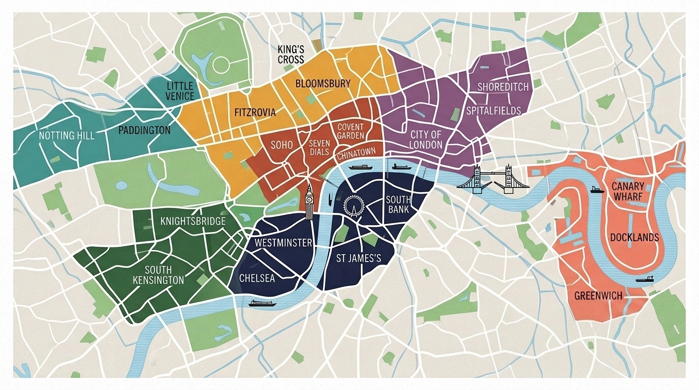

London is not a monolithic city—it is a tapestry of distinct, walkable villages stretched along the River Thames. Exploring London is about discovering these unique pockets, from historic West End theatre courtyards to maritime riverfronts and cobblestone food markets.

> 💡 **Where to start**
> - **First trip, three or four days:** the first table will fill it.
> - **Returning, or staying a week:** work through the second.
> - **Been three times already:** the third is where London actually lives.

*Central London neighbourhood map: the key visitor districts along the River Thames.*

---

---

## Start here: the essential first visit

If this is your first trip and you have three or four days, these six will fill them. All central, all walkable between, and most of what is in them is free.

| Neighbourhood | Character | Top highlight | Best for | Nearest station |
| --- | --- | --- | --- | --- |
| **[Westminster](/articles/westminster-area-guide/)** | Ceremonial and monumental | Big Ben & Westminster Abbey | First-time bucket-list sightseeing | Westminster |
| **[South Bank](/articles/south-bank-area-guide/)** | Open riverside walk, free galleries | Tate Modern & Borough Market | River walks, food markets, wet weather | Waterloo / London Bridge |
| **[Covent Garden](/articles/covent-garden-area-guide/)** | Cobbled, theatrical, busy all day | The Piazza & Seven Dials | Theatre, street performance, shopping | Leicester Square / Holborn |
| **[Soho](/articles/soho-area-guide/)** | Dense and loud, best after dark | Chinatown & Kingly Court | Dining, nightlife, live music | Tottenham Court Road |
| **[City of London](/articles/city-of-london-area-guide/)** | Roman street plan under glass towers | St Paul's & the Tower | History, architecture, free views | St Paul's / Bank / Tower Hill |
| **[South Kensington](/articles/south-kensington-area-guide/)** | Grand Victorian museum quarter | Natural History Museum & V&A | Families, free museums, wet weather | South Kensington |

---

## For a longer trip

Once the essentials are done, these reward a second or third visit. Still central or near-central, and each easily a half day.

| Neighbourhood | Character | Top highlight | Best for | Nearest station |
| --- | --- | --- | --- | --- |
| **[Bloomsbury](/articles/bloomsbury-area-guide/)** | Academic and leafy, the calmest streets in Zone 1 | The British Museum | Museums, bookshops, literary history | Russell Square / Holborn |
| **[King's Cross](/articles/kings-cross-area-guide/)** | Rebuilt railway quarter, modern and open | Coal Drops Yard | Canal walks, design, Eurostar | King's Cross St Pancras |
| **[Notting Hill](/articles/notting-hill-area-guide/)** | Bohemian pastel terraces and antique markets | Portobello Road Market | Antiques, vintage, photography | Notting Hill Gate |
| **[Shoreditch](/articles/shoreditch-area-guide/)** | Warehouses, painted walls and markets | Brick Lane & Spitalfields | Street art, markets, vintage | Shoreditch High Street |
| **[Greenwich](/articles/greenwich-area-guide/)** | Maritime village with a hill and a park | Royal Observatory & Cutty Sark | Maritime history, views, river trips | Cutty Sark (DLR) |
| **[Camden](/articles/camden-area-guide/)** | Loud, crowded and unapologetically itself | Camden Lock Market | Markets, street food, live music | Camden Town / Chalk Farm |
| **[Kensington](/articles/kensington-area-guide/)** | Palace, parkland and stucco terraces | Kensington Palace & the Kyoto Garden | Gardens, palaces, quiet walks | High Street Kensington |
| **[Mayfair](/articles/mayfair-area-guide/)** | Georgian grid, arcades and art dealers | Burlington Arcade & the Royal Academy | Galleries, architecture, browsing | Green Park / Bond Street |
| **[Marylebone](/articles/marylebone-area-guide/)** | A village high street behind Oxford Street | The Wallace Collection | Independent shopping, free art | Baker Street / Bond Street |
| **[Chelsea](/articles/chelsea-area-guide/)** | Affluent, low-rise and residential | Physic Garden & Cheyne Walk | Shopping, garden and river walks | Sloane Square |

---

Powered by <a target="_blank" rel="sponsored" href="https://www.getyourguide.com/london-l57/">GetYourGuide</a>

## Off the usual route

Further out, mostly residential, and where London stops performing for visitors. Best on a longer stay — and several of these are weekend-only propositions.

| Neighbourhood | Character | Top highlight | Best for | Nearest station |
| --- | --- | --- | --- | --- |
| **[Bermondsey](/articles/bermondsey-area-guide/)** | Railway arches, warehouses and breweries | Maltby Street Market | Food markets, breweries, galleries | London Bridge / Bermondsey |
| **[Hackney](/articles/hackney-area-guide/)** | Parks, canals and market streets | Broadway Market | Food markets, lidos, canal walks | London Fields (Overground) |
| **[Islington](/articles/islington-area-guide/)** | Georgian terraces and a mile of restaurants | Camden Passage & Upper Street | Dining, theatre, antiques | Angel / Highbury & Islington |
| **[Hampstead](/articles/hampstead-area-guide/)** | Hilltop village with 800 acres of heath | Hampstead Heath & Kenwood House | Heath walks, wild swimming, views | Hampstead / Hampstead Heath |
| **[Richmond](/articles/richmond-area-guide/)** | A Thames-side town with a deer park attached | Richmond Park | Parks, wildlife, river walks | Richmond |
| **[Canary Wharf](/articles/canary-wharf-area-guide/)** | Glass towers over Victorian docks | Crossrail Place Roof Garden | Modern architecture, dockside walks | Canary Wharf |
| **[Stratford](/articles/stratford-area-guide/)** | Post-Olympic parkland beside a vast mall | Queen Elizabeth Olympic Park | Parks, swimming, family days out | Stratford |
| **[Battersea](/articles/battersea-area-guide/)** | A rebuilt industrial landmark and a good park | Battersea Power Station | Architecture, park walks, river views | Battersea Power Station |
| **[Wapping](/articles/wapping-area-guide/)** | Cobbled warehouse streets and old river pubs | The Prospect of Whitby | Historic pubs, river walks | Wapping (Overground) |
| **[Paddington](/articles/paddington-area-guide/)** | Transport hub with a quiet canal quarter | Little Venice | Canal walks, Heathrow arrivals | Paddington / Warwick Avenue |

---

## 5 Golden Rules for Exploring London's Neighbourhoods

1. **Explore on Foot:** Central London is remarkably walkable. Walking between Covent Garden, Soho, and Westminster is often faster and much more scenic than taking the Tube!
2. **Take Advantage of Free Museums:** Standard entry to the British Museum, Natural History Museum, V&A, Science Museum, and Tate Modern is **100% free**.
3. **Use the River Bus:** For a scenic transit route between West End and Greenwich, tap in on the **Uber Boat by Thames Clippers** instead of sitting underground.
4. **Visit Food Markets for Lunch:** Skip expensive sit-down tourist restaurants and grab gourmet street food at Borough Market, Seven Dials Market, or Spitalfields Market.
5. **Check Operating Hours:** Many markets (like Portobello Road) are quiet on weekdays and peak on Saturdays, while the City of London financial district is liveliest on weekdays.

---

## Related London Guides

* 🚊 [Getting Around London: Complete Transport Overview](/articles/getting-around-london-transport-guide/)
* 🚇 [How to Use the London Underground](/articles/how-to-use-the-london-underground/)
* 💷 [London Transport Fares & Costs 2026](/articles/london-public-transport-costs-and-fares/)
* 💳 [Oyster Card vs. Contactless Guide](/articles/oyster-card-guide-london/)
* ✈️ [Heathrow Airport to London Transport Guide](/articles/heathrow-airport-to-london/)

---

*Neighbourhood exploration guides checked on 2 August 2026. Always verify attraction opening times before visiting.*
