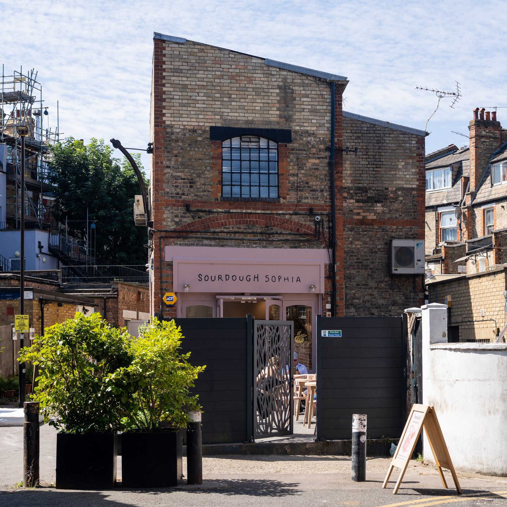
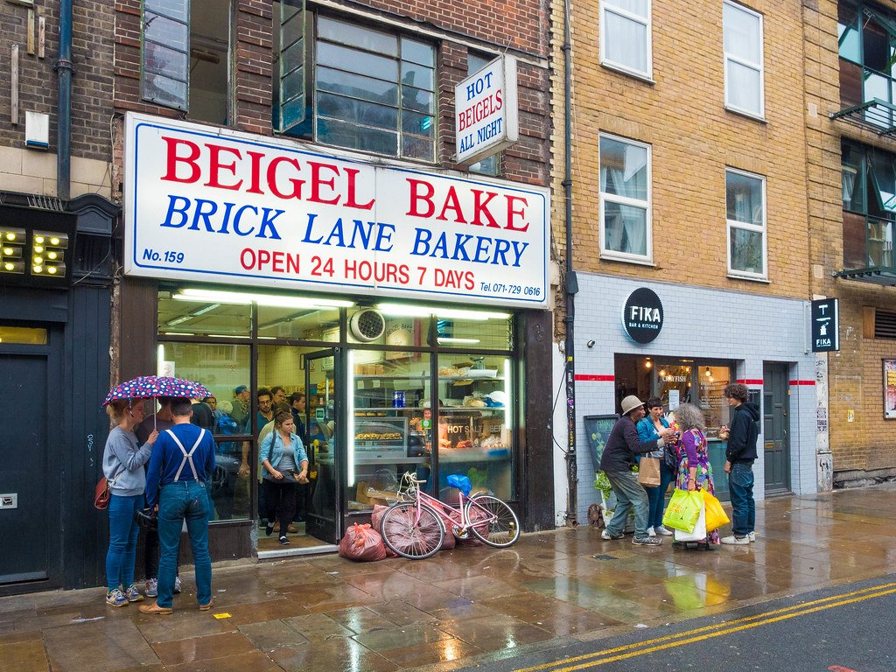
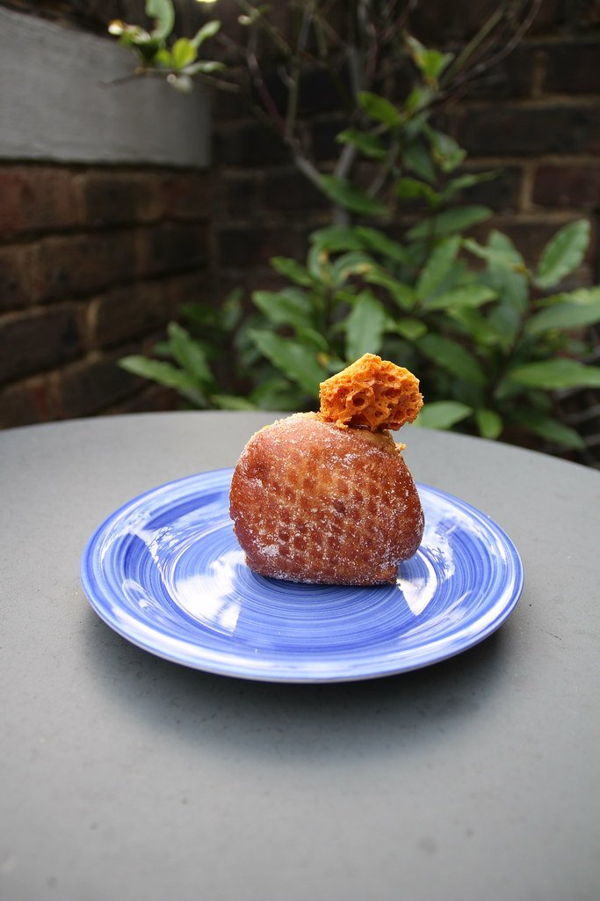
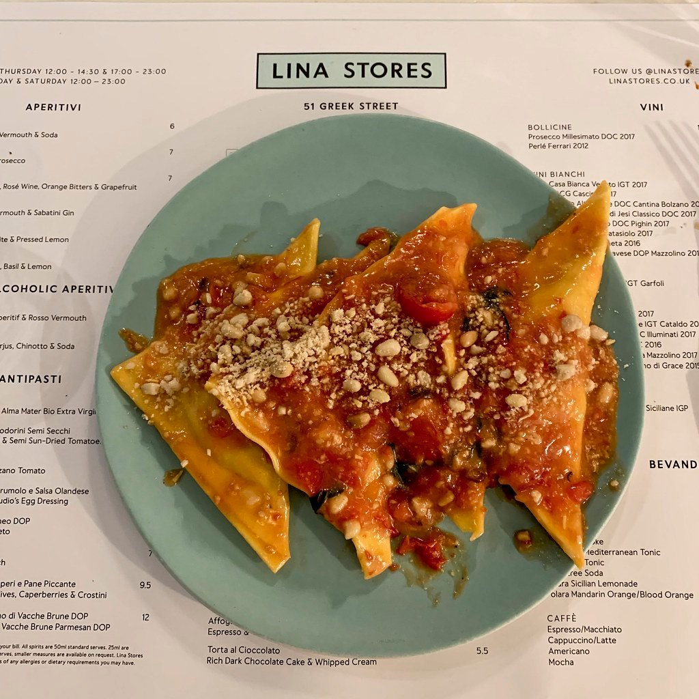

London's bread got good around 2010 and its pastry followed roughly a decade later. What has happened since is more interesting than either: the city's best bakeries are now the ones putting something other than France through French technique — **miso in the escargot, pineapple buns beside the sourdough, baobab in the danish**.

A pastry and a coffee is also **one of the cheapest good breakfasts in London**, which is worth knowing before you spend £18 on eggs.

> 💡 **The Short Version:** **Toad** in Camberwell has the queue everyone agrees is justified. **Eric's** in East Dulwich makes what several critics call the best croissant in London, and opens twice a week. **Arôme** does honey butter toast and miso bacon escargots. **E5 Bakehouse** is still the bakers' bakery. **Lisboa Patisserie** has been doing pastéis de nata on Golborne Road since 1984. And **Beigel Bake** on Brick Lane has never closed.

> 📊 **The evidence behind this guide**
> Nothing here is ranked on one visit. This pass reads **7 sources carrying 101 citations** across **61 named bakeries**. **16 bakeries are named by two or more independent sources; 10 carry a dated award.**
> **Built on:** the Good Food Guide's national bakery list — the only judged ranking for bread in Britain — plus six publications. Seven of its ten London entries were new for 2026.
> *Evidence rebuilt 30 August 2026 · [How we rank →](/how-we-rank/)*

## Where they are

| If you are near… | Where to go |
| --- | --- |
| **Covent Garden** | Arôme, Bageriet |
| **Soho & Oxford Circus** | Fred, Lina Stores |
| **Bloomsbury** | Fortitude Bakehouse |
| **Hackney & London Fields** | E5 Bakehouse, Dusty Knuckle |
| **Islington & Newington Green** | Pophams, Jolene |
| **Highgate & Crouch End** | Tarn, Sourdough Sophia |
| **Walthamstow** | Lucky Yu, Suba |
| **Camberwell & East Dulwich** | Toad, Eric's |
| **Battersea & Crystal Palace** | August, Chatsworth Bakehouse |
| **Queen's Park & Notting Hill** | Don't Tell Dad, Lisboa Patisserie |
| **Borough & Bermondsey** | Bread Ahead, Little Bread Pedlar |
| **Brick Lane** | Beigel Bake |
| **Everywhere central & west** | Buns from Home (12 branches) |

---

## What the rankings actually say

Bakeries are ranked more loosely than restaurants — there is no Michelin for bread — so it is worth knowing what the awards on this page mean.

**The [Good Food Guide's 50 Best British Bakeries](https://www.thegoodfoodguide.co.uk/best-of/britains-best-bakeries-2026)** is the closest thing to a definitive list. It is judged, dated, and national, which means a London entry has beaten bakeries from the whole country rather than just the borough. **Ten of the fifty for 2026 are in London, and seven of those ten are new entries** — a turnover rate that tells you the category is still moving fast enough that any list more than a year old is unreliable.

**The Telegraph** runs its own annual ranking, and **Time Out** reports on both rather than judging independently — a Time Out headline saying a bakery has been "crowned" usually means someone else did the crowning. That is not a criticism; it just means the two are not independent sources of the same claim, and we have not counted them as such.

**What none of them measure is consistency.** A bakery can produce the best croissant in the country on the day the judge visits and sell out by ten every Saturday thereafter. That is why the queue commentary below matters: it comes from people who went back.

---

## Britain's best, 2026

Ten London bakeries made the Good Food Guide's fifty for 2026. Seven were new entries, which tells you how fast this is moving.

### Toad Bakery, Camberwell

*The queue · Cited by 4 sources · Good Food Guide 2026*

**A Camberwell bakery that has been on every best-of list two years running**, working out of a small shopfront with a queue that regularly reaches the corner.

**Sandwiches and pastries** are the trade, and the sandwiches are what people travel for — thick fillings on their own bread, changing weekly. The pastry case runs laminated viennoiserie and a rotating list of tarts and buns, and it empties in the order things are good.

**£, walk-in, closed Monday.** Camberwell, and worth timing for late morning — the sandwich menu is up by then and the pastries are not yet gone.

### Eric's, East Dulwich

*Open two days a week · Cited by 3 sources · Good Food Guide 2026*

An East Dulwich bakery that has become the reason people cross south London on a Saturday morning — small, permanently busy, and named on the national fifty.

**Laminated pastries** are the draw: croissants with visible layers, and the flavoured versions that sell out first. The sourdough and the sandwiches on it are the other half of the trade, and the counter empties in order of how good things are.

**£, walk-in, and go early.** By late morning the pastry case is picked over; by early afternoon it is largely gone.

> ⚠️ **Open twice a week only.** Check which days before travelling — this is the single most common way to waste a trip to East Dulwich.

### Arôme Bakery, Covent Garden

*French technique, East Asian flavours · Cited by 2 sources · Good Food Guide 2026*

A French-Asian bakery on Endell Street from a team that trained in Paris and Hong Kong — and one of the few places in London doing both traditions properly rather than picking one.

The **egg tart** with a laminated pastry base is the signature, and the reason for the queue: Portuguese-Macanese custard set inside a croissant-style shell. Beside it, proper French croissants, **pandan and matcha** pastries, and a **swirl** that turns up on every Instagram round-up of the shop.

**£, walk-in.** Covent Garden, so the queue is constant; go before ten or after three.

### E5 Bakehouse, Hackney

*Under the railway arches · Cited by 3 sources · Good Food Guide 2026*

**Sourdough milled and baked under the London Fields arches**, with a café attached and **flour sold by the bag** — one of very few London bakeries that mills its own grain.

The **Hackney Wild** sourdough is the loaf the bakery is built on, and it is sold alongside the flour it is made from, so you can go home and fail to reproduce it. The café behind the counter does breakfast and lunch on the same bread, and there is a bakery school in the arch.

**£, walk-in.** Under the arches by London Fields, and busiest on a Saturday when the market is on.

### August Bakery, Battersea

*Opened late 2024 · Cited by 3 sources · Good Food Guide 2026*

A small Battersea bakery working to the modern London template — long ferments, a short counter, and a queue that forms before it opens.

**Sourdough** and **laminated pastries** are the whole offer, with a rotating list of filled croissants and buns. The bread is sold by the loaf and goes by mid-morning at weekends, and the pastry case is picked over well before that.

**£, walk-in, closed Monday.** A small shopfront with almost nowhere to sit — a counter to buy from rather than a café to settle into.

### Don't Tell Dad, Queen's Park

*Bakery and restaurant · Cited by 1 source · Good Food Guide 2026*

**A bakery, restaurant and wine bar in one Queen's Park room**, which is an unusual combination and the reason it turns up on both bakery and brunch lists.

The bakery counter runs **viennoiserie and sourdough** through the morning; the kitchen behind it serves a full menu through the day and into the evening, with a wine list that takes itself seriously. Few bakeries in London let you do both in one sitting.

**£ at the counter, more if you sit down.** Walk-in for pastries; book for a table in the evening.

### Fred Bakery, Oxford Circus

*Warm all day · Cited by 1 source · Good Food Guide 2026*

A small counter just off Oxford Street, and the most useful bakery address in central London simply because of where it is — there is almost nothing good to eat on that stretch.

**Pastries and coffee** rather than a full bread operation: croissants, buns and filled viennoiserie made to a high standard and sold quickly. The **swirls** and the flavoured croissants are what people queue for.

**£, walk-in.** Tiny, with nowhere to sit — buy and walk. Best before the lunchtime office rush takes what is left.

### Chatsworth Bakehouse, Crystal Palace

*Savoury · Cited by 2 sources · Good Food Guide 2026*

**Started as lockdown loaves and is now on the national fifty** — the queue on a Saturday morning is effectively the whole of Crystal Palace.

**Sourdough** is the foundation, with laminated pastries and a short list of filled buns beside it. The bread is long-fermented and sold the day it is baked; nothing is held over.

**£, walk-in, and open Wednesday to Saturday only** — closed Sunday, Monday and Tuesday, which catches people out. Go early on a Saturday or not at all.

### Suba Bakery, Walthamstow

*African and Asian influences · Cited by 3 sources · Good Food Guide 2026*

**On the national fifty two years running, and named for its lamination above anything else** — which is the highest compliment available to a bakery.

Lamination is the folding of butter into dough to build layers, and it is what separates a good croissant from a bread roll shaped like one. Suba's are the reference point in east London: visibly layered, shatteringly crisp, and worth the trip to Walthamstow on their own.

**£, walk-in.** Small counter; the pastry case is the whole business and it empties fast.

### Lucky Yu Bakery, Walthamstow

*British-Cantonese · Cited by 1 source · Good Food Guide 2026*

An east London bakery running **East Asian flavours through French pastry technique** — and one of the more original counters in the city rather than another sourdough-and-croissant shop.

Expect **matcha, black sesame, yuzu and miso** worked into laminated pastries and buns, alongside conventional croissants for anyone who wants one. The flavour combinations are the reason it gets written up; the technique underneath them is why they work.

**£, walk-in.** Walthamstow, and a short walk from Suba if you want to do both in one trip.

---

Powered by <a target="_blank" rel="sponsored" href="https://www.getyourguide.com/london-l57/">GetYourGuide</a>

## The other queues

Not in this year's fifty, and still among the best-loved rooms in London.

### Pophams, Islington

*Go early · Cited by 4 sources*

**Pastries at the counter and a small kitchen behind it**, so it works as breakfast and as lunch — which most bakeries in this guide do not.

The **bacon and maple croissant** is the dish Pophams is known for, and the laminated pastries around it are made in the room. The kitchen runs a short brunch menu, and there is fresh pasta at some sites in the evening.

**£, walk-in.** Islington is the original; there are sites in Hackney and Victoria Park. Get there before eleven for the full pastry range.

### Jolene, Newington Green

*Bakery and restaurant · Cited by 2 sources*

**A bakery and restaurant milling its own flour** — the whole operation is built on grain sourced from British farms and ground in-house, which almost nothing else in London does at this scale.

**Sourdough** from that flour is the foundation, with pastries and a short seasonal menu alongside. The bread is the reason to come and the reason the restaurant works: everything on the plate is built around it.

**£ at the counter.** Newington Green is the original; there are sites in Portobello and Redchurch Street. Walk-in for bread, book for a table.

### Dusty Knuckle, Dalston

*A social enterprise · Cited by 1 source*

**Bread and sandwiches from a bakery that runs a training programme for young people facing barriers to work** — and the sandwich is famous entirely on its own merits, which is the point.

The **sandwiches on their own sourdough** are what people queue for: thick-cut, heavily filled, and among the best in London on any list that is not about bakeries at all. The bread is sold by the loaf alongside.

**£, walk-in.** Dalston is the original railway-arch site; there is a Harringay branch. Go at lunch for the sandwich, early for the bread.

### Little Bread Pedlar, Bermondsey

*Wholesale and retail*

A Bermondsey bakery supplying half the good restaurants in south London, with a counter of its own attached — which means the bread you have eaten somewhere else probably came from here.

**Sourdough, viennoiserie and cakes** made in the arch behind the shop. The croissants are the counter's strength and the loaves are what the wholesale trade is built on.

**£, walk-in.** Spa Terminus, and open at weekends alongside the other Bermondsey arch producers — which is the way to visit.

### Fortitude Bakehouse, Bloomsbury

*Small and excellent · Cited by 3 sources*

**A small Bloomsbury bakehouse a couple of minutes from Russell Square** — which is a short list, in a part of London badly served for anything good to eat.

**Pastries, buns and cakes** made in the room, with coffee to match and a handful of seats to have it in. The **cardamom buns** and the seasonal tarts are what regulars come back for, and the range is deliberately short.

**£, walk-in.** Tiny, so it fills at lunchtime with people from the surrounding museums and colleges. Quietest mid-afternoon.

### Tarn, Highgate

*UK-grown grain · Cited by 1 source*

A Highgate bakery and café that became the local institution quickly — bread, pastry and a short menu, in a stretch of north London that had nothing like it.

**Sourdough and laminated pastries** through the morning, with **sandwiches on their own bread** at lunch. The counter is small and the range is short on purpose; what is there is made that day.

**£, walk-in.** A few minutes from Highgate station and close enough to the Heath to build a walk around it — which is what most people do at weekends.

### Sourdough Sophia, Crouch End

*Cruffins · Cited by 2 sources*

Started as a lockdown home bakery and now a Crouch End shop with a following that turns up before opening — one of several in this guide with that origin story and among the best of them.

**Sourdough** is the foundation and the name, with **laminated pastries and filled buns** beside it. The bread is long-fermented and the crust is the selling point.

**£, walk-in.** Crouch End, and busiest on a Saturday morning when the whole neighbourhood is in the queue.

*An Islington bakery doing long-fermented loaves and a very good cardamom bun. Photo: [Keith Page](https://commons.wikimedia.org/w/index.php?curid=196207114), [CC BY-SA 4.0](https://creativecommons.org/licenses/by-sa/4.0/).*

---

Powered by <a target="_blank" rel="sponsored" href="https://www.getyourguide.com/london-l57/">GetYourGuide</a>

## Also well supported, and not above

Five bakeries carried by three or more independent sources that this guide had no entry for. They are here because the evidence says so, not because we went looking for them.

| Bakery | Where | Sources | What it is |
| --- | --- | --- | --- |
| **Forno** | Hackney | 3 | An Italian bakery where, in The Infatuation's phrase, everywhere you look there is something that demands to be eaten |
| **Bunhead Bakery** | Herne Hill | 3 | Palestinian-inspired, and the advice from everyone who names it is the same: go early and get everything |
| **Layla Bakery** | Ladbroke Grove | 3 | A corner neighbourhood bakery with a weekend queue |
| **Kuro Bakery** | Notting Hill Gate | 2 | Tiny, with sourdough, cakes and a bread-and-butter pudding people order specifically |
| **Common Breads** | Victoria | 2 | Lebanese, doing traditional bakes central London otherwise has none of |

---

## The one that is everywhere

### Buns from Home, twelve branches

*Chain · mostly central and west*

Started by a baker called Barney making pastries in his mother's kitchen for neighbours during lockdown, crowdfunded into a shop in west London, and now **twelve branches** — Notting Hill, Holland Park, Oxford Circus, Bank, Covent Garden, Marylebone, Sloane Square, Canary Wharf and more.

It belongs here for a reason none of the others do: **it is the good bakery you can actually find**. The cinnamon buns are large, generously filled and not oversweet, the flavours rotate, and you are rarely more than a few stops from one. When the plan falls apart — Eric's is shut, Toad has sold out, you are nowhere near Walthamstow — this is the fallback that does not feel like a compromise.

> ⚠️ **Consistency is the trade-off.** Recent reviews raise stock control and variation between branches, which is the standard cost of growing this fast. Expect a queue, and expect the best flavours to be gone at peak.

---

## Institutions

### Lisboa Patisserie, Notting Hill

*Golborne Road · since 1984*

**Pastéis de nata** done the way they should be — scorched on top, the pastry shattering rather than bending — at a fraction of what central London charges for a worse version. Trading since 1984, and the reason Golborne Road smells the way it does on a Saturday.

This is the north end of Portobello, past the antiques and past most of the tourists, in the Portuguese community that has been on this street for decades. Order at the counter, take it standing, and do not overthink it.

### Beigel Bake, Brick Lane

*Open 24 hours*

**Salt beef beigels at any hour of the day or night**, for a few pounds, from a counter that has genuinely never closed. It is the answer to a very specific question — where to eat at four in the morning — and also just a good beigel at two in the afternoon.

The other Brick Lane beigel shop a few doors down has its own partisans and a long-running rivalry with this one. Try both; people have opinions about this that are out of proportion to the stakes.

*Open around the clock, and the queue is the same at four in the morning as at lunchtime. Photo: [chas679](https://www.flickr.com/photos/128863823@N04/20362225603), [CC BY 2.0](https://creativecommons.org/licenses/by/2.0/).*

### Bread Ahead, Borough Market

*Doughnuts*

**The crème brûlée doughnut is blowtorched in front of you**, which is the reason for the queue and a fair one. It started as one Borough Market stall and is now a bakery school and a small chain.

The **doughnuts** are the whole business: filled to order with vanilla custard, salted caramel or seasonal fillings, and heavy enough to count as lunch. Bread and pastries alongside, and a **baking school** in the same building if you want to learn to make them.

**£, walk-in, closed Monday.** Borough Market gets impassable by midday at weekends — go early.

*The doughnuts are the draw, filled to order. The bakery school upstairs teaches you to make them. Photo: [Bex.Walton](https://www.flickr.com/photos/7831824@N04/35138538481), [CC BY 2.0](https://creativecommons.org/licenses/by/2.0/).*

---

## Elsewhere in Europe

### Bageriet, Covent Garden

*Swedish*

**A tiny Swedish bakery on Rose Street**, hidden down an alley off Covent Garden, and the only place in central London doing Scandinavian baking properly.

**Kanelbullar** — the cardamom-heavy Swedish cinnamon bun, which is a different thing from the American version — plus **prinsesstårta**, the green marzipan-domed princess cake, and semlor in season. Everything is made in the basement below the shop.

**£, walk-in.** It seats about six, so most people take it away. Closed Sundays, and easy to walk past.

### Lina Stores, Soho

*Italian · since 1944*

**The mint-green Brewer Street deli since 1944**, now with restaurants attached — but the shop is the original and still the reason to go.

A **fresh pasta counter** with the pasta made daily and sold by weight, plus a full Italian deli: cured meats, cheese, oils and tinned fish. **The restaurants came much later than the shop**, and the counter remains the better proposition if you can cook.

**££ at the deli.** Walk-in for the shop; the restaurants take bookings and the Greek Street site has the longest queue.

*A 1944 Italian deli that turned into a pasta bar. The green stripes are on everything they own now. Photo: [Bex.Walton](https://www.flickr.com/photos/7831824@N04/48224733512), [CC BY 2.0](https://creativecommons.org/licenses/by/2.0/).*

---

## Best value

Bakeries are one of the few areas where the best thing in the category is also nearly the cheapest.

* **Beigel Bake** — a salt beef beigel under £8, at four in the morning if you want.
* **Lisboa Patisserie** — pastéis de nata at Golborne Road prices, not Notting Hill ones.
* **A pastry and a coffee anywhere on this list** is £6–£8, and a better breakfast than most cafés will sell you for three times that.
* **Chatsworth Bakehouse** — pizza by the slice and focaccia sandwiches, for lunch rather than breakfast.

---

Powered by <a target="_blank" rel="sponsored" href="https://www.getyourguide.com/london-l57/">GetYourGuide</a>

## Planning a bakery morning

**Timing is the whole game.** Pastries are laminated overnight and baked in the early morning; what is on the counter at eight is not what is there at two. Bread usually appears mid-morning. If there is one item you have come for — the honey butter toast, the cruffin, the maple challah doughnut — assume it will be gone by lunchtime at a weekend, and treat anything still available at four as a bonus rather than a plan.

**Two bakeries in a morning is realistic; four is not.** The pairs in the table above are deliberate — Lucky Yu and Suba are both in Walthamstow, Toad and Eric's are a short ride apart in south London, Pophams and Jolene are both in the Islington-to-Newington-Green corridor. Those are the routes worth building a morning around.

**Where to put a bakery in a day.** Fred at Oxford Circus and Arôme in Covent Garden are the two that fit inside a normal sightseeing day without a detour. Everything else is a decision to go somewhere, which is fine — but do not put Camberwell in the middle of a Westminster afternoon and expect it to work.

**Cash and cards.** Almost everything here takes cards. Lisboa Patisserie is the one where cash still moves the queue faster.

**Sitting down.** Several of these are counters with a shelf, not cafés. Dusty Knuckle, Jolene, Don't Tell Dad and Chatsworth Bakehouse all do proper sit-down food; Fortitude, Bageriet and Lisboa are small rooms where a table is luck rather than a plan.

---

## What to know

* **Go early.** The best bakeries sell out, often by early afternoon at weekends.
* **Check the opening days.** Eric's opens twice a week. Several others close Mondays. This is the commonest wasted journey.
* **Sourdough is £4.50–£6** for a proper loaf. Anything much cheaper is not sourdough in any meaningful sense.
* **The queue is not always the signal.** Toad's queue is widely agreed to be worth it; some central London queues are photography, not baking.
* **Seven of London's ten best are new entries**, so a list you read two years ago is out of date. Check dates on anything you follow.
* **Gluten-free is rare and rarely safe** at a flour-heavy bakery. Ask directly — most will be straight with you about the contamination risk rather than sell you something unsafe.

---

## Continue planning your London trip

- ☕ **[The Best Coffee in London](/articles/best-coffee-london/)**
- 🍳 **[The Best Breakfast and Brunch in London](/articles/best-breakfast-brunch-london/)**
- 💷 **[Cheap Eats in London](/articles/cheap-eats-london/)**
- 🛍️ **[London Markets by Day](/markets/)**
- 🎨 **[Shoreditch Area Guide](/articles/shoreditch-area-guide/)**
- 🛍️ **[Notting Hill Area Guide](/articles/notting-hill-area-guide/)**
