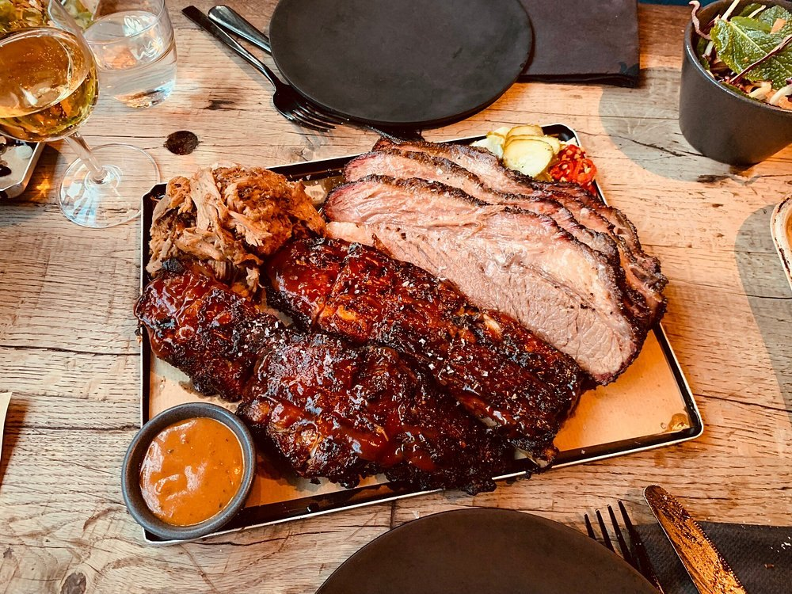
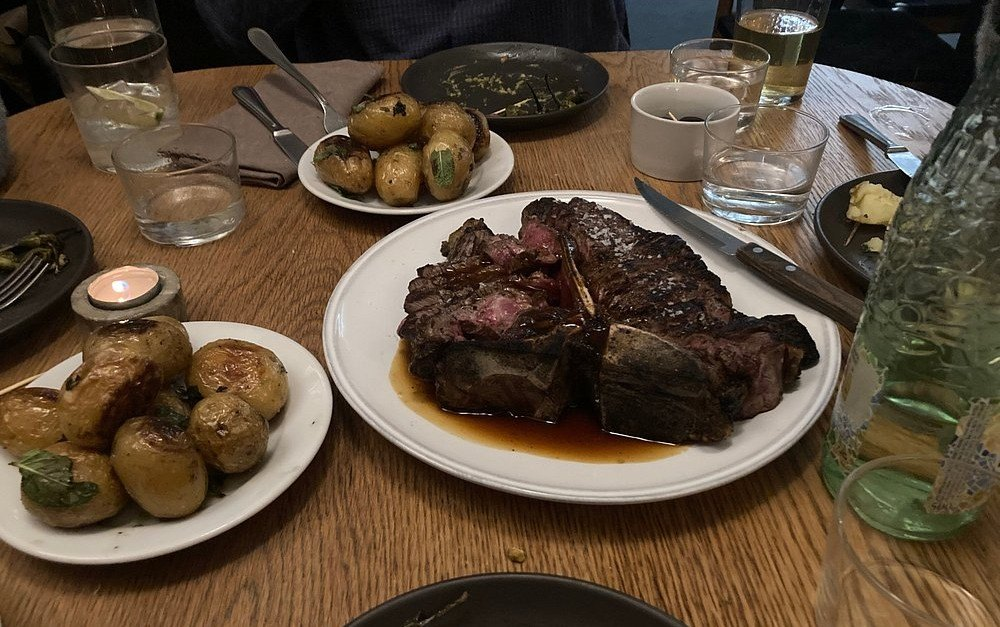
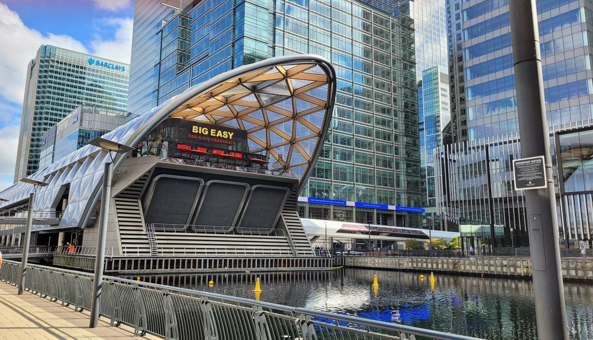
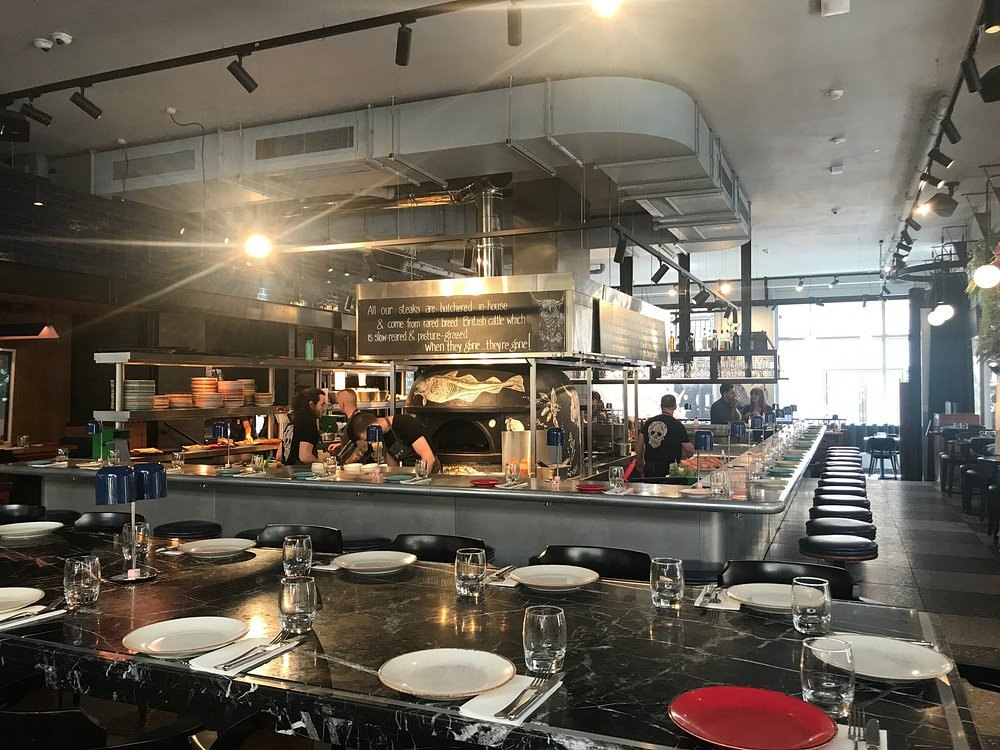

Search for the best brisket in London and you will not find a single piece of journalism.

Every result on the first page is an aggregator or a restaurant's own SEO page — **Big Easy explaining why it serves the best beef brisket in London, another explaining where you can find it, both outranking every masthead in the country.** Two restaurants have written the answer to the reader's question as "here", and nothing has been published to argue otherwise.

So this is a guide to a subject that has demand and almost no serious coverage. There is no judged award either: **Britain's barbecue society judges competition cook teams, not restaurants**, and the other name people remember has been liquidated since 2018.

> 💡 **The Short Version:** **Smokestak** is named by nine of fifteen sources, more than anything else. **Acme Fire Cult** is second and leads on vegetables. **Texas Joe's** is the Hill Country one — and is **closed Sunday and Monday**. **Cue Point**, Afghan flavours through Texan technique, is Time Out's number one. A surprising amount of this is cooked in brewery yards.

> 📊 **The evidence behind this guide.**
> Nothing here rests on one visit. This pass reads **15 independent sources carrying 159 citations** across **87 named venues**. **26 are named by two or more sources.**
> **Built on:** six mastheads, six independent blogs and three YouTube channels — counted per creator, so a channel's five videos are one voice. No judged award exists for this topic.
> *Evidence built 8 September 2026 · [How we rank →](/how-we-rank/)*

## Where they are

| If you are near… | Where to eat |
| --- | --- |
| **Shoreditch** | Smokestak |
| **Dalston & Hackney** | Acme Fire Cult (40FT Brewery), From The Ashes (Five Points) |
| **Hackney Wick** | Hon's BBQ (Crate Brewery) |
| **London Bridge & Bermondsey** | Texas Joe's |
| **Notting Hill** | Cue Point |
| **Soho** | Temper |
| **St John's Wood** | Cinder |
| **Leyton** | Burnt Smokehouse |
| **Chelsea & central** | Big Easy |
| **Brixton** | Maureen's Brixton Kitchen |

**Price guide:** **£** under £15 a head · **££** £15–£30 · **£££** £35+.

---

## The most-cited

### Smokestak — twelve to fourteen hours over English oak

*££ · Shoreditch · Cited by 9 sources*

*The brisket, with the bark and the smoke ring the twelve hours are for. Ribs and pulled pork alongside.*

**Nine of fifteen sources name it, more than anything else in this pass**, and it also holds a Michelin Bib Gourmand — the only entry here with any judged recognition at all, though that is a general award rather than a barbecue one.

**The beef brisket is the dish.** It is smoked overnight for twelve to fourteen hours over English oak, then served in a slightly sweet, pillowy bun — moist and smoky rather than dry and bark-heavy.

The room is dark, semi-industrial and loud, with music thumping through it. Time Out's description is eating in a medieval nightclub, which is fair warning either way: this is not a place for a quiet conversation.

### Acme Fire Cult — second on the list, and the vegetables lead

*££ · 40FT Brewery, Dalston · Cited by 7 sources*

*The chop, which is the exception rather than the rule here - the menu is built the other way round, on vegetables.*

The second most-cited barbecue restaurant in London **builds its menu primarily around vegetables**, which is not what anyone expects from this list and is exactly why it is on it. Chef Andrew Clarke cooks over live fire but has moved deliberately away from what the trade calls dude food, using fermenting and preserving to cut waste. Meat is on the menu - there is a chop to share - but it is not the organising idea.

It sits **inside a working brewery** in Dalston - the Bootyard on Abbot Street, in 40FT - so the setting is a yard rather than a dining room, and the drinks list is what is brewed a few metres away.

**It takes bookings**, which most of the brewery-yard places do not, and runs a separate Sunday feasting menu that is the version most people are told about.

### Texas Joe's — Hill Country, and closed half the week

*££ · Bermondsey, by London Bridge · Cited by 6 sources*

**Joe Walters opened it in 2013 specifically to bring Hill Country barbecue to London**, and it is the closest thing here to the Texan original: a canteen-style room by London Bridge where slow-smoked meat is the whole proposition. He is a Texan, and funded the move with a beef jerky business he talked the Dragons' Den panel into backing.

**Beef brisket, chicken thighs, pork ribs and mutton shoulder go over oak**, and the sides are the part people quote back at you - bacon-wrapped jalapeños, and a cakey jalapeño cornbread.

It is **closed Sunday and Monday**, lunch runs Thursday and Friday only from noon to 3pm, dinner is Tuesday to Friday from 5pm and Saturday from noon, with last food orders at 9.30pm and the bar to 11pm. Booking is recommended.

> ⚠️ **Check the day before you go.** It is **closed Sunday and Monday**. Lunch runs **Thursday and Friday only**, noon to 3pm; dinner Tuesday to Friday from 5pm, Saturday from noon, with last food orders at 9.30pm. Booking is recommended.

### Cue Point — Afghan flavours, Texan technique

*££ · The Garden Bar, Notting Hill · Cited by 5 sources*

**Time Out's number one**, and the clearest example of where London barbecue has actually gone. **Mursal Saiq and Joshua Moroney** cook Afghan flavours through Texan tradition — torshi pickles alongside brisket burnt ends and hot link sausages — after years of residencies across the city before settling into a permanent site.

**There is a second thing going on here and it is not a marketing line.** Saiq and Moroney run the business as a training route for refugees - professional catering courses and qualifications, alongside language teaching and trauma therapy. It is a working kitchen that is also a programme, and none of the published barbecue lists mentions it.

If you only eat at one place on this page to understand what is different about barbecue in London rather than Austin, make it this. After years of moving between residencies it now has a permanent home — **The Garden Bar, Grill & Smokehouse, 41 Bramley Road, W10 6SZ**, open Tuesday to Saturday for lunch from noon to 4pm and dinner from 6pm to 10pm, with a Sunday roast served noon to 6pm. **It takes bookings, and the kitchen is fully halal.**

### Cinder — the one that is fun about it

*££ · St John's Wood and Belsize Park · Cited by 4 sources*

Painted tiles and bare plaster, with LEGO figurines and miniature chairs made out of Champagne cages scattered through the room. The cooking is serious and the room refuses to be, which is a rarer combination in this category than it should be.

**It is the debut solo project of Jake Finn, formerly of the Ritz**, and there are two of them - St John's Wood and Belsize Park. The heat comes off a **coal-fired Josper grill** rather than a smoker, so this is smoke-and-small-plates rather than low-and-slow: roasted squash with cashew dukkah and chimichurri, barbecued octopus.

**Both sites take bookings**, and they are the reason north London does not have to go east for live-fire cooking.

### Big Easy — ribs and cheap lobster

*££ · Chelsea and central branches · Cited by 4 sources*

*The Canary Wharf branch, on the Park Level of Crossrail Place. The strapline under the sign reads cocktails, steaks, lobster and live music, which is the whole proposition in four words.*

The original Chelsea branch built its reputation on **bargain-price lobster alongside pit-cooked ribs**, which is still the reason to go. A mini-chain now, loud and deliberately unserious, with live bands, and the one on this page most suited to a large group who cannot agree.

**Of the branches, Canary Wharf is the nicest room by some way.** It sits on the Park Level of Crossrail Place, under the timber lattice roof, with the roof garden alongside it — so a chain that is a shopping-centre proposition almost everywhere else is, here, inside one of the better pieces of architecture in east London.

**Park Level, Crossrail Place, E14 5AR.** Monday noon to 9pm, Tuesday to Thursday noon to 10pm, later on Friday and Saturday.

### Temper — a short menu, held to

*££ · Soho · Cited by 4 sources*

*The counter wraps the fire. The board above the pass is where the steaks are explained - and where it says that when they are gone, they are gone.*

Open-fire cooking around a counter that wraps the kitchen, so you sit watching the wood oven work. Two sites, **Soho and the City**, open since 2016, and the menu runs tacos alongside the meat — there is a Taco Tuesday, which tells you how seriously it takes itself.

**The board above the pass is the thing to read.** It says the steaks are butchered in-house and come from rare-breed British cattle, slow-reared and pasture-grazed — and then, in the same hand, *when they're gone, they're gone*. That is the sells-out warning this category is known for, printed where you can see it.

It takes bookings and does a Sunday roast.

### Burnt Smokehouse — Leyton, and worth the Central line

*£–££ · Leyton · Cited by 3 sources*

A local couple, **Sufia Khan and Abidur Tarafder**, working with **Tiberius Tudor**, a Romanian-born American barbecue specialist. It has become a serious local fixture in a part of London the guides rarely reach.

The cooking is **Texas-style rather than British-live-fire**: smoked brisket is the thing to order, with smash burgers alongside it for anyone who is not in the mood for a tray of meat. Seating is communal, so a table for two on a Saturday means sitting with other people.

**It is out at Leyton**, which is the whole reason it is under-covered - twenty-odd minutes on the Central line from Oxford Circus, and none of the mastheads that write about Shoreditch make the trip.

---

Powered by <a target="_blank" rel="sponsored" href="https://www.getyourguide.com/london-l57/">GetYourGuide</a>

## The smoker is in a brewery yard

This is the London-specific thing about the subject, and no other guide separates it out. Smokers need space, extraction and neighbours who will not complain, and breweries have all three — so a good share of the city's barbecue is cooked in a working brewery yard rather than a restaurant kitchen.

**Acme Fire Cult** is inside 40FT Brewery in Dalston. **From The Ashes** is at Five Points in Hackney, and is Time Out's pick for barbecue Sunday roast. **Hon's BBQ**, cooking Chinese-Texan, sits above Crate Brewery in Queen's Yard, Hackney Wick.

It changes the visit rather than just the address: you are eating in a yard, often outdoors, on the brewery's hours rather than a restaurant's, with the drinks list built around what is brewed on site. Check opening times against the brewery rather than the kitchen.

---

## Diaspora smoke, which is where the new cooking is

Straight American barbecue is well represented in London and it is no longer the interesting part. The cooking that has moved is barbecue run *through* another tradition rather than beside it:

**Cue Point** does Afghan flavours with Texan method, and tops Time Out's list. **Hon's BBQ** is Chinese-Texan. **Maureen's Brixton Kitchen** runs a Jamaican home kitchen as a takeaway operation on Railton Road.

None of the published London lists groups these together, which is why the pattern is easy to miss — each one reads as an individual oddity rather than as the direction the subject has taken.

---

## What is not here, and why

**Korean, Turkish and Japanese barbecue have their own guides.** Removing Korean tabletop grilling, Turkish ocakbaşı and Japanese yakiniku costs each published London list only one to three names out of twelve to nineteen, which is what makes this guide worth writing separately rather than as a section of a bigger one. For those, see our [Korean](/articles/best-korean-restaurants-london/) and [Turkish](/articles/best-turkish-restaurants-london/) guides.

**Live-fire restaurants are a judgement call, and the publishers made it before we did.** Eater runs one page titled for both barbecue and live-fire cooking, and five publications independently put live-fire grills inside their barbecue guides. Temper and Acme Fire Cult are here on that basis. The tension is real — someone wanting brisket will not be satisfied by a Galician chop — which is why they are separated above rather than mixed in.

**Two names on live lists have closed.** Hotbox shut its flagship in January 2022 and its company is recorded as permanently closed; Prairie Fire announced its own closure after a Super Bowl tailgate. Both are still being recommended elsewhere.

*Evidence built 8 September 2026 from fifteen independent sources. Opening days for Texas Joe's are from its own site the same day. Closure records are from trade press, Companies House and the venues' own announcements. Barbecue restaurants change days often — check before crossing London.*
