London does two different breakfasts and it helps to know which you want. There is the **Australian brunch** the city imported around 2010 — hotcakes, avocado, a serious flat white — and there is the **fry-up**, which predates all of it and is mostly found somewhere less photogenic.

Both are here, alongside the hotel rooms where breakfast is a business meeting.

> 💡 **The Short Version:** **The Wolseley** is the London power breakfast in a 1920s car showroom. **Dishoom's bacon naan roll** is the one worth queueing for. **Granger & Co** started the London brunch thing and the hotcakes are still on the menu. **Duck & Waffle** is open 24 hours forty floors up. And **Wetherspoons** does a cooked breakfast from 8am for a few pounds.

> 📊 **The evidence behind this guide**
> Nothing here is ranked on one visit. This pass reads **14 sources carrying 211 citations** across **162 named rooms**. **36 rooms are named by two or more independent sources; 9 by three or more.**
> **Built on:** fourteen sources across every price point, from a Michelin-starred breakfast to a £6.50 fry-up in Newham, with twenty-five caffs individually priced.
> *Evidence rebuilt 31 August 2026 · [How we rank →](/how-we-rank/)*

## Where they are

| If you are near… | Where to eat |
| --- | --- |
| **Piccadilly & Mayfair** | The Wolseley, Fallow |
| **The City & Liverpool Street** | Duck & Waffle, Darwin Brasserie, Polo Bar, The Crosse Keys, Hamilton Hall |
| **Covent Garden** | Dishoom |
| **Fitzrovia & Marylebone** | Berners Tavern, TOKii, Kaffeine, The Attendant |
| **Clerkenwell** | Caravan, Prufrock |
| **Notting Hill & west** | Granger & Co, Beany Green |
| **Southwark & Bankside** | The Table Café |
| **South London** | Milk (Balham), WatchHouse (Bermondsey) |
| **North London** | Ginger & White (Hampstead) |

**Price guide:** **£** under £15 · **££** £15–£30 · **£££** £30–£50 · **££££** £55+.

---

## The London institutions

### The Wolseley, Piccadilly

*£££ · 3 min from Green Park* · Cited by 2 sources

A 1920s Wolseley Motors showroom on Piccadilly, turned into a Viennese-style grand café — vaulted ceilings, black lacquer and brass, and a room designed to be walked into slowly. **The London power breakfast**: if you want to see how the city does business over eggs, sit here at 8am on a weekday.

The menu runs from viennoiserie and classic egg dishes through to a full English, and — unusually — **kedgeree**, the Anglo-Indian smoked haddock and rice dish that was a Victorian breakfast staple and has almost vanished from London menus. Fruit, yoghurts and cereals for anyone not committing.

**Breakfast runs 7am–11.30am on weekdays and 8am–11.30am at weekends.** Early on a weekday is both the easiest table and the best show.

### Dishoom, Covent Garden

*££ · 3 min from Covent Garden · 7 London sites* · Cited by 3 sources

The first of them, opened in **2010** by cousins Shamil and Kavi Thakrar, and a recreation of the **Irani cafés of 1960s Bombay** — Parsi-run all-day rooms that were among the few places in the city where anyone could sit regardless of caste or religion. The detail is obsessive: sepia photographs, ceiling fans, marble-topped tables, bentwood chairs.

The **bacon naan roll** is the dish that turned a dinner restaurant into a breakfast destination — smoked streaky bacon, cream cheese, chilli-tomato jam and herbs in a fresh naan, and there is a double version at £9. Beside it, **akuri** (soft eggs with chilli, coriander and ginger), the Big Bombay, and chai poured from a height.

**Breakfast and lunch barely queue, unlike the evenings**, and any party size can book before 6pm. Eleven sites across the UK now, seven of them in London, with Borough opening — but Covent Garden is the original.

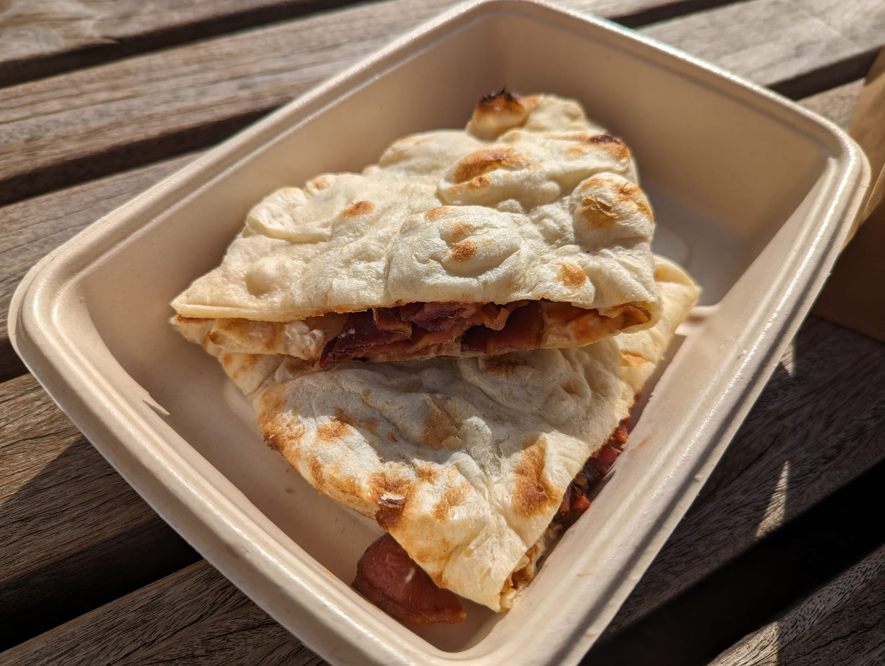
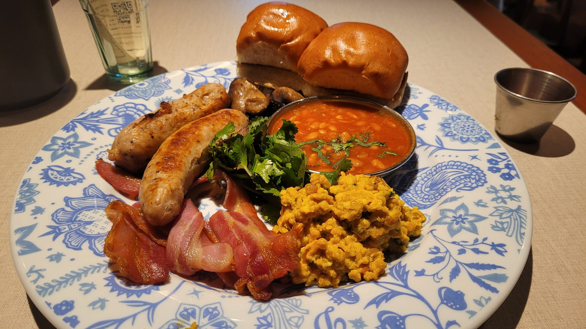

### Duck & Waffle, City of London

*££££ · 3 min from Liverpool Street · 24 hours · one site* · Cited by 2 sources

The **40th floor of Heron Tower**, wraparound floor-to-ceiling windows, and **open around the clock** — the only place in London where you can watch the sun come up over the City with a plate in front of you. There is an open kitchen in the middle of the room and a 24-seat indoor-outdoor bar, so it is livelier at 2am than most places are at 8pm.

The dish it is named for is **two waffles stacked with a confit duck leg and a fried duck egg**, with a jug of mustard maple syrup poured at the table. Around it a tapas-style menu of small plates, a long list of sweet and savoury waffles from duck benedict to caramelised banana, and a **foie gras 'all day breakfast'** that is exactly what it sounds like.

**Breakfast proper runs 6am–11am**, though the kitchen never actually stops. A three-course Sunday roast at that height is the other reason to come. **Book** — the window tables go weeks ahead, and a table away from the glass is a different, lesser experience.

### Berners Tavern, Fitzrovia

*££££ · a vast Edwardian ballroom* · Cited by 1 source

**Jason Atherton's** dining room inside The London EDITION on Berners Street, and probably the most photographed room in London — a vast Edwardian ballroom with every inch of wall hung with framed pictures, under chandeliers. It is loud at dinner and near-silent at breakfast, which is the argument for coming in the morning.

Smoked salmon and scrambled egg on sourdough, **brioche French toast**, eggs Florentine and a full English, with lighter fruit and pastry options. The signature flourish is a **Bloody Mary trolley** wheeled to the table with three different twists to choose from.

Breakfast runs daily, with brunch on Saturday and a Sunday lunch. Worth booking for weekends; on a weekday morning you can usually walk into a room people photograph from the doorway.

### Hide, Mayfair

*££££ · Michelin-starred · one site* · Cited by 2 sources

**Ollie Dabbous's** restaurant at 85 Piccadilly, opened with Hedonism Wines and looking straight out over **Green Park**. Breakfast is served in **Ground**, the ground-floor room, under a sculptural oak staircase that spirals up through all three floors — one of the few dining rooms in London people photograph for the joinery.

**A Michelin-starred kitchen that serves breakfast, which almost none do.** The menu runs in four parts: fruits, seeds and grains; **viennoiseries baked on site every morning** at the open bakery; a caviar and oysters section; and a savoury selection built around the signature **HIDE croque monsieur**. Elsewhere, **truffled scrambled eggs**, a reworked full English, avocado on toast, and a house granola.

The open bakery is the thing to know about: the bread, cakes and pastries are made in the room and you can watch it happen, which is not true of any other Michelin kitchen doing breakfast here.

The most expensive breakfast in this guide by a distance, and the one most likely to be somebody's expense account. **Book**, and ask for a window table on the park side.

### Fallow, St James's

*£££ · nose-to-tail* · Cited by 2 sources

The St James's Market kitchen from two ex-Dinner chefs, built around using the whole animal and the parts other restaurants throw out — the dinner menu is known for a **smoked cod's head with sriracha butter** and ex-dairy-cow steak. Breakfast is built on the same thinking rather than being a separate, safer menu.

The **Fallow Full** — smoked bacon, black pudding, sausage, herbed mushrooms, fried eggs, tomatoes and sourdough — sits alongside a **Black Pudding Benedict**, Turkish eggs, wild mushrooms on toast, and the **corn ribs with kombu seasoning** that came off the dinner menu and stayed. Rye sourdough with Longman's butter, and a granola with London honey.

**52 Haymarket**, a few minutes from Piccadilly Circus. Book — this is a restaurant that serves breakfast rather than a café, and it fills.

---

## Australian brunch

The format that changed London breakfast, still done best by the people who brought it.

### Granger & Co, Notting Hill

*£££ · Bill Granger* · Cited by 4 sources

Bill Granger brought Sydney brunch to London in 2011 and effectively invented the format the rest of this section follows. The Notting Hill room is the original and the **smallest of the four**, all white walls and communal light — closer to Bondi than to Westbourne Grove.

The **ricotta hotcakes with fresh banana and honeycomb butter (£19)** are the dish people cross London for and have not changed in over a decade. Around them: scrambled eggs done the soft Granger way, a shrimp burger, and a lot of avocado.

**No bookings, seven days a week, and the queue is real.** Come before 10am or around 3pm and you will walk in; arrive at 11 on a Saturday and you will not.

### Caravan, Clerkenwell

*£ · Exmouth Market · 7 London sites · its own roastery* · Cited by 1 source

The Exmouth Market room that is **more responsible than any other for London's brunch-and-flat-white culture** — New Zealanders opened it in 2010, and the all-day, globally-magpie menu with serious coffee attached became the template half this guide follows.

It is now a **seven-site London group** — Bankside, Canary Wharf, the City, Exmouth Market, Fitzrovia, King's Cross and Vardo in Chelsea — which is worth knowing, because "Caravan" on a list could mean any of them. The Fitzrovia one is inside the **former BBC Radio 1 headquarters**.

The coffee is roasted at **Lamb Works**, an 8,500 sq ft Victorian warehouse in Islington that also holds the quality-control lab, a coffee school and the bakery. The kitchen treats brunch as a proper exercise rather than a holding pattern until dinner: jalapeño cornbread with a fried egg, chorizo and potato hash, vanilla pancakes with date molasses.

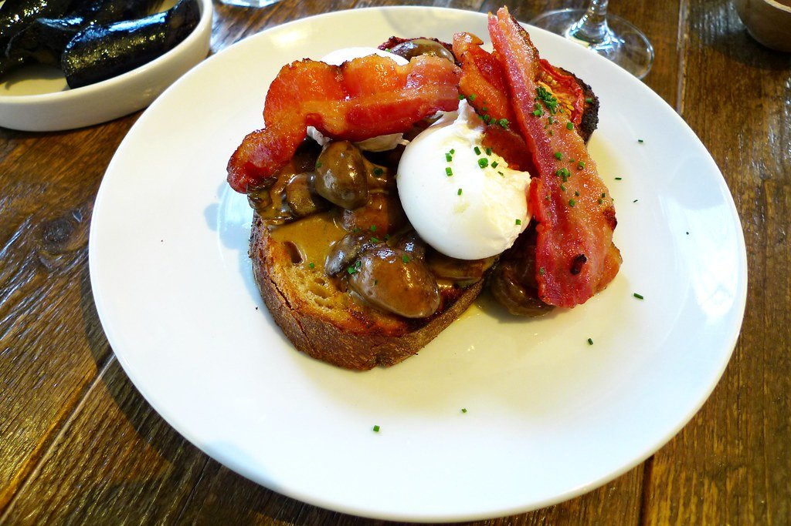
*Caravan roasts its own coffee and treats brunch as a proper kitchen exercise rather than a holding pattern until dinner. Photo: [Ewan-M](https://www.flickr.com/photos/55935853@N00/5624757340), [CC BY-SA 2.0](https://creativecommons.org/licenses/by-sa/2.0/).*

### Milk, Balham

*££ · 3 min from Balham · one site* · Cited by 3 sources

On **Hildreth Street Market since 2012**, opened by **Julian Porter and Lauren Johns**, and the room that made people cross the river for brunch before south London brunch was a thing. They knocked through into the shop next door in 2015 to double it, and it is still small and still deafening at 11am on a Sunday.

The dish to order is the **Convict Gloucester** — an Old Spot pork patty on an English muffin with streaky bacon, scrambled eggs, Lincolnshire Poacher and the **hangover sauce** the place is known for. Beside it the **Sweet Maria**, the banana bread, a secret-recipe granola, and poached eggs under a burnt butter hollandaise.

The coffee is taken as seriously as the food: **an exclusive roast with Assembly** in Brixton, with Plot Roasting also on the bar. Porter and Johns also run Fields on Clapham Common, but Milk itself has never opened a second site — which is unusual for something this well known.

**No bookings**, and the queue moves: even at weekends you are unlikely to wait more than half an hour, which by London brunch standards is nothing.

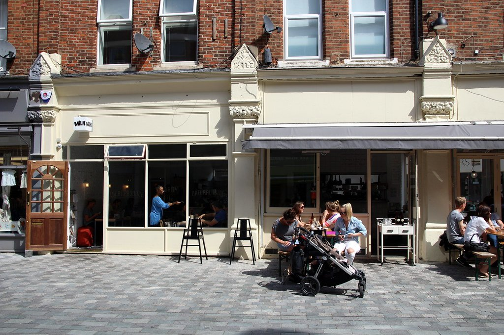
*The Balham café that drew people across the river before south London brunch was a thing. Photo: [Bex.Walton](https://www.flickr.com/photos/7831824@N04/28220076190), [CC BY 2.0](https://creativecommons.org/licenses/by/2.0/).*

### Beany Green, Little Venice

*££ · the towpath*

Part of the Australian **Daisy Green** group, sitting right on the canal towpath at Paddington Basin with a big terrace — the easiest genuinely good breakfast within walking distance of Paddington station, and the only one on this list where you eat beside narrowboats.

**Breakfast is served all day, every day**, which is rarer in London than it should be. The award-winning **banana bread sandwich** is the thing to order, with buttermilk blueberry pancakes and a smashed avocado sandwich behind it.

Walk-in, and the terrace is first-come. If it is raining the room is small; if it is not, this is one of the better outdoor breakfasts in central London.

---

## The proper fry-up

### The Table Café, Southwark

*££ · 5 min from Southwark · no bookings · 2 sites*

An independent on Southwark Street **since 2005**, doing a proper cooked breakfast alongside the brunch menu on seasonal British sourcing rather than the usual imported-avocado economy. There is a second site on Battersea Rise, so check which one a listing means.

The **Borough Full English** anchors the menu, with a whole family of eggs benedicts, sweet and savoury waffles, pancakes and a vegan pancake stack. Prices are among the most honest in central London: **big breakfasts £11–13, breakfast bruschetta £9.50, pancakes and waffles £8–9.**

**The terrace runs seven days and takes no bookings**, which makes it one of the more likely places to get a table on a Saturday in Bankside.

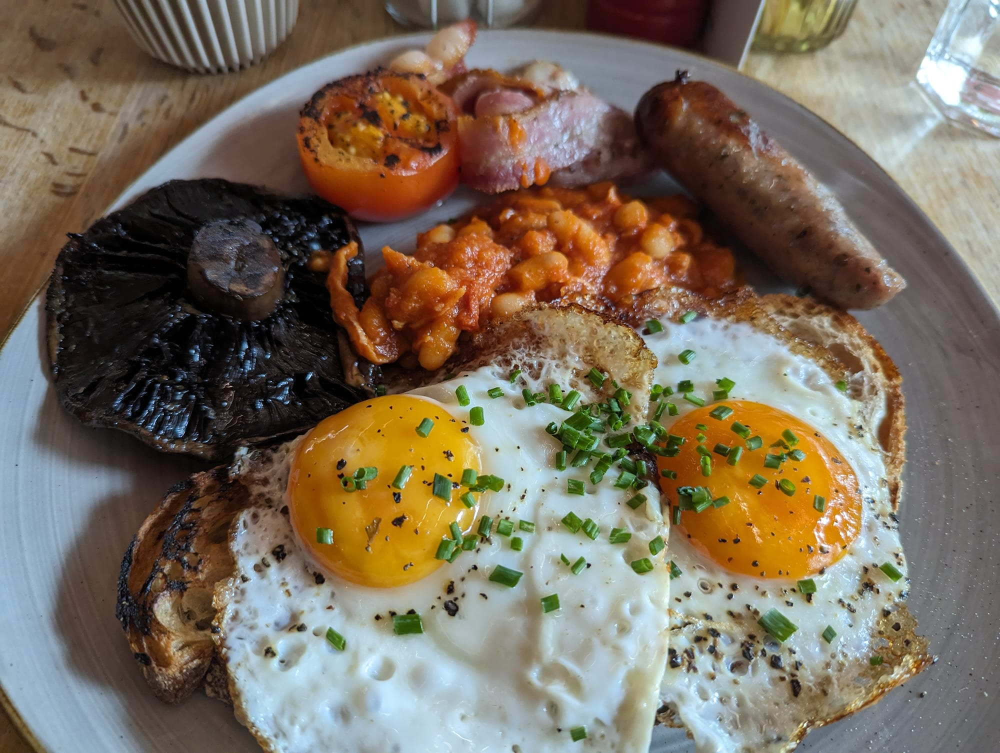

### Hawksmoor, several sites

*£££ · a separate breakfast menu · 7 London sites*

The steakhouse group does a full English built out of its own butchery, and it is a genuinely different proposition from a café fry-up at roughly a café-fry-up-plus price.

**Breakfast for two is £36** and arrives as a shared spread: a **smoked bacon chop**, sausages, black pudding, **short-rib bubble and squeak**, **grilled bone marrow**, trotter baked beans, fried eggs, grilled mushrooms, roast tomatoes, **HP gravy** and unlimited toast. The bone marrow on the same plate as the eggs is the part people remember.

> ⚠️ **Breakfast is not served at every branch, or every day.** Guildhall has run it on weekdays and Air Street on Saturdays, but the schedule moves. Check the specific site before travelling for it.

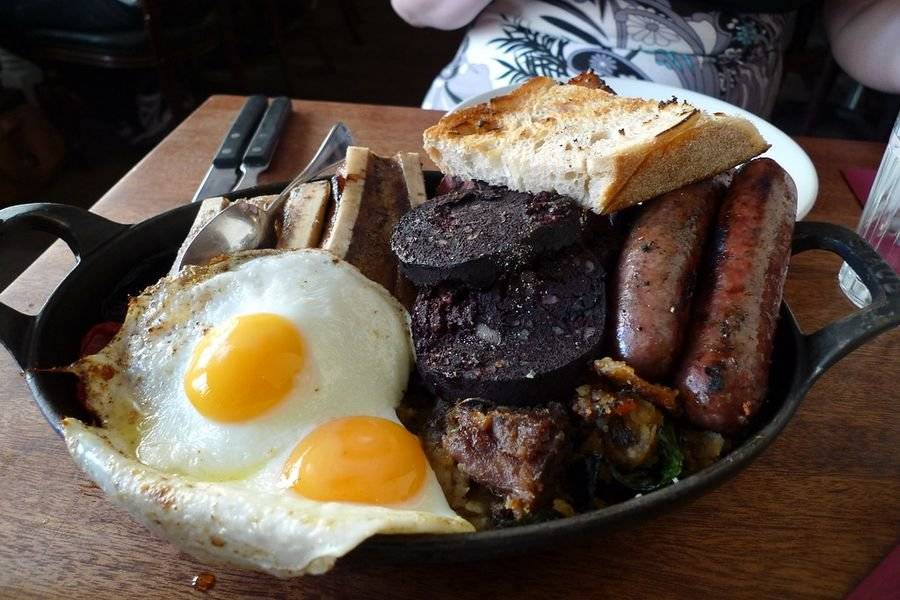
*Bone marrow and a short rib on the same plate as the eggs. Photo: [Ewan-M](https://www.flickr.com/photos/55935853@N00/5652623969), [CC BY-SA 2.0](https://creativecommons.org/licenses/by-sa/2.0/).*

---

## Coffee-first

Places where the coffee is the reason and the food is very good anyway.

### Kaffeine, Fitzrovia

*£ · 6 min from Oxford Circus · 2 sites*

Australian and New Zealand owned, opened on **Great Titchfield Street in 2009**, and one of the handful of shops that brought antipodean coffee culture to London before anyone here used the phrase. A second site followed on **Eastcastle Street in 2015** — both Fitzrovia, five minutes apart.

Coffee is **Square Mile**, with the guest espresso and filter rotated regularly, so there is usually something on the brew bar worth asking about.

**The menu changes weekly**, which is unusual for a coffee shop and the reason the counter is better than it needs to be. Expect **espresso-drizzled pancakes with mascarpone and berries**, **smashed avocado on sourdough**, and sandwiches made on site — smoked salmon with chive cream cheese, breaded brie with roasted aubergine — alongside a pastry case that sells out by early afternoon.

**Mon–Fri 7.30am–5.30pm, Saturday 9am–4pm, closed Sundays.** It fills with people from the surrounding offices and media buildings, so it is calmest before 9am and after 3pm. Counter service, and not somewhere to settle in for hours.

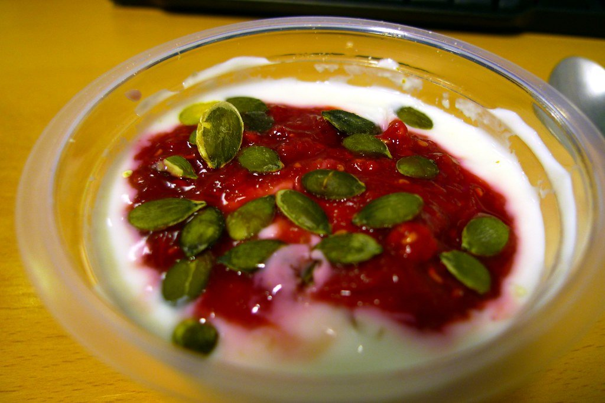
*An Australian-run café on Great Titchfield Street that set the template a lot of London coffee shops followed. Photo: [Ewan-M](https://www.flickr.com/photos/55935853@N00/3859693639), [CC BY-SA 2.0](https://creativecommons.org/licenses/by-sa/2.0/).*

### Prufrock, Clerkenwell

*£ · Leather Lane*

**23–25 Leather Lane**, and the shop that trained a generation of London baristas — it has a coffee training school attached, and a good proportion of the people making your flat white elsewhere in the city passed through it. Spacious, bright and functional rather than styled.

The coffee is the point and the food is better than it needs to be: **veggie eggs benedict with soft poached eggs and bitter greens**, and a dense coconut and almond cake among the counter bakes.

Weekday mornings it fills with people working; it is one of the few serious coffee shops in central London with both room and power sockets. Leather Lane's street market runs outside at lunchtime.

### WatchHouse, Bermondsey

*£ · a watchman's hut*

The original site is a **watch house built between 1810 and 1812** to guard the graves in St Mary Magdalen churchyard next door from body snatchers. It **seats ten** — the whole building is smaller than most café front rooms — and serves several hundred people a day through the door.

Coffee is roasted in-house, and the counter runs to **pastries, fresh bakes and very good sandwiches** rather than a full kitchen. The group splits its sites into Espresso Houses, which do bakes and sandwiches like this one, and larger Brunch Houses that serve **oat and rye porridge, breakfast classics and seasonal plates** until 11am — so check which kind you are walking into.

From this one room the group has grown across the City, out to Bath and into New York, which makes it the most successful London coffee export of the last decade. The other sites are comfortable; this one is the story.

### Ginger & White, Hampstead

*£ · Perrins Court*

Tucked into **Perrins Court**, a narrow pedestrian alley off Hampstead High Street, and the default Hampstead morning — a small British café that does the coffee-shop thing without the coffee-shop affect. Indoor and outdoor tables, and no reservations.

**Dippy eggs** with soldiers, toasties, shakshuka, borekas, granola, cinnamon buns and a banana chocolate chip cake, with **homemade peanut butter** and turkey bacon among the fillings. Coffee is **Square Mile**, which is as good a roaster as London has.

**Mon–Fri 7.30am–5.30pm, Saturday from 7.30am to 6pm, Sunday 8am–6pm.** Ten minutes from the Heath, which is what it is for.

---

## Weekend-only, and worth planning around

The thing that catches people out. Several of London's best brunches run **on Saturday and Sunday only** — turn up on a Wednesday and the kitchen is doing something else entirely.

### Akub, Notting Hill

*Weekend only · Sat 11am–3pm, Sun 11am–4pm* · Cited by 2 sources

Chef **Fadi Kattan's** Palestinian dining room on Uxbridge Street, and the only place in this guide where brunch is an argument about a cuisine as much as a meal — Kattan cooks the food of Bethlehem, where he grew up, and the restaurant exists partly to insist that Palestinian cooking is its own tradition rather than a regional footnote.

The brunch is built around a **holy trinity of Arabic coffee, French toast and zahra fritters**. Order the **qalayet bandora** — eggs cooked into a slow, rich tomato sauce — with labaneh under za'atar, the nutty cauliflower fritters with coriander tahini, and the **aubergine fatteh** under garlic yoghurt. The French toast is made with Arabic coffee and finished with cocoa and pistachio.

**Weekends only for brunch, and it books up** — a small room in a residential street rather than a restaurant that can absorb walk-ins. In the MICHELIN Guide.

### Bistrotheque, Bethnal Green

*Weekend only · live piano 12–3pm* · Cited by 2 sources

Up an unmarked side street in Bethnal Green, in the remains of an old clothing **sweatshop** — a vast, bright, white-walled warehouse room with no signage outside, which has been the point since it opened in 2004. You have to know it is there.

Weekend brunch pulls dishes from the main bistro carte alongside the breakfast ones: a **full English**, eggs Benedict, **scrambled eggs with chorizo**, next to moules marinière, steak tartare, and asparagus with a poached egg and hollandaise. A **live pianist plays pop covers** through the service, which sounds unbearable and is in fact the reason people love it.

**Saturday and Sunday, and reservations are essential** — this is not a room you chance on a weekend. The cocktail list is built for the morning after.

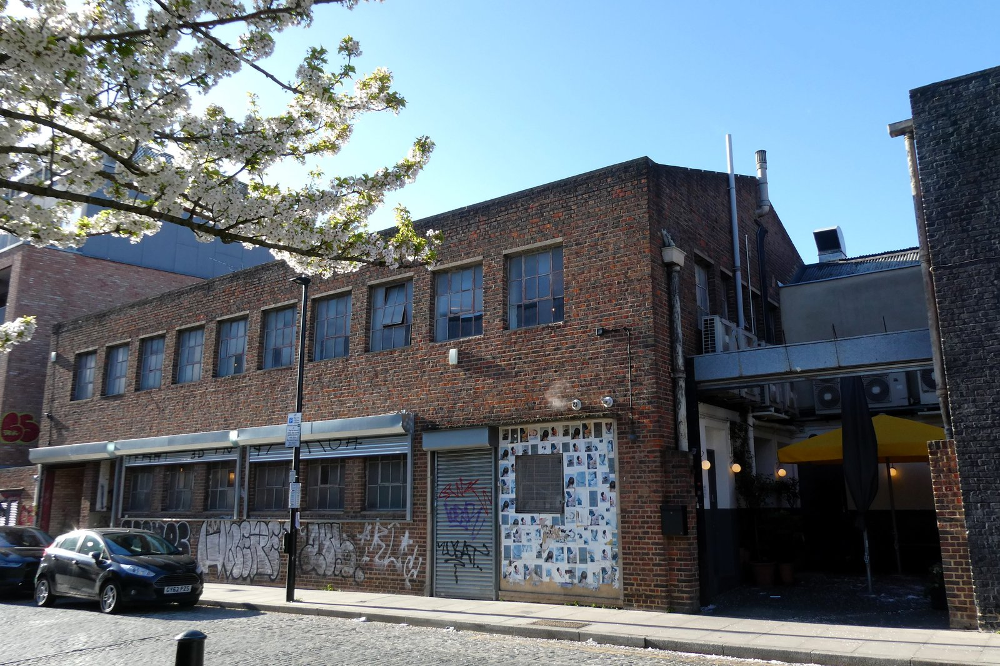
*There is no sign. You find the door, go up the stairs, and the room opens out white and full of light. Photo: [Ewan-M](https://commons.wikimedia.org/w/index.php?curid=187564628), [CC BY-SA 4.0](https://creativecommons.org/licenses/by-sa/4.0/).*

### Carmel, Queen's Park

*Weekend only · Sat and Sun 10am–3.30pm* · Cited by 2 sources

The Queen's Park sibling of Berenjak and Palomar, cooking across the **Eastern Mediterranean** rather than committing to one country, in a relaxed all-day room that reads as a neighbourhood restaurant rather than a destination.

The centrepiece is the **tabun oven**, and the flatbreads that come out of it with a changing set of seasonal toppings are what to order. Around them, morning mezze, pastries baked in-house, and a short list of plates that shifts constantly.

**Brunch runs Saturday and Sunday, 10am to 3.30pm** — a long window by London standards, which makes it one of the easier weekend tables to get if you can eat at the edges. Book for the middle of the day.

### Mr Bao, Peckham

*Weekend only · bottomless £24 an hour* · Cited by 2 sources

A pocket-sized Peckham room doing **Taiwanese steamed bao** and small plates, and the brunch is the most genuinely different thing on this page — nobody else in London is serving a fry-up inside a bao bun.

The **hash brown bao** is the one to order: crispy rösti, shiitake mushrooms, cheese and chilli bean sauce inside a steamed bun. Beside it a **bacon bao** with a smoked ham hock fritter and plum sauce, **The Drunken Prawn** with pickled mooli and spiced spring onions, a beef brisket bao, and a salmon and onsen egg bao. Order smacked cucumber, sticky edamame and the flaky jiang bing crepe to share, and the **smoked salmon chawanmushi** with ginger and crispy potato if it is on.

**Brunch is weekends only, 11am to 4.30pm.** The room is tiny — book, or go early.

### Christopher's, Covent Garden

*Weekend only · Sat 11am–3pm, Sun 11am–3.30pm* · Cited by 3 sources

On the same Covent Garden corner **since 1991**, in a building that opened in 1870 as **London's first licensed casino** and later spent years as a papier-mâché factory. Two storeys: a martini bar on the ground floor and a sweeping staircase up to the first-floor dining room, which is where brunch happens.

American in the grand sense rather than the diner sense. The **chocolate brioche French toast** is the house speciality, buttermilk pancakes are the weekend order, and there is a **whole grilled lobster with garlic butter** for anyone treating brunch as lunch.

**Brunch runs until 3.30pm on Sundays.** Reopened in late 2025 after a full refurbishment, so photographs older than that show a different room.

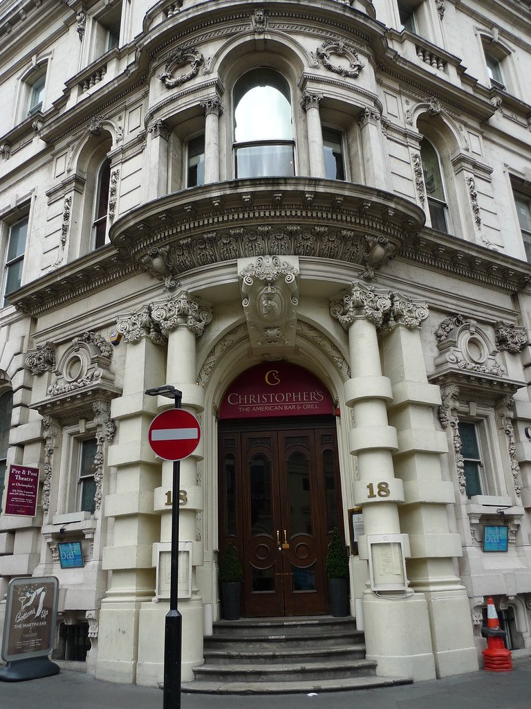
*The American brunch in a grand Covent Garden townhouse, up a spiral staircase. Photo: [Ewan-M](https://www.flickr.com/photos/55935853@N00/3588167076), [CC BY-SA 2.0](https://creativecommons.org/licenses/by-sa/2.0/).*

### Esters, Stoke Newington

*Saturday only · no bookings, card only* · Cited by 2 sources

A small corner café on Stoke Newington Church Street run by **Nia and Jack**, who make as much as they possibly can in-house — the jams, the yoghurts, the pickles, the cakes. That is the whole proposition, and it is why the same people come every week.

The menu changes with the season and keeps three fixtures: **Bircher muesli with a seasonal compote**, a **French toast** that gets rebuilt constantly (whipped ricotta, kumquat and cranberries in winter), and an egg dish, fried or poached, with whatever is good that month.

**Small, and no bookings** — this is a walk-in with a queue on Saturday and almost none on a weekday morning. Coffee is taken as seriously as the food.

---

## Every day of the week

### Sunday in Brooklyn, Notting Hill

*Daily · also Marylebone* · Cited by 2 sources

The Williamsburg original's first site outside New York, and the **hazelnut and brown butter pancakes** are the reason to come.

Prices are published, which is rarer than it should be: avocado toast **£12.80**, cheddar scramble **£17.50**, shakshuka **£15.50**, an egg sandwich **£13.80**, and chia pudding at **£8** if you want the cheap way in.

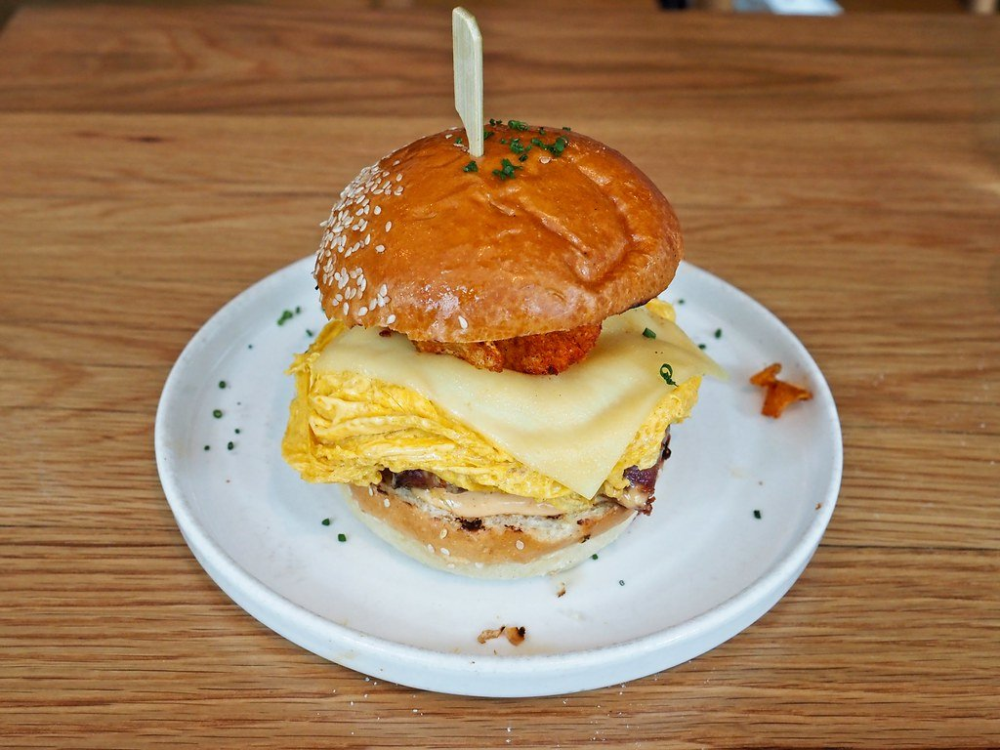

*A New York import in Shoreditch. The pancakes with hazelnut praline are what it is known for. Photo: [Bex.Walton](https://www.flickr.com/photos/7831824@N04/51995111426), [CC BY 2.0](https://creativecommons.org/licenses/by/2.0/).*

### TAB x TAB, Westbourne Grove

*Daily · last food orders 3pm* · Cited by 2 sources

A contemporary independent at **14–16 Westbourne Grove** with a deliberately small menu and a singular focus on doing it well — specialty coffee and tea, a short brunch list, baked goods and cocktails, and not much else.

The **oat flat white made with Ozone coffee** is what it is known for, alongside good matcha and **single-origin filter from a guest roaster that changes monthly**, so the brew list is different every few weeks. On the food side: **avocado toast, vegan pancakes, creamy mushrooms and scrambled eggs on toast, eggs Benedict and Royale**, and two dishes people come back for — a **halal chicken katsu sando** and **berry French toast**.

Small, busy, and geared to people who care which roaster is on. Counter service; it fills mid-morning at weekends and is calm on a weekday.

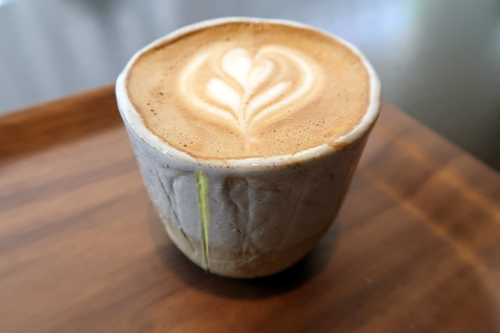
*A Bayswater café that roasts its own and does the food properly rather than as an afterthought. Photo: [Bex.Walton](https://www.flickr.com/photos/7831824@N04/36652781816), [CC BY 2.0](https://creativecommons.org/licenses/by/2.0/).*

### The Laundry, Brixton

*Daily · a former laundry* · Cited by 2 sources

An all-day bistro a minute from Brixton station, in a converted laundry — plants, tiles, and a room that manages to be busy without being a scrum, which is rarer in Brixton on a Saturday than it should be.

The **toasted banana bread with honeycomb butter** is the thing regulars order, and the **courgette and cheddar cornbread** with black bean and tomato salsa under a green goddess dressing is the dish that shows what the kitchen can actually do. A full menu of eggs and bigger plates behind both.

**Brunch runs 10am to 3pm on Saturdays**, and the kitchen is open all day the rest of the week. Book at weekends.

### Inis, Fish Island

*Wed–Sun · mornings end at 11.30am* · Cited by 2 sources

**British and Irish cooking** in Fish Island Village, on the canal behind the Olympic Park — a bright, plain room that is one of very few reasons to eat in this part of east London on a weekend morning, and much calmer than anywhere in Hackney proper.

The **Full Irish** is the headline, but the interesting things are around it: **roast potato farls with eggs**, porridge with poached quince, blackberries and a brown butter crumble, **brûléed French toast with caramelised baked apples**, a fine herb omelette with butterhead salad, and house-made Irish brown or tin loaf toast with their own jam.

Open for breakfast, brunch, lunch and a **Sunday lunch**. Worth booking at weekends; on a weekday it is close to empty, which is part of the appeal.

### Burnt Arches, Bethnal Green

*Tue–Sun · a railway arch · Cited by 2 sources*

The Burnt group started as a neighbourhood room on Askew Road in Shepherd's Bush and this is its most complete site: **café, restaurant and a working bakery under one railway arch** on Poyser Street. Bare brick, high curved ceiling, and the bakery visible from the tables.

The brunch menu is genuinely inventive rather than decorated — a **crab and 'nduja herby omelette** with brown crab aioli and fried bread, and **aloo gobi fried eggs** under a coriander salsa. The bakery counter changes daily and runs to things like a **Welsh rarebit custard danish** and kimchi loaves. Coffee is **Climpson & Sons**, roasted a mile away in Hackney.

**278 Poyser Street, E2. Closed Mondays**, open for coffee and brunch daily otherwise, with dinner four nights a week. Two other Burnt sites exist — Shepherd's Bush and a café inside RADA — so check which one a listing means.

---

## Chains and mini-chains worth the visit

London brunch is unusual in that **several of its best rooms are chains**, because the format arrived as a business rather than as a one-off. A chain here is not the compromise it would be at dinner.

Three of them are covered in full above, because they belong in their sections as much as in this one: **[Granger & Co](#granger--co-notting-hill)** (four London sites, and the joint most-cited room in this guide), **[Dishoom](#dishoom-covent-garden)** (seven London sites, with Borough opening) and **[Caravan](#caravan-clerkenwell)** (seven). The rest are below.

### The Breakfast Club, several sites

*££ · since 2005* · Cited by 3 sources

Started as one café in Soho in 2005 and became the most recognisable independent breakfast brand in the city — American-diner in spirit, with the queues to match. Named by three independent sources despite being the most obviously commercial room here.

**Pancakes are the order**: with bacon or berries and maple syrup, the all-American pancake breakfast, salted caramel and banoffee, and a vegan blueberry version. Full breakfasts, huevos rancheros and a long list of egg dishes alongside.

Covent Garden, Hackney Wick, London Bridge and Croydon among others. **The queues are real at weekends** and most sites do not take bookings — go on a weekday or go early.

### Megan's, many sites

*££ · the flower-covered ones* · Cited by 2 sources

Instantly recognisable from the flower-covered frontages, and a bottomless brunch operation as much as a breakfast one — Mediterranean all-day food in rooms built to be photographed.

The format is **mezze you assemble yourself**: dips, flatbreads, small plates and little grills, meant for grazing across the table. The house things are the **posh kebabs**, the espresso martini and the **half-baked cookie dough**, and the brunch menu runs the usual eggs alongside bowls and grills.

**Twenty-two sites, ten of them in London** — Parsons Green, Battersea, Clapham Old Town, Balham, Wandsworth, Wimbledon, Dulwich, Chiswick, Kensington and Islington — with the rest strung along the Thames and out through Surrey and the home counties. Almost entirely a south and west London operation.

**Book for weekends**, particularly the bottomless sittings, which run to a time limit and fill first. Weekday mornings are walk-in and calm.

### Ottolenghi, five sites

*£££ · the counter* · Cited by 2 sources

Not a breakfast business exactly — these are deli counters piled with salads and cakes, where you eat at a shared table — but the morning trade is real and the Good Food Guide singles it out. Islington, Notting Hill, Spitalfields, Chelsea and Marylebone.

The **Middle Eastern breakfast (£12.90)** is the one to have: feta, a fried egg, chopped salad and pita. A bread board of croissant or pain au chocolat runs **£7.90**, and granola with yoghurt and fruit salad **£12.60**.

Counter service and communal seating, so it works for one person with a book and less well for four people wanting a conversation. Best before 10am, when the salad counter is still being built.

> ⚠️ **Caravan is a chain too**, with sites in King's Cross, Clerkenwell, Bankside and Fitzrovia — but only one source names it for breakfast, so it sits at one citation despite its influence on the format.

---

## Cheap, and open early

**The honest finding: a cheap fry-up still exists, but not where the guides look.** Across the twenty-five caffs one specialist has priced, the spread runs from **£6.50 to about £17** — and the cheap end is entirely outside zone 1. Central London caffs cluster around £11–£13; the ones under £10 are in Newham, Leytonstone, Pimlico and Hammersmith. The modern brunch rooms start around £13 for a plate of eggs.

#### Under £10, and all of them a train ride out

* **Cosy Café**, Newham — **£6.50**, the cheapest full English anyone here has priced. *Cited by 1 source*
* **Astral Café**, Pimlico — **£8.70**, and the only sub-£9 fry-up this side of the river. *Cited by 1 source*
* **George's Café**, Leytonstone — **£8.80**. *Cited by 1 source*
* **The Ritz Café**, Hammersmith — **£8.90**, British-Turkish, open from 6.30am and every breakfast comes with tea. *Cited by 2 sources*
* **Riccardo's Café**, Liverpool Street — **£9**, which is remarkable for the postcode. *Cited by 1 source*
* **Half Moon Café**, Hammersmith — **£9.20**. *Cited by 1 source*

#### The caffs

* **Regency Café**, Westminster — a **set breakfast at £9.99**, which is close to the floor for a sit-down cooked breakfast in central London. Open since 1946, black-tiled, order shouted across the room. Monday to Saturday, 7am to 3.30pm, closed Sundays. *Cited by 3 sources*
* **Terry's Café**, Southwark — the Standard is **£15.50** and the Works **£18.50** with Cumberland sausage, bubble and squeak and black pudding. Daily 7.30am–3pm. Not cheap any more, but home-cured bacon and a family running it since 1982. *Cited by 4 sources*
* **E Pellicci**, Bethnal Green — Grade II listed, family-run since 1900, and one of the last genuinely unchanged rooms in the East End. Cash-friendly, closed Sundays. *Cited by 3 sources*
* **The Electric Café**, West Norwood — named by three sources and almost never by a national guide. *Cited by 3 sources*
* **The River Café**, Putney Bridge — **£11.60**. The caff, not the Michelin-starred Italian in Hammersmith; two sources name this one and mean the fry-up. *Cited by 2 sources*
* **Andrew's Café**, Holborn — **£11.80**, running since the 1970s. *Cited by 2 sources*
* **Billingsgate Café**, Poplar — **£13**, and it opens for the fish market rather than for you. *Cited by 2 sources*

#### Pubs and odd hours

* **Wetherspoons** — the cheapest cooked breakfast in central London by a distance, served from 8am. **There are around 37 branches in central London alone**, and roughly 800 across the UK, so there is almost certainly one near you — Westminster has eight, Camden seven, Southwark six, the City four. The four worth going out of your way for are in extraordinary buildings: **The Crosse Keys** (a 1913 banking hall), **Hamilton Hall** (the Great Eastern Hotel's former ballroom), **The Ledger Building** (an 1802 West India Dock office) and **The Montagu Pyke** (a former cinema). The breakfast is identical in all of them.
* **Polo Bar**, Liverpool Street — a fry-up at any hour, run by the Inzani family since 1953 and open every minute of every day. **It has no front door**, because it has never needed to shut one; on Christmas Day, the only day it closes, they nail a sheet of plywood over the entrance.
* **The Attendant**, Fitzrovia — brunch inside a Victorian public lavatory, with the urinals as the counter.

#### Markets and bakeries

* **Borough Market** opens early and the bakery counters are the cheapest good breakfast in the area — coffee and a pastry for a few pounds while the traders are still setting up.
* **Maltby Street Market**, weekends — **St John Bakery Room** does the Old Spot bacon sandwich that people cross London for.
* **Old Spitalfields** and **Seven Dials Market** both have breakfast counters open before the shops around them.

Powered by <a target="_blank" rel="sponsored" href="https://www.getyourguide.com/london-l57/">GetYourGuide</a>

---

## What to know

* **Weekend brunch books out.** Granger & Co, Caravan and The Wolseley all want a reservation Saturday and Sunday.
* **Dishoom before 6pm takes any party size**, which makes breakfast the easiest time to get in.
* **Hotel breakfasts are often open to non-residents** and are usually quieter than the brunch rooms.
* **A flat white in London runs £3.50–£4.50.** Anything under £3 is unusual; anything over £5 is a hotel.
* **Duck & Waffle at sunrise** needs booking like any other dinner — the view is the same but the room is calmer.

---

## Continue planning your London trip

- ☕ **[The Best Coffee in London](/articles/best-coffee-london/)**
- 💷 **[Cheap Eats in London](/articles/cheap-eats-london/)**
- 🫖 **[The Best Afternoon Tea in London](/articles/best-afternoon-tea-london/)**
- 🍽️ **[Eat in London: Restaurants, Food Markets & Quick Food Hub](/articles/eat-in-london-guide/)**
- 🎭 **[Covent Garden Area Guide](/articles/covent-garden-area-guide/)**
- 🏙️ **[City of London Area Guide](/articles/city-of-london-area-guide/)**
