**London's bubble tea scene changes faster than the lists that cover it.** Four of Time Out's top ten, ranked in March 2026, aren't serving today. The Alley, named by more sources than any shop except Xing Fu Tang, no longer has a UK store. This guide includes only places we've confirmed are open.

This page isn't our opinion. Every shop here is ranked by how many independent lists, blogs and video reviews name it.

> 🧋 **The short version.**
> **[Xing Fu Tang](#xing-fu-tang)** in Soho for brown sugar pearls, and it's named by more sources than anywhere else. **[Kissaten](#kissaten)** for honey pearls and Japanese teas. **[T4](#t4)** for a classic milk tea, from four London branches. For choice, go to **Newport Court in Chinatown**, where [Cuppacha](#cuppacha), [Happy Lemon](#happy-lemon), [Min Tea](#min-tea) and [Lucky Tea](#lucky-tea) are a few doors apart and open late.

> 📊 **The evidence behind this guide.**
> Nothing here rests on one visit. This pass reads **25 sources carrying 145 citations** across **39 named venues**: the editorial mastheads (Time Out, The Infatuation, the Evening Standard, The Handbook), independent London blogs (Wrap Your Lips Around This, Squeeze London, London x London, Hues of Delahaye, King's College's Strand Magazine, Secret London) and 15 London creators on YouTube and TikTok, not counting posts that disclosed a free or paid visit. **25 venues are named by two or more independent sources.** Every shop with an entry was checked as trading on 14 September 2026.
> *Evidence rebuilt 14 September 2026 · [How we rank →](/how-we-rank/)*

---

## The winners

### Xing Fu Tang

*£ · Soho · 4 min from Tottenham Court Road · Cited by 14 sources · #1 of 10, Time Out · [xingfutang.co.uk](https://xingfutang.co.uk/)*

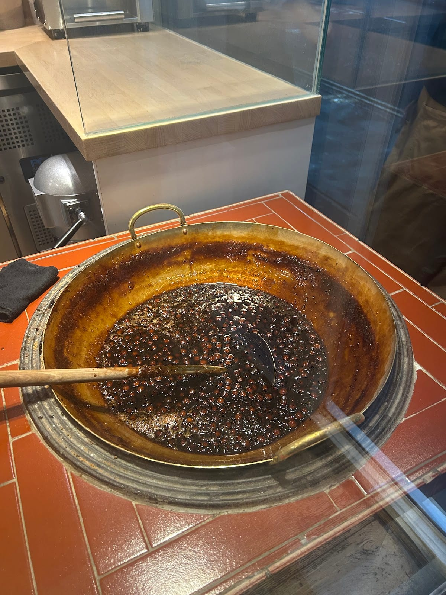

*The pearls are cooked in this wok, in plain view behind the counter. It's Time Out's "huge cauldron".*

**29 Frith Street, W1D 5LG.** The Taiwanese chain every list agrees on. Its speciality is **brown sugar pearls**, which Time Out says are made in hourly batches. The house drink is fresh milk with brown sugar syrup, topped with sugar blowtorched to a crème brûlée crust. Wrap Your Lips Around This calls it the writer's overall favourite for its "soft sweetness and toasted toffee flavour." Four London TikTok creators name it too, one in a video with close to 300,000 views. One paid **£5.95 for a large brown sugar milk tea** in June 2026 and gave it 10/10 for "super soft and chewy" tapioca.

It's a small white shop for takeaway, and **the queue forms at opening time**. If you want something to photograph, there's a gold-leaf version of the brown sugar milk tea and a mango smoothie topped with a panna cotta rabbit. There's a second branch, **XFT City**, at 122 Middlesex Street near Liverpool Street.

### The Whale Tea

*£ · Bayswater · 2 min from Bayswater · Cited by 2 sources · #1 of 10, The Strand · [thewhaletea.co.uk](https://thewhaletea.co.uk/)*

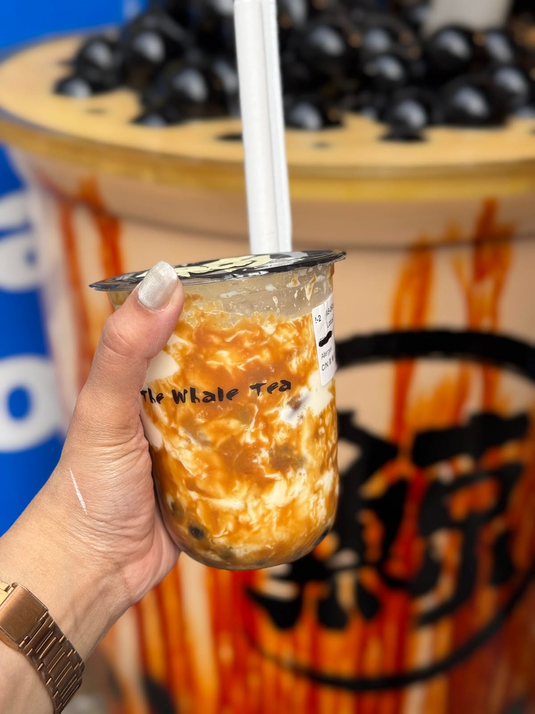

*Brown sugar boba, the drink The Strand calls the best in London.*

**18 Queensway, W2 3RX**, and **45 Wardour Street, W1D 6PZ** in Chinatown. This is the King's College student magazine's number one: "the store's brown sugar boba is the best in London." Its signature is the Flaming Whale, classic brown sugar boba under fresh cheese cream. The Infatuation likes the plain milk tea boba, which "tastes a little like cereal milk in the best way possible."

The Queensway shop has a couple of tables, and it's open until about 10pm. Hyde Park is at the end of the road, so take the cup to the park.

> 💡 **Two lists, two winners.** Time Out puts Xing Fu Tang first and doesn't mention The Whale Tea. The Strand puts The Whale Tea first and Xing Fu Tang seventh. Both are praising brown sugar boba, so the disagreement is really about which shop does it better.

---

## Also strongly backed

### Kissaten

*£ · Soho · 4 min from Leicester Square · Cited by 8 sources · #3 of 10, Time Out · [kissaten.co.uk](https://kissaten.co.uk/)*

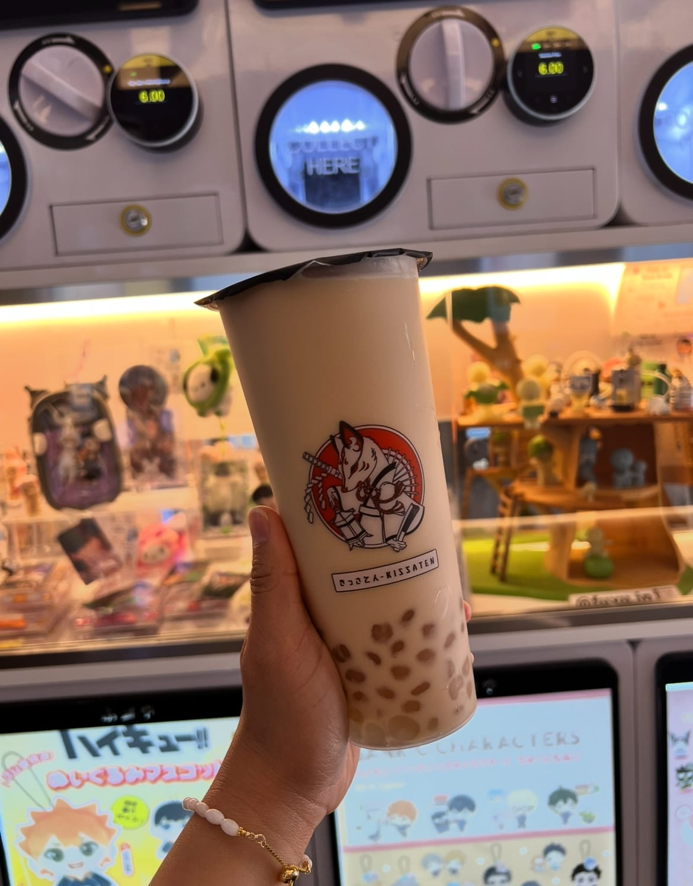

*Order on the screen, then wait by the gachapon machines. Half the shop is capsule toys.*

**72 Old Compton Street, W1D 4UN.** A Japanese-style tea house, pricier than most, and Time Out says it's worth paying extra for. It makes its own **honey tapioca pearls**. There are also yoghurt popping pearls, a matcha range and hojicha with salted cheese. The Infatuation orders the Earl Grey milk tea for "a nice floral twist."

You order on a screen, and there are **long queues at busy times**. Older guides give 30 Brewer Street, but it's now on Old Compton Street.

### Cuppacha

*£ · Chinatown · 2 min from Leicester Square · Cited by 8 sources · #9 of 10, Time Out · [cuppacha.com](https://cuppacha.com/)*

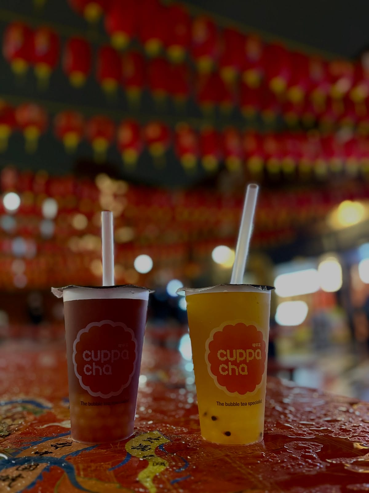

*Under the lanterns. With no seats inside, most cups end up somewhere like this.*

**23 Newport Court, WC2H 7JS.** The bright pink shop on Newport Court has been making bubble tea for about a decade. There's a **queue most days**. The Infatuation orders the mango fruit tea with popping boba, where "the sweetness isn't overpowering." Time Out picks the butterfly pea ombré drinks, which fade from blue to pink in the cup.

It's a takeaway counter, not somewhere to sit, and it's open until about 10:30pm. There's a second branch at 395 Edgware Road in Cricklewood.

### T4

*£ · Paddington · 2 min from Paddington · Cited by 8 sources · [t4.co.uk](https://t4.co.uk/)*

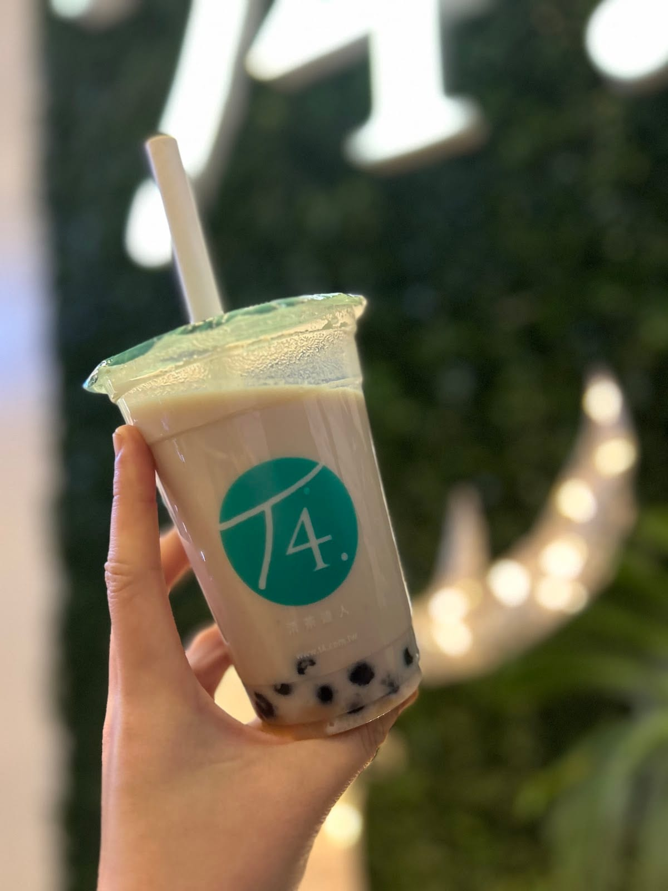

*The classic milk tea is what T4 does best, and every source that names it orders one.*

**4B Praed Street, W2 1JX**, plus **137 Strand**, **Westfield Stratford City** and **Westfield London** in Shepherd's Bush. T4 uses whole tea leaves, never tea bags or powder, and sticks to milk teas rather than fruit. The Infatuation says "no matter which branch you're at, you'll get a great bubble tea," and likes the Oreo potted milk tea best. The Strand orders Earl Grey milk tea with French pudding.

This is the pick if you want a reliable milk tea near where you already are. The Paddington branch is open until about 8pm.

### Happy Lemon

*£ · Chinatown · 2 min from Leicester Square · Cited by 7 sources · [happy-lemon.co.uk](https://happy-lemon.co.uk/)*

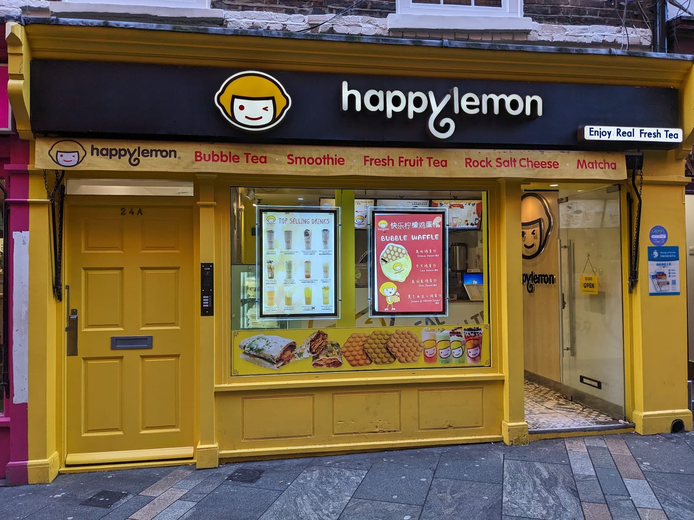

*You can't miss it on Newport Court. Rock salt cheese, the signature, is painted along the front.*

**24A Newport Court, WC2H 7JS.** A global chain that opened its first European shop here. Despite the name, The Infatuation prefers the milk teas, especially the Oreo cookies and cream. The **rock salt cheese** topping is the signature, a salty cream cap that the Standard says "sounds odd" but works.

Open until about 10:30pm. The Standard says it's "usually packed" and worth pushing through the crowd for.

### HEYTEA

*£ · Soho · 3 min from Leicester Square · Cited by 7 sources · #3 of 10, The Strand*

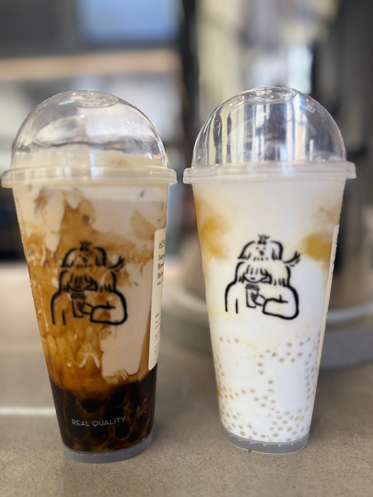

*Brown sugar pearls under milk (left) and a sago drink (right), the two styles the reviews keep ordering.*

**Unit 2, Wingate House, 93–107 Shaftesbury Avenue, W1D 5DA.** When it opened, this was the Chinese chain's first shop outside Asia, and it drew huge queues. Five London video creators name it, more than any shop except Xing Fu Tang. HEYTEA is known for **cheese foam**, a salted cream-cheese layer on cold tea that The Strand compares to cheesecake. The Infatuation's pick is the supreme brown sugar milk tea with a thick cheese foam top.

**It's one of the dearer cups here.** One creator waited 23 minutes and paid £6.80 for a Coconut Mango Bloom (in 2025), and still gave it 8.5 out of 10. Open until about 10pm.

### Yi Fang Fruit Tea

*£ · King's Cross · 8 min from King's Cross St Pancras · Cited by 6 sources*

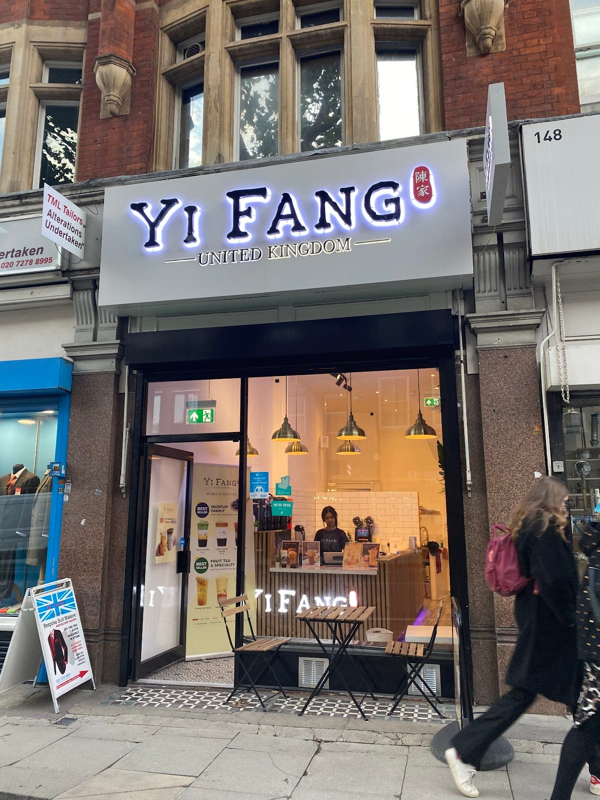

*The Gray's Inn Road branch, open while the Chinatown shop the lists name has closed.*

**150 Gray's Inn Road, WC1X 8AX.** The **fruit tea** specialist. The recipe comes from the founder's grandmother, who made jam from pineapples. The Strand says it "dominates the fruit tea scene," and Wrap Your Lips Around This calls it the best fruity bubble tea in London. It's open until about 10pm and has a few tables.

> ⚠️ **The Chinatown shop has closed.** The lists that give an address point to 104 Shaftesbury Avenue, which has shut. The Gray's Inn Road branch is still open.

### Woo Tea

*£ · Chinatown · 3 min from Leicester Square · Cited by 6 sources*

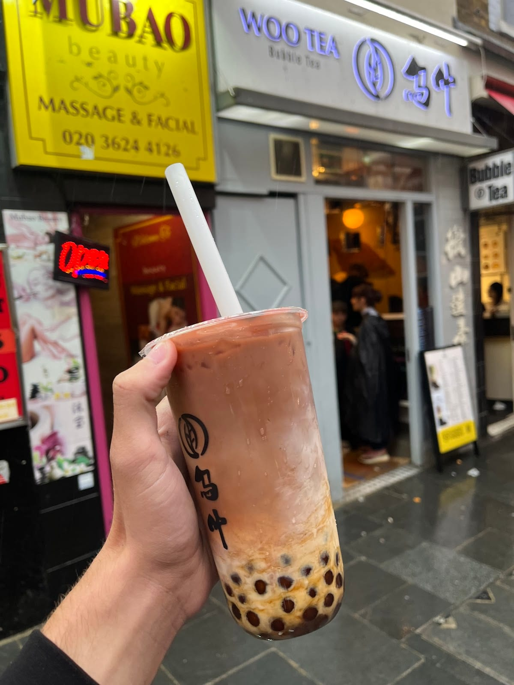

*Takeaway only. The counter is just inside that door.*

**26 Wardour Street, W1D 6QL.** An **oolong** specialist. Wrap Your Lips Around This picks its roasted oolong tea as the best in London: "nutty with a buttery texture, and an almost smoky tone." Squeeze London suggests the purple potato oolong with tapioca. A TikTok reviewer in August 2026 found fresh lychee in her lychee fruit tea but thought **£7.20** was steep. The blogs point to the oolongs instead. It's a small walk-in counter, open until about 10:30pm.

### Bubble Magik

*£ · Ealing · 3 min from Ealing Broadway · Cited by 4 sources · [bubblemagik.com](https://bubblemagik.com/)*

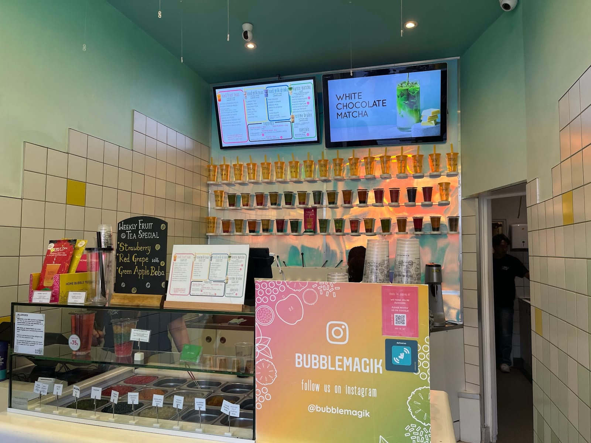

*The toppings sit in a chilled case at the front, and the sealed cups on the back wall show every colour on the menu.*

**Unit 20, Ealing Broadway Shopping Centre, W5 5JY**, plus a counter on **the fourth floor of Selfridges**. The best-backed shop outside zone 1. The Infatuation describes a "cupboard-sized" counter where drinks are sealed and shaken by machine, and orders the mango iced tea with passion fruit boba. Wrap Your Lips Around This goes back for the original Assam milk tea. The Ealing counter keeps shopping-centre hours and is open until about 7:30pm.

### Mooboo

*£ · Camden · 3 min from Camden Town · Cited by 4 sources · [mooboo.co](https://mooboo.co/)*

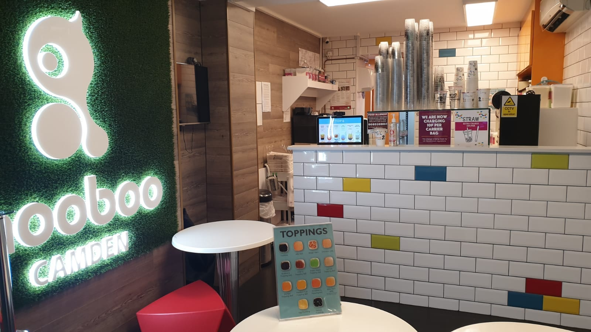

*The Camden shop on Parkway. There are a couple of perches, but it's mostly takeaway.*

**84 Parkway, NW1 7AN** is the central London branch the lists name. Mooboo is Britain's biggest bubble tea chain, with **over 70 UK shops** according to Squeeze London, so there's probably one near you. Order the **taro**, which The Handbook describes as "nutty and sweet" and bright purple. The Camden shop is walk-in and small, and it's open until about 8:30pm.

### Min Tea

*£ · Chinatown · 2 min from Leicester Square · Cited by 4 sources · [mintea.co.uk](https://mintea.co.uk/)*

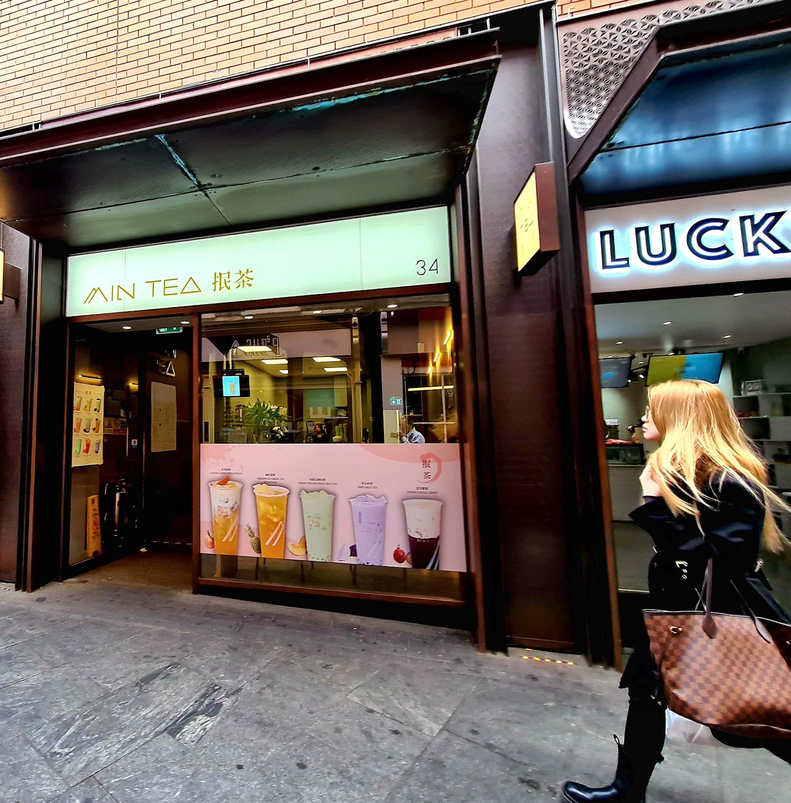

*Min Tea at number 34 and Lucky Tea next door. This is what "a few doors apart" means on Newport Court.*

**34 Newport Court, WC2H 7PQ.** The **cheese foam** specialist on Newport Court, with a whole menu of cheesy milk teas. Wrap Your Lips Around This calls it "the cheesiest bubble tea in London." The Infatuation's pick is the cheesy milk tea with Oreo bits. A guest on a London food podcast rates the fruit teas, made by crushing real fruit rather than using syrup. Of the four Newport Court shops here, it stays open latest, until about 10:45pm.

### Lucky Tea

*£ · Chinatown · 2 min from Leicester Square · Cited by 4 sources · #4 of 10, The Strand*

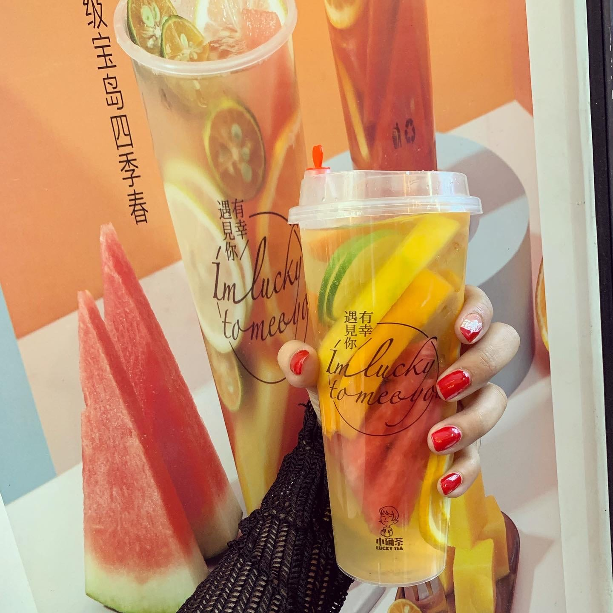

*Fruit teas and slushies with real fruit in the cup, rather than milk teas, are the reason to choose Lucky Tea.*

**35 Newport Court, WC2H 7PQ.** Come here for **slushies and fruit teas** rather than milk tea. The Strand's favourite is the grape slushie, made with real grape pieces and topped with cheese milk foam and crystal boba. A TikTok reviewer touring Chinatown in August 2026 called the golden passion fruit tea (listed at **£6.50**) "the best one we've had". Two London YouTube reviewers include it too. Walk-in only, open until about 10:30pm.

---

Powered by <a target="_blank" rel="sponsored" href="https://www.getyourguide.com/london-l57/">GetYourGuide</a>

## What the widely-shared lists get wrong

The lists that rank highest for this search mostly predate recent closures, and bubble tea shops open and close quickly. This is where the names they recommend stood on 14 September 2026:

| Shop | Recommended by | Status now |
| --- | --- | --- |
| **The Alley** | 11 of 25 sources | Holborn closed. Its UK website says a store is "reopening soon" |
| **Yunique Tea** | 9 | Little Newport Street closed |
| **Biju Bubble Tea Room** | 8, incl. Time Out #5 | Soho, Camden and Southbank Centre closed |
| **Dragon Cat Café** | 7, incl. Time Out #2 | Hammersmith café and Chinatown wheelcake hut both closed |
| **CoCo Fresh Tea & Juice** | 5 | Dean Street closed, and no other London branch |
| **Quaker Street Coffee & Bubble Tea** | 2, incl. Time Out #8 | Closed |
| **Boba Coma**, Leyton | 2, incl. Time Out #7 | Closed |

**Time Out's list was updated six months ago, and four of its top ten aren't serving.** That's no knock on Time Out. Shops close faster than any list can keep up. It does show why checking a list against today's listings matters as much as the list itself.

Three chains are open but not at the address most lists give. **Bubbleology** opened London's first bubble tea shop in 2011. Its Soho bar (the one serving boozy bubble teas) and its Bloomsbury shop have both closed, and its remaining London branch is at **Westfield Stratford City**. Its old Rupert Street site is now [Auntea Jenny](#new-openings). **Yi Fang** moved from Shaftesbury Avenue to [Gray's Inn Road](#yi-fang-fruit-tea). **Ding Tea**'s Angel shop has closed, but its [Hackney branch](#chains-and-their-branches) is open.

---

## By style

**Brown sugar**: [Xing Fu Tang](#xing-fu-tang) for pearls cooked in the wok, [The Whale Tea](#the-whale-tea) for the Strand's "best in London", [HEYTEA](#heytea) with cheese foam on top.

**Classic milk tea**: [T4](#t4) and [Kissaten](#kissaten) for Earl Grey, [Happy Lemon](#happy-lemon) for Oreo, [Woo Tea](#woo-tea) for roasted oolong.

**Fruit tea**: [Yi Fang](#yi-fang-fruit-tea) is the specialist. [Lucky Tea](#lucky-tea) is the pick for fruit piled into the cup, and [Cuppacha](#cuppacha)'s mango with popping boba is close behind.

**Cheese foam**: [Min Tea](#min-tea) for a whole cheesy menu, [HEYTEA](#heytea) for the style's biggest name, [Happy Lemon](#happy-lemon) for rock salt cheese.

---

## Somewhere to sit

Most of the shops above are takeaway counters. These have seats:

- 🪑 **Pürcha**, 7 Kingsway (Holborn) and 82 Charing Cross Road. Tea brewed to order with purified mineral water, "plenty of comfy spots to chill out," and Taiwanese fried chicken. *Cited by 2 sources · #10 of 10, Time Out · [purcha.co.uk](https://purcha.co.uk/)*
- 🪑 **[The Whale Tea](#the-whale-tea)**, Queensway. A couple of tables, with Hyde Park at the end of the road.
- 🪑 **Cuppo Bubbo**, 167 Herne Hill, SE24. Time Out's number four: a café with more seats than most, arranged around a huge money tree plant. It brews tea to order and makes a rose bubble tea with real petals. *Cited by 1 source · #4 of 10, Time Out · [cuppobubbo.co.uk](https://cuppobubbo.co.uk/)*

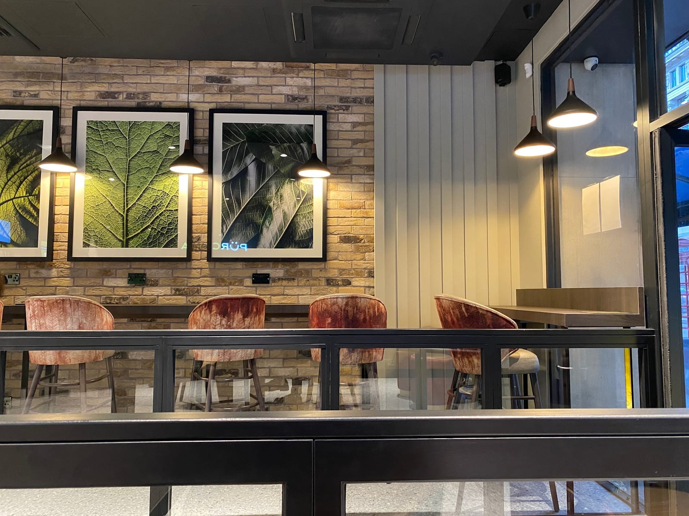

*Pürcha is the rare bubble tea shop built for staying.*

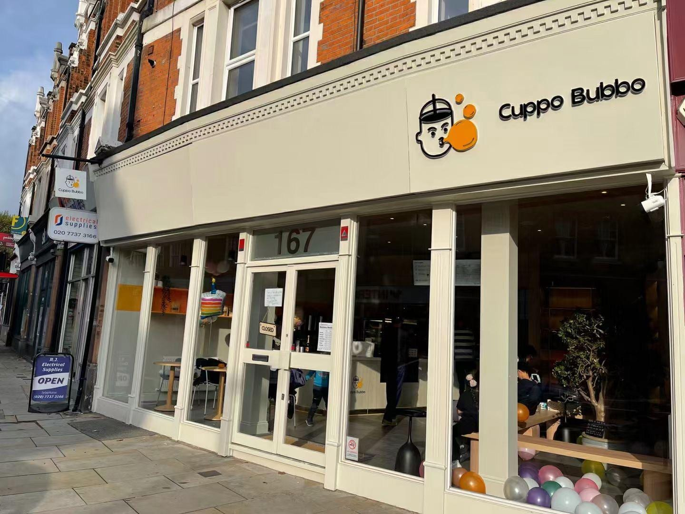

*Cuppo Bubbo in Herne Hill: a whole shopfront of seating, a long way from the Chinatown counters.*

---

Powered by <a target="_blank" rel="sponsored" href="https://www.getyourguide.com/london-l57/">GetYourGuide</a>

## Chains and their branches

Nearly every name here is a chain, and the lists name the brand, not the branch. Here's where to go for each:

- **[Xing Fu Tang](#xing-fu-tang)**: Frith Street is the original. XFT City is at 122 Middlesex Street, near Liverpool Street.
- **[T4](#t4)**: Paddington, Strand, Westfield Stratford City and Westfield London. They're all much the same, so go to whichever is nearest.
- **[The Whale Tea](#the-whale-tea)**: Queensway to sit down, Wardour Street if you're in Chinatown.
- 🏷️ **Gong Cha**: 3 Garrick Street, Covent Garden. The Strand's number two, for milk foam matcha strawberry milk tea. A London food podcast's pick is the QQ passionfruit green tea. The Goodge Street branch in older lists has closed. *Cited by 3 sources · #2 of 10, The Strand*
- 🏷️ **Ding Tea**: the Angel shop older lists name has closed. The **Hackney** branch at 206A Mare Street, E8, is open (closed Tuesdays). Hues of Delahaye's pick is the black sesame milk tea. *Cited by 5 sources*
- 🏷️ **Bobar**: 324C Hackney Road, E2. Named by two London video creators. *Cited by 2 sources · [bobarlondon.com](https://www.bobarlondon.com/)*
- **[Bubble Magik](#bubble-magik)**: Ealing Broadway, or the fourth floor of Selfridges if you're shopping on Oxford Street.
- **[Mooboo](#mooboo)**: Parkway in Camden, and dozens more around the country.

---

## New openings

- 🆕 **Auntea Jenny**, 49 Rupert Street, W1D 7PE. The Chinese chain opened in February 2026 on the site Bubbleology Soho left. A student creator who paid her way through a stamp card says "auntea jenny does it best"; her order is the whipped crème brûlée boba fresh milk tea. *Cited by 1 source*
- 🆕 **Molly Tea**, 21 Lisle Street, WC2H 7BA. A jasmine milk tea specialist one street from Newport Court. One TikTok reviewer queued about 30 minutes in March 2026. She found the jasmine "super floral" but thought £17 for two drinks was steep. *Cited by 1 source*

---

## Quick stops near a station

- 🚉 **King's Cross**: **BAO King's Cross**, 4 Pancras Square. BAO's Taiwanese café sells bubble tea from a takeaway counter. There are just two: a plain oolong and a fresh milk tea. The Standard says it's "perfect for a beginner." *Cited by 2 sources · [baolondon.com](https://baolondon.com/restaurant/bao-kings-cross/)*
- 🚉 **Liverpool Street**: **Jen Tea**, 16 Artillery Passage, E1. A narrow lane five minutes from the station, and a favourite of three London video reviewers. One calls it "very low key and very expensive," and keeps going back. *Cited by 3 sources · [jentea.co.uk](https://jentea.co.uk/)*
- 🌙 **Late in Chinatown**: **Milksha**, 65 Shaftesbury Avenue, W1D 6LH. Open until about 11pm, the latest on this page. The Strand orders strawberry Yakult with honey pearls. *Cited by 2 sources · [milksha.co.uk](https://www.milksha.co.uk/)*

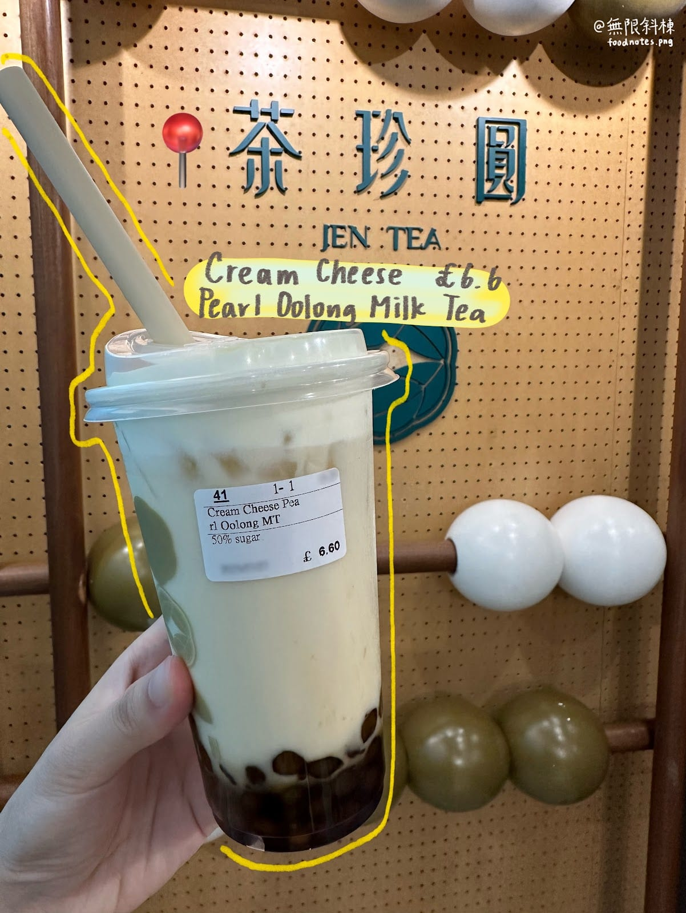

*Jen Tea's cream cheese pearl oolong milk tea, £6.60 on the board.*

---

Powered by <a target="_blank" rel="sponsored" href="https://www.getyourguide.com/london-l57/">GetYourGuide</a>

## Before you go

**No bubble tea shop takes bookings.** You walk in, order at the counter or on a screen, and wait. A few things make the visit easier:

- **Newport Court is the easiest place to start.** Four of the shops above are within a few doors of each other, two minutes from Leicester Square, and open until about 10:30pm. If one has a long queue, try the next.
- **Budget £6 to £7.50 a cup.** Prices reviewers paid or saw on the board in 2026 range from £5.95 at Xing Fu Tang to £7.20 at Woo Tea, and extra toppings cost more.
- **Expect queues** at Xing Fu Tang (from opening time), HEYTEA, Kissaten and Cuppacha. The Infatuation's advice for Cuppacha is to go on a weekday to avoid the weekend queue.
- **Choose your sweetness.** Most shops let you pick the sugar level. If you're new to bubble tea, ask for half sugar, because full sugar is very sweet.
- **Cheese foam isn't meant for a straw.** Drink from the rim so you get foam and tea together, then use the straw for the pearls.

---

## Continue planning your London trip

- ☕ **[Best hot chocolate in London](/articles/best-hot-chocolate-london/)**: another counter drink, with its own closed shops on the most-shared list
- 🍦 **[Best ice cream in London](/articles/best-ice-cream-london/)**: much of it on the same streets
- ☕ **[Best coffee in London](/articles/best-coffee-london/)**: for when you want caffeine without sugar
- 🏮 **[Soho area guide](/articles/soho-area-guide/)**: Chinatown, Frith Street and Old Compton Street in one walk
- 💷 **[Cheap eats in London](/articles/cheap-eats-london/)**: where to eat with the change

*Addresses, branches and trading status checked on 14 September 2026. Source counts are derived from data/consensus/bubble-tea.json, not typed by hand; TikTok posts that disclosed an invite, a gift or a paid promotion are not counted.*
