We priced 46 budget hotels that London's lists and travellers name, each on the same five nights across the year. 22 made this guide: 3 in central London, and 19 further out, near a fast train into town. It covers hotels only, priced on their cheapest double or twin, which at some hotels is a windowless room. [Hostels](/articles/best-hostels-london/), [capsule hotels](/articles/pod-hotels-london/) and [windowless hotels](/articles/windowless-hotel-rooms-london/), where every room has no window, each have their own guide.

This page isn't our opinion. Every hotel here is named by independent lists, blogs and travellers, and was kept only if its typical night came to **£150 or less**.

> 💡 **The Short Version:** Only three central London hotels the lists agree on came in at £150 a night or less: **[The Z Hotel Shoreditch](#the-z-hotel-shoreditch)** (£150 typical), **[hub by Premier Inn London Shoreditch](#hub-by-premier-inn-london-shoreditch)** (£131) and **[hub by Premier Inn London King's Cross](#hub-by-premier-inn-london-kings-cross)** (£137). Go further out on a fast train and 19 more do, from **[Kip Hotel](#kip-hotel)** in Hackney (£81) and **[Travelodge London Docklands](#travelodge-london-docklands)** (£81.99) to Time Out's number one, **[Good Hotel London](#good-hotel-london)** (£150). **Book a Sunday if you can**: at the same hotel, the October Saturday cost a median 72% more.

> 📊 **The evidence behind this guide.**
> Nothing here rests on one stay. This pass reads **91 sources carrying 780 citations** across **418 named places to stay**: Which?'s member survey of hotel chains, the editorial mastheads (Time Out, Condé Nast Traveller, the Evening Standard, ELLE, Lonely Planet, National Geographic Traveller), budget travel blogs (EuroCheapo, London Cheapo, The Hotel Guru, Candace Abroad, On the Luce, BudgetTraveller), YouTube videos, and 40 forum threads on Reddit, Mumsnet and the Rick Steves forum. **170 are named by two or more independent sources.** Every hotel with an entry was priced on the same five nights and checked as trading on 14 and 15 September 2026.
> *Evidence rebuilt 14 September 2026 · [How we rank →](/how-we-rank/)*

## What a night actually costs

We priced every hotel the same way: the cheapest double or twin for two adults, for one night, with taxes and fees, on the five nights below. **Its typical night is the middle of those prices**, and that decides whether it's in.

| Night | Date | Central London | Further out |
|---|---|---|---|
| Sunday, three weeks out | 11 October 2026 | £139 | £99.50 |
| Wednesday, five months out | 17 February 2027 | £153 | £102.50 |
| Saturday, a month out | 17 October 2026 | £218 | £185.50 |
| Second Saturday of December | 12 December 2026 | £243 | £166 |
| Saturday, seven months out | 17 April 2027 | £178 | £147 |

*The middle price that night across the hotels we priced, 19 in central London and 26 further out, among those with a room.*

**Book the Sunday if you can.** It was the cheapest of the five nights at 34 of the 46 hotels, and at the same hotel the October Saturday, six days later, cost a median 72% more. At 14 hotels it cost double or more. The December Saturday was the dearest night in central London, and the October one further out.

## Central London hotels at £150 or less

### The Z Hotel Shoreditch

*Typical night £150 · £95 to £201 on our five nights · Shoreditch · 1 min from Old Street · Cited by 8 sources · [Hotels.com](hotel:z-hotel-shoreditch)*

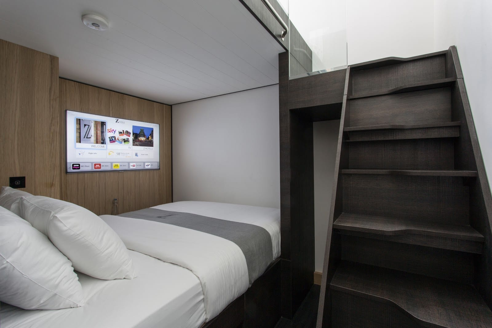

*A family room: the second bed is up the stairs.*

**136-144 City Road, EC1V 2RL.** Z Hotels save money on floor space, not on location, and on all five nights we priced, the cheapest double here was one with **no window**. The Hotel Guru puts it on its budget list from £125, and The Holiday Lab gives $110 to $135 a night. Steffen, a German blogger who says he's tested every hotel he lists, says you can't go wrong with it. A YouTube review from June 2026 gave it three and a half stars, for a double at about £59, and mentioned noisy plumbing.

It's a minute's walk from Old Street station. Z's free membership takes 10% off the public rate and adds complimentary cheese and wine. Family rooms sleep four, on two beds stacked as bunks with separate stairs to the top one.

### hub by Premier Inn London Shoreditch

*Typical night £131 · £63 to £179 on our five nights · Shoreditch · 4 min from Shoreditch High Street · Cited by 4 sources · [premierinn.com](https://www.premierinn.com/gb/en/hotels/england/greater-london/london/hub-london-shoreditch.html)*

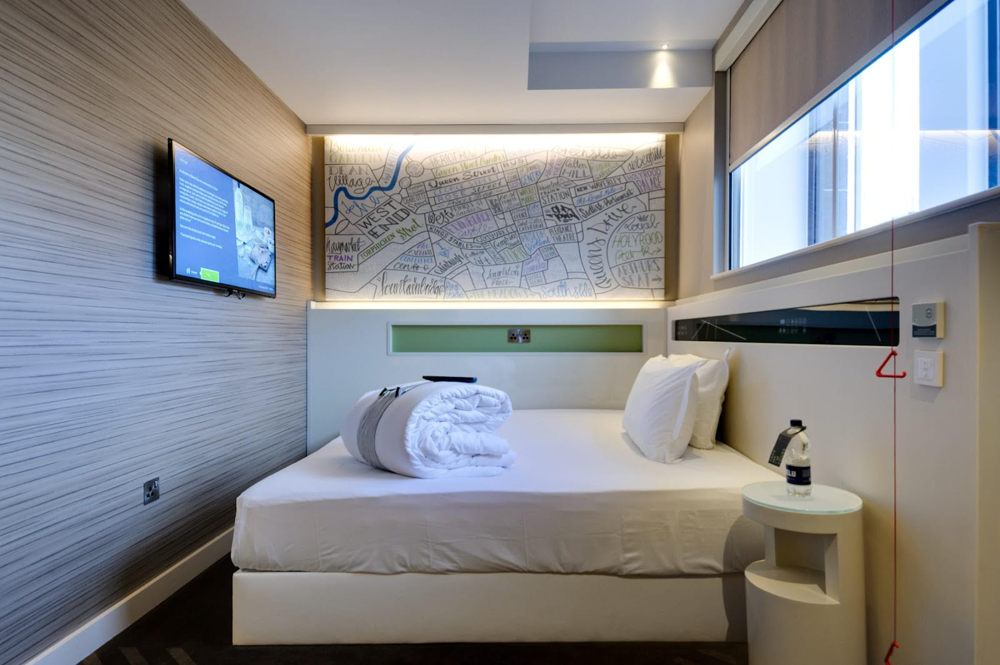

*A room at hub Shoreditch, with a hand-drawn street map above the bed.*

**Quaker Street, E1 6SN.** The cheapest night in central London was here: **£63 on a Sunday in October**. A Wednesday in February was £90, and the two Saturdays in October and December were £167 and £179. A traveller on r/uktravel says it "can be vastly cheaper and especially on Sunday and Monday nights", and our prices show the same thing.

hub is Premier Inn's small-room brand. A Standard room is 11 square metres with a double bed, storage underneath it and a touchscreen for the lights and heating. A Bigger room is 14 square metres with a king-size bed. Travel Off Script says the rooms are compact "but nice and prices low if you get a deal", and Wanderings with Bri picks it for nightlife. It's four minutes from Shoreditch High Street on the Overground.

### hub by Premier Inn London King's Cross

*Typical night £137 · £92 to £196 on our five nights · King's Cross · 6 min from King's Cross St Pancras · Cited by 4 sources · [premierinn.com](https://www.premierinn.com/gb/en/hotels/england/greater-london/london/hub-london-kings-cross.html)*

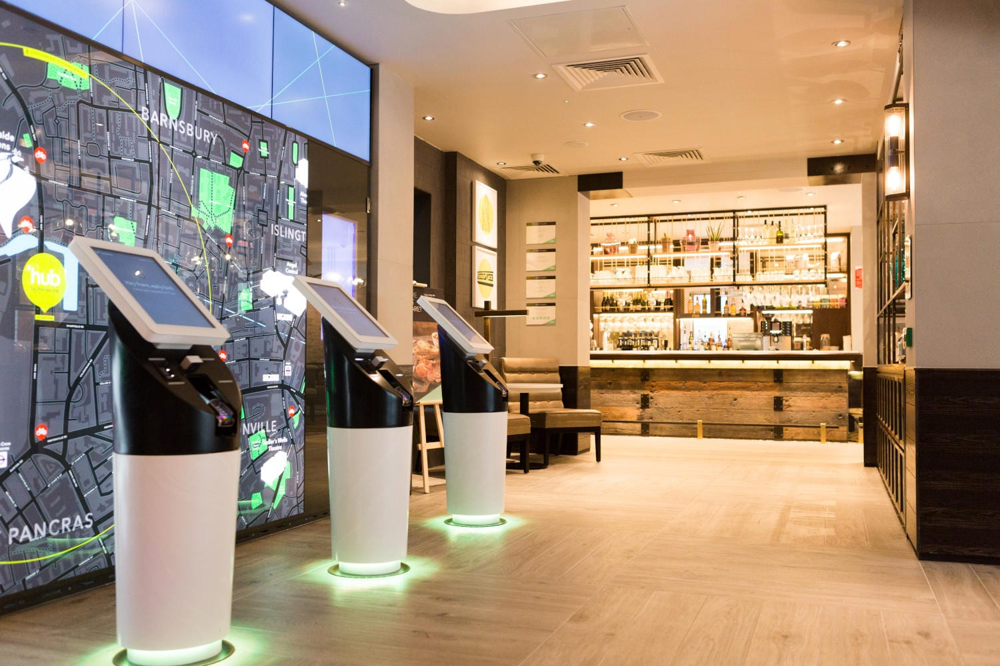

*Check-in is at touchscreen kiosks in the lobby.*

**50 Wharfdale Road, N1 9FA.** Six minutes from King's Cross St Pancras, which puts the Eurostar, six Underground lines and the Regent's Canal on the doorstep. The rooms are the same as at every hub: 11 square metres for the Standard double, 14 for the Bigger room with a king-size bed. The Sunday we priced was £92 and the February Wednesday £114.

This one is mostly backed by people who've stayed. "Stayed at Premier Inn Hub Kings X. Was v nice," says one Mumsnet poster. On r/TravelHacks: "Certainly budget but reasonably modern, clean, and comfortable." Candace Abroad lists it among London hotels under £150.

## Further out, on a fast line

A cheaper hotel further out is only a saving if the journey in is quick. So we started with the areas, not the hotels. Every area here passed one test first: **a direct train, with no change, to the West End or the City in 30 minutes or less**, on a line that runs all day. The minutes below are time on the train, from TfL's Journey Planner for a weekday morning. The walk from the hotel to the station is given in each entry. For choosing an area by what the trip is for, see [the best areas to stay in London](/articles/best-areas-to-stay-in-london/).

The saving is real. Across the 26 hotels we priced further out, the middle typical night was **£141.50**, against **£179** across the 19 in central London. **19 of the 26 came in at £150 or less; in central London, 3 of the 19 did.**

We timed 151 stations in zones 2 to 4. These are the areas with a hotel at £150 or less, fastest first.

| Area | Station | West End | City | The train |
|---|---|---|---|---|
| Whitechapel | Whitechapel | 8 min | 3 min | Elizabeth line to Tottenham Court Road and Liverpool Street, 21 trains an hour |
| Kennington | Kennington | 7 min | 6 min | Northern line to Leicester Square and London Bridge, 21 to 26 trains an hour |
| Stratford | Stratford | 13 min | 7 min | Elizabeth line to Tottenham Court Road and Liverpool Street, 11 trains an hour |
| Shepherd's Bush | Shepherd's Bush | 10 min | 20 min | Central line to Bond Street and Bank, 27 trains an hour |
| Earl's Court | Earl's Court | 10 min | 21 min | Piccadilly line to Green Park, District line to Bank, 22 to 24 trains an hour |
| Canning Town | Canning Town | 17 min | 11 min | Jubilee line to Westminster and London Bridge, 27 trains an hour |
| Royal Docks | Custom House | 16 min | 11 min | Elizabeth line to Tottenham Court Road and Liverpool Street, 12 trains an hour |
| Hackney | Hackney Downs | - | 12 min | Overground to Liverpool Street, 8 trains an hour |
| East India | East India | - | 13 min | DLR to Bank, 6 trains an hour |
| West Brompton | West Brompton | 14 min | 24 min | District line to Westminster and Bank, 10 trains an hour |
| Golders Green | Golders Green | 17 min | 23 min | Northern line to Tottenham Court Road and Bank, 12 trains an hour |
| Hanger Lane | Hanger Lane | 21 min | 32 min | Central line to Bond Street and Bank, 10 trains an hour |
| Wood Green | Wood Green | 23 min | - | Piccadilly line to Leicester Square, 23 trains an hour |
| Greenwich | Deptford Bridge | - | 25 min | DLR to Bank, 13 trains an hour |

### East London

#### ibis budget London Whitechapel

*Typical night £125.50 · £84 to £168 on four of our five nights · Whitechapel · 6 min from Whitechapel · Cited by 3 sources · [all.accor.com](https://all.accor.com/hotel/8033/index.en.shtml)*

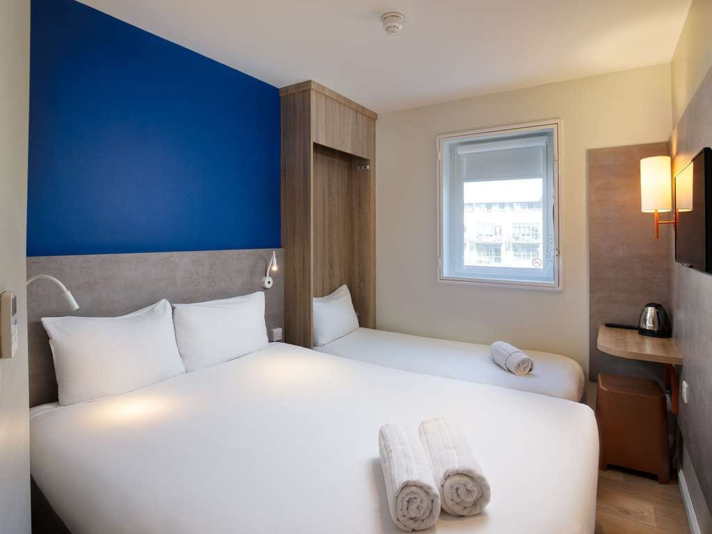

*A double and a single: the rooms sleep three.*

**100 Whitechapel Road, E1 1JG.** Mumsnet's pick for east London, with one warning: the rooms only sleep three. A YouTube review from July 2026 gave it four stars, for a double at about £62, and called ibis budget "probably the best of the budget brands although not the cheapest". Visit London lists it for "the low-cost and great location".

The October Sunday was £84 and the April Saturday £107; the December and October Saturdays were £144 and £168. From Whitechapel station, six minutes' walk, the Elizabeth line reaches Liverpool Street in 3 minutes.

#### New Road Hotel

*Typical night £143 · £97 to £215 on our five nights · Whitechapel · 5 min from Whitechapel · Cited by 4 sources · [Hotels.com](hotelscom:659396032)*

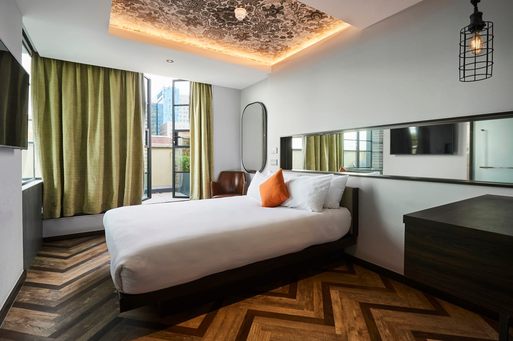

*A double at New Road Hotel. Every room gets daylight.*

**103-107 New Road, E1 1HJ.** A 79-room hotel in a former textile factory, the detail ELLE and The Frugality both pick out. Every room gets daylight and has a rainfall shower and air conditioning. There's no kettle: tea, coffee and hot chocolate are free from machines on every floor. Suitcase calls it "cheap and cheerful".

The cheapest room is the Pocket Double: £97 on the February Wednesday and £109 on the October Sunday. On the October Saturday the cheapest double left was a Warehouse Double, at £215. Whitechapel station is five minutes' walk.

#### Premier Inn London Stratford

*Typical night £134 · £71 to £203 on our five nights · Stratford · 6 min from Stratford · Cited by 2 sources · [premierinn.com](https://www.premierinn.com/gb/en/hotels/england/greater-london/london/london-stratford.html)*

**9 International Square, Westfield Stratford City, E20 1EE.** Inside the Westfield Stratford City development, and a Mumsnet poster finds it "handy for Westfield". Wandermust Family lists it among its family bases further out.

The October Sunday was £71 and the February Wednesday £106; the October and December Saturdays were £186 and £203. Stratford International is three minutes' walk, but the Elizabeth line leaves from Stratford station, six minutes away, and reaches Liverpool Street in 7.

#### Moxy London Stratford

*Typical night £143 · £99 to £199 on our five nights · Stratford · 3 min from Stratford · Cited by 4 sources · [Hotels.com](hotelscom:626428768)*

**86 Great Eastern Road, E15 1GR.** Marriott's Moxy brand, three minutes from Stratford station. ELLE promises "good value, sleek design and top eco credentials", and Visit London calls it "boutique on a budget". A traveller on Reddit found it a "great hotel and price, but far away from everything", though the Elizabeth line reaches Tottenham Court Road in 13 minutes.

The cheapest room on all five nights was a double with one queen bed: £99 on the October Sunday and £124 on the February Wednesday, then £143 to £199 on the Saturdays.

#### ibis London Canning Town

*Typical night £106 · £84 to £168 on our five nights · Canning Town · next to Canning Town · Cited by 2 sources · [Hotels.com](hotelscom:631170048)*

**8 Silvertown Way, E16 1ED.** Next to Canning Town station, where the Jubilee line reaches London Bridge in 11 minutes and Westminster in 17, and runs all night at weekends. The Budget Savvy Travelers call it "both affordable and convenient", and a Reddit poster singles out "particularly the Canning Town one".

The February Wednesday was £84, and the April Saturday and October Sunday £100 and £106. The October and December Saturdays were £153 and £168.

#### ibis London ExCeL Docklands

*Typical night £101 · £76 to £185 on our five nights · Royal Docks · 6 min from Custom House · Cited by 2 sources · [Hotels.com](hotelscom:215235)*

**9 Western Gateway, E16 1AB.** Beside the ExCeL exhibition centre, six minutes' walk from Custom House, where the Elizabeth line reaches Liverpool Street in 11 minutes. A Mumsnet poster calls it "excellent - cheaper than a PI", meaning Premier Inn, and a Reddit poster makes the point about the train: "central London in 15 mins".

The October Sunday was £76, and the April Saturday and February Wednesday £97 and £101. The October and December Saturdays were £185 and £156.

#### Good Hotel London

*Typical night £150 · £75 to £153 on our five nights · Royal Victoria Dock · 9 min from Custom House · Cited by 5 sources · [Hotels.com](hotelscom:522619328)*

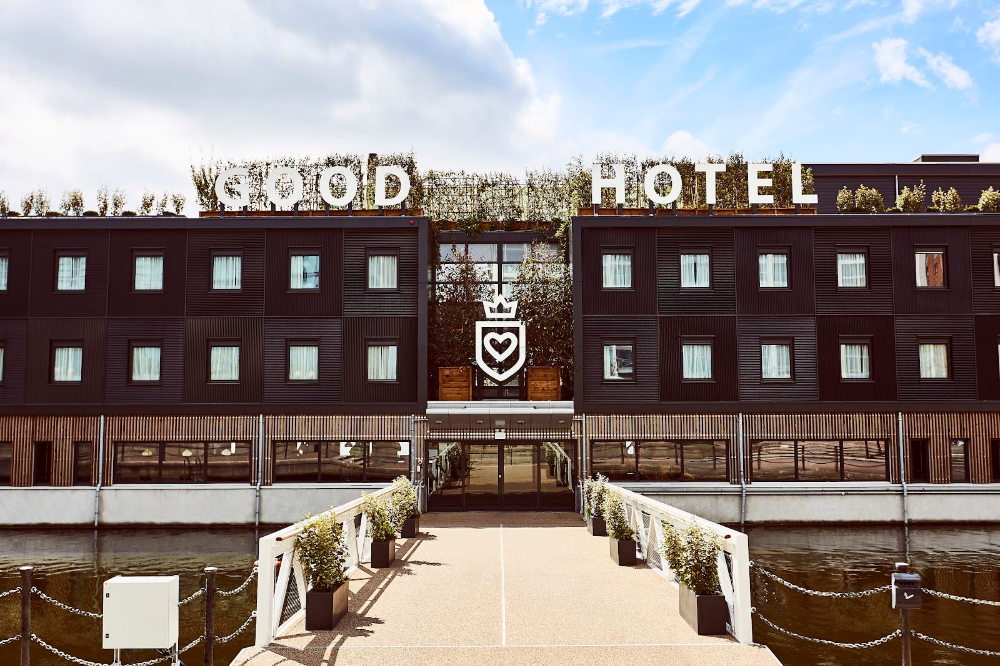

*The hotel floats at Royal Victoria Dock, and you board it by a gangway.*

**Western Gateway, E16 1FA.** A floating hotel, moored at Royal Victoria Dock since 2016, and **Time Out's number one** budget hotel in London. Its prices barely moved: £150 to £153 on three of the five nights, and **£75 on the October Sunday**. The rooms are Dutch-designed, with walk-in rain showers, and there's a bar on the roof. The hotel's own pledge is that every night's sleep helps a disadvantaged child go to school for a week.

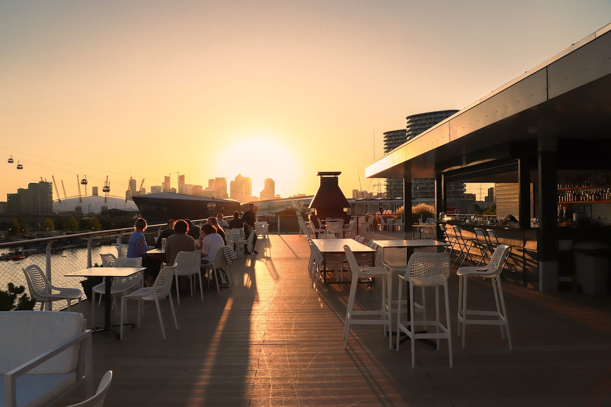

*The roof bar looks across the dock to the O2 and Canary Wharf.*

Lonely Planet's warning is that the rooms are compact, "but the Elizabeth Line gets you into central London quickly".

#### Kip Hotel

*Typical night £81 · £72 to £163 on three of our five nights · Hackney · 5 min from Hackney Downs · Cited by 2 sources · [Hotels.com](hotelscom:581101)*

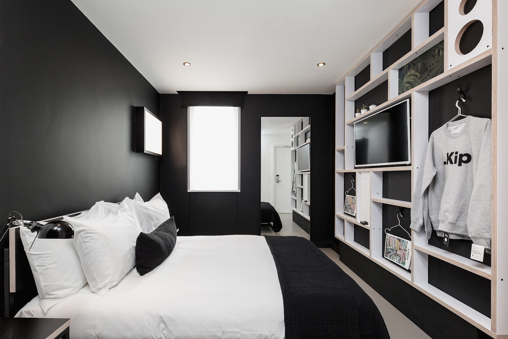

*A double at Kip, which sells its rooms by size.*

**2 Aspland Grove, E8 1JW.** A design-led hotel next to Hackney Central station that sells its rooms by size, from solo cabins and a "snug double for two" up to large doubles, family rooms and a penthouse. Holiday Expert warns that the cheapest rooms are singles with no window and a shared bathroom; the prices here are for a double.

The October Sunday was £72 and the February Wednesday £81, but the December Saturday was £163. For the centre, walk five minutes to Hackney Downs, where the Overground reaches Liverpool Street in 12 minutes.

#### Travelodge London Docklands

*Typical night £81.99 · £34.99 to £111.99 on our five nights · East India · 5 min from East India · Cited by 3 sources · [travelodge.co.uk](https://www.travelodge.co.uk/hotels/697/London-Docklands-Central-hotel)*

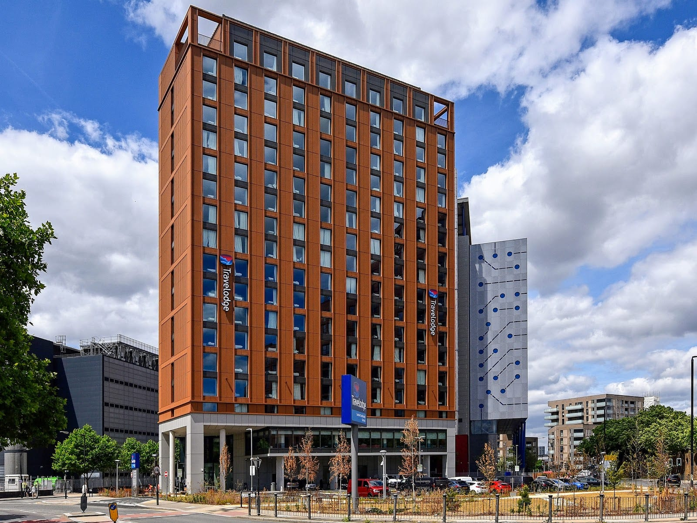

*The new-build tower at East India.*

**1 Oregano Drive, E14 2AE.** A new-build Travelodge at East India, which Travelodge calls London Docklands Central, and the cheapest night in this guide: **£34.99 on the October Sunday**. The February Wednesday was £42.99, and the three Saturdays £81.99 to £111.99.

A YouTube review gave it four stars for a £49 double: "a decent option if you don't mind being away from London's nightlife". On Mumsnet: "clean and spacious, depending on the day really cheap". The DLR from East India reaches Bank in 13 minutes, but only six trains an hour.

#### Premier Inn London Greenwich

*Typical night £142 · £66 to £166 on our five nights · Greenwich · 4 min from Deptford Bridge · Cited by 4 sources · [premierinn.com](https://www.premierinn.com/gb/en/hotels/england/greater-london/london/london-greenwich.html)*

**43-81 Greenwich High Road, SE10 8JL.** Globetotting calls it "ideal for exploring Greenwich", and two more family travel blogs list it. The October Sunday was £66 and the February Wednesday £86; the three Saturdays were £142 to £166.

It's the slowest journey in this guide. Deptford Bridge is four minutes' walk, the DLR takes 25 minutes to Bank, and there's no direct train to the West End.

### South London

#### The Tommyfield

*Typical night £149 · £139 to £189 on three of our five nights · Kennington · 5 min from Kennington · Cited by 2 sources · [Hotels.com](hotelscom:770580832)*

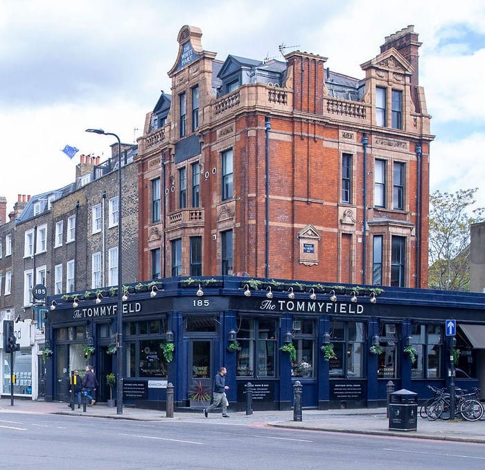

*The six bedrooms are upstairs.*

**185 Kennington Lane, SE11 4EZ.** A pub with six bedrooms upstairs, each with a king or super-king bed. Downstairs, The Sunday Telegraph put it among Britain's best pubs for Sunday lunch, and its function room hosts a stand-up comedy club. The Hotel Guru and Forever Out of Office both list its rooms.

The October Sunday was £139, the February Wednesday £149 and the April Saturday £189. Kennington station is five minutes' walk, and the Northern line reaches London Bridge in 6 minutes and Leicester Square in 7.

### West London

#### W12 Rooms

*Typical night £114.50 · £80 to £130 on the four nights it had rooms · Shepherd's Bush · next to Shepherd's Bush · Cited by 4 sources · [Hotels.com](hotelscom:439133)*

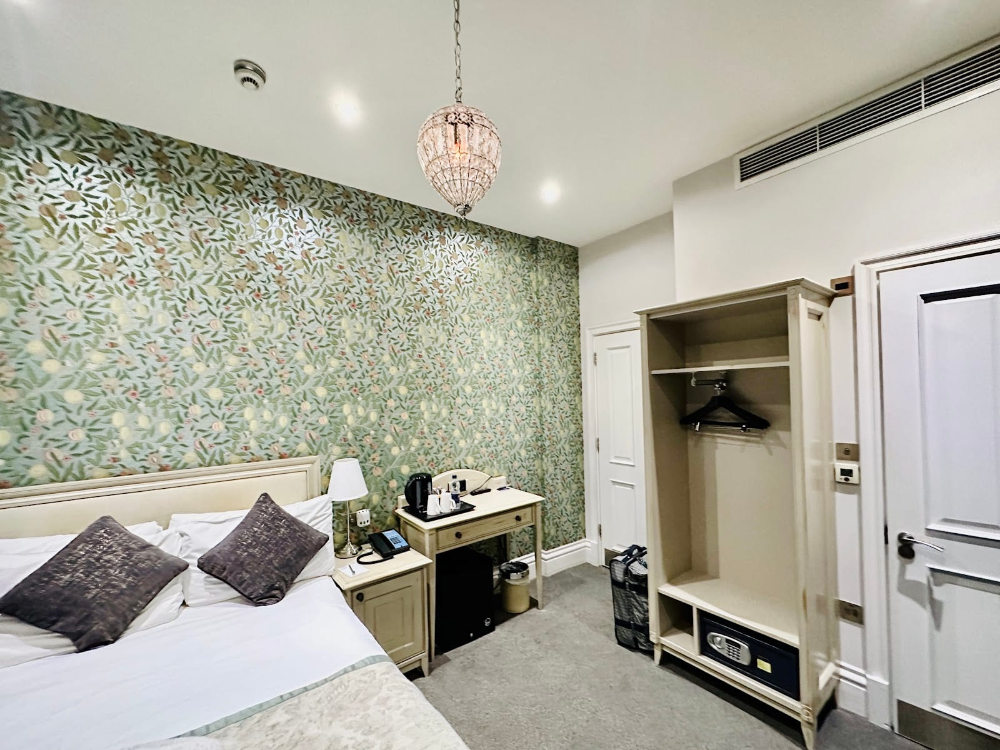

*A double at W12 Rooms.*

**54 Uxbridge Road, W12 8LP.** Nineteen rooms, with Westfield London on the doorstep, and one of the cheapest hotels in this guide. It was **sold out on the October Saturday**, and £80 to £130 on the other four nights. Wanderings with Bri calls it "the cutest stay on the list". On r/LondonTravel: "£80 a night and clean and well connected." The Central line from Shepherd's Bush reaches Bond Street in 10 minutes.

#### Mowbray Court Hotel

*Typical night £119 · £85 to £176 on three of our five nights · Earl's Court · 1 min from Earl's Court · Cited by 2 sources · [Hotels.com](hotelscom:608469)*

**28-32 Penywern Road, SW5 9SU.** A hotel in a listed Victorian building around the corner from Earl's Court station, with a lift and a 24-hour front desk. The rooms are practical: a twin is 12 square metres, and every room has its own shower room and a kettle. Breakfast is £10 a head. The Holiday Lab and Her Nomad Eyes both list it.

The February Wednesday was £85 and the October Sunday £119; the April Saturday was £176. The Piccadilly line from Earl's Court reaches Green Park in 10 minutes and runs all night at weekends.

#### The Rockwell

*Typical night £120 · £105 to £190 on three of our five nights · Earl's Court · 5 min from Earl's Court · Cited by 2 sources · [Hotels.com](hotelscom:296058)*

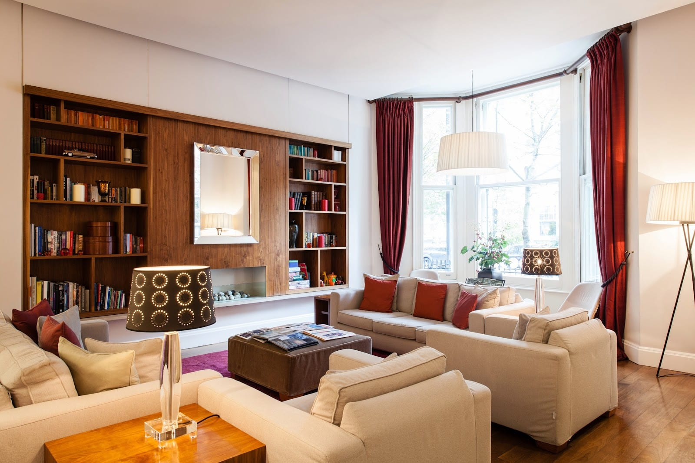

*Inside The Rockwell's Victorian townhouse on Cromwell Road.*

**181-183 Cromwell Road, SW5 0SF.** An independent hotel in a Victorian townhouse, with a bar, a restaurant and a garden, and rooms from singles up to garden rooms and a mezzanine suite. The Evening Standard called it a bargain in 2024, with rooms "just over a hundred quid", and a Reddit poster found it "lovely and really affordable".

The February Wednesday was £105 and the October Sunday £120, but the October Saturday was £190. Earl's Court station is five minutes' walk.

#### Premier Inn London Kensington (Earl's Court)

*Typical night £147 · £85 to £221 on our five nights · Earl's Court · 3 min from Earl's Court · Cited by 5 sources · [premierinn.com](https://www.premierinn.com/gb/en/hotels/england/greater-london/london/london-kensington-earls-court.html)*

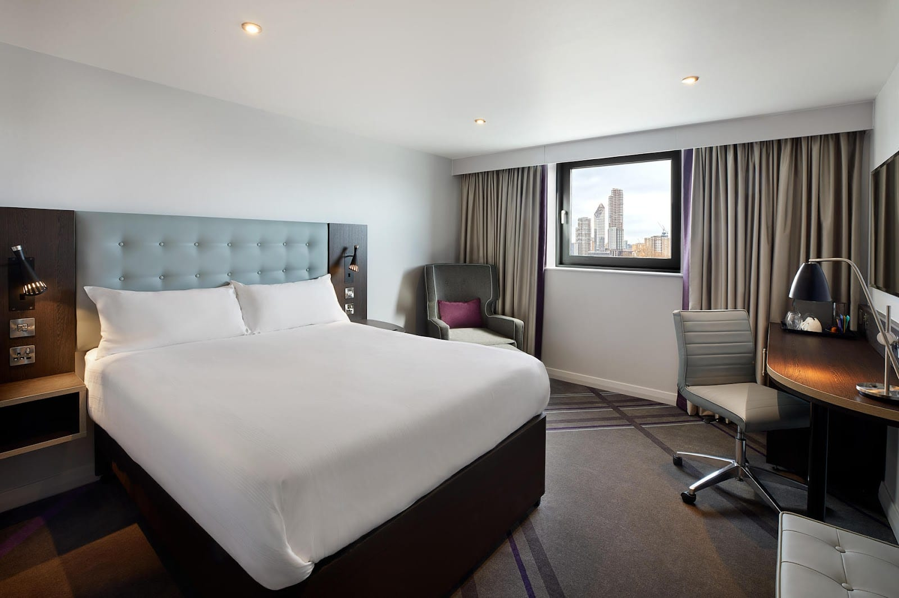

*A double at the Earl's Court Premier Inn.*

**11 Knaresborough Place, SW5 0TJ.** Mumsnet's guide to budget family hotels calls it the best overall, and two family travel blogs pick it for the museums: Globetotting says the Natural History Museum, the Science Museum and the Royal Albert Hall are a short walk away. The Sunday we priced was £85 and the February Wednesday £104. Both October and December Saturdays were over £200, so this is a weeknight hotel if the budget is tight.

It has family rooms and a restaurant, and when an adult orders a Premier Inn breakfast, up to two children eat breakfast free.

#### hub by Premier Inn London West Brompton

*Typical night £141 · £59 to £176 on our five nights · West Brompton · 1 min from West Brompton · Cited by 3 sources · [premierinn.com](https://www.premierinn.com/gb/en/hotels/england/greater-london/london/hub-london-west-brompton.html)*

**11-15 Lillie Road, SW6 1TX.** Next to West Brompton station, with the same small rooms as every hub: 11 square metres for a Standard double, 14 for a Bigger room with a king-size bed. A Mumsnet poster recommends "the one by West Brompton station, which tends to be a bit cheaper", and on Reddit: "we've had a room in West Brompton for as little as £50."

Our Sunday and Wednesday bear that out, at £59 and £64. The three Saturdays were £141 to £176. The District line reaches Westminster in 14 minutes.

#### Premier Inn London Hanger Lane

*Typical night £114 · £47 to £142 on our five nights · Hanger Lane · next to Hanger Lane · Cited by 2 sources · [premierinn.com](https://www.premierinn.com/gb/en/hotels/england/greater-london/london/london-hanger-lane.html)*

**1-6 Ritz Parade, W5 3RA.** The cheapest Premier Inn we priced: £47 on the October Sunday, £76 on the February Wednesday, and no night over £142. A Mumsnet poster found it "very handy for the Central line", which runs from Hanger Lane station, next door, to Bond Street in 21 minutes, 10 trains an hour.

### North London

#### NOX Golders Green

*Typical night £119 · £89 to £208 on our five nights · Golders Green · 5 min from Golders Green · Cited by 3 sources · [noxhotels.co.uk](https://www.noxhotels.co.uk/en/hotel-golders-green-in-golders-green/)*

**146-150 Golders Green Road, NW11 8HE.** A hotel with a 24-hour reception, selling doubles and double studios; some studios are on the lower ground floor, with no window. The Hotel Journal calls it "contemporary apartment-style accommodation", and a traveller on Reddit found it "budget friendly but clean".

Four of our nights were £89 to £124; the April Saturday was £208. Golders Green station is five minutes' walk, and the Northern line reaches Tottenham Court Road in 17 minutes.

#### Green Rooms

*Typical night £88 · £80 to £96 on three of our five nights · Wood Green · 1 min from Wood Green · Cited by 3 sources · [greenrooms.london](https://www.greenrooms.london/)*

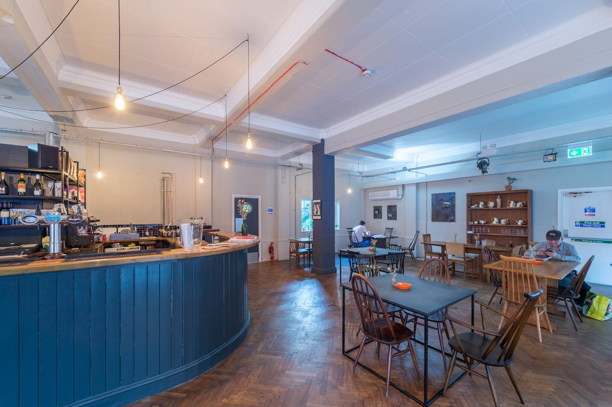

*The café and bar on the ground floor.*

**13-27 Station Road, N22 6UW.** An arts hotel opposite Wood Green station, and ELLE notes that artists and creatives get a discount. The standard and corner rooms share bathrooms on both floors; there are also en-suite rooms, studio apartments for up to four adults, and two dormitories. Wanderings with Bri calls it "an artsy, affordable hotel that supports creatives".

The October Sunday was £88, and the October and December Saturdays £96 and £80. The Piccadilly line reaches Leicester Square in 23 minutes and runs all night at weekends.

## Named everywhere, priced over £150

These hotels are named by four or more independent sources, but their typical night came to more than £150.

| Hotel | Sources | Typical night | Cheapest to dearest night |
|---|---|---|---|
| [The Pilgrm](hotel:the-pilgrm) | 10 | £204 | £179 to £259 |
| [The Z Hotel Strand](hotelscom:3300001088) | 8 | £180 | £146 to £247 |
| [Premier Inn London County Hall](https://www.premierinn.com/gb/en/hotels/england/greater-london/london/london-county-hall.html) | 7 | £177 | £92 to £295 |
| [citizenM London Bankside](hotel:citizenm-bankside) | 7 | £220 | £155 to £251 |
| [The Hoxton, Shepherd's Bush](hotelscom:2678433024) | 6 | £159 | £144 to £214 |
| [The Z Hotel Trafalgar](hotelscom:3268629376) | 6 | £173 | £127 to £235 |
| [The Z Hotel Soho](hotelscom:154280320) | 6 | £205 | £145 to £250 |
| [The Z Hotel Covent Garden](hotel:z-hotel-covent-garden) | 6 | £211 | £151 to £266 |
| [Motel One London-Tower Hill](hotelscom:478232) | 6 | £222 | £160 to £243 |
| [The Z Hotel Victoria](hotelscom:199590624) | 5 | £165 | £135 to £205 |
| [ibis Styles London Southwark](hotelscom:220240) | 5 | £223 | £139 to £257 |
| [Premier Inn London Southwark (Bankside)](https://www.premierinn.com/gb/en/hotels/england/greater-london/london/london-southwark-bankside.html) | 4 | £161 | £102 to £243 |
| [Point A Hotel London King's Cross](hotelscom:410470) | 4 | £176 | £126 to £220 |
| [Point A Hotel London Liverpool Street](hotelscom:406460) | 4 | £178 | £92 to £203 |
| [Premier Inn London King's Cross](https://www.premierinn.com/gb/en/hotels/england/greater-london/london/london-kings-cross.html) | 4 | £179 | £127 to £283 |
| [The Resident Victoria](hotelscom:545888) | 4 | £258 | £222 to £272 |
| [The Hoxton, Holborn](hotelscom:266481024) | 4 | £304 | £239 to £369 |

Four more had too few nights to judge. The Corner London City, the most-cited budget hotel of all, was £132 on the October Sunday and £153 on the December Saturday, and sold out on the October Saturday; its 2027 prices on Hotels.com, £446 to £1,008 a night for every room, are too far above those to count. The Culpeper had rooms on two of the five, at £185 both times, and St. Athans Hotel on one, at £106. The Lime Tree Hotel wouldn't sell a single night for two on any of them.

## The budget chains, compared

Which? asks its members to score the hotel chains they've stayed with. Its latest survey, published in November 2025, covers 7,287 leisure stays at 32 large chains across the UK. These are scores for each brand as a whole, not for any London branch.

| Chain | Which? member score | Place, of 32 |
|---|---|---|
| Wetherspoon Hotels | 76% | 5th, and a Which? Recommended Provider |
| Premier Inn | 73% | 7th |
| Holiday Inn Express | 71% | 11th |
| hub by Premier Inn | 70% | 13th |
| Hampton by Hilton | 67% | 17th |
| Best Western | 66% | 19th |
| Greene King Inns | 65% | 22nd |
| ibis Styles | 64% | 23rd |
| ibis | 61% | 25th |
| Travelodge | 59% | 28th |
| ibis budget | 57% | 30th |
| Days Inn | 54% | 31st |
| Britannia | 44% | 32nd, last |

Which? members still rate Premier Inn "far superior" to Travelodge, which got two stars out of five for its bedrooms, bathrooms, breakfast and value for money. Several of the brands London's lists name most often aren't in the survey at all, including Z Hotels, Point A, citizenM, easyHotel, Motel One and Moxy.

**How their London hotels priced.** Every hub we priced came in under £150: Shoreditch at £131, King's Cross at £137 and West Brompton at £141. Premier Inn only did further out, at Hanger Lane (£114), Stratford (£134), Greenwich (£142) and Earl's Court (£147); its County Hall, Southwark and King's Cross hotels were £161 to £179. Of six Z Hotels, only Shoreditch made it, at £150, and both Point A hotels were over, at £176 and £178. Among sources that recommend a chain rather than a hotel, Premier Inn is named most often, by 11, then Point A and Travelodge, by 7 each.

## Family rooms on a budget

We priced a double for two adults, so for a family these are the hotels to price first rather than a verdict on what a family room costs.

**[Premier Inn London Kensington (Earl's Court)](#premier-inn-london-kensington-earls-court)** is the one the family sources agree on most. Mumsnet calls it the best budget family hotel in London, and up to two children eat breakfast free when an adult orders one. **Travelodge London Covent Garden** is Mumsnet's pick in central London, and Lost in Landmarks puts its family rooms from around £150 for two adults and two children. **[ibis budget London Whitechapel](#ibis-budget-london-whitechapel)** is Mumsnet's pick in east London, with the warning that its rooms only sleep three. **[The Z Hotel Shoreditch](#the-z-hotel-shoreditch)** has family rooms for four, on two beds stacked as bunks.

## Other cheap ways to sleep in London

- **Hostels.** Several lists count a hostel as a budget hotel: Time Out ranks Generator London second, and Mumsnet names YHA London Central its best hostel. See [the best hostels in London](/articles/best-hostels-london/).
- **Capsules.** A berth with a shutter in a shared dormitory, for when you only need somewhere to sleep. See [London's capsule hotels](/articles/pod-hotels-london/).
- **Windowless rooms.** A proper en-suite room with no daylight. Every Z Hotel sells a windowless grade, and Zedwell builds whole hotels that way. See [windowless hotel rooms in London](/articles/windowless-hotel-rooms-london/).
- **Aparthotels.** Rarely cheaper per night, but a kitchen can cut the cost of a longer stay. See [London aparthotels](/articles/aparthotels-london/).
- **Everything else on a budget.** [London on a budget](/articles/london-on-a-budget/) covers the free museums, the free viewpoints and where to eat for under £10.
- **University rooms in summer.** Student halls let rooms to visitors in the summer holidays. LSE's Bankside House, behind Tate Modern, is named by EuroCheapo, Wanderings with Bri and BudgetTraveller.
