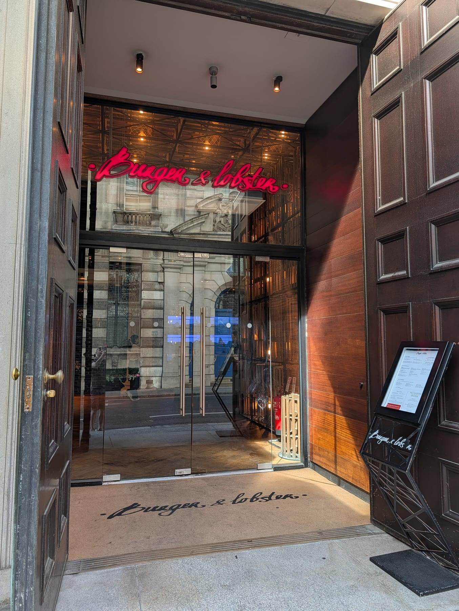

There is no shortage of people telling you where London's best burger is. There is a shortage of anyone checking whether they agree.

So this guide does not review burgers. It counts. Every restaurant below is ranked by **how many independent awards, critics and reviewers named it**, with the judged award weighted above the press and the press above the listings sites. Where the sources disagree, that disagreement is the interesting part and it gets its own section.

> 💡 **The Short Version:** **Bleecker** and **The Plimsoll** are level at the top on seven sources each. **Honest Burgers** won the National Burger Awards 2026 — but only at one branch. **Supernova** is the best thing in Soho with a 25-word menu. **Dove** makes ten burgers a night and stops. And **Jupiter Burger** is the best £10 of the lot.

> 📊 **The evidence behind this guide**
> This pass reads **9 sources carrying 110 citations** across **49 named burgers**. **24 are named by two or more independent sources; 6 carry a dated award.**
> **Built on:** the National Burger Awards 2026, plus seven independent publications and listings sites.
> *Evidence built 31 August 2026 · [How we rank →](/how-we-rank/)*

## Where they are

  

    Best burgers in London map
  

  

    
Loading the interactive map…

  

  

    <i class="restaurant-map-key restaurant-map-key--editorial" aria-hidden="true"></i> Recommended in this guide
    <i class="restaurant-map-key restaurant-map-key--streetfood" aria-hidden="true"></i> Market stall, counter & food hall
  

  <noscript>
    
The interactive map requires JavaScript. Nearest stations are listed against every entry below.

  </noscript>

| If you are near… | Where to eat |
| --- | --- |
| **Soho & Fitzrovia** | Supernova, Heard, Manna, Chuck's, Fat Hippo |
| **Mayfair & Victoria** | Dover Street Counter, Hanbaagaasuuteeki |
| **Shoreditch & Spitalfields** | Burger & Beyond, Dumbo, Blacklock, One Club Row |
| **Hackney & London Fields** | Bake Street, Jupiter Burger, Lagom (Dalston) |
| **North London** | The Plimsoll (Finsbury Park), Bolland & Crust (Tottenham) |
| **West London** | Dove (Notting Hill), GOAT Burger (Knightsbridge) |
| **South London** | Mother Flipper (Brockley), Baba G's (Brixton) |
| **Multiple sites** | Bleecker, Honest Burgers, Patty & Bun, MEATliquor, Burger & Lobster, Beer + Burger Store |

**Price guide:** **£** under £15 a head · **££** £15–£30 · **£££** £35+.

---

## The two number ones

Two restaurants sit level at the top on seven sources each, and they are not doing remotely the same thing. **Bleecker** is a burger shop that has been making one burger properly for a decade. **The Plimsoll** is a Finsbury Park pub whose kitchen happens to make the burger critics keep writing about. A third name, **Honest Burgers**, holds the only trophy in the room. The section below is why all three answers are defensible.

### Bleecker, Victoria, Soho and Baker Street

*££ · multiple sites · walk-in · Cited by 7 sources · National Burger Awards 2026 finalist · [website](https://www.bleecker.co.uk/)*

**The one that most London burger arguments end at**, and the only name here that appears on every kind of list — the award shortlist, the critics, the listings sites and the tourist board.

The menu is deliberately tiny: **a cheeseburger, a double, a bacon double, and a blue cheeseburger** built on dry-aged beef with a crust that comes off a hard sear rather than a long cook. Nothing is garnished into complication — no lettuce, no tomato, no aioli of anything. The **Bacon Double** is what it took to the National Burger Awards 2026 final.

Add a malted shake, which is on the menu for the specific job of cutting through the salt and fat. It started as a truck in 2012 and the shops still feel like one: counters, paper, no ceremony.

**££, walk-in, no bookings.** Victoria, Soho and Baker Street among others, and the queues move because the kitchen only makes four things.

### The Plimsoll, Finsbury Park

*££ · Finsbury Park · 6 min from Finsbury Park · walk-in · Cited by 7 sources · [website](https://www.theplimsoll.co.uk/)*

**A modern Finsbury Park pub with the most-written-about burger in London**, cooked by the chef duo Four Legs — which is why some sources file it under Four Legs and some under the pub. It is one burger, in one room.

The **Dexter cheeseburger** is the order and the restraint is the point: a Dexter beef patty, diced onion, pickles, cheese and burger sauce in a soft bun, and **no lettuce and no tomato**. The kitchen has said openly it is aiming at what a McDonald's does and doing it with better beef, which is a more honest description than most burger menus manage.

Beyond it the pub cooks a proper seasonal menu and pours a serious pint, so this is a night out rather than a counter stop.

**££, and it does not take bookings for the burger** — turn up, put your name down, drink while you wait. Busiest from seven and at weekends.

### Honest Burgers, Liverpool Street and across London

*£ · multiple sites · Cited by 4 sources · **winner, National Burger Awards 2026** · [website](https://www.honestburgers.co.uk/)*

**The only burger in this guide that actually won something in 2026** — and the detail everyone drops is that the winning burger is served at one address.

**The Honest** took the National Burger Awards outright: dry-aged beef from the company's own butchery, thick-cut Wiltshire bacon, a beef and onion relish, XL cheese, house pickles and diced onion. **It is on the menu only at the Smash + Grab site on Liverpool Street**, not at the other forty-odd branches, so ordering "the Honest" elsewhere does not get you the winner.

What the rest of the estate does well is the **local special** — a different burger at each branch, changed regularly. Borough Market runs Brindisa chorizo and raclette; Covent Garden has done Lincolnshire Poacher with bourbon barbecue sriracha and crispy onions. Rosemary salted chips come with everything.

**£, walk-in at most sites**, and the cheapest sit-down burger worth crossing a road for. Judges preferring a 46-site chain over the trendy independents is itself the story.

---

## The disagreement

**The award and the critics are not measuring the same burger.**

The National Burger Awards is a live cook-off: sixteen finalists cook their signature burger for judges on one day in March, then cook two more rounds against a set of ingredients. It rewards a kitchen that can execute under pressure — which is why a national chain with a butchery behind it, **Honest Burgers**, beat the independents.

The critics are measuring something else: what it is like to eat there on a Tuesday. That produces a different top of the list — **The Plimsoll**, **Bleecker**, **Black Bear Burger**, **Supernova** — none of which won anything this year, and one of which does not enter.

And the listings sites measure a third thing again: how easy it is to get to. That is why **MEATliquor**, **Burger & Lobster** and **Byron** turn up on Visit London and DesignMyNight and nowhere else in this corpus.

None of the three is wrong. They answer "best" for different evenings. If you want the burger a jury picked, go to Liverpool Street. If you want the one London's critics keep going back to, go to Finsbury Park.

---

## Smash burgers

The thin patty pressed hard onto the plancha so the crust caramelises edge to edge. It has taken over London, and these are the ones the sources agree on.

### Supernova, Soho

*££ · Soho · 3 min from Piccadilly Circus · walk-in · Cited by 4 sources*

**A 25-word menu, and one of the best cheeseburgers in central London.** It went viral on the shortness of the offer rather than on any gimmick.

The **House Cheeseburger** is a smashed patty with house sauce, and the crust comes off so lacy at the edges that The Infatuation compared it to a doily. Hand-cut fries beside it. That is close to the whole menu.

The room is small, pale and contemporary — closer to a coffee bar than a burger joint — and it does takeaway, which is the right move at lunch.

**££, walk-in.** Soho, and it queues from about half past twelve.

### Manna, Soho

*£ · Arcade Food Hall, Tottenham Court Road · 1 min from Tottenham Court Road · walk-in · Cited by 4 sources*

**A smash burger counter inside a food hall**, which makes it the easiest good burger to reach in central London — straight up from the Tottenham Court Road ticket hall.

The burger is **heavy on cheese, with pickles and diced onion** on a thin, crisp-edged patty. There is a Nashville hot chicken version alongside it that half the queue orders instead.

Being in **Arcade Food Hall** is the practical advantage: everyone you are with can eat something different, nobody has to book, and it is one of very few places in the West End where a good burger costs under a tenner.

**£, walk-in, food hall hours.** Order at the counter, sit anywhere.

### Jupiter Burger, London Fields

*£ · Netil Market, London Fields · 8 min from London Fields · walk-in · Cited by 4 sources*

**A stall at Netil Market styled as a retro diner**, from the team behind Dom's Subs — and the best value on this page.

**Two burgers on the menu and nothing else.** The cheeseburger is a well-seasoned smashed patty on a Martin's potato roll, sized to be eaten with one hand while walking round the market, with hand-cut fries if you want to stop. Nothing about it is complicated and everything about it is balanced.

Netil Market is a small yard of traders beside Broadway Market, so this works as one stop of several rather than a destination meal.

**£, walk-in, and market hours only** — check the day before travelling, because it is not open every day.

### Dumbo, Shoreditch

*£ · Shoreditch · 5 min from Shoreditch High Street · walk-in · Cited by 3 sources*

**Paris-born, and the menu runs to four items** — a cheeseburger, an earth burger, nuggets and fries. That is the entire proposition and it is the reason it works.

The smashburgers have **juicy, crispy-edged patties with American cheese, onions, pickles, ketchup and mustard**, assembled the same way every time. The earth burger is the plant-based version and is not an afterthought.

Minimal room, quick turnover, and it draws a queue that moves.

**£, walk-in.** Shoreditch, and it is one of the cheaper good meals in an area that is not cheap.

### Bake Street, Hackney

*££ · Hackney · walk-in · Cited by 3 sources*

**A café that makes a burger good enough to appear on three critics' lists**, which is not a sentence you write often.

The smashburger is a **weekend-only item** — this is a bakery and all-day café the rest of the week — and the **Nashville hot chicken** is the alternative when it is on. Everything is made with the care you would expect of the baking rather than of a burger counter, starting with the bun.

**££, walk-in, and check the day**: turning up midweek expecting the burger is the standard mistake here.

### Chuck's, Fitzrovia

*££ · Fitzrovia · walk-in · Cited by 2 sources*

**A candlelit den with a natural wine list that also makes a serious smash burger** — an unlikely combination that works because the kitchen refuses to compromise either half.

The signature smashburger comes with **heavily charred edges on a fluffy potato bun**, and the kitchen has a **no-modifications policy**: it arrives as built or not at all. Natural wine by the glass rather than a milkshake, which tells you which evening this is for.

**££, walk-in.** Fitzrovia, small, and better later than earlier.

### Hanbaagaasuuteeki, Victoria

*££ · 36 Buckingham Palace Road, SW1W 0RE · 4 min from Victoria · walk-in · Cited by 2 sources*

**The name translates roughly as "wonderful hamburger steak"**, and the whole restaurant is built on the Japanese *hanbāgu* tradition of treating a burger as a steak dish rather than a sandwich.

Smash patties are loaded into **fluffy potato buns with Japanese, Korean, Thai and Chinese flavours** — the seasoning is the point of difference, and nothing else in this guide is attempting it.

**££, walk-in, open daily 11.30am to 11pm.** Buckingham Palace Road, which is a part of London badly served for anything this interesting.

---

## Thick patties, and the ones worth booking

The counterweight to the smash burger: a thick, dry-aged patty cooked pink. These are restaurants that make a burger, not burger shops, and several make very few of them.

### Dove, Notting Hill

*£££ · Notting Hill · book ahead · Cited by 4 sources*

**Ten burgers a service, and when they are gone they are gone.** That single fact is why it appears on every serious list and why most people have never eaten one.

The patty is **50-day dry-aged British beef made from bavette offcuts, seared in beef dripping** for a heavy crust over a pink centre, then finished with **Lyonnaise onions cooked in butter and champagne and a layer of melted gorgonzola**. It is extremely rich — The Infatuation recommends splitting it — and it is a neighbourhood restaurant's idea of a burger rather than a burger shop's.

**£££ and you must book**, early in the service. Just off Portobello Road. Everything else on the menu is a proper modern European kitchen at work.

### Blacklock, Shoreditch and across London

*£££ · 28–30 Rivington Street, EC2A 3DZ · book ahead · Cited by 4 sources · [book a table](https://theblacklock.com/)*

**A chop house whose burger critics rate above most burger restaurants** — which is the kind of thing that only happens when the meat sourcing was already sorted.

Inside a soft sesame bun: a juicy patty, **sliced gherkins, onions caramelised in vermouth and a mild sriracha-laced burger sauce**, with **beef-dripping fries** beside it. The rest of the menu is chops over charcoal in a warehouse room, and the Sunday roast is separately famous.

**£££ and it books ahead**, particularly at weekends. Several London sites; Rivington Street is the Shoreditch one.

### Dover Street Counter, Mayfair

*£££ · Mayfair · book ahead · Cited by 3 sources · National Burger Awards 2026 finalist*

**An upmarket diner in Mayfair that took its plain cheeseburger to the National Burger Awards final** — and got there without adding a single thing to it.

The burger is **ketchup, mustard and pickles on a golden brioche bun**, which in a part of London where everything is truffled is close to a statement. There is **late-night service**, which Mayfair also does not have much of.

**£££, book ahead.** Dover Street. Come after a show rather than instead of one.

### Burger & Beyond, Shoreditch and Borough Yards

*££ · Shoreditch and Borough Yards · Cited by 6 sources · **second in the signature round, National Burger Awards 2026** · [website](https://burgerandbeyond.co.uk/)*

**Second best burger in the UK on the 2026 judging**, and the most-cited name here after the top two.

The **Bacon Butter Burger** is what it entered and what to order: a dry-aged patty, **double American cheese, crispy pancetta, burnt butter mayo and onion**. The burnt butter mayo is the thing nobody else is doing. Beyond it, the **Bougie Burger** with marrownaise and beef-fat onions, and a **Rice Krispie fried chicken burger** that people order on purpose rather than as a concession.

Order the **dirty tots** — tater tots under bone marrow gravy — rather than fries.

**££, walk-in at Shoreditch**, and the beef is dry-aged, grass-fed and native breed, which is where the price goes.

### Black Bear Burger, Shoreditch, Brixton and Exmouth Market

*££ · multiple sites · Cited by 5 sources · **winner, National Burger Awards 2025***

**Last year's national champion**, and it has stayed on every list since — five sources still name it.

The **Miso Bacon Burger** is the one that won: dry-aged beef under **miso butter mayo and smoked bacon**, the miso doing a savoury job that cheese alone does not. The **double black and blue** is the other order — dry-aged beef, cheese, smoked bacon, blue cheese sauce and onions. Add the wings; several sources insist on it.

**££, walk-in.** Sites in Shoreditch, Brixton and Exmouth Market among others.

### Heard, Soho and Borough

*££ · Soho and Borough · Cited by 3 sources*

**Founded by a two-Michelin-starred chef, Jordan Bailey**, which explains a burger menu that reads like a sourcing document.

Six burgers, all built on **British beef from regenerative farms**, in **butter-toasted roast potato buns** — the bun is toasted in the way a roast potato is cooked, which is a detail nobody else bothers with. Wine or beer to match rather than a shake.

**££, walk-in.** Soho and Borough, and the closest thing on this page to fine dining in a bun.

---

## Cheap, quick and at a market

Short entries. Full detail on any of these is above where it exists.

* **Mother Flipper, Brockley** — *£ · Cited by 2 sources.* Started as a van, now a permanent Brockley site. The **Candy Bacon Flipper** is bacon fried in maple syrup with ketchup, mustard, lettuce, red onion, pickle and American cheese. **The van still trades at Brockley Market every Saturday, 10am to 2pm.**
* **Beer + Burger Store, King's Cross and east London** — *£ · Cited by 3 sources.* Craft ale alongside a double patty cheeseburger, a monthly special, kids' meals and a genuine vegan burger on two pea protein patties. Order the dipping gravy.
* **Baba G's, Brixton** — *£ · Cited by 2 sources.* Indian-spiced burgers out of Brixton, on both Eater's and Hot Dinners' lists.
* **Lucky Chip, Islington** — *£ · Cited by 2 sources.* A long-running residency operation, currently at the Old Queen's Head.
* **Lagom, Dalston** — *££ · Cited by 4 sources.* A kitchen inside The Three Compasses doing a **smashburger with dill pickle slaw**, plus fried chicken and lamb. Pub setting, walk-in, and one of the four most-cited names here.
* **Buk, Camden** — *£ · Cited by 1 source.* Thin patty, double American cheese, chilli house sauce and caramelised onion. **Halal.**
* **Burnt Smokehouse, Leyton** — *£ · Cited by 1 source.* Double patty smashburger with caramelised onions and dill pickles, communal seating by the station. **Halal.**

---

## The chains, and what they are for

Named by the listings sites rather than the critics — which is not a criticism, because reliability is the point of them.

* **Patty & Bun** — *££ · Cited by 2 sources.* Started as a 30-seat Marylebone room and now runs seven sites. Order **The Don**, or the **Ari Gold** with red leicester.
* **MEATliquor** — *££ · Cited by 2 sources.* The **Dead Hippie** with its secret sauce is the fan order. Genuinely good vegan options, including impossible nuggets and a black bean chilli dog.
* **Burger & Lobster** — *£££ · Cited by 2 sources.* The **B&L burger** with Nebraskan beef and Atlantic lobster, which is the most expensive burger in this guide and priced as an occasion. Bookable.

* **Dirty Bones, Carnaby, Soho and Shoreditch** — *££ · Cited by 1 source.* The **Mac Daddy** is topped with pulled beef rib and mac and cheese. Cocktails are half the reason people go.
* **Fat Hippo, Soho** — *£ · National Burger Awards 2026 London finalist.* Entered **The Lovue Loot**. Won the plant-based Burger of the Year in 2025.
* **SoBe Burger, Walthamstow** — *£ · National Burger Awards 2026 London finalist.* Entered a **Double Bacon Black Garlic**.

---

## Booking, and what to know

* **Almost nothing here needs a booking.** Bleecker, Supernova, Manna, Jupiter, Dumbo, Chuck's, Bake Street and every market stall are walk-in only.
* **Four places genuinely need one:** **Dove** and **Vesper** make roughly ten burgers a service and sell out early; **Blacklock** and **Dover Street Counter** are restaurants first. **One Club Row** is hard to book — it runs a walk-in light box outside, or try a lunch slot.
* **The award-winning burger is at one address.** "The Honest" is served at Honest Burgers' Smash + Grab on Liverpool Street and nowhere else.
* **Check the day before travelling** for **Bake Street** (burger at weekends only), **Jupiter Burger** (market hours) and **Mother Flipper's** Saturday van at Brockley Market.
* **Halal options** are limited but real: **Buk** in Camden and **Burnt Smokehouse** in Leyton are both halal and both named by critics rather than by halal listings.

---

## Continue planning your London trip

- 🍔 **[Cheap Eats in London: 34 Places to Eat Well Under £15](/articles/cheap-eats-london/)**
- 🥩 **[The Best Steak in London](/articles/best-steak-restaurants-london/)**
- 🍕 **[The Best Pizza in London](/articles/best-pizza-london/)**
- 🍺 **[London's Historic Pubs and Dining Rooms](/articles/historic-pubs-dining-rooms-london/)**
- 🌙 **[Late-Night Eating in London](/articles/late-night-eating-london/)**
- 🗺️ **[Eat in London: the full food handbook](/articles/eat-in-london-guide/)**

---

*This guide is independent and contains no paid placements. Ranked on [how many independent sources name each venue](/how-we-rank/), not on our own visits. Evidence built **31 August 2026**.*
