London's canals are the best walking the city has, and most visitors never find them. They are flat, free, almost entirely traffic-free, and they run through the back of the city rather than the front — past gasholders, warehouse conversions, allotments and boatyards you cannot see from any road.

The spine is the **Regent's Canal**: **8.6 miles and 13 locks** from Little Venice to Limehouse Basin, opened in 1820 to link the Grand Union Canal to the Thames. You can walk the whole thing in about four hours. Better, it breaks into sections that each end at a Tube station.

> 💡 **The Short Version:** **Little Venice to Camden** is the prettiest two miles. **King's Cross to Victoria Park** is the one Londoners walk. **Victoria Park to Limehouse** is the most interesting and ends on the Thames. Two tunnels have **no towpath** and you walk over the top. All of it is free.

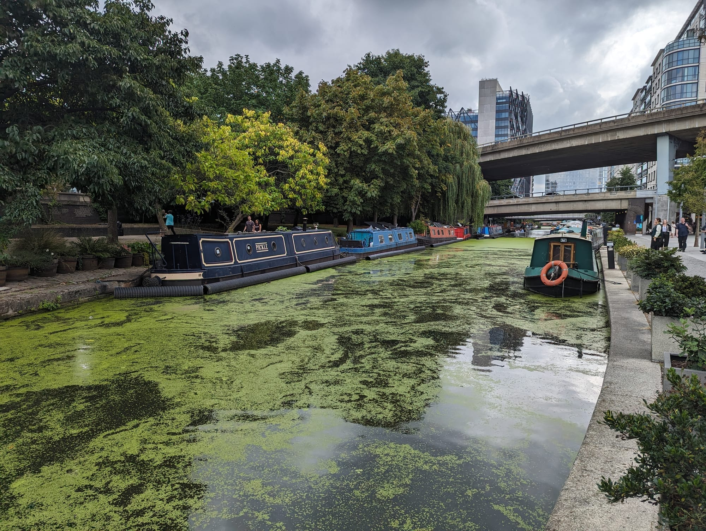

*The Paddington Arm between Little Venice and Paddington Basin, with the Westway overhead. The moorings along here are permanent, which is why the boats look lived-in.*

## The sections, and how long each takes

| Section | Distance | Time | Ends at |
| --- | --- | --- | --- |
| **Little Venice → Camden** | About 2 miles | 45 min | Camden Town |
| **Camden → King's Cross** | About 1.5 miles | 35 min | King's Cross St Pancras |
| **King's Cross → Angel** | About 1 mile | 25 min | Angel *(tunnel detour)* |
| **Angel → Victoria Park** | About 2 miles | 45 min | Hackney Wick or Bethnal Green |
| **Victoria Park → Limehouse** | About 2 miles | 45 min | Limehouse DLR |

---

## Little Venice to Camden

*About 2 miles · 45 minutes · the postcard section*

The pretty one, and the one to walk if you only walk one. Little Venice is where the **Paddington Arm of the Grand Union** meets the Regent's Canal, and the moorings are permanent — these are homes, not visitor berths, which is why they have window boxes and woodsmoke.

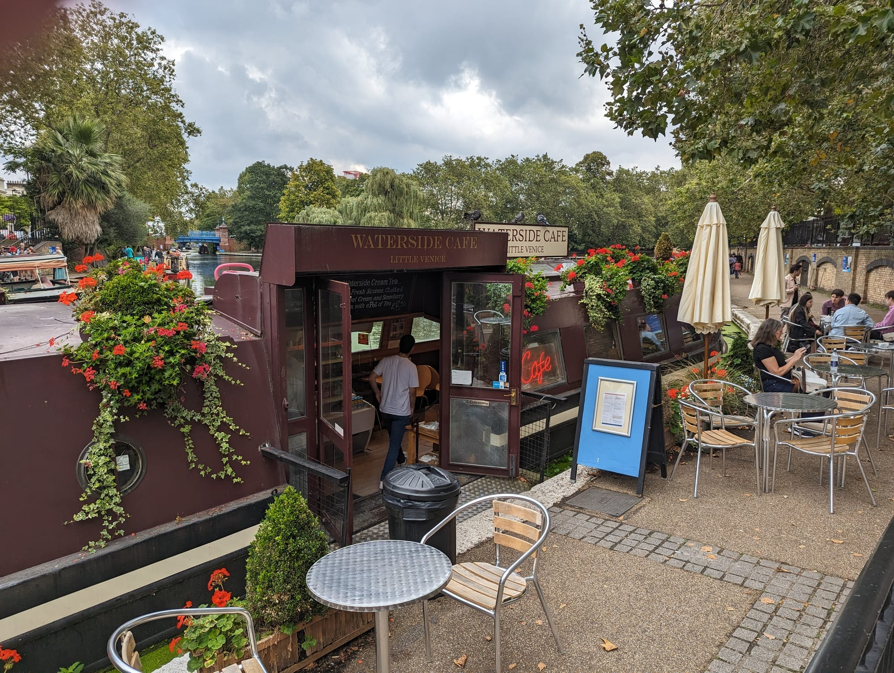

*The Waterside Cafe at Little Venice, which is a narrowboat rather than a building with a view of one.*

Little Venice's moored boats are not all homes and cafes, either — **The BoAt Pod** is a converted narrowboat running as a podcast and DJ studio, bookable by the hour.

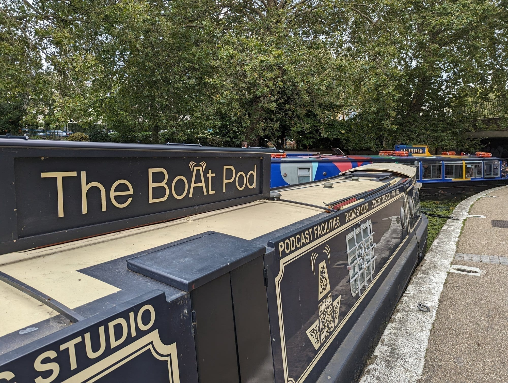

*The BoAt Pod, a working podcast and radio studio on a moored narrowboat at Little Venice.*

From there the canal runs east through **Maida Hill Tunnel**, which you cannot walk through — see the tunnels section below — then along the north edge of **Regent's Park**, past the **aviary at London Zoo**, and into Camden.

**The zoo stretch is the surprise.** The towpath runs directly beneath the Snowdon Aviary, and you get a free look at part of the zoo from the water.

**Finish at Camden Lock**, where the canal drops through a double lock in the middle of the market. See our [Camden guide](/articles/camden-area-guide/).

---

## Camden to King's Cross

*About 1.5 miles · 35 minutes · gasholders and grain stores*

Quieter immediately after Camden, and it improves the whole way. The canal runs behind St Pancras through what was the goods yard of the entire railway age, and is now **Coal Drops Yard** and **Granary Square**.

**St Pancras Lock** and the restored **gasholders** are the set piece. **Camley Street Natural Park** sits on the towpath here — a free two-acre nature reserve wedged between the canal and the railway, which almost nobody walking to King's Cross knows is there.

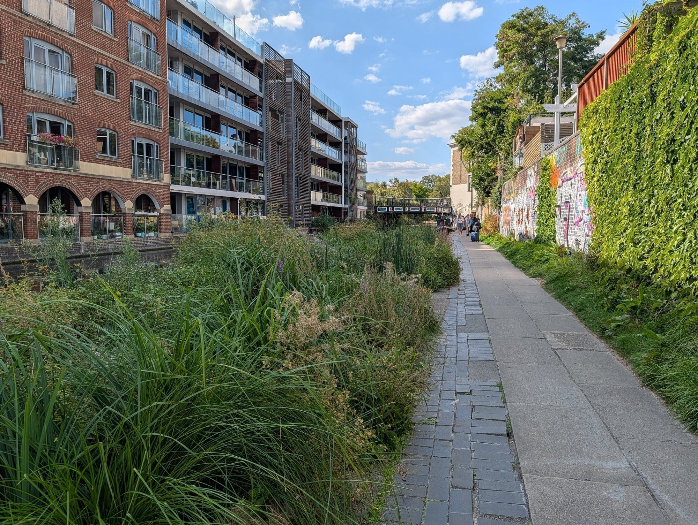

*The towpath by Camley Street, planted rather than mown — the reserve's influence spreads along the bank well beyond its own gate.*

More in our [King's Cross guide](/articles/kings-cross-area-guide/) and [hidden London](/articles/hidden-london-secret-places/).

---

## King's Cross to Angel, and the tunnel problem

*About 1 mile · 25 minutes · then a detour*

A short, pleasant stretch past **Battlebridge Basin** — where the London Canal Museum sits, in a Victorian ice warehouse — before the canal disappears underground.

> ⚠️ **Islington Tunnel has no towpath.** At **960 yards it is the longest canal tunnel in London**, opened in 1818, and there has never been a path through it. Boats were originally **legged** through — crew lying on their backs, walking the tunnel roof — until a steam tug on a chain took over in 1826.
>
> **Walkers go over the top.** The pavements above are waymarked so the two halves of the towpath connect. It is about fifteen minutes through Islington's back streets, and you rejoin at the east portal near City Road Lock.

---

## Angel to Victoria Park

*About 2 miles · 45 minutes · the one Londoners walk*

This is where the canal stops being pretty and starts being interesting. Warehouse conversions, boatyards, moored liveaboards, and some of the best **canalside graffiti** in London — a continuously repainted wall that changes month to month.

You pass **Kingsland Basin** and **Broadway Market** — worth leaving the canal for on a Saturday — then reach **Victoria Park**, which is the largest and best of east London's parks.

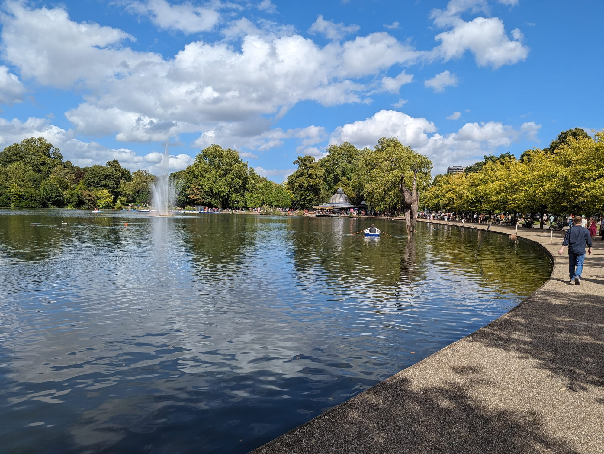

*Victoria Park's boating lake, a few minutes off the towpath and worth the detour.*

> **The Hertford Union Canal** branches off here — a mile and a quarter along the south edge of Victoria Park to the **River Lea** at Hackney Wick. Take it if you want the Olympic Park, the Lea Valley, or the canalside bars.

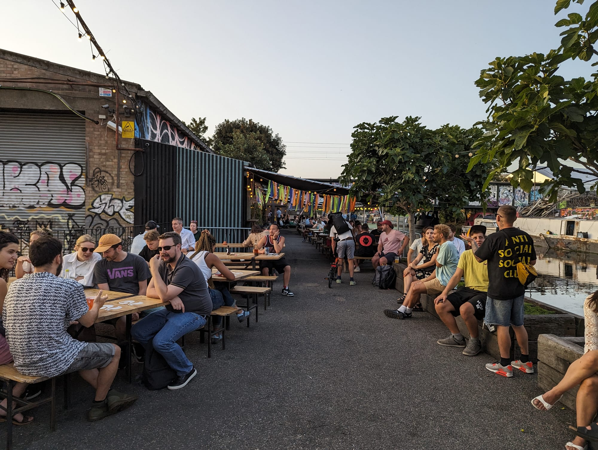

*Hackney Wick, where the Hertford Union meets the Lea. The warehouses along here are now breweries and bars, and the terraces run right down to the water.*

---

## Victoria Park to Limehouse

*About 2 miles · 45 minutes · the best finish*

The final run, and the most varied. The canal turns south through **Mile End Park**, a long thin park built along the water on former bomb-damaged ground.

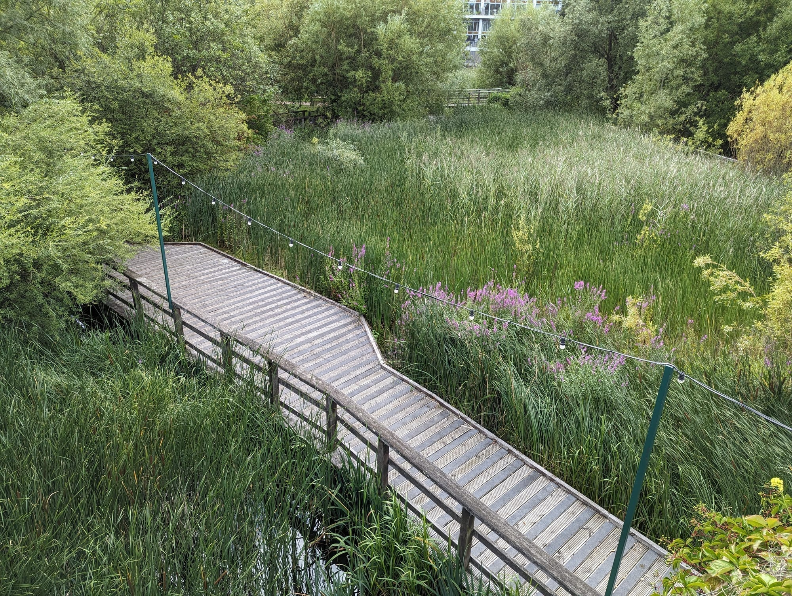

*The ecology park boardwalk in Mile End Park, a few metres off the towpath and almost always empty.*

The reeds and lakes here belong to **the Ecology Pavilion**, a Tower Hamlets events venue — the building itself is only open to the public during a hired event, but the wetland boardwalk around it is free and open at all times. Further along, **the Art Pavilion** does the same trick with a different material: a gallery space built low into the bank with a glass wall onto its own small lake, easy to miss because it too is closed except when an exhibition is on.

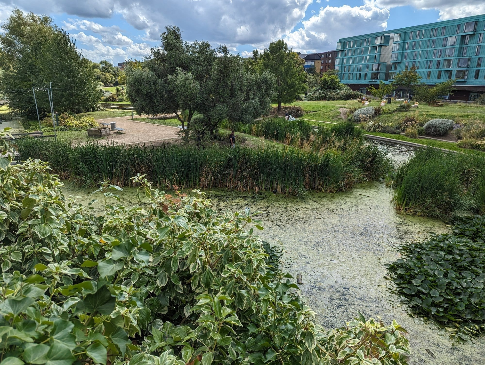

*The Art Pavilion's own small lake. The gallery building sits just out of frame to the left, closed except when an exhibition is on.*

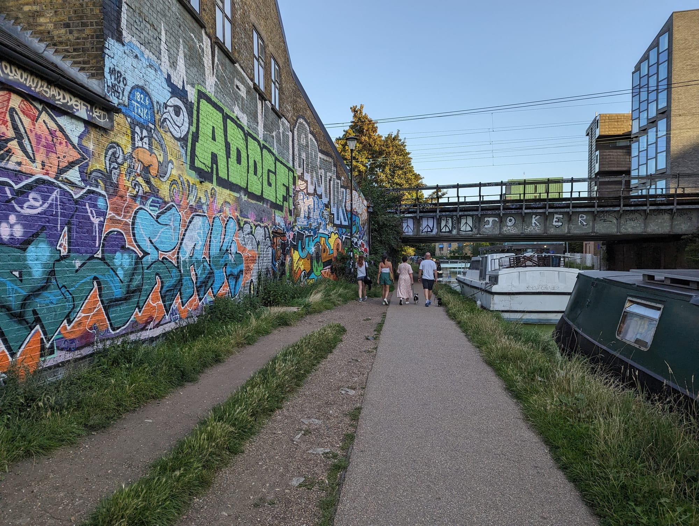

*The towpath at Bow, narrowing between a graffiti wall and the moorings. This stretch is repainted constantly.*

**The Green Bridge** is the thing to look for — a bridge carrying the park itself, planted with trees, over the four lanes of Mile End Road. You walk through a park and only afterwards realise you crossed a main road.

Then the towpath tightens into its best stretch: low bridges, tunnels under the streets, and the light changing every hundred yards.

**It ends at Limehouse Basin**, where the canal locks down into the Thames. Once the busiest freight interchange in London, now a marina ringed with apartments, with masts and narrowboats side by side.

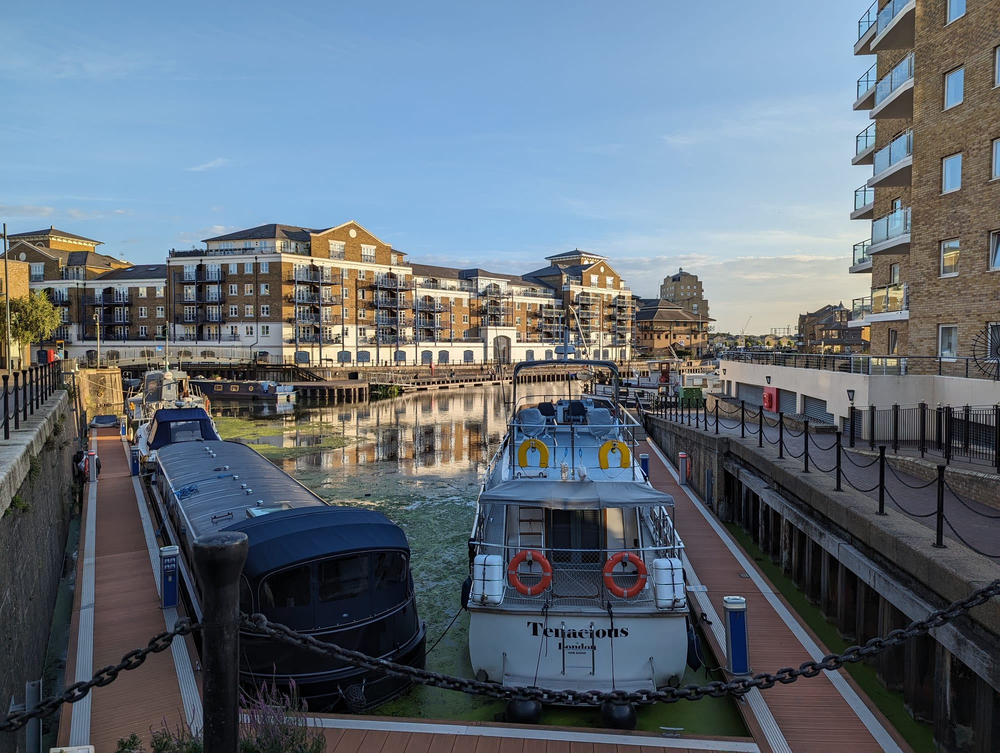

*Limehouse Basin, where the Regent's Canal meets the Thames. The lock down to the river is at the southern corner.*

**Limehouse DLR** is two minutes away, and Canary Wharf is one stop.

---

## The Paddington Arm and west London

*Little Venice → Paddington Basin, about a mile*

A short spur west from Little Venice into **Paddington Basin**, which is entirely modern and much better than that sounds — a stepped amphitheatre down to the water, floating restaurants, and the two moving footbridges.

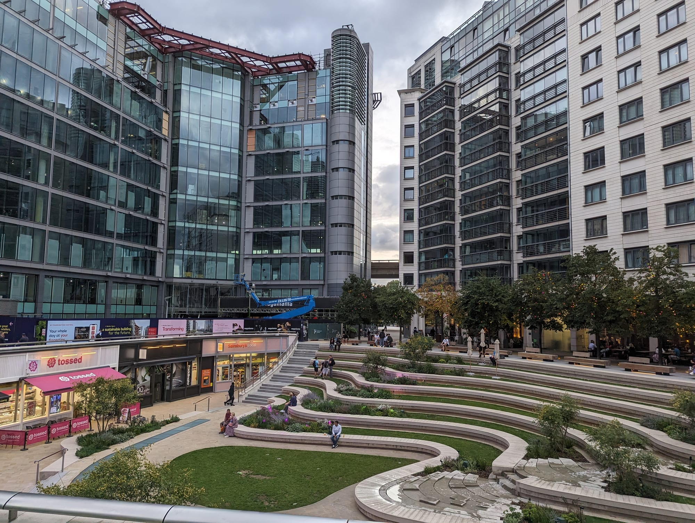

*Merchant Square at Paddington Basin. The steps are a good place to sit and the water is busier with boats than it looks.*

**Darcie & May Green**, a pair of narrowboats designed by the pop artist Sir Peter Blake, are moored right outside the station — Darcie does all-day dining, May Green does coffee and cocktails from a rooftop terrace.

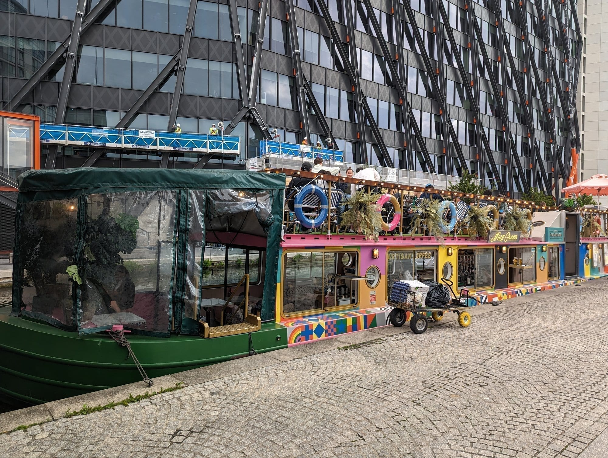

*May Green's rooftop terrace, moored outside Paddington station. Sir Peter Blake, who designed the Sgt. Pepper's cover, painted both boats.*

Keep going west and the **Grand Union Canal** runs all the way out through Kensal Green, Wormwood Scrubs and Alperton, eventually reaching Birmingham. The London stretches are quiet, green and almost entirely unvisited.

See our [Paddington guide](/articles/paddington-area-guide/).

---

## The two tunnels, and what to do about them

Both have **no towpath**. This is the single most useful thing to know before setting out, and most guides do not mention it.

| Tunnel | Length | What walkers do |
| --- | --- | --- |
| **Islington Tunnel** | 960 yards | Leave the canal at Muriel Street, follow waymarked streets over the top, rejoin near City Road Lock. About 15 minutes |
| **Maida Hill Tunnel** | 272 yards | Short detour up to Aberdeen Place and back down. About 5 minutes |

There is a third, **Eyre's Tunnel**, at just 53 yards near Lisson Grove — short enough that the diversion is barely noticeable.

---

## What it costs

**Nothing.** The towpaths are public, open at all hours, and managed by the Canal & River Trust. This is the cheapest good day out in London.

* **The walking is free**, and so are Victoria Park, Mile End Park, Camley Street Natural Park and Regent's Park.
* **Canal boat trips** run Little Venice to Camden in season, which is the lazy version of the first section.
* **The London Canal Museum** at Battlebridge Basin charges a modest admission and explains the ice trade the building was built for.
* **Food is where you spend.** Camden Lock, Broadway Market, Hackney Wick and Granary Square are all on or beside the towpath. See [cheap eats](/articles/cheap-eats-london/) and [best markets](/articles/best-london-markets/).

Powered by <a target="_blank" rel="sponsored" href="https://www.getyourguide.com/london-l57/">GetYourGuide</a>

---

## What to know before you go

* **The towpath is shared with cyclists.** Pedestrians have priority, but the path is narrow and blind under bridges. Cyclists should ring and pass slowly; walkers should not spread across the full width.
* **It floods and it gets slippery.** The surface is unsealed in places, and after rain the stretches through Mile End and Hackney turn to mud.
* **There is no lighting on most of it.** The towpath is not lit outside the central sections, so it is a daylight walk in winter.
* **Every section ends at a station**, which is what makes the canal so easy to walk in pieces. You never have to come back the way you came.
* **Do not step onto moored boats or untie anything.** They are homes.
* **The canal is deep, cold and steep-sided.** There are life rings at intervals for a reason, and it is no place to swim.
* **Bridges are numbered**, which is the easiest way to work out where you are — the numbers count up from Little Venice.

---

## Continue planning your London trip

- 🚶 **[London Walks Along the Thames](/articles/london-walks-along-the-thames/)**
- 🌳 **[Best Parks and Gardens in London](/articles/best-parks-gardens-london/)**
- 🎨 **[London Street Art](/articles/london-street-art/)**
- 🏘️ **[Camden Area Guide](/articles/camden-area-guide/)**
- 🚉 **[King's Cross Area Guide](/articles/kings-cross-area-guide/)**
- 🕵️ **[Hidden London](/articles/hidden-london-secret-places/)**
- 🎪 **[Free Things to Do in London](/free/)**

---

*Distances are approximate and measured along the towpath. Check the Canal & River Trust for towpath closures before a long walk — sections close for maintenance without much notice.*
