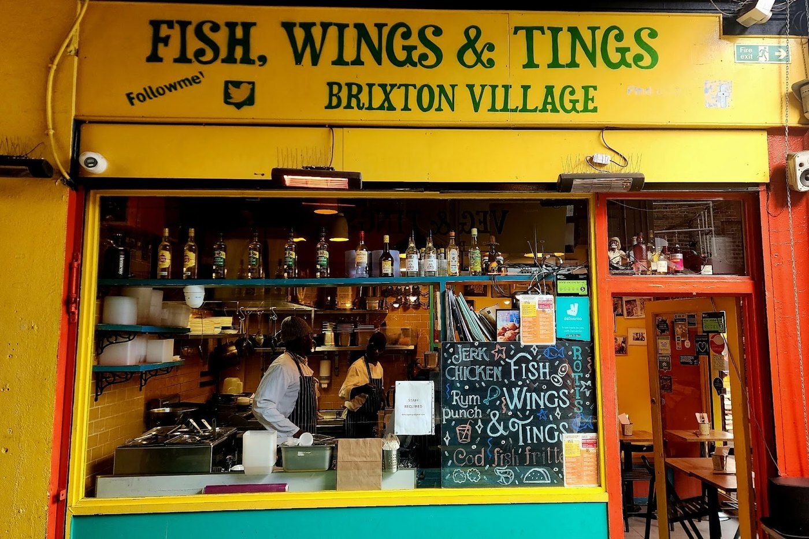
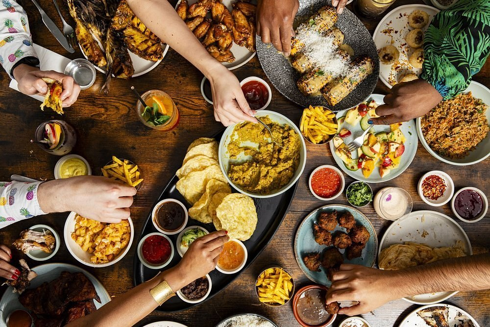
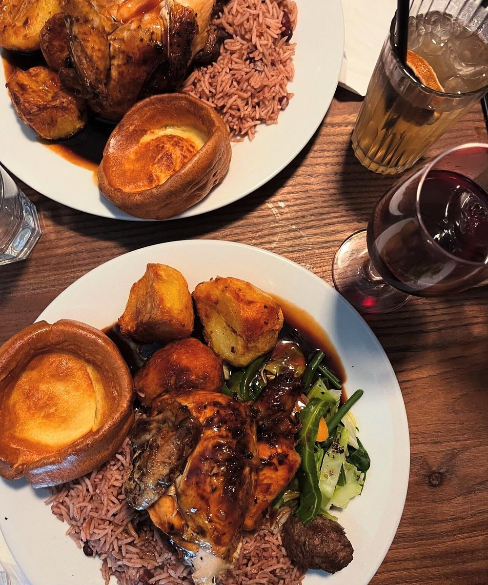
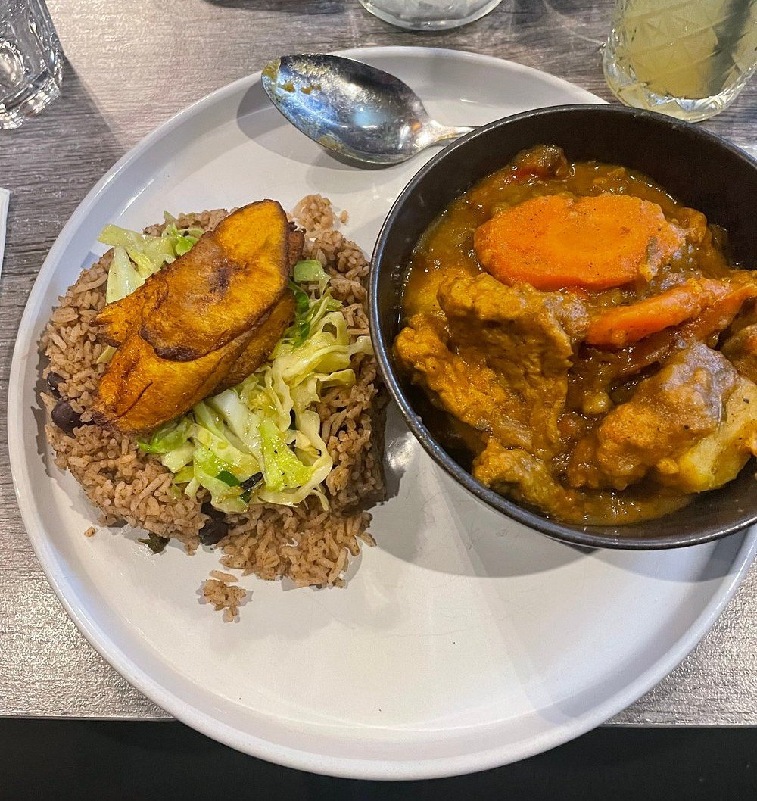

Ask the internet where to eat Jamaican food in London and it will answer with Caribbean guides. That is not a search engine failing — it is the writers being right. **The serious sources on this subject cover the islands together and separate them inside the piece**, because Trinidadian roti, Guyanese stews and Jamaican jerk are different cooking that happens to share a sea.

There is a second thing the published lists get wrong, and it is bigger. **They cover restaurants.** The most thorough source in this pass — a food blog with its own photographs — names caterers, food trucks, jerk drums, a tuck shop and a café inside the Peckham bus garage, and roughly two dozen of its entries appear in no magazine anywhere.

> 💡 **The Short Version:** **Fish, Wings & Tings** in Brixton Village is named by seven sources, more than anything else. **Limin** on the South Bank is six. **Jam Delish** is entirely vegan and named by five. **Ewart's** in Dalston is barely covered by magazines and heavily covered by everyone else. The best of this scene is as often a counter as a dining room.

> 📊 **The evidence behind this guide.**
> Nothing here rests on one visit. This pass reads **13 independent sources carrying 141 citations** across **83 named venues**. **25 are named by two or more sources.**
> **Built on:** seven mastheads, three independent writers and three YouTube channels — counted per creator, so a channel's five videos are one voice. No judged award is counted here.
> *Evidence built 8 September 2026 · [How we rank →](/how-we-rank/)*

## Where they are

| If you are near… | Where to eat |
| --- | --- |
| **Brixton** | Fish, Wings & Tings, Danclair's Kitchen, Veg and Tings, Maureen's |
| **South Bank & Waterloo** | Limin |
| **Deptford** | Buster Mantis |
| **Islington & Angel** | Jam Delish |
| **Camden & Shoreditch** | Ma Petite Jamaica |
| **Dalston** | Ewart's |
| **Stratford, Finsbury Park & Shepherd's Bush** | Roti Joupa |
| **Herne Hill** | Umana Yana |
| **Peckham** | Soulfood Peckham, the bus garage café |

**Price guide:** **£** under £15 a head · **££** £15–£30 · **£££** £35+.

Brixton and Peckham carry most of this list between them, and Rye Lane is where the groundwork sits: the [Peckham area guide](/articles/peckham-area-guide/) covers the Caribbean grocers, butchers and the sixty-unit indoor market that the cooking here comes out of.

---

## The most-cited

### Fish, Wings & Tings — a Brixton Village counter, since 2012

*£ · Brixton Village, Coldharbour Lane, SW9 8PR · Cited by 7 sources*

*The counter in Brixton Village. The board carries more than the Trinidadian snacks - jerk chicken, rotis, cod fish fritters and rum punch.*

**Brian Danclair**, born in Trinidad, opened it in 2012, and it has become a community fixture as much as a restaurant — seven sources name it, more than anything else in this pass, and two of them are YouTube channels rather than magazines.

The cooking is **Trinidad and Tobago street food**. Order **doubles** — fried flatbreads called baras, topped with spiced chickpeas — and **aloo pie**, fried pastry filled with spiced potato. It is a market counter rather than a dining room, so expect to eat close to other people.

Danclair runs two more in the same market: **Danclair's Kitchen**, named by four sources, and **Veg and Tings**, which takes the same Trinidadian menu plant-based.

### Limin — from a Spitalfields pop-up to the river

*££ · Gabriel's Wharf, South Bank · Cited by 6 sources*

*To lime is to hang about with people, unhurried, usually over food. The restaurant is named for it and this is the argument for the name.*

**Sham Mahabir started Limin' as a pop-up in Spitalfields market**, and it did well enough to become permanent on the edge of the Thames at Gabriel's Wharf. The menu runs off his Trinidadian heritage and his London life rather than either alone.

**Freetas** — split pea fritters with spinach — and **Trini puri** are the things to order. It is the most central and the easiest to get to of the well-cited places, which is worth something on a subject spread this far across the city.

### Buster Mantis — under the arches, half of it an arts space

*££ · Deptford · Cited by 5 sources*

*The Sunday roast, and it is a Caribbean one: jerk chicken over rice and peas, with the Yorkshire pudding kept. This is the 1.30pm sitting, the only one on a Sunday.*

In the **railway arches beside Deptford station**, and only half of it is a restaurant: one side is a bar and kitchen, the other a **creative arts space running exhibitions, screenings and events**.

Independent and family-run, with owners who split their time between Jamaica and southeast London. It describes itself as a bar, restaurant and nightclub, and the hours bear that out: **closed Monday to Wednesday**, open Thursday from 6pm, Friday and Saturday until 2am, and Sunday 1.30pm to 6pm only for the roast. It takes bookings.

### Jam Delish — entirely vegan, and five sources agree

*££ · Islington · Cited by 5 sources*

*The curry with rice and peas, plantain and cabbage. There is no goat in the curry goat, and you would have to be told.*

A **100% vegan** Caribbean restaurant and cocktail bar, and the strength of its citation count is the point: this is not a token entry, it is one of the five best-covered Caribbean rooms in London.

**BBQ jerk plantain**, buttermilk oyster mushrooms with a spicy plantain ketchup, and a curry "goat" that contains no goat. Time Out names it their pick for vegan Caribbean outright.

It takes bookings, which most of this page does not, and delivers through all three of the major platforms — so it is also the entry here you can eat without going anywhere.

### Ma Petite Jamaica — London's first Caribbean diner

*££ · Camden and Shoreditch · Cited by 4 sources*

Two sites, cosy and brightly coloured, built on **jerk chicken and rum cocktails** with sweet potato and pumpkin fritters alongside. It bills itself as London's first Caribbean diner.

**This is the one to pick if you want a table rather than a counter** — and the only entry here with a branch in both north and east London, so it is reachable without crossing the city, which most of this page is not. Both rooms are small, so a group of more than four should call ahead.

### Ewart's — the one the magazines have missed

*£ · Dalston · Cited by 4 sources*

Four sources name it and **only one is a masthead** — the rest are a food blog and two YouTube channels. That distribution is the entry: this is a place the community has been documenting while the magazines have not caught up.

**It is a smoking drum in the middle of Gillett Square**, not a dining room - The Infatuation describes reggae and the cracking of tinnies as the permanent soundtrack, and the smoke off the drum as the smell of the place. **Jerk chicken** is what it does, there are no tables of its own, and it is walk-in only because there is nothing else it could be.

### Maureen’s — a home kitchen run as a restaurant

*£ · 52 Railton Road, Brixton, SE24 0LF · Cited by 3 sources*

**Maureen runs her Brixton home kitchen as a Jamaican restaurant**, and it is a takeaway operation rather than a room with tables - which is the single thing to know before walking down Railton Road expecting to sit.

The fried chicken is what people write about: golden, jagged, and seasoned in a way none of the sources will commit to explaining. Drumsticks and thighs, stripped to the bone. **Walk-in and takeaway only** - there is no dining room, so plan to eat it somewhere else.

### Roti Joupa — Trinidadian roti, three branches

*£ · Stratford, Finsbury Park and Shepherd's Bush · Cited by 4 sources*

**Time Out's pick for Trinidadian cooking**, and one of the few places on this page you can reach in several parts of London — Holloway, Shepherd's Bush and Stratford.

The range runs from **channa-packed baras** through rotis The Infatuation calls newborn-sized to wedges of **macaroni pie** with sweet tamarind sauce poured over. Prices are low even by the standards of this page.

**It is a takeaway operation, walk-in only**, and good for eating alone — there is nowhere to linger. **Roti Stop**, named by four sources as well, is the other name to know for the same food.

---

Powered by <a target="_blank" rel="sponsored" href="https://www.getyourguide.com/london-l57/">GetYourGuide</a>

## By island, because they are not one cuisine

The sources divide this way and so should a reader. Every one of the serious guides writes "Caribbean" in the title and then separates the islands inside.

**Trinidadian** is disproportionately well represented at the top of the list — Fish, Wings & Tings, Limin, Roti Joupa and Roti Stop are all Trinidadian, which is not what people expect from a subject they assume is Jamaican.

**Jamaican** is the largest strand by volume: Ma Petite Jamaica for a dining room, Ewart's and Maureen's for jerk, Buster Mantis for a family kitchen with a Jamaican connection.

**Guyanese** has a clear address — **Umana Yana in Herne Hill**, which Time Out picks for exactly that.

**Vegan** cuts across all of them, with Jam Delish in Islington and Veg and Tings in Brixton Village.

---

## The part the restaurant lists miss

A guide built only on magazines describes a dining scene. The actual one includes a great deal that never gets a review.

The most thorough source in this pass runs to thirty-nine names and around two dozen appear nowhere else: **Jay Dees Catering, Crystal Caterers, Sunvalley Jerk, Jerk in Da Park, Cool Runnings Jerk Centre, Bokit'la, Rainbow Cook Out, Mum's Caribbean Takeaway, a Jamaican tuck shop, and a café inside the Peckham bus garage.**

These are caterers, food trucks, drums on a pavement and counters with no seats. They are not lesser versions of the restaurants — for a lot of this food they are the normal form of it, and the reason to know they exist is that turning up expecting a table is the mistake.

If that is the form you want, two other guides carry it further. [The best street food in London](/articles/best-street-food-london/) compares every multi-trader market, food hall and container yard on traders, seating and — the part that actually decides your afternoon — which days each one exists. And [cheap eats in London](/articles/cheap-eats-london/) is the same under-£15 territory across every other cuisine in the city, which is where most of the counters on this page would sit if they were not Caribbean.

*Evidence built 8 September 2026 from thirteen independent sources. Addresses and dishes are from the sources named against each entry. Takeaway counters and market stalls change hours more often than restaurants do — check before travelling.*
