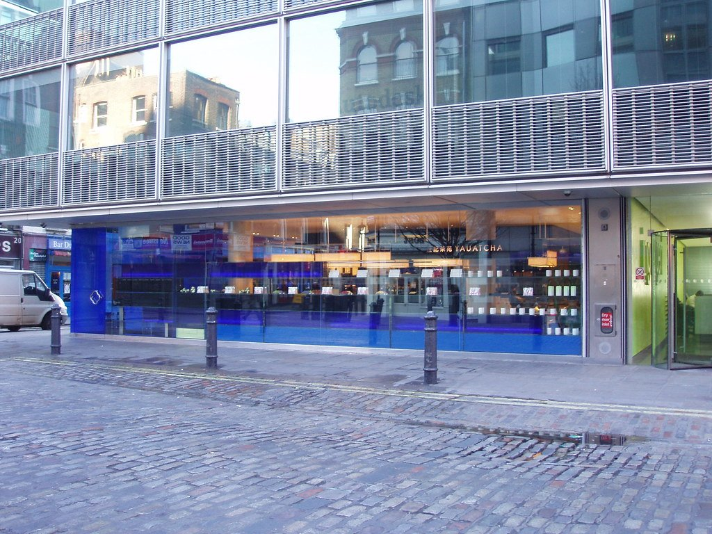
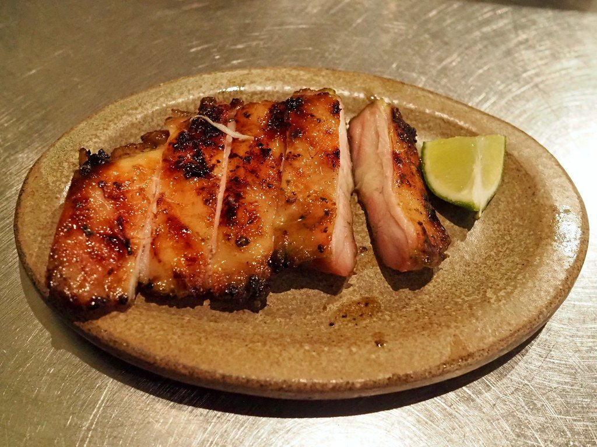

"Chinese food" covers more ground in London than any other label on this site. A two-starred kitchen in Victoria working through the whole country, a Sichuan room on Frith Street, Uyghur cooking in Walthamstow and a strip of Korean grills in New Malden are not variations on one cuisine — they are separate cuisines that a menu convention files together.

So this guide keeps them apart, and counts each against its own sources rather than blending them.

> 💡 **The Short Version:** **A. Wong** is the only Chinese restaurant in London with a Michelin star, and it has two. **Tao Tao Ju**, **Plum Valley**, **Four Seasons**, **Murger Han** and **Etles** are the most-cited after it. **Kiln** and **AngloThai** lead the Thai list. **Jin Go Gae** and **Imone** lead the Korean one. And **Xi'an Impression** does the best £5 in London.

> 📊 **The evidence behind this guide**
> Nothing here is ranked on one visit. This page reads three separate corpora, because these are three separate cuisines: **Chinese — 13 sources, 206 citations across 112 restaurants, 46 named twice or more**; **Thai — 13 sources, 130 citations across 68 restaurants, 18 named twice or more**; **Korean — 10 sources, 132 citations across 85 restaurants, 19 named twice or more**. Every count printed below comes from the venue's own cuisine, never from another.
> **The known weakness in this topic:** almost no judged evidence, and very few independent voices. Across all three cuisines, **four restaurants hold a Michelin star and nothing else here has been judged by anybody**. The Chinese corpus in particular is thirteen source records but only **seven independent publications** — Time Out, The Infatuation and SquareMeal each publish several London Chinese guides, and they count once each. There is no Good Food Guide selection for Chinese food, no equivalent of the Asian Curry Awards, and no usable video tier: of twenty-two London Chinatown videos checked, not one carried chapter markers naming the restaurants.
> *Evidence rebuilt 30 August 2026 · [How we rank →](/how-we-rank/)*

## Where they are

| If you are near… | Where to eat |
| --- | --- |
| **Chinatown** | Tao Tao Ju, Plum Valley, Four Seasons, Wong Kei, Speedboat Bar, Chinatown Bakery, Bun House, Dumplings' Legend |
| **Soho** | Barshu, Yauatcha, Kiln, Noodle & Beer, Olle |
| **Mayfair & Belgravia** | Kai Mayfair, Canton Blue |
| **Victoria & Pimlico** | A. Wong, Hunan, Shan Shui Social |
| **Marylebone & Fitzrovia** | Royal China, AngloThai |
| **Covent Garden** | Din Tai Fung, Dim Sum Library |
| **The City & Aldgate** | Murger Han, Dream Xi'an |
| **Queensway & Paddington** | Mandarin Kitchen, Gold Mine, Pearl Liang |
| **King's Cross & Bloomsbury** | Dim Sum & Duck, Master Wei |
| **North London** | Xi'an Impression (Holloway), Etles (Walthamstow) |
| **Shoreditch & Hackney** | Smoking Goat, Miga, Facing Heaven |
| **South London** | Dragon Castle, Kolae, Silk Road (Camberwell) |
| **New Malden** | Jin Go Gae, Imone, Cah Chi |

**Price guide:** **£** under £15 · **££** £15–£35 · **£££** £40–£70 · **££££** £90+.

---

## The most-cited Chinese restaurants

### A. Wong, Victoria

*££££ · 7 min from Victoria · Cited by 4 sources · Two Michelin stars, 2026*

**The only Chinese restaurant in London holding a Michelin star**, and it holds two. Three others appear in the guide's current table without a 2026 star: Hakkasan Mayfair, Kai Mayfair, and Hakkasan Hanway Place, which has closed.

Andrew Wong works through the regional cooking of the whole country rather than settling into Cantonese. The dim sum lunch is the cheaper way in and covers the same kitchen.

### Tao Tao Ju, Chinatown

*£££ · 2 min from Leicester Square · Cited by 4 sources*

Towering bamboo baskets of steamed and grilled dim sum, made fresh on site each day — the refined end of Chinatown, and the most-cited dim sum room in the city.

### Plum Valley, Chinatown

*£££ · Gerrard Street · Cited by 4 sources*

The black-fronted Gerrard Street room, and one of the four most-cited Chinese restaurants in London. Named by every masthead in this corpus and by none of the cheap-eats guides, which tells you roughly what to expect.

### Four Seasons, Bayswater

*££ · 84 Queensway · also Chinatown and Colindale · Cited by 4 sources*

**London's benchmark Hong Kong-style roast duck**, and the Queensway room is the original — the business started here in 1990 before it ever reached Chinatown.

There are now Chinatown sites and a counter in the **Bang Bang Oriental** food hall at Colindale, which is the cheapest way to eat the duck.

### Murger Han, City of London

*££ · Cited by 4 sources*

Shaanxi cooking in the City — the *rou jia mo* meat bun that gives the place its name, plus hand-pulled noodles. Four sources and almost no tourist traffic.

### Etles, Walthamstow — Uyghur

*££ · 235 Hoe Street · closed Mondays · Cited by 4 sources*

**Uyghur cooking from Xinjiang** — a Turkic-Chinese tradition with cumin, lamb and hand-pulled laghman noodles that is barely represented anywhere else in Britain.

Husband-and-wife run, and unlike anything in Chinatown. The most-cited restaurant in this guide that is not in Zone 1.

---

## Regional Chinese

Most of London's Chinese food is Cantonese. These kitchens are not, and the difference is the whole reason to seek them out.

### Barshu, Soho — Sichuan

*£££ · 28 Frith Street · Cited by 3 sources*

The restaurant that introduced London to real Sichuan cooking in 2006 — numbing peppercorn, chilli oil, dry-fried beans — when the city still thought Chinese meant Cantonese. Fragrant chicken buried in a pile of dried chillies, and seabass with Sichuan pickles in golden soup. The heat markings are honest.

Written both **Barshu** and **Bar Shu** by different guides. One restaurant.

### Xi'an Impression, Holloway — Shaanxi

*£ · 117 Benwell Road · BYOB · no bookings · Cited by 3 sources*

**Shaanxi cooking** from China's north-west, opposite the Emirates Stadium — hand-pulled **biang biang noodles**, cold liangpi noodles, and a **Xi'an beef bun for around £5**.

BYOB, no bookings, and one of very few kitchens in Britain cooking this province at all. Guides routinely file it under Highbury; it is Holloway.

### Master Wei, Bloomsbury — Shaanxi

*££ · 13 Cosmo Place · Cited by 3 sources*

The same tradition from **Guirong Wei**, who was the only female head chef in Xi'an before she came to London and set up Xi'an Impression — this is her own restaurant.

**Best Newcomer at the OFM Awards in 2019**, and biang biang noodles at around £10.

### Hunan, Pimlico

*££££ · 6 min from Sloane Square · Cited by 3 sources*

**No menu at all.** You say what you dislike and dishes keep arriving until you stop them. Hunanese cooking, and one of the most unusual ways to eat in London at any price.

### Noodle & Beer, Chinatown — Sichuan

*££ · 27 Wardour Street · kitchen to 4am · Cited by 2 sources*

Sichuan cooking built for the small hours — **the kitchen runs to 4am Thursday to Saturday**, which makes it one of the genuinely late options in the centre.

### Rasa Sayang, Chinatown — Malaysian-Peranakan

*££ · 5 Macclesfield Street · Cited by 3 sources*

**Peranakan cooking** — Chinese technique with Malay spicing — and reportedly the only halal restaurant in Chinatown. Nasi lemak and Singapore chilli crab. Named by three Chinese-guide sources despite not being Chinese, which is what Chinatown listings do.

### Mandarin Kitchen, Queensway — Cantonese seafood

*£££ · 14–16 Queensway · Cited by 1 source*

The **lobster noodles** are the reason: a whole lobster over ginger and spring onion noodles, and the dish most London Chinese restaurants are measured against. Big round tables, built for groups.

### Gold Mine, Queensway — Cantonese roasts

*££ · walk-in · Cited by 1 source*

Roast duck hanging in the window and carved to order, cheaper than Chinatown for the same thing. Duck sells out; go early evening.

---

## Dim sum

### Dim Sum Library, Covent Garden

*£££ · Cited by 3 sources*

The most-cited dim sum room outside Chinatown, and the one that reads as a restaurant rather than a hall.

### Dim Sum & Duck, King's Cross

*££ · Cited by 3 sources*

Dim sum and Cantonese roast meats in one small room, at prices the West End does not do.

### Pearl Liang, Paddington

*£££ · Cited by 3 sources*

Behind Paddington station, in a development most people walk past — a full dim sum service at a fraction of the Mayfair rate.

### Bun House, Chinatown

*£ · Cited by 3 sources*

Steamed bao from a narrow Chinatown shopfront, and the cheapest thing in this section by a distance.

### Royal China, Marylebone

*£££ · 8 min from Bond Street · Cited by 1 source*

A black-and-gold banquet hall on Baker Street where weekend dim sum runs at the volume of an airport terminal. No bookings at peak.

### Dragon Castle, Elephant and Castle

*££ · 114 Walworth Road · Cited by 1 source*

South London's proper dim sum hall, at roughly half the central mark-up, and served **through the day** rather than only at lunch.

### Yauatcha, Soho

*£££ · all-day · Cited by 2 sources*

All-day dim sum with a patisserie counter downstairs, from the Hakkasan founder. It held a Michelin star for several years and does not appear in the guide's current table.

*Dim sum served all day under a fish tank, plus a patisserie counter that is a separate business in spirit. Photo: [Ewan-M](https://www.flickr.com/photos/55935853@N00/2255139672), [CC BY-SA 2.0](https://creativecommons.org/licenses/by-sa/2.0/).*

---

## The Chinatown institutions

### Wong Kei, Chinatown

*££ · 41–43 Wardour Street · Cited by 3 sources*

One of the largest Chinese restaurants in Britain at around five hundred covers, and for decades famous less for the food than for the rudeness of the service.

**That reputation is a period piece.** The room was refurbished in 2001 and changed hands in 2014, and what you get now is brisk and impersonal rather than hostile. Char siu, roast duck and stuffed bean curd, fast.

### Chinatown Bakery, Newport Place

*£ · Cited by 3 sources*

Egg tarts, bolo bao and taiyaki made in the window, at bakery prices. Named by three independent sources, which is more than most sit-down restaurants on this page manage.

### Dumplings' Legend, Chinatown

*££ · 15–16 Gerrard Street · Cited by 2 sources*

A glass-walled dumpling kitchen on Gerrard Street where you watch the **xiao long bao** being folded. Open since 2010 and still the most watchable thing on the street.

### Din Tai Fung, Covent Garden

*£££ · Cited by 2 sources*

Xiao long bao folded to eighteen pleats behind glass. A chain, and a serious one — but it is Taiwanese rather than Chinese, and priced like Covent Garden.

---

## Thai

*Counted against the Thai corpus — 14 sources, 161 citations — not the Chinese one.*

### Kiln, Soho

*£££ · 3 min from Piccadilly Circus · Cited by 5 Thai sources*

Everything comes off wood and charcoal along a single counter. Sit at the bar and order the **short rib curry**. One of the two most-cited Thai restaurants in London.

*Cooked over live fire in clay pots along an open counter. Sit at the bar and watch it happen. Photo: [Bex.Walton](https://www.flickr.com/photos/7831824@N04/50584857087), [CC BY 2.0](https://creativecommons.org/licenses/by/2.0/).*

### AngloThai, Marylebone

*££££ · 4 min from Marble Arch · Cited by 6 Thai sources · One Michelin star, 2026*

Thai cooking built on British seasonal produce rather than imported substitutes. The idea is in the name, it works better than it sounds, and it is the only Thai restaurant in London with a star.

### Speedboat Bar, Chinatown

*£££ · pool tables · Cited by 4 Thai sources*

Built to feel like a late-night Bangkok Chinatown canteen, with pool tables, and curries good enough that the theming is beside the point. It is also named by three Chinese-guide sources, because of where it sits.

### Kolae, Borough

*£££ · Cited by 4 Thai sources*

Southern Thai charcoal grilling from the Kiln team, and the most-cited of their rooms after Kiln itself.

### Smoking Goat, Shoreditch

*£££ · Cited by 3 Thai sources*

Thai drinking food in a room that behaves like a bar. Same team again, different tradition.

---

## Korean

*Counted against the Korean corpus — 12 sources, 144 citations.*

### Jin Go Gae, New Malden

*£££ · Cited by 4 Korean sources*

Uses **real charcoal rather than gas**, which is why it is the purist's choice, and is named after the Seoul district where the founder met his wife. New Malden has one of the largest Korean communities in Europe, roughly thirty minutes by train from Waterloo.

### Imone, New Malden

*££ · High Street · Cited by 4 Korean sources*

Joint most-cited Korean restaurant in the corpus alongside Jin Go Gae, and the one locals send you to for stews rather than grill.

### Olle, Soho

*£££ · 3 min from Leicester Square · Cited by 3 Korean sources*

Table grills in the middle of Soho — the New Malden format without the forty-minute train.

### Cah Chi, New Malden

*££ · Kingston Road · Cited by 2 Korean sources*

The third of the New Malden three, and the most straightforwardly a neighbourhood restaurant.

### Miga, Hackney

*£££ · Cited by 1 Korean source*

A family kitchen that moved from New Malden to Hackney in 2024 and was named Time Out's best restaurant in London. The **yughwe beef tartare** is the dish. One Korean-guide source names it, which is a gap in the guides rather than in the restaurant.

---

## Best value

Chinese food is where London's cheap eating is strongest, and almost none of it is in a restaurant with tablecloths.

* **Xi'an Impression**, Holloway — a **£5** Xi'an beef bun, and BYOB, so the drinks cost nothing either. *Cited by 3 sources*
* **Chinatown Bakery**, Newport Place — egg tarts and bolo bao at bakery prices. *Cited by 3 sources*
* **Bun House**, Chinatown — steamed bao from a shopfront. *Cited by 3 sources*
* **Kung Fu Noodle**, Chinatown — noodles pulled to order in the window, the cheapest proper cooked meal there. *Cited by 2 sources*
* **Kung Fu Burger**, Shaftesbury Avenue — a kiosk with no seating doing a shredded pork belly bun under a tenner. Cash only. *Cited by 2 sources*
* **Master Wei**, Bloomsbury — biang biang noodles around **£10** from the chef who introduced them to London. *Cited by 3 sources*

### Food halls and supermarkets

* **Bang Bang Oriental**, Colindale — the biggest Asian food hall in Britain, with a **Four Seasons counter** serving the same roast duck as the Queensway restaurant for less.
* **Chinatown's supermarkets** — Loon Fung and See Woo sell roast meats by weight over the counter. Half a roast duck to take away costs a fraction of a sit-down plate.
* **Arcade Food Hall** at Centre Point carries several Chinese and East Asian counters if you want one dish rather than a table.

---

## Also named, with less behind them

Everything else in the Chinese corpus carried by two or more independent publications.

| Venue | Where | Price | Sources | What it is |
| --- | --- | --- | --- | --- |
| **Silk Road** | Camberwell | £ | 2 | Xinjiang cooking in south London — big plate chicken, hand-cut noodles |
| **Facing Heaven** | Hackney | ££ | 2 | Sichuan in a Hackney railway arch |
| **Golden Phoenix** | Chinatown | ££ | 2 | Dim sum through the day, quieter than its neighbours |
| **Chinese Tapas House** | Chinatown | ££ | 2 | Small plates rather than a banquet, which Chinatown does rarely |
| **Cafe TPT** | Chinatown | £ | 2 | Late Cantonese canteen, open past midnight |
| **The Eight** | Chinatown | ££ | 2 | Cantonese, and one of the better-lit rooms on Gerrard Street |
| **Orient London** | Chinatown | £££ | 2 | Four floors, dim sum trolleys at weekends |
| **Dream Xi'an** | Aldgate | ££ | 2 | Shaanxi again, on the eastern edge of the City |
| **Shan Shui Social** | Victoria | £££ | 2 | Cantonese in Nova, near A. Wong and a third of the price |
| **Canton Blue** | Belgravia | ££££ | 2 | The Peninsula hotel's Cantonese room, priced accordingly |
| **Kai Mayfair** | Mayfair | ££££ | 2 | Held a star until recently; still on two guides' lists |
| **Yi-Ban** | Royal Docks | ££ | 2 | Dim sum by the water at the ExCeL end of the DLR |
| **Pochawa Grill** | Chinatown | £££ | 2 | Korean barbecue on the Chinatown grid |

---

## What to know

* **Dim sum is a lunch service** at most traditional halls, finishing around 5pm. Yauatcha and Dragon Castle are the exceptions.
* **Chinatown rewards knowing where you are going** and punishes browsing. Twelve of its addresses are named by two or more independent sources; the rest are not.
* **New Malden is a genuine destination** for Korean food, roughly 30 minutes by train from Waterloo.
* **A. Wong's dim sum lunch** is materially cheaper than dinner and covers the same kitchen.
* **Four restaurants on this page hold a Michelin star**, and nothing else here has been judged by anyone. Read the counts as agreement between critics, not as a verdict.
* **Service charge** of 12.5% is discretionary and standard.

---

## Continue planning your London trip

- 🍽️ **[Eat in London: Restaurants, Food Markets & Quick Food Hub](/articles/eat-in-london-guide/)**
- 💷 **[Cheap Eats in London](/articles/cheap-eats-london/)**
- 🥟 **[The Best Dim Sum in London](/articles/best-dim-sum-london/)**
- 🍛 **[The Best Indian Restaurants in London](/articles/best-indian-restaurants-london/)**
- 🌿 **[Best Vegetarian and Vegan Restaurants](/articles/best-vegetarian-vegan-restaurants-london/)**
- 🍜 **[Soho Area Guide](/articles/soho-area-guide/)**
- 🎭 **[Covent Garden Area Guide](/articles/covent-garden-area-guide/)**
