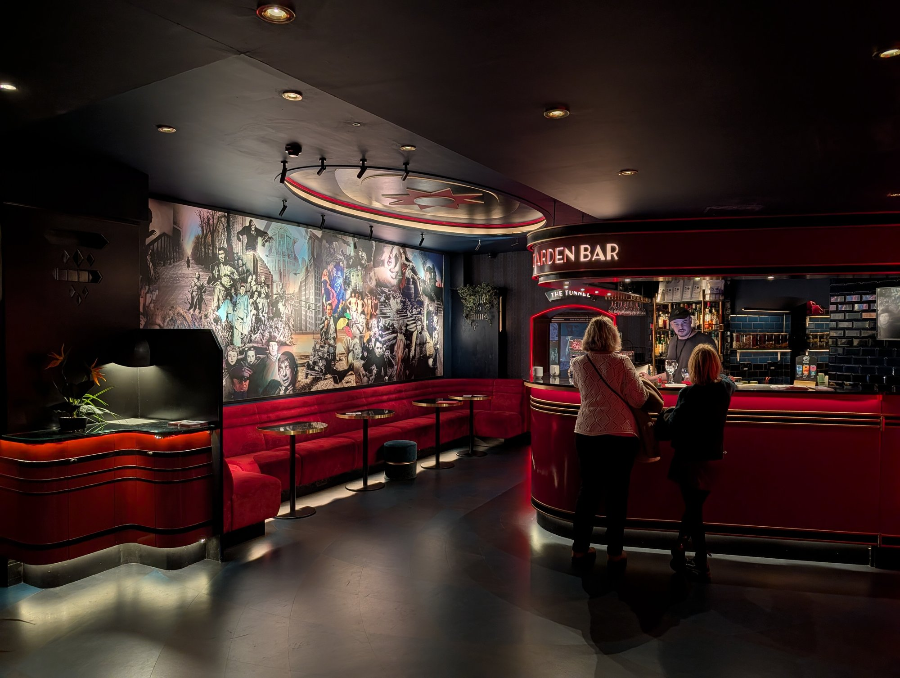

London's independent cinemas are mostly buildings that survived by being useful for something else — a bingo hall, a snooker club, a shoe factory — and were bought back by the people who live around them.

Several are cheaper than the chains, and one is where film was first shown in Britain.

> 💡 **The Short Version:** **The Prince Charles** is the cult cinema of London, with 35mm and all-night marathons. **Regent Street Cinema** is where the Lumières first showed film in Britain in 1896. **Electric Portobello** opened in 1911, is London's oldest purpose-built cinema, and has armchairs, sofas and front-row beds. **Peckhamplex** shows current releases for a few pounds. And **Screen on the Canal** is free.

> 📘 **How we choose these (editorial note)**
> No paid placements. These are drawn from a wide spread of sources rather than any single list - the food and travel press, the big listings sites, independent blogs and specialists, video, and what Londoners recommend themselves - and cross-referenced against each other. No chains, except where a chain operates a genuinely historic building. Programmes change weekly — check the cinema's own listings rather than an aggregator.

## Where they are

| If you are near… | Where to go |
| --- | --- |
| **Leicester Square & Covent Garden** | Prince Charles Cinema, The Garden Cinema |
| **Oxford Circus** | Regent Street Cinema |
| **South Bank** | BFI Southbank, BFI IMAX |
| **Notting Hill** | Electric Portobello |
| **White City** | Electric White City |
| **Hackney & Clapton** | Rio Cinema, The Castle Cinema |
| **King's Cross** | Everyman Screen on the Canal |
| **Peckham** | Peckhamplex, Rooftop Cinema Club |

---

## The famous ones

### Prince Charles Cinema, Leicester Square

*Off Leicester Square*

**The cult cinema of London** — 35mm and 70mm prints, quote-alongs, sing-alongs and all-night marathons, with a membership that pays for itself in about two visits.

The programming is the point: this is where you see *The Thing* at midnight, not a new release.

### Regent Street Cinema, Oxford Circus

*Since 1896*

Where the **Lumière brothers' Cinematographe had its first British showing in 1896** — the birthplace of cinema in Britain, still operating as one.

### Electric Portobello, Notting Hill

*191 Portobello Road, W11 2ED · opened 1911*

**London's oldest purpose-built cinema**, opened on **27 February 1911** with **564 seats**. The first thing shown on the screen was a twenty-minute silent film of Henry VIII starring Sir Herbert Tree — **a film now lost, with no known copy anywhere**.

It is older than the Phoenix, and it has been closed and reopened so many times that the Phoenix keeps the "continuously operating" title. The real sequence is worth knowing, because most guides compress it into "closed twice":

* Became the **Imperial Playhouse** in 1919, and by the 1960s was the local fleapit.
* Reborn in the 1970s as the Electric Cinema Club, west London's answer to the National Film Theatre.
* **Closed 31 October 1983** with a Powell and Pressburger double bill.
* Reopened five months later as the Electric Screen, then **closed again in May 1987** despite a 10,000-signature campaign backed by Audrey Hepburn, Anthony Hopkins and Julie Christie.
* **Reopened in September 1993** as a centre for Black independent cinema, funded by Choice FM and The Voice.
* Closed once more, and reopened **22 April 2002** as Soho House's first public cinema.

The 2002 refit is what people come for: **98 leather armchairs**, some with footstools, **two enormous leather sofas across the back row**, and **double beds in the front row**. There is a full bar and no popcorn.

**It is not one price.** A non-member armchair is **£25** on Friday evening and all weekend, **£20** on weekday evenings, and **£15 before 5pm Monday to Friday** — the same chair for £10 less if you go in the afternoon. Front-row beds are £30–£40 and back-row sofas £40–£50, both sold for two people. **Children are £10 at any time.**

### Electric White City

*2 Television Centre, 101 Wood Lane, W12 7FR*

The second Electric, inside **BBC Television Centre** — the building that made Top of the Pops, Doctor Who and Blue Peter between 1960 and 2013, with artwork on the walls drawn from that history. Same armchair-and-sofa format, a proper kitchen rather than a snack counter, and far easier to get into than Portobello.

### BFI Southbank

*South Bank*

The national film archive's own cinema, with the deepest repertory programme in the country and a Mediatheque where you can watch archive material free.

---

## Saved by their neighbourhoods

### Rio Cinema, Hackney

*Kingsland High Street*

**A century of continuous operation**, in a preserved art deco auditorium run as a charity.

### The Castle Cinema, Clapton

*Crowdfunded back*

A **1913 cinema that became a bingo hall, a shoe factory and a snooker club** before Clapton crowdfunded it back into existence.

### The Garden Cinema, Covent Garden

*Between Holborn and Covent Garden*

Three small screens and two art deco bars on a back street, running repertory alongside new independent releases.

*One of the two art deco bars, worth arriving early for on its own.*

---

## The ones that still project film

The real dividing line between an independent cinema and a small multiplex is whether it can run actual film. These can.

### Close-Up, Shoreditch

*40 seats · 35mm and 16mm · Sclater Street*

Forty seats, reel-to-reel **35mm and 16mm**, and behind it a **lending library of 19,000 titles** — early cinema, world cinema, experimental film and video art, including prints held nowhere else in the country.

The most serious film institution in London that most Londoners have never heard of.

### Genesis Cinema, Mile End

*5 screens · £4.99 Monday to Wednesday*

Built on the site of Frank Matcham's 1885 Paragon Theatre, converted at a cost of £3m and reopened as a five-screen cinema in 1999, with a dedicated **35mm strand**.

**Tickets are £4.99 Monday to Wednesday** on the standard screens — the cheapest cinema ticket in this guide by a distance, and it is not a stripped-back experience.

### Barbican Cinema, City of London

*3 screens · 35mm · £6.50 Mondays*

Three screens split between the Centre itself and Beech Street, running one of the most ambitious repertory programmes in London — and tagging the **35mm** prints in its listings, which is rarer than it should be.

### Phoenix Cinema, East Finchley

*Opened 1912 · a registered charity*

**London's oldest continuously operating cinema**, opened as the East Finchley Picturedrome on **11 May 1912** and running ever since — an Edwardian barrel-vaulted ceiling, fourteen Art Deco panels, and a large neon side sign.

Two things worth being precise about. It is often called *Britain's* oldest, and it is not: **the Duke of York's in Brighton opened in September 1910**, and the Phoenix's own website makes no such claim. And Electric Portobello opened in 1911, earlier — the Phoenix keeps the London title only because the Electric has closed and reopened repeatedly since, and the Phoenix never has.

Saved from demolition in 1983 and now run as a registered charity.

### The Lexi, Kensal Rise

*2 screens · a social enterprise*

Seventy-five seats, opened in 2008, and run largely by volunteers under a **legal covenant to donate 100% of distributable profits** to a charity in South Africa.

The most straightforwardly good thing on this page, and a proper cinema besides.

### Ciné Lumière, South Kensington

*2 screens · inside the Institut français*

French and world cinema, usually subtitled, inside the Institut français on Queensberry Place — the best place in London to see a French release without waiting for a UK distributor.

> ⚠️ **Mid-refurbishment.** A three-stage renovation runs across the summers of **2026, 2027 and 2028**, closing the building for several weeks each time. Check before travelling in July and August.

### Olympic Studios, Barnes

*3 screens · the former recording studio*

The Olympic recording studio in Barnes — where the Rolling Stones, Led Zeppelin and Hendrix all recorded — converted into a cinema with a 17-seat members' screening room.

The most expensive on this page: **£15 for a weekday matinee, rising to £18.95**.

### The Ritzy, Brixton

*5 screens · opened 1911*

Opened on **11 March 1911** as the Electric Pavilion with over 750 seats, and now five screens on Brixton Oval. **Happy Mondays** runs all day every Monday outside bank holidays, and **all child tickets are £3**.

---

## Cheap and outdoors

### Peckhamplex, Peckham

*A few pounds a seat*

An independent showing **current releases for a few pounds** — in central London the same money buys a small drink. It has been undercutting the chains for years and shows no sign of stopping.

### Everyman Screen on the Canal, King's Cross

*Free · summer*

Films projected beside the canal in summer, watched from the towpath steps, **for nothing**. The rare free outdoor cinema.

### Rooftop Cinema Club, Peckham

*Ticketed · seasonal*

New releases, cult favourites and big-screen sport from deckchairs on a roof, with headphones.

---

## What it costs, and how to pay less

Cinema in London runs from £4.99 to nearly £19 for the same film, so this is one of the few things here where the research genuinely saves money.

#### The cheapest tickets

* **Genesis**, Mile End — **£4.99 Monday to Wednesday**. The cheapest verified standard adult ticket in London.
* **BFI Southbank** — **£4 for anyone aged 16 to 25**, any film, any time. The best deal in London cinema if you qualify.
* **Peckhamplex** — current releases for a few pounds, and the reason south London has not lost its cinema-going habit.
* **Barbican** — **£6.50 on Mondays** booked online in advance.
* **The Ritzy** — Happy Mondays all day, and **£3 for children** every day.
* **The Garden Cinema** — **£8.50** for a weekday matinee before 5pm, and weekend family films are pay-what-you-can.

#### Memberships that pay for themselves

* **The Prince Charles — £15 a year**, and it is the best value in London cinema. It buys at least £2.50 off every ticket, **£8 weekday matinees**, and access to **regular £1 screenings**. Six visits and it has paid for itself, before the £1 screenings are counted at all. Concession £12.50, buyable at the box office only.
* **The Garden Cinema — £25 a year**, including a free screening every fortnight.
* **The Castle Cinema** — from £35, with **£6 Mondays** and bring-a-friend-free on weekday daytimes.
* **BFI membership** from £44, with two free tickets a year and £6 member screenings.

#### General

* **Matinees are materially cheaper** at almost every cinema here, often by £5 or more.
* **Book direct.** The aggregators add a fee and the independents keep less of the money.

---

## What to know

* **The Prince Charles membership** costs a few pounds and pays for itself almost immediately.
* **Peckhamplex is genuinely that cheap** and shows the same films as the West End.
* **The Electric charges accordingly** — you are buying the armchair, not the film. Going **before 5pm on a weekday** takes a non-member armchair from £25 to £15, which is the single biggest saving on this page.
* **Soho House and Soho Friends members pay less at both Electrics** all week, and under-27 members get a further discount on Mondays, bookable only at the box office.
* **BFI Southbank's Mediatheque is free** and lets you watch archive film with no ticket at all.
* **Screen on the Canal is summer only** and weather-dependent.
* **Check the cinema's own site.** Repertory programmes change weekly and aggregators miss them.

---

## Continue planning your London trip

- 🎬 **[London Filming Locations](/articles/london-filming-locations/)**
- 🎪 **[Free Things to Do in London](/free/)**
- 🎵 **[The Best Live Music Venues in London](/articles/best-live-music-venues-london/)**
- 💷 **[Cheap Eats in London](/articles/cheap-eats-london/)**
- 🎨 **[Peckham Area Guide](/articles/peckham-area-guide/)**
- 🏙️ **[South Bank Area Guide](/articles/south-bank-area-guide/)**
