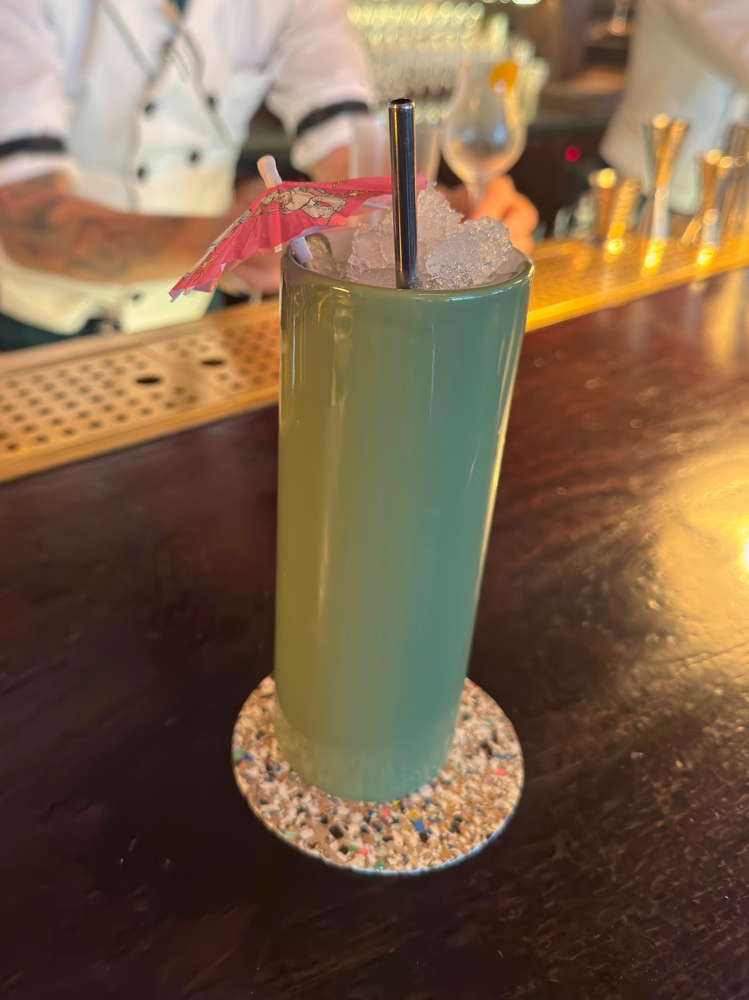
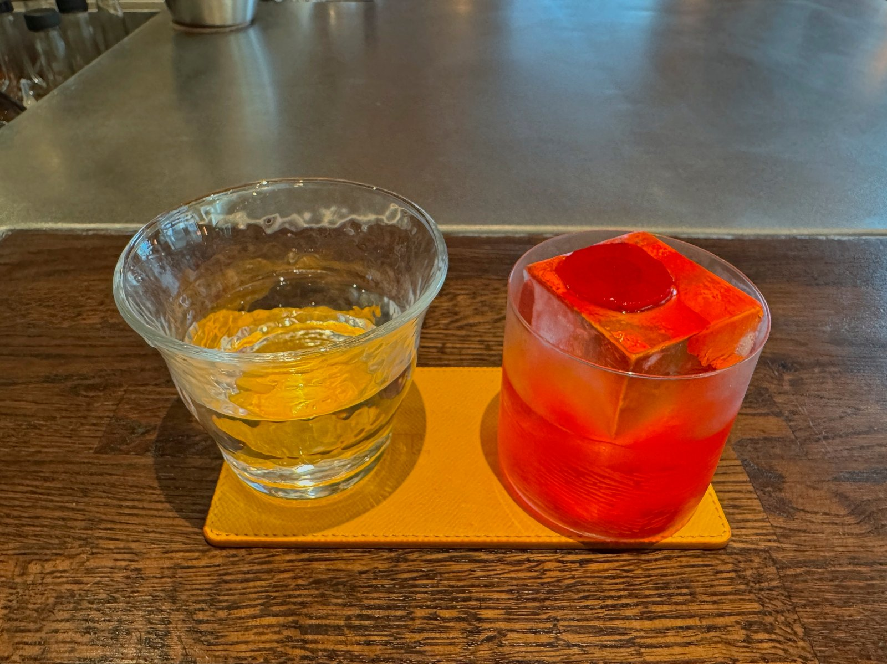
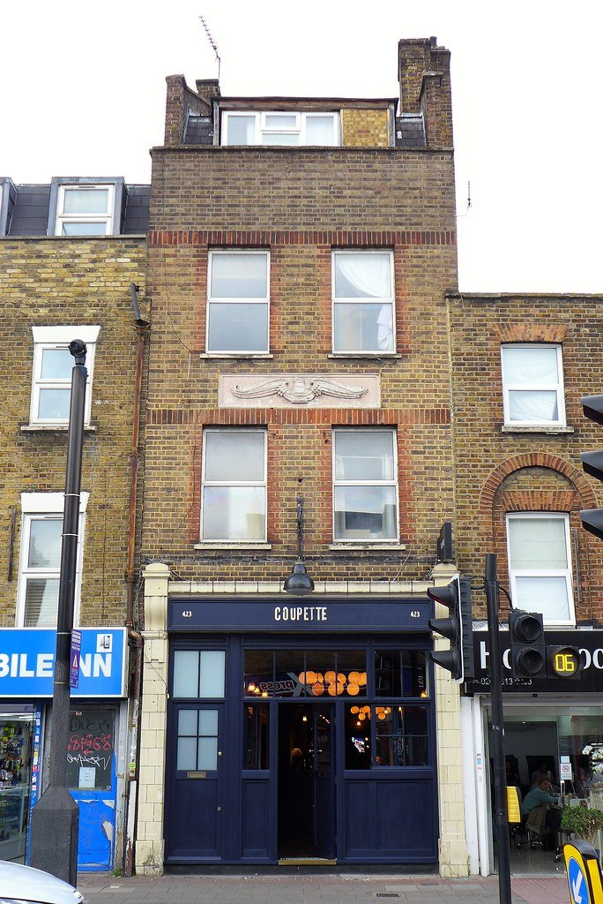
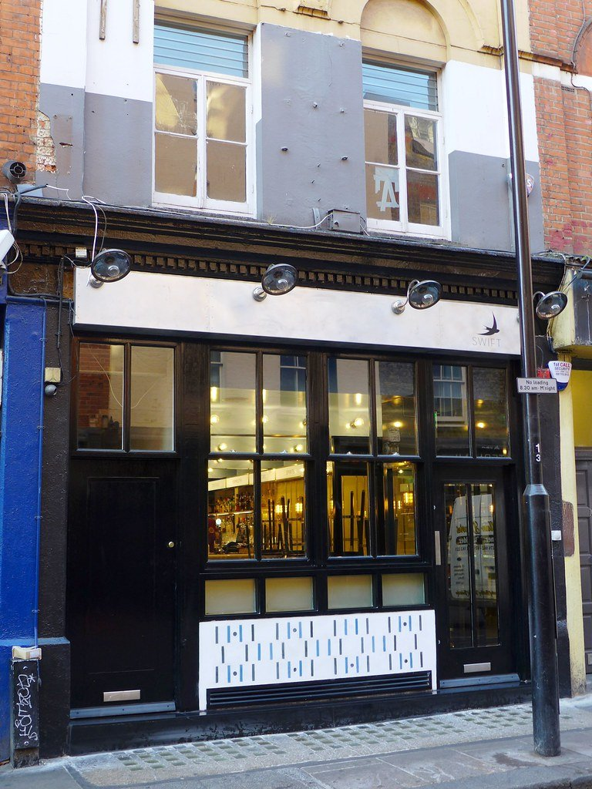
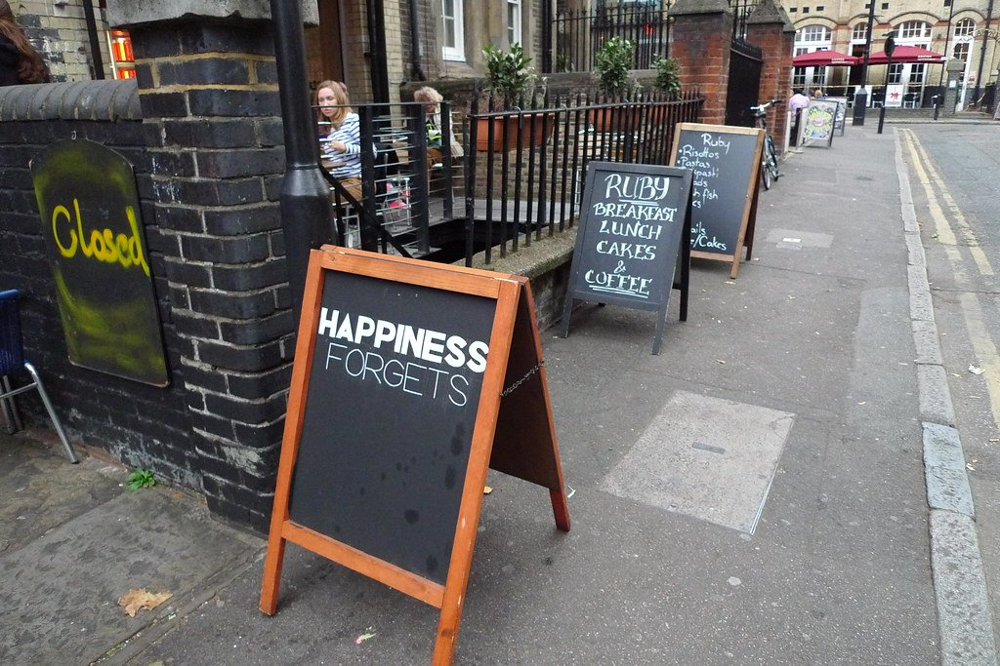
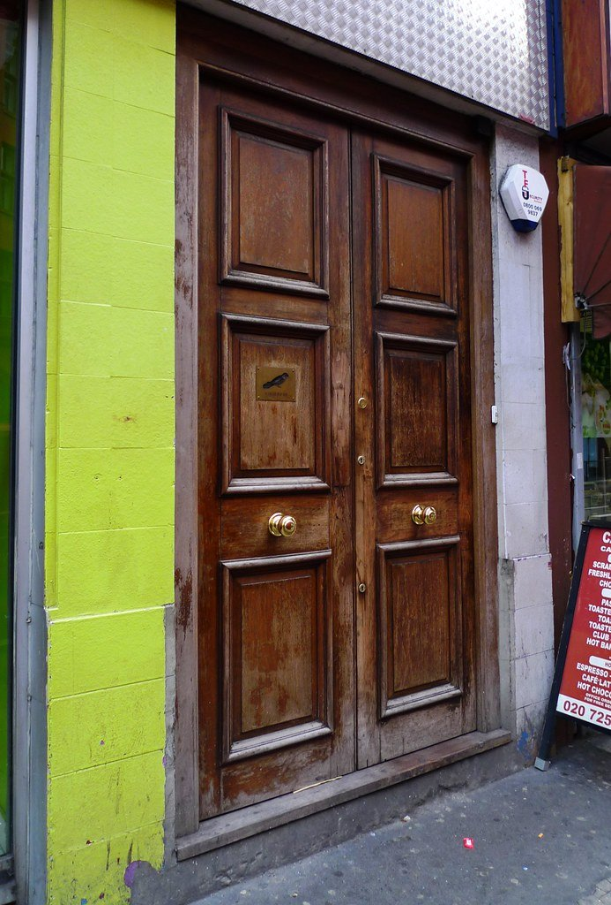

London's cocktail scene splits neatly in two. There are the **Mayfair and St James's hotel bars**, where the drink is £20 and the room has a century of history behind it, and there are the **east London independents**, where it is £14, there is no booking, and the drinks are just as good.

Both are worth your time and they are not competing.

> 💡 **The Short Version:** **The Connaught Bar** has twice been voted the world's best and mixes the martini at your table. **Dukes** imposes a two-drink limit, because the martini is poured neat from a frozen bottle at your table. **The American Bar** at the Savoy is where the Savoy Cocktail Book was written. **Satan's Whiskers** rewrites its menu by hand every day and is the most decorated bar in London right now. And **Tayēr + Elementary** is two bars in one room.

> 📘 **How we choose these (editorial note)**
> No paid placements. These are drawn from a wide spread of sources rather than any single list - the food and travel press, the big listings sites, independent blogs and specialists, video, and what Londoners recommend themselves - and cross-referenced against each other. Where a bar holds a world ranking we give the position and the year, because those lists move every autumn. All rankings here are from the World's 50 Best Bars 2025 — the 2026 list is announced in Milan in October 2026, and anything claiming a 2026 ranking before then is not real.

## Where they are

  

    Map of the best cocktail bars in London
  

  

    
Loading the interactive map…

  

  <noscript>
    
The interactive map requires JavaScript. Every entry below lists its area.

  </noscript>

| If you are near… | Where to go |
| --- | --- |
| **Mayfair & St James's** | The Connaught Bar, Kwãnt, Dukes Bar |
| **Marylebone** | Artesian |
| **Covent Garden & Strand** | The American Bar |
| **Holborn** | Scarfes Bar |
| **Soho** | Swift, Bar Termini |
| **Shoreditch & Bethnal Green** | Tayēr + Elementary, Satan's Whiskers, Coupette, Seed Library |
| **Hoxton, Haggerston & Dalston** | Happiness Forgets, A Bar with Shapes for a Name, Three Sheets (Dalston) |
| **Soho** | Swift, Bar Termini, Three Sheets Soho, Bar Crispin |
| **North London** | Little Mercies (Crouch End), Half Cut Market (York Way) |
| **Covent Garden & Strand** | Oriole |
| **South Bank** | Lyaness |

**On prices:** London cocktail bars very rarely publish their lists online, so this guide does not quote a price per drink unless the bar states one. Every figure, opening time and booking rule below was checked against the venue's own site on 2 September 2026. Expect the hotel bars in Mayfair and St James's to be the most expensive rooms here by some distance, and the east London independents to be materially cheaper for drinks made just as carefully.

---

## The world-ranked

### The Connaught Bar, Mayfair

*££££ · Mon–Sat 4pm–1am · no reservations, ever*

**No.6 in the World's 50 Best Bars 2025** · world No.1 in 2020 and 2021

The **martini is mixed at your table** from a trolley of tinctures — you pick the gin, then choose from bergamot, cardamom, coriander, liquorice and lavender as the bartender works, and the whole thing takes several minutes in front of you. It is £30, and it is the single most polished drink service in London.

> 💡 **It takes no bookings at all.** Not "walk-ins before eight", not a waitlist — the bar's own policy is stated flatly as no reservations, at any hour, for anyone. For a room that has twice been voted the best bar in the world, that is genuinely unusual, and it means the only strategy is to arrive early. Four o'clock, when it opens, is the answer.

**Monday to Saturday, 4pm to 1am**, with no Sunday service published. At The Connaught, Carlos Place, W1K 2AL — five minutes from Bond Street, through Mount Street. No dress code is published for the bar itself, though the room is jacketed enough that you will feel it if you are not.

### Artesian, Marylebone

*££££ · £15–£85 · Sun–Wed 4pm–midnight, Thu–Sat 4pm–1am*

**Four consecutive years as the best bar in the world** in the 2010s, and still a room built for a long drink rather than a quick one — a high-ceilinged, chinoiserie-panelled bar off the lobby of The Langham, with a back bar that runs the full width of it.

**It publishes its price range, which almost nothing else here does: £15 to £85 a drink.** The top of that is a serious sum for a cocktail and the bottom is competitive with Soho. Head bartender Giulia Cuccurullo took the GQ Food & Drink award in 2022.

**Dress code is smart casual and it is published**, so this is one of the few Mayfair-adjacent rooms where you know the rule before you arrive. **Strictly over-18s after 6pm** — accompanied over-15s are admitted before that, which matters if you are travelling with older teenagers.

At The Langham, 1c Portland Place, W1B 1JA, at the top of Regent Street opposite Broadcasting House.

### Tayēr + Elementary, Old Street

*££££ · currently closed after a fire*

**No.5 in the World's 50 Best Bars 2025** — the highest-ranked London bar on that list

Alex Kratena and Monica Berg split it in two: a standing bar at the front for a fast drink, a seated room behind for a slow one. Among the most technically serious bars in Europe.

> ⚠️ **Closed since a fire in the building on 5 May 2026**, with no reopening date announced. It is listed here because it remains London's highest-ranked bar and because it is expected back — but do not travel for it. Check their Instagram before you plan anything around it.

### Lyaness, South Bank

*££££ · £17–£31 · Mon–Thu 5pm–midnight, Fri 4pm–1am, weekends from 1pm*

Ryan Chetiyawardana builds the menu around a handful of house-made ingredients and **rewrites it wholesale** each time rather than editing it. The current one is called **Collaboration 2.0**, with a separate five-drink Special Editions list beside it. Nowhere else in London is working this way.

**Drinks run £17 to £31**, with 13.5% discretionary service. The Pink Belly Gimlet is £17, and its non-alcoholic version is £11 — the alcohol-free drinks here are on the same menu at the same level of thought, not relegated to a footnote.

**Weekends open at 1pm**, which makes it one of very few serious cocktail bars in London you can use in the afternoon. SevenRooms for tables; walk-ins are taken subject to space.

At Sea Containers London, 20 Upper Ground, SE1 9PD — the same building as 12th Knot upstairs, so a rooftop-then-basement evening is one lift ride.

---

## The historic rooms

### The American Bar, Covent Garden

*££££ · Mon–Sat noon–midnight, Sun noon–10pm*

The room where **Harry Craddock compiled the Savoy Cocktail Book in 1930**, and where the White Lady was popularised. Britain's oldest surviving cocktail bar, with a pianist at the baby grand, white jackets and more history per square foot than anywhere else in the country — the Savoy's own line is that it has been serving since 1893 and has had everyone from Churchill to Hemingway through it.

**Noon opening, seven days**, which makes it far more usable than its reputation suggests — an afternoon drink here is a fraction of the theatre of an evening one and the room is the same.

**The dress code is a nice piece of writing in itself**: no formal code, but dress elegantly, and sports jerseys strictly prohibited. Book through SevenRooms.

It was **World's Best Bar in 2017** and is not in the current top 100 — which says more about how fast those lists move than about the room.

### Dukes Bar, St James's

*££££ · walk-in only · Mon–Sat 3pm–10pm*

The **martini is made at your table from frozen bottles**, poured with no ice and no dilution, which is why the house has long held guests to two. Ian Fleming drank here and the Vesper is the order.

> ⚠️ **Do not try to book, and do not believe anyone who tells you to.** Dukes' own site is explicit: the bar welcomes guests on a **walk-in basis**, and there is no reservation system on the page at all. During busy periods there may be a short wait for a table. This guide previously told you to book, which was wrong.

**Last orders are 10pm and the bar closes at 10.30**, which is early for St James's — this is a pre-dinner room, not a late one. No Sunday hours are published.

**Smart casual and strictly over-18s.** Their wording: no sportswear, shorts or T-shirts, with short-sleeved collared shirts the one exception. The hotel is mid-refurbishment and its entrance is **not currently wheelchair accessible**. It is at 35 St James's Place, SW1A 1NY, down a cul-de-sac off St James's Street that is very easy to walk past.

### Scarfes Bar, Holborn

*££££ · £20–£24 · from 5pm*

**No.31 in the World's 50 Best Bars 2025**

Gerald Scarfe's caricatures cover the walls, there is a real fire and about a thousand antiquarian books, and a live band plays most nights. Closer to a private library than a hotel bar, and the only room on this page where you could plausibly fall asleep in an armchair.

**The current menu is called Heroes & Villains**, and the conceit runs through the whole list: each drink is printed as a matched pair, a Hero version and a Villain version of the same idea. Prices are **£20 to £24** — High Society £22, Hot-Air Balloon £24, Divided Kingdom £20 — with 15% discretionary service.

Hours are published only as **"5pm until late"**, with no closing time or day breakdown given, so treat a late arrival as a gamble. Book through SevenRooms. At the Rosewood, 252 High Holborn, WC1V 7EN, two minutes from Holborn.

*Named for the caricaturist Gerald Scarfe, whose drawings cover the walls. Live jazz most nights. Photo: [Bex Walton](https://commons.wikimedia.org/w/index.php?curid=189969117), [CC BY 4.0](https://creativecommons.org/licenses/by/4.0/).*

### Kwãnt, Mayfair

*££££ · 52 Stratton Street W1J 8LN · 5pm–1.30am, seven days*

**No.79 in the World's 50 Best Bars 2025**

Erik Lorincz, formerly head bartender at the Savoy's American Bar, running a basement room off Piccadilly. The technical end of Mayfair, and quieter than its postcode suggests.

**The signature is a five-course drink tasting menu** — the bar's booking site is literally named for it — which is a format almost nobody else in London attempts. You are sitting down for a sequence rather than ordering a round.

**Open 5pm until 1.30am, every day of the week**, which makes it one of the latest serious bars in Mayfair and the only one here that does not shut earlier on a Sunday. Booking and enquiries go through kwantmayfair@icloud.com.

> ⚠️ **Do not go looking for kwant.co.uk.** That domain now returns a holding page, which has led more than one guide to write the bar off as closed. It is trading normally; the live booking site is a Square page instead.

*A Mayfair basement bar from a Connaught alumnus, and quieter than its postcode suggests. Photo: [Bex Walton](https://commons.wikimedia.org/w/index.php?curid=193540390), [CC BY 4.0](https://creativecommons.org/licenses/by/4.0/).*

---

Powered by <a target="_blank" rel="sponsored" href="https://www.getyourguide.com/london-l57/">GetYourGuide</a>

## The independents

Cheaper, later, and no less serious.

### Satan's Whiskers, Bethnal Green

*£££ · book by phone only · from 5pm daily*

**No.21 in the World's 50 Best Bars 2025**

**Taxidermy on the walls, hip-hop loud enough to talk over**, and a menu rewritten daily since it opened in late 2013. Consistently named one of the best bars in London by people who go to bars for a living, and it has never once behaved like it.

**The booking position is more forgiving than its reputation suggests.** Their own words: walk-in guests are accepted, and reservations are recommended but not essential — but **reservations are taken by telephone only**. There is no online form, which is why so many guides, this one included until now, wrote it up as taking no bookings at all.

Open **from 5pm every day**, running later on Fridays and Saturdays. 343 Cambridge Heath Road, E2 9RA, five minutes from Bethnal Green.

### Coupette, Bethnal Green

*£££ · £11–£15 · Sun–Thu 6pm–11.30pm, Fri–Sat 5pm–1am*

Calvados and apple run through the whole menu — a bar with an argument rather than a list, in a corner site on Bethnal Green Road with a zinc bar and a lot of mirror.

**Drinks are £11 to £15** with 13% discretionary service: the Caravela is £13, the Champagne Piña Colada £15 under a Coupette Legacy Cocktails heading, and a "Guilt Free" non-alcoholic list runs **£7**. That is West End quality at half West End money.

**Sundays are the day to come.** A "Biblio-Coupette" bartenders' book-club session runs from 4pm with **every drink at £9**, which is the cheapest serious cocktail in east London.

It was **No.18 in the World's 50 Best Bars in 2018 and No.23 in 2019** and is not currently ranked, which is worth stating plainly rather than implying a placing it no longer holds. Bookings by Quandoo, OpenTable, phone or email. 423 Bethnal Green Road, E2 0AN.

*A French-leaning cocktail bar that made its name on Calvados and apples. Photo: [Ewan-M](https://www.flickr.com/photos/55935853@N00/48470775107), [CC BY-SA 2.0](https://creativecommons.org/licenses/by-sa/2.0/).*

### Swift, Soho

*£££ · £9–£16 · Mon–Sat 3pm–midnight, Sun 3pm–11pm*

**Two bars in one building, built so you can use it either way** — a bright room upstairs for a quick drink before dinner, and a dark one downstairs with a long whisky list for after it. The most useful cocktail bar in Soho for that reason alone.

The pricing follows the split: **upstairs £9 to £16**, downstairs £12 to £16. The Droplet is £13, the Carmen and the Chiffon £16, the Imperial Gimlet downstairs £14.

> 💡 **£7 cocktails, Monday to Thursday before 6pm.** Named drinks — the Droplet and the Pippin among them — drop to £7 in that window, against £13 and £14 the rest of the time. It is printed on the menu rather than being an offer you have to ask about, and it is the best-value serious cocktail in central London.

**Downstairs has live jazz on Tuesdays 6–8pm and Sundays 6–9pm.** Card only, no cash, and 12.5% optional service which they state goes entirely to staff. 12 Old Compton Street, W1D 4TQ.

*Upstairs is a quick aperitivo bar, downstairs is a dark room for staying in. Two bars, one door. Photo: [Ewan-M](https://www.flickr.com/photos/55935853@N00/34156340355), [CC BY-SA 2.0](https://creativecommons.org/licenses/by-sa/2.0/).*

### Bar Termini, Soho

*£££ · classics from £15.50, house negroni £9.50*

A tiny Italian counter bar on Old Compton Street, done as a Roman station bar — an espresso machine at the front, a marble counter, waiter service, and small enough that you should expect to wait.

**The negroni is the reason to come and the reason to be careful.** The house build is £9.50, and there are four of them; everything else on the list starts at **£15.50**. It has a reputation as a cheap bar which only holds if you order the one drink.

**They also sell the negronis bottled to take away** — a range running Superiore, Rosato, Classico, Robusto, Terroir and an Old Fashioned, in 200ml at £16.25 and 700ml from £38.95, with nationwide delivery. That is the bottle programme people half-remember as ageing in the venue.

Bookings are open and walk-ins welcome, per their own banner. **They publish no opening hours at all** — the hours display is deliberately switched off on their site — so a phone call is the only reliable way to check before travelling. 7 Old Compton Street, W1D 5JE. 14.5% discretionary service.

### Three Sheets, Soho and Dalston

*£££ · Dalston Tue–Sun · Soho seven days*

**Soho: No.80 in the World's 50 Best Bars 2025** · **Dalston: No.16 in 2019**

Brothers **Max and Noel Venning**, a short menu and **no theatre at all** — the drinks arrive without a speech, which in this scene is very much the point. Their own phrase for it is meticulously simple, and they mean the drink rather than the room.

**Dalston came first, in 2016**, at 510b Kingsland Road, E8. Its menu is divided into **One, Two and Three Sheet sections by intensity**, so you order by how much you want the drink to do, which is a more useful axis than spirit or era. Open Tuesday to Sunday.

**Soho is the newer and more useful one**, at **13 Manette Street, W1D 4AP**, just off Greek Street — open in the afternoon until late, **seven days a week**, which almost nothing else at this level manages. It does British oysters with champagne and a burger alongside the drinks.

> ⚠️ **Their website is threesheets-bar.com, with a hyphen.** The unhyphenated version is a parked domain that has been dead for over a year, which has led several guides to list the bars as closed. They are not.

### A Bar with Shapes for a Name, Haggerston

*£££*

**No.73 in the World's 50 Best Bars 2025**

Built on **Bauhaus principles down to the glassware**, with a menu of about a dozen drinks and nothing surplus to it. The name is a joke about its own signage, which is three shapes.

### Little Mercies, Crouch End

*££ · 20 Broadway Parade · 30% off 6–7pm daily*

A low-waste neighbourhood bar from the same family behind Three Sheets, built around house distillates, ferments and bottled spirits — and named **Sustainable Bar of the Year in 2022, 2023 and 2025**.

The Snickers Old Fashioned, Moro Margarita and Rhubarb Negroni are the signatures, £10.50–£12.50, with £7 "mini drinks" for something smaller.

**Thirty per cent off every drink between 6 and 7pm, on every day they open** — which is Tuesday to Saturday, not seven nights a week as this guide and several others have said. The bar runs **6pm to midnight, Tuesday to Saturday, closed Sunday and Monday**. Within those five days it is still the most generous standing offer of any bar here.

> The kitchen is closed until 25 September 2026, reopening with chef Christine Walsh. The bar is trading throughout.

### Half Cut Market, York Way

*££ · 396 York Way N7 9LW · Tue–Sat only · restaurant first*

**Be clear what this is before you go: it is a restaurant, wine bar and bottle shop, not a cocktail bar.** Its own description is "a restaurant, wine bar + shop on the York Way Riviera™". It earns a place here on price rather than on the list — the **Half Cut Martini is £10** and a vermouth and soda **£7**, which in London is close to unheard of for drinks made this carefully, and those are last-listed figures rather than something the shop publishes online.

Around eighty low-intervention bottles to drink in or carry out, and a Konro-grilled seasonal menu. **Wine is available to take away any time they are open**, which is the part that makes it useful.

**Shop hours Tuesday and Wednesday 5–10pm, Thursday 5–10.30pm, Friday and Saturday 4–11pm. Closed Sunday and Monday.** The kitchen runs a narrower 5.30–9.30pm inside those. **A set menu on Tuesdays and Wednesdays is £24 for two courses, £28 for three.**

Despite the name, it is a shopfront rather than anything inside a market. Their site is halfcut.world. Caledonian Road & Barnsbury is the nearest station.

### Bar Crispin, Soho

*££ · 19 Kingly Street · Mon–Sat noon–9.30pm, Sun 1pm–9pm*

Soho's benchmark low-intervention wine bar, and the cocktail list is short but unusually good. Four drinks: an **olive oil negroni**, a burnt butter old fashioned, a tonka bean espresso martini and a citrus margarita.

**It closes early, and that is the thing to plan around** — 9.30pm on weekdays and Saturdays, 9pm on Sunday. This is a bar for the hour before dinner or instead of it, not for afterwards, which catches people out on a street where everything else runs to midnight.

**There is a 14-seat back room called the Green Room** and a terrace on Kingly Street itself, which is pedestrianised — the best outdoor drinking on this page. Part of the HAM Restaurants group, with a sibling Crispin in Spitalfields on White's Row.

Worth being clear that wine is the point here and cocktails are the sideline. Booking through OpenTable. 19 Kingly Street, W1B 5PY, in the lane behind Liberty.

### Seed Library, Shoreditch

*£££ · Wed–Thu & Sun 6pm–1am, Fri–Sat 5pm–2am · closed Mon–Tue*

Ryan Chetiyawardana again — the Lyaness man — in a stripped concrete basement doing **short, low-alcohol drinks** with none of the ceremony of his bigger rooms. No prices are published anywhere on the site.

**The music is the part nobody writes about.** East London vinyl collective **Diggers Dozen** hold a residency every Friday and Saturday, described in-house as jazz-laced disco-funk gems, played on two turntables and a Bozak mixer through a properly specified system. That makes it a listening bar with cocktails as much as the reverse.

**Closed Mondays and Tuesdays**, and open until 2am on Friday and Saturday, which is late for a serious cocktail room. Walk-ins are accommodated; tables up to 15 through SevenRooms. Over-18s only.

In the basement of One Hundred Shoreditch, 100 Shoreditch High Street, E1 6JQ — two minutes from Shoreditch High Street station.

### Happiness Forgets, Hoxton

*£££ · from 5pm, every day*

Low ceilings, low light and a short menu in a basement under Hoxton Square. **One of the rooms that started London's basement bar habit**, and still doing it without fuss — their own tagline is "Great Cocktails, No Wallies", which tells you the entire house philosophy in four words.

**Open from 5pm every day**, with no closing time published. No prices are published either, which is normal for this end of the scene.

Book through the widget on their site — the room is small and there is no realistic prospect of walking into it on a Friday. At **8-9 Hoxton Square, N1 6NU**, and the address is the whole difficulty: there is no sign at street level beyond a pavement board, and the door is a basement entrance below a restaurant. Old Street is five minutes.

*A basement bar with no sign at street level beyond the board. Book, because it holds about thirty people. Photo: [Ewan-M](https://www.flickr.com/photos/55935853@N00/6258205723), [CC BY-SA 2.0](https://creativecommons.org/licenses/by-sa/2.0/).*

### Nightjar, Shoreditch

*£££ · 129 City Road · live jazz*

Fifteen years of deeply researched historic cocktails in a basement off Old Street — Singapore Slings, Zombies and Charlie Chaplins rebuilt from the original specifications, at **£15 or so a drink**.

Live jazz three sets a night, and the charges nobody mentions until you arrive: a **music cover of £6 standard or £10 premium per person**, paid to the musicians, and a **minimum spend of £15 per person per hour**. No bookings between 9.15pm and 11pm during live sets. Over-21s.

> The Carnaby Street site closed permanently in September 2025. Shoreditch is the one that trades.

*There is no sign. You ring, you go down, and there is live music every night. Photo: [Ewan-M](https://www.flickr.com/photos/55935853@N00/8473655212), [CC BY-SA 2.0](https://creativecommons.org/licenses/by-sa/2.0/).*

### Oriole, Covent Garden

*££££ · 7-9 Slingsby Place · £14–£16 · Tue–Sat*

Live music nightly and a menu genuinely organised by continent — the current Eighth Edition runs sections headed Europe & Africa and onwards, and you order by where a drink comes from. Sibling to Nightjar, with the same approach to theatre and the same charging model: **the musicians are paid directly through a live-music charge**, as at Nightjar.

Drinks run **£14 to £16** — Syracuse £16, Bergerac £14, Kalahari Julep £15 — with 13.5% discretionary service on top. Booking is through SevenRooms, shared with Nightjar Shoreditch.

**Closed Sunday and Monday.** Tuesday 3pm–11pm, Wednesday 3pm–midnight, Thursday noon–midnight, Friday and Saturday noon–1am.

> ⚠️ **This guide previously placed Oriole in Smithfield, and that was wrong.** It is at **7-9 Slingsby Place, WC2E 9AB**, down a flight of stairs off the courtyard behind St Martin's Lane, and its own site calls it Covent Garden's best-kept secret. If you have been sent to Farringdon by another guide, you were sent to the wrong side of London.

---

Powered by <a target="_blank" rel="sponsored" href="https://www.getyourguide.com/london-l57/">GetYourGuide</a>

## Best value

Cocktail bars are where London prices get least transparent — most publish nothing at all. These are the ones where a real figure could be verified, and they are the ones to use.

#### Genuinely cheap drinks

* **Little Mercies**, Crouch End — **30% off all drinks, 6–7pm, every day they open.** That takes the £11 Snickers Old Fashioned to about £7.70. The bar trades **Tuesday to Saturday**, so this is five nights, not the seven that gets repeated — including here until now. Still the best standing offer of any serious bar in London. Takeaway drinks excluded.
* **Swift**, Soho, Shoreditch and Borough — **named cocktails at £7, Monday to Thursday before 6pm**, printed on the menu against drinks that are otherwise £12–£15.
* **Three Sheets Soho** — no drinks offer, but **three free oysters with any martini or champagne, Sunday to Friday before 6pm**, which is a better deal than it sounds given oysters are £3.95 each there.
* **Bar Termini**, Old Compton Street — the **house Negroni is £9.50**, all four builds, all day. Not a happy hour, just the price. A thirty-seat Italian aperitivo bar making drinks with the precision of rooms charging double.
* **Coupette**, Bethnal Green — **Sunday Development Sessions, all drinks £9** from 4pm, experimental pours that are not on the menu. The regular list runs £11–£15, which is already below the West End.
* **Lyaness** runs a weekday happy hour from 5–7pm, though it does not publish the prices.

#### For comparison, the top end

The **Connaught Martini is £30**, mixed at your table from the trolley. **Nightjar** is around £15 a drink *plus* a £6–£10 music cover and a £15 per person per hour minimum spend. Knowing those numbers is what makes the £7 and £9.50 above worth planning around.

#### The flat-price bars

* **Discount Suit Company**, Spitalfields — **every cocktail on the list is £10**, flat, no exceptions and no offer required. A serious, ingredient-driven bar in a former tailor's on Wentworth Street, and the best straight answer to "where can I drink well cheaply in London".
* **FAM Bar**, Marylebone — **£8.50 a cocktail, Tuesday to Saturday 4–7pm**, stated as a flat price rather than a two-for-one you have to do arithmetic on.
* **Zapoi**, Peckham — **any four classics for £35** — £8.75 each — daily until 7pm, in a plant-filled Rye Lane room that pays the London Living Wage.

#### Two-for-one, properly checked

* **Simmons Bar** — **two-for-one on all cocktails, seven days a week**, 4–9pm at most sites and 3–8pm across the West End ones. With a list running £10.50–£12.80, that is around **£5.25 a drink** — the cheapest verified cocktail in central London. Fifteen branches.
* **The Tommyfield**, Kennington — two-for-one **Monday to Friday, 4.30–6.30pm**, on margaritas, espresso martinis and Aperol spritzes. The list price is £11.50, so about **£5.75** each.

> ⚠️ Two traps in this category. **Be At One's two-for-one only works on two of the same cocktail**, and its widely reported "£6 cocktails" is a **student price requiring ID**, not the standard rate. And **Bar Termini is not a cheap bar** despite its reputation — the £9.50 is the house negroni alone; everything else on that menu is £15.50.

#### Cheap by the glass, not by the hour

Some bars are simply priced below the market and do not need an offer:

* **Half Cut Market**, York Way — the **Half Cut Martini is £10** and a vermouth and soda is **£7**, in a restaurant and wine bar that also sells you the bottle to take home. **Tuesday to Saturday only**, and the cocktail list is a short sideline to the wine. Despite the name it is a shopfront on York Way, not a market hall.
* **Little Mercies**, Crouch End — the signatures run £10.50–£12.50 and the "mini drinks" are **£7**.
* **Three Sheets Dalston** — the house list is £15.50–£16, but the menu states **classics from £13**, which is the way in.

#### Food halls and markets

**Seven Dials Market** in Covent Garden has two — Bar Nana on the ground floor and the Warehouse Bar below it, pouring East London Liquor Co. spirits — and **Market Halls** runs bars at Oxford Street, Canary Wharf and Paddington with **two spritzes for £20 between 3pm and 5pm** on its free Hall Pass app. That offer does not run at Market Halls Victoria.

**Jim & Tonic at Mercato Mayfair** pours from its own distillery on the altar of a deconsecrated church, which is the most striking room of any of them.

#### General

* **Go early.** Almost every bar here is cheaper and calmer before 7pm.
* **Ask for the classics.** A well-made negroni or daiquiri usually sits at the bottom of the list, and at a bar this good it is the better test of the room anyway.

---

Powered by <a target="_blank" rel="sponsored" href="https://www.getyourguide.com/london-l57/">GetYourGuide</a>

## What to know

* **Hotel bars seat walk-ins early** and stop after about 8pm. Go at 6 or book.
* **Dukes' two-drink limit is enforced** and sensible — the martinis are close to neat spirit.
* **Satan's Whiskers takes no bookings at all.** Turn up, and go early on a weekend.
* **£20 a cocktail in Mayfair is normal.** East London is £13–£16 for drinks made with the same care.
* **Ask what the bartender wants to make.** At every bar on this list that is a better order than reading the menu.
* **Service charge** of 12.5% is standard and discretionary.

---

## Continue planning your London trip

- 🎪 **[Unusual Restaurants in London](/articles/unusual-restaurants-london/)**
- 🏛️ **[Historic Pubs and Dining Rooms in London](/articles/historic-pubs-dining-rooms-london/)**
- 🌙 **[Late-Night Eating in London](/articles/late-night-eating-london/)**
- 🍽️ **[Eat in London: Restaurants, Food Markets & Quick Food Hub](/articles/eat-in-london-guide/)**
- 🛍️ **[Mayfair Area Guide](/articles/mayfair-area-guide/)**
- 🍜 **[Soho Area Guide](/articles/soho-area-guide/)**
