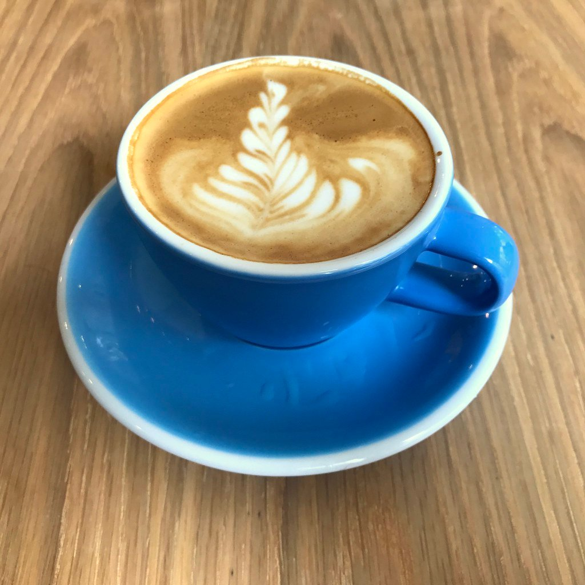
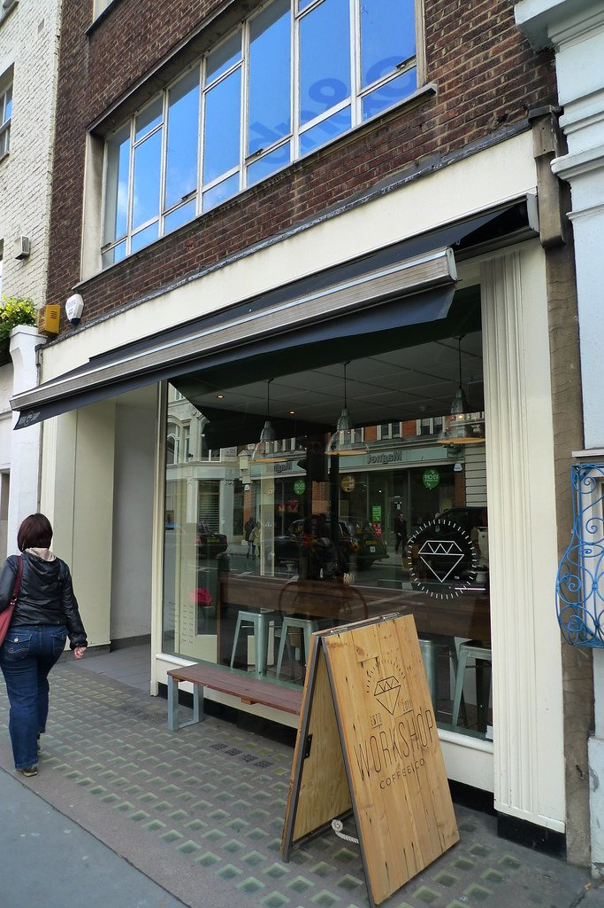
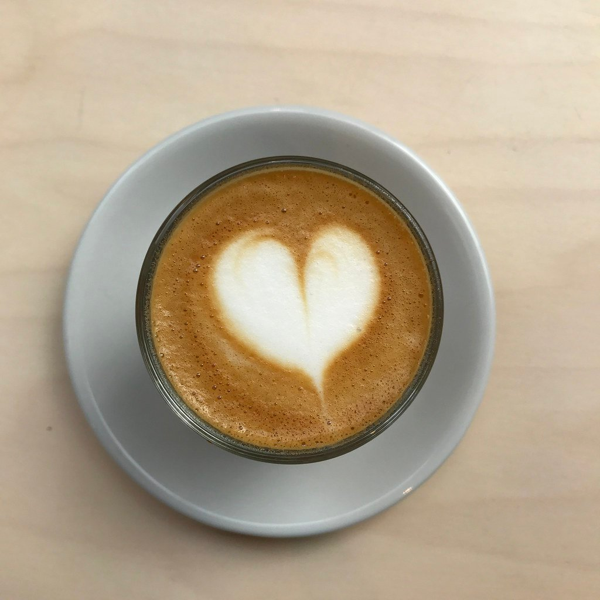
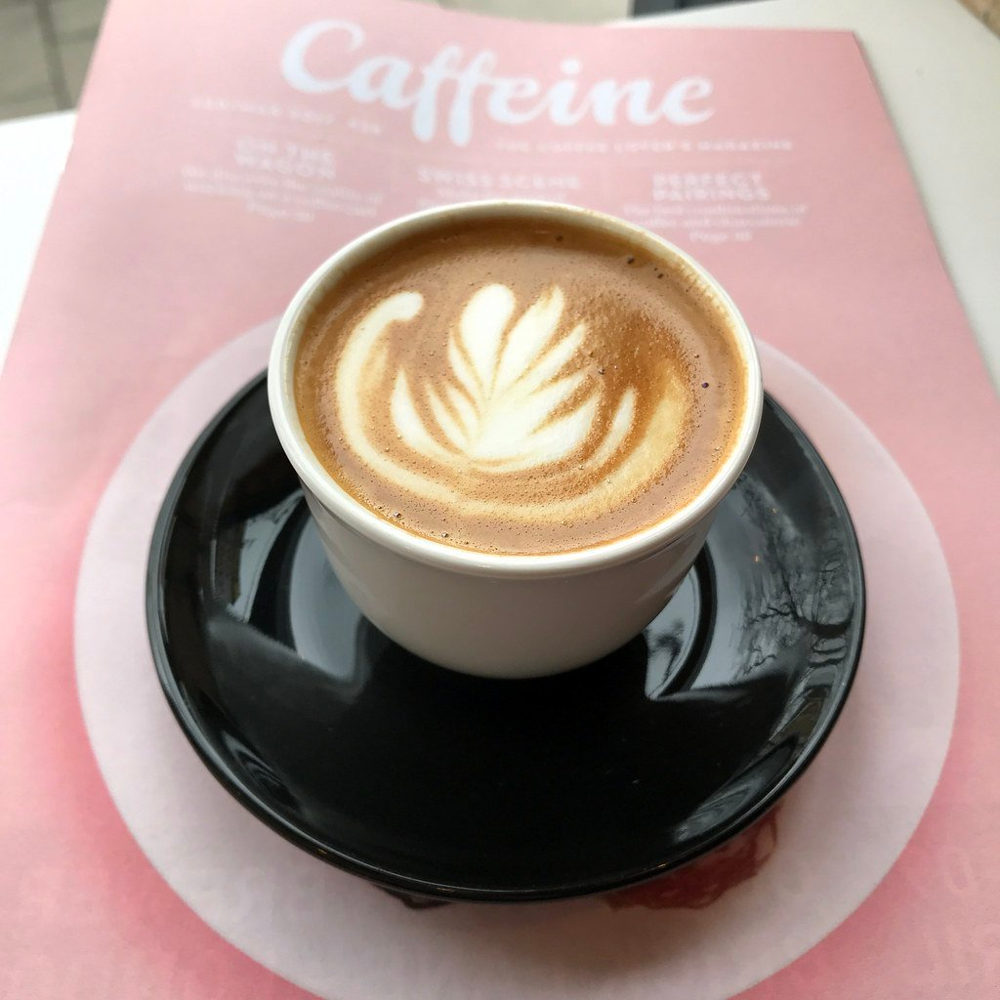
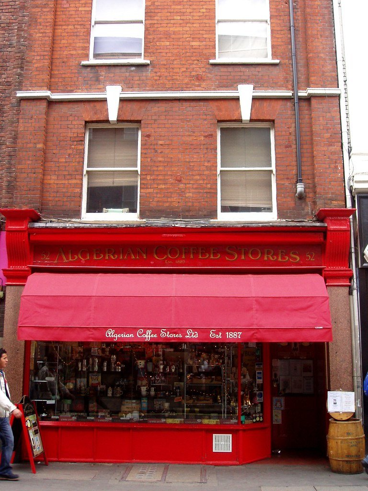

London's coffee is antipodean by descent — the flat white, the counter format and most of the early shops came from Australia and New Zealand — and it is now good enough that the origin story barely matters.

This is a guide to **independents worth crossing a street for**, not chains. Most are counters rather than cafés, and several deliberately have nowhere to sit.

> 💡 **The Short Version:** **Monmouth** has been roasting since 1978 and remains the default. **Rosslyn** tops the rankings and has almost no seats. **Prufrock** trained most of the city's baristas. **Kaffeine** brought the antipodean thing here. **The Attendant** is inside a Victorian lavatory. And **Redemption Roasters** roasts in prisons.

> 📘 **How we choose these (editorial note)**
> No paid placements. These are drawn from a wide spread of sources rather than any single list - the food and travel press, the big listings sites, independent blogs and specialists, video, and what Londoners recommend themselves - and cross-referenced against each other. No chains. Where a shop roasts its own we say so.

## Where they are

  

    Map of the best coffee in London
  

  

    
Loading the interactive map…

  

  <noscript>
    
The interactive map requires JavaScript. Every entry below lists its area.

  </noscript>

| If you are near… | Where to go |
| --- | --- |
| **The City & Clerkenwell** | Rosslyn, Prufrock, Caravan |
| **Shoreditch & Old Street** | Origin, Ozone |
| **Soho** | Algerian Coffee Stores |
| **Marylebone** | Workshop Coffee |
| **Holborn** | Catalyst |
| **Borough & Bermondsey** | Monmouth, WatchHouse |
| **Fitzrovia** | Kaffeine, The Attendant |
| **Bloomsbury** | Redemption Roasters |
| **Hampstead** | Ginger & White |
| **Hackney & London Fields** | Climpson & Sons |
| **South London** | Old Spike (Peckham) |
| **West London** | Carbon Kopi (Hammersmith), Beany Green (Little Venice) |

**Price guide:** flat white £3.50–£4.50 at everything here.

---

## The originals

### Monmouth Coffee Company, Borough

*£ · 3 min from London Bridge*

**Roasting since 1978** and still the default answer to where to get coffee in London. The Borough Market shop is the one to visit — long queue, no seats, and worth it.

**Closed Sundays**, and the Borough queue is at its longest during weekend market hours. **The Covent Garden shop is considerably quieter** and pours the same coffee. Three minutes from London Bridge.

### Prufrock Coffee, Clerkenwell

*£ · Leather Lane*

The shop that **trained a generation of London baristas**. It runs its own training centre, which is why so many people behind other counters in this city learned here.

The food is simple and good — toasties, banana bread, a short breakfast list — but the counter is the reason to come. **Walk-in only, three minutes from Chancery Lane**, and busiest with the Leather Lane lunch trade between noon and 2pm.

### Kaffeine, Fitzrovia

*£ · 6 min from Oxford Circus*

Australian-run, and one of the shops that brought antipodean coffee culture to London — the food counter is as good as the espresso, which is rare enough to be the reason to come.

A small, bright room off Great Titchfield Street with a handful of seats and a lot of people passing through.

**Counter service, no bookings.** Mon–Fri 7.30am–5.30pm, Sat 9am–4pm, **closed Sundays**. Six minutes from Oxford Circus, which makes it the best coffee within reach of the shops.

---

## The rankings

### Rosslyn Coffee, City of London

*£ · 2 min from Moorgate*

A **tiny City counter** that consistently tops London coffee rankings and has almost nowhere to sit. Built for a queue of people on their way somewheree.

**Closed Saturdays and Sundays** — it runs on office hours, because its customers are office workers. Two minutes from Moorgate, and the queue moves fast because almost nobody sits down.

### Carbon Kopi, Hammersmith

*£ · 8 min from Barons Court*

Moved from New Zealand to Hammersmith in 2019 and has been on the national best-of lists ever since — **the best coffee in west London by some distance**, in a part of town not otherwise well served.

A small neighbourhood room rather than a destination space, so expect to stand if you arrive at the wrong moment.

**Walk-in only, eight minutes from Barons Court.** Worth the detour if you are already west; not worth crossing London for unless you are a completist.

### WatchHouse, Bermondsey

*£ · Bermondsey Street*

Started in a **nineteenth-century watchman's hut** on Bermondsey Street and grew into the most polished coffee group in London — uniformly good across every site, which almost no other group manages.

**Room to sit, unlike most of this list**, though the Bermondsey Street original seats about ten. The larger Brunch Houses serve breakfast until 11am and are the ones to pick if you want a table and a plate.

**Walk-in.** Sixteen minutes from Borough, so pair it with Bermondsey Street rather than making a special trip.

---

Powered by <a target="_blank" rel="sponsored" href="https://www.getyourguide.com/london-l57/">GetYourGuide</a>

## Roasteries with kitchens

### Caravan, Clerkenwell

*£ · 10 min from Farringdon*

An all-day kitchen with its own roastery attached — **the room most responsible for London's brunch-and-flat-white format**, copied by half the city since.

Big, loud and industrial, with space to sit and work in a way most specialist coffee rooms cannot offer.

**Bookings are taken across the seven London sites**, which is unusual on this page and worth using at weekends. Ten minutes from Farringdon.

**Bookings are taken across the seven London sites**, which is worth doing at weekends when brunch runs long. Ten minutes from Farringdon.

### Redemption Roasters, Bloomsbury

*£ · 7 min from Russell Square*

The beans are **roasted inside prisons** by people the company then trains and employs on release. A coffee business built around reducing reoffending, and the coffee stands up without the story.

*The coffee is roasted in a young offenders institution as part of a training programme. Photo: [Bex.Walton](https://www.flickr.com/photos/7831824@N04/36031309506), [CC BY 2.0](https://creativecommons.org/licenses/by/2.0/).*

---

**Walk-in, seven minutes from Russell Square** — handy for the British Museum, and a better cup than anything closer to it.

## The roasters

The shops that roast their own, which is where the difference actually gets made.

### Origin Coffee Roasters, Shoreditch

*£ · 3 min from Old Street*

Roasted in **Cornwall** and poured in a clean, modern Shoreditch room. A favourite of the people who take this most seriously, and the one to try if you want to taste what a roaster's own bar does differently.

Pastries and a short toastie list rather than a kitchen. **Walk-in, eight minutes from Old Street**, and calmest mid-afternoon.

### Ozone Coffee Roasters, Shoreditch

*£ · 4 min from Old Street*

A **working roastery in the basement with a full kitchen above it** — closer to an all-day restaurant than a coffee shop, and busy for brunch as much as for coffee.

**Walk-in, three minutes from Old Street.** Brunch is the busy service and the queue peaks around 11am at weekends — come on a weekday if you want the room rather than the wait.

### Workshop Coffee, Marylebone

*£ · 5 min from Bond Street*

A roaster's shop where **the filter list changes constantly** and the staff will talk you through it if you want them to, and leave you alone if you do not.

*One of the early London roasteries, and still the reference point for a lot of what followed. Photo: [Ewan-M](https://www.flickr.com/photos/55935853@N00/8401291269), [CC BY-SA 2.0](https://creativecommons.org/licenses/by-sa/2.0/).*

**Walk-in, seven minutes from Bond Street** — the most civilised coffee within reach of Oxford Street, which is worth knowing on a shopping day.

### Climpson & Sons, London Fields

*£ · 6 min from Cambridge Heath*

On **Broadway Market since before the street became what it is now**, roasting its own and still busiest on a Saturday. Pair it with the market rather than making a separate trip.

Pastries and sandwiches from the counter rather than a menu. **Walk-in, eight minutes from Cambridge Heath**, and **Saturday is both the best and the worst time**: the market is on, and so is everybody else.

### Catalyst, Holborn

*£ · 3 min from Chancery Lane*

A pared-back Scandinavian room a few streets from Prufrock, and **named among the best coffee shops in the UK for 2026**.

*A roastery café near King's Cross that takes the coffee seriously and the room lightly. Photo: [Bex.Walton](https://www.flickr.com/photos/7831824@N04/33625242186), [CC BY 2.0](https://creativecommons.org/licenses/by/2.0/).*

**Closed Saturdays and Sundays**, like most of the legal-district shops. One minute from Chancery Lane, and a few streets from Prufrock — the two make an easy pair on a weekday morning.

### Old Spike, Peckham

*£ · 5 min from Peckham Rye*

A Peckham roastery that **employs and trains people who have experienced homelessness**. The coffee stands on its own merits, which is rather the point — it is not a charity you buy from out of sympathy.

*A Peckham roastery that trains and employs people who have experienced homelessness. Photo: [Bex.Walton](https://www.flickr.com/photos/7831824@N04/33666350895), [CC BY 2.0](https://creativecommons.org/licenses/by/2.0/).*

---

**Walk-in, ten minutes from Peckham Rye.** Combine it with Rye Lane rather than treating it as a destination on its own.

## Worth the detour

### Algerian Coffee Stores, Soho

*£ · Old Compton Street · since 1887*

Trading on Old Compton Street since **1887**, selling beans over the counter with an espresso hatch and **nowhere at all to sit**. An espresso costs less than almost anywhere in central London and you drink it on the pavement.

The oldest thing on this list by a century, and still a working merchant rather than a museum.

*The shopfront has barely changed since 1887. Espresso to take away costs a fraction of what the cafés around it charge. Photo: [Ewan-M](https://www.flickr.com/photos/55935853@N00/2441960131), [CC BY-SA 2.0](https://creativecommons.org/licenses/by-sa/2.0/).*

### The Attendant, Fitzrovia

*£ · 7 min from Goodge Street*

Coffee served inside a **restored Victorian public lavatory**, with the original porcelain urinals turned into the counter you sit at — a gimmick that would be unbearable if the coffee were not good.

It is a basement, so it is dim, small and warmer than you expect. Better as a stop than a place to settle.

**Walk-in, seven minutes from Goodge Street.** Go outside the lunch hour: a dozen people is a crowd down there.

### Ginger & White, Hampstead

*£ · Perrins Court*

Serious coffee and a proper British breakfast down a Hampstead alley — a **bacon sandwich and a flat white**, done exactly right, and the default meeting place for anyone who lives up there.

Perrins Court is a pedestrian lane, so there are outdoor tables and no traffic.

**No reservations**, indoor and outdoor seating. Mon–Fri 7.30am–5.30pm, Sat to 6pm, Sun 8am–6pm — **one of the few here open all weekend**. Two minutes from Hampstead station, and the obvious start to a Heath walk.

### Beany Green, Little Venice

*££ · the towpath*

Australian brunch on the canal with a big terrace — **the easiest good coffee within walking distance of Paddington**, which is otherwise a desert for it.

The setting is the point: tables out on the towpath at Sheldon Square, water on one side, offices on the other.

**Walk-in, and busiest on weekday mornings** with the office crowd. Ten minutes from Paddington on foot, and a sensible stop before a train west.

---

## Best value

Speciality coffee in London settles around £3.20–£4.20 for a flat white almost everywhere, so the saving is rarely in the cup price. It is in what else you can get for it.

* **Buy beans from the roasters.** A bag from Monmouth, Square Mile, Assembly or Origin costs about the same as three flat whites and makes forty. The roasteries in this guide all sell retail, and several will grind to your method.
* **Markets.** **Monmouth at Borough Market** is the original and still the best queue in London coffee. **Maltby Street** and **Netil Market** both have serious coffee carts at market prices rather than café ones.
* **Food halls.** **Seven Dials Market**, **Mercato Mayfair** and **Old Spitalfields** all carry independent coffee counters — useful when you want a good flat white without hunting for a specific address.
* **Filter over espresso.** Batch brew is usually £1 cheaper than a flat white and, at a shop that roasts its own, it is the drink that actually shows the roast off.
* **Bring a cup.** Most independents take 25–50p off, and a few take more.

---

Powered by <a target="_blank" rel="sponsored" href="https://www.getyourguide.com/london-l57/">GetYourGuide</a>

## What to know

* **Order filter at a serious roaster.** It is cheaper than espresso drinks and usually shows the bean better.
* **Most of these have no seats.** Rosslyn and Monmouth are counters by design.
* **Monmouth's Borough queue** moves faster than it looks. Go before 10am at weekends.
* **A flat white over £5** means you are in a hotel, not a coffee shop.
* **Ask where the beans are from.** Every shop here will tell you, and several roast their own.

---

## Continue planning your London trip

- 🍳 **[The Best Breakfast and Brunch in London](/articles/best-breakfast-brunch-london/)**
- 💷 **[Cheap Eats in London](/articles/cheap-eats-london/)**
- 🎪 **[Unusual Restaurants in London](/articles/unusual-restaurants-london/)**
- 🛍️ **[London Markets by Day](/markets/)**
- 🎨 **[Shoreditch Area Guide](/articles/shoreditch-area-guide/)**
- 🏙️ **[City of London Area Guide](/articles/city-of-london-area-guide/)**
