Ask who judges London's best craft beer pub and you hit a structural problem before you hit an opinion. CAMRA — the Campaign for Real Ale, the only body that actually judges pubs rather than beers — doesn't crown one. Its Pub of the Year competition runs branch by branch, thirteen of them across Greater London, and there is no final round where Bromley's winner meets Richmond's. "Which branch won" is really thirteen separate, unconnected answers, and two of those branches ran theirs as a dead-heat rather than a single pub.

So this guide counts across all of it: the eleven branches that published a result, the editorial lists that rank taprooms rather than pubs, the independent specialists who actually walk the beer miles, and the video crawls that go pub to pub with a phone camera and a chapter list.

> 💡 **The Short Version:** There's no single London-wide CAMRA winner — but **The Cockpit** in Chislehurst has taken Bromley's branch award four years running and the Greater London round too in 2026, and **The Hope** in Carshalton has won the Greater London award five times. **Exale Brewing & Taproom** tops Time Out's taproom list; **Cask Pub & Kitchen**, open since 2009, tops Secret London's and calls itself London's original craft beer pub. For a beer mile on foot, **Bermondsey** and **Blackhorse Lane** are the two the sources keep returning to. Most of this list is walk-in — book only where there's a kitchen behind the bar.

> 📊 **The evidence behind this guide.**
> Nothing here is ranked on one visit. This pass reads **34 independent sources carrying 395 citations** across **325 named pubs, breweries and taprooms**. **48 are named by two or more independent sources; 13 carry a dated CAMRA branch award.**
> **Built on:** CAMRA's Pub of the Year results from 11 London branches, four editorial mastheads, three independent specialists and 16 YouTube channels — counted per creator, so one channel's several videos are one voice.
> *Evidence rebuilt 13 September 2026 · [How we rank →](/how-we-rank/)*

## Where they are

| If you are near… | Where to drink |
| --- | --- |
| **Bermondsey & Borough** | Hand & Marigold, The Kernel, Anspach & Hobday, The Rake, The Market Porter |
| **Hackney & Hackney Wick** | Howling Hops, Beer Merchants Tap, The Pembury Tavern, Hackney Church Brew Co. |
| **Hoxton & Clerkenwell** | The Wenlock Arms, The Sutton Arms |
| **Euston & Pimlico** | Euston Tap, Cask Pub & Kitchen |
| **Gospel Oak & Kentish Town** | The Southampton Arms |
| **Walthamstow (Blackhorse Beer Mile)** | Exale Brewing & Taproom |
| **Croydon, Sutton & Wimbledon** | The Hope, The Dark Horse, The Sultan |
| **Kingston & Epsom** | The Antelope, Jolly Coopers |
| **Richmond, Ealing & Paddington** | The Mitre, The Dodo Micropub, The Bear |
| **Barnet & Bexley** | Ye Olde Mitre Inne, Robin Hood & Little John |

**Price guide:** **£** a pint under £5 · **££** £5–£7 · **£££** £7+.

---

## The winners

Eleven CAMRA branches, thirteen winning pubs, and no round where they meet each other — so "the winner" below means each pub actually won something in its own patch, not that it beat the others on this list.

### The Cockpit, Chislehurst — four years running, then Greater London too

*£ · Chislehurst, Bromley · Cited by 1 source · Bromley AND Greater London CAMRA Pub of the Year 2026*

Four Pub of the Year wins running for the Bromley branch, and 2026 is the year the Greater London round agreed with them too — "Bromley AND Greater London CAMRA Pub of the Year 2026" is how the branch itself puts it, a branch-and-region double that none of the other 2026 winners below can also claim.

It's a micropub in the strict sense: **one room, no music, no fruit machines**, built around **gravity-dispensed cask ale poured straight from the cask rather than through a handpump**, alongside a serious fine-cider list, local gins and a board of Neal's Yard cheeses and cured charcuterie in place of a kitchen.

**Both card and cash work, and there's no hot food** — eat first if you want more than the board. 4 Royal Parade, Chislehurst BR7 6NR.

**Site:** [thecockpitchislehurst.co.uk](https://thecockpitchislehurst.co.uk)

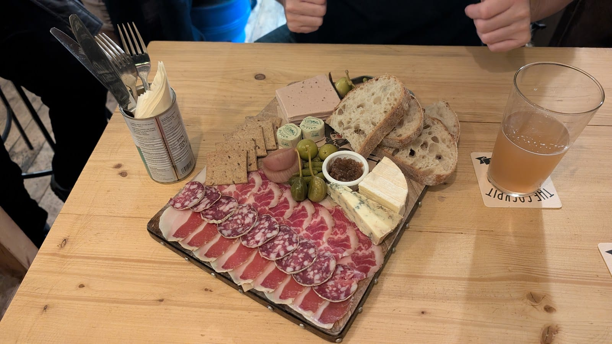

*The board of Neal's Yard cheese and charcuterie that stands in for a kitchen here — there's no hot food, so this is what to order.*

### The Hope, Carshalton — five-time Greater London champion

*£ · Carshalton, Sutton · Cited by 2 sources · Sutton Borough CAMRA Pub of the Year 2026, and Greater London Pub of the Year 2012, 2013, 2016, 2017 and 2019*

ShortList's own independently-reported pick for the best beer list in London and CAMRA's 2026 Sutton branch winner turn out to be the same building, named with no reference to each other — a mock-Tudor pub with **seven handpumps for real ale** and, per the branch's own count, more than ten Pub of the Year wins across the years, five of them at Greater London level.

Inside it's deliberately unmodernised: **no TV, no muzak, no fruit machines**, a warren of small rooms rather than one bar, and a kitchen running soups and sandwiches rather than a full menu.

**Food service stops at 2.45pm** and the pub itself runs to 11pm most nights — this is a beer list to sit with, not a dinner stop. 48 West Street, Carshalton SM5 2PR.

**Site:** [hopecarshalton.co.uk](https://www.hopecarshalton.co.uk)

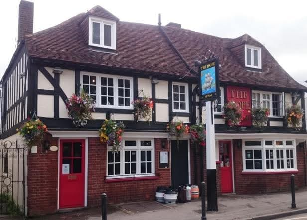

*Five-time Greater London CAMRA champion, unmodernised inside — no TV, no muzak, no fruit machines.*

### Hand & Marigold, Bermondsey — a Victorian corner pub back from the dead

*££ · Bermondsey Street · Cited by 2 sources · South East London CAMRA Pub of the Year 2026*

Closed as a pub in 2021, reopened by new owners in March 2025, and judged the best pub in the SE London CAMRA branch within about a year of pulling its first pint again — a faster turnaround than almost anything else in this guide. Will Hawkes's own beer newsletter named it independently of the award, run by Alice and Oli Carter-Esdale, which is the kind of confirmation that actually means something.

It's a single-room Victorian street-corner pub, refurbished in the traditional style rather than knocked through into something bigger — **a proper bar rather than a lounge**, on the corner of Bermondsey Street and Cluny Mews.

**Open to 10pm on weeknights, 11pm Friday and Saturday.** 244 Bermondsey Street, London SE1 3UH.

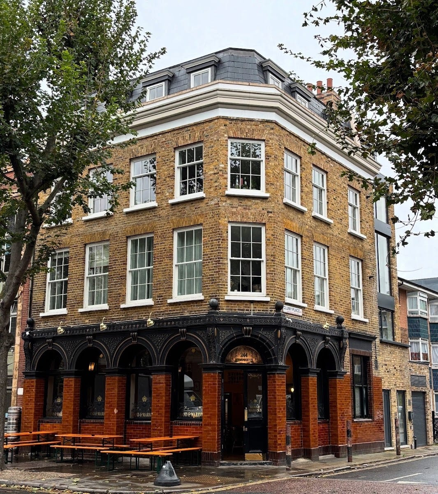

*Closed as a pub in 2021, reopened in March 2025, and South East London CAMRA's Pub of the Year within about a year of pulling its first pint again.*

### The Wenlock Arms, Hoxton — the jazz pub that came back from a demolition threat

*£ · Hoxton, N1 · Cited by 2 sources · North London CAMRA Pub of the Year 2026*

CAMRA's own line on this one is "a classic story of rags to riches then back to rags and finally riches" — a 1994 reinvention as a real ale and jazz pub, a threatened closure, and a second Pub of the Year win that confirms it's still standing. Tweedy Pubs' own tour of the pub, filmed independently of the award, corroborates it as one of the capital's genuine real-ale landmarks.

The pour is **a constantly changing range of cask ales, keg beers and real ciders**, in a plain, unfussy room that has never been done up for the sake of it — no kitchen, no food beyond crisps and pork scratchings, and a jazz night that's been part of the identity since the nineties.

**Closes at 10pm most nights.** 26 Wenlock Road, London N1 7TA.

**Site:** [wenlockarms.com](https://wenlockarms.com)

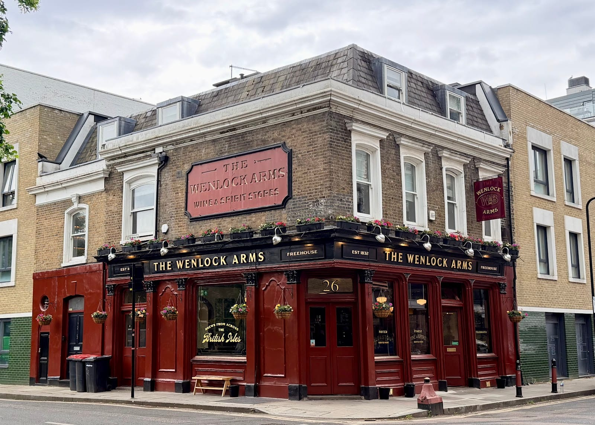

*Reinvented as a real ale and jazz pub in 1994, and still standing after a demolition threat — North London CAMRA's Pub of the Year for 2026.*

### The Sultan, South Wimbledon — Hop Back's only London pub

*£ · South Wimbledon · Cited by 2 sources · South West London CAMRA Pub of the Year (most recent published result: 2023)*

No newer result has been published, so 2023 is the most recent win rather than a current title. Rebel Atlas's independent guide calls it **"a revered Hop Back pub and south-west London cask beacon"**.

It's the brewery's only tied house in London — a 1950s brick rebuild that CAMRA calls "a remarkably intact survivor of the early post-war period" — pouring **up to eight Hop Back beers**, Summer Lightning among them, plus a proper wine list, in a community pub with soups, sandwiches and a garden with a conservatory.

**Open until 11.30pm.** 78 Norman Road, South Wimbledon SW19 1BT.

**Site:** [hopback.co.uk/our-pubs/the-sultan](https://www.hopback.co.uk/our-pubs/the-sultan)

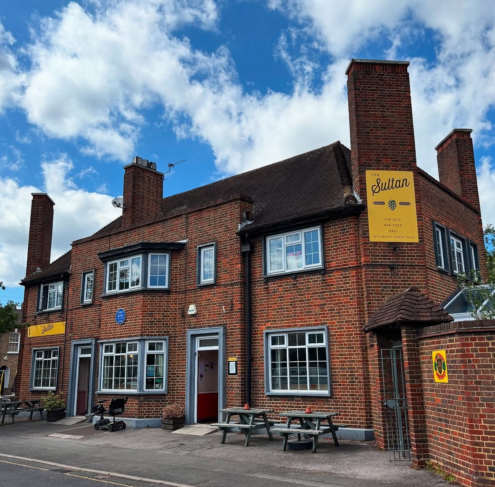

*Hop Back's only tied house in London — a 1950s brick rebuild and, per the branch's own count, the pub with the most Pub of the Year wins on this list.*

### Exale Brewing & Taproom, Walthamstow — Time Out's number one

*££ · Blackhorse Lane, Walthamstow · Cited by 1 source · #1 of 22, Time Out's Best Breweries and Taprooms*

Time Out's taproom countdown — a separate, ranked list from its general pubs guide — puts this one top of 22, calling it **"a fun and friendly taproom"** on the Blackhorse Beer Mile. It's the anchor venue of that mile: a former furniture factory with an industrial fit-out, brewing on-site on a weekly cycle so the beer sold is rarely more than a few days old, across **fourteen taps**.

It runs later than most of this list — **open to 2am on weekend nights, with a late bar and regular live music** — which makes it more of a destination evening than a stop on a crawl. Food runs to burgers and tacos rather than a kitchen menu.

Unit 2C Uplands Business Park, Blackhorse Lane, London E17 5QJ.

**Site:** [exale.uk](https://www.exale.uk)

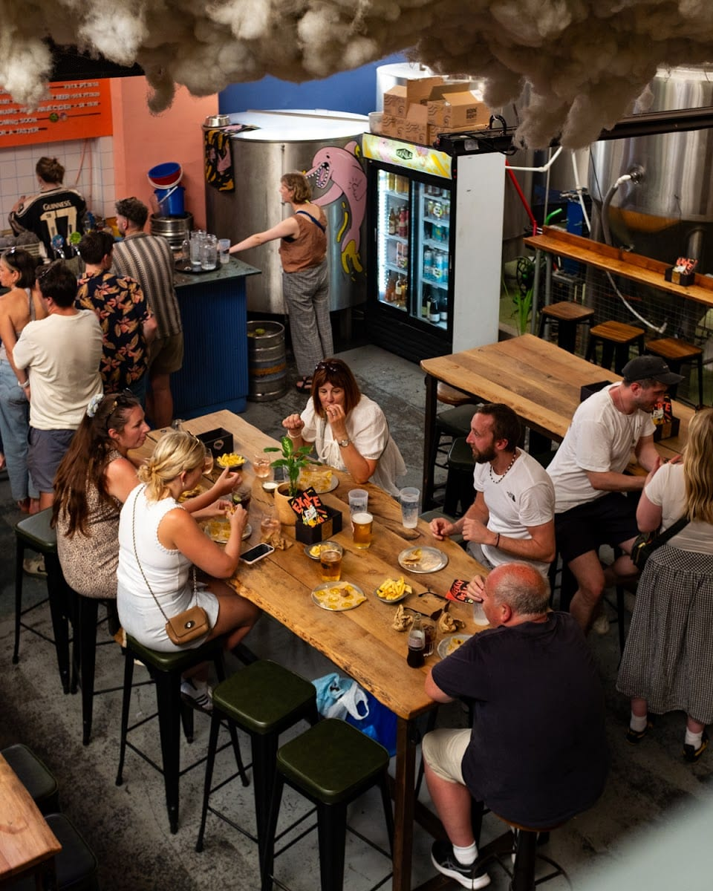

*Brewing happens on site on a weekly cycle, so the beer sold is rarely more than a few days old.*

### Cask Pub & Kitchen, Pimlico — London's original craft beer pub

*££ · Pimlico · Cited by 1 source · #1 of 15, Secret London's craft beer countdown*

Opened in 2009 and still describes itself as **London's first craft-beer-focused pub**, which Secret London's own countdown puts at the top of its 2024 list: **"award-winning pub"** with **"an extensive list of draught beer."** On the ground, that's **ten cask lines, twenty-two keg taps and a "vintage cellar"** of aged and rare bottles — one of the widest pours on this whole list, in a corner pub a ten-minute walk from Victoria.

The kitchen does burgers rather than bar snacks, which is unusual for a pub this beer-focused, and the room is properly sized for it — this isn't a two-table micropub.

**Open to 11pm Monday to Saturday, 10.30pm Sunday.** 6 Charlwood Street, London SW1V 2EE.

**Site:** [caskpubandkitchen.com](https://www.caskpubandkitchen.com)

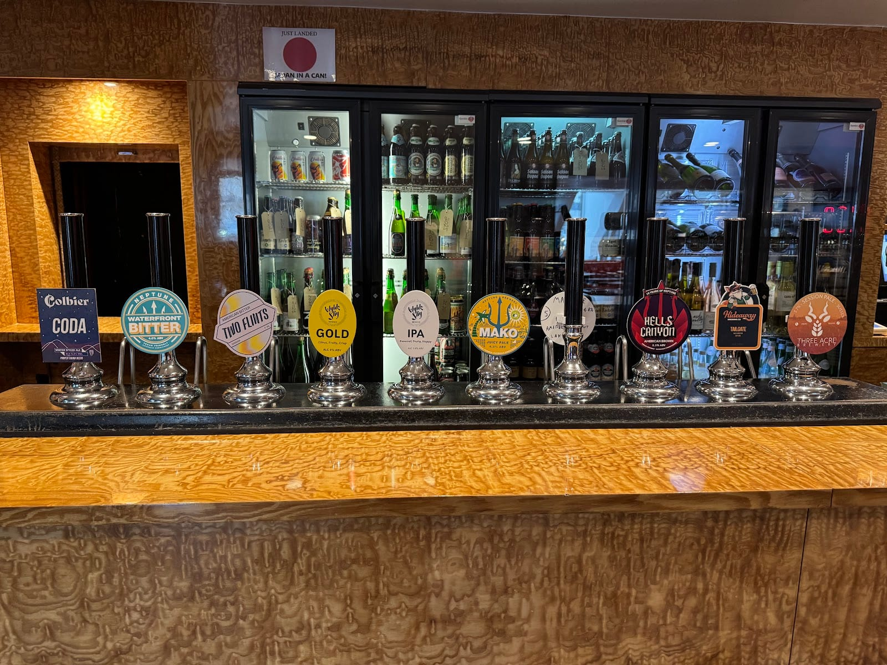

*Ten cask lines and twenty-two keg taps — one of the widest pours in this whole guide.*

Powered by <a target="_blank" rel="sponsored" href="https://www.getyourguide.com/london-l57/">GetYourGuide</a>

## Every other branch's current winner

The eleven branches above between them produced thirteen winning pubs — five get the full write-up above; the rest are just as real, just thinner in what any source said about them.

| Branch | Pub | Where | What it is |
| --- | --- | --- | --- |
| Bexley | The Robin Hood & Little John | Bexleyheath | A 1830s back-street local; seven real ales and two rotating guests, food Tue–Sat lunchtimes only |
| Kingston & Leatherhead *(joint)* | The Antelope | Surbiton | Original home of Big Smoke Brew Co.; 10 real ales, 5 ciders, 14 keg lines |
| Kingston & Leatherhead *(joint)* | Jolly Coopers | Epsom | A working brewpub — cask-conditioned ales brewed on site under the Fuzzchat name |
| Enfield & Barnet *(2025)* | Ye Olde Mitre Inne | High Barnet | Grade II-listed Greene King house, pub on the site since 1553 — not the Holborn Ye Olde Mitre |
| Richmond & Hounslow | The Mitre | Richmond | Free house, 14 handpumps, an ever-changing cask and craft list, build-your-own pizza |
| West London | The Bear | Paddington | The only independent family-owned pub in Paddington; 6 cask ales and 29 keg lines |
| West Middlesex *(2025)* | The Dodo Micropub | Hanwell, Ealing | One-room free house, up to 5 changing cask ales on gravity dispense |
| Croydon & Sutton *(Croydon side)* | The Dark Horse | Selhurst | Reopened July 2025, independent family pub, three changing cask ales |

*Two more London branches, East London & City and South West Essex, had not published a current-year result at the time of this pass.*

---

## Also strongly backed

Nothing here won a branch award, but each is named by three or four sources working independently of each other — awards writers, editorial lists and the people who actually film themselves doing a crawl.

### Hackney Church Brew Co. — a working brewery inside a converted church hall

*££ · Bohemia Place, Hackney Central · Cited by 4 sources*

A brewery and taproom under the railway arches of Bohemia Place, named after the church it's built into — the room still has the high ceilings and arched windows to show for it. Rebel Atlas calls the beer **"brewpub energy under the Overground,"** and on the ground it runs **rotating own-brewed keg lines** alongside Hendl rotisserie chicken and buffalo wings rather than a bar-snacks menu.

Expect it **loud and full on a Friday night**, with big shared wooden tables rather than a pub layout — this is a taproom first, not a quiet pint.

**Closes around 10pm.** 17 Bohemia Place, London E8 1DU.

**Site:** [hackneychurchbrew.co](https://hackneychurchbrew.co)

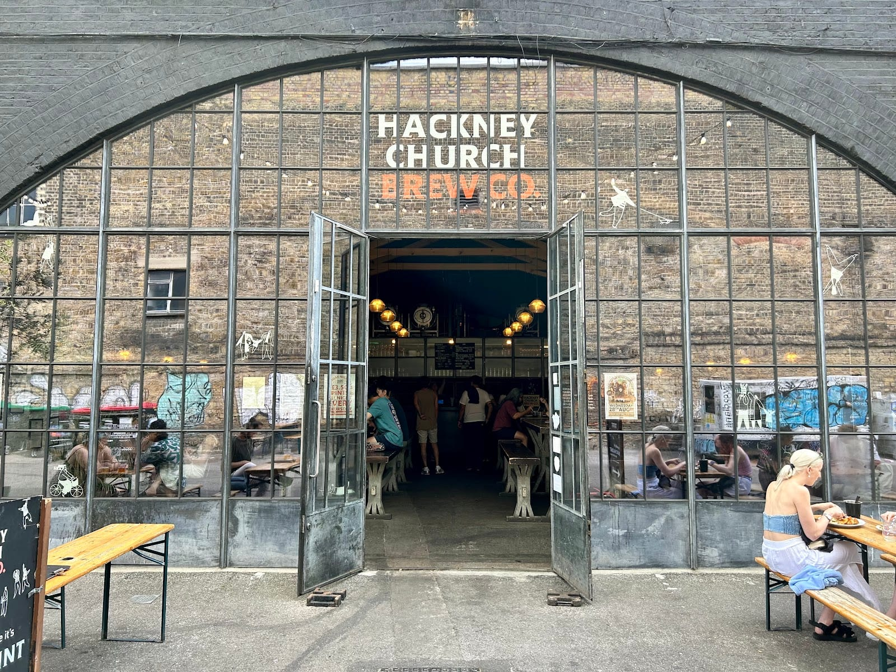

*A brewery and taproom built into a former church hall under the Overground, with the high ceilings and arched windows still showing for it.*

### The Pembury Tavern, Hackney — the Five Points brewery tap since 1856

*££ · Amhurst Road, Hackney · Cited by 4 sources*

A corner pub that's been pulling pints since 1856, now run as the tap house for **The Five Points Brewing Company**, whose brewery is a mile down the road. One reviewer, self-declared unimpressed by most modern brewing, praised it for using **"real ale traditionally, not hop oils or malt extract"** — a specific, checkable claim rather than a vague compliment.

The kitchen belongs to **ACE Pizza**, resident since 2018, and the room keeps its hardwood floors and a bar billiards table rather than going for a taproom fit-out.

**Open to 11pm.** 90 Amhurst Road, London E8 1JH.

**Site:** [pemburytavern.co.uk](https://pemburytavern.co.uk)

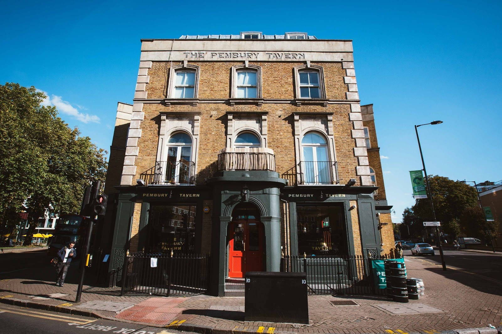

*The tap house for the Five Points Brewing Company, whose brewery is a mile down the road.*

### Howling Hops — Tank Bar, Hackney Wick — the UK's first dedicated tank bar

*££ · Queen's Yard, Hackney Wick · Cited by 4 sources*

**"The UK's first dedicated tank bar,"** in its own words, and the claim holds up: **ten tanks, ten different beers, poured straight from the tank along a ten-metre bar** rather than through a font. It moved to Queen's Yard from a previous site on Mare Street some years ago, so if an older write-up places it in a different building, that's why.

It's a proper European-style beer hall — long tables, high ceilings, food cooked and eaten in the same room — rather than a pub in any traditional sense, and it fills up fast on a warm evening this close to Victoria Park.

**Open to 11.30pm.** 9 White Post Lane, London E9 5EN.

**Site:** [howlinghops.co.uk](https://www.howlinghops.co.uk)

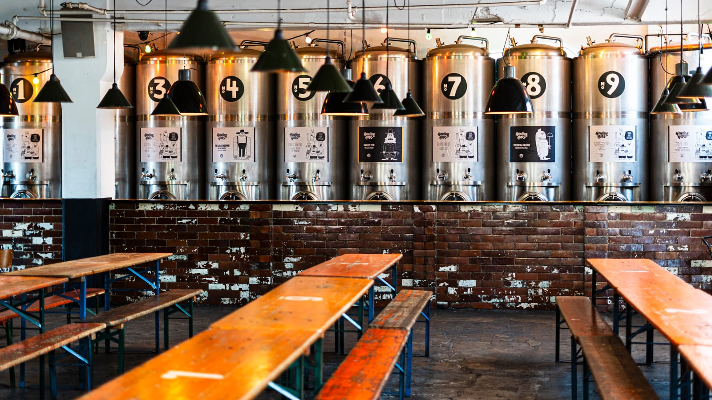

*The UK's first dedicated tank bar — ten tanks, ten beers, poured straight from the tank rather than through a font.*

### Beer Merchants Tap, Hackney Wick — a bottleshop you can drink in

*££ · Wallis Road, Hackney Wick · Cited by 4 sources*

The physical taproom for an online bottle shop that ships around a thousand different beers, which is the reason its own **twenty keg lines** run from easy, affordable pints through to the hard-to-find bottles most pubs never stock. CAMRA's own listing backs the number up directly.

The room is set up for sitting rather than standing — plenty of seating inside, a beer garden out the back, and a wine and spirits range alongside the beer for anyone not drinking that night.

**Closes around 10pm on weeknights.** 99 Wallis Road, London E9 5LN.

**Site:** [beermerchantstap.com](https://beermerchantstap.com)

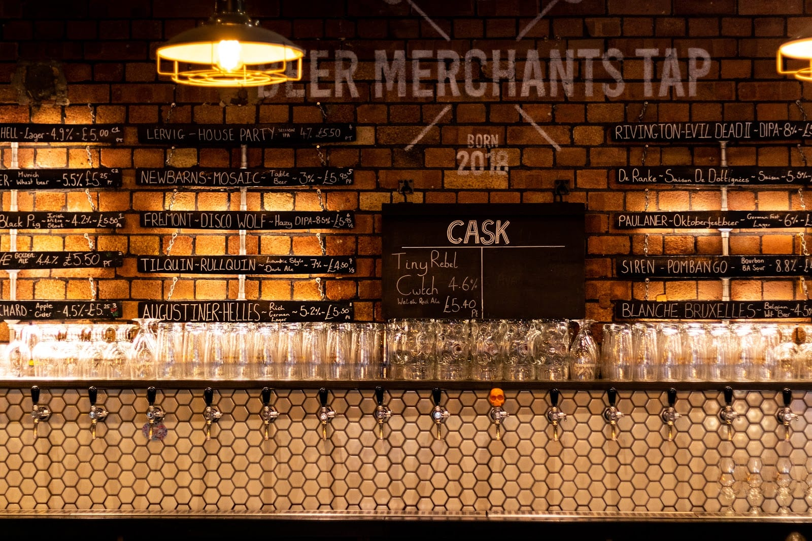

*The physical taproom for an online bottle shop that ships around a thousand different beers — hence the eclectic list.*

### Anspach & Hobday: The Arch House, Bermondsey — the porter that's taking on Guinness

*££ · Druid Street, Bermondsey · Cited by 6 sources*

Every one of this brewery's four independent citations here is a video crawl, none of them citing an award or a masthead — which for a Bermondsey Beer Mile stop is its own kind of evidence: this is the pub people actually walk to and film, not the one they read about. The beer to order is **London Black**, a revival of the old London Porter style, poured on draft at the brewery itself; one reviewer called the draft version "easily the best stout on the [mile]."

It's a working mixed-fermentation brewery with a taproom bolted on rather than a pub with a brewery attached — **twelve beers on tap**, arch-shaped ceiling, bottle shop by the door.

**Closes early, around 7pm** — this is a stop on an afternoon crawl, not an evening plan. 118 Druid Street, London SE1 2HH.

**Site:** [anspachandhobday.com/the-arch-house](https://www.anspachandhobday.com/the-arch-house)

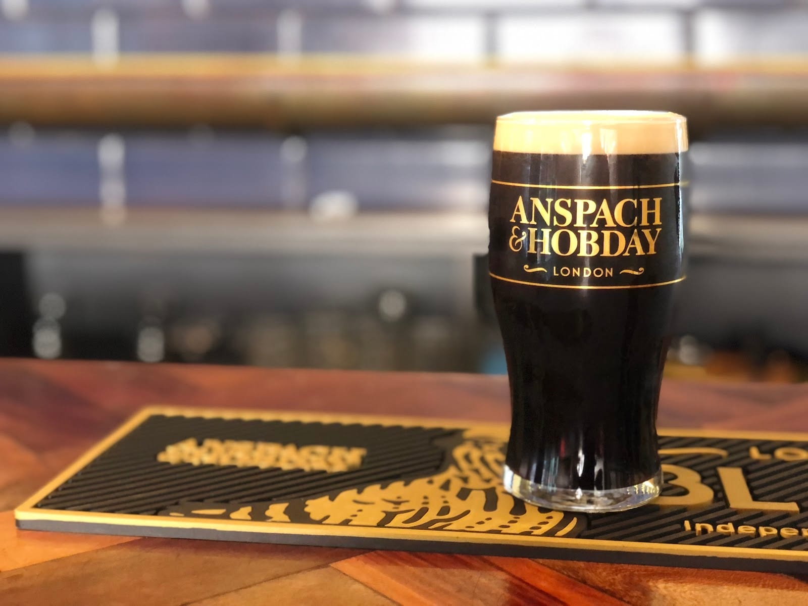

*London Black, the brewery's revival of the old London Porter style — the beer to order here.*

### The Kernel, Bermondsey — the brewery every other brewery name-checks

*££ · Spa Road, Bermondsey · Cited by 3 sources*

ShortList calls it **"London's most important independent brewery,"** and the other sources back the claim up with real specificity rather than just repeating it: MyBeerStops calls the flagship **Export India Porter** "legendary," and the taproom itself moved in August 2024 from an adjacent railway arch into a purpose-built ground-floor space — **twenty-five keg taps and two handpumps**, plus a Japanese kitchen sharing the room rather than a separate food stall.

If an older write-up sends you to "the arch," that's the pre-2024 site — brewing still happens there, but the bar moved next door.

**Closes at 8pm.** 132 Spa Road, London SE16 3AE.

**Site:** [thekernelbrewery.com/tap.php](https://www.thekernelbrewery.com/tap.php)

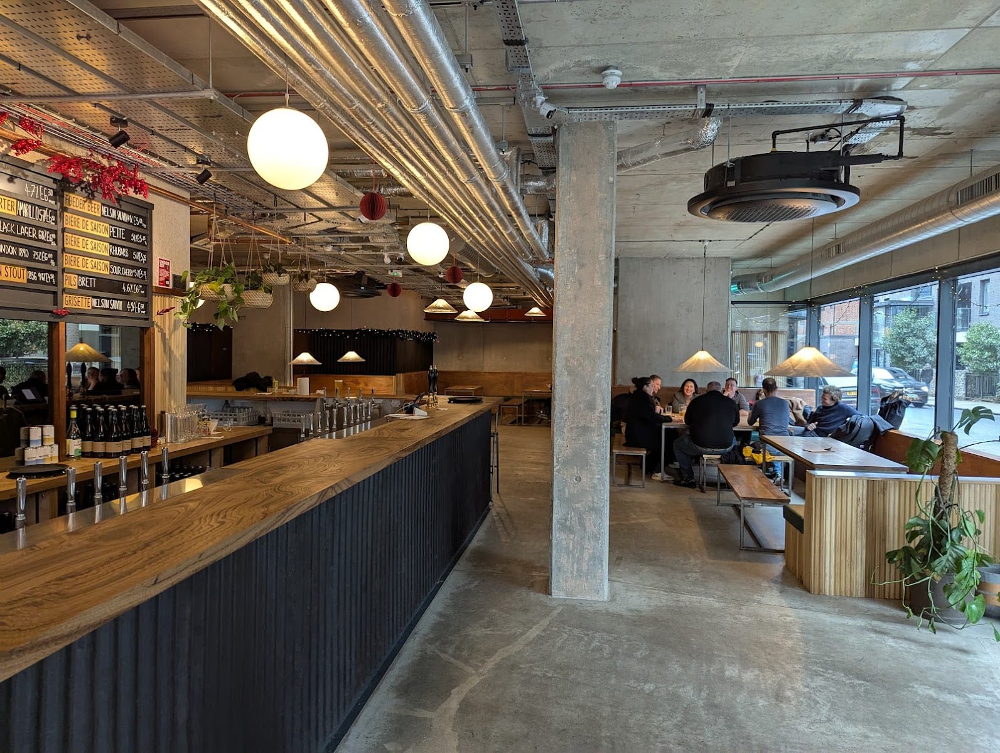

*The purpose-built ground-floor space the taproom moved into in August 2024, next door to where the brewing still happens.*

### The Southampton Arms, Gospel Oak — "Ales, Cider, Meat," and nothing else claimed

*£ · Gospel Oak · Cited by 3 sources*

The sign outside says **"Ales, Cider, Meat"** and the pub does not oversell beyond it — small-batch beers and ciders from UK independent breweries, a short menu built around meat rolls, and nothing resembling a wine list or a cocktail menu. Time Out notes the old piano against the wall that leads out to the beer garden and the crackly vinyl on the stereo, which is about as specific as this pub's whole personality gets.

It **now takes card as well as cash** — worth knowing, since it was cash-only for years and the old reputation persists.

**Open until midnight**, later than most of this list. 139 Highgate Road, London NW5 1LE.

**Site:** [thesouthamptonarms.co.uk](http://www.thesouthamptonarms.co.uk)

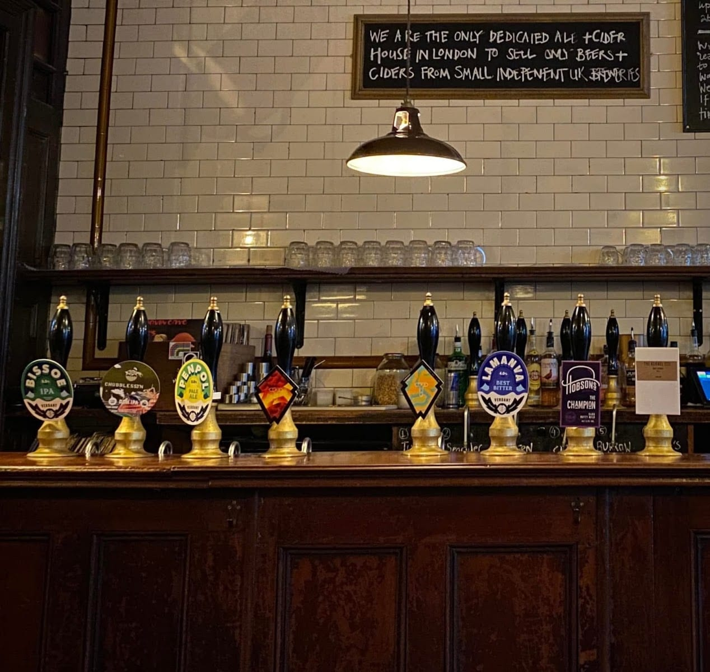

*Small-batch beers and ciders from UK independent breweries, exactly as the sign above the bar promises.*

### Euston Tap, Euston — a pub in a train station's gatehouse

*££ · Euston Road · Cited by 3 sources*

Two matching Grade II-listed lodges once marked the entrance to the old Euston station, and this is the west one — **"London's original cask ale, real cider and craft beer tavern,"** by its own description, running **forty-seven draught lines** with no brewery affiliation of its own, so the list is free to change entirely on the site's judgement rather than push one brand. One visitor singled out **London Black** — Anspach & Hobday's porter, turning up again — as the best stout they'd had in the country.

It's small: one ground-floor room, a smaller room upstairs, heated outside seating for the overflow, and a five-minute walk from the platforms if you're catching a train rather than starting a session.

**Closes at 10pm.** West Lodge, 190 Euston Road, London NW1 2EF.

**Site:** [eustontap.com](https://eustontap.com)

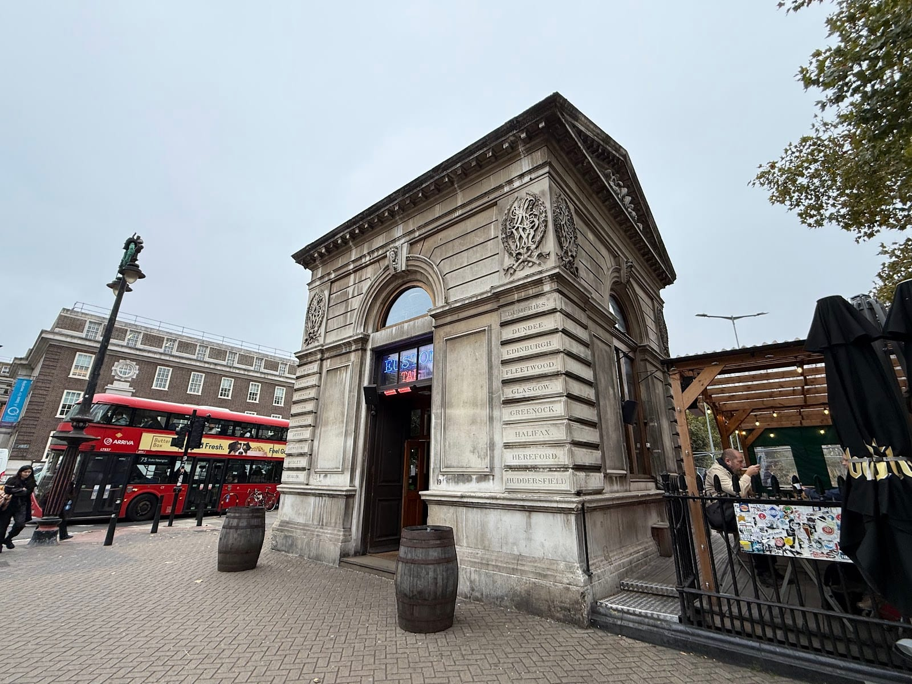

*One of two matching Grade II-listed lodges that marked Euston's old entrance — this is the west one.*

### The Rake, Borough Market — four handpumps, eighteen taps, one tiny room

*££ · Borough Market · Cited by 3 sources*

Run by Richard Dinwoodie and Mike Hill, the founders of the online retailer Utobeer, and billed as **"London's original beer bar"** — CAMRA's own listing counts **four handpumps and eighteen keg taps** in a space small enough that "tiny" undersells it. The selection leans toward changing, off-the-beaten-track brews rather than the safe list, which is exactly what draws serious beer drinkers to duck in behind the market stalls.

There's standing room rather than much seating, and it gets packed the moment Borough Market itself does — go early or go late.

**Closes at 10pm.** 14A Winchester Walk, London SE1 9AG.

**Site:** [utobeer.co.uk/the-rake](https://www.utobeer.co.uk/the-rake)

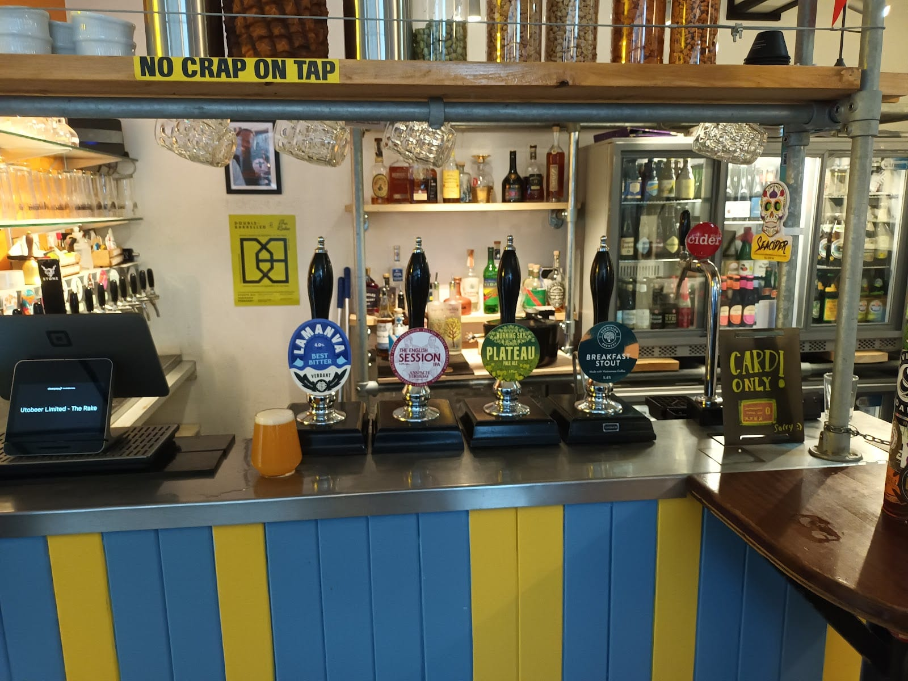

*Four handpumps and eighteen keg taps in a space small enough that "tiny" undersells it.*

---

Powered by <a target="_blank" rel="sponsored" href="https://www.getyourguide.com/london-l57/">GetYourGuide</a>

## By style: cask, keg or taproom

The sources describe three genuinely different scenes rather than three words for the same thing.

**Cask, or "real ale"** finishes conditioning in the cask itself and is pulled by handpump, or in a few pubs here, straight off the cask by gravity with no pump at all. This is CAMRA's whole territory and most of "the winners" section above pours it: The Cockpit and The Dodo Micropub both do it by gravity rather than handpump, which is the more old-fashioned and increasingly rare method. Beyond the award winners, **The Market Porter** at Borough Market runs twelve handpumps and — almost uniquely in London — opens 6am to 9am on weekdays under an old market trading licence, one of only two pubs left in the city with that right; the rest of its hours are conventional, to 10.30pm.

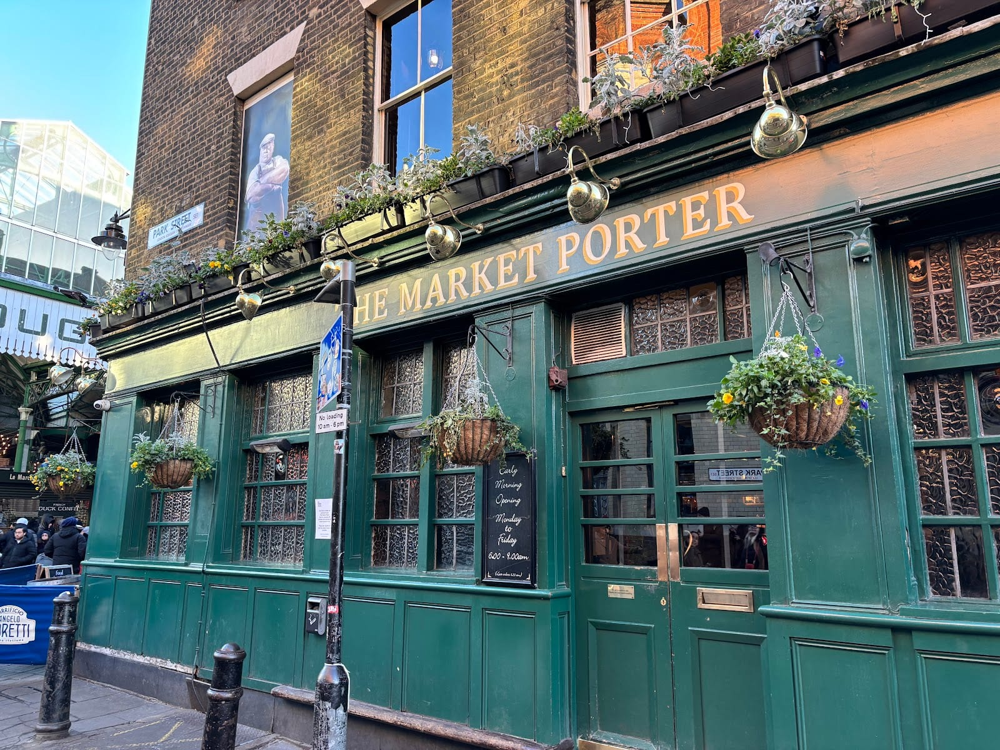

*One of only two London pubs left with a licence for the old market trading hours.*

**The Sutton Arms** in Clerkenwell is a small, traditional freehouse with an upstairs dining room, though it closes early, around 7pm most nights.

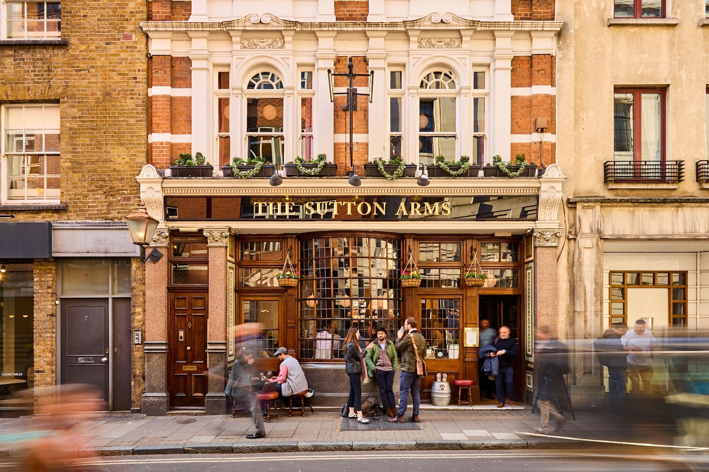

*A small, traditional freehouse with an upstairs dining room, tucked into a corner of Clerkenwell.*

Holborn's **Ye Olde Mitre** — a completely different pub from the Barnet CAMRA winner above despite the near-identical name — is covered in full in [London's historic pubs](/articles/historic-pubs-dining-rooms-london/); the short version for beer purposes is bar snacks only, closed Sundays, and a genuinely hidden entrance up an alley off Ely Place.

**Modern craft, or keg**, is chilled and carbonated before it reaches the pub — the sours, pastry stouts and hazy IPAs that don't exist in cask form. Cask Pub & Kitchen, Euston Tap, The Bear and Beer Merchants Tap above are all built around big keg lists rather than a handpump row, and BrewDog's UK arm went through a wave of bar closures in early 2026 after its sale to a new owner, which is a reminder to check a chain branch is still trading before making a special trip to one.

**Brewery taprooms** mean drinking where the beer is actually made, and London has settled on two beer miles for it.

**Bermondsey**, the run of railway arches south of Tower Bridge, is the original and the one with the deepest bench: The Kernel and Anspach & Hobday above are the anchors, and two independent video crawls — filmed three months apart, neither aware of the other — both stopped at the same further venues, which is real corroboration rather than one crawler copying another. **Cloudwater** and **The Barrel Project** are named by both; **Southwark Brewing Co**, **Bianca Road Brewery**, **Mash Paddle Brewery** and the **Dutch Taproom** (also chapter-listed as Craft Beer Junction) fill out the rest of the mile. Maltby Street Market sits in the middle of it and is worth timing around rather than through — it gets genuinely difficult to move during Saturday market hours.

**Blackhorse Lane** in Walthamstow is the newer version of the same idea, cheaper and less crowded. Exale above is the anchor; **Signature Brew's Blackhorse Road taproom**, **Pretty Decent's Blackhorse Road brewery and taproom**, and **Forest Road Taproom** are the other stops named repeatedly across the sources collected here.

---

## New openings

**The Black Eel, Dalston** — opened October 2025 inside the former F Cooke pie-and-mash shop, run by the same team as Exale. The room is the reason to go regardless of the beer: the original tiled pie-and-mash fittings are still up, which nobody else on this list can offer. One early visit after opening found the single cask offering flat and hard to see from most of the room — worth revisiting now the pub has had a year to settle in, rather than writing off on one report.

**The Three Lords, City of London** — taken on by London Brewing Co in late 2025 and trading again under the same roof, listed in some places as Ye Three Lords. A straightforward change of hands rather than a rebuild, with the beer now the brewery's own range.

---

Powered by <a target="_blank" rel="sponsored" href="https://www.getyourguide.com/london-l57/">GetYourGuide</a>

## What to know

**Most of this list is walk-in by design.** A micropub with one room and a handpump was never built to take a booking, and the CAMRA branch winners above are almost all this format — turn up, find a seat if there is one.

**The exception is anywhere with a real kitchen.** Jolly Coopers in Epsom books online through Dojo; The Bear in Paddington and The Dark Horse in Croydon both run their own booking pages for food. Check the specific pub rather than assuming either way — a chain or multi-site brewery can open and close branches quickly, as BrewDog's UK estate did in early 2026.

**Cash-only is rarer than the reputation suggests.** The Southampton Arms took cash only for years and now takes card as well; check the door rather than assuming a traditional-looking pub won't take a card.

**Hours vary more than in a restaurant guide.** Anspach & Hobday's taproom closes around 7pm; The Kernel's at 8pm; The Southampton Arms runs to midnight. If a session matters more than a specific pub, check the hours before travelling out to a single-site brewery taproom.

**"Real ale" and "craft beer" are not opposites here.** Most of the strongest pubs above pour both — a handpump row and a keg wall side by side — and the sources that call a pub one or the other are usually just describing what's currently on rather than the pub's whole identity.

---

## Continue planning your London trip

- 🍻 **[London's Historic Pubs and Dining Rooms](/articles/historic-pubs-dining-rooms-london/)**
- 🍽️ **[The Best Gastropubs in London](/articles/best-gastropubs-london/)**
- 🏛️ **[The Most Beautiful Pubs in London](/articles/most-beautiful-pubs-london/)**
- 🍺 **[The Best Wetherspoons in London](/articles/best-wetherspoons-pubs-london/)**
- 🍷 **[The Best Wine Bars in London](/articles/best-wine-bars-london/)**
- 🍸 **[The Best Cocktail Bars in London](/articles/best-cocktail-bars-london/)**
- 🍕 **[The Best Pizza in London](/articles/best-pizza-london/)**
- 🍽️ **[Eat in London: Restaurants, Food Markets & Quick Food Hub](/articles/eat-in-london-guide/)**
