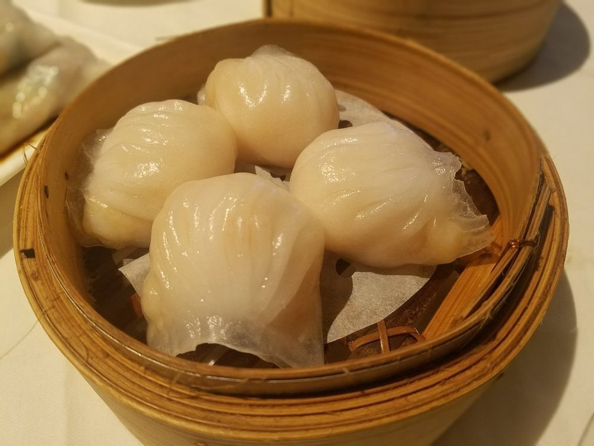
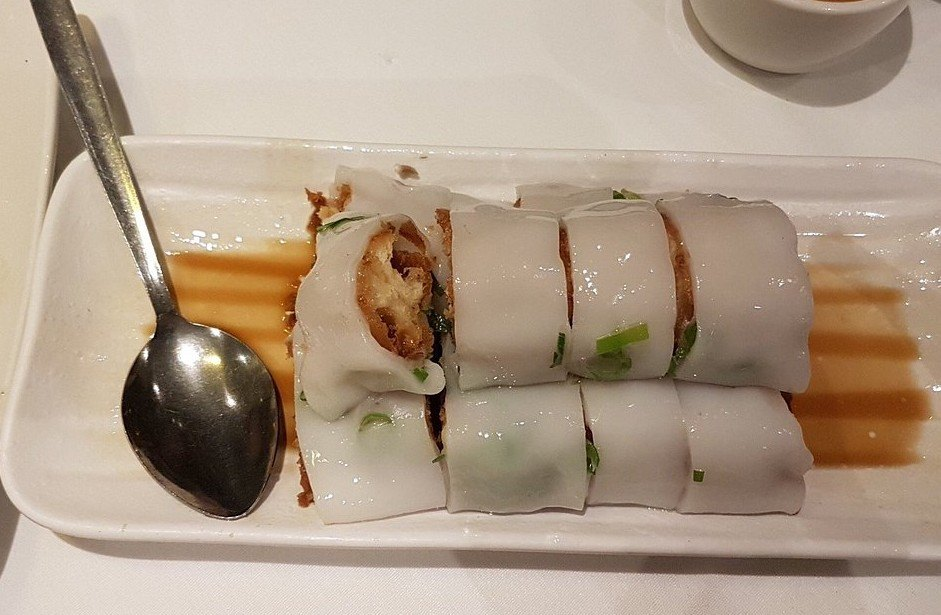
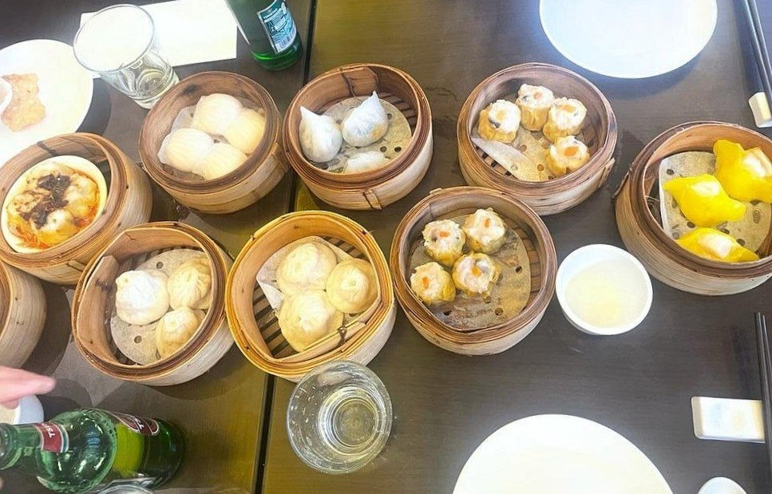
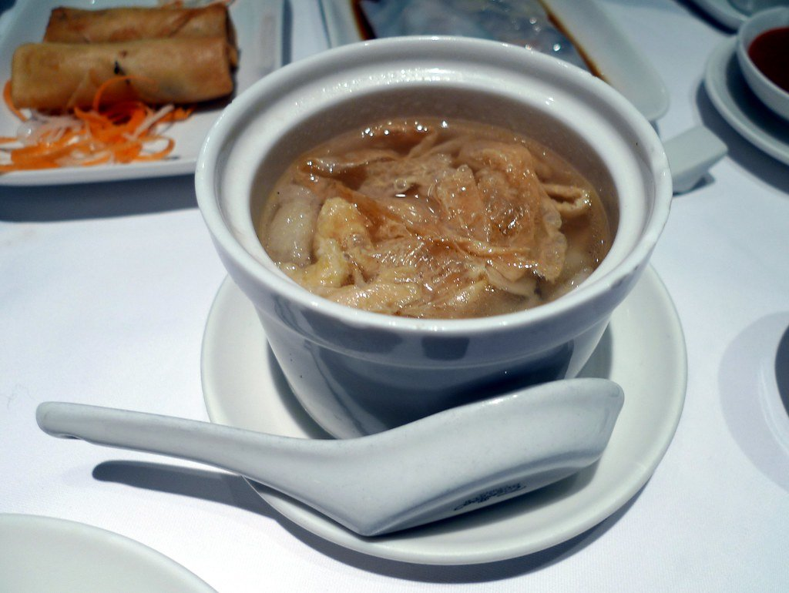
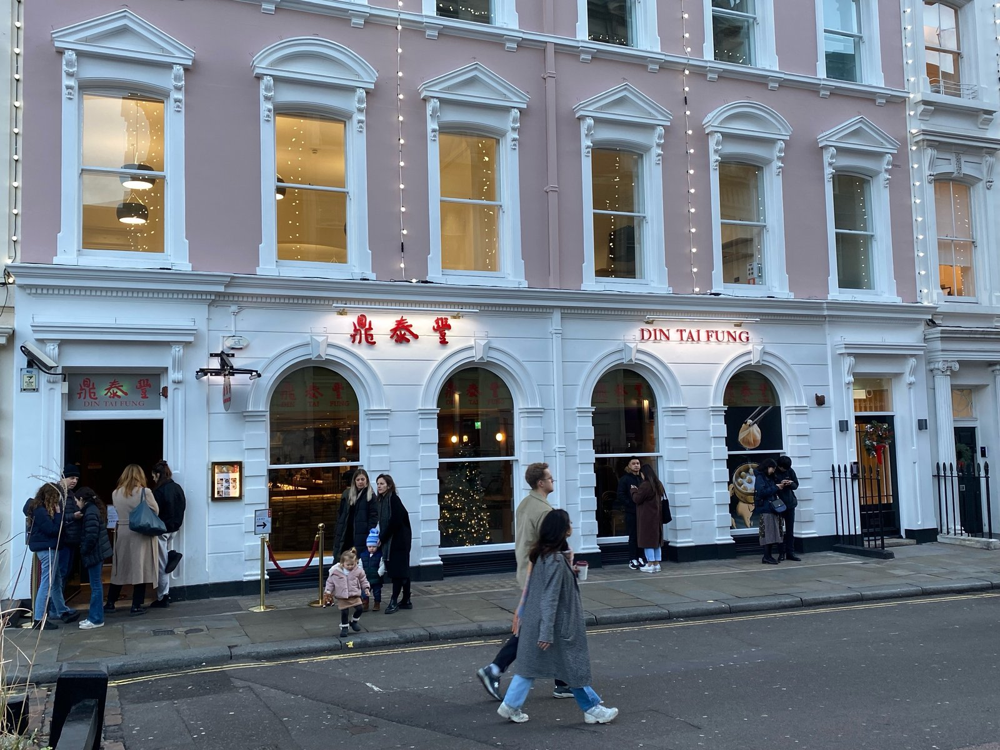
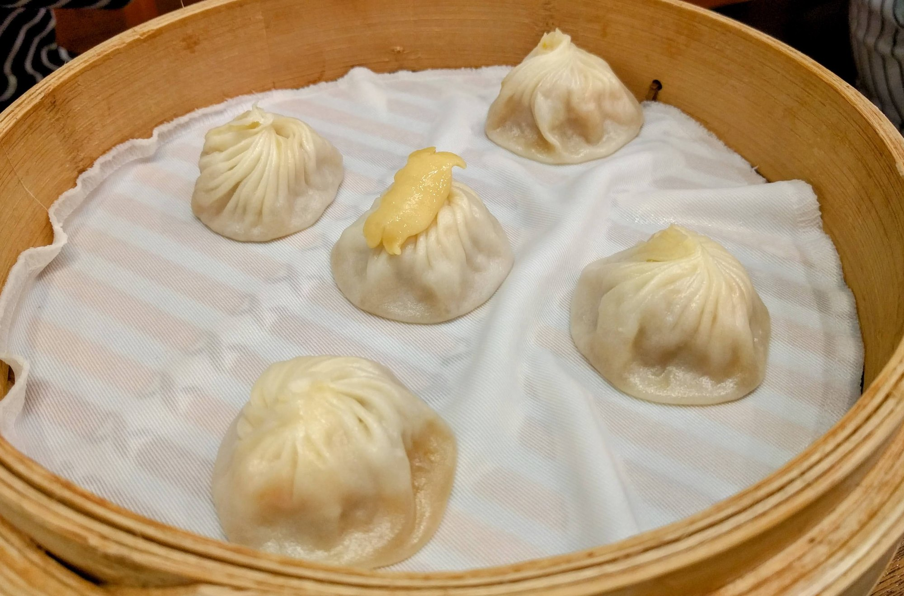

Dim sum in London runs from a two-Michelin-starred lunch in Victoria to a trolley-era room off Leicester Square that has not changed in decades, and the price gap between them is larger than the quality gap.

The single most useful thing to know: **most dim sum halls stop serving around 5pm.** It is a lunch, not a dinner, and turning up at 7pm expecting steamed baskets is the standard mistake.

> 💡 **The Short Version:** **Royal China** on Baker Street is the benchmark and takes no bookings at peak. **A. Wong** is the only two-starred Chinese kitchen in Europe and its lunch is the cheap way in. **Tao Tao Ju** is the refined end of Chinatown. **Dragon Castle** is half the price for the same thing. And **Yauatcha** serves all day.

> 📘 **How we choose these (editorial note)**
> No paid placements. These are drawn from a wide spread of sources rather than any single list - the food and travel press, the big listings sites, independent blogs and specialists, video, and what Londoners recommend themselves - and cross-referenced against each other. Service times are the detail that changes most — confirm before travelling.

## Where they are

  

    Map of the best dim sum in London
  

  

    
Loading the interactive map…

  

  <noscript>
    
The interactive map requires JavaScript. Every entry below lists its area.

  </noscript>

| If you are near… | Where to eat |
| --- | --- |
| **Chinatown & Leicester Square** | Tao Tao Ju, Plum Valley, Joy King Lau, Dumplings' Legend, BaoziInn, Orient London |
| **Soho** | Yauatcha |
| **Marylebone** | Royal China |
| **Victoria** | A. Wong |
| **Covent Garden** | Dim Sum Library, Din Tai Fung |
| **Paddington** | Pearl Liang |
| **South London** | Dragon Castle |

**Price guide:** **££** £15–£30 · **£££** £35–£55 · **££££** £70+.

---

## The best

### Royal China, Marylebone

*£££ · 8 min from Bond Street · no bookings at peak*

A black-and-gold banquet hall on Baker Street where **weekend dim sum runs at the volume of an airport terminal**. The benchmark every other London dim sum room is measured against.

No bookings at peak weekend times. The wait is real and worth it.

**No bookings at weekend lunch**, which is the whole character of the place: the busiest dim sum service in London, a queue down Baker Street, and a room that turns tables fast enough to make it bearable. Loud, built for groups and families, and eight minutes from Bond Street.

*Har gau at Royal China. The test of any dim sum kitchen is whether the wrapper holds together while still being thin enough to see through.*

### A. Wong, Victoria

*££££ · 7 min from Victoria · two Michelin stars*

The only **two-Michelin-starred Chinese restaurant in Europe**. Andrew Wong works through the regional cooking of the whole country, and the dim sum lunch is materially cheaper than dinner for the same kitchen.

**Lunch and dinner barely resemble each other.** The daytime dim sum is a different and far cheaper proposition than the evening tasting menu, and it is the one to book if you want the cooking without the ££££ commitment.

**Closed Sunday and Monday**, and the evening service books months ahead. Seven minutes from Victoria.

### Tao Tao Ju, Chinatown

*£££ · 2 min from Leicester Square*

**Towering bamboo baskets** of steamed and grilled dim sum, made fresh on site each day. The refined end of Chinatown, and the room to pick if you only eat there once.

Steamed and grilled, made fresh on site each day rather than bought in, which is not true of everywhere on Lisle Street.

It takes groups, dates and families equally well, and it is **two minutes from Leicester Square** — the easiest room here to reach and the least likely to disappoint someone who does not eat dim sum often.

*Cheung fun at Tao Tao Ju — rice noodle rolled around fried dough, cut into lengths and flooded with sweet soy.*

### Yauatcha, Soho

*£££ · 6 min from Piccadilly Circus · all day*

**All-day dim sum** with a patisserie counter downstairs, from the Hakkasan founder, and the answer when you want dim sum at 8pm.

---

It **held a Michelin star for fourteen years** and still cooks like it. Dim sum runs all day rather than stopping mid-afternoon, so it solves the 4pm problem that closes most of Chinatown's kitchens.

**Book weeks ahead**, and use it for a date or a pre-theatre meal — Piccadilly Circus is six minutes away and the patisserie counter downstairs is a reason to stay.

Powered by <a target="_blank" rel="sponsored" href="https://www.getyourguide.com/london-l57/">GetYourGuide</a>

## Chinatown

### Plum Valley

*£££ · Gerrard Street*

A family-run room in a black-fronted building, doing award-winning dim sum in a smarter setting than most of the street.

A **family-run Gerrard Street room** in a black-fronted building, doing award-winning dim sum in a smarter setting than most of Chinatown — tablecloths rather than laminate, and a quieter room for it.

Good for a date or a small group rather than a crowd, and three minutes from Leicester Square.

### Joy King Lau

*££ · off Leicester Square*

Four floors doing **trolley-era dim sum the old way**, largely unchanged while the street around it turned over. The most traditional room here.

Four floors off Leicester Square doing **trolley-era dim sum the old way**, largely unchanged while the street around it turned over.

It is the cheapest room on this page that anyone would recommend on its merits — **££ rather than £££** — and it takes families and groups without ceremony. Three minutes from Leicester Square.

### Dumplings' Legend

*££ · Gerrard Street*

A glass-walled kitchen where the **xiao long bao are folded in front of the queue** — Shanghainese soup dumplings rather than Cantonese steamed baskets.

A glass-walled kitchen on Gerrard Street where the **xiao long bao are folded in front of the queue** — Shanghainese soup dumplings rather than Cantonese steamed baskets, and the reason to come rather than a sideline.

**££ and quick**, which makes it the sensible choice with children or before a show. Three minutes from Leicester Square.

### BaoziInn

*££ · 1 min from Leicester Square*

Northern Chinese street food tidied up for London, in a room done out in Communist-era poster kitsch.

---

Northern Chinese street food tidied up for London, in a room done out in **Communist-era poster kitsch** that is either the charm or the problem depending on your temperament.

**Walk-in, ££, and one minute from Leicester Square** — the fastest way to eat well on this page if you have not booked anything.

### Dim Sum & Duck, King's Cross

*££ · Cantonese · walk-in*

Handmade dumplings and roast meats hanging in the window, on the King's Cross Road stretch that has quietly become one of the better places to eat in the area.

The name is the menu: dim sum, and Cantonese roast duck carved to order. Cheaper and less polished than anything in Chinatown, and better than most of it.

### Yauatcha City, Broadgate

*£££ · the City sibling*

The Broadgate branch of the Soho dim sum room, and the one to use if you are in the City — the same kitchen, usually easier to book, and a dining room built for the working week rather than for Soho.

### Yi-Ban, Royal Docks

*££ · closed Thursdays · dim sum to 4.30pm only*

A Cantonese dining room over the Royal Albert Dock with **City Airport's runway through the window**, trading since 2003 — planes landing over your dumplings is not something anywhere else offers.

**Dim sum is served until 4.30pm only, and it closes on Thursdays.** Worth the DLR trip, but not worth turning up unplanned.

**Closed Thursdays**, book a few days ahead, and six minutes from Royal Albert on the DLR. It is a long way from central London and that is the entire point: a full Cantonese dining room at ££, with planes landing over the dumplings.

## Best value

### Dragon Castle, Elephant and Castle

*££ · 114 Walworth Road*

South London's proper dim sum hall — a **full-size Cantonese banqueting room** at roughly half the central mark-up, and served through the day rather than only at lunch. Big enough to take a group without booking far ahead.

**Dim sum runs through the day rather than only at lunch**, which is unusual and useful. The room is large enough to take a group without booking far ahead, and loud enough that nobody minds children.

**££**, seven minutes from Elephant & Castle, and roughly half the central mark-up for the same food.

*A table at Dragon Castle. Ordering like this in Chinatown costs roughly double.*

### Pearl Liang, Paddington

*£££ · 2 min from Paddington*

An unexpectedly large **basement dining room behind Paddington station**, routinely rated above the Chinatown names by people who have eaten at both.

---

> **Two cheaper routes.** **Chinatown's supermarkets** — Loon Fung and See Woo — sell roast meats and some frozen dim sum over the counter at a fraction of restaurant prices. And **Bang Bang Oriental** in Colindale, Britain's largest Asian food hall, has several dim sum counters where you can eat a few baskets for well under £15.

*Hidden in a Paddington basement behind the station, and much better than its location suggests. Photo: [Ewan-M](https://www.flickr.com/photos/55935853@N00/3676852528), [CC BY-SA 2.0](https://creativecommons.org/licenses/by-sa/2.0/).*

---

**Five set menus** built for a table that wants to share rather than order dish by dish, which takes the guesswork out of a first visit.

**Book a few days ahead**, and note it is two minutes from Paddington — the best dim sum within reach of a train west, and routinely rated above the Chinatown names by people who eat a lot of Cantonese food.

## For an evening

Dim sum is a lunch. These are the exceptions.

### Dim Sum Library, Covent Garden

*£££ · 3 min from Covent Garden*

Dim sum in a **bar-led room** rather than a banquet hall, which makes it the one that works as an evening rather than a daytime meal.

Because it is bar-led rather than a banquet hall, it is **the one on this page that works as an evening out** — cocktails first, dumplings after, and a room that does not empty at 3pm.

£££, good for a date or pre-theatre, and three minutes from Covent Garden.

### Din Tai Fung, Covent Garden

*£££ · Taiwanese*

**Xiao long bao folded to eighteen pleats** behind glass — the Taiwanese chain Ken Hom put in the New York Times' top ten. A chain, but a serious one, and open into the evening.

*The Taiwanese soup-dumpling chain. You can watch them pleated through the window while you wait. Photo: [Heeheemalu](https://commons.wikimedia.org/w/index.php?curid=127443026), [CC BY-SA 4.0](https://creativecommons.org/licenses/by-sa/4.0/).*

---

**Walk-in queues are long at peak**, and the Centre Point site is the larger of the two with a bar lounge, so head there if the Covent Garden line looks hopeless.

£££ and loud, book weeks ahead for a weekend, and five minutes from Covent Garden.

*Xiao long bao at Din Tai Fung, one of them crab. The eighteen pleats are the house standard and the reason for the glass-walled kitchen.*

Powered by <a target="_blank" rel="sponsored" href="https://www.getyourguide.com/london-l57/">GetYourGuide</a>

## What to know

* **Most halls stop around 5pm.** Yauatcha, Dragon Castle, Dim Sum Library and Din Tai Fung are the exceptions.
* **Order three to four plates per person** and add more as you go. Ordering everything at once is how tables end up overwhelmed.
* **Har gau and siu mai** are the two every kitchen is judged on. Order both first.
* **Xiao long bao are Shanghainese**, not Cantonese — a different tradition on the same menus.
* **Royal China at weekends means queueing.** Go at opening or after 2pm.
* **A. Wong's lunch** is the cheapest route into a two-starred kitchen anywhere in London.

---

## Continue planning your London trip

- 🥟 **[Best Chinese and East Asian Restaurants](/articles/best-chinese-east-asian-restaurants-london/)**
- 💷 **[Cheap Eats in London](/articles/cheap-eats-london/)**
- 🍜 **[Soho Area Guide](/articles/soho-area-guide/)**
- 🍽️ **[Eat in London: Restaurants, Food Markets & Quick Food Hub](/articles/eat-in-london-guide/)**
- 🇯🇵 **[Best Japanese Restaurants in London](/articles/best-japanese-restaurants-london/)**
- 🎭 **[Covent Garden Area Guide](/articles/covent-garden-area-guide/)**
