Twenty-one hotels here are named by two or more independent sources specifically for families - not just "central London hotels" with a cot thrown in, but places parents, family-travel bloggers and the travel press keep pointing at for a room that actually fits two adults and two children. Every one is checked as trading, with its family room, cot policy, pool and nearest station taken from the hotel's own website.

> 💡 **The Short Version:** **[The Athenaeum Hotel & Residences](#the-athenaeum-hotel--residences)** is named by more sources for families than anywhere else in London - a Mayfair children's concierge, interconnecting rooms and serviced Residences with a bunk bed on request. **[The Landmark London](#the-landmark-london)** and **[St. Ermin's Hotel](#st-ermins-hotel)** have the biggest standard family rooms; **[The Goring](#the-goring)** and **[The Rubens at the Palace](#the-rubens-at-the-palace)** are the two family-run names closest to Buckingham Palace. On the South Bank, **[London Marriott Hotel County Hall](#london-marriott-hotel-county-hall)** and **[Park Plaza County Hall](#park-plaza-county-hall)** put a family between the London Eye and Big Ben. Further out, only one hotel earned its place: **[Town Hall Hotel and Apartments](#town-hall-hotel-and-apartments)** in Bethnal Green, for a pool and a two-Michelin-starred restaurant downstairs. Prices below are for one room sleeping two adults and two children, on a November weekday; the cheapest of them is **£257**.

> 📊 **The evidence behind this guide.**
> Nothing here is ranked on one stay. This pass reads **36 sources carrying 351 citations** across **213 named hotels**: the editorial mastheads (Time Out, Condé Nast Traveller, The Independent, Glamour UK), Mumsnet's own family-hotel reviews, family-travel specialist blogs (Family Hotel Expert, Kids Are A Trip, MummyTravels, Marcie in Mommyland, Santorini Dave, The London Mother, Families Love Travel, Travel Mad Mum, Family Traveller), one YouTube family vlogger and 12 Reddit threads across r/uktravel, r/LondonTravel, r/london, r/marriott, r/hyatt, r/Hilton, r/travel and r/awardtravel. **61 hotels are named by two or more independent sources.** No judged family-hotel award exists for London to check against - the Family Traveller Awards 2026 were read in full and name no London property.
> *Evidence rebuilt 15 September 2026 · [How we rank →](/how-we-rank/)*

## The winners

These eight are named by six or more independent sources - the deepest evidence of any hotels in the guide.

### The Athenaeum Hotel & Residences

*Mayfair · 2 min from Green Park · Typical family night £1,066 · Cited by 10 sources · [Hotels.com](hotelscom:175165)*

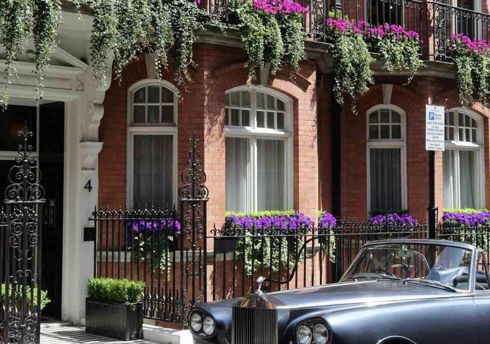

*The Victorian red-brick exterior of The Athenaeum Hotel & Residences on the corner of Piccadilly and Down Street.*

The room that actually fits a family of four here is the two-bedroom, two-bathroom Royal Parks View Suite, or one of the 18 serviced Residences - 550 sq ft with a kitchen, washing machine and, on request, a bunk bed for children, confirmed on the hotel's own FAQ page ("Absolutely. The Residences are designed with families in mind... bedrooms can be set up to welcome little ones comfortably, with bunk beds available"). Ordinary rooms run 204 to 280 sq ft and interconnect on request. What makes it a family name rather than just a nice Mayfair address is the dedicated Children's Concierge: Kids Are A Trip's contributor found their connecting rooms "sufficient" for a family stay, and Mumsnet's verdict singles out the concierge for supplying "kites, bikes and duck food" and pre-stocking the room with a child's favourite toys before arrival. Green Park is two minutes' walk, and Hyde Park Corner and Buckingham Palace are both under ten. One thing that decides a stay: this is the one to book if you want staff who plan the visit for you rather than a big playroom on site - there's no pool.

### The Landmark London

*Marylebone · 1 min from Marylebone station · Typical family night £963 · Cited by 8 sources · [Hotels.com](hotel:the-landmark-london)*

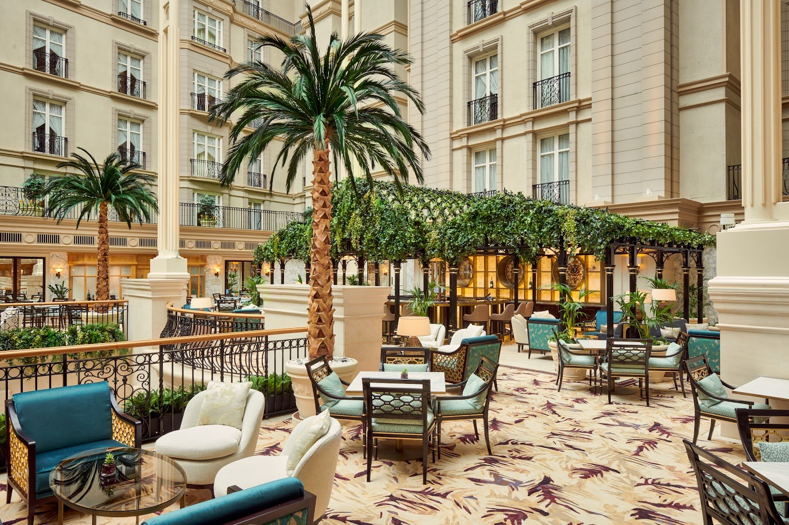

*The Winter Garden atrium at The Landmark London, an eight-storey glass-roofed courtyard planted with mature palms.*

The Landmark's own site lists an Executive Family Room - "wonderfully spacious... with two Double size beds and an open plan comfortable lounge area" - alongside a dedicated Marylebone Family Suite and Family Studio. Mumsnet's review puts a number on it: the family room runs to 560 sq ft, big enough for the play tents the hotel supplies on request, and sits above a 15-metre chlorine-free pool with dedicated family swim times. Glamour UK's account adds a tepee, a head-torch and a teddy bear at check-in, plus breakfast under the palm trees of the glass-roofed Winter Garden. It stands across the road from Marylebone station. One thing that decides a stay: the atrium hosts a bottomless Sunday brunch, so ask for a room away from it if a quiet evening matters more than the palm trees.

### The Goring

*Belgravia · 4 min from Victoria · Typical family night £2,564 · Cited by 8 sources · [Hotels.com](hotel:the-goring)*

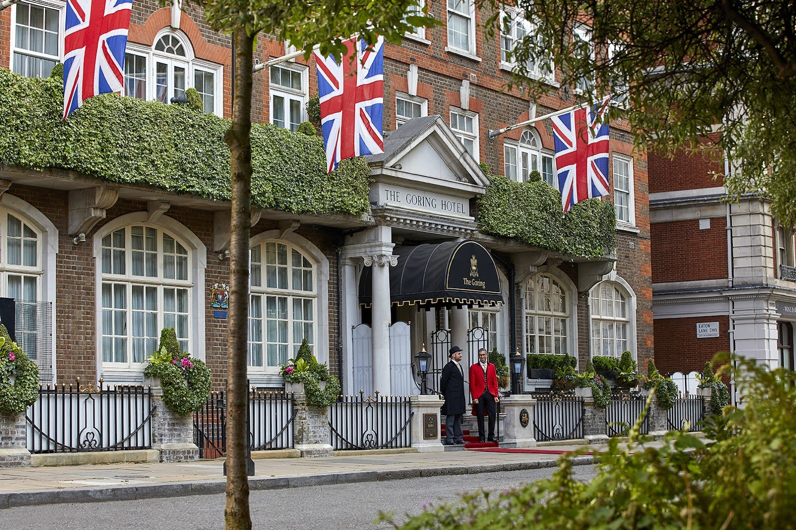

*The Goring's entrance on Beeston Place in Belgravia, flying Union flags beside Buckingham Palace.*

The Goring's own family-rooms page is explicit: interconnecting rooms "sleeping two adults and up to three children (an additional bed can be provided)," with cots, bottle warmers and babysitters arranged for babies. It is the oldest family-owned hotel in this guide - run by the same family for four generations - and that shows in the detail: a dressing-up box of British costumes, a Bedtime Story Library, and a cuddly "Baa-bara" sheep waiting in the room, all confirmed independently by The Independent, Glamour UK and Visit London. There is no pool, and the Michelin-starred Dining Room is a grown-up space, but the Veranda's afternoon tea has its own children's menu. Buckingham Palace's garden wall runs along the street behind the hotel, and Victoria station is four minutes on foot. One thing that decides a stay: book the interconnecting rooms specifically when you call, since the standard room alone does not sleep a family of four.

### St. Ermin's Hotel

*Westminster · 3 min from St James's Park · Typical family night £591 · Cited by 8 sources · [Hotels.com](hotel:st-ermins-hotel)*

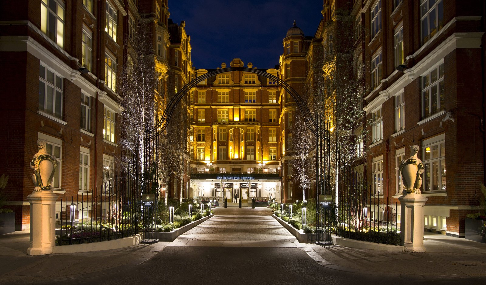

*The tree-lined courtyard entrance to St. Ermin's Hotel on Caxton Street in Westminster.*

The single biggest standard family room in this guide, confirmed on St. Ermin's own site: "two queen beds, two bathrooms, a sofa bed and a sitting area... ideal for a young family of two adults and up to four children." Room categories across the hotel run 16 to 60 sqm. A Reddit user on r/marriott calls it "delightful and in a very convenient spot near the tube in Westminster" - Kids Are A Trip and MummyTravels both single it out for a kids' concierge, a spy-themed trail around the building (it was a WWII intelligence base) and a beehive on the terrace that supplies its own honey at breakfast. There is no pool. St James's Park station is three minutes away, and Buckingham Palace is an eight-minute walk. One thing that decides a stay: the two-bathroom family suite is the room to ask for by name - other rooms here are not sized for four.

### Taj 51 Buckingham Gate Suites and Residences

*Westminster · 5 min from St James's Park · Typical family night £948 · Cited by 7 sources · [Hotels.com](hotelscom:193292)*

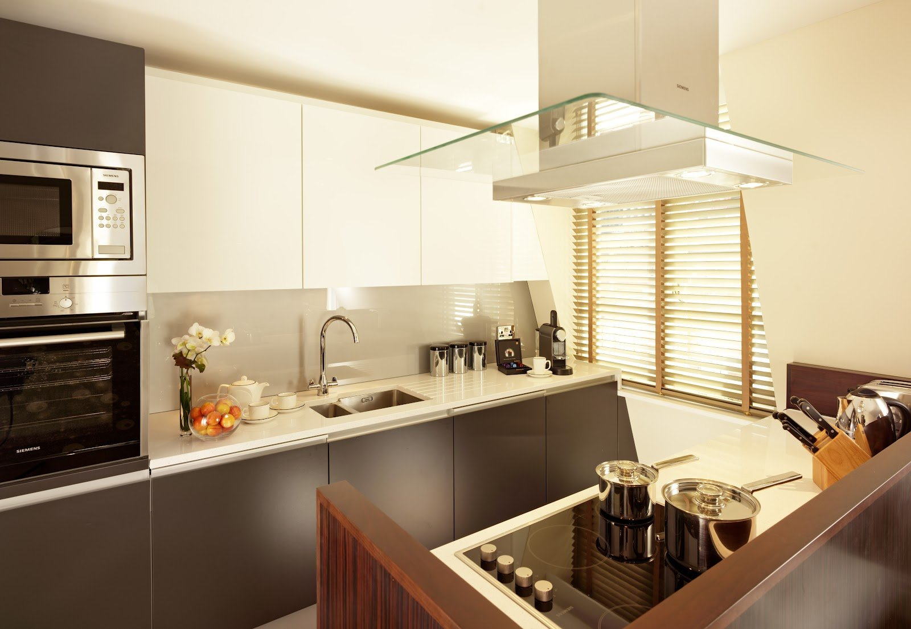

*A fully fitted kitchen inside one of the multi-bedroom family residences at Taj 51 Buckingham Gate.*

This is a suites-and-residences hotel rather than a standard room format: one, two and three-bedroom suites with full kitchens and washer-dryers, confirmed on the hotel's own site alongside complimentary infant cots for children aged 0 to 2. Santorini Dave calls the two and three-bedroom residences "one of the best choices in London for larger families who want an apartment without giving up 5-star hotel service," and Family Hotel Expert, who stayed, notes the breakfast runs to a made-to-order cooked menu with Asian dishes alongside the buffet. It sits on Buckingham Gate itself, a few minutes' walk from Buckingham Palace, with the Michelin-starred Indian restaurant Quilon attached. There is no pool. One thing that decides a stay: this is priced and configured as a residence, not a hotel room, so it suits a week's stay more than a single night.

### The Rubens at the Palace

*Victoria · 3 min from Victoria station · Typical family night £727 · Cited by 7 sources · [Hotels.com](hotel:the-rubens-at-the-palace)*

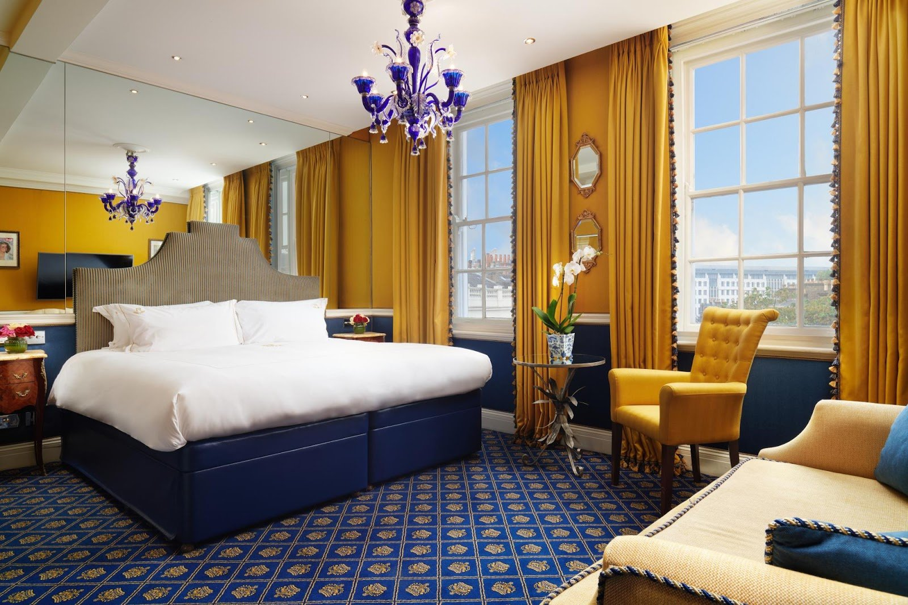

*A guest room at The Rubens at the Palace, overlooking the Royal Mews of Buckingham Palace.*

The Rubens' own site describes "family wings, which connect several rooms with internal doors" and "can accommodate four to 12 people, depending on availability" - booked directly through the reservations team rather than online. Ordinary interconnecting rooms are also available. Overlooking the Royal Mews at Buckingham Palace, it runs a Prince and Princess children's menu, a cupcake-decorating class and, per MummyTravels and Family Hotel Expert, a dedicated children's afternoon tea. Kids Are A Trip's review calls the check-in for children and the milk-and-cookies bedtime service "the best hotel in London for kids." There is no pool. Victoria station, with its Gatwick Express and mainline connections, is three minutes' walk. One thing that decides a stay: the family wings have to be requested by phone, not booked through the website, so call ahead of a trip in school holidays.

### The Berkeley

*Knightsbridge · 5 min from Knightsbridge station · Cited by 6 sources · [Hotels.com](hotel:the-berkeley)*

*The rooftop swimming pool at The Berkeley in Knightsbridge, with loungers overlooking Hyde Park.*

The Berkeley's own homepage confirms "two sublime pools," including a heated open-air rooftop pool for hotel guests, open in spring and summer. The Independent's account of a family stay adds that "interconnecting suites offer plenty of space for parents to unwind as little ones enjoy their own sleepover." Families staying in a suite get a complimentary second bedroom; a standard room plus a second room is half price. Every child's bed arrives with balloons, a mini bathrobe and child-safe toiletries, and the children's concierge runs piping masterclasses with pâtissier Cédric Grolet's team. Knightsbridge station and Harrods are both a five-minute walk. One thing that decides a stay: the rooftop pool is outdoors and open only in spring and summer, so check it is open before booking around it.

### Claridge's

*Mayfair · 4 min from Bond Street · Typical family night £4,131 · Cited by 6 sources · [Hotels.com](hotel:claridges)*

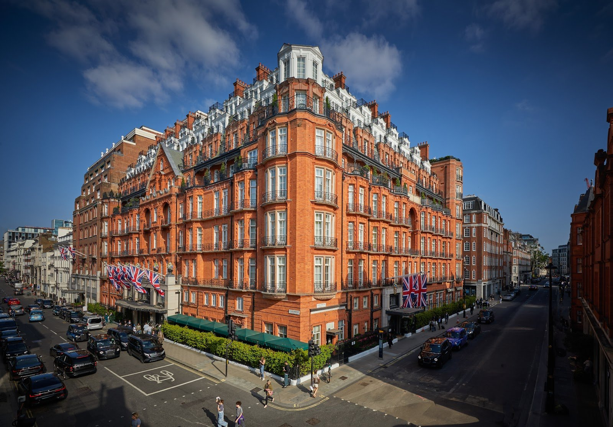

*Claridge's Victorian red-brick and terracotta frontage on Brook Street in Mayfair.*

Glamour UK's account is specific: connecting rooms, a personalised Claridge's teddy bear and umbrella for children, a choice of "comic" delivered with the grown-ups' papers, and warm milk and a cookie at turndown. Condé Nast Traveller and Conde Nast Traveler both keep it on their family shortlists year after year, and The Independent notes children's menus run across the hotel's restaurants, including a version of its famous afternoon tea. Babysitting is available at a stated £60 for the first four hours. It is one of the most photographed Art Deco interiors in London, five minutes from Bond Street's Elizabeth line platform. There is no pool. One thing that decides a stay: connecting rooms need requesting directly with reservations, and Claridge's does not publish a self-contained family suite the way The Goring or St. Ermin's do.

Powered by <a target="_blank" rel="sponsored" href="https://www.getyourguide.com/london-l57/">GetYourGuide</a>

## Also strongly backed

Named by four or five independent sources.

### The Ritz

*Piccadilly · 2 min from Green Park · Cited by 5 sources · [Hotels.com](hotel:the-ritz-london)*

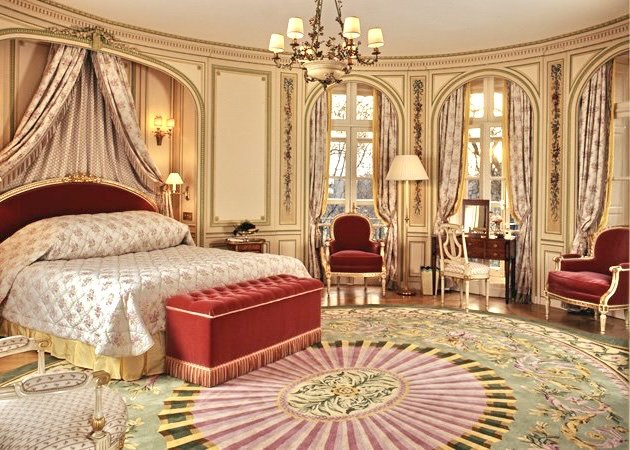

*A Louis XVI-style bedroom suite at The Ritz London with draped canopy and gilt mouldings.*

The Ritz's own room pages confirm "family rooms" sit alongside its Junior Suites, though the specific family layout isn't published with a square-metre figure the way its Deluxe (42 sqm) and Grand Deluxe (55 sqm) rooms are. Visit London and Glamour UK both describe the Kidz@TheRitz programme: a children's version of the famous Palm Court afternoon tea, in-room games consoles, and the dress code formally suspended for under-16s. There is no pool. Green Park is two minutes away, and Buckingham Palace is a ten-minute walk through the park. One thing that decides a stay: ask reservations to confirm the family room's exact configuration before booking - it is the one specific fact The Ritz's own site does not spell out.

### Royal Lancaster London

*Bayswater · 2 min from Lancaster Gate · Cited by 5 sources · [Hotels.com](hotel:royal-lancaster-london)*

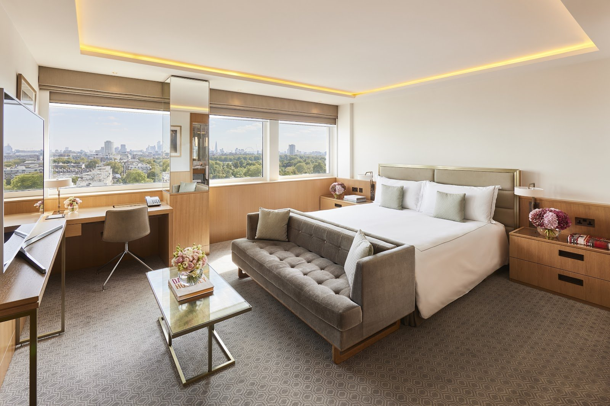

*A family-sized suite at the Royal Lancaster London, with a lounge area and wide windows looking towards Hyde Park.*

Royal Lancaster's own site names the room to book: "Classic Family rooms... two interconnecting rooms, each with their own King size bed and twin beds," with two marble bathrooms between them. A Reddit user on r/LondonTravel who compared it directly against The Londoner chose the Royal Lancaster "because it fit better with where we wanted to be located" - opposite Hyde Park and Kensington Gardens, with the Diana Memorial Playground a ten-minute walk. Glamour UK adds a teepee, a welcome cake and a toy Paddington Bear to take home; children's toiletries are by Child's Farm. There is no pool. One thing that decides a stay: Lancaster Gate station on the Central line is next door for the West End, and Paddington, for the Heathrow Express and the Elizabeth line, is six minutes' walk.

### London Marriott Hotel County Hall

*South Bank · 8 min from Waterloo · Typical family night £581 · Cited by 5 sources · [Hotels.com](hotel:marriott-county-hall)*

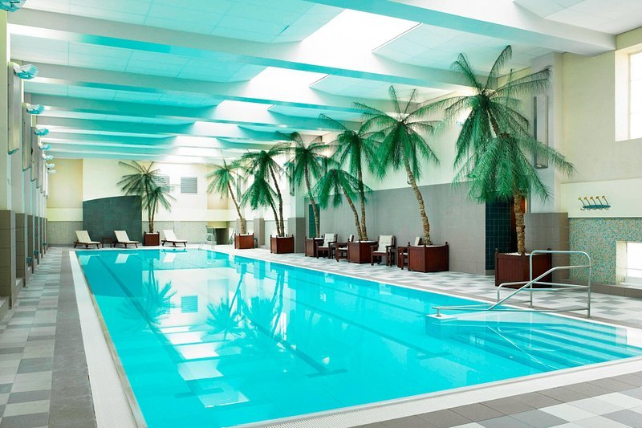

*The 25-metre indoor swimming pool under a vaulted glass ceiling at London Marriott Hotel County Hall.*

Mumsnet's review describes "big, airy family rooms with two double beds" inside the same grand riverside building as the London Eye and the old County Hall chamber, plus a 25-metre pool with family swimming hours from 8am to 6pm and a 6,000 sq ft gym on the top two floors. Kids Are A Trip singles out the Executive Double Double, which sleeps four, and a two-bedroom suite for five. Marcie in Mommyland, writing from friends' reports rather than her own stay, flags one genuine catch: it is a converted historic building, and "some rooms are far from the elevators" - ask for one near the lifts when booking with children and luggage. Big Ben and the Houses of Parliament are across the river. There is no direct step-free route to every room. One thing that decides a stay: request a room near the lifts at booking, not at check-in.

### Park Plaza County Hall

*South Bank · 7 min from Waterloo · Typical family night £315 · Cited by 4 sources · [Hotels.com](hotelscom:258400)*

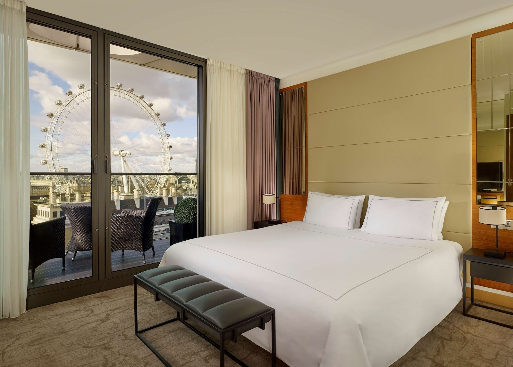

*A family room at Park Plaza County Hall, with floor-to-ceiling windows looking directly onto the London Eye.*

A separate hotel from the Marriott in the same County Hall complex. Time Out and Family Traveller both list it for families, and Family Traveller's own capsule is specific: a kids' menu, rooms with kitchenettes, a private family breakfast area, free pizza-making classes and a penthouse suite on the 14th floor "where you can wow the kids with views over the city." A r/LondonTravel thread comparing New Year hotel options recommends it directly: "I'd also recommend staying at the County Hall Park Plaza. Amazing hotel in terms of location and convenience." The London Eye is five minutes away on foot. One thing that decides a stay: check which of the two County Hall hotels - this one or the Marriott next door - actually has a family room free on your dates, since both draw on the same small, in-demand building.

### Mandarin Oriental Hyde Park

*Knightsbridge · 2 min from Knightsbridge station · Typical family night £3,485 · Cited by 4 sources · [Hotels.com](hotel:mandarin-oriental-hyde-park)*

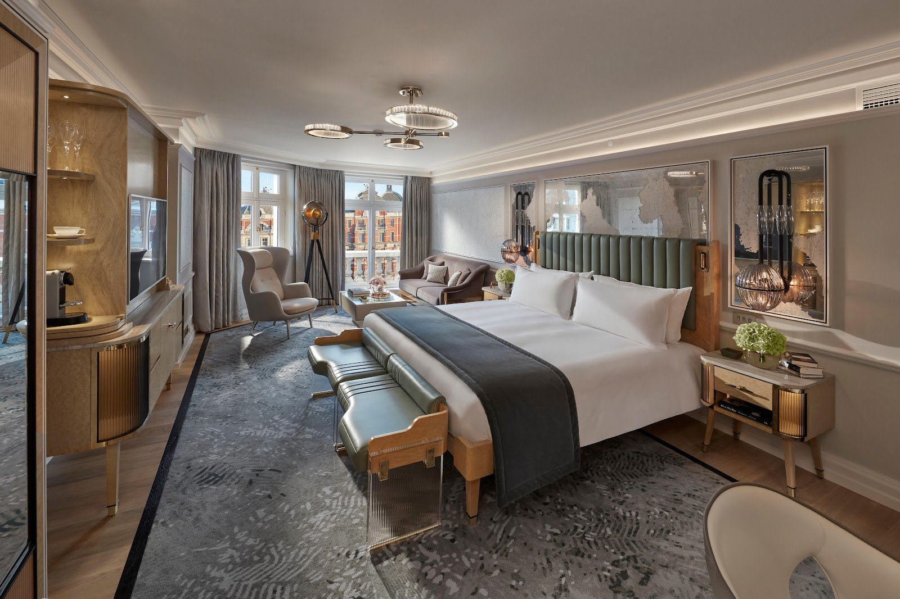

*A guest room at Mandarin Oriental Hyde Park, designed by Joyce Wang with views towards the park.*

The hotel's own site confirms connecting rooms by name: "the Mandarin Family Room and the Knightsbridge Family Room... especially suitable for families... available upon request, subject to availability." Glamour UK's account adds the detail that a second, interconnecting room is half price when the family package is booked, with all children's meals included and a basement spa pool open to families with no restricted hours. Kids Are A Trip's contributor calls the rollaway-bed space in the suites "incredibly spacious." Hyde Park is across the road, and Harrods and Knightsbridge station are both two minutes away. One thing that decides a stay: the family package with the half-price second room has to be booked as a package, not assembled from two separate room bookings.

### The Lanesborough

*Hyde Park Corner · 1 min from Hyde Park Corner · Cited by 4 sources · [Hotels.com](hotel:the-lanesborough)*

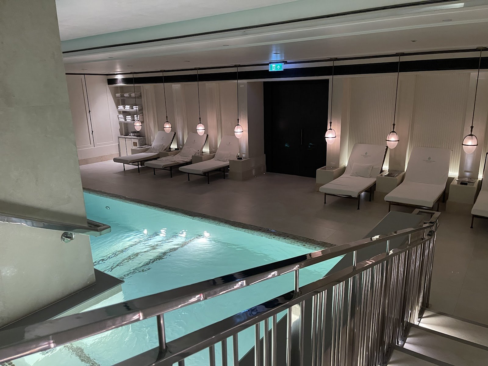

*The hydrotherapy pool at The Lanesborough Club & Spa, with dedicated family splash hours.*

Condé Nast Traveller UK and US, The Independent and Glamour UK together describe a Little VIP Club wallet handed to children at check-in, redeemable for free drinks and ice cream, plus dedicated splash hours at the spa pool and activities including butler school, horse riding in Hyde Park and mocktail workshops. Connecting suites are the standard family configuration. It is directly on Hyde Park Corner, with the park itself across the road and the museums of South Kensington a short taxi away. One thing that decides a stay: connecting suites are the standard family configuration here rather than a single named family suite - book the connecting pair specifically, since one suite alone does not sleep four.

### Brown's Hotel

*Mayfair · 3 min from Green Park · Typical family night £2,530 · Cited by 4 sources · [Hotels.com](hotel:browns-hotel)*

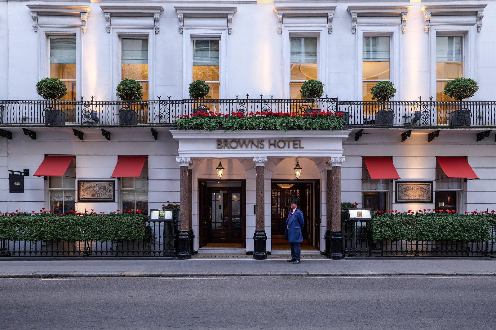

*Brown's Hotel on Albemarle Street in Mayfair, London's oldest hotel, opened in 1837.*

Brown's own site lists an Interconnecting Family Room and a Two Bedroom Family Suite "designed with families in mind." The Rocco Forte Kids programme, confirmed by Family Traveller and Families Love Travel, bands its welcome amenities by age - babies 0 to 3, kids 4 to 12, teens 13 to 16 - so a four-year-old and an eleven-year-old each get something pitched to them rather than the same teddy bear. Embroidered bedding, a kid's menu at The Drawing Room and a Mummy-and-me spa option round it out. There is no pool - the spa has none, so it is not the booking if swimming matters. Green Park is three minutes' walk. One thing that decides a stay: ask specifically for the Rocco Forte Kids amenities when booking, since they are a programme rather than a standing feature of every room.

### DoubleTree by Hilton London Kensington

*Kensington · 6 min from High Street Kensington · Typical family night £277 · Cited by 4 sources · [Hotels.com](hotelscom:107090)*

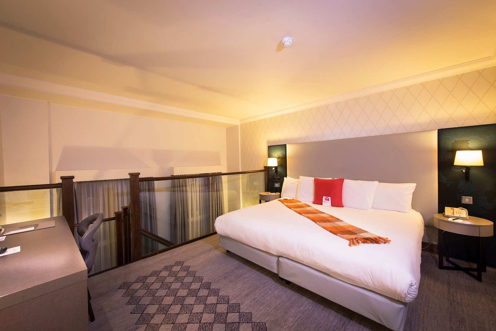

*A split-level family room at DoubleTree by Hilton London Kensington, with a mezzanine sleeping platform.*

Family Hotel Expert, who stayed, describes a split-level family room: "a bedroom at the top and a lounge on the ground floor with a sofa bed which staff will transform into the second bedroom in the evening," plus a small children's play area next to the restaurant and - unusually for central London - a private garden to burn off energy outdoors. It was Crowne Plaza London Kensington until a rebrand; Santorini Dave's older Q&A answers still use the previous name for the same building. The Natural History Museum and Science Museum are a short walk away. There is no pool. One thing that decides a stay: the split-level room only has one proper bedroom, so it suits younger children happy in a ground-floor sofa bed more than teenagers who want a door of their own.

### The Ampersand Hotel

*South Kensington · 2 min from South Kensington station · Cited by 4 sources · [Hotels.com](hotel:the-ampersand-hotel)*

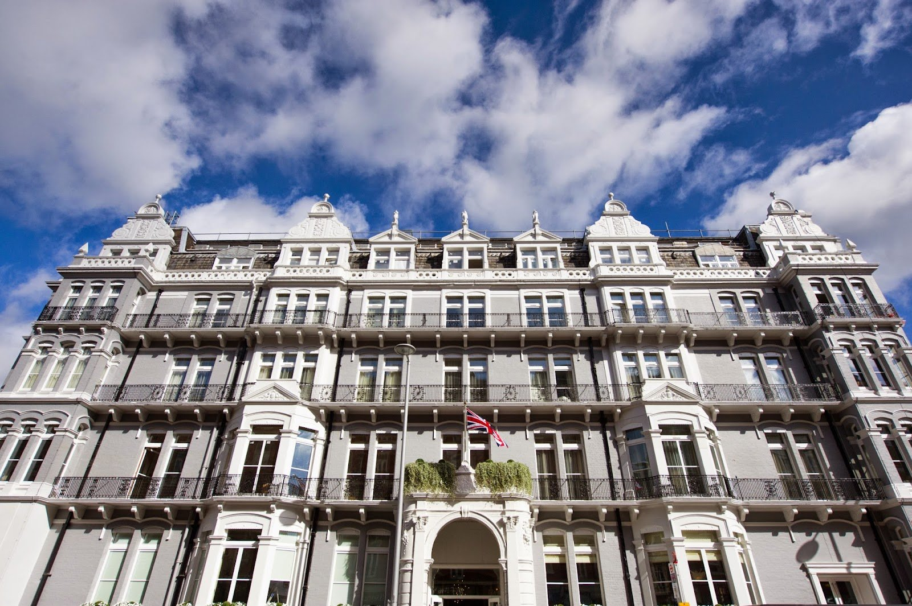

*The Victorian facade of The Ampersand Hotel on Harrington Road, two minutes from South Kensington's museums.*

The Ampersand's own site names the room built for this guide's exact brief: the Science Family Suite, "thoughtfully created for families, the suite draws inspiration from the neighbouring Science Museum." Mumsnet and Family Traveller both note the museum-themed afternoon teas (a Science Afternoon Tea with dinosaur biscuits), a games room with a ping pong table, and interconnecting rooms as an alternative to the suite. It is two minutes from South Kensington station and three from the Natural History Museum, with the Science Museum and the V&A both a short walk further. There is no pool. One thing that decides a stay: the Science Family Suite is one specific room, not a category - check it is the one being offered before paying a family-suite rate.

### Hilton London Metropole

*Edgware Road · 2 min from Edgware Road · Typical family night £305 · Cited by 4 sources · [Hotels.com](hotelscom:170309)*

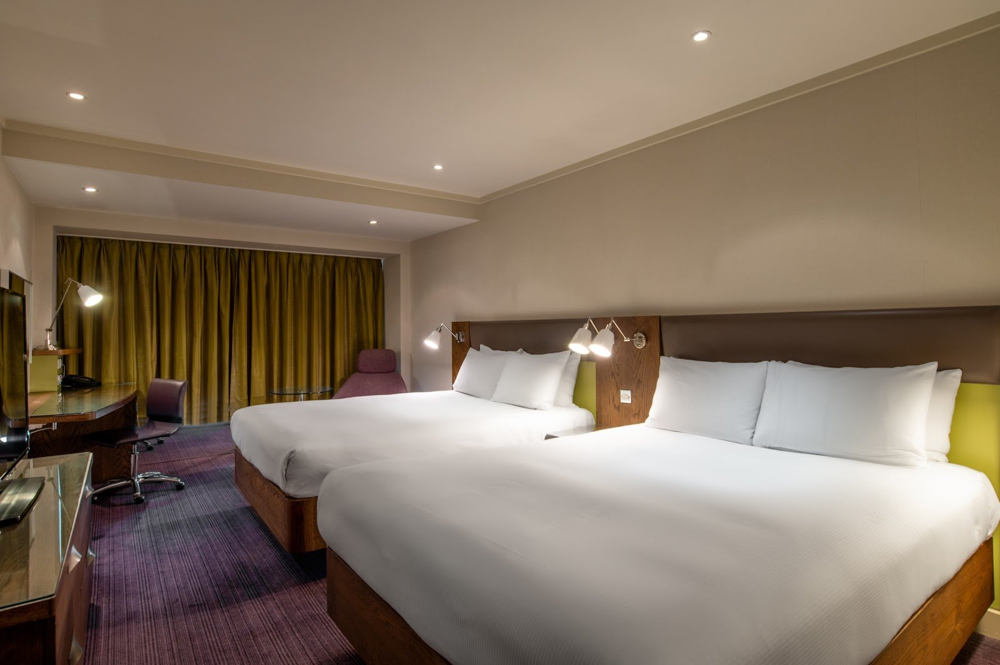

*A family room with two double beds at the Hilton London Metropole on Edgware Road.*

Family Hotel Expert, who stayed, confirms "interconnecting rooms and great family rooms which are large and well appointed," plus an indoor heated pool - "a real treat for a London hotel in this price bracket" - and a children's breakfast section with doughnuts and hot chocolate. Family Traveller's older listing adds that the largest rooms have two queen beds and a sofa bed, sleeping up to five. It sits on the busy Edgware Road, an easy walk to Hyde Park, Oxford Street and Madame Tussauds, and two minutes from Edgware Road station. One thing that decides a stay: it is a large conference hotel rather than a boutique one, so it suits a family who wants the pool and space over a quieter, smaller address.

### Royal Garden Hotel, Kensington

*Kensington · 1 min from High Street Kensington · Typical family night £663 · Cited by 4 sources · [Hotels.com](hotelscom:105991)*

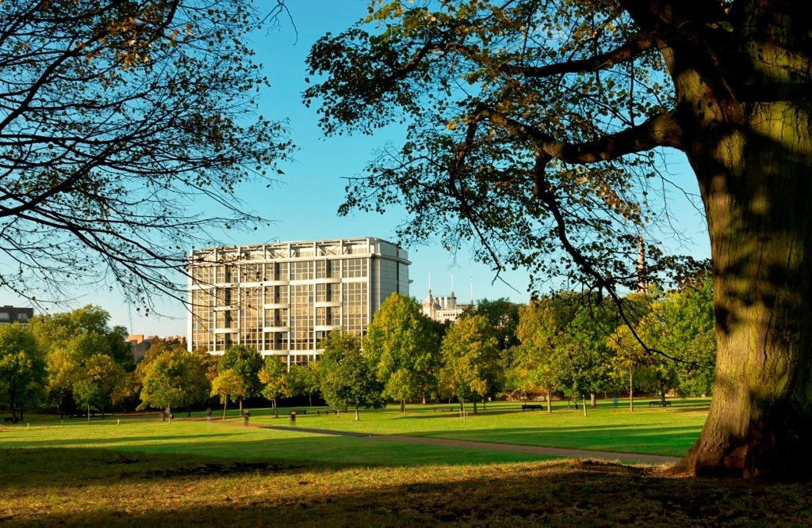

*The Royal Garden Hotel seen across the lawn of Kensington Gardens from the park.*

Mumsnet's review is specific about the room that fits a family of four: "deluxe options can sleep two adults and two children under twelve, cots are available, and interconnecting rooms can be guaranteed." A Globetotting review, carried by Kids Are A Trip, singles out free Micro Scooters for zipping around Hyde Park and Kensington Gardens next door, plus a "flicks and food" package of unlimited in-room movies and food delivery for a rainy day. Family Hotel Expert adds tepees in the room and an activity pack at check-in. Kensington Gardens and the Diana Memorial Playground are on the doorstep, and Kensington Palace is five minutes away. There is no pool. One thing that decides a stay: ask for the deluxe room grade specifically - the entry-level rooms here are not sized for a family of four.

### The Georgian House Hotel

*Pimlico · 8 min from Victoria · Typical family night £257 · Cited by 4 sources · [Hotels.com](hotel:georgian-house-wizard-chambers)*

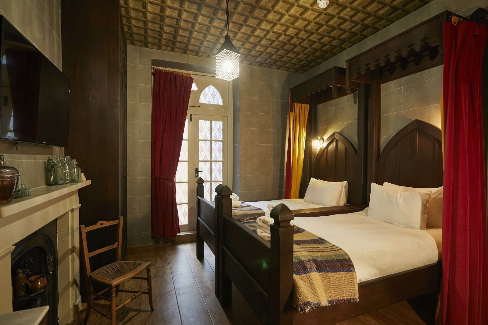

*A Wizard Chamber at the Georgian House Hotel in Pimlico, styled with four-poster beds and stained glass.*

The hotel's own site confirms the Victoria Quad room "can sleep up to 4 guests," and separately sells family rooms with an extra single or pull-out bed for children up to 12, plus cots on request. The reason it comes up again and again in family blogs isn't the quad room, though - it's the four Wizard Chambers, reached through a bookcase that swings open like a door, with four-poster beds, stone walls and Harry Potter props. Marcie in Mommyland, Kids Are A Trip and Travel Mad Mum all name it specifically for Harry Potter-obsessed children. **This is a genuine accessibility catch, confirmed on the hotel's own site: it is a Grade II listed Victorian townhouse with no lift, and some rooms are up flights of stairs.** Ask for a ground-floor room at booking if that matters. Victoria station is eight minutes' walk. One thing that decides a stay: the Wizard Chambers book out roughly eight months ahead - Marcie in Mommyland's family waited on a cancellation list to get one.

Powered by <a target="_blank" rel="sponsored" href="https://www.getyourguide.com/london-l57/">GetYourGuide</a>

## Further out, on a fast line

Every hotel further out was checked against two things: does it have two or more independent sources naming it for families, and does it pass the direct-train rule in our [budget hotels guide](/articles/best-budget-hotels-london/) - a direct train to the West End or the City in about 30 minutes. Only one hotel cleared both, and offered something the twenty above don't.

### Town Hall Hotel and Apartments

*Bethnal Green · 5 min from Bethnal Green · Cited by 2 sources · [Hotels.com](hotel:town-hall-hotel)*

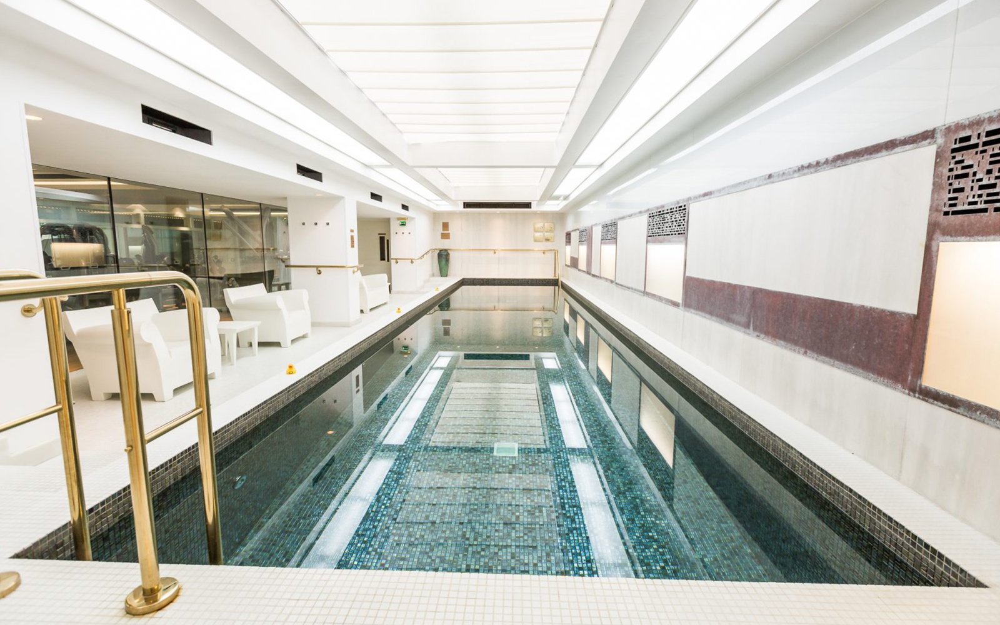

*The 15-metre heated indoor swimming pool at Town Hall Hotel & Apartments in Bethnal Green.*

A converted 1910 town hall in the East End, with a 15-metre pool open 6am to 10pm and Da Terra, a two-Michelin-starred restaurant, downstairs - neither of which any hotel in the central section above can offer at a comparable price. Santorini Dave calls the two-bedroom apartment here "for a family of 4," and Mumsnet's review notes the one and two-bedroom apartments come with well-equipped kitchens and Musetti coffee machines, five minutes from Bethnal Green tube. The Central line runs direct to Tottenham Court Road and Liverpool Street, both well inside thirty minutes. One thing that decides a stay: it's a genuine East End neighbourhood rather than a tourist strip - the pizza and burger places nearby are good, but the sights are a Tube ride rather than a walk.

## Booking essentials

**Connecting and interconnecting rooms sell out first**, at every hotel in this guide that offers them - book as far ahead as the hotel allows, and call reservations directly rather than relying on a website filter to guarantee the pairing.

**Cots are free almost everywhere**, but a few hotels put an age limit on it: Taj 51 Buckingham Gate's complimentary cots cover ages 0 to 2, and The Georgian House's extra bed is for children up to 12. Ask when you book rather than when you arrive - Marcie in Mommyland's family was told at check-in that all the cots were already out.

**Only one hotel here has confirmed step-free access as a real catch, not a footnote**: The Georgian House Hotel has no lift and some rooms are up flights of stairs, which the hotel states plainly on its own site. London Marriott Hotel County Hall's historic building also means some rooms are a genuine walk from the lifts - ask for one nearby when you book.

**Every price here is one room that sleeps the four of you**, priced on Hotels.com on 19 September 2026 for Wednesday 11 to Thursday 12 November 2026, two adults and two children, taxes and fees included. Six hotels carry no price because none of them sells a room for four on that night: at The Berkeley, The Ritz, Royal Lancaster, The Lanesborough, The Ampersand and Town Hall, a family of four is two rooms or an interconnecting pair, arranged with the hotel. For a wider price picture across the year, our [budget hotels guide](/articles/best-budget-hotels-london/) prices 46 hotels on five dates.

**If a kitchen matters more than a concierge**, several aparthotels came up again and again in this research - Cheval's Three Quays and Harrington Court, Citadines Trafalgar Square, SACO Holborn and Wilde Aparthotels among them. They get their own guide rather than an entry here: see [London's aparthotels](/articles/aparthotels-london/). For a bed rather than a suite, [the best hostels in London](/articles/best-hostels-london/) covers the family rooms at YHA Earl's Court and YHA St Pancras.

Powered by <a target="_blank" rel="sponsored" href="https://www.getyourguide.com/london-l57/">GetYourGuide</a>

## Continue planning your London trip

- 👨‍👩‍👧 **[London With Children: Free Farms, Zoos and Days Out](/articles/london-with-children/)** - what to do once you've booked somewhere to sleep
- 🍽️ **[Kids Eat Free in London](/articles/kids-eat-free-london/)** - every restaurant deal, checked
- 🧭 **[Best Areas to Stay in London](/articles/best-areas-to-stay-in-london/)** - where South Kensington, Bermondsey and Greenwich fit for a family that isn't chasing one of the hotels above
- 💷 **[Best Budget Hotels in London](/articles/best-budget-hotels-london/)** - Premier Inn London Kensington (Earl's Court) is Mumsnet's own budget-family pick, and it's priced
