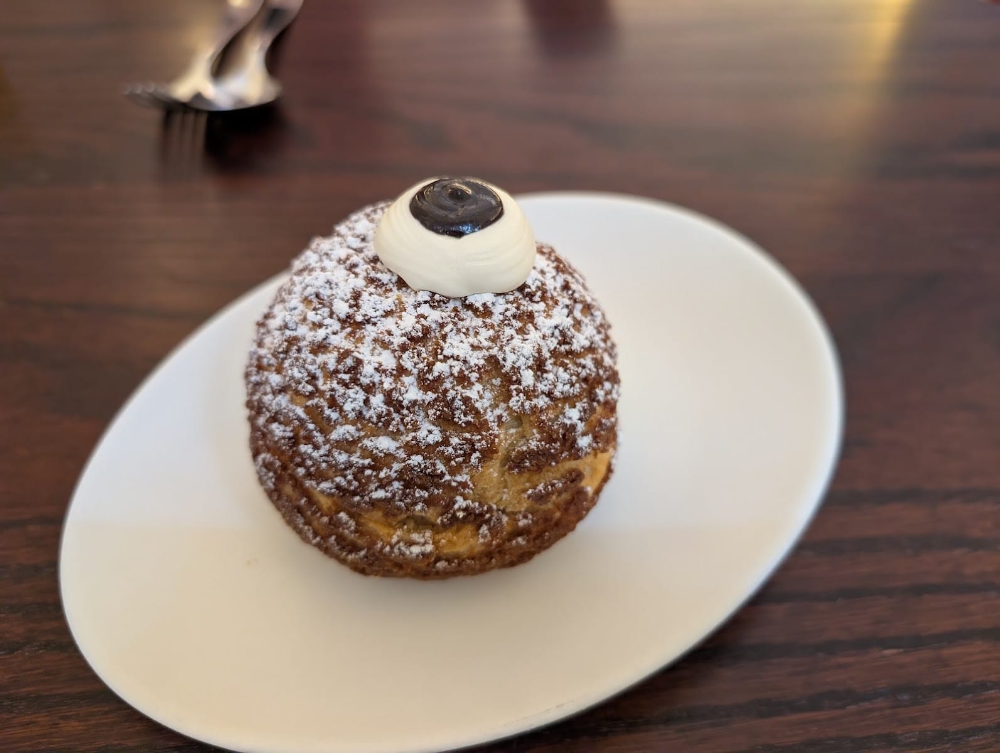
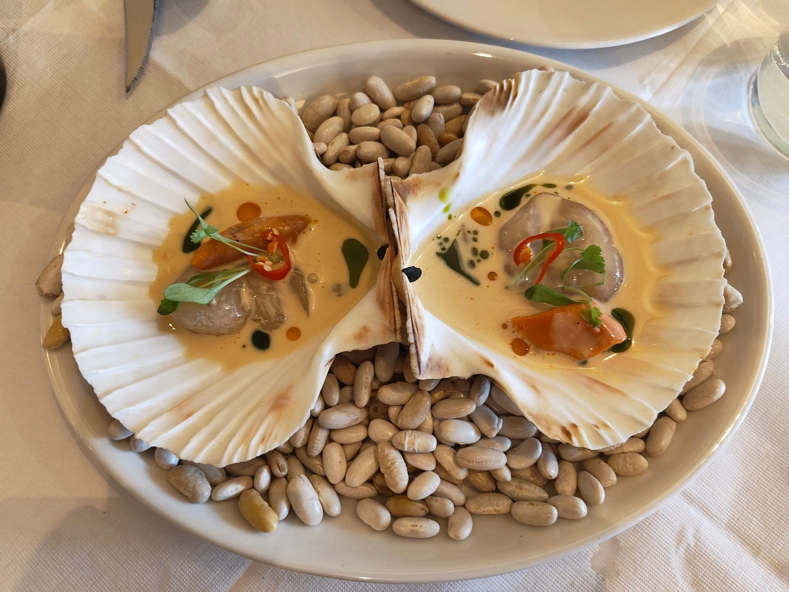
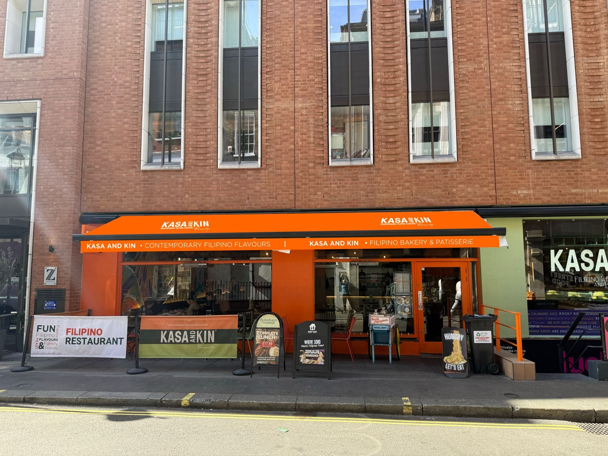
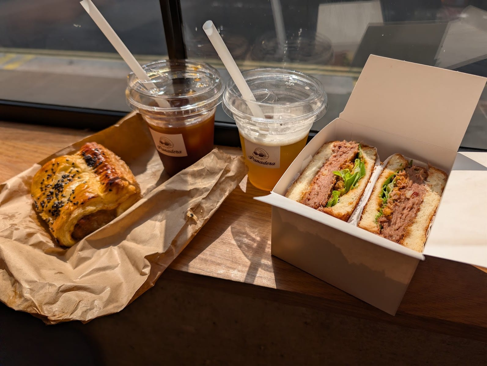
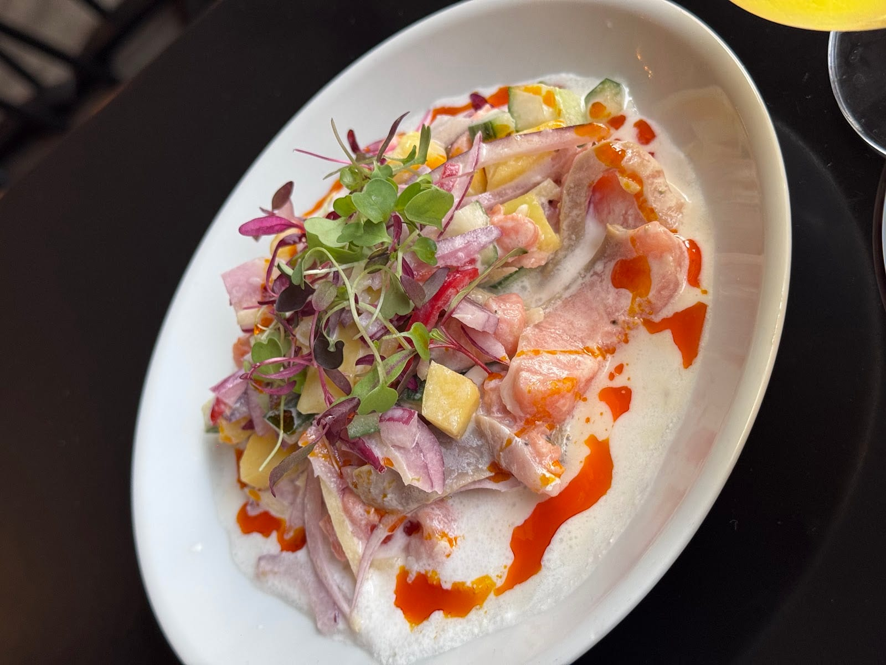
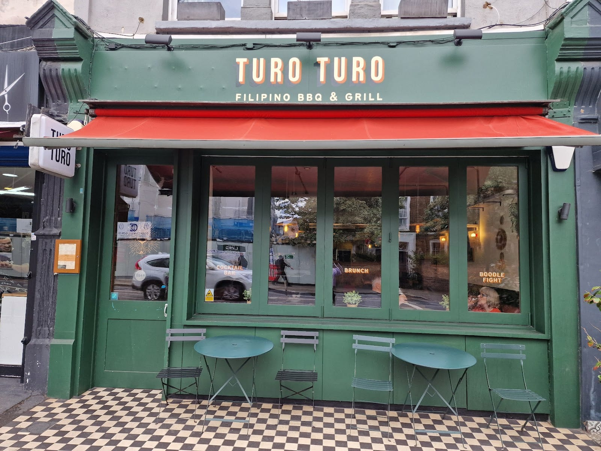
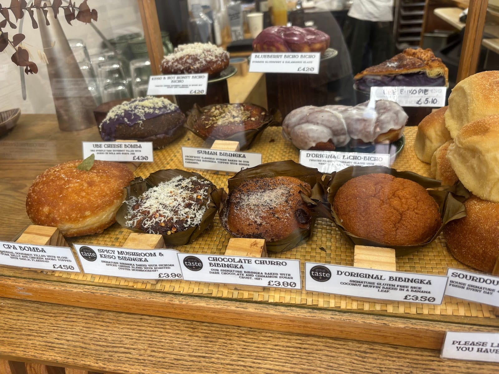
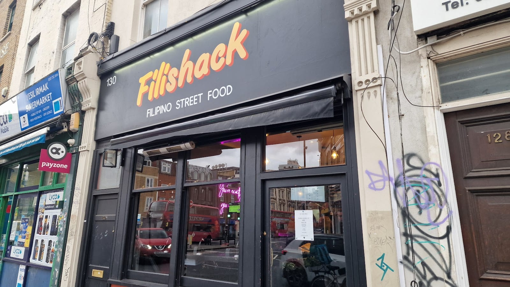
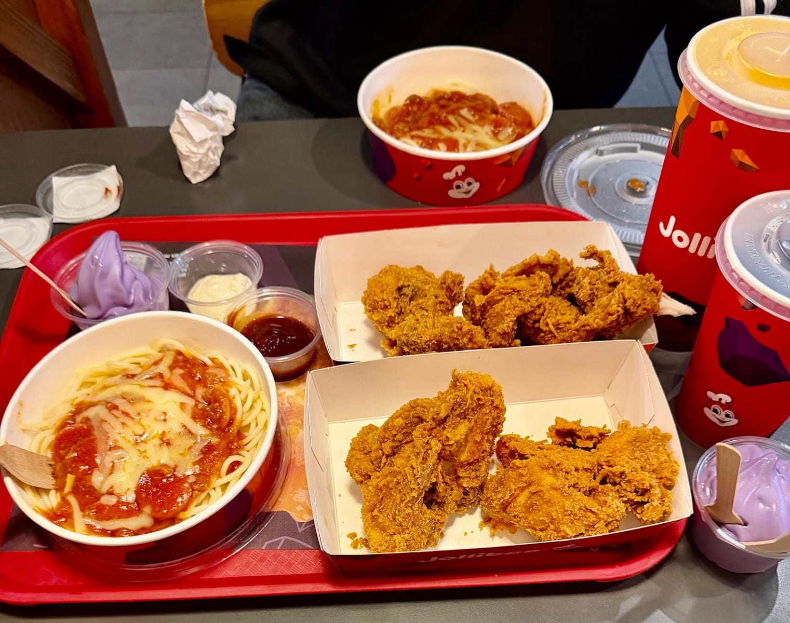

Filipino cooking is the newest of London's significant food scenes and still the least written about. Ten years ago the capital had a handful of Filipino restaurants; it now has a Bib Gourmand and a second Filipino kitchen in the Michelin Guide, two entries in The Infatuation's top 25 restaurants in the city, a bakery Time Out gave five stars, and three streets in Earl's Court that Londoners call Little Manila.

The flavour is built on sourness and salt rather than heat: cane vinegar, calamansi, soy, and fermented shrimp paste, with Spanish and Chinese technique layered on top of four hundred years of colonisation and trade. Almost nothing on these menus is chilli-hot.

> 💡 **The Short Version:** **Donia** off Carnaby Street holds a **Bib Gourmand in the 2026 Michelin Guide** and its lamb caldereta pie is the dish of the topic. **Belly Bistro** in Kentish Town is ranked higher by The Infatuation and its tempura cod pandesal sells out daily. **Panadera** took five stars from Time Out for its pandesal sandos, and lunch there is under a tenner. **Lutong Pinoy** in Earl's Court has been serving banana-leaf feasts since 1996. And **Kasa and Kin** in Soho is named by more of the sources than anywhere except Donia.

> 📊 **The evidence behind this guide.**
> Nothing here is ranked on one visit. This pass reads **26 sources carrying 87 citations** across **29 named venues** — the Michelin Guide, the editorial mastheads (Eater London, Time Out, The Infatuation, DesignMyNight), the independent and local titles (Secret London, London x London, The Nudge, Hot Dinners, Tower Hamlets Slice) and sixteen London Filipino food films from the past five years. **18 venues are named by two or more independent sources; one holds a dated award, Donia's Bib Gourmand in the 2026 Michelin Guide.**
> *Evidence rebuilt 22 September 2026 · [How we rank →](/how-we-rank/)*

> 📅 **Booking, at a glance.**
> **Book days ahead, and always for a weekend:** Donia (real-time availability up to 42 days out, maximum eight people) and Belly Bistro, which has 35 seats.
> **Bookable and usually available:** Kasa and Kin, Bintang, Ramo Ramen, Turo Turo, Kamayan sa Earl's Court, Rapsa, Cirilo.
> **Walk-in only:** Panadera, Filishack, Jollibee, Mamasons, Spoon & Rice and the market counters.
> *For a kamayan feast, ring ahead whatever the booking policy — the whole table is cooked to order and most kitchens want four people and a day's notice.*

## Where they are

| If you are near… | Where to eat |
| --- | --- |
| **Soho & Carnaby** | Donia, Kasa and Kin, Panadera, Ramo Ramen |
| **Marylebone** | Panadera (Picton Place) |
| **Kentish Town & Camden** | Belly Bistro, Bintang, Mamasons |
| **Earl's Court** | Lutong Pinoy, Kamayan sa Earl's Court, Jollibee |
| **Shoreditch & Hoxton** | Rapsa |
| **East End** | Cirilo Filipino Kainan (Cable Street) |
| **Battersea & Clapham Junction** | Kapihan, Apo |
| **South London** | Filishack (Peckham), Turo Turo and Ading Ysa's Kitchen (Tooting), Kilig (Deptford) |
| **West London** | Kuya Fernando (Southall), Filishack (White City) |
| **Covent Garden** | Bongbongs Manila Kanteen (Seven Dials Market), Jollibee (Leicester Square) |

**Price guide:** **£** under £15 · **££** £15–£30 · **£££** £30–£50 · **££££** £55+.

---

## The two that top a ranking

Two restaurants here carry a judged verdict rather than a write-up, and the two bodies that issue one disagree about which comes first. The Infatuation puts **Belly Bistro** 13th of 25 in its list of the best restaurants in London and **Donia** 18th; Michelin gave Donia the Bib Gourmand and lists Belly with a Plate, meaning it is in the guide without an award. The split is a fair reflection of what they do: Donia is the more precise kitchen, Belly the more surprising one.

### Donia, Soho

*£££ · top floor of Kingly Court, off Carnaby Street · nearest Tube Oxford Circus · Cited by 9 sources · #18 of 25, The Infatuation · Bib Gourmand, 2026 Michelin Guide · [book a table](https://www.doniarestaurant.com/reservations)*

The most-cited Filipino restaurant in London, and the only one holding an award: a **Bib Gourmand in the 2026 Michelin Guide**, which is Michelin's mark for good cooking at a moderate price. Co-founded by **Florence Mae Maglanoc**, who was born in the Philippines and grew up in Britain, from the group that also runs Panadera and Mamasons.

*The pastry end of the menu. Donia took a Bib Gourmand in the 2026 Michelin guide.*

The room is on the top floor of Kingly Court — the same unit Imad's Syrian Kitchen and Darjeeling Express both started in — with putty-coloured walls, high beams, paper napkins and no ceremony. Michelin's inspector warns about the acoustics and tells you to bring friends anyway. The **lamb shoulder caldereta pie** turns a tomato-and-liver stew into a lattice-topped pie and is the single dish most often named by the sources. Beside it, crisp **adobo mushroom croquetas**; **prawn and pork dumplings** under a crab salad in a brown butter and lime sauce; **chicken inasal**, marinated in calamansi, lemongrass and annatto and charred until the skin caramelises; and **lechon** — roast suckling pig — under a silky sauce built on Mang Tomas, the bottled liver condiment every Filipino kitchen keeps. The **ube choux** is a tennis-ball-sized bun filled with purple yam ice cream.

**Closed Mondays.** Bookings open 42 days out and cap at eight people, and the room is small enough that a Saturday goes early.

### Belly Bistro, Kentish Town

*£££ · 157 Kentish Town Road · Cited by 5 sources · #13 of 25, The Infatuation · in the 2026 Michelin Guide · [book a table](https://www.bellylondon.com/reservations)*

The highest-ranked Filipino restaurant in London on the one list that publishes an order, and the only entry here cooking French bistro technique through a Filipino lens. It is **Omar Shah's**, on the site of his old ramen shop, and it seats 35 at white tablecloths with a wood fire at the back. Time Out gave it five stars in September 2025 and called it the best new opening in Kentish Town in years; Michelin added it to the 2026 guide and tagged it an inspectors' favourite.

*The scallops are cured rather than cooked, and come back to the table in their own shells. Thirty-five seats, closed Monday and Tuesday, so a weekend table goes days ahead.*

Fish leads. **Cured scallops** arrive in their shells in coconut cream with basil oil and pickled chilli, the flavours of **Bicol Express**, the coconut-and-chilli stew from southern Luzon; **smoked trout kinilaw** is the Philippine answer to ceviche, raw fish firmed in vinegar and citrus rather than cooked. The dish people come for is the **tempura cod pandesal** — a chunk of battered cod, a slice of American cheese and salmon roe tartare in a slightly sweet Filipino milk roll, and they make only a handful a day. Mains run just over £30: wagyu picanha in **bistek** sauce, which is soy, citrus, garlic and pepper reduced to something close to gravy, and a **seafood caldereta** of clams, mussels and squid. Finish with the frozen custard profiterole in fish sauce caramel.

**Closed Monday and Tuesday**, and dinner only from Wednesday to Friday — it opens at noon on Saturday and Sunday.

---

## Also strongly backed

### Kasa and Kin, Soho

*££ · 52–53 Poland Street · nearest Tube Oxford Circus · Cited by 8 sources · [the restaurant's site](https://kasaandkin.co.uk/)*

Named by eight of the sources, one behind Donia, and the one place on this page that is a restaurant, a bar and a Filipino bakery at once. The room is L-shaped around a rainforest mural by the Filipino artist Kulay Labitigan, and it is loud in a deliberate way — there is live music on the second Wednesday of every month.

*Two counters under one awning. The bakery keeps its own hours and runs to 8pm Monday to Saturday.*

Executive chef **Jeremy Villanueva** cooks the home dishes at dining-room size: **beef kare-kare**, brisket stewed until it collapses in a thick peanut sauce with roast bone marrow, aubergine and pak choi, and a spoon of **bagoong** — fermented shrimp paste — served on the side to stir in yourself. There is a **vegetable adobo** built on squash, okra and padrón peppers in the same soy, garlic and cane vinegar braise, and at lunch an *imbento* box you build from a spring roll, a broth, a base and a topping. The **ube tsunami cheesecake** is exactly as purple as it sounds.

Bookings are taken, and the bakery counter runs 11am to 8pm Monday to Saturday and closes at 6pm on Sunday.

### Panadera, Soho and Marylebone

*£ · 3 Hopkins Street, W1F 0HS, and 7 Picton Place, W1U 1BN · Cited by 7 sources · [see the menu](https://www.panaderabakery.com/menu)*

Five stars from Time Out in October 2025, and named by seven of the sources here — more than any Filipino restaurant except Donia and Kasa and Kin. *Panadera* is Tagalog for a woman baker, and the whole counter is built around **pandesal** — a soft, faintly sweet bread roll rolled in breadcrumbs that Filipino households eat for breakfast. Here it comes as a sturdy square **sando**: corned beef hash, or panko aubergine for vegetarians.

*A sando and a coffee brings lunch in under a tenner. The sandos sell out, so early is safer.*

The savoury pastries are the argument. A **longanisa roll** puts the sweet, garlicky Filipino sausage inside flaky pastry, and the **chicken adobo pocket** does the same job for the braise. On the sweet side, doughnuts pumped with purple **ube** custard, brown butter cookies, and a **taho** drink — silken tofu, brown sugar syrup and sago pearls — served warm at weekends. Coffee comes from Catalyst.

**No bookings and no table service**, and the sandos sell out. Hopkins Street is the bigger of the two; Picton Place, beside Selfridges, is a counter.

### Lutong Pinoy, Earl's Court

*££ · 10 Kenway Road, SW5 0RR · Cited by 5 sources · [the restaurant's site](https://www.lutongpinoyuk.com/)*

Founded in **1996 by Mario Malata** — *lutong pinoy* means home cooking — and the place the community's own filmmakers keep going back to: three of its five citations are videos rather than published lists, the widest gap on this page between what the guides cover and what Filipino Londoners film.

*A kamayan is cooked for the whole table at once and eaten with your hands — no cutlery comes out.*

The reason to come is the **kamayan** feast: banana leaves down the length of the table, mounds of garlic rice, and grilled milkfish, pork belly, chicken inasal, prawns, lumpia and a beef-and-tripe stew tipped over the top, eaten with your hands. Follow it with **halo-halo** — shaved ice, evaporated milk, ube, caramel custard, sweetened beans and jackfruit in a tall glass, to be stirred hard before the first spoonful.

They also sell **bilao** — the big woven trays Filipino families order for a party — and party platters to collect. Ring ahead for the feast; the whole table is cooked to order.

### Rapsa, Hoxton and Archway

*££ · 100–102 Hoxton Street, N1 6SG, and Play Archway, 141 Junction Road, N19 5PX · Cited by 5 sources*

Chef **Francis Puyat** comes from a coastal town in Occidental Mindoro and builds the menu around **kinilaw**, the Philippine technique of firming raw fish in vinegar or citrus instead of heat — here applied to poke bowls with daikon, avocado and sriracha mayo. The **lumpia** are wrapped around pork and atchara, a pickled green papaya relish.

*Kinilaw is the thing to order here: no heat touches the fish, and the sourness does the cooking.*

The event is the **boodle fight** on the last Sunday of the month, 5pm to 8pm: a whole roast lechon and everything around it, on banana leaves, £20 to £30 a head. Weekend brunch goes bottomless, and the Hoxton room has the longer menu of the two.

### Cirilo Filipino Kainan, Cable Street

*££ · 4 Cable Street, E1 8JG · Cited by 5 sources · [Tower Hamlets Slice's review](https://towerhamletsslice.co.uk/whitechapel/cirilo-filipino-cable-street-restaurant-review/)*

A low, single-storey building tucked under the railway arches at the western end of Cable Street — walking in feels like ducking into a cottage. Chef **Cirilo Ragasa** opened it with his wife in **2008**, has kept it to one site, and has turned down every offer to franchise it.

His **adobo** is chicken thigh in a sauce the colour of dark espresso, thick enough to cling and sweeter than most, with potatoes to soak it up; it is the version to try if you want to understand why vinegar sits at the centre of this cuisine. There are three **sisig** — pork, chicken or beef, chopped and crisped and brought out spitting on an iron plate — plus crab and prawn lumpia, a beef **kaldereta** with olives and gherkins, and **pancit bihon**, thin rice noodles with vegetables. Wine starts at £21 a bottle. The **Red Horse** lager on the list is a Filipino export strength at 8%, and the doorframe is low.

Small room, low lighting, close tables. Book if there are more than four of you.

### Kamayan sa Earl's Court

*££ · 12 Kenway Road, SW5 0RR · Cited by 4 sources · [book a table](https://kamayansaearlscourt.co.uk/#book-a-table)*

Next door to Lutong Pinoy and a separate business, doing the same feast at a lower price: the daily **boodle fight is £15.99 a head** for a minimum of four, and it comes with your choice of starters, four mains, jasmine rice, salad and soup.

*The feast runs daily here rather than by arrangement, and still wants a table of four.*

Off the platter, order **bulalo** — beef shank simmered until the marrow slides out of the bone, in a clear broth with corn and cabbage — or **crispy pata**, a whole pork knuckle deep-fried until the skin blisters. There is sisig, adobo and halo-halo, and a collection service if you want a tray to take home.

### Bintang, Camden

*££ · 93 Kentish Town Road, NW1 8NY · Cited by 3 sources · [book a table](https://www.bintangrestaurant.co.uk/reservations)*

Trading on the same stretch of Kentish Town Road since **1987**, which it says makes it **the oldest Filipino restaurant in London**, and run by the family behind Belly Bistro and Ramo Ramen. It is a small, cluttered room with a garden behind and the big tables at the back, and it does karaoke when the night calls for it.

The **pandesal sliders** are short-rib patties smashed on the grill with **toyomansi** — soy and calamansi — and pushed into the soft rolls, and they eat like a main. There is **beef sisig** on a sizzling plate with chicken chicharrón, onion, chilli and an egg, an oxtail **kare-kare** in thick peanut sauce, and four **silog** plates: garlic fried rice, a fried egg and your choice of cured meat or fried milkfish. All-day Filipino breakfast at weekends.

**Closed Mondays.**

### Turo Turo, Tooting

*££ · 102 Tooting High Street, SW17 0RR · Cited by 3 sources · [the restaurant's site](https://www.turoturo.co.uk/)*

*Turo turo* means "point point", after the Philippine roadside canteens where you choose by pointing at trays, and **Rex de Guzman** spent years on market stalls and in pub residencies before this became his first permanent room. It is a bar and grill first: tropical cocktails from £10, karaoke and live music nights, brunch at weekends.

*The window advertises what the room does: cocktail bar, brunch and boodle fight.*

The cooking is charcoal-led — **thrice-cooked pig's head hash**, ginger wings glazed with fermented shrimp, mushroom and tofu skewers — and there is a **boodle fight** on the menu plus a standalone kamayan supper club. **Brunch runs 11am to 4pm on Saturday and Sunday.**

**Closed Mondays**, and dinner only on Tuesday and Wednesday. Bookings go through WhatsApp or email rather than a form.

### Kapihan, Battersea

*£ · 547 Battersea Park Road, SW11 3BL · Cited by 3 sources*

A family-run Filipino coffee house and bakery, and the only place on this page pouring **single-origin coffee grown in the Philippines**. *Kapihan* means a place to drink coffee, and the baking is built around **bibingka**, a coconut rice cake baked in a banana leaf — the classic, plus seasonal versions running from chocolate churro and black forest to ube and blueberry, and a savoury one with roasted oyster mushroom and cheese.

*Rice and coconut rather than wheat: the signature bibingka is gluten free, and it bakes in the leaf it is served in.*

It is small, it is a neighbourhood room rather than a destination one, and it closed once already: it went in 2021 and came back to Battersea Park Road in January 2023.

### Ramo Ramen, Soho

*££ · 28 Brewer Street, W1F 0SR · Cited by 2 sources · [book a table](https://www.ramoramen.com/reservations)*

Billed as the world's first Filipino ramen shop, and the joke is only half a joke: the **oxtail kare-kare ramen** puts the peanut beef broth and pulled oxtail of the Filipino stew over Tokyo-style noodles, and it works. Also **miso maple wings**, scallops roasted in **bagoong** butter, and a wagyu **bistek donburi** — seared tri-tip over rice with an egg yolk and spring onion — that only the Soho branch serves.

**All the meat is halal certified**, so a halal diner can order across the whole menu. Last booking is 9pm; groups over eight go by email.

### Kuya Fernando, Southall

*££ · 443 Uxbridge Road, Southall, UB1 3ET · Cited by 2 sources*

A restaurant and a Filipino grocery in the same premises, which is how a lot of this food arrived in London in the first place. **Arroz caldo** — ginger rice porridge with fried chicken and a boiled egg — is a breakfast dish here, and **pork sinigang** is the one to order to understand sourness in this cuisine: a tamarind broth sharp enough to make you sit up.

Also **beef pares**, stewed ginger beef over egg noodles in its own broth, and **lechon kawali**, pork belly slow-roasted then fried so the crackling shatters. Finish with halo-halo or a buko pandan shake, or just buy the ingredients on your way out.

### Filishack, Peckham, Elephant & Castle and White City

*£ · 130 Peckham Hill Street, SE15 5JT, plus two more · Cited by 2 sources · [see the menu](https://www.filishack.co.uk/menu)*

Brothers Jonathan and Justice Cacho have built three sites in four years on one dish: **chicken inasal**, marinated in lemongrass, ginger, vinegar and calamansi, then charred. It comes in three sizes of rice box, two of burrito, or a salad box, and there is an **adobo burrito** if you want the braise instead — soy, pepper, vinegar, garlic, bay and a splash of coconut milk.

*Built as a takeaway and still run like one: order at the counter, and the smallest rice box leaves change from a tenner.*

Peckham has been open since 2021, Elephant & Castle since 2024 and White City since 2025. **All three close on Sundays**, and open from 11am the rest of the week.

### Jollibee, Earl's Court, Leicester Square and beyond

*£ · 180 Earl's Court Road, SW5 9QG, and 22 Leicester Square, WC2H 7LE · Cited by 5 sources*

The Philippines' own fast-food chain, and more of a cultural fixture than a restaurant — **the Earl's Court branch was the first it opened in Britain**. Five of the sources here name it, as many as name Rapsa, Cirilo or Lutong Pinoy, which says something about how central it is to the Filipino London most people describe.

*The purple cups are ube soft serve — purple yam, not taro, and the thing to add to a Chickenjoy meal.*

**Chickenjoy** is the fried chicken, crisp-shelled and eaten dipped in a pot of gravy. **Jolly Spaghetti** is soft pasta in a sweet banana-ketchup sauce with sliced hot dog, which is either a childhood or a shock depending on where you grew up. The **peach mango pie** is a deep-fried parcel, not a slice.

---

## By format

Filipino London divides by how the food reaches you rather than by region of the Philippines.

**Modern Filipino dining rooms** — a short menu of sharing plates reworking home dishes with British produce.
* **[Donia](https://www.doniarestaurant.com/reservations)**, Soho — the Bib Gourmand and the lamb caldereta pie. *Cited by 9 sources*
* **[Belly Bistro](https://www.bellylondon.com/reservations)**, Kentish Town — Filipino-French over a wood fire. *Cited by 5 sources*
* **[Kasa and Kin](https://kasaandkin.co.uk/)**, Soho — the biggest room of the three, and a bakery attached. *Cited by 8 sources*

**Kainan and carinderia** — a family canteen cooking what a Filipino household eats on a weekday.
* **Cirilo Filipino Kainan**, Cable Street — adobo, sisig and a £21 bottle of wine. *Cited by 5 sources*
* **Kuya Fernando**, Southall — restaurant and grocery in one. *Cited by 2 sources*
* **[Lutong Pinoy](https://www.lutongpinoyuk.com/)**, Earl's Court — home cooking since 1996. *Cited by 5 sources*

**Kamayan feasts** — banana leaves down the table and no cutlery. All four want four people and a phone call.
* **[Kamayan sa Earl's Court](https://kamayansaearlscourt.co.uk/#book-a-table)** — £15.99 a head, daily. *Cited by 4 sources*
* **[Lutong Pinoy](https://www.lutongpinoyuk.com/)**, Earl's Court — milkfish, inasal and pork belly. *Cited by 5 sources*
* **Rapsa**, Hoxton — last Sunday of the month, with a whole lechon, £20–£30. *Cited by 5 sources*
* **[Turo Turo](https://www.turoturo.co.uk/boodlefight)**, Tooting — plus a separate kamayan supper club. *Cited by 3 sources*

**Bakeries and cafés** — pandesal, ube and Filipino coffee, open from the morning.
* **[Panadera](https://www.panaderabakery.com/menu)**, Soho and Marylebone — the longanisa roll and the adobo pocket. *Cited by 7 sources*
* **Kapihan**, Battersea — bibingka and Philippine single-origin coffee. *Cited by 3 sources*
* **Mamasons Dirty Ice Cream**, Kentish Town, Chinatown and Westfield — ube, black coconut and a cheese-flavoured scoop, served as a *bilog* between two halves of toasted pandesal. *Cited by 2 sources*

**Grills** — chicken inasal and skewers over charcoal, usually with garlic rice.
* **Filishack**, Peckham, Elephant & Castle and White City — inasal in a box. *Cited by 2 sources*
* **[Turo Turo](https://www.turoturo.co.uk/)**, Tooting — pig's head hash and ginger wings. *Cited by 3 sources*
* **[Bintang](https://www.bintangrestaurant.co.uk/reservations)**, Camden — silog plates and beef sisig. *Cited by 3 sources*

**Bars with a kitchen** — Filipino food built around a drinks list and a late licence.
* **Apo**, 148 Falcon Road, Battersea — crispy pork belly, grilled tuna steak and prawn sinigang served all day, with comedy nights and live music, and **open until 2am at weekends**. *Cited by 1 source*
* **Kilig**, 2 Resolution Way, Deptford — Filipino and Colombian on one menu, from founders Anjelica and Ivan: **tortang talong**, a whole aubergine charred, peeled and flattened into an omelette, alongside BBQ ox cheek arepas and crispy pork belly with a calamansi and fish-sauce dip. *Cited by 1 source*

---

## The cheapest Filipino food in London

Every one of these will feed you for under £16, which is not true of much else in central London.

* **[Panadera](https://www.panaderabakery.com/menu)**, Soho and Marylebone — a pandesal sando and a Catalyst coffee. *Cited by 7 sources*
* **Jollibee**, Earl's Court and Leicester Square — a Chickenjoy meal with gravy and a peach mango pie. *Cited by 5 sources*
* **Filishack**, Peckham, Elephant & Castle and White City — the small inasal rice box leaves change from a tenner. *Cited by 2 sources*
* **Kapihan**, Battersea — bibingka and Philippine coffee. *Cited by 3 sources*
* **Spoon & Rice**, Boxpark Wembley, Boxpark Croydon and Willesden Green — grilled chicken, pork belly or adobo over rice with a house garlic sauce. Halal chicken cooked separately. *Cited by 1 source*
* **Mamasons Dirty Ice Cream**, three sites — ube in a toasted bread roll for the price of a scoop. *Cited by 2 sources*
* **Kamayan sa Earl's Court** — the boodle fight is £15.99 a head for a minimum of four, with starters, four mains, rice, salad and soup. *Cited by 4 sources*

## Quickest, if you have twenty minutes

* **[Panadera](https://www.panaderabakery.com/menu)** — counter, no table service, out in five. *Cited by 7 sources*
* **Filishack** — built as a takeaway; three sites, all closed Sundays. *Cited by 2 sources*
* **Jollibee** — a till and a tray, though Leicester Square queues at weekends. *Cited by 5 sources*
* **Spoon & Rice** — Boxpark counters, 11am to 9.30pm seven days. *Cited by 1 source*
* **Bongbongs Manila Kanteen**, Seven Dials Market — rice boxes under £15 at a market stall. *Cited by 1 source*

## Street food, market stalls and counters

This is where a lot of Filipino cooking in London actually happens: the residency before the restaurant, the market unit, the counter inside somebody else's hall. Rex de Guzman ran Turo Turo as a market stall and then as a residency on the first floor of a Walworth Road pub before it took a permanent site in Tooting.

* **Bongbongs Manila Kanteen**, Seven Dials Market, Covent Garden — from **BBQ Dreamz**, who won £350,000 on BBC Two's *My Million Pound Menu* and later changed the name. Rice boxes under £15, a longanisa sausage box, and a pancake filled with 24-hour sous-vide crispy pork or sizzling sisig mushrooms for vegetarians. *Cited by 1 source*
* **Ading Ysa's Kitchen**, Tooting Broadway Market — a market counter doing sisig, prawn sinigang and an ube pie that is the reason most people find it. Five minutes from Turo Turo, so the two make an easy afternoon. *Cited by 1 source*
* **Spoon & Rice**, Boxpark Wembley and Boxpark Croydon, plus a shop on Willesden High Road — grilled chicken thigh, pork belly or adobo over rice, doused in a house garlic sauce. Open seven days, 11am to 9.30pm. *Cited by 1 source*
* **Filishack**, Peckham Hill Street — a Peckham Square shack that grew into three sites without changing the menu. *Cited by 2 sources*

## Little Manila: Earl's Court

Three streets — Earl's Court Road, Kenway Road and Hogarth Road — hold more Filipino businesses than the rest of central London put together, and the community behind them goes back to the 1970s, when Britain recruited nurses and care workers from the Philippines in numbers.

You can walk the whole thing in ten minutes. **Lutong Pinoy** at 10 Kenway Road and **Kamayan sa Earl's Court** at 12 Kenway Road are next door to each other and are two separate businesses, both doing banana-leaf feasts. **Jollibee** is a few minutes away on Earl's Court Road, and it was the chain's first branch in Britain. Between them sit the Filipino supermarkets, which is where the Red Horse beer and the frozen lumpia come from.

> ⚠️ **Ring before you go for a feast.** A kamayan is cooked for the whole table at once, most kitchens want a minimum of four people, and turning up as a pair on a Saturday means ordering off the à la carte instead.

## New and changed this year

* **Belly Bistro** opened in May 2025 and is in the 2026 Michelin Guide — the fastest rise of anything on this page.
* **Panadera** opened its Soho flagship on Hopkins Street in 2025 and now runs Soho and Marylebone; the Kentish Town original closed in January 2025.
* **Filishack** added White City in 2025, its third site in four years.
* **Mama's Kubo** on Finchley Road, which four of the sources here name, has been closed for refurbishment since 12 January 2026 with no reopening date published. Do not make the trip yet.

## What to know

* **Very little of this food is hot.** The heat in Filipino cooking comes from vinegar and from long chillies used for flavour, not fire. If you want spice, ask.
* **Order rice.** It is not a side here — most of these dishes are built to be eaten over it, and a meal without it counts as a snack.
* **Sisig comes to the table spitting.** Chopped crisped pig's jowl and ear on an iron plate, with calamansi squeezed over and often an egg cracked on top to cook in the heat.
* **Ube is not taro.** It is purple yam: sweeter, softer, closer to vanilla, and the reason half of these menus are violet.
* **Halo-halo means "mix mix".** Stir it hard before the first spoonful or you get a glass of ice and a layer of condensed milk.
* **Sunday is the awkward day.** Filishack closes, Turo Turo shuts at 7pm and Donia stops serving at 8pm.

---

## Continue planning your London trip

- 🍽️ **[Eat in London: Restaurants, Food Markets & Quick Food Hub](/articles/eat-in-london-guide/)** — every food guide on the site in one place.
- 🥟 **[The Best Chinese and East Asian Restaurants in London](/articles/best-chinese-east-asian-restaurants-london/)**
- 🌶️ **[The Best Thai Restaurants in London](/articles/best-thai-restaurants-london/)**
- 🥖 **[The Best Bakeries in London](/articles/best-bakeries-london/)** — where Panadera sits among the city's other bakers.
- 🍦 **[The Best Ice Cream in London](/articles/best-ice-cream-london/)** — Mamasons and the rest of the ube.
- 🛒 **[The Best Street Food in London](/articles/best-street-food-london/)**
- 💷 **[Cheap Eats in London](/articles/cheap-eats-london/)**
- 🕌 **[The Best Halal Restaurants in London](/articles/best-halal-restaurants-london/)** — Ramo Ramen is halal certified throughout.
- 🎸 **[Camden Area Guide](/articles/camden-area-guide/)** — Bintang, Belly Bistro and Mamasons are all within a few minutes of each other.
- 🎭 **[Soho Area Guide](/articles/soho-area-guide/)**
