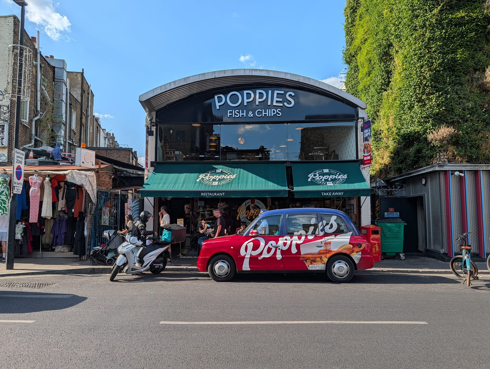

Fish and chips is the London dish with the least evidence behind it. There is one national award and it publishes no results; the big titles cover chippies once a year and then move on; and more of the useful writing is on independent blogs than in the mastheads. So a guide either tells you whose opinion it is repeating, or it is guessing.

This one counts. Every shop below is placed by how many independent sources name it — and the two most interesting facts in the data are that the most-cited chippy in London is not on Time Out's list at all, and that the two shops with an actual award are not the two anyone writes about.

> 💡 **The Short Version:** **Poppies** is the most-cited chippy in London. **The Fryer's Delight** is the one that still fries in beef dripping. **Brockley's Rock** and **Stones** are the only London shops on the 2026 award shortlist. **Michael's Fish Bar** is Time Out's number one and costs half what the centre does. **Nautilus** fries in matzo meal. And **Masters Superfish** near Waterloo is the biggest portion for the money.

> 📊 **The evidence behind this guide**
> Nothing here is ranked on one visit. This pass reads **13 sources carrying 137 citations** across **58 named chippies** — the National Fish and Chip Awards, the editorial mastheads (Time Out, Absolutely, DesignMyNight), five independent specialists and five of the year's London chip shop videos. **24 are named by two or more independent sources; 2 carry a dated award.**
> **The known weakness in this topic:** the award barely exists as a public record. The National Fish and Chip Awards judges and dates its categories, but publishes no winners page — its own site carries entry forms and a few 2023 shortlists, so even the 2026 result had to be read from a news report of it. That leaves just two London shops with any judged placement, and everything else here rests on editorial and creator consensus. The corpus also leans unusually hard on independent blogs, because the big titles write about chippies once a year and rarely leave Zone 1.
> *Evidence rebuilt 30 August 2026 · [How we rank →](/how-we-rank/)*

## Where they are

  

    Map of the best fish and chips in London
  

  

    
Loading the interactive map…

  

  <noscript>
    
The interactive map requires JavaScript. Every entry below lists its area.

  </noscript>

| If you are near… | Where to eat |
| --- | --- |
| **Bloomsbury & Holborn** | The Fryer's Delight |
| **Marylebone** | The Golden Hind, The Seashell of Lisson Grove |
| **Soho & Covent Garden** | Golden Union, Rock & Sole Plaice |
| **Mayfair** | The Mayfair Chippy |
| **Waterloo & South Bank** | Masters Superfish, Fishcotheque |
| **Shoreditch & Spitalfields** | Poppies, Shoreditch Fish and Chips, Fish Central |
| **Hackney & Dalston** | Sutton & Sons, Faulkners |
| **North London** | Nautilus (West Hampstead), Toff's (Highgate), Mickey's Chippy (Stoke Newington) |
| **South London** | Ken's Fish Bar (Herne Hill), Fish Lounge (Clapham), Brockley's Rock (Brockley) |
| **Greenwich** | The Golden Chippy |
| **East London** | Michael's Fish Bar (Leytonstone) |
| **West London** | Stones (Acton), The Golden Chip of Hanwell |

**Price guide:** **£** under £12 a head · **££** £12–£22 · **£££** £25+.

---

## The two with an award

Worth separating out, because nothing else in this guide has been judged by anyone.

The **National Fish and Chip Awards** is the only national award for the category. It is run by the National Federation of Fish Friers, it is dated, and its Takeaway of the Year category runs a forty-shop shortlist down to twenty, then ten, then a winner announced each February. Two of the forty shops on the 2026 shortlist are in London — and one of them made the final ten.

### Brockley's Rock, Brockley

*££ · Brockley Road, SE4 · Cited by 4 sources · National Fish and Chip Awards 2026 shortlist*

**The only London chippy in the UK top ten.** The National Federation of Fish Friers named its ten Takeaway of the Year finalists in November 2025 and Brockley's Rock is the single London entry, against three from Yorkshire and two from Scotland.

On Brockley Road since 2011, on the site of a run-down Chinese takeaway. MSC-certified cod, a homemade tartare sauce it is known locally for, and the schools, raffles and food banks it supports — which the award judges on alongside the frying.

No masthead guide has got round to it.

### Stones Fish and Chips, Acton

*££ · Horn Lane, W3 · Cited by 3 sources · National Fish and Chip Awards 2026 shortlist*

On Horn Lane since 2015, owned by a French-Algerian couple, Amine and Najett. On the forty-shop shortlist, and a UK top-three finalist in two further categories — Marketing Initiative, and Training and Development — winning neither.

Currently serving **hake alongside cod** while cod stocks recover, which is a more interesting thing to order than the usual choice. Also named in Fry magazine's UK top 50 in 2024.

> **The award publishes almost nothing.** There is no winners page on the awards site and no archive of past results — the forty-shop shortlist had to be read from a news report, and only the ten-shop final is on the federation's own site. The February 2026 ceremony has been and gone without a public record of who won. That is a gap in the category, not in this guide.

---

## What the guides agree on

### Poppies Fish and Chips, Spitalfields

*££ · Spitalfields · 9 min from Aldgate East · Cited by 8 sources*

The most-cited chippy in London, and by some way — eight independent sources against seven for the next three. Trading since 1952 and done out as a fifties chip shop: jukebox, memorabilia, staff in period uniform. Sites in Spitalfields, Camden, Soho and Notting Hill.

Fish comes daily from Billingsgate. The theming is heavy, and either delights you or does not. It is also the clearest disagreement in the data: **Time Out does not list it at all.**

*The Camden branch, on Hawley Crescent. The livery taxi outside is Poppies' own, and it is usually parked there.*

### The Fryer's Delight, Bloomsbury

*£ · Bloomsbury · 6 min from Holborn · Cited by 7 sources · #6, Time Out*

Formica tables, a room that has not been redecorated in decades, and chips fried in beef dripping — the traditional method almost everywhere has abandoned for vegetable oil, and the reason the chips taste like they did forty years ago.

It is a takeaway with a few tables rather than a restaurant, and that is the point. The dripping also means the chips are not vegetarian.

### The Golden Hind, Marylebone

*££ · Marylebone · 5 min from Bond Street · Cited by 7 sources · #12, Time Out*

Open since 1914, with the original art deco fryer still standing in the room — no longer used, but still there. Grease-free batter and a wider fish list than most.

If you want the Fryer's Delight experience with table service and somewhere to sit properly, this is it.

### Fish Central, Clerkenwell

*££ · Clerkenwell · 11 min from Old Street · Cited by 7 sources · #9, Time Out*

Half proper chippy, half sit-down fish restaurant, in a housing-estate precinct on the edge of the Old Street roundabout — with oysters and lobster on the menu alongside the cod. A family business in a shopping parade, which is not where anyone expects to find one of the most-cited kitchens in the city.

### The Seashell of Lisson Grove, Marylebone

*££ · Marylebone · 2 min from Marylebone · Cited by 5 sources · #3, Time Out*

On Lisson Grove since 1964 and frying since before the war. It has drawn a celebrity crowd for decades without changing a thing about itself, which is the highest compliment you can pay a chip shop.

Two minutes from Marylebone station, which makes it the easiest of the classics to reach.

### Rock & Sole Plaice, Covent Garden

*££ · Covent Garden · 4 min from Covent Garden · Cited by 5 sources · #5, Time Out*

Claims a lineage back to 1871, which would make it among the oldest surviving chippies in the country, with pavement tables on a Covent Garden side street. Known for very large chips, fried in peanut oil.

### Golden Union Fish Bar, Soho

*££ · Soho · 6 min from Oxford Circus · Cited by 5 sources · #17, Time Out*

The Soho option, and the one to know if you want fish and chips inside the theatre district. Retro-diner styling, sustainably sourced fish, craft beer.

### Masters Superfish, Waterloo

*££ · Waterloo · 191 Waterloo Road · Cited by 4 sources · #4, Time Out*

A south London institution five minutes from Waterloo, buying from Billingsgate daily and frying several kinds of fish rather than just cod and haddock. The mushy peas are what people write about.

Prawns and bread and butter arrive unasked while you wait — the house tradition. Portions are large enough that the small is usually the right order.

### Toff's, Highgate

*££ · Muswell Hill · Cited by 4 sources · #16, Time Out*

Run by the same family since 1988, with sustainably sourced, traceable fish and a wood-panelled room.

---

## Time Out's list and the citation counts barely overlap

Worth knowing before you treat any single guide as the answer.

Time Out ranks eighteen London chippies, and its number one is **Michael's Fish Bar** in Leytonstone — a cash-only counter with no seating that only one other source in this corpus names. Its number two, **Fish Lounge** in Clapham, is not in any award. And **Poppies**, the most-cited chippy in the city, does not appear on its list at all.

| Time Out rank | Chippy | Cited by |
| --- | --- | --- |
| **#1** | Michael's Fish Bar, Leytonstone | 2 sources |
| **#2** | Fish Lounge, Clapham | 5 sources |
| **#3** | The Seashell of Lisson Grove, Marylebone | 5 sources |
| **#4** | Masters Superfish, Waterloo | 4 sources |
| **#5** | Rock & Sole Plaice, Covent Garden | 5 sources |
| **#6** | The Fryer's Delight, Bloomsbury | 7 sources |
| **#7** | Ken's Fish Bar, Herne Hill | 4 sources |
| **#9** | Fish Central, Clerkenwell | 7 sources |
| **#10** | Mickey's Chippy, Stoke Newington | 3 sources |
| **#11** | Faulkners, Dalston | 1 source |

Neither ranking is wrong. A ranked list is one editor's judgement made carefully; a citation count is how much of the trade agrees. Where they line up — The Fryer's Delight, Fish Central, The Seashell — you can be fairly confident.

---

## Cheap, and better for it

Everything here comes in under £12, and none of it takes a booking.

### Michael's Fish Bar, Leytonstone

*£ · Leytonstone · 4 The Pavement, Hainault Road · Cited by 2 sources · #1, Time Out*

Time Out's best chippy in London, at prices central London stopped charging a decade ago. Flaky batter, thick chips, and 61% of Leytonstoner readers picked it in their own poll.

> ⚠️ **Cash only, and no seating.** It is a takeaway counter, not a restaurant.

### Fish Lounge, Clapham

*£ · Clapham · 16 min from Brixton · Cited by 5 sources · #2, Time Out*

Second on Time Out's list and named by five sources, with none of the tourist traffic of the central ones. Delicately battered fish and thick chips.

### Ken's Fish Bar, Herne Hill

*£ · Camberwell · 6 min from North Dulwich · Cited by 4 sources · #7, Time Out*

A south London chippy that four separate sources single out over far better-known names, family-run since 1984.

### Mickey's Chippy, Stoke Newington

*£ · Stoke Newington · walk-in · Cited by 3 sources · #10, Time Out*

The Stoke Newington chippy that turns up on every north London list, a few doors from one of the better pubs in the area.

### Kennedy's, Clerkenwell

*£ · Goswell Road · Cited by 3 sources*

An old Goswell Road counter picked out in a five-shop London run by a black-cab driver's channel, and by two written guides. Two businesses trade as Kennedy's in London; this is the Goswell Road one.

### The Golden Chip of Hanwell, Hanwell

*£ · 33 Boston Road · 9 min from Hanwell · walk-in · Cited by 1 source*

Two brothers, a west London high street, and fish delivered from Scotland daily and fried in small batches to order. The batter has the proper shatter rather than the thick greasy coat, and the trade-off for small batches is that you wait on a Friday night.

**The Elizabeth line changed the maths** on getting there. Hanwell is now a straightforward run from Paddington or Tottenham Court Road, which it was not before 2022.

**Note:** this is not **The Golden Chippy** in Greenwich. Two different shops with near-identical names.

---

## The unusual ones

### Nautilus, West Hampstead

*££ · West Hampstead · 27–29 Fortune Green Road · Cited by 3 sources · #13, Time Out*

Fish fried in **matzo meal rather than batter** — the Jewish north London tradition that predates the chip shop as most people know it. The crust is lighter, crisper and quite different; the halibut is the order.

Everything comes coated in matzo meal, in matzo and egg, or grilled. A sit-down restaurant as much as a takeaway, seating around 48.

### Sutton & Sons, Hackney

*££ · Hackney · 2 min from Hackney Central · Cited by 5 sources · #8, Time Out*

Backed by a fishmonger, and the only operator here running an **entirely vegan chip shop** alongside its traditional ones — banana blossom in place of cod, which holds together and flakes in a way nothing else vegan quite manages.

### The Mayfair Chippy, Mayfair

*£££ · Mayfair · 4 min from Bond Street · Cited by 2 sources · #14, Time Out*

Fish and chips treated as a restaurant dish rather than a takeaway, with oysters, crab and mussels alongside. Trading since 2015 and carrying an AA rosette.

The most expensive fish and chips on this page by a distance. Worth it if you want a proper dinner; pointless if you want a chip shop.

### The Golden Chippy, Greenwich

*££ · 62 Greenwich High Road · Cited by 3 sources · open until 11pm*

Fresh fish daily, thick hand-cut chips, and a proper sit-down room behind the counter rather than a takeaway window. Given its own episode by one video channel.

Open until 11pm seven days, which is far later than most chippies, and a ten-minute walk from the Cutty Sark. Halal preparation on request.

### Faulkners, Dalston

*££ · Dalston · 424–426 Kingsland Road · Cited by 1 source · #11, Time Out*

A proper sit-down chippy on Kingsland Road since the early 1980s, with a Turkish side to the menu that reflects the street it is on. Table service, and busy at weekends.

---

## Also named, with less behind them

Everything else in the corpus carried by two or more independent sources.

| Chippy | Where | Price | Sources | What it is |
| --- | --- | --- | --- | --- |
| **Oliver's Fish & Chips** | Belsize Park | ££ | 4 | Haverstock Hill, frying in pure rapeseed oil with no animal fats; the best-supported chippy on no ranked list at all |
| **Fishcotheque** | Waterloo | ££ | 3 | On Waterloo Road, trading since 1972, and the one counter here two video channels went out of their way to film |
| **Hobson's Fish & Chips** | Bayswater, Soho and Villiers Street | ££ | 2 | Three branches; the family ran Oliver's in Belsize Park before taking on the Bayswater site |
| **Seventeen** | Balham | ££ | 2 | A modern chippy on Chestnut Grove — lighter frying, carefully sourced fish. Only one source gives its street and it has no website, so check before travelling |
| **Shoreditch Fish and Chips** | Shoreditch | ££ | 1 | A 1960s-styled shop near Brick Lane doing the traditional version straight, sauces thrown in rather than charged for |

Powered by <a target="_blank" rel="sponsored" href="https://www.getyourguide.com/london-l57/">GetYourGuide</a>

---

## What to know before you go

* **Beef dripping vs vegetable oil** is the real dividing line. The Fryer's Delight still uses dripping; most others switched decades ago. Dripping gives a heavier, savoury chip — and makes the chips not vegetarian.
* **Cod or haddock** is the standard choice. Haddock is sweeter and flakier, cod firmer. Masters Superfish and Nautilus both go well beyond the two.
* **Ask for scraps.** The loose bits of fried batter, free at most counters, and never listed on a menu.
* **Most chippies close one day a week**, usually Sunday or Monday, and some close between lunch and dinner. Check before crossing London for a specific one.
* **Cash only** at Michael's Fish Bar.
* **A citation count is not an award.** Only two shops on this page have been judged by anyone, and neither is one of the famous ones.

---

## Continue planning your London trip

- 🐟 **[The Best Seafood Restaurants in London](/articles/best-seafood-restaurants-london/)**
- 🍽️ **[Eat in London: Restaurants, Food Markets & Quick Food Hub](/articles/eat-in-london-guide/)**
- 🍕 **[The Best Pizza in London](/articles/best-pizza-london/)**
- 🍛 **[The Best Indian Restaurants in London](/articles/best-indian-restaurants-london/)**
- 🥩 **[The Best Sunday Roast in London](/articles/best-sunday-roast-london/)**
- 🏙️ **[City of London Area Guide](/articles/city-of-london-area-guide/)**
- 🎭 **[Covent Garden Area Guide](/articles/covent-garden-area-guide/)**
