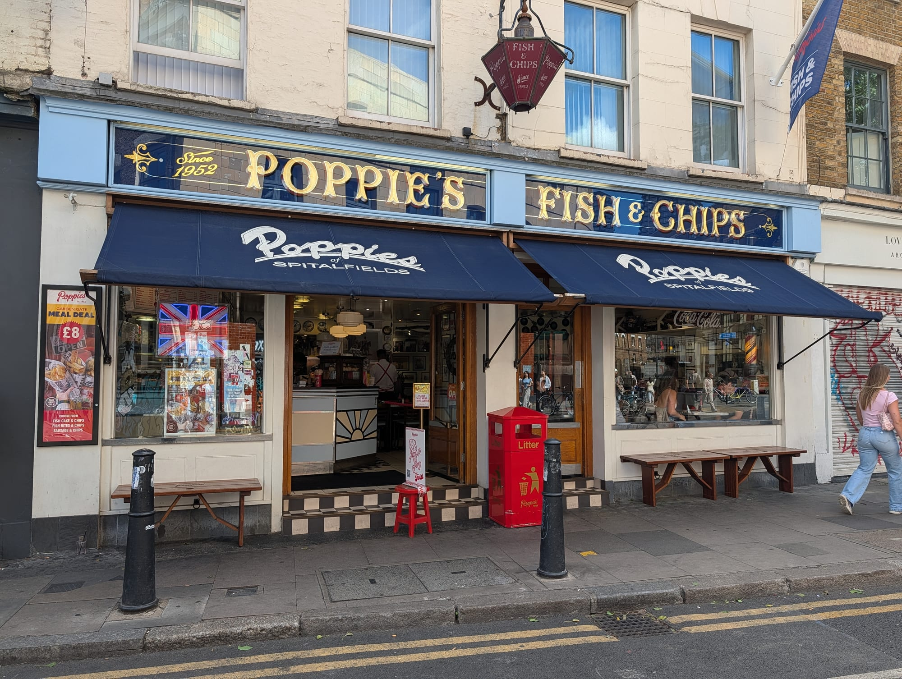

Everyone in London has a chippy they swear by, and almost nobody agrees on which one. Cod or haddock, beef dripping or vegetable oil, a sit-down shop with formica tables and a pot of tea or a paper parcel eaten on the walk home — the arguments are older than most of the shops having them.

So instead of adding one more opinion, we counted. Every shop below is placed by how many independent awards, critics and reviewers name it. Two things came straight out of the numbers: **the most-cited chippy in London does not appear on Time Out's list at all**, and **the two shops with an actual award are not the two everybody writes about**.

> 💡 **The Short Version:** **Poppies** is the most-cited chippy in London. **The Fryer's Delight** is the one that still fries in beef dripping. **Brockley's Rock** and **Stones** are the only London shops on the 2026 award shortlist. **Michael's Fish Bar** is Time Out's number one and costs half what the centre does. **Nautilus** fries in matzo meal. And **Masters Superfish** near Waterloo is the biggest portion for the money.

> 📊 **The evidence behind this guide**
> Nothing here is ranked on one visit. This pass reads **13 sources carrying 137 citations** across **58 named chippies**. **24 are named by two or more independent sources; 2 carry a dated award.**
> **Built on:** specialist blogs that actually leave Zone 1, plus the two London shops with a National Fish and Chip Awards placement.
> *Evidence rebuilt 30 August 2026 · [How we rank →](/how-we-rank/)*

## Where they are

  

    Map of the best fish and chips in London
  

  

    
Loading the interactive map…

  

  <noscript>
    
The interactive map requires JavaScript. Every entry below lists its area.

  </noscript>

| If you are near… | Where to eat |
| --- | --- |
| **Bloomsbury & Holborn** | The Fryer's Delight |
| **Marylebone** | The Golden Hind, The Seashell of Lisson Grove |
| **Soho & Covent Garden** | Golden Union, Rock & Sole Plaice |
| **Mayfair** | The Mayfair Chippy |
| **Waterloo & South Bank** | Masters Superfish, Fishcotheque |
| **Shoreditch & Spitalfields** | Poppies, Shoreditch Fish and Chips, Fish Central |
| **Hackney & Dalston** | Sutton & Sons, Faulkners |
| **North London** | Nautilus (West Hampstead), Toff's (Highgate), Mickey's Chippy (Stoke Newington) |
| **South London** | Ken's Fish Bar (Herne Hill), Fish Lounge (Clapham), Brockley's Rock (Brockley) |
| **Greenwich** | The Golden Chippy |
| **East London** | Michael's Fish Bar (Leytonstone) |
| **West London** | Stones (Acton), The Golden Chip of Hanwell |

**Price guide:** **£** under £12 a head · **££** £12–£22 · **£££** £25+.

---

## The two with an award

Worth separating out, because nothing else in this guide has been judged by anyone.

The **National Fish and Chip Awards** is the only national award for the category. It is run by the National Federation of Fish Friers, it is dated, and its Takeaway of the Year category runs a forty-shop shortlist down to twenty, then ten, then a winner announced each February. Two of the forty shops on the 2026 shortlist are in London — and one of them made the final ten.

### Brockley's Rock, Brockley

*££ · Brockley Road, SE4 · Cited by 4 sources · National Fish and Chip Awards 2026 shortlist*

**The only London chippy in the UK top ten.** The National Federation of Fish Friers named its ten Takeaway of the Year finalists in November 2025 and Brockley's Rock is the single London entry, against three from Yorkshire and two from Scotland.

On Brockley Road since 2011, on the site of a run-down Chinese takeaway. MSC-certified cod, a homemade tartare sauce it is known locally for, and the schools, raffles and food banks it supports — which the award judges on alongside the frying.

No masthead guide has got round to it.

### Stones Fish and Chips, Acton

*££ · Horn Lane, W3 · Cited by 3 sources · National Fish and Chip Awards 2026 shortlist*

**On the 40-shop National Fish and Chip Awards 2026 shortlist**, and a UK top-three finalist in two further categories — which makes it the most decorated chippy in London by a distance.

The thing that earns the awards is the sourcing: **hake alongside cod while cod stocks recover**, which almost no London shop does, plus haddock and daily specials. Batter is light and crisp, chips are hand-cut, and the frying oil is changed on a schedule rather than when it looks bad.

**££, walk-in, closed Monday.** Acton is a long way from anywhere on this list, and the awards are the reason to make the trip.

> **The award publishes almost nothing.** There is no winners page on the awards site and no archive of past results — the forty-shop shortlist had to be read from a news report, and only the ten-shop final is on the federation's own site. The February 2026 ceremony has been and gone without a public record of who won. That is a gap in the category, not in this guide.

---

## What the guides agree on

### Poppies Fish and Chips, Spitalfields

*££ · Spitalfields · 9 min from Aldgate East · Cited by 8 sources*

**Trading since 1952 and done out as a fifties chip shop** — jukebox, staff in period uniform, formica — which sounds like a theme and is closer to a restoration. Sites in Spitalfields, Camden, Soho and Notting Hill.

Cod, haddock and rock in a light batter with hand-cut chips, plus the full traditional supporting cast: **jellied eels, cockles, whelks and pie and mash**, which most shops dropped decades ago and this one kept.

**££, walk-in**, though the Spitalfields site takes bookings for larger tables. Eight sources name it — the joint most-cited chippy in the guide.

### The Fryer's Delight, Bloomsbury

*£ · Bloomsbury · 6 min from Holborn · Cited by 7 sources · #6, Time Out*

**Formica tables, beef dripping, and a room that has not been redecorated in decades** — the most-cited chippy in London, and the one that has changed least.

**Fried in beef dripping rather than vegetable oil**, which is the whole argument: a heavier, savoury batter and a flavour most shops abandoned on cost and health grounds. Cod, haddock, rock and skate, with thick chips and a saveloy for anyone who wants one.

**£, cash-friendly, walk-in, closed Sunday.** Not vegetarian-friendly in any sense — the dripping is in everything, including the chips.

### The Golden Hind, Marylebone

*££ · Marylebone · 5 min from Bond Street · Cited by 7 sources · #12, Time Out*

**Open since 1914**, with the **original art deco fryer still standing in the room** — no longer used, but left where it was, which tells you how this place thinks about itself.

Cod and haddock in a light batter, and — unusually — **grilled fish for anyone who does not want it fried**, which most chippies will not do. Hand-cut chips, proper mushy peas, and homemade fishcakes that regulars order instead of the fillet.

**££, walk-in, and BYO** — no licence, so bring a bottle. A sit-down room rather than a counter, and quieter at lunch than dinner.

### Fish Central, Clerkenwell

*££ · Clerkenwell · 11 min from Old Street · Cited by 7 sources · #9, Time Out*

**Half proper chippy, half sit-down fish restaurant**, on the edge of the Old Street roundabout — and one of the few places in London where the two halves are equally good.

The fryer does cod, haddock and rock in a crisp batter with thick chips; the restaurant menu behind it runs to **grilled fish, scallops and oysters** at prices a Clerkenwell restaurant would double. Seven independent sources name it, which is more than any other chippy here except the Fryer's Delight.

**££, walk-in**, and large enough to take a group without booking. Order from the restaurant menu if you are sitting down.

### The Seashell of Lisson Grove, Marylebone

*££ · Marylebone · 2 min from Marylebone · Cited by 5 sources · #3, Time Out*

**On Lisson Grove since 1964** and frying since before the war — the chippy that draws a celebrity crowd without changing anything about itself, which is the trick most of them fail.

Cod, haddock and **halibut** in a light batter, fried in groundnut oil rather than dripping, with proper chips and a full restaurant menu behind the takeaway counter. It is a sit-down room that happens to have a chip shop attached.

**££, and it takes bookings**, which almost nothing else in this guide does. Marylebone rather than tourist central, and busiest at dinner.

### Rock & Sole Plaice, Covent Garden

*££ · Covent Garden · 4 min from Covent Garden · Cited by 5 sources · #5, Time Out*

**Claims a lineage back to 1871**, which would make it the oldest chippy in London, with **pavement tables on a Covent Garden side street** — a rarity in a district where everywhere is indoors and full.

Large fillets of cod, haddock and plaice in a thick, well-browned batter with chunky chips — a bigger, heavier plate than the Marylebone chippies serve. The outdoor tables are the reason to pick it over the others in the centre.

**££, walk-in.** In the middle of the tourist route, so go early or late; the queue at 7pm is not worth it.

### Golden Union Fish Bar, Soho

*££ · Soho · 6 min from Oxford Circus · Cited by 5 sources · #17, Time Out*

**The Soho option**, and the one to know if you want fish and chips inside the theatre district rather than a walk away from it.

Sustainably sourced cod and haddock in a light batter, hand-cut chips fried in groundnut oil, and the standard sides done properly — **mushy peas, curry sauce, pickled onions**. A small sit-down room behind the counter.

**££, walk-in.** Two minutes from most of the Shaftesbury Avenue theatres, which is the entire argument for it — eat here before a show rather than trekking to Marylebone.

### Masters Superfish, Waterloo

*££ · Waterloo · 191 Waterloo Road · Cited by 4 sources · #4, Time Out*

**A south London institution five minutes from Waterloo**, buying from Billingsgate daily and frying several kinds of fish rather than just cod and haddock.

**Prawns and bread and butter arrive unasked while you wait**, which is the house tradition and catches everyone out the first time. The **mushy peas** are the ones people write about, and the cod comes in a batter that shatters properly. **Portions are large enough that the small is usually the right order.**

**££, walk-in, closed Sunday and Monday.** A proper sit-down room, and the best thing to eat within ten minutes of Waterloo.

### Toff's, Highgate

*££ · Muswell Hill · Cited by 4 sources · #16, Time Out*

**Muswell Hill's award-winning family chippy**, run by the same family since 1988, and the north London name that turns up on lists next to shops in far more fashionable postcodes.

Fish is bought daily and fried to order in a light batter, with **grilled and matzo-meal options** alongside — the Jewish north-London influence showing in the menu. Cod, haddock, plaice and skate, with proper chips.

**££, walk-in**, with a sit-down room behind the takeaway counter. Busiest on a Friday evening, which is traditional.

---

## Time Out's list and the citation counts barely overlap

Worth knowing before you treat any single guide as the answer.

Time Out ranks eighteen London chippies, and its number one is **Michael's Fish Bar** in Leytonstone — a cash-only counter with no seating that only one other source in this sources name. Its number two, **Fish Lounge** in Clapham, is not in any award. And **Poppies**, the most-cited chippy in the city, does not appear on its list at all.

| Time Out rank | Chippy | Cited by |
| --- | --- | --- |
| **#1** | Michael's Fish Bar, Leytonstone | 2 sources |
| **#2** | Fish Lounge, Clapham | 5 sources |
| **#3** | The Seashell of Lisson Grove, Marylebone | 5 sources |
| **#4** | Masters Superfish, Waterloo | 4 sources |
| **#5** | Rock & Sole Plaice, Covent Garden | 5 sources |
| **#6** | The Fryer's Delight, Bloomsbury | 7 sources |
| **#7** | Ken's Fish Bar, Herne Hill | 4 sources |
| **#9** | Fish Central, Clerkenwell | 7 sources |
| **#10** | Mickey's Chippy, Stoke Newington | 3 sources |
| **#11** | Faulkners, Dalston | 1 source |

Neither ranking is wrong. A ranked list is one editor's judgement made carefully; a citation count is how much of the trade agrees. Where they line up — The Fryer's Delight, Fish Central, The Seashell — you can be fairly confident.

---

## Cheap, and better for it

Everything here comes in under £12, and none of it takes a booking.

### Michael's Fish Bar, Leytonstone

*£ · Leytonstone · 4 The Pavement, Hainault Road · Cited by 2 sources · #1, Time Out*

**The chippy east London locals vote for** — 61% of Leytonstoner readers picked it — at prices central London stopped charging a decade ago.

Flaky batter, thick chips, and nothing else going on: **a takeaway counter, not a restaurant**, with no seating at all. That focus is the point and the reason the queue forms.

**CASH ONLY, under £10, closed Sunday.** Bring notes and eat it walking; there is nowhere to sit and no card machine. Leytonstone is the far end of the Central line, which is why the prices have not moved.

> ⚠️ **Cash only, and no seating.** It is a takeaway counter, not a restaurant.

### Fish Lounge, Clapham

*£ · Clapham · 16 min from Brixton · Cited by 5 sources · #2, Time Out*

**A Clapham chip shop with three guides behind it** and none of the tourist traffic of the central ones — Time Out puts it second in London, which is a considerable claim for a shop most people have never heard of.

Fish bought fresh and fried to order in a crisp, light batter, with hand-cut chips. The menu runs beyond cod and haddock into **sea bass, salmon and grilled options**, which is unusual at this price.

**£, walk-in, closed Sunday and Monday.** A small counter with limited seating — most people take it away.

### Ken's Fish Bar, Herne Hill

*£ · Camberwell · 6 min from North Dulwich · Cited by 4 sources · #7, Time Out*

**A south London chippy that three separate guides single out over far better-known names**, which is the whole reason it is here rather than a shop with a press office.

Straightforward and done right: cod and haddock in a crisp batter, chips fried properly, and the standard sides. No restaurant menu, no grilled options, no reinvention.

**£, walk-in, closed Sunday.** Herne Hill, and cheap enough that a full portion still leaves change from a tenner in most weeks. A few minutes from the station and the Sunday market, which is the reason to combine the two.

### Mickey's Chippy, Stoke Newington

*£ · Stoke Newington · walk-in · Cited by 3 sources · #10, Time Out*

**The Stoke Newington chippy that turns up on every north London list**, and it sits a few doors from one of the better pubs in the area — which is either a coincidence or the plan.

Cod and haddock fried to order in a light batter with thick chips, and the sides done as they should be. A counter operation with a handful of seats.

**£, under £12, walk-in, closed Sunday.** Take it to the pub down the road; most people do.

### Kennedy's, Clerkenwell

*£ · Goswell Road · Cited by 3 sources*

**Pies baked on the premises** — steak and Guinness, steak and Stilton — alongside the fryer, from a business that started about **150 years ago as a butcher's** known for its sausages. The pie is the reason to choose it over a pure chippy.

The **steak and Guinness pie** is the signature and the thing to order, with proper chips and gravy. Fish and chips is on the menu and is good; it is not why three sources name it.

**££, walk-in.** Clerkenwell, and the sausages are still made to the original recipes if you want to take some home.

### The Golden Chip of Hanwell, Hanwell

*£ · 33 Boston Road · 9 min from Hanwell · walk-in · Cited by 1 source*

Two brothers, a west London high street, and fish delivered from Scotland daily and fried in small batches to order. The batter has the proper shatter rather than the thick greasy coat, and the trade-off for small batches is that you wait on a Friday night.

**The Elizabeth line changed the maths** on getting there. Hanwell is now a straightforward run from Paddington or Tottenham Court Road, which it was not before 2022.

**Note:** this is not **The Golden Chippy** in Greenwich. Two different shops with near-identical names.

---

## The unusual ones

### Nautilus, West Hampstead

*££ · West Hampstead · 27–29 Fortune Green Road · Cited by 3 sources · #13, Time Out*

**Fish fried in matzo meal rather than batter** — the Jewish north-London tradition that predates the chip shop as most people know it, and a completely different, lighter crust.

Everything comes **coated in matzo meal, in matzo and egg, or grilled**. The **halibut** is the order, expensive and worth it; plaice, cod and haddock behind it. Portions are generous even by chippy standards, and the fried fish is good cold the next day, which is the traditional test.

**££, walk-in, and a sit-down restaurant as much as a takeaway** — around 48 seats. Nothing else on this page fries this way.

### Sutton & Sons, Hackney

*££ · Hackney · 2 min from Hackney Central · Cited by 5 sources · #8, Time Out*

**Runs a fully vegan chip shop alongside the traditional ones** — banana blossom instead of cod, wrapped in seaweed and battered, and it is convincing enough that the vegan site trades on its own rather than as a novelty.

At the traditional shops: fish bought from Billingsgate, fried in a light batter, with hand-cut chips. At the vegan one, **banana blossom "fish"**, vegan scampi and battered sausage. Five sources name the group.

**££, walk-in.** Several Hackney and Islington sites — check which one you are heading to, because they are not interchangeable.

### The Mayfair Chippy, Mayfair

*£££ · Mayfair · 4 min from Bond Street · Cited by 2 sources · #14, Time Out*

**Fish and chips treated as a restaurant dish rather than a takeaway**, with oysters, crab and mussels alongside — trading since 2015 and carrying an **AA rosette** for it, which no other shop in this guide has.

The **Mayfair Classic** is the order: a large battered fillet with chips, mushy peas, tartare sauce and a pot of curry sauce, plated rather than wrapped. Shellfish and a proper wine list either side of it.

**£££ — the most expensive entry here by some distance** — open seven days for lunch and dinner, and worth booking a few days ahead. Takeaway runs alongside the dining room if you want the fish without the room.

### The Golden Chippy, Greenwich

*££ · 62 Greenwich High Road · Cited by 3 sources · open until 11pm*

**A Greenwich chip shop that built a large following on review sites rather than in the food press** — fresh fish daily, thick hand-cut chips, and a proper sit-down room behind the counter.

Cod and chips is the order, fried to order in a crisp batter, with generous portions. **Halal preparation is available on request**, which very few chippies offer and which is the reason a good number of people travel to it.

**Open 11am–11pm Monday to Saturday and noon–11pm on Sundays** — far later than most chippies, and the reason it works after an evening at the Cutty Sark or the market, both about ten minutes' walk away.

### Faulkners, Dalston

*££ · Dalston · 424–426 Kingsland Road · Cited by 1 source · #11, Time Out*

A **Kingsland High Street institution** and one of the last of the old east London chippies still trading in its original form, in a proper sit-down dining room rather than a counter with a bench.

Cod, haddock, plaice, skate and rock in a light batter, with **matzo-meal and grilled options** alongside — the same north and east London Jewish influence that shapes Nautilus and Toff's. Chips are thick and the portions are large.

**££, walk-in.** Table service, which is unusual for a chippy, and the reason it works for a sit-down dinner rather than a wrapped parcel.

---

## Also named, with less behind them

Everything else the sources carry by two or more independent sources.

| Chippy | Where | Price | Sources | What it is |
| --- | --- | --- | --- | --- |
| **Oliver's Fish & Chips** | Belsize Park | ££ | 4 | Haverstock Hill, frying in pure rapeseed oil with no animal fats; the best-supported chippy on no ranked list at all |
| **Fishcotheque** | Waterloo | ££ | 3 | On Waterloo Road, trading since 1972, and the one counter here two video channels went out of their way to film |
| **Hobson's Fish & Chips** | Bayswater, Soho and Villiers Street | ££ | 2 | Three branches; the family ran Oliver's in Belsize Park before taking on the Bayswater site |
| **Seventeen** | Balham | ££ | 2 | A modern chippy on Chestnut Grove — lighter frying, carefully sourced fish. Only one source gives its street and it has no website, so check before travelling |
| **Shoreditch Fish and Chips** | Shoreditch | ££ | 1 | A 1960s-styled shop near Brick Lane doing the traditional version straight, sauces thrown in rather than charged for |

Powered by <a target="_blank" rel="sponsored" href="https://www.getyourguide.com/london-l57/">GetYourGuide</a>

---

## What to know before you go

* **Beef dripping vs vegetable oil** is the real dividing line. The Fryer's Delight still uses dripping; most others switched decades ago. Dripping gives a heavier, savoury chip — and makes the chips not vegetarian.
* **Cod or haddock** is the standard choice. Haddock is sweeter and flakier, cod firmer. Masters Superfish and Nautilus both go well beyond the two.
* **Ask for scraps.** The loose bits of fried batter, free at most counters, and never listed on a menu.
* **Most chippies close one day a week**, usually Sunday or Monday, and some close between lunch and dinner. Check before crossing London for a specific one.
* **Cash only** at Michael's Fish Bar.
* **A citation count is not an award.** Only two shops on this page have been judged by anyone, and neither is one of the famous ones.

---

## Continue planning your London trip

- 🐟 **[The Best Seafood Restaurants in London](/articles/best-seafood-restaurants-london/)**
- 🍽️ **[Eat in London: Restaurants, Food Markets & Quick Food Hub](/articles/eat-in-london-guide/)**
- 🍕 **[The Best Pizza in London](/articles/best-pizza-london/)**
- 🍛 **[The Best Indian Restaurants in London](/articles/best-indian-restaurants-london/)**
- 🥩 **[The Best Sunday Roast in London](/articles/best-sunday-roast-london/)**
- 🏙️ **[City of London Area Guide](/articles/city-of-london-area-guide/)**
- 🎭 **[Covent Garden Area Guide](/articles/covent-garden-area-guide/)**
