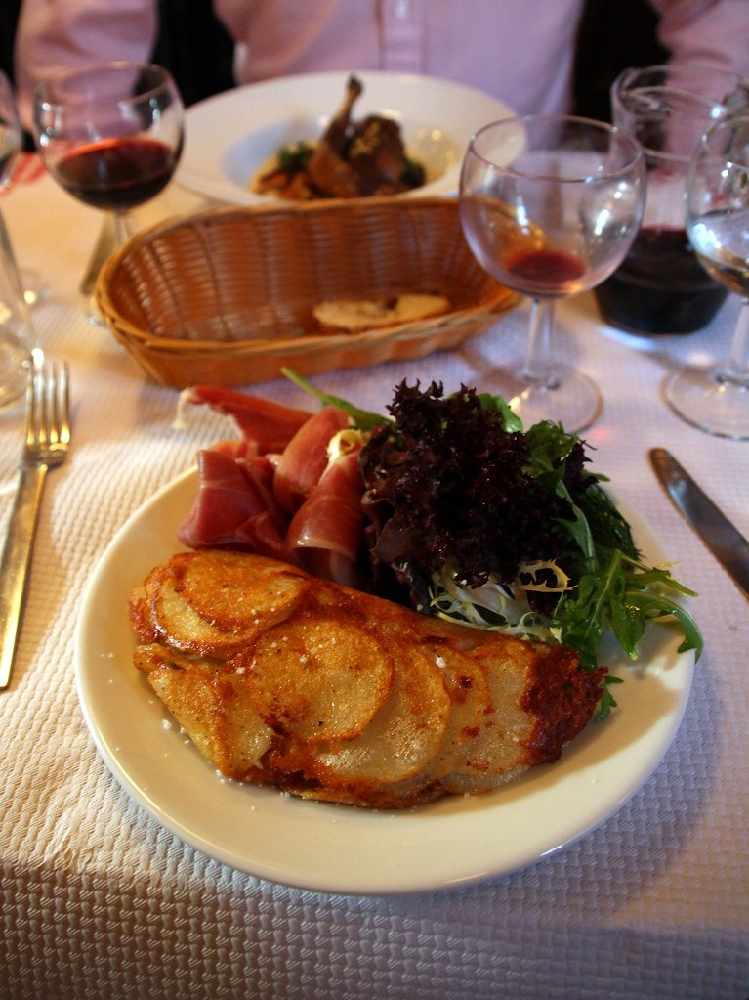
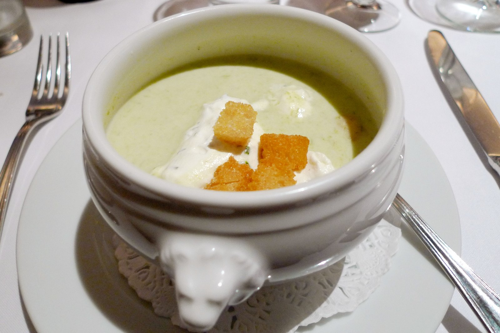
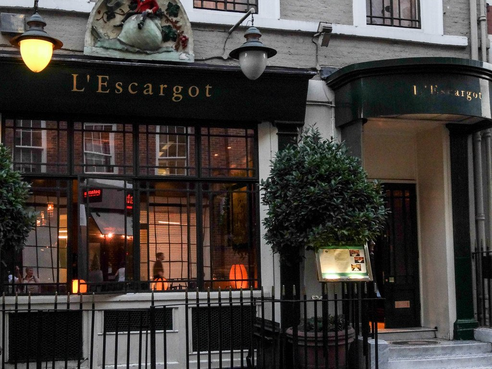
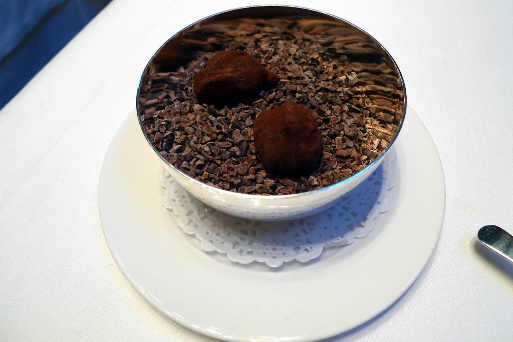
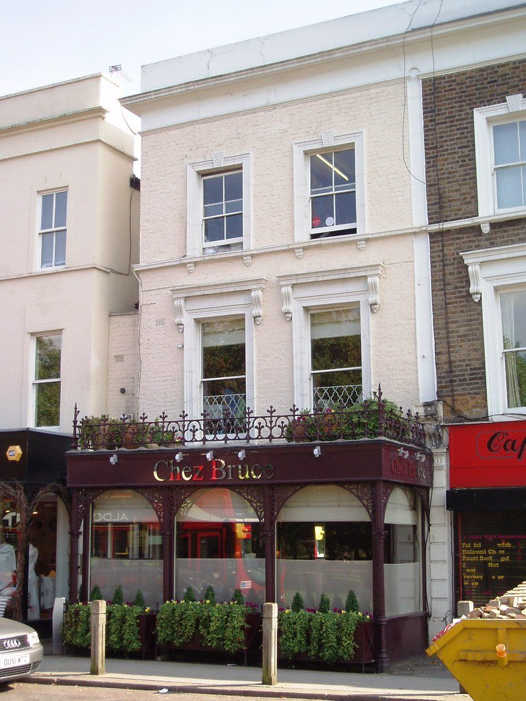
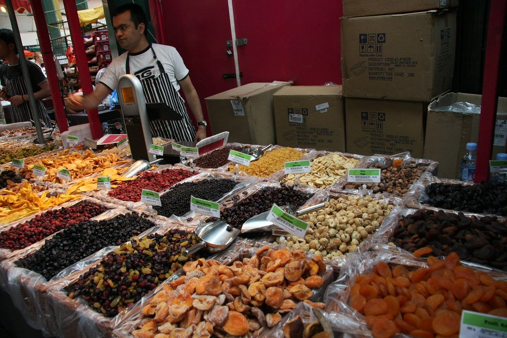

French cooking in London runs from two three-star hotel dining rooms to a Farringdon pub upstairs doing bourgeois classics that had gone out of fashion entirely. The revival at the bistro end has been the more interesting story.

> 💡 **The Short Version:** **Alain Ducasse** and **Hélène Darroze** are two of London's six three-star kitchens. **Bouchon Racine** is the bistro revival, above a pub. **Otto's** presses duck at your table. **La Poule au Pot** has been romantic by candlelight since the 1960s. And **lunch is much cheaper everywhere**.

> 📊 **The evidence behind this guide**
> Nothing here is ranked on one visit. This pass reads **7 sources carrying 114 citations** across **72 named restaurants**. **19 restaurants are named by two or more independent sources; 27 carry a dated Good Food Guide listing.**
> **Built on:** the Good Food Guide's twenty-seven inspected French restaurants in London, read against the editorial lists.
> *Evidence rebuilt 30 August 2026 · [How we rank →](/how-we-rank/)*

## Where they are

| If you are near… | Where to eat |
| --- | --- |
| **Mayfair** | Alain Ducasse at The Dorchester, Hélène Darroze at The Connaught |
| **Belgravia** | La Poule au Pot, Brooklands |
| **Clerkenwell & Farringdon** | Bouchon Racine, Pique-Nique |
| **Holborn** | Otto's |
| **Covent Garden** | Clos Maggiore, Mon Plaisir, Maison François (St James's) |
| **Soho** | The French House, L'Escargot |
| **Fitzrovia** | 64 Goodge Street |
| **Borough & Bermondsey** | Camille, Casse-Croûte |
| **Spitalfields** | Galvin La Chapelle |
| **East London** | Planque (Haggerston) |
| **South & north** | Chez Bruce (Wandsworth), Les 2 Garçons (Crouch End) |

**Price guide:** **£££** £40–£70 · **££££** £90+ · tasting menus £150+.

---

## The three-star rooms

### Alain Ducasse at The Dorchester, Mayfair

*££££ · Park Lane · book months ahead*

**Classical French haute cuisine at three Michelin stars**, inside The Dorchester on Park Lane — the most decorated French kitchen in the country and one of only a handful of three-star rooms in Britain.

The cooking is Ducasse orthodoxy: sauces reduced for hours, luxury produce handled with restraint, and a tasting menu that moves slowly. The room's other draw is the **Table Lumière** — a private table for six ringed by a curtain of fibre optics, and the single most requested seat in Mayfair.

**££££, closed Sunday and Monday, and it books months ahead. Ask about the Table Lumière specifically when booking; it is not offered by default.**

### Hélène Darroze at The Connaught, Mayfair

*££££ · Carlos Place · book months ahead* · Cited by 1 source

**Three stars for cooking rooted in Darroze's native Landes**, in south-west France — a regional French kitchen at the very top end, which London has almost none of. The **third star came in 2021**.

Expect the produce of Gascony treated at three-star level: **Landes duck, foie gras, Armagnac**, and vegetables from named growers, in a tasting sequence chosen from an ingredient list rather than a fixed menu. It is warmer and less austere than most cooking at this level.

**££££, closed Sunday and Monday, books months ahead.** Inside The Connaught, so the room is the hotel's rather than the restaurant's own.

---

## The bistro revival

### Bouchon Racine, Clerkenwell

*££££ · 3 min from Farringdon · above a pub* · Cited by 3 sources

**Henry Harris cooking unapologetic French bourgeois food above a Farringdon pub** — and **named the best restaurant in the UK at the 2026 National Restaurant Awards**, which is a considerable thing for a room over a boozer.

The menu is the old repertoire done without irony: **snails, veal kidneys, duck confit, tarte tatin**, in butter and cream quantities modern kitchens have talked themselves out of. Harris ran Racine in Knightsbridge for a decade before this.

**££££, closed Sunday and Monday, and it books months ahead** — considerably harder to get into since the award.

### La Poule au Pot, Belgravia

*££££ · 5 min from Sloane Square · since the 1960s* · Cited by 1 source

**Trading since the 1960s on coq au vin, beef bourguignon and candlelight** — the most reliably romantic dining room in London by some distance, and it has not changed in decades.

The menu is written in French with no translation, which is part of the act. **Coq au vin**, **bœuf bourguignon** and a whole roast chicken for two, served in copper pots at tables crowded with dried flowers and mismatched china.

**££££ and it books weeks ahead.** Belgravia. Ask for a corner table; the room is dark enough that it matters.

---

## Classical technique

### Otto's, Holborn

*££££ · 7 min from Chancery Lane · order in advance* · Cited by 4 sources

**Canard à la presse carved and pressed at the table** — one of the last places in London performing classical French service as theatre, and the reason to book rather than the food alone.

The duck is roasted, carved, and the carcass crushed in a **silver duck press** to extract the juices for the sauce, all in front of you, over about forty minutes. It must be ordered **48 hours in advance**. Beyond it, lobster Thermidor and the rest of the old canon.

**££££, closed Sunday and Monday, books weeks ahead.** Order the duck when you book or do not bother coming for it.

### Brooklands, Belgravia

*££££ · on the roof of the Peninsula*

**Claude Bosi cooking on the roof of the Peninsula**, in a room themed on British motor racing and aviation, looking over Hyde Park Corner — with a **Concorde model suspended through the dining room**.

Bosi holds two stars at Bibendum and the cooking here is in the same register: French technique, British produce, and a tasting menu that takes its time. The view over Wellington Arch and the park is the other half of the ticket.

**££££, closed Sunday and Monday, and it books months ahead.** Ask for a window table when booking; it is the whole point of being on the roof.

---

## The bistros people actually book

### Camille, Borough

*£££ · Borough Market* · Cited by 3 sources

A Borough Market bistro cooking the French provincial repertoire without apology — small, permanently full, and one of the openings that made French food fashionable in London again.

The menu is short and changes constantly: **terrines and pâté en croûte**, offal, slow-cooked meat, and a **tarte** to finish. Everything leans on the market it sits beside, so what is on depends on the day. Natural wine list rather than a classical one.

**£££ and it books weeks ahead** — a small room with a large following. Lunch is easier to get than dinner.

### Casse-Croûte, Bermondsey

*£££ · Bermondsey Street* · Cited by 5 sources

**Three dishes per course chalked on a board, a room the size of a front parlour, and no concession to anything but France** — the most convincingly French room in London, and one of the smallest.

The board changes daily and offers exactly three starters, three mains and three puddings. Expect **rillettes, blanquette de veau, îles flottantes** — bistro cooking done seriously, in a room with about twenty covers and red-checked tablecloths.

**£££ and it books weeks ahead.** Bermondsey Street. Three editorial sources and a Good Food Guide entry — as much agreement as this topic produces.

*A tiny Bermondsey bistro with a blackboard menu of three starters, three mains, three puddings. It changes daily. Photo: [Bex.Walton](https://www.flickr.com/photos/7831824@N04/34881836400), [CC BY 2.0](https://creativecommons.org/licenses/by/2.0/).*

### Pique-Nique, Bermondsey

*£££ · Tanner Street Park* · Cited by 4 sources

**The Casse-Croûte team in a former park pavilion in Bermondsey**, built around **rotisserie chicken** and a short set menu — the same hands, a different and cheaper format.

The chicken comes off the spit and is the thing to order; there is a **set menu** of five or so courses for anyone wanting the full treatment. The pavilion setting, in Tanner Street Park, is unlike anywhere else in this guide.

**£££ and it books weeks ahead.** Easier to get into than Casse-Croûte and roughly as good.

### 64 Goodge Street, Fitzrovia

*£££ · 64 Goodge Street* · Cited by 3 sources

**A Fitzrovia brasserie from the Woodhead group doing the format straight** — steak frites, a long bar, and late service, with none of the reinvention the postcode usually attracts.

**Steak frites** is the order and the reason the room exists; oysters, soufflé and the standard brasserie canon around it. The bar runs the length of the room and takes walk-ins when the tables have gone.

**£££, books weeks ahead**, and serving later than most of this guide — useful after a show or a late finish.

### Maison François, St James's

*£££ · Duke Street* · Cited by 3 sources

**A grand Parisian brasserie in St James's**, done at full scale — high ceilings, banquettes, a trolley, and the sort of room London stopped building decades ago.

Classic brasserie cooking with the theatre intact: **the dessert trolley**, wheeled over and worked through in front of you, and a **grand plateau de fruits de mer** for the table. Steak, sole and soufflé behind them. **Frank's**, the bar downstairs, is a separate and quieter proposition.

**££££ and it books weeks ahead.** One of the few genuinely large French dining rooms in central London.

### Les 2 Garçons, Crouch End

*£££ · Crouch End* · Cited by 2 sources

**A Crouch End neighbourhood bistro that would pass without comment in Lyon** and stands out considerably in north London — run by two Frenchmen, as the name says.

The menu is short and traditional: **escargots, steak tartare, duck confit, crème brûlée**, cooked properly and priced for a neighbourhood rather than for a destination. Nothing on it is trying to be modern.

**£££, closed Sunday and Monday, and it books weeks ahead** — a small room and a local following that fills it.

---

## The old rooms

### Mon Plaisir, Covent Garden

*£££ · Monmouth Street* · Cited by 3 sources

**London's oldest French restaurant**, opened in the 1940s, with a zinc bar salvaged from a Lyon brasserie and four connected dining rooms that have been added one at a time over the decades.

The pre-theatre menu is the reason most people go, and it is genuinely cheap for the postcode.

*London's oldest French restaurant, four knocked-together rooms of it, and the pre-theatre menu is the bargain. Photo: [Ewan Munro from London, UK](https://commons.wikimedia.org/w/index.php?curid=24281649), [CC BY-SA 2.0](https://creativecommons.org/licenses/by-sa/2.0/).*

### L'Escargot, Soho

*£££ · Greek Street* · Cited by 3 sources

**Soho's oldest French restaurant, open since 1927**, on Greek Street — and the room has the layers of history to match, with a private dining floor above the main one.

**Snails** are on the menu for the obvious reason and are the thing to order at least once, alongside a full classical repertoire: **coq au vin, steak tartare, soufflé**. The ground-floor room is the one with the atmosphere.

**£££ and it books ahead.** Central Soho, so it works before a theatre; the dining room upstairs is quieter.

*Soho's oldest French restaurant, open since 1927, and still serving the snails. Photo: [michaeljohnbutton](https://www.flickr.com/photos/73156278@N08/9671711481), [CC BY 2.0](https://creativecommons.org/licenses/by/2.0/).*

### The French House, Soho

*££ · Dean Street · no chips, no phones* · Cited by 5 sources

**The Soho pub that was the Free French headquarters in the war** — de Gaulle drank here — with a small dining room above it and **beer served only in halves downstairs**, which is a house rule rather than a gimmick.

The upstairs room does a short, changing menu of French and British cooking: offal, whole fish, and the sort of dishes that suit the room. **No music, no mobile phones downstairs**, and the bar is the point as much as the food.

**£££ and the dining room books weeks ahead.** Drink in halves downstairs first; it is the tradition and they will not serve you a pint anyway.

### Galvin La Chapelle, Spitalfields

*££££ · Michelin star · a converted chapel* · Cited by 3 sources

**A Michelin-starred dining room inside a former Victorian girls' school chapel** in Spitalfields — vaulted ceilings, arched windows and a mezzanine, and one of the most striking dining rooms in London.

The cooking is classical French with a light touch: **Dorset crab lasagne**, tagine of Bresse pigeon, and a soufflé to finish. The Galvin brothers have held the star here since 2011.

**££££ and it books weeks ahead.** The set lunch is significantly cheaper than dinner and served in the same room.

*A Victorian former school hall in Spitalfields, with a vaulted ceiling that does most of the work. Photo: [Ewan-M](https://www.flickr.com/photos/55935853@N00/4286655868), [CC BY-SA 2.0](https://creativecommons.org/licenses/by-sa/2.0/).*

### Chez Bruce, Wandsworth

*££££ · Michelin star · by Wandsworth Common* · Cited by 2 sources

**A neighbourhood restaurant on Wandsworth Common that has held a Michelin star for over two decades** — and is still, above everything, somewhere local people eat regularly.

The cooking is French with British produce and no theatre: **offal treated seriously**, a strong cheese board wheeled to the table, and puddings in the old style. The set menu format keeps it accessible for what it is.

**££££ and it books weeks ahead** — particularly for Sunday lunch, which is the service locals guard. A long way from central London and worth the journey.

*The neighbourhood restaurant other chefs name when asked where they eat on a night off. Photo: [Ewan-M](https://www.flickr.com/photos/55935853@N00/2879798210), [CC BY-SA 2.0](https://creativecommons.org/licenses/by-sa/2.0/).*

### Planque, Haggerston

*£££ · a wine warehouse* · Cited by 2 sources

**A wine warehouse with a restaurant attached** on the Haggerston side of Kingsland Road — members store their own bottles in the racks along the wall, which is the room's organising idea.

The kitchen cooks modern French to match the cellar: a short menu built around **fire and fermentation**, with plates designed to be ordered against a bottle rather than the other way round. You do not need to be a member to eat there.

**£££ and it books ahead.** Come for the wine list; the food is built to serve it and does the job well.

---

## Best value

French food in London has a reputation for being expensive that the bistro end no longer deserves.

### Borough Market

The cheapest French food in London is **standing up at Borough Market**. There is raclette scraped onto potatoes, saucisson and cheese from the French traders, and galettes from the crêpe stalls — a proper lunch for under a tenner, thirty seconds from Camille's front door.

**Maltby Street Market** ten minutes away does the same trick on Saturdays, with fewer people.

#### Pre-theatre and set lunch

* **Mon Plaisir's pre-theatre menu** is among the cheapest sit-down French meals in Covent Garden, in London's oldest French restaurant.
* **Pique-Nique's set menu** is materially cheaper than its sibling Casse-Croûte for the same kitchen's thinking.
* **Otto's set lunch** costs a fraction of the pressed duck — and the duck needs ordering in advance anyway.
* **Lunch menus generally.** Every restaurant on this page runs one at a fraction of dinner, from the same kitchen. This is more true of French restaurants in London than of any other cuisine.

#### The bistros

* **Bouchon Racine** is still the best-value serious French cooking in London, and it is above a pub.
* **Casse-Croûte** and **Les 2 Garçons** both run about £40–£55 a head for three courses.
* **The French House** is a pub, and priced like one downstairs.

*Borough is at its best for raw materials rather than lunch — the cheese, fish and produce stalls are what the traders come for. Photo: [tonylanciabeta](https://www.flickr.com/photos/88589821@N00/3871464899), [CC BY-SA 2.0](https://creativecommons.org/licenses/by-sa/2.0/).*

Powered by <a target="_blank" rel="sponsored" href="https://www.getyourguide.com/london-l57/">GetYourGuide</a>

---

## What to know

* **Canard à la presse must be ordered in advance** — it is a whole-duck preparation and takes the kitchen a long time.
* **The Table Lumière at Ducasse** seats six and is requested more than any other table in Mayfair. Ask early.
* **Dress codes** are smart at the hotel rooms; the bistros have none.
* **Lunch is the value.** This is more true of French restaurants in London than any other cuisine.
* **Service charge** of 12.5% is discretionary and standard.

---

## Continue planning your London trip

- ⭐ **[Special Occasion Restaurants in London](/articles/special-occasion-restaurants-london/)**
- 🇮🇹 **[Best Italian Restaurants in London](/articles/best-italian-restaurants-london/)**
- 🥘 **[Best Spanish Restaurants in London](/articles/best-spanish-restaurants-london/)**
- 🍽️ **[Eat in London: Restaurants, Food Markets & Quick Food Hub](/articles/eat-in-london-guide/)**
- 🛍️ **[Mayfair Area Guide](/articles/mayfair-area-guide/)**
- 🏙️ **[City of London Area Guide](/articles/city-of-london-area-guide/)**
