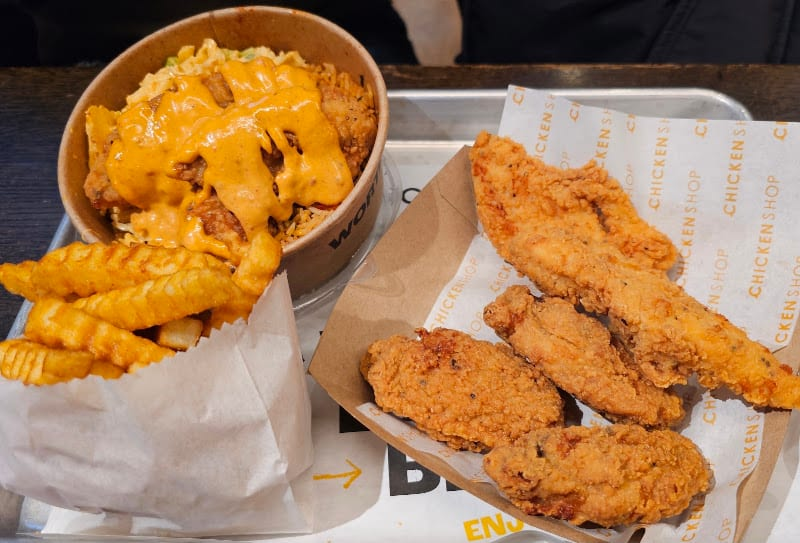
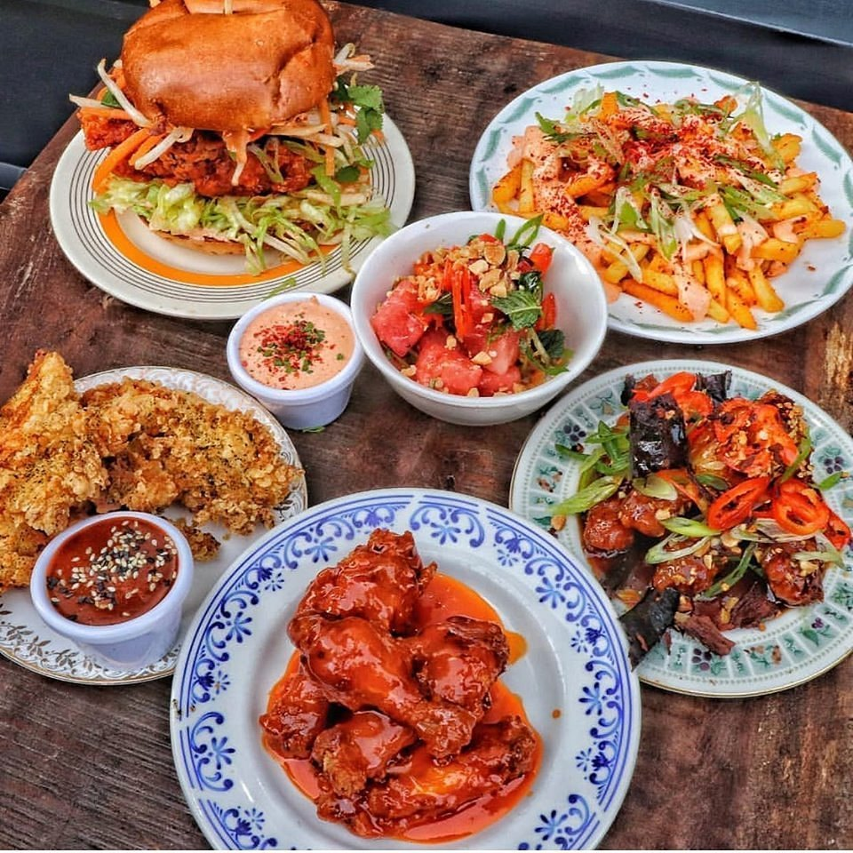
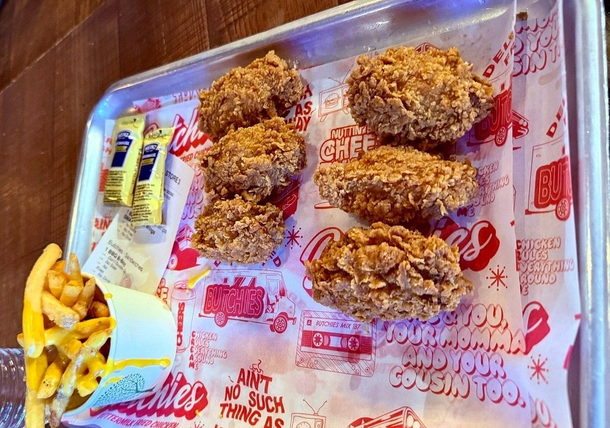
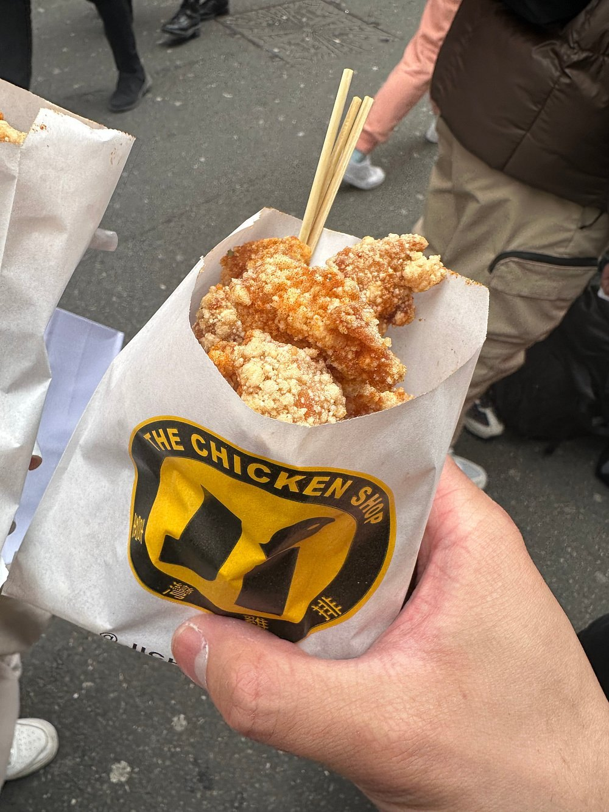
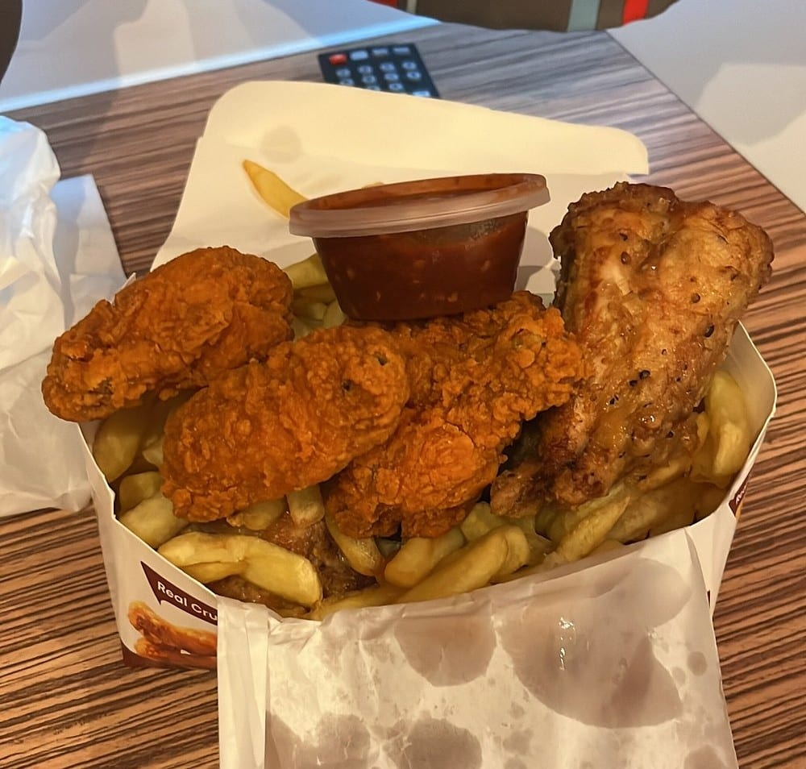
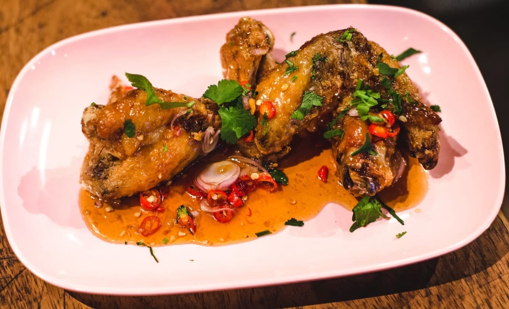
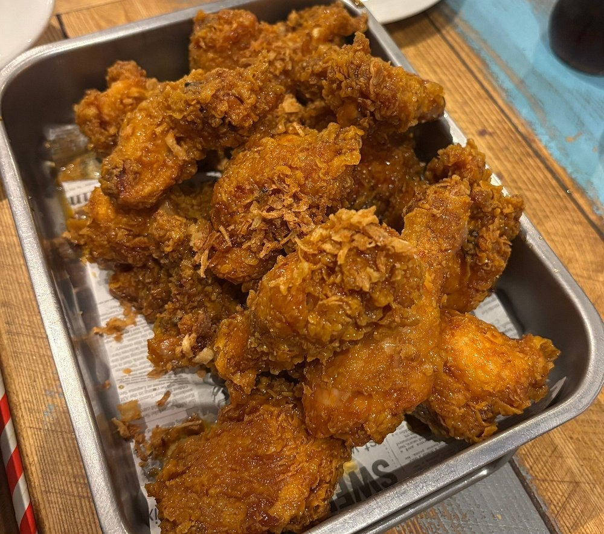

Ask who fries the best chicken in London and you get two answers that do not overlap.

Britain's only judged fried chicken competition ran for the first time in January 2026, and gave the title to **20Ft Fried Chicken**, a West End operation that appears on **no editorial list in this pass at all**. Meanwhile the place named by more independent sources than anything else in the city is **Good Friend**, a Taiwanese counter in Chinatown that has never won anything.

That disagreement is not a flaw in the evidence. It is the most interesting thing about the subject: the judges are scoring a plate, and the writers are recommending a trip.

> 💡 **The Short Version:** **20Ft Fried Chicken** won the only judged championship. **Good Friend** in Chinatown is named by more sources than anything else. **Chick'N'Sours** and **Butchies** are the only two names in both camps — and Chick'N'Sours is at the Big Chill in King's Cross. **Morley's** is the chicken shop the serious lists actually name. For Korean, go to **New Malden**.

> 📊 **The evidence behind this guide.**
> Nothing here rests on one visit. This pass reads **14 independent sources carrying 130 citations** across **75 named venues**. **22 are named by two or more sources; six carry a dated award.**
> **Built on:** one judged championship, seven mastheads, two independent blogs and four YouTube channels — counted per creator, so a channel's five videos are one voice.
> *Evidence built 7 September 2026 · [How we rank →](/how-we-rank/)*

## Where they are

| If you are near… | Where to eat |
| --- | --- |
| **Chinatown & Leicester Square** | Good Friend |
| **Soho & Oxford Street** | Bao, Kricket, Manna (Arcade Food Hall), 20Ft (Holles Street), CheeMc Soho |
| **Covent Garden** | Lucky's Hot Chicken (Seven Dials Market) |
| **Shoreditch** | Butchies, Smoking Goat |
| **King's Cross** | Chick'N'Sours (Big Chill) |
| **Elephant & Castle** | CheeMc, La Barra |
| **North London** | Chick King (Tottenham) |
| **South London** | Morley's (everywhere), Maureen's (Brixton) |
| **New Malden** | Chick and Beers, Tongdak, Imone |
| **West & north-west** | Normah's (Queensway), The Best Broasted (Willesden) |

**Price guide:** **£** under £15 a head · **££** £15–£30 · **£££** £35+.

---

## The ones that won something

Britain had no judged fried chicken award until this year. The **Fried Chicken Championships** changed that in January 2026: four judges, five scoring criteria, and a result close enough that two entrants finished on identical points.

### 20Ft Fried Chicken — the champion nobody writes about

*£ · Holles Street, W1 · 2 min from Oxford Circus · Champion, Fried Chicken Championships 2026*

**It won on the 20Ft Hot Chicken Burger**, and it is the strangest result in this guide: a national title, and not one of the seven mastheads or two blogs in this pass names it. It trades off Holles Street just behind Oxford Street and through the delivery platforms.

If you want to know what the judges rewarded rather than what the critics recommend, this is the only place to go — and the gap between those two things is the reason this guide exists.

*The national champion, served off a metal tray on a side street behind Oxford Street. No masthead in this pass names it.*

### Chick'N'Sours — joint second, and it is at the Big Chill

*£–££ · King's Cross · Joint second, Fried Chicken Championships 2026 · Cited by 7 sources*

*The full spread, served seven days a week at the Big Chill.*

**Go to the Big Chill at King's Cross.** Seven independent sources name Chick'N'Sours and a national panel placed it joint second, and the Big Chill is where you eat it — the full menu, seven days, across a three-floor bar with a roof terrace.

There is a second kitchen at Corner Corner in Canada Water, but it runs Thursday to Sunday only, so King's Cross is the one to aim for.

### Butchies — joint second, and the tenders beat the burger

*£ · Shoreditch · Joint second, Fried Chicken Championships 2026 · Cited by 6 sources*

*The tenders rather than the sandwich - which is what Time Out says to order here, at a place built on burgers.*

Tied with Chick'N'Sours on points, and the only one of the top three you can walk into as an ordinary restaurant. It is known for buttermilk-fried **chicken sandwiches** — but Time Out's verdict is that **the tenders are the better order**, which is an unusual thing for a source to say about a place built on burgers.

They arrive with house BBQ sauce as standard. Order extra dips; skip the blue cheese, which Time Out describes as watery.

**Fortune Fried Chicken** took third with Nam Jim chicken tenders. It is a sister brand to Gunpowder, and like the champion, it appears on no editorial list here.

---

Powered by <a target="_blank" rel="sponsored" href="https://www.getyourguide.com/london-l57/">GetYourGuide</a>

## The ones the sources agree on

### Good Friend — the most-cited fried chicken in London

*£ · 14 Little Newport Street, WC2H 7JJ · 1 min from Leicester Square · Cited by 7 sources*

*Popcorn chicken from the yellow shopfront on Little Newport Street. There is nowhere to sit - you eat it walking.*

**Seven independent sources — five mastheads and two YouTube channels — name this Taiwanese counter, more than anything else in the city.** No judge has given it anything, which is the mirror image of 20Ft.

Taiwanese fried chicken came out of night-market stalls in the late 1970s, trying to copy the western chicken nugget and arriving somewhere better: **popcorn chicken**, boneless, bite-size, fried dark. That is the order. After it you choose from **eleven seasonings** shaken over the top — plum and chilli is the one two sources single out. The menu also runs to a flattened whole crispy breast, crispy squid, chicken skin, tofu and sweet potato.

**There is nearly always a queue out of the bright yellow shopfront, and it moves fast** — the staff work at a pace that makes the line look worse than it is. Takeaway is the norm; this is not a room you linger in.

### Morley's — the chicken shop the critics actually name

*£ · Branches across London · Cited by 5 sources*

London has thousands of chicken shops and the serious lists name this one. It started in south London and now runs from **Edmonton to Finsbury Park to Brick Lane**, which has cost it none of its standing.

**The spicy wings are the order** — fried in a peppery spice mix, and **about 80p each**, which is the whole argument. Nothing here is trying to be a restaurant.

### Chick King — Tottenham, and worth the journey

*£ · 755 High Road, N17 8AH · Cited by 4 sources*

A rain-or-shine Tottenham takeaway that four sources treat as a destination rather than a local. The chicken is fried hard enough to stay crunchy without turning greasy, and seasoned without going salty. **Takeaway operation — there is no dining room to speak of.**

*Chicken over chips in a box, which is the whole operation — there is nowhere to sit. Fried hard enough to stay crunchy without going greasy.*

### La Barra — Colombian, and enormous

*£ · 147 Eagle Yard Arch, Walworth, SE1 6SP · Cited by 4 sources*

**The five-piece Dominican fried chicken plate**, which arrives with plantain and a pile of chicharrónes and is considerably more food than the name suggests. The batter is thick and deeply crunchy. Squeeze the lemon over it and ask for the house chilli sauce.

An Elephant and Castle railway arch, good for groups, and cheap. **Plan nothing for afterwards.**

**Coqfighter** is also named by four sources and is the third of this group.

### Smoking Goat — the wings that are not really fried chicken

*££ · 64 Shoreditch High Street, E1 6JJ · Cited by 3 sources*

A Thai restaurant, and the **chilli fish sauce wings** are why it appears in a fried chicken guide at all. Sweet, sour, and crunchy enough to do damage to the roof of your mouth. A proper Shoreditch dining room rather than a counter — this is the one on the list you would take someone to for dinner.

*The chilli fish sauce wings, and the reason a Thai restaurant is in a fried chicken guide. Sweet, sour and sharp rather than battered and salted.*

### Bao — Taiwanese fried chicken as a bar snack

*££ · 53 Lexington Street, W1F 9AS · Cited by 3 sources*

The batter is light rather than armoured — more rain jacket than parka — with a sharp vinegary hot sauce over the top. Ask for extra on the side.

**A portion is four or five pieces and will not touch the sides**, so order two. Counter seating, good for eating alone, and it takes bookings, which almost nothing else here does.

### Chick and Beers — Korean, in New Malden

*£ · 282 Burlington Road, New Malden, KT3 4NL · Cited by 3 sources*

*Double-fried, then glazed and topped with fried shallots. New Malden, and worth the journey out.*

Family-owned, and the local reference point. The chicken is **double-fried** for the crackle that technique exists to produce, and the batter lands between rugged and glossy. **Sticky nuggets** are the order.

---

## By tradition, because they are not the same food

The word covers at least six different things in London, and a reader who wants Nashville heat will not be satisfied by a Taiwanese popcorn cup.

**Korean.** Double-fried, sauced, and built for sharing over beer. **New Malden is the centre** — Chick and Beers, **Tongdak** on Kingston Road (seven seasonings, and a 20–30 minute wait because it is fried to order) and **Imone** on the High Street (kan pung gi, in a smoky, spicy sauce) are all in the same quarter. In the centre, **CheeMc** has Elephant and Castle and Soho branches and sells seven flavours, of which the honey butter powder is the best-known.

**Taiwanese.** Lighter batter, boneless, seasoned from a shaker rather than sauced. Good Friend and Bao.

**Nashville hot.** Cayenne-heavy oil, served in a bun with pickles. **Lucky's Hot Chicken** at Seven Dials Market and Mikkeller on Exmouth Market twice-fries its strips and sandos, with heat levels from "country" up to an XXX seasoning. **Manna** inside Arcade Food Hall on New Oxford Street does the bun version with cheese, pickles and a house sauce.

**Caribbean and West African.** **Maureen's Brixton Kitchen** on Railton Road runs as a Jamaican home kitchen and is a takeaway operation rather than a dining room.

**South Asian.** **Kricket** in Soho does Keralan fried chicken — thighs marinated in tandoori spices then rolled in masala, flour and buttermilk, served with pickled mooli and curry-leaf mayonnaise. It is a small restaurant that takes bookings.

**Levantine and Malaysian.** **The Best Broasted** in Willesden Green does Syrian broasted chicken with toum, pickles and chips. **Normah's** in Queensway Market does lightly spiced Malaysian wings — **and releases bookings in monthly batches**, so it needs planning that nothing else here does.

---

Powered by <a target="_blank" rel="sponsored" href="https://www.getyourguide.com/london-l57/">GetYourGuide</a>

## What to know

**Almost none of this needs booking, and that is the point.** The list is counters, takeaways and queues. The exceptions are Bao and Kricket, which are restaurants that fry chicken well, and Normah's, whose monthly booking drop is the only thing here that requires an alarm.

**The chains are in the videos and on none of the lists.** The YouTube channels in this pass visit KFC, Popeyes, Jollibee and Dave's Hot Chicken as part of price-ladder and levels formats. Not one editorial source names them, and they are excluded here on that basis rather than on taste.

**One venue in the sources has closed.** Sichuan Fry in Hackney, named by two sources, is recorded as permanently closed by The Infatuation's own listing. **Kaieteur Kitchen** in Elephant and Castle is listed as temporarily closed — check before travelling.

**Two names are missing from the editorial lists entirely.** The champion, 20Ft, and the third-placed Fortune Fried Chicken are named by the championship and by nothing else in this pass. That is recorded as it stands rather than smoothed over: the judges and the writers are not looking at the same city.

*Evidence built 7 September 2026 from fourteen independent sources. Award results are from the Fried Chicken Championships' own published 2026 results. Opening days for Chick'N'Sours are from its own site the same day; chicken shops change hours often, so check before a long journey.*
