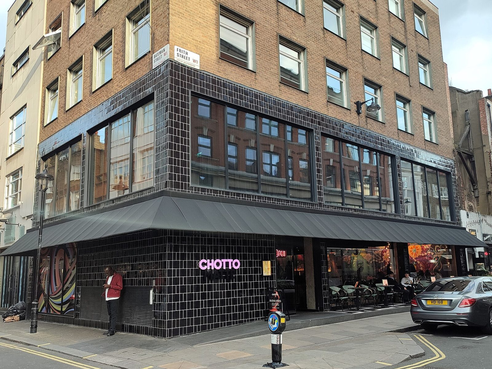
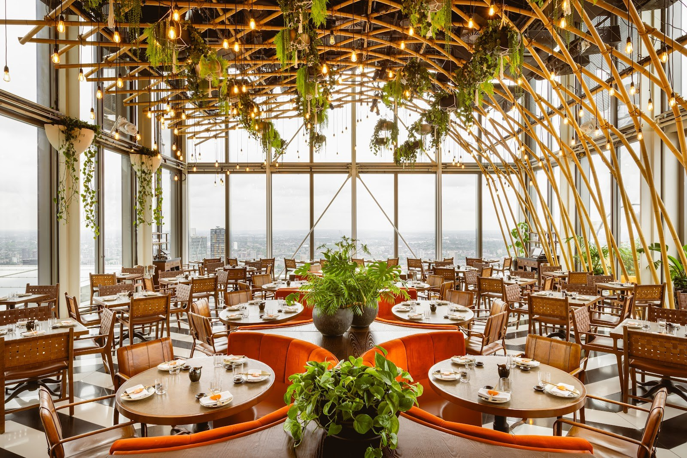
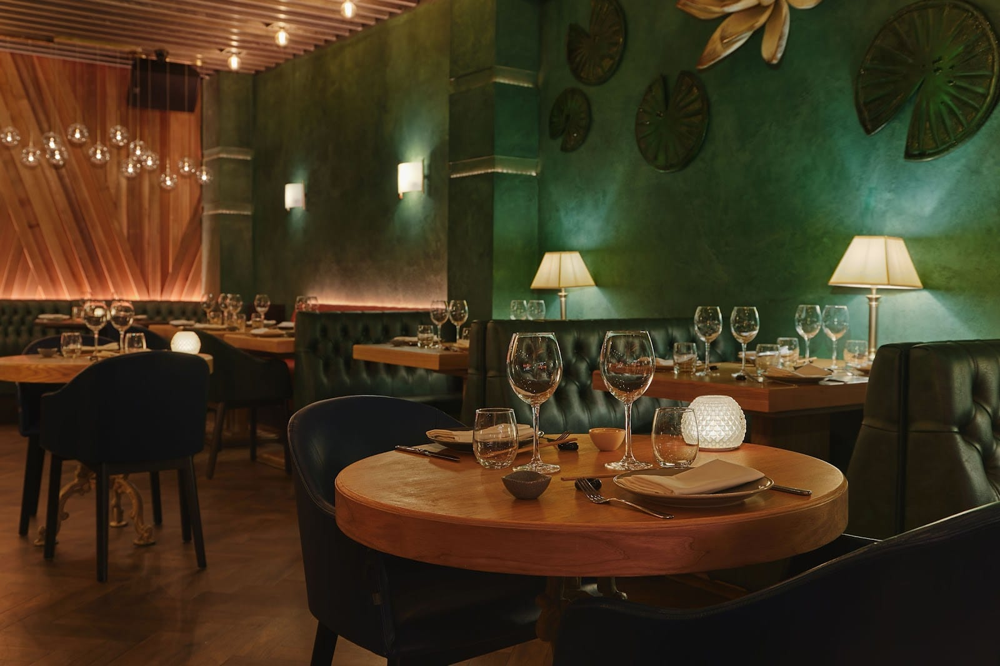
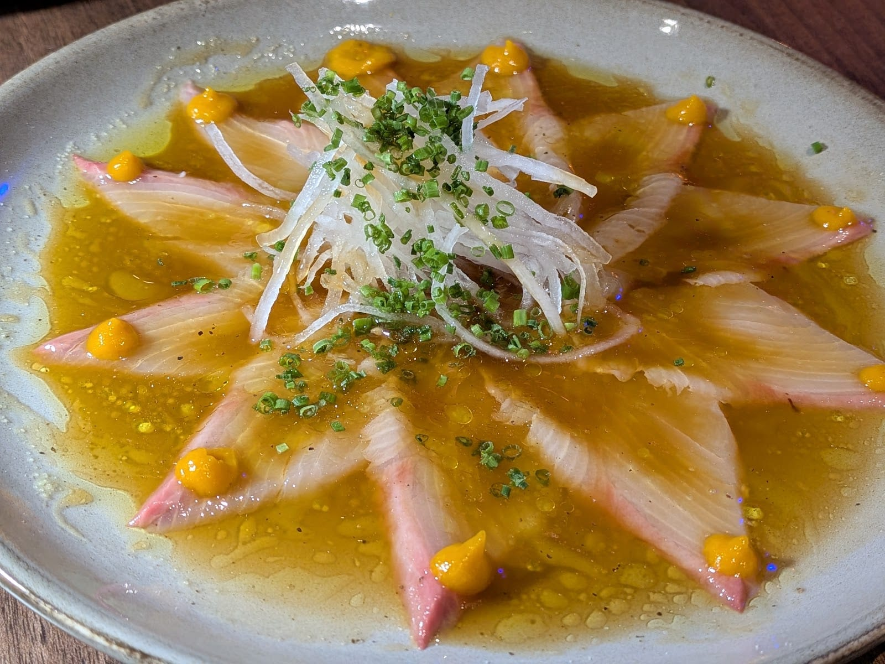
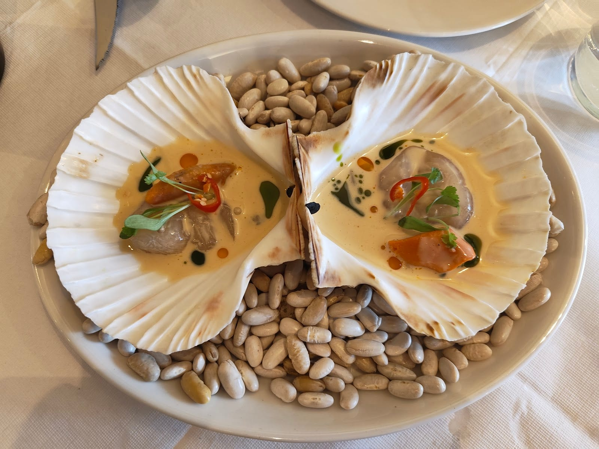
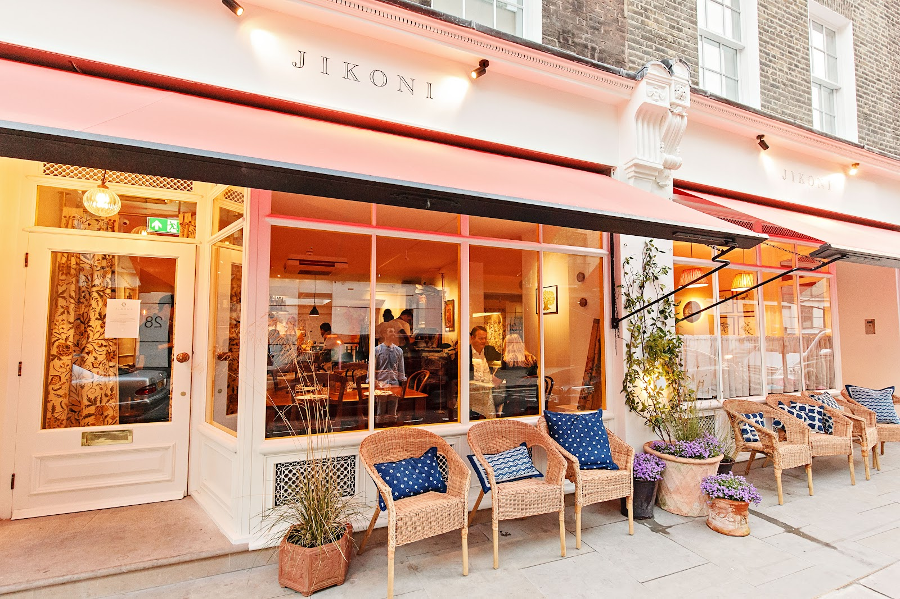
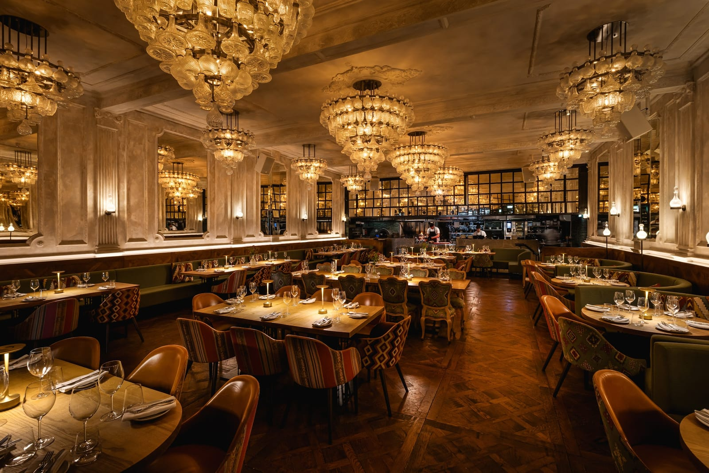

**This guide is the narrow version of fusion**: restaurants that put two named cuisines into the same dish and say so on their own menus. A pan-Asian menu with sushi on one page and pad thai on the next is not on it.

Some of those pairings are a century old. **Nikkei** came out of Japanese migration to Peru and **Indo-Chinese** out of the Hakka Chinese community in Kolkata; both are cuisines in their own right, with their own classics. Others are chef-made: **Japanese-Italian** in Dalston, **Korean-European** in Bermondsey and Stoke Newington, **Mexican-Japanese** above Broadgate. And some are a cook's two family kitchens on one plate. The guide is sorted by the pairing, because a Kolkata chilli-chicken canteen and a Japanese-Italian tasting counter are not the same evening.

> 💡 **The Short Version:** **Fatt Pundit** in Soho and Covent Garden is the most-named fusion restaurant in London, for Kolkata's Indo-Chinese cooking. **Angelina** in Dalston runs a £74 Japanese-Italian set menu, and **Osteria Angelina** in Spitalfields is the cheaper, à la carte way in. For a judged verdict, **Sollip** in Bermondsey holds a Michelin star for Korean-European cooking, and **Cálong** in Stoke Newington a Bib Gourmand for the same pairing at a quarter of the price. **Chotto Matte** in Soho is the late-night Nikkei room, **Los Mochis** the Mexican-Japanese rooftop, and **Tangra** the all-vegetarian Indo-Chinese room in Soho, open until midnight Thursday to Saturday.

> 📊 **The evidence behind this guide.**
> Nothing here rests on one visit. This pass reads **28 independent sources carrying 114 citations** across **48 named restaurants**. **28 restaurants are named by two or more independent sources; Sollip holds a Michelin star and Cálong a Bib Gourmand in the 2026 guide.**
> **Built on:** the Michelin Guide, the Good Food Guide and Harden's, which files exactly one London restaurant under Fusion; fusion lists from The Handbook, Luxury London, Country & Town House, London On The Inside and Dish Cult; reviews in Time Out, The Infatuation and The Guardian; thirteen YouTube creators, counted per creator; and four Reddit threads where Londoners argue about where to eat Indo-Chinese.
> *Evidence built 7 October 2026 · [How we rank →](/how-we-rank/)*

## Booking at a glance

* **Weeks ahead:** Sollip (released two months out, on the 1st of the month), Angelina at weekends, Bar des Prés (up to 60 days ahead), SUSHISAMBA at weekends (up to two months ahead).
* **A few days:** Osteria Angelina, Chotto Matte, Fatt Pundit, Los Mochis, Ayllu, Fan.
* **Book, but walk-ins get a chance:** Cálong keeps some of its 30 covers back for walk-ins; Belly takes walk-ins when there is room.
* **No online booking:** Vegan Yes, by phone or at the door.
* **Check the day before the hour.** Sollip shuts Sunday to Tuesday, Cálong, Belly and Mexican Seoul Monday and Tuesday, Bintang on Monday, Fatt Pundit's Soho site on Sunday and its Covent Garden site on Monday.

## Where they are

| If you are near… | Where to eat |
| --- | --- |
| **Soho** | Fatt Pundit, Tangra, Chotto Matte, Sucre |
| **Covent Garden** | Fatt Pundit, SUSHISAMBA |
| **Mayfair** | Bar des Prés |
| **Marylebone** | Jikoni |
| **The City & Spitalfields** | Los Mochis, SUSHISAMBA, Osteria Angelina |
| **Brick Lane** | Vegan Yes |
| **Dalston** | Angelina |
| **Stoke Newington** | Cálong |
| **Bow** | Mexican Seoul |
| **Kentish Town & Camden** | Belly, Bintang |
| **Bermondsey & London Bridge** | Sollip |
| **Notting Hill & Paddington** | Los Mochis, Fan, Ayllu |
| **Stratford & Canary Wharf** | Bamboo Mat |
| **Brixton** | Jurkish |
| **Wimbledon Park** | Dalchini |
| **Northwood, Wembley & Queensbury** | Bombay Chow, The Regency Club |

**Price guide:** **£** under £20 a head · **££** £20–£40 · **£££** £40–£80 · **££££** £80+, food only.

---

## The most backed

No source here ranks fusion restaurants in order, so this section leads with what the evidence does show: the two kitchens the most sources name, and the two that hold a judged award. They are not competing for the same evening. Fatt Pundit is a loud Soho dinner of small plates; Sollip is a silent tasting menu that books out two months ahead.

### Fatt Pundit, Soho and Covent Garden — Kolkata's Indo-Chinese

*££ · 77 Berwick Street, W1F 8TH, and 6 Maiden Lane, WC2E 7NA · Cited by 8 sources · [book Soho](https://www.fattpundit.co.uk/soho/reserve-a-table/) · [book Covent Garden](https://www.sevenrooms.com/reservations/fattpunditcoventgarden)*

**Named by eight of the twenty-eight sources, more than any other restaurant on this page**, from Luxury London and The Handbook to two YouTube creators and two Reddit threads. Its own menu explains the cooking: the Hakka people moved from Canton to Kolkata, and their food became Indo-Chinese, "traditional Chinese cooking techniques with the spices of India".

Start with the **kid goat momos** (£8.50) and the **crackling spinach** (£11), then **Kolkata chilli duck** and the **shredded chilli venison**, a dish the menu credits to Mumbai's Leopold Café. The **lamb chops in black bean dust** (£26) are the most expensive thing on the card.

Not everyone is a convert. The Infatuation rated the Covent Garden branch 7 out of 10, and on Reddit one Londoner calls it "my favourite meal in London" while another finds it "way too tapas-style" for Indo-Chinese. **The two branches shut on different days: Soho on Sunday, Covent Garden on Monday.** A two-course pre-theatre menu is £33.50.

### Angelina, Dalston — Japanese-Italian, as a set menu

*£££ · 56 Dalston Lane, E8 3AH · Cited by 7 sources · [book a table](https://www.sevenrooms.com/explore/angelina/reservations/create/search/)*

A family-owned room whose own site says: "We take inspiration from Italy and Japan, challenge the notion of authenticity, and believe fusion is everywhere." Three of the five fusion lists in this pass name it. Michelin files it under "Italian and Japanese", one of only two London restaurants with that label, and Time Out gave it four stars.

There is one menu, a **kondate**, the Japanese idea of composing a meal as a sequence, at **£74**. The October menu runs **bluefin tuna with plum and fig leaf**, **shokupan** milk bread with robiola, umeboshi and pistachio, **wild boar cappellacci with kabocha and furikake**, and **squab kabayaki** glazed like eel, ending on a **genmaicha purin**, a brown-rice-tea custard. Michelin's tip is the marble counter facing the open kitchen.

**Allow about two hours, and add 15% service.** Dinner only on weekdays, lunch at the weekend. The kitchen cannot work around soya, allium or chilli allergies.

### Sollip, Bermondsey — Korean-European, with a Michelin star

*££££ · Unit 1, 8 Melior Street, SE1 3QP · One Michelin star, 2026 guide · Cited by 5 sources · [book a table](https://booking.resdiary.com/widget/Standard/Sollip/19413)*

**The only Michelin-starred restaurant on this page.** A Korean husband-and-wife team cooking what their own site describes as European and French styles "coloured" by London and by the Korean techniques and ingredients they grew up with. The Good Food Guide rates it Very Good and Time Out gave it five stars.

Michelin describes a calm room in pastel shades; Time Out, a faceless new-build in the shadow of the Shard. The dish Michelin, the Good Food Guide and Dish Cult all single out is the **moo tarte tatin**, the French upside-down tart made with daikon radish and finished with kimchi; around it the autumn menu runs **myeon** noodles in perilla seed oil with scorched rice and chestnut, and **Iberico pork with curry and sundae**, the Korean blood sausage.

**Dinner is £152, lunch £78, and it opens only Wednesday to Saturday** (lunch on Friday and Saturday). **Tables are released two months ahead on the 1st of each month.** It cannot cater for gluten-free or dairy-free diets.

### Cálong, Stoke Newington — the same pairing at a quarter of the price

*££ · 35 Stoke Newington Church Street, N16 0NX · Bib Gourmand, 2026 guide · Cited by 5 sources · [book a table](https://www.sevenrooms.com/explore/calong/reservations/create/search/)*

Joo Young Won ran the kitchen at Galvin at Windows before opening this 30-cover neighbourhood room, and his site describes the cooking as "Korean & European inspired dishes using the best of British seasonal ingredients". **The Good Food Guide is the only source in this pass that files a restaurant under "Korean Fusion"**, and it is this one; Michelin gives it a Bib Gourmand, its mark for good cooking at a moderate price. Grace Dent's verdict in The Guardian: "not a Korean restaurant, but neither is it not a Korean restaurant".

Order **JFC**, Joo's fried chicken, which Michelin notes has been on the menu since the first day, then **tofu mandu** dumplings, **kimchi risotto** and **pork jeyuk**, the chilli-marinated stir-fry. The menu is chalked on a blackboard.

**Dinner Wednesday to Saturday, lunch Friday to Sunday, closed Monday and Tuesday.** It always holds some tables back for walk-ins.

### Bar des Prés, Mayfair — French-Japanese, Cyril Lignac's London room

*££££ · 41A South Audley Street, W1K 2PS · Cited by 5 sources · [book a table](https://www.bardespres.com/london-book-a-table/)*

The French chef Cyril Lignac's first restaurant outside France, which his own site sums up as "French savoir-faire" with "a touch of Japanese individuality". Five sources name it, but not warmly in every case: The Infatuation rates it 7.9 and calls it pricey, and Grace Dent's 2021 review was built around an £8 vanilla-flavoured mash.

The menu splits into sushi from £8 a piece, a robata grill and French plates. The signatures are **black cod caramelised with miso** (£45), **Scottish langoustine ravioli in bisque** (£32), **crispy rice with Oscietra caviar** (£38 for three) and an **A4 Kagoshima wagyu sando** at £89. Counter seats face the chefs; the back room is quieter.

**No drinks-only tables, and no children under ten after 7pm.** Bookings open 60 days ahead, and service is 15%.

---

## Japanese-Peruvian: Nikkei

Nikkei is the oldest pairing in this guide and the least invented. Japanese families settled in Peru from the late nineteenth century, and their cooking put Japanese knife work and technique to Peruvian ingredients: sashimi in lime and chilli, and **tiradito**, fish sliced like sashimi and sauced like ceviche. Bamboo Mat's own site puts it more strongly: "Nikkei is not fusion. It is dialogue." The [Peruvian restaurants guide](/articles/best-peruvian-restaurants-london/) covers the Peruvian side of these menus and the criollo kitchens beside them. **Coya**, which three sources here call fusion, describes itself as Peruvian and is in that guide.

### Chotto Matte, Soho — Nikkei until 1.30am

*£££ · 11–13 Frith Street, W1D 4RB · Cited by 4 sources · [book a table](https://www.sevenrooms.com/reservations/chottomattelondon)*

Kurt Zdesar founded the group in 2013, and its own description is "Japanese precision with Peruvian flair". A lounge on the ground floor and a dining room above it on the corner of Frith and Bateman Streets, with an itamae sushi counter, a robata grill and DJs.

*Chotto Matte, Frith Street. Photo: [Ewan-M](https://commons.wikimedia.org/wiki/File:Chotto_Matte,_Soho,_W1.jpg), [CC BY-SA 4.0](https://creativecommons.org/licenses/by-sa/4.0/).*

Order the **Chotto ceviche** (£19), the **sato maki** of sea bass and salmon tartare, flamed at the table, and **black cod aji miso** (£40), the miso glaze sharpened with Peruvian chilli. The Nikkei sharing menu is £68 a head.

**Open until 1.30am Monday to Saturday and midnight on Sunday.** The weekday express lunch is £29.95, noon to 5pm.

### SUSHISAMBA, the City and Covent Garden — Japanese, Brazilian and Peruvian

*££££ · Heron Tower, 110 Bishopsgate, EC2N 4AY, and 35 The Market Building, WC2E 8RF · Cited by 3 sources · [book Heron Tower](https://www.sevenrooms.com/reservations/sushisambalondon) · [book Covent Garden](https://www.sevenrooms.com/reservations/sushisambacoventgarden)*

Three cuisines rather than two, and the operator names all of them: "the culture and cuisine of Japan, Brazil and Peru". The City site is on the 38th and 39th floors of Heron Tower, with a terrace the operator calls the highest outdoor dining terrace in Europe.

*SUSHISAMBA, Heron Tower.*

Order across the three passports: **tuna seviche** (£22), **black cod anticucho** off the robata (£34) and the **moqueca mista**, a Brazilian seafood stew (£46). The Infatuation rated it 3 out of 10 and called almost everything but the view appalling, so book it for the view.

**Card only, smart casual, and bookings open two months ahead.** The Covent Garden site, on top of the Market Building, does a two-course lunch for £29.50.

### Ayllu, Paddington — Nikkei for £29 at lunch

*£££ · 25 Sheldon Square, W2 6EY · Cited by 1 source · [book a table](https://www.ayllu.co.uk/book)*

A "Japanese-Peruvian restaurant" on the lower level beneath Smith's Bar & Grill in Paddington Central, which its own site sums up as "Japanese technique, Peruvian fire". Dark green walls, buttoned banquettes and low lamps.

*Ayllu's dining room, Paddington.*

Start with the raw dishes: **lubina clásica ceviche** (£12), **bluefin tuna tataki** (£16) and the **black cod** in orange dashi butter (£31). Tasting menus are £54 and £69 for the whole table.

**The five-course weekday lunch is £29, noon to 3pm.** No sushi between 4pm and 5pm, and live Spanish guitar on Friday and Saturday nights.

### Fan, Notting Hill — Japanese, Peruvian and Cantonese

*££££ · 6 Chepstow Road, W2 5BH · Cited by 2 sources · [the restaurant's site](https://www.fan-restaurant.com/)*

Chef Coco Sasaki calls it "neo-Nikkei", and the site spells the pairing out as "Japanese-Peruvian-Cantonese": ingredients from Peru and China brought together through Japanese technique. It is in the 2026 Michelin Guide.

The dish to order is the **pachikay nigiri**, dressed with the Cantonese-Peruvian chilli oil, alongside **maki acevichado** and the **torched scallop nigiri with spicy crab**. The tasting menu is **£120**.

**The £39 day menu** — a cold starter, two nigiri, two maki and a main — **does not run on Friday or Saturday evenings.** The tasting menu is not offered to vegetarians or vegans.

### Bamboo Mat, Stratford and Canary Wharf — Nikkei, open every day

*£££ · 21–24 Victory Parade, East Village, E20 1FS, and 1 North Lane, Canary Wharf · Cited by 2 sources · [book a table](https://www.bamboo-mat.co.uk/reservation)*

Two sites, both open seven days, and a menu built only on Nikkei: "Cut in Japan. Cured in Peru." Stratford has an open sushi counter and a summer terrace; Canary Wharf is two floors on the Wood Wharf waterfront.

*Bamboo Mat's hamachi tiradito.*

Order the **hamachi tiradito** (£15.50), the **seabass ceviche** (£13) and the **chicken anticucho** (£19 in Stratford), skewered and grilled. The Nikkei Voyage tasting menu is £67 in Stratford and £71 at Canary Wharf.

**Weekday lunch in Stratford starts at £14.50.** Grace Dent reviewed the original Leyton room in 2022 and wrote that it was impossible not to want it to succeed.

---

## Indo-Chinese: Kolkata's Hakka cooking

Kolkata's Chinese community settled in the Tangra district, and the food they cooked for the city around them became a cuisine of its own: chilli chicken, Manchurian, Hakka noodles, chilli paneer. Central London's lists stop at Soho. The Londoners on Reddit arguing about where to eat it send you to Wimbledon Park, Northwood and Wembley. **[Fatt Pundit](#fatt-pundit-soho-and-covent-garden--kolkatas-indo-chinese)**, the most-cited restaurant here, is described above.

### Tangra, Soho — all-vegetarian, until midnight

*££ · 17 Frith Street, W1D 4RG · Cited by 4 sources · [book a table](https://www.sevenrooms.com/explore/tangra/reservations/create/search)*

"Modern Indian energy. Indo-Chinese spirit. Fully vegetarian", in its own words, "bringing the energy of Kolkata to Soho". Everything not marked vegetarian is vegan, and no egg is used.

Order **Tangra Hakka noodles** (£10.50), **gobi 65**, the fried cauliflower (£12.50), the **Manchurian kofta** and the **black truffle xiao bao**. The Tangra Edit sharing menu is £32 a head. Food with Chetna and Just Veganin both filmed visits in 2026, and Just Veganin calls it the best vegetarian Indo-Chinese in London; on Reddit, opinion splits hard, from "I really enjoyed my visit" to "avoid".

**Open every day, until midnight Thursday to Saturday.** Parties of nine or more book by email.

### Dalchini, Wimbledon Park — Indo-Chinese since 2000

*££ · 147 Arthur Road, SW19 8AB · Cited by 1 source · [request a table](https://www.dalchini.co.uk/reservations)*

It calls itself "the first authentic Indo-Chinese restaurant in the UK, established in London, 2000", and two separate Reddit threads in 2026 name it as the place to go, one adding that it is still excellent. A neighbourhood restaurant by Wimbledon Park station.

The menu is the Hakka canon: **Hakka chilli chicken** (£14.35), **chicken Manchurian**, **dry gobi Manchurian** (£10.95), **Mahim fish koliwada** in the Mumbai style, and **Hakka steamed fish** (£15.25).

**Open every day from noon.** Parties of four or more give card details, and a £25 a head charge applies to late cancellations.

### Bombay Chow, Northwood and Wembley — Fatt Pundit's suburban sister

*££ · Haste Hill Golf Club, The Drive, Northwood, HA6 1HN, and 299 Harrow Road, Wembley, HA9 6BD · Cited by 1 source · [booking page](https://bombaychow.co.uk/en/reservation)*

"Bringing Indo Chinese (Hakka) cuisine to the streets of London", and its site lists Fatt Pundit among "our other establishments". Northwood is inside a golf club with outdoor seating and parking; Wembley is a few minutes from the stadium.

Order the **Kolkata chilly paneer** (£9.95), **Tai Pai chicken** (£10.65) and **chicken lollipops**, alongside Mumbai chaat and tandoor dishes. All meat is halal.

**Northwood opens for breakfast at 8.30am and closes on Mondays.** Wembley opens every day.

---

## Japanese-Italian

Itameshi is the Japanese word for Italian food made the Japanese way, and in London it is one family's business. **[Angelina](#angelina-dalston--japanese-italian-as-a-set-menu)** in Dalston, the set-menu original, is described above.

### Osteria Angelina, Spitalfields — itameshi pasta and grill

*£££ · 1 Nicholls Clarke Yard, E1 6SH · Cited by 5 sources · [book a table](https://www.sevenrooms.com/explore/osteriaangelina/reservations/create/search/)*

Angelina's sister, and the one to choose if you want to order for yourself: "Itameshi, Italian food with Japanese ingredients and influences", à la carte, in a post-industrial room behind Liverpool Street with an open kitchen and a glass-walled pasta lab. Time Out gave it five stars and The Infatuation says it makes some of London's best pasta.

Order the **tagliolini with sweet corn, tuna and uni** (£19), the **pappardelle with veal and rabbit ragù and a soy-cured egg yolk** (£21), **tortellini with truffle and kombu** (£14) and something off the binchotan grill: **lamb chops with enoki**. Miso leek focaccia is £4.

**No lunch on Monday.** Pasta runs £10 to £24, and service is 15%.

---

## Korean with a second cuisine

Korean flavour carried into someone else's dish is the busiest pairing in London. **[Sollip](#sollip-bermondsey--korean-european-with-a-michelin-star)** and **[Cálong](#cálong-stoke-newington--the-same-pairing-at-a-quarter-of-the-price)**, the two Korean-European kitchens with Michelin recognition, are described above; the [Korean restaurants guide](/articles/best-korean-restaurants-london/) covers the grills and New Malden.

### Mexican Seoul, Bow — Korean-Mexican tacos

*££ · Bow Wharf, 221 Grove Road, E3 5SN · Cited by 2 sources · [book a table](https://www.sevenrooms.com/explore/mexicanseoul/reservations/create/search/)*

"Award winning Mexican-Korean street food", from a brand that started during lockdown on a Brick Lane market and now has its own room at Bow Wharf. The Infatuation rated it 7.8 and compared its energy to a litter of Andrex puppies.

Order the **elote ribs**, strips of corn on the cob with miso mayo, pecorino and Korean chilli flakes; the **tuna tostada** with oi-muchim, the Korean cucumber salad; and a **spicy pork belly** or **bulgogi beef taco**. The **Gochu-Gang wings** have won at Wing Fest three times.

**Closed Monday and Tuesday; groups of more than four book by email.** Most dishes carry chilli, soy and sesame.

### Vegan Yes, Brick Lane — Italian-Korean, and all vegan

*££ · 64 Brick Lane, E1 6RF · Cited by 3 sources · [the restaurant's site](https://veganyes.co.uk/)*

Chef Mauro's Florentine cooking and Dr Min's Korean heritage, on one vegan menu since 2016. Three YouTube creators filmed visits there between 2018 and 2021.

The dish that sums it up is **toppognocchi**: Korean rice cakes and potato gnocchi in tomato passata with gochujang (£15.50). Also **kimchi pasta** (£18.50), **kimchi kimbap** (£14.50) and a pistachio gelato. The kimchi is sold by the jar.

**Open every day, no online booking** — phone 07749 799469, or walk in.

---

## Mexican-Japanese

### Los Mochis, Notting Hill and the City — tacos, maki and a rooftop

*£££ · 2–4 Farmer Street, W8 7SN, and 9th Floor, 100 Liverpool Street, EC2M 2AT · Cited by 4 sources · [book a table](https://www.losmochis.co.uk/reservations)*

**The only London restaurant Harden's files under "Fusion"**, and its own site calls it "the global pioneer of pairing Mexican & Japanese cuisines". Notting Hill opened in 2021 on two floors with a terrace; the City site is nine floors up above Broadgate Circle, with a 3,000 sq ft rooftop terrace facing St Paul's.

Order **spicy salmon on crispy rice** (£21), **maguro ceviche** (£26), the **black cod volcano maki** (£26) and a **dynamite prawn taco** (£20). The whole menu is free of gluten, nuts and celery.

**The City site stays open until 3am Thursday to Saturday.** Harden's readers warn it is "easy to rack up a large bill", and service is 13.5% in Notting Hill and 15% in the City.

---

## Filipino with a second cuisine

The [Filipino restaurants guide](/articles/best-filipino-restaurants-london/) covers the adobo and kamayan end; these two cook Filipino through something else.

### Belly, Kentish Town — a French bistro, through a Filipino lens

*£££ · 157 Kentish Town Road, NW1 8PD · Cited by 3 sources · [reservations](https://www.bellylondon.com/reservations)*

Omar Shah's restaurant describes itself as "reworking classic French bistro cooking through a distinctly Filipino lens", with a wood fire at the back. The Handbook files it under "Filipino & French"; Michelin added it to the 2026 guide.

*Belly's scallops 'Bicol Express'.*

Order the **chargrilled scallops "Bicol Express"**, after the coconut-and-chilli stew of southern Luzon; **trout kinilaw**, raw fish firmed in vinegar (£13); the **tempura cod pandesal** in a Filipino milk roll (£17); and the **seafood caldereta** (£33). Mains run £24 to £33.

**Closed Monday and Tuesday.** Walk-ins are taken when there is room, and service is 13.5%.

### Bintang, Kentish Town — Filipino-Asian since 1987

*££ · 93 Kentish Town Road, NW1 8NY · Cited by 2 sources · [reservations](https://www.bintangrestaurant.co.uk/reservations)*

On the same street since 1987, and by its own account London's oldest Filipino restaurant; its karaoke page calls it "Filipino-Asian fusion". Big tables at the back, a garden, and a private karaoke room downstairs.

Order the **oak-smoked chicken inasal** (£16), **spicy beef sisig** (£17.50), **oxtail kare-kare** in peanut sauce (£19) and the **ulek curry** with tofu and aubergine, chicken or prawns. Mains sit between £16 and £19.

**Card only, and closed on Monday.** Weekend brunch runs Saturday morning and all day Sunday.

---

## Two family kitchens on one menu

The pairings here are not a chef's idea but a family history: a cook's two heritages, on one plate.

### Jikoni, Marylebone — "no borders" cooking

*£££ · 19–21 Blandford Street, W1U 3DH · Cited by 4 sources · [book a table](https://www.sevenrooms.com/reservations/jikoni)*

Ravinder Bhogal was born in Kenya to Indian parents, and her restaurant draws on "immigrant cuisine and the rich, shared flavours and cultures across parts of South Asia & the Far East, the Middle East, East Africa and Britain". Time Out gave it five stars; the Good Food Guide files it under "Global"; Shortlist calls it one of London's best fusion restaurants.

*Jikoni on Blandford Street.*

The October menu shows the range in four dishes: a **prawn toast Scotch egg with banana ketchup** (£14), **kuku paka**, the Kenyan coconut chicken curry, with sukuma wiki greens and saffron rice (£26), **crispy aubergine with Sichuan caramel** (£24) and **Cornish lamb shoulder with ras el hanout** (£34).

**Closed Monday; the set lunch is £32 for two courses, Wednesday to Friday.** Service is 13.5%. Café Jikoni, its walk-in sister at V&A East in Stratford, opened in April 2026.

### The Regency Club, Queensbury — Indian and Kenyan since 1991

*££ · 18–21 Queensbury Station Parade, Edgware, HA8 5NR · Cited by 2 sources · [book a table](https://www.sevenrooms.com/reservations/regencyclub)*

Opened in 1991 as a members' club by Navin Sharma, and themed on the community clubs of Kenya: its own description is "the fusion of Indian spices and influences of Kenyan cooking techniques". Food Review Club's 2023 visit, "a Kenyan Indian MEGA fusion", has close to 70,000 views.

Order the **garlic mogo** (cassava), then **chilli garlic prawns**, **lamb cutlets** off the grill and a **mixed grill** for the table. There are more than 70 dishes, and a large bar to wait at. All the meat is halal.

**Two evening sittings, from 6pm and from 8pm, and children only in the afternoon, all day Sunday and on bank holidays.** Closed Monday lunchtime.

### Jurkish, Brixton — Jamaican and Turkish

*££ · Effra Social, 89 Effra Road, SW2 1DF · Cited by 1 source · [book a table](https://bookings.designmynight.com/book?venue_id=517f92910df690b96f0000a5)*

"Jamaican heat. Turkish fire. One plate." A kitchen inside the Effra Social pub in Brixton, picked by London On The Inside for its fusion list.

The dishes do what the name says: **curry goat manti**, the Turkish dumplings filled with Jamaican curry goat (£9.95), an **oxtail pide** (£11.95), **plantain hummus** (£8) and a **jerk chicken shish** plate. Pudding is **plantain lokma**, fried plantain doughnuts with pistachio milk sauce.

**Weekday lunch, noon to 4pm, is £10 a box**, or a wrap and a pint for the same money.

---

## Latin American and European

### Sucre, Soho — Argentine fire, Spanish and Italian on the side

*£££ · 47b Great Marlborough Street, W1F 7JP · Cited by 2 sources · [the restaurant's site](https://sucrerestaurant.com/)*

A modern Argentine restaurant led by chef Jack Godik, whose menu, in its own words, "blends Spanish and Italian influences with South American flair". The Handbook files it under "Latin American & European", and Michelin under Latin American. The room is a former concert hall under chandeliers made from wine and cocktail glasses, with the open fire at the far end.

*Sucre's chandeliers.*

Off the grill, the **Iberico pork matambre** (£42) and the **Argentine sirloin** (£44); from the Italian side, **gnocchi with parmesan and peas**; and a **cheddar and caramelised onion empanada** (£8.50) to start.

**The set lunch is £19.50 for two courses, Monday to Saturday noon to 4pm**, and the same prices run before and after the theatre. Open until 1am except on Sunday.

---

## Cheapest

* **Tangra**, Soho — the Tangra Edit sharing menu is **£32 a head**, and Hakka noodles £10.50. Cited by 4 sources.
* **Jurkish**, Brixton — weekday lunch boxes **£10**. Cited by 1 source.
* **Fatt Pundit**, Soho and Covent Garden — momos under £9, a two-course pre-theatre menu £33.50. Cited by 8 sources.
* **Bombay Chow**, Northwood and Wembley — Indo-Chinese starters £8 to £11. Cited by 1 source.
* **Sucre**, Soho — two courses for **£19.50** at lunch. Cited by 2 sources.
* **Ayllu**, Paddington — five courses for **£29** at weekday lunch. Cited by 1 source.
* **Lunch is the way into the expensive rooms**: £78 at Sollip against £152 at dinner, £29.95 at Chotto Matte, £29.50 at SUSHISAMBA Covent Garden.

## Late

* **Chotto Matte**, Soho — until 1.30am Monday to Saturday. Cited by 4 sources.
* **SUSHISAMBA**, Heron Tower — until 1.30am every night, last booking 11.30pm. Cited by 3 sources.
* **Los Mochis**, the City — until 3am Thursday to Saturday, with a late snack menu. Cited by 4 sources.
* **Sucre**, Soho — until 1am Monday to Saturday. Cited by 2 sources.
* **Tangra**, Soho — until midnight Thursday to Saturday. Cited by 4 sources.

## Gone, and named by the sources anyway

* **Ramo Ramen**, the Filipino-Japanese ramen shop on Brewer Street, closed after service on 27 September 2026. Its owners say it will be back.
* **Korean Dinner Party**, suggested for a fusion dinner on Reddit in June 2026, closed in July 2026 after five years.
* **Stork**, the Mayfair restaurant that two of the fusion lists name, has closed.

---

## Continue planning your London trip

- 🍽️ **[Eat in London: Restaurants, Food Markets & Quick Food Hub](/articles/eat-in-london-guide/)**
- 🇵🇪 **[The Best Peruvian Restaurants in London](/articles/best-peruvian-restaurants-london/)** — the Nikkei rooms, and the criollo kitchens beside them
- 🍛 **[The Best Indian Restaurants in London](/articles/best-indian-restaurants-london/)**
- 🍣 **[The Best Japanese Restaurants in London](/articles/best-japanese-restaurants-london/)**
- 🇰🇷 **[The Best Korean Restaurants in London](/articles/best-korean-restaurants-london/)**
- 🇵🇭 **[The Best Filipino Restaurants in London](/articles/best-filipino-restaurants-london/)**
- 🥟 **[The Best Chinese and East Asian Restaurants in London](/articles/best-chinese-east-asian-restaurants-london/)**
- 🎭 **[Soho Area Guide](/articles/soho-area-guide/)**
- 🎨 **[Hackney Area Guide](/articles/hackney-area-guide/)**
