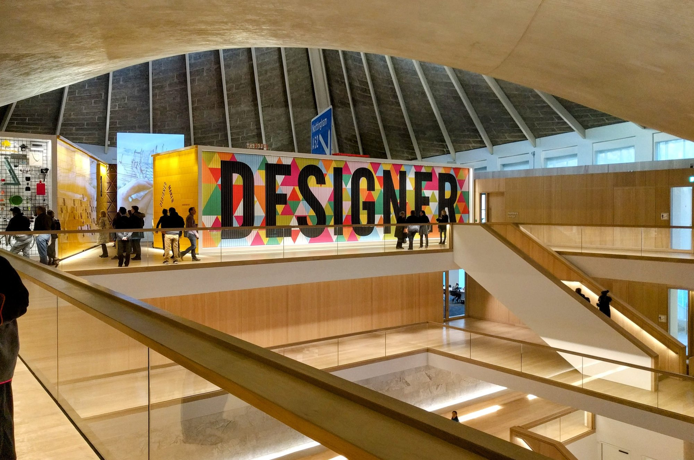

London's galleries divide into the national collections that cost nothing, the commercial spaces that also cost nothing and are far less busy, and a handful of house collections you can actually finish.

The most useful thing to know: **the free contemporary galleries are the quiet ones.** White Cube is 54,000 square feet and you can have a room to yourself on a weekday.

> 💡 **The Short Version:** **Tate Modern** is the one everybody does and the tenth-floor view is free. **The National Gallery** is unfinishable — pick two rooms. **White Cube Bermondsey** is the best free contemporary space. **Dulwich** was the world's first public gallery. And the **Wallace Collection** is the one you can complete in an afternoon.

> 📘 **How we choose these (editorial note)**
> No paid placements. These are drawn from a wide spread of sources rather than any single list - the food and travel press, the big listings sites, independent blogs and specialists, video, and what Londoners recommend themselves - and cross-referenced against each other. Admission prices are the galleries' own, checked August 2026. Commercial galleries are free and often overlooked — we have included the ones that mount museum-scale shows.

## Where they are

| If you are near… | Where to go |
| --- | --- |
| **Bankside & South Bank** | Tate Modern, Hayward Gallery |
| **Trafalgar Square** | National Gallery, National Portrait Gallery |
| **Westminster** | Tate Britain |
| **Mayfair & Marylebone** | Royal Academy, Wallace Collection |
| **Strand** | The Courtauld |
| **Kensington & Hyde Park** | Serpentine Galleries, Design Museum, Leighton House |
| **Bermondsey** | White Cube |
| **Chelsea** | Saatchi Gallery |
| **The City & Holborn** | Guildhall Art Gallery, London Silver Vaults |
| **South London** | Dulwich Picture Gallery |

---

## The national collections

### Tate Modern, Bankside

*Free · Sun–Thu 10am–6pm, Fri–Sat 10am–9pm*

The national collection of international modern art inside Giles Gilbert Scott's power station, with the Turbine Hall running its full length — five storeys of empty space that is itself the most impressive thing here, and free to stand in.

**The collection is free and needs no booking.** Only the big temporary exhibitions are ticketed, and members go into those free without booking.

**Level 10 in the Blavatnik Building is free too**, and it is a cafe bar with one of the best views in London — the river, St Paul's, the City. It keeps the gallery's hours, so on **Fridays and Saturdays it runs to 9pm**, which makes it the only free high viewpoint on the south bank that catches a summer sunset.

**Bankside SE1 9TG.** Southwark and Blackfriars are five minutes; the Millennium Bridge puts you at St Paul's in three.

### National Gallery, Trafalgar Square

*Free · open late Fridays*

Two thousand paintings from the 1200s to 1900 — Van Gogh's *Sunflowers*, Turner's *Fighting Temeraire*, the Wilton Diptych, Velázquez's *Rokeby Venus*. It is unfinishable in a day and pretending otherwise ruins the visit: **pick two rooms and actually look at them.**

**Free, no ticket, no booking**, and you can walk in to see one painting and leave, which is a perfectly respectable use of the building.

**Friday late opening is much the quietest time** to see the famous ones — the coach parties have gone and the rooms empty out considerably after six.

**Trafalgar Square WC2N 5DN**, two minutes from Charing Cross. The Sainsbury Wing holds the early Italian work and is the calmer half; the main building holds the crowd-pullers.

### National Portrait Gallery, Trafalgar Square

*Free · Sun–Thu 10.30am–6pm, Fri–Sat to 9pm*

Reopened in 2023 after a three-year redevelopment that reversed the entrance, opened up the north facade and rehung the whole thing. Round the corner from the National and **consistently calmer**, which is the reason to come — the same crowds do not make it this far.

It is arranged by period rather than by artist, so it reads as a history of Britain told through faces: Tudors at the top, the twentieth century at the bottom, and you work downwards.

**Free to everyone, with a charge for some temporary exhibitions.** Booking a free admission ticket in advance is recommended to guarantee entry rather than required. Last entry is 5.30pm, or 8.30pm on Friday and Saturday.

**St Martin's Place WC2H 0HE**, and every entrance is step-free.

### Tate Britain, Westminster

*Free · daily 10am–6pm*

The national collection of British art — five hundred years of it, from Tudor portraits to the present, and **the largest holding of Turner anywhere**, kept in the purpose-built Clore Gallery. If Turner is the reason you came to London's galleries, this is the building, not the National.

**Free and open every day with no booking needed.** Only special exhibitions are ticketed.

**The Tate Boat runs from the pier outside to Tate Modern every 40 minutes**, which is the best way to travel between the two — it is a river bus rather than a tour, it takes about 18 minutes, and it accepts contactless.

**Millbank SW1P 4RG.** Pimlico is five minutes' walk and Westminster about fifteen along the river.

---

Powered by <a target="_blank" rel="sponsored" href="https://www.getyourguide.com/london-l57/">GetYourGuide</a>

## Free contemporary

### White Cube Bermondsey

*Free · Bermondsey Street SE1 3TQ*

**Fifty-four thousand square feet** behind a plain 1970s warehouse frontage that gives away nothing from the street — the biggest commercial gallery in Europe when it opened, showing international artists at a scale most museums cannot match.

**Free, and often nearly empty**, which is the whole argument for going. This is a selling gallery, so there is no ticket, no queue and no crowd, and you can have a room the size of a tennis court to yourself on a weekday afternoon.

Nobody will approach you or ask what you are doing there. The price list is on the desk if you want to know, and looking without buying is entirely normal.

White Cube also runs a smaller space at **Mason's Yard, SW1Y 6BU** in St James's. Bermondsey is the one worth travelling for; London Bridge and Borough are both about ten minutes' walk.

### Serpentine Galleries, Kensington

*Free · Mon 12–6pm, Tue–Fri 10am–6pm, Sat–Sun 10am–7pm*

Two contemporary galleries **a five-minute walk apart** across the Serpentine bridge — Serpentine South in a 1930s tea pavilion, Serpentine North in a former gunpowder store with a Zaha Hadid extension. Both free, both small enough to do properly in an hour together.

**The summer Pavilion is the real draw**: a temporary building commissioned from a different architect every year, always their first completed structure in the UK, put up beside Serpentine South from June to October and then dismantled. It is free to walk into and there is a cafe inside it.

**Weekend hours run to 7pm**, later than almost any other free gallery in London, and Monday opening is noon rather than ten.

In **Kensington Gardens, W2 2AR and W2 3XA.** Lancaster Gate and South Kensington are the nearest stations, both a walk across the park.

### Saatchi Gallery, Chelsea

*Daily 10am–6pm · Duke of York's HQ, SW3 4RY*

Seventy thousand square feet of white-walled gallery in the former Duke of York's military headquarters off the King's Road — fifteen rooms over three floors, and the building itself is a large part of the pleasure.

**The mix of free and ticketed shows changes constantly**, which is the thing to check before travelling: some exhibitions are free, others are individually ticketed with their own separate last-entry times, so two shows in the same building can close 50 minutes apart.

**Open every day, 10am to 6pm**, with last entry typically around 5pm depending on the exhibition. Re-entry on the same ticket is allowed, so you can go out for air.

Sloane Square is three minutes away, and the gallery sits in a courtyard set back from the King's Road that most people walk past.

---

### Whitechapel Gallery, Whitechapel

*Free · Tue–Sun 11am–6pm · closed Mondays · E1 7QX*

The most-cited gallery in London that visitors never reach, and the one with the strongest claim to having changed British art — it gave **Picasso's Guernica its only British showing in 1939**, and gave Jackson Pollock, Mark Rothko and Frida Kahlo their first UK exhibitions.

Still free, still contemporary, still doing the thing it has done since 1901: showing work before anyone else does.

**Free to walk in, and under-16s go free to the ticketed shows too.** Group rates are published rather than negotiated — £6.50 a head for university groups, £9.50 for independent ones, and school and community groups always free.

**Closed Mondays**, which is the trap, and Aldgate East station is directly outside — the gallery is built over the top of it. There are Common Rooms with chairs, sofas and books, reachable by lift, if you want somewhere to sit that is not a cafe.

### The Photographers' Gallery, Soho

*£14 · free Friday evenings · Ramillies Street W1F 7LW*

The first gallery in Britain devoted entirely to photography, founded in 1971, now in a converted warehouse on a Soho side street behind Oxford Street — five floors, a bookshop that is the best of its kind in London, and a print sales room where you can buy work.

> 💡 **It is free every Friday from 5pm.** That is the single most useful fact about this gallery and almost nobody knows it. Admission is otherwise **£14 including a £2 optional donation**, or £11 for seniors, students, jobseekers and disabled visitors.

**Late opening Thursday and Friday to 8pm**, otherwise 10.30am–6pm Monday to Saturday and 11am–6pm Sunday, with last admission 30 minutes before close.

**The bookshop and print sales room are free all day regardless**, so you can go in, look at photographs for sale and leave without paying anything. Oxford Circus is three minutes away.

### Barbican Art Gallery, City of London

*Ticketed · inside the Barbican Centre*

Big, ambitious, thematic shows in the middle of the Barbican — architecture, design and photography as often as painting, and generally the most interesting exhibition programme in the City.

**The Curve** downstairs is a free, curved gallery space running commissioned installations — a single ninety-metre bending room, one artist at a time, no ticket. It is worth the trip on its own, and there are usually other free displays around the building alongside it.

So the Barbican splits cleanly: **the main Art Gallery is ticketed, everything in the Curve and the foyers is free.** Knowing which is which saves you assuming the whole building costs money.

**Silk Street EC2Y 8DS.** Barbican and Moorgate are both five minutes, and finding the entrance is genuinely difficult — follow the yellow line painted on the pavement from Barbican station rather than trusting a map.

### South London Gallery, Peckham

*Free · Peckham Road*

A Victorian gallery on Peckham Road with a **converted fire station opposite** giving it a second building, running genuinely experimental contemporary work — and free, which matters in an area where most of the good art has moved into commercial spaces.

**Two buildings, one visit**, and they are directly across the road from each other, so check both rather than assuming the main hall is all of it.

The **garden behind the main building is one of the quietest places in south London** — a proper walled garden rather than a courtyard, free, and almost never busy. There is a cafe attached.

Peckham Rye is about ten minutes' walk, and the gallery sits between Peckham and Camberwell rather than in the middle of either, which is why so few visitors reach it.

---

Powered by <a target="_blank" rel="sponsored" href="https://www.getyourguide.com/london-l57/">GetYourGuide</a>

## Collections you can finish

### The Wallace Collection, Marylebone

*Free · Manchester Square W1U 3BN*

A single townhouse full of Old Masters, armour and French eighteenth-century furniture, left to the nation in 1897 **on condition that nothing ever leaves it** — no loans out, no touring, ever. Everything you see is always here, which is the opposite of how every other museum on this page works.

Frans Hals's *The Laughing Cavalier* is the famous one; the armoury in the basement is the surprise.

**Entry to the permanent collection is free**, no booking, and it is **doable properly in ninety minutes** — which almost nothing else here is. That makes it the best answer in London to "we have one free afternoon and do not want to feel defeated".

It closes only on 24, 25 and 26 December. There are Friday Lates, talks and concerts through the year. Bond Street is five minutes.

### The Courtauld, Strand

*£14 · daily 10am–6pm · Somerset House WC2R 0RN*

Impressionists and post-Impressionists in a compact gallery above Somerset House's courtyard — Manet's *A Bar at the Folies-Bergère* and Van Gogh's *Self-Portrait with Bandaged Ear*, in a collection small enough to see properly in a single visit. One of the great small collections anywhere.

**£14 for the permanent collection**, or £16 if you add the voluntary donation. A ticket including a temporary exhibition is £18, or £20 with donation. **Under-18s go free**, students and anyone on Universal or Pension Credit pay £8, and Art Fund members £9.

**Open every day, 10am to 6pm, last entry 5.15pm** — one of very few ticketed galleries here with no closed day.

It is inside **Somerset House**, so pair it with the courtyard: fountains in summer, an ice rink in winter, both free. Temple is two minutes away.

### Dulwich Picture Gallery, Dulwich

*Ticketed · Tue–Sun 10am–5pm · closed Mondays*

Opened in **1817 as the first purpose-built public art gallery anywhere in the world**, designed by Sir John Soane — and the top-lit rooms he invented for it became the template every gallery since has copied. The building is the exhibit as much as the pictures.

Rembrandt, Rubens, Poussin and Gainsborough, in a collection small enough to see in full. The founders are buried in a mausoleum inside the gallery, which is not a thing that happens elsewhere.

**Closed Mondays.** That is the fact worth checking, because it is a journey rather than a walk — about twelve minutes by train from Victoria to West Dulwich, then five minutes on foot.

**Gallery Road SE21 7AD.** The gardens are free, and Dulwich Park is next door.

### Guildhall Art Gallery, City of London

*Free · last admission 4.45pm · Guildhall Yard EC2V 5AE*

Victorian and Pre-Raphaelite paintings in the City of London's own gallery, including Millais and Rossetti, plus a large collection of London topographical painting — the city as it looked before the buildings around you existed.

**The real draw is underneath.** London's **Roman amphitheatre** was found in 1988 when they dug the foundations for this building, and the surviving walls are displayed in situ in the basement, outlined in light where the missing seating would have been. It is included, and it is free.

**Free entry with no charge for either**, though booking a general admission ticket ahead is recommended. **Last admission is 4.45pm**, which is earlier than people expect and the usual reason for a wasted trip.

Bank and St Paul's are both about five minutes, and the Guildhall Yard entrance is set back from the street.

---

## Unusual

### The London Silver Vaults, Holborn

*Free · Mon–Fri 9am–5.20pm, Sat 9am–12.50pm · closed Sunday*

A working **vault complex beneath Chancery Lane**, trading here since 1953, holding around thirty independent dealers behind steel doors — the largest collection of antique silver for sale anywhere in the world. You go down a staircase, through a vault door, and into a corridor of shops.

**Free to walk into, no appointment necessary**, and nobody minds browsers — the dealers are used to people who have come to look. It is genuinely strange in a way no curated museum manages, because everything in it is for sale and priced accordingly, from a few pounds for a spoon to five figures for a Georgian tureen.

**The hours are the catch**, and they are unusually restrictive: **9am to 5.20pm Monday to Friday, 9am to 12.50pm on Saturday, closed Sunday and bank holidays.** A Saturday afternoon visit is not possible.

**53–64 Chancery Lane WC2A 1QS**, with the entrance on Southampton Buildings rather than Chancery Lane itself. Chancery Lane station is two minutes.

### Leighton House, Kensington

*Ticketed · Holland Park Road, Kensington*

Frederic Leighton's studio-house, built for himself over thirty years from 1866 and unlike any other building in London. The **Arab Hall** is the reason to come: a domed, double-height room lined with sixteenth and seventeenth-century Damascus tiles Leighton collected on his travels, a gold mosaic frieze above them and a fountain in the floor.

It is a **house museum rather than a gallery**, so it is small and you go through it room by room — the great first-floor studio where he actually painted is the other set piece, with its north window and its apse.

**It reopened in 2022** after a major restoration that added a new wing, a cafe and a proper entrance, so anything written before then describes a different visit.

It is a walk rather than a Tube ride: **High Street Kensington is about fifteen minutes**, and Holland Park itself is next door if you want to make an afternoon of it.

### The Design Museum, Kensington

*Free; exhibitions ticketed*

**The permanent gallery is free**, and it is the reason to come — *Designer Maker User*, around a thousand objects tracing modern design from the Anglepoise lamp to road signage, on the top floor.

The building matters as much as the collection. It is the **old Commonwealth Institute of 1962**, kept for its hyperbolic paraboloid roof — a swooping concrete curve, Grade II* listed — with the interior gutted and rebuilt in oak around a full-height atrium.

*The atrium, with the free permanent gallery on the top floor. The concrete roof above is the 1962 Commonwealth Institute, kept when everything beneath it was replaced.*

**Free to walk into, with temporary exhibitions ticketed separately** — and those are usually the ones being advertised, so it is worth knowing you can see the permanent collection without paying anything. It sits on the Holland Park side of Kensington High Street, about eight minutes from the station.

### Colosseum: The Legendary Arena and Space Explorers, Camden

*From £20.50 · 40 minutes · Eclipso London, Camden · 8+*

Headset reconstructions you **walk through rather than watch** — the Colosseum as it stood, and a free-roaming VR piece built from footage shot aboard the actual International Space Station by the Emmy-winning *Space Explorers* series.

**Free-roaming is the distinction that matters.** You are not in a seat with a headset on; you move through a physical space that the VR maps onto, so walking forward in the room walks you forward on the station. That is a different and much rarer thing from a 360-degree film.

**The ISS experience runs about 40 minutes at £20.50**, and you should arrive 10 to 15 minutes early for check-in and fitting. **Minimum age 8**, with children accompanied.

> ⚠️ **It is not wheelchair accessible**, which the venue states plainly and which rules it out for some visitors — worth knowing before booking, since almost everything else on this page is step-free.

---

> 📅 **Hours, admission and postcodes checked against each gallery's own website on 2 September 2026.** Where a gallery does not publish a figure we leave it out rather than repeat one we could not stand behind.

Powered by <a target="_blank" rel="sponsored" href="https://www.getyourguide.com/london-l57/">GetYourGuide</a>

## Free, and how far that goes

London's position on this is unusual and worth stating plainly: **almost every major public gallery in the city is free to enter, permanently.**

**Free permanent collections:** the National Gallery, the National Portrait Gallery, Tate Modern, Tate Britain, the V&A, the Wallace Collection, the Serpentine Galleries, Whitechapel Gallery, the Guildhall Art Gallery, South London Gallery and the commercial galleries — White Cube, Saatchi and the Mayfair dealers — all cost nothing.

**What you pay for is the temporary exhibition.** The big shows at the Tates, the National Gallery and the Barbican are ticketed, often £20 or more, and are the only reason to book anything.

**Ways to spend less:**

* **The Photographers' Gallery is free before noon** on weekdays.
* **Barbican's The Curve** is a free commissioned installation space inside a ticketed building.
* **National Art Pass** pays for itself in about three exhibitions if you are going to several — half-price entry at most ticketed shows across the country.
* **Under-25s and students** get free or heavily reduced entry at the Tates, and several galleries run free late openings once a month.
* **Go on a weekday morning.** Free does not mean quiet, and the National Gallery at 10am is a different building from the National Gallery at 2pm on a Saturday.

> **Commercial galleries are free and nobody uses them.** White Cube, Gagosian, Hauser & Wirth and the Cork Street dealers all show museum-quality work at no charge and with no crowd. You are allowed to walk in.

---

## What to know

* **The Tate Boat** connects Tate Britain and Tate Modern every 40 minutes, stopping at the London Eye. Travelcard holders get a discount.
* **Commercial galleries are free and quiet.** White Cube, Saatchi and the Mayfair dealers all mount serious shows nobody queues for.
* **Friday late openings** are the quietest slots at the National Gallery and Tate Modern.
* **Special exhibitions are ticketed** even inside free galleries — typically £18–£25, and they book out at weekends.
* **The Serpentine Pavilion** is only up from roughly June to October.

---

## Continue planning your London trip

- 🏛️ **[The Best Museums in London](/articles/best-museums-london/)**
- 🎪 **[Free Things to Do in London](/free/)**
- 👀 **[The Best Views in London](/articles/best-views-london/)**
- 🏰 **[Historic Houses in London](/articles/historic-houses-london/)**
- 🏙️ **[South Bank Area Guide](/articles/south-bank-area-guide/)**
- 👑 **[Westminster Area Guide](/articles/westminster-area-guide/)**
