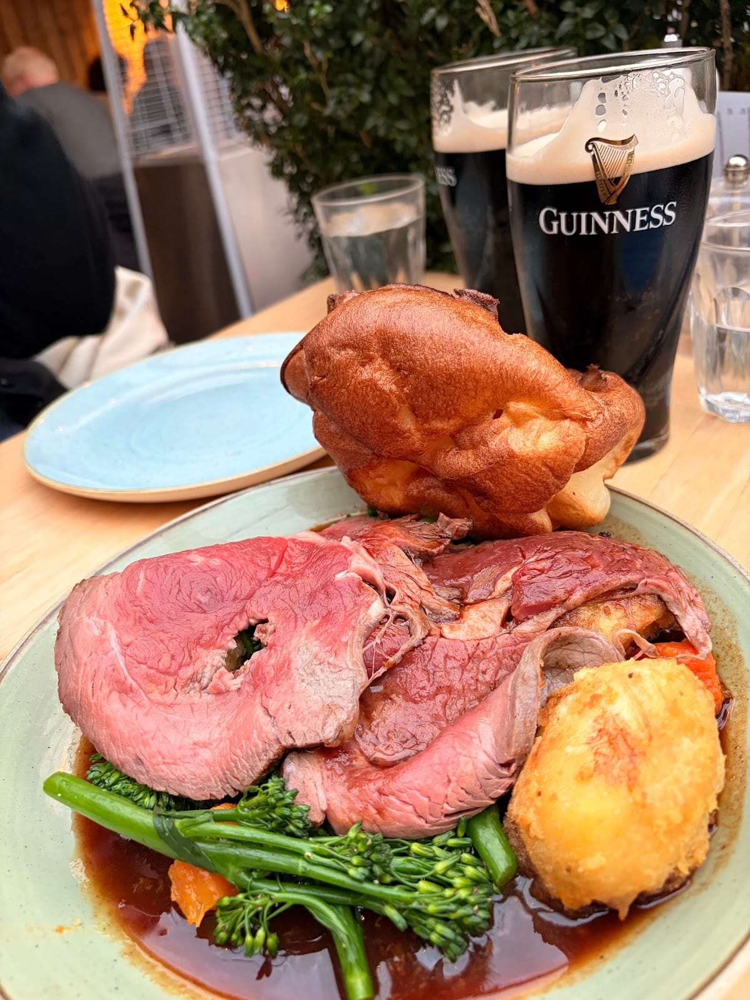
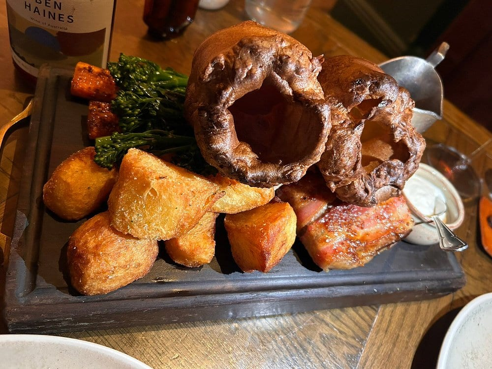
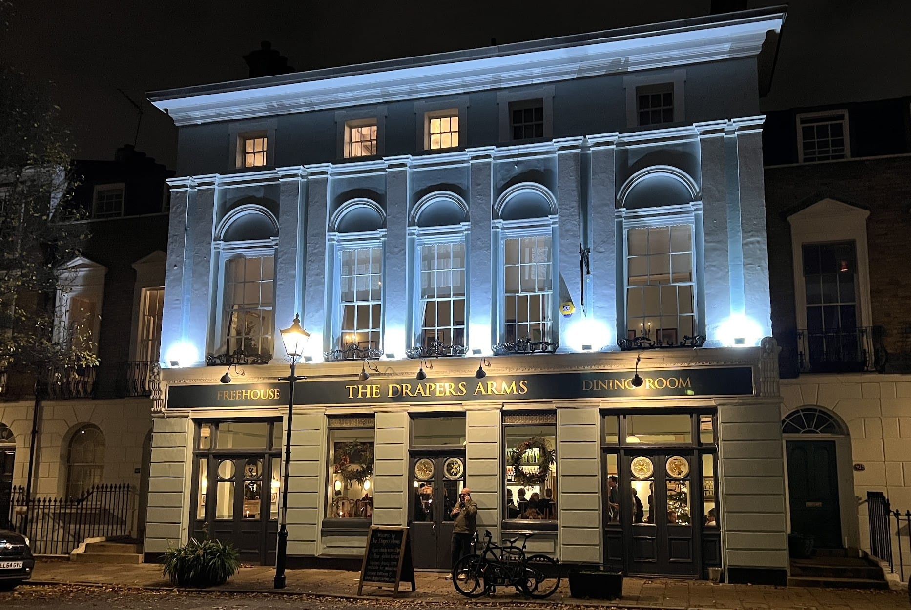
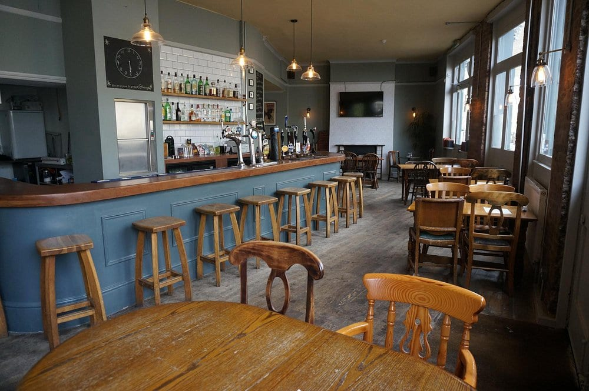

London's gastropubs have a ranking, which most food topics don't: **the Estrella Damm Top 50 Gastropubs**, judged and dated every year. Its 2026 list puts **The Devonshire** in Soho top of the whole country.

But the critics who eat in London every week don't simply follow it. **Time Out's number one is The Camberwell Arms**, which the award places 60th. **The Evening Standard's number one is The French House**, 47th in the award. So this guide reads all of them together and counts which kitchens keep coming up.

> 💡 **The Short Version:** **The Devonshire** is named by more sources than anywhere else and tops the award. **The Harwood Arms** is London's only Michelin-starred pub. **The Hero** in Maida Vale does a £25 weekday set lunch and holds a Bib Gourmand. **The Audley** takes no bookings at all. And seven of the pubs below are **closed on Mondays**.

> 📊 **The evidence behind this guide.**
> Nothing here rests on one visit. This pass reads **30 independent sources carrying 431 citations** across **126 named venues**. **65 are named by two or more sources; 27 are on a judged list.**
> **Built on:** the Estrella Damm Top 50, the National Restaurant Awards and Michelin's dining pubs, eleven mastheads including Time Out and the Evening Standard, five independent guides, and eleven YouTube and TikTok creators, counted per creator.
> *Evidence built 14 September 2026 · [How we rank →](/how-we-rank/)*

## Where they are

| If you are near… | Where to eat |
| --- | --- |
| **Soho & Mayfair** | The Devonshire, The French House, The Audley, The Shaston Arms, The Guinea Grill |
| **Fitzrovia & Farringdon** | The George, The Eagle |
| **Shoreditch & Hackney** | The Marksman, The Knave of Clubs, The Princess of Shoreditch |
| **Islington & Stoke Newington** | The Baring, The Drapers Arms, The Tamil Prince, The Compton Arms, The Clarence Tavern, The Plimsoll |
| **Highgate & Kentish Town** | The Red Lion & Sun, The Bull & Last, The Parakeet |
| **Notting Hill & Maida Vale** | The Hero, The Pelican, The Cow |
| **Chelsea & Fulham** | The Harwood Arms, The Cadogan Arms |
| **Waterloo & Stockwell** | Anchor & Hope, Canton Arms |
| **Camberwell** | The Camberwell Arms, The Kerfield Arms |
| **Barnes** | The Waterman's Arms |

**Price guide:** **££** most mains £18–£30 · **£££** set menus or mains over £30.

## Booking, in one table

| How far ahead | Pubs |
| --- | --- |
| **Weeks** | The Devonshire's restaurant, The Harwood Arms (opens 90 days ahead), The French House (60 days, card required), The Baring |
| **A few days to a week** | The Hero, The Parakeet (30 days), Anchor & Hope (30 days), The Clarence Tavern, The Red Lion & Sun |
| **Book, but tables are held back** | Canton Arms and The Waterman's Arms both keep tables for walk-ins |
| **Walk-in only** | The Audley, The Devonshire's pub and roof terrace, The Knave of Clubs in the evening, The Guinea's pub, The Eagle for tables under five |

The real cost at the walk-ins is the wait. At The Devonshire and The Audley, arrive at opening or mid-afternoon.

---

## The winners

These are the pubs that top a ranking. Where the lists disagree, the entry says so.

### The Devonshire, Soho — the UK's number one, and the hardest table on this page

*££ · Piccadilly Circus · Cited by 17 sources · #1, Estrella Damm Top 50 Gastropubs 2026 · #4 of 50, Evening Standard · [the pub's site](https://devonshiresoho.co.uk/)*

*The ground floor is a walk-in pub. The restaurant is upstairs. Photo: [Ewan-M](https://commons.wikimedia.org/wiki/File:Devonshire,_Soho,_W1.jpg), [CC BY-SA 4.0](https://creativecommons.org/licenses/by-sa/4.0/).*

Two businesses in one building. **Downstairs is a pub run by Oisin Rogers**, who made his name at The Guinea, and a large share of the crowd is there for the Guinness. **Upstairs is a wood-ember grill** under Ashley Palmer-Watts, who worked alongside Heston Blumenthal at The Fat Duck and Dinner by Heston: Scottish beef dry-aged and butchered on site, langoustines from Oban, day-boat fish. The Infatuation singles out the lamb hotpot, duck-fat chips and sticky toffee pudding.

It won **Gastropub of the Year at the National Restaurant Awards**, and it is on Michelin's list of London's best dining pubs. Five video creators have filmed it, more than any other pub here.

**How to get in:** the restaurant books online and goes weeks ahead. The pub downstairs takes no bookings at all, drinks or snacks, and **the roof terrace is walk-in only** — on a dry day that is the realistic way in. Sunday lunch, 12pm to 4pm, is a Sunday lunch menu only.

### The Camberwell Arms — Time Out's number one

*££ · Denmark Hill · Cited by 13 sources · #1 of 20, Time Out · #8 of 50, Evening Standard · #60, Estrella Damm extended list (51–100) · [the pub's site](https://www.thecamberwellarms.co.uk/)*

The clearest disagreement in the data. **Time Out ranks it first in London; the award puts it 60th, on the extended list rather than the Top 50.** Thirteen sources name it, which is more than name several pubs the award ranks higher.

Set up in 2014 by chef director Mike Davies, it cooks over a **charcoal fire** and makes its own charcuterie, bread and ice cream. Time Out picks out the pork loin chop with red cabbage, beer onions on toast with aged Gruyère, and crispy fried pig's head with piccalilli. Blackboards, scrubbed tables and an open kitchen, and The Infatuation says it still feels like a local where nobody judges a lunchtime pint.

A ten-minute walk from Denmark Hill station, on Camberwell Church Street.

### The French House, Soho — the Evening Standard's number one

*£££ · Leicester Square · Cited by 14 sources · #1 of 50, Evening Standard · #2 of 20, Time Out · #47, Estrella Damm Top 50 Gastropubs 2026 · [the pub's site](https://www.frenchhousesoho.com/)*

Downstairs is one of Soho's last old bohemian pubs, which **still serves beer only in halves**. Up the creaking stairs is a tiny red-walled dining room where chef **Neil Borthwick** cooks French bistro food: terrine, steak, goat's cheese on toast with confit garlic, and a Paris-Brest Hot Dinners tells you to save room for.

**The dining room is the hard part.** It seats so few that it runs two sittings a service, takes groups of six at most, needs a card to hold the booking and charges for late cancellation. Reservations open 60 days ahead. **It serves lunch and dinner Monday to Saturday only — no Sunday.** The bar takes no bookings at all.

### The Red Lion & Sun, Highgate — third in the country, and easier to book

*££ · Highgate · Cited by 7 sources · #3, Estrella Damm Top 50 Gastropubs 2026 · #6 of 20, Time Out · #22 of 50, Evening Standard · [the pub's site](https://www.theredlionandsun.com/)*

*The back garden, which you can only book by phone and only 48 hours ahead.*

**The highest-placed London pub after The Devonshire**, and the one the press has been slowest to catch up with: third in Britain, but named by seven sources against The Devonshire's seventeen.

A pub has stood on the site since the 16th century. Landlord Heath Ball runs it with a wine list Hot Dinners calls legendary, and **the menu changes every day** and goes up on the website by 11am. Time Out mentions crab on focaccia, chicken schnitzel with jalapeño salsa, Iberico pork ribs, and the frozen margaritas. It has gardens front and back.

**Food runs noon to 10pm every day**, which is rare on this page. Tables for up to eight. A walk from Hampstead Heath, Kenwood and Highgate Cemetery.

### The Harwood Arms, Fulham — London's only Michelin-starred pub

*£££ · Fulham Broadway · Cited by 14 sources · One Michelin star · #36, Estrella Damm Top 50 Gastropubs 2026 · #19 of 20, Time Out · [the pub's site](https://www.harwoodarms.com/)*

*Sunday is the one day the kitchen serves roasts from noon to 8pm.*

The one pub in London with a **Michelin star**. Brett Graham of The Ledbury has been a director since 2009, and head chef Josh Cutress came from there too. **Game is the menu**: the **venison Scotch egg** has been the thing to order at the bar for years, and Time Out's pick in the dining room was roast muntjac with celeriac and pickled pear. On a backstreet off Fulham Broadway, with antlers on the walls.

**Two courses are £64, three £79.** Reservations open 90 days ahead, and **lunch is only on Friday and Saturday**; dinner runs Monday to Saturday, and Sunday runs from noon to 8.15pm. You can bring one bottle of wine per person, at £40 corkage.

---

Powered by <a target="_blank" rel="sponsored" href="https://www.getyourguide.com/london-l57/">GetYourGuide</a>

## Also strongly backed

### The Hero, Maida Vale — four floors, a Bib Gourmand and a £25 set lunch

*££ · Warwick Avenue · Cited by 15 sources · Michelin Bib Gourmand · #24, Estrella Damm Top 50 Gastropubs 2026 · #16 of 20, Time Out · #17 of 50, Evening Standard · [the pub's site](https://theherow9.com/)*

**The second most-cited pub in this guide.** A proper pub with fires on the ground floor, a dining room on the first, a grill room and a cocktail bar above, from the group behind The Pelican, The Hart and The Fat Badger. The Handbook calls it possibly the most beautiful pub in London.

Michelin's Bib Gourmand is for good cooking at a fair price, and its inspectors mention chicken and leek pie and ham, egg and chips downstairs. There is always a pie on.

**The cheapest serious lunch on this page:** Monday to Friday, noon to 3pm, **two courses £25 or three for £29**.

### The Marksman, Hackney — St John alumni, and a brown butter tart

*££ · Hackney Road · Cited by 11 sources · #23, Estrella Damm Top 50 Gastropubs 2026 · #5 of 50, Evening Standard · #10 of 20, Time Out · [the pub's site](https://www.marksmanpublichouse.com/)*

*An unprettified local downstairs, the dining room above. Photo: [Matt Brown](https://commons.wikimedia.org/wiki/File:The_Marksman_pub_254_Hackney_Road_2025-05-08.jpg), [CC BY 2.0](https://creativecommons.org/licenses/by/2.0/).*

Chef-owners **Tom Harris and Jon Rotheram came from St John**, and it shows in the plain, strong British cooking Michelin puts on its dining-pubs list. The dining room upstairs is where people go for the **brown butter and honey tart** — Hot Dinners says order it early because it runs out. In the pub downstairs, get a beef and barley bun with your pint. The pub says it was the first in London to be named Michelin's Pub of the Year.

**Closed Monday, and not open until 4pm on Tuesday and Wednesday.** On Sundays the menu is £42 for two courses or £48 for three.

### The Parakeet, Kentish Town — cooked over fire

*££ · Kentish Town · Cited by 11 sources · #11 of 50, Evening Standard · #17 of 20, Time Out · #61, Estrella Damm extended list (51–100) · [the pub's site](https://www.theparakeetpub.com/)*

A pub at the front and a dining room at the back, from the people behind Camden's Blues Kitchen. Chef **Ben Allen, previously at Brat**, runs a kitchen built around **wood fire**. Hot Dinners rates the steaks and the whole-cooked fish, and the Sunday roast comes off the same fire.

Dining tables open **30 days ahead**, and you can book a table in the drinks area too, which most pubs here won't do. A minute from Kentish Town station.

### The Cadogan Arms, Chelsea — the award-winning restoration

*££ · King's Road, Chelsea · Cited by 11 sources · [the pub's site](https://thecadoganarms.london/)*

**Named by eleven sources without appearing on any judged list**, the most of any pub here. It comes from the same team as The George in Fitzrovia, and executive chef John Sparks runs a British menu; Hot Dinners picks out the black pudding Scotch egg and crispy lamb ribs.

The building is the other reason. A pub has stood here on the King's Road since the 1600s, and the recent restoration recreated the lost early Georgian panelling, **winning CAMRA's Refurbishment Award in 2023** — it is in our [guide to London's most beautiful pubs](/articles/most-beautiful-pubs-london/) as well. Two YouTube reviewers filmed it as London's most expensive pub, so expect Chelsea prices. Open to 1am on Friday and Saturday.

### The Plimsoll, Finsbury Park — the Dexter cheeseburger

*££ · Finsbury Park · Cited by 10 sources · #7 of 50, Evening Standard · #11 of 20, Time Out*

From the Four Legs team, who ran the kitchen at The Compton Arms before opening their own place on St Thomas's Road. It became so popular so fast that **Hot Dinners warns it is hard to get a reservation and rammed at weekends**.

The workaround is the bar: you can walk in for a drink and **the Dexter cheeseburger**, the dish Hot Dinners sends you for. Ten sources name it and none of them are an award, which says it is the critics' pub rather than the judges'.

### The Audley, Mayfair — no bookings, and a lobster pie

*££ · Bond Street · Cited by 9 sources · #15 of 50, Evening Standard*

**Walk-ins only, no reservations, seven days a week from 11am.** A ground-floor pub below the Mount St. Restaurant, filled with colourful art, as The Sunday Times Style put it, with a menu from the same kitchen: a London rarebit, a prawn Marie Rose sandwich, chicken, ham and leek pie, and executive chef Jamie Shears' **Mount St. lobster pie**.

Food runs noon to 10pm, and to 9pm on Sundays. It is Mayfair, and Harrison Webb included it in his film on London's most expensive pubs.

### The Waterman's Arms, Barnes — a river balcony and a spit-roast

*££ · Barnes Bridge · Cited by 9 sources · #2 of 50, Evening Standard · #33, Estrella Damm Top 50 Gastropubs 2026 · #18 of 20, Time Out · [reserve](https://www.watermansarms.co.uk/reservations)*

The Evening Standard ranks it second in London, and Hot Dinners explains why: **a balcony over the Thames** on a summer day. The kitchen does whole-animal butchery and cooks on a spit — **piri-piri chicken for two, £50** — alongside plates like celeriac fritters with crab.

**Closed Monday. Tuesday and Wednesday it opens at 5.30pm, and on Sunday it closes at 6pm.** It keeps some tables for walk-ins, and children are welcome until 7pm. Same team as The Shaston Arms in Soho.

### Anchor & Hope, Waterloo — European cooking on The Cut

*££ · Southwark · Cited by 9 sources · #20 of 20, Time Out · #20 of 50, Evening Standard · #64, Estrella Damm extended list (51–100) · [the pub's site](https://www.anchorandhopepub.co.uk/)*

On The Cut, a few doors from the Young Vic. The menu roams Europe — **vitello tonnato one day, potted shrimps on toast the next** — with a strong line in puddings, according to Hot Dinners. The same team later opened The Clarence Tavern.

**It takes reservations, 30 days in advance.** The pub opens at 4pm on Monday and Tuesday and closes at 5pm on Sunday, and it shuts for its annual holiday from 20 December to 4 January.

### The Pelican, Notting Hill — the steak that went viral

*££ · Westbourne Park · Cited by 9 sources · #65, Estrella Damm extended list (51–100) · [the pub's site](https://thepelicanw11.com/)*

A backstreet pub on All Saints Road, and the sibling of The Hero. Secret London calls the room a Scandi take on a British pub, and it runs a small-plates menu built on local produce, with film nights and life drawing.

The most-watched video in this guide is here: **a TikTok of The Pelican's steak with 1.8 million views**. Open until midnight Monday to Saturday.

### Canton Arms, Stockwell — the one that keeps tables for walk-ins

*££ · Stockwell · Cited by 8 sources · #11, Estrella Damm Top 50 Gastropubs 2026 · #10 of 50, Evening Standard · #15 of 20, Time Out · [book](https://www.cantonarms.com/bookings/)*

*Photo: [Ewan Munro](https://commons.wikimedia.org/wiki/File:Canton_Arms,_South_Lambeth,_SW8_(3838932573).jpg), [CC BY-SA 2.0](https://creativecommons.org/licenses/by-sa/2.0/).*

An old South Lambeth boozer **ranked eleventh in the country**. The menu changes daily: Dexter beef bourguignon, and whole Salt Marsh lamb shoulders to share at the weekend. Even the drinks change with the season, per Hot Dinners.

**It holds some tables back for walk-ins**, so you can try your luck. But the kitchen is **closed all day Monday and on Sunday evening** — the bar stays open.

### The Drapers Arms, Islington — a pie that funds a charity

*££ · Highbury & Islington · Cited by 8 sources · #14 of 20, Time Out · #14 of 50, Evening Standard · #67, Estrella Damm extended list (51–100) · [book a table](http://www.opentable.co.uk/the-drapers-arms-reservations-london?rid=53308&restref=53308)*

A Barnsbury pub with a garden and a private dining room, run by landlord **Nick Gibson**, whose wine list has won awards. There is **always a pie on, and it raises money for Action Against Hunger**. Hot Dinners says it is particularly good for fish and vegetarian dishes, which is not what most pubs here are known for.

Time Out and the Standard rank it in exactly the same place, fourteenth. A quiet residential street, 13 minutes' walk from Highbury & Islington.

### The Baring, Islington — more restaurant than pub

*££ · Essex Road · Cited by 8 sources · #17, Estrella Damm Top 50 Gastropubs 2026 · #38 of 50, Evening Standard · [the pub's site](https://www.thebaring.co.uk/)*

**Seventeenth in the country.** Chef Rob Tecwyn (formerly of Dabbous) and Adam Symonds run it with a strong lean towards dining over drinking; Michelin says the menu takes influences from across Europe. The Kerfield Arms in Camberwell is its sibling.

**Closed Monday**, and on Sunday it closes at 6pm with food until 4pm. Book ahead for weekends.

### The Knave of Clubs, Shoreditch — rotisserie chicken, and walk-in evenings

*££ · Shoreditch High Street · Cited by 8 sources · #43, Estrella Damm Top 50 Gastropubs 2026 · [book lunch](https://www.theknaveofclubs.co.uk/reservations)*

The rotisserie grill is the centre of the room. **Chickens from butcher Turner & George** are marinated and roasted slowly, alongside rotisserie porchetta with salsa verde. **The fried chicken is £10 and the Cuban toastie £14**, which makes it one of the cheaper ways to eat on this page.

**It takes bookings only at lunch.** Every evening table is first come, first served. Two minutes from Shoreditch High Street.

### The Tamil Prince, Islington — a Tamil kitchen in a Barnsbury pub

*££ · Caledonian Road & Barnsbury · Cited by 8 sources · #9 of 20, Time Out · #13 of 50, Evening Standard · [the pub's site](https://www.thetamilprince.com/)*

A Barnsbury pub named after its chef, **Prince Durairaj**, formerly of Roti King, cooking the food of his home state, Tamil Nadu. Time Out orders the **okra fries, chicken lollipops and channa bhatura**; the Evening Standard says get the king prawn and curry leaf varuval and share a half-rack of lamb chops. The Sunday Times' chef guide picked it for **punchy Indian cooking with a cult following**.

Its sibling, **The Tamil Crown** in Angel, is the one on the award list, at #35. The Prince opens for breakfast at 8.30am on Saturday and Sunday. Book ahead.

### The Eagle, Farringdon — where the gastropub started

*££ · Farringdon · Cited by 8 sources · #3 of 50, Evening Standard · #77, Estrella Damm extended list (51–100)*

**Opened in 1991, and widely credited as the first gastropub.** Its first chef, David Eyre, described the food as "on holiday all around the Mediterranean", and the grill menu still goes up on a blackboard behind the bar and changes daily, sometimes twice. The **steak sandwich** is the famous dish.

**You can't book a table for fewer than five.** Groups of five to ten phone ahead; everyone else walks in. On Sunday the kitchen serves lunch only and the pub closes at 5pm.

### The Cow, Notting Hill — oysters and Guinness since 1995

*££ · Westbourne Park · Cited by 8 sources · #6 of 50, Evening Standard · #12 of 20, Time Out · [reservations](https://thecowlondon.com/reservations)*

**Tom Conran's pub has been doing oysters and Guinness since 1995**, and it is the seafood pub of this list: plates of oysters, or a whole seafood platter. The Standard describes a Thursday night in the saloon bar better than we could — a room of every sort of west Londoner.

**The saloon bar kitchen serves every day from noon to 9pm.** The upstairs dining room opens only Wednesday to Sunday, and bookings need a card. Not to be confused with The Cow at Westfield Stratford, a different pub.

### The Compton Arms, Islington — a residency in a tucked-away local

*££ · Highbury & Islington · Cited by 8 sources · #27 of 50, Evening Standard · [the pub's site](https://www.comptonarms.co.uk/)*

A small pub tucked away in Canonbury whose owner, Nick Stephens, brings in kitchen residencies. Four Legs, now at The Plimsoll, started here; **Rake** is the current one, cooking modern British food **Wednesday to Sunday**. The courtyard at the back is bookable and is the place to be in summer.

**Closed Monday.** It takes no bookings for drinks or for more than six diners, and children have to leave by 7pm.

### The Clarence Tavern, Stoke Newington — from the Anchor & Hope team

*££ · Stoke Newington · Cited by 7 sources · #13 of 20, Time Out · #78, Estrella Damm extended list (51–100) · [the pub's site](https://www.clarencetavern.com/)*

On Church Street, from the people behind Anchor & Hope, and on Michelin's dining-pubs list. The menu on the day this guide was checked ran from roast venison with coco beans and lardo (£28) to **a whole roast chicken with spiced lentils for £58**. Hot Dinners rates the desserts, the pies and the lunchtime milk buns, which you can take away.

**Closed Monday; Tuesday it opens at 3pm.** There is a £25-a-head charge for late cancellations.

### The George, Fitzrovia — food all day, Guinness and live music

*££ · Oxford Circus · Cited by 7 sources · #18 of 50, Evening Standard · [the pub's site](https://thegeorge.london/)*

An 18th-century Grade II-listed pub on Great Portland Street, sibling to The Cadogan Arms. The Infatuation calls it a "delicious and decadent take on a pub"; Hot Dinners picks out the Parker House rolls with garlic butter and the red curry pork scratchings.

**Food is served all day, every day** — noon to 10pm, and to 9pm on Sunday — with live music on Friday, Saturday and Sunday evenings. Its restored bar back won a CAMRA design commendation in 2023. This is **not The George Inn in Borough**, the National Trust coaching inn.

---

Powered by <a target="_blank" rel="sponsored" href="https://www.getyourguide.com/london-l57/">GetYourGuide</a>

## By kitchen

- **South Asian kitchens in old pubs:** [The Tamil Prince](#the-tamil-prince-islington--a-tamil-kitchen-in-a-barnsbury-pub), its sibling The Tamil Crown (#35 in the award), and, further out, the Prince of Wales in Southall, which Gary Eats filmed as London's answer to the Birmingham desi pub.
- **French and European:** [The French House](#the-french-house-soho--the-evening-standards-number-one), [The Baring](#the-baring-islington--more-restaurant-than-pub), [Anchor & Hope](#anchor--hope-waterloo--european-cooking-on-the-cut) and [The Clarence Tavern](#the-clarence-tavern-stoke-newington--from-the-anchor--hope-team). The Prince Arthur in Belgravia cooks Basque food; the Prince Arthur in Hackney, Time Out's number three, is a different pub.
- **Fire and grill:** [The Devonshire](#the-devonshire-soho--the-uks-number-one-and-the-hardest-table-on-this-page), [The Parakeet](#the-parakeet-kentish-town--cooked-over-fire), [The Camberwell Arms](#the-camberwell-arms--time-outs-number-one) and [The Knave of Clubs](#the-knave-of-clubs-shoreditch--rotisserie-chicken-and-walk-in-evenings).
- **Michelin-recognised:** [The Harwood Arms](#the-harwood-arms-fulham--londons-only-michelin-starred-pub) holds a star and [The Hero](#the-hero-maida-vale--four-floors-a-bib-gourmand-and-a-25-set-lunch) a Bib Gourmand. Michelin's dining-pubs list also names The Bull & Last, The Marksman, The Pig and Butcher, The Baring, The Clarence Tavern, The Devonshire, The Holland and The Victoria in East Sheen.

## Cheapest ways in

- **[The Hero](#the-hero-maida-vale--four-floors-a-bib-gourmand-and-a-25-set-lunch):** set lunch Monday to Friday, two courses £25, three £29.
- **[The Knave of Clubs](#the-knave-of-clubs-shoreditch--rotisserie-chicken-and-walk-in-evenings):** fried chicken £10, Cuban toastie £14.
- **[The Plimsoll](#the-plimsoll-finsbury-park--the-dexter-cheeseburger):** the Dexter cheeseburger at the bar, no booking.
- **[The Devonshire](#the-devonshire-soho--the-uks-number-one-and-the-hardest-table-on-this-page):** the downstairs bar menu, sausage on a stick and toasties, walk-in.
- **The Holland** in Kensington and **The Bull & Last** in Highgate both run a set lunch: The Holland's is Wednesday to Saturday, noon to 5pm.

## Also on the lists

Named by five or six sources each, without a full entry here.

| Pub | Area | Cited by | Worth knowing |
| --- | --- | --- | --- |
| The Bull & Last | Highgate | 6 | #39 in the award and on Michelin's list; a weekday set lunch, and the Scotch egg if it's on |
| The Holland | Kensington | 6 | On Michelin's list; set lunch Wednesday to Saturday, noon to 5pm |
| The Shaston Arms | Soho | 6 | Time Out's #5; relaunched in 2025 by The Waterman's Arms team, lunch Tuesday to Saturday |
| The Guinea Grill | Mayfair | 6 | A Mayfair steak grill; the pub at the front is walk-in only |
| The Princess of Shoreditch | Shoreditch | 6 | Black pudding Scotch egg at the bar; closed Monday |
| The Kerfield Arms | Camberwell | 5 | #25 in the award, The Baring's sibling; closed Monday |
| The Culpeper | Spitalfields | 5 | Pub lunch downstairs, a dining room upstairs and a rooftop garden |

## New openings

- **[The Shaston Arms](https://www.theshastonarms.co.uk/)**, Soho — relaunched in 2025 by Joe Grossman and former Ducksoup head chef Sam Andrews, and already Time Out's number five.
- **The Golden Tooth**, Newington Green — Time Out's number four, from chef Matthew Scott and sommelier Charlie Carr, formerly of Papi in London Fields.
- **The Victory**, East Dulwich — Time Out's number seven, with former Noble Rot chef Seán Breen as executive chef.
- **The Angel Inn**, Highgate — the second pub from Heath Ball of The Red Lion & Sun.

## What to know

**The pub and the dining room are often two different bookings.** At The Devonshire, The French House and The Audley, the ground floor is a pub you walk into and the restaurant upstairs is the part that books. If the restaurant is full, the bar menu is usually the same kitchen.

**Monday is the day to avoid.** Seven pubs above are closed and Canton Arms serves no food.

**Sunday often means a different menu.** The Devonshire serves only its Sunday lunch menu from noon to 4pm, The Marksman switches to a fixed-price Sunday menu, and several kitchens stop at 4pm or 5pm. For roasts specifically, see our [Sunday roast guide](/articles/best-sunday-roast-london/).

**Children:** The Devonshire's pub doesn't admit children after 5pm on weekdays or at all at weekends, and The Compton Arms and The Waterman's Arms ask families to leave by 7pm.

---

Powered by <a target="_blank" rel="sponsored" href="https://www.getyourguide.com/london-l57/">GetYourGuide</a>

## Continue planning your London trip

- 🍖 **[The Best Sunday Roast in London](/articles/best-sunday-roast-london/)**
- 🍻 **[The Most Beautiful Pubs in London](/articles/most-beautiful-pubs-london/)**
- 🏛️ **[London's Historic Pubs and Dining Rooms](/articles/historic-pubs-dining-rooms-london/)**
- 🍺 **[The Best Craft Beer Pubs in London](/articles/best-craft-beer-pubs-london/)**
- 🍷 **[The Best Wine Bars in London](/articles/best-wine-bars-london/)**
- 🍽️ **[Eat in London: Restaurants, Food Markets & Quick Food Hub](/articles/eat-in-london-guide/)**
