> 💡 **The Short Version:** **Oma** in Borough Market is named by more sources than any other Greek restaurant in London and is the only one with a Michelin star. **Agora**, its souvla bar downstairs, holds a Bib Gourmand and is mostly walk-in. **Tsiakkos & Charcoal** in Maida Vale tops Time Out's ranked list, for a £35 Greek-Cypriot meze. **Andy's Taverna** in Camden, open since 1967, is the one Londoners recommend first on Reddit. For modern Greek, **Opso** and **Kima** face each other on Paddington Street in Marylebone. For the food the Cypriot community eats itself, go north to **Palmers Green**.

London's Greek restaurants are two cities. One is the modern Greek dining room: Oma, Opso, Myrtos and a run of Mayfair openings, cooking over fire with long Greek wine lists. The other is older and mostly Cypriot: family tavernas in Camden and Bayswater from the 1960s to the 1980s, and the souvlaki counters, bakeries and meze houses of Palmers Green. This guide covers both, sorted by the kind of evening each one is.

> 📊 **The evidence behind this guide.**
> **36 independent sources carrying 238 citations** across **81 named restaurants**. **44 restaurants are named by two or more independent sources.**
> **Built on:** Michelin, the Good Food Guide and the National Restaurant Awards; Time Out's ranked list, The Infatuation, Eater London and the Guardian; Greek-language Cookout, Athinorama and LiFO; YouTube and Reddit.
> *Evidence built 8 October 2026 · [How we rank →](/how-we-rank/)*

## Booking at a glance

* **Weeks ahead:** Oma (tables released 30 days out), Zylia (bookings open 60 days ahead).
* **A few days:** Kima (a small room), Maza, Opso, Pyro, Mazi, Myrtos, Taverna Ermou, Krokodilos, Clio, Vori, and Tsiakkos & Charcoal and Halepi for evenings.
* **Walk-in friendly:** Agora is mostly walk-in from 5pm to 9.30pm; Lagana and Suzi Tros hold tables back; most of Evi's diners walk in.
* **By phone or email:** Andy's Taverna (email), Retsina (phone), Daphne (phone).
* **Counters, no booking needed:** Suvlaki, Pittagoras, Tony's Pita, The Souvlaki, Paneri Taverna, Dionysus.
* **Check the day before the hour.** Evi's is shut on Sunday and Monday, Vori on Monday; Maza and Zephyr serve dinner only, and Peckham Bazaar opens only in the evening on weekdays.

## Where they are

| If you are near… | Where to eat |
| --- | --- |
| **Borough & London Bridge** | Oma, Agora, Pyro |
| **Marylebone** | Opso, Kima, Taverna Ermou, Clio |
| **Mayfair & St James's** | Maza, Estiatorio Milos, Gaia, Bacchanalia, Fenix |
| **Covent Garden & Soho** | Zylia, Suvlaki, The Life Goddess |
| **Fitzrovia & Bloomsbury** | Meraki, The Life Goddess |
| **Camden & Primrose Hill** | Andy's Taverna, Daphne, Alexander the Great, Lemonia |
| **Belsize Park & Swiss Cottage** | Retsina, Tony's Pita |
| **Notting Hill & Bayswater** | Mazi, Suzi Tros, Zephyr, Aphrodite Taverna, Halepi |
| **Holland Park & Kensington** | Vori, Krokodilos |
| **Maida Vale** | Tsiakkos & Charcoal |
| **South Kensington & Chelsea** | Myrtos, Bottarga |
| **Clerkenwell** | Attica |
| **Shoreditch** | Lagana |
| **Stratford** | Hera |
| **Palmers Green, Southgate & Wood Green** | Paneri Taverna, Nissi, Dionysus, Tony's Pita |
| **South London** | Evi's (East Dulwich), Peckham Bazaar (Peckham), Pittagoras (Tooting) |
| **West & south-west London** | The Souvlaki (Kingston, East Sheen), Tony's Pita (Ealing) |

**Price guide:** **£** under £20 a head · **££** £20–£40 · **£££** £40–£80 · **££££** £80+, food only.

---

## The winners

The judges and the one ranked list crown different restaurants. Michelin gives its only Greek star to **Oma**, and the National Restaurant Awards put it 73rd in Britain; Time Out's ranked list puts **Tsiakkos & Charcoal**, a Greek-Cypriot taverna with a set meze, above it. Between them sits **Agora**, Oma's cheaper ground floor, with a Bib Gourmand.

### Oma, Borough Market — the only Greek restaurant in London with a Michelin star

*£££ · 2-4 Bedale Street, SE1 9AL · One Michelin star, 2026 guide · #73, National Restaurant Awards 2026 · #2 of 17, Time Out · Cited by 17 sources · [book a table](https://www.sevenrooms.com/reservations/oma)*

**Named by 17 of the 36 sources, more than any other restaurant on this page.** David Carter, who also owns Smokestak and Manteca, opened it in spring 2024 on the first floor above Agora. Michelin gave it a star in February 2025, the first for a Greek restaurant in London, and the Good Food Guide rates it Very Good.

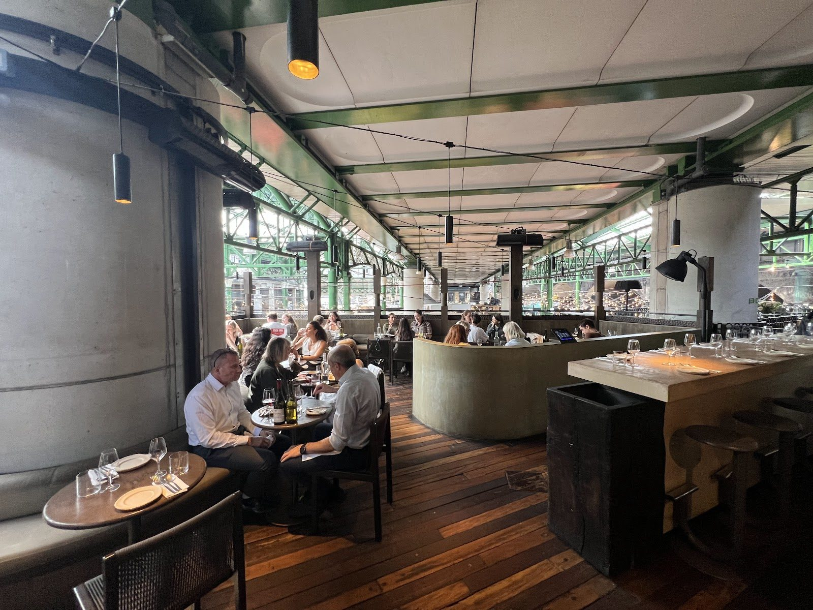

*Oma's dining room.*

The menu is Greek with the Levant and the Balkans mixed in, which the Good Food Guide calls "Greek in spirit". Start with the dips at £6.50 each (tarama with carob rusk; hummus with hot honey), then the **spanakopita gratin** with malawach flatbread (£15), which Grace Dent called "frankly obscene", and the **oxtail giouvetsi** with bone marrow (£34). There is a raw-fish counter and a charcoal grill in the middle of the room, and a covered terrace over the market.

Not everyone is sold. A Reddit regular calls it Greek "inspired", "with very little to do with actual Greek cuisine", and another found it "pretentious and expensive". **Tables are released 30 days ahead, for up to eight; a late cancellation may cost £60 a head.**

### Agora, Borough Market — Oma's souvla bar, with a Bib Gourmand

*££ · 2-4 Bedale Street, SE1 9AL · Bib Gourmand, 2026 guide · Cited by 10 sources · [book a table](https://www.sevenrooms.com/explore/agoralondon/reservations/create/search/)*

The ground floor of Oma's building, built around a rotisserie spit, with counter seats facing the grill and communal tables. Michelin calls it "a simple yet brilliantly effective souvla bar" and the Good Food Guide rates it Good; The Infatuation rates it 8.5.

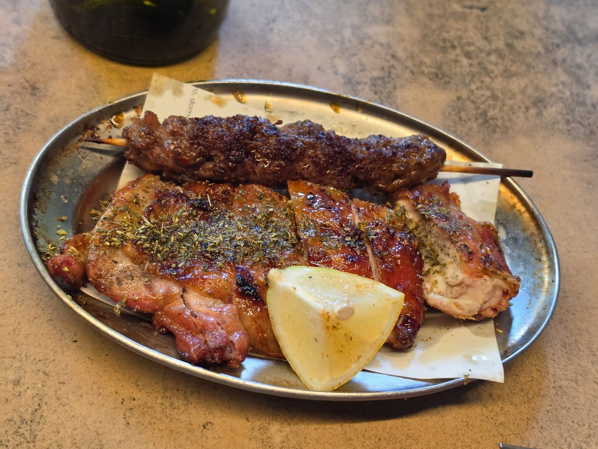

*Skewers at Agora.*

Order skewers by the piece: **pork souvlaki with oregano** (£5 each), slow-grilled chicken thigh (£6), then the **Middle White pork belly** from the spit (£15) and **lamb adana** with garlic yoghurt (£11.50). Dips are £5, and the sesame koulouri pita £3.50. It is loud, and the queue forms early.

**Mostly walk-in between 5pm and 9.30pm.** Bookings are released 14 days ahead, and only for two or more at weekday lunch or four or more at dinner and weekends.

### Tsiakkos & Charcoal, Maida Vale — Time Out's number one

*££ · 5 Marylands Road, W9 2DU · #1 of 17, Time Out · Cited by 10 sources · [book on its site](https://www.tsiakkos.co.uk/)*

A Greek-Cypriot taverna on a residential street in Maida Vale, with fairy lights, plastic foliage and a covered garden room at the back. Everything grilled is cooked over charcoal in the open kitchen by the door. Jay Rayner's 2022 review was headlined "It's just so damn lovely".

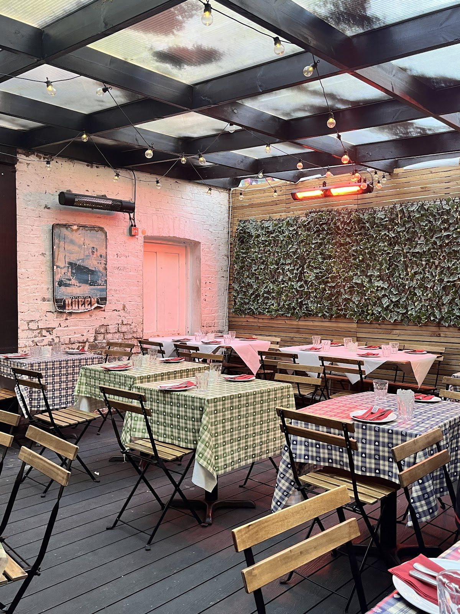

*The garden room at Tsiakkos & Charcoal.*

There is one thing to order: **the house meze**, which Time Out puts at £35 a head and The Infatuation calls "one of the best-value feasts in London": tahini-rich houmous, a garlicky tzatziki and Greek salad, then whole sea bass from the grill and kleftiko from the oven. A sibling, Tsiakkos N1, opened in Islington in 2023.

**Groups of eight or more get the house meze only, and book by email.** Reddit's advice for everyone else: book ahead.

---

## Also strongly backed

### Opso, Marylebone — modern Greek, open all day

*£££ · 10 Paddington Street, W1U 5QL · #8 of 17, Time Out · Cited by 10 sources · [book a table](https://www.sevenrooms.com/reservations/opso)*

Opened in 2014 and named by ten sources, level with Agora and Tsiakkos & Charcoal. Athinorama, the Athens listings magazine, counts it among the first restaurants to show London modern Greek cooking. A bright, Nordic-looking room on two floors, with a marble communal table, a pavement terrace and a Greek wine list it bills as the largest in London.

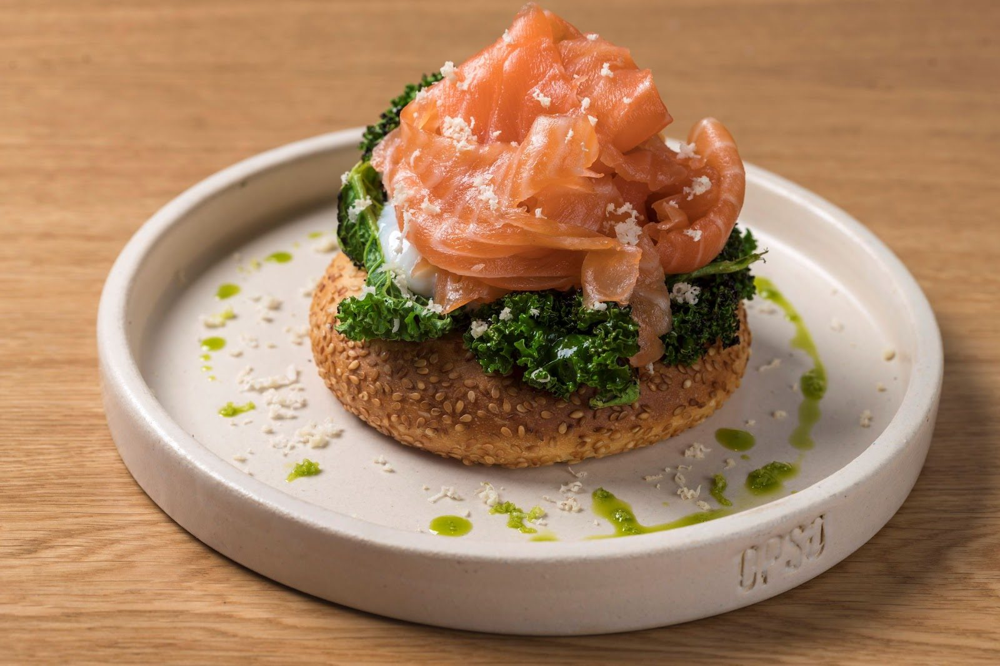

*Brunch at Opso.*

From the all-day menu: **feta kataifi** (£16), **giouvarlakia** lamb and beef dumplings in egg-and-lemon sauce (£18), **spanakorizo**, oven-baked spinach rice with goat's curd (£23), and the **moussakas** (£27). Georgina Hayden goes for brunch and the strapatsada eggs.

**The set lunch is £35 a head, Monday to Friday.** Brunch runs at weekends from 10am.

### Kima, Marylebone — Greek seafood, sold by the kilo

*££££ · 57 Paddington Street, W1U 4HZ · #4 of 17, Time Out · Cited by 9 sources · [book a table](https://www.sevenrooms.com/reservations/kima)*

Opso's sister across the road, opened in 2023 by Andreas Labridis and chef Nikos Roussos, who cooked at the two-starred Funky Gourmet in Athens. You choose a fish from the iced counter by the door, and the kitchen cooks all of it, which it calls "fin to gill": the fillet raw, the bones into broth, the head and collar on the grill. House & Garden describes the small room as "calm and deliberate".

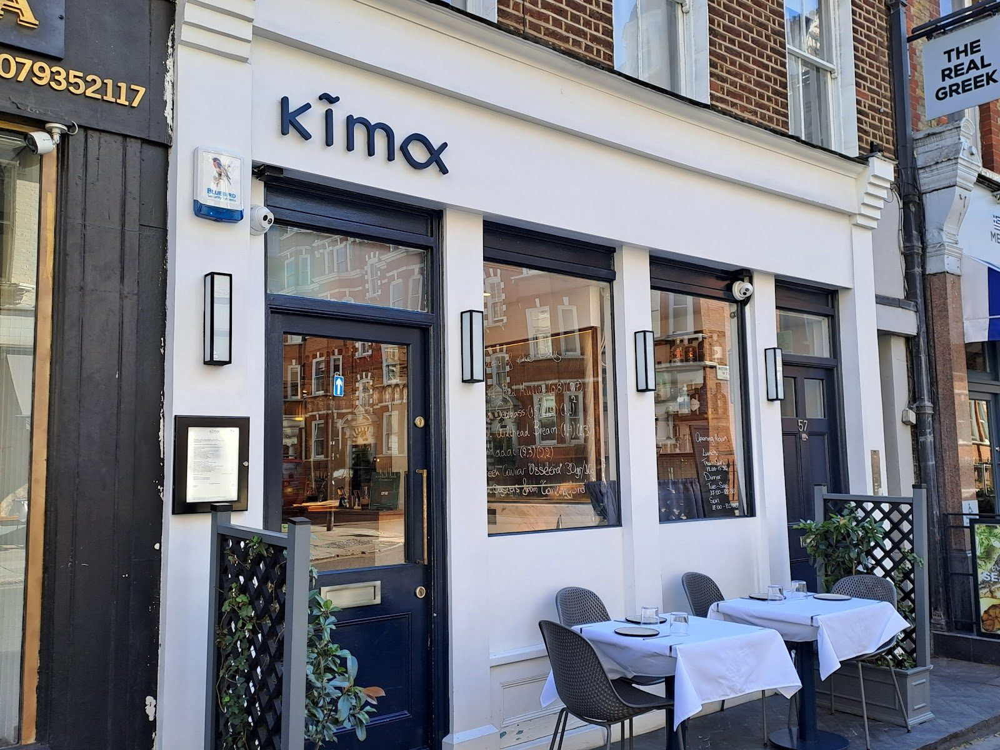

*Kima on Paddington Street.*

**Whole fish on charcoal is £110 a kilo farmed and £130 wild.** Around it: **kakavia** fish soup (£21), red mullet giouvetsi (£45) and a feta sour from the cocktail list.

**A two-course lunch is £35 on Thursday and Friday,** the cheapest way in.

### Pyro, Borough — Greek cooking over open fire

*£££ · 53b Southwark Street, SE1 1RU · Cited by 9 sources · [book a table](https://www.sevenrooms.com/explore/pyrolondon/reservations/create/search?venues=pyrolondon,pyroterrace)*

The first restaurant of Yiannis Mexis, who cooked at The Ledbury, Hide and Pétrus, under a railway arch behind Borough Market. Cane ceilings, terracotta floors and a large courtyard, Baráki, which runs as a terrace bar in summer. Time Out gave it four stars; The Infatuation found the dishes "hit and miss, but the garden always hits".

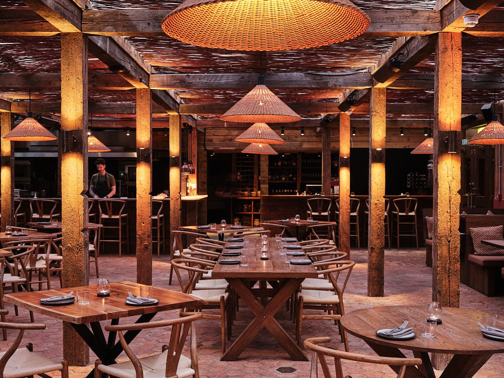

*Pyro's dining room.*

Start with the **spanakopita pastel de nata** (£5) and the **potato pita from the hearth** (£3.50) with dips, then a souvlaki skewer of pork pluma with prunes (£11) or the **Dorset lamb cooked over alder wood** with lamb-fat flatbreads.

**The three-course set lunch is £45.**

### Andy's Taverna, Camden — Reddit's first answer, since 1967

*££ · 23 Pratt Street, NW1 0BG · #9 of 17, Time Out · Cited by 8 sources · [the restaurant's site](https://www.andystaverna.com/)*

A small family taverna off Camden High Street that opened in 1967. Asked for the best Greek restaurant in London in March 2026, r/LondonFood's top answer was "Andys in Camden", backed by seven replies; in a Camden budget thread in September one called it "shockingly good value". The Infatuation rates it 8.6, the highest score on its Greek list, and Gary Eats gave it his first ten out of ten on YouTube.

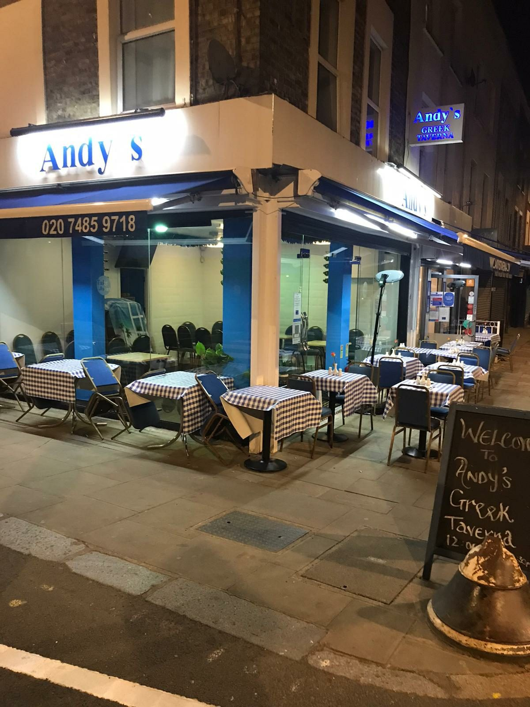

*Andy's Taverna on Pratt Street.*

Hot Dinners' must-orders are the **dolmades** and **moussaka**, with the **fish meze** for seafood eaters; Time Out adds pork afelia and sheftalia. The portions are large and the room is small. Not everyone agrees: the YouTuber Michael's Bites was "extremely disappointed".

**Reservations are by email.** Reddit's tip is the lunch menu.

### Mazi, Notting Hill — modern Greek since 2012, with a garden

*£££ · 12-14 Hillgate Street, W8 7SR · Michelin selected, 2026 guide · Cited by 7 sources · [book a table](https://www.sevenrooms.com/explore/mazinottinghill/reservations/create/search/)*

Christina Mouratoglou and Adrien Carré opened Mazi in 2012, and told Condé Nast Traveller they were "pioneers of the modern Greek restaurant" in London. A small, busy room with a front terrace and a larger vine-covered courtyard behind, which The Infatuation compares to "the backyard of a villa".

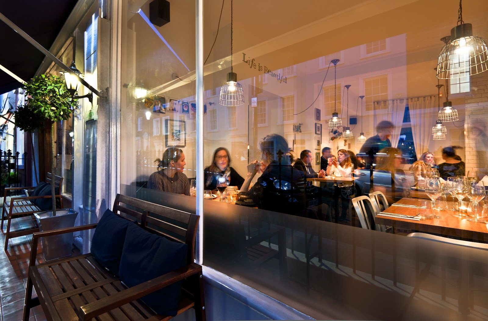

*Mazi on Hillgate Street.*

Michelin singles out the **spiced lamb rump** and the **loukoumades**, honey doughnuts; Time Out the **feta tempura** with lemon marmalade. There are separate vegan and gluten-free menus.

**Tables are held for two hours,** and a booking over 15 minutes late is cancelled. The same owners run Suzi Tros two doors along and Maza in Mayfair.

### Lemonia, Primrose Hill — the neighbourhood taverna since 1979

*££ · 89 Regent's Park Road, NW1 8UY · #6 of 17, Time Out · Cited by 7 sources · [the restaurant's site](https://www.lemonia.co.uk/)*

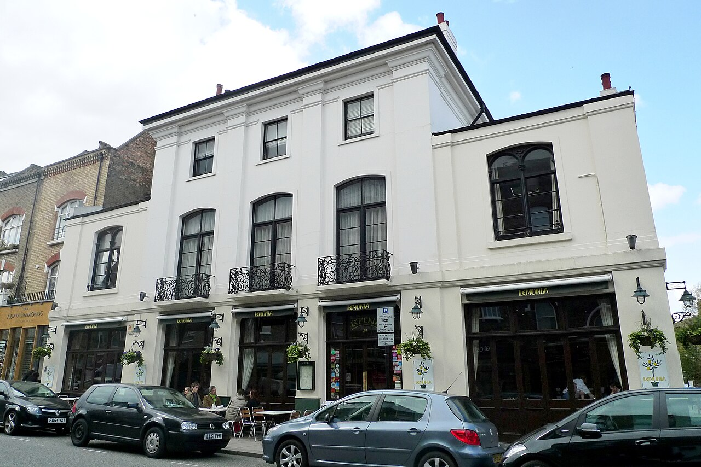

*Lemonia on Regent's Park Road.*

A family-run Greek restaurant in a former pub, open since 1979, with a vine-hung dining room and tables outside in summer. Reddit calls it "a local institution" and "our family outing restaurant when I was a kid", and The Infatuation says it fills you with food and wine "without taking more than £60 quid off you".

The Standard's picks are the **sheftalia**, calamari and Greek salad; Hot Dinners says vegetarians do especially well. It has its critics: one Reddit regular says it has gone downhill, after paying £25.50 for three sheftalia, and another finds it "really expensive" now.

**A three-course set dinner is £29.75, Monday to Thursday,** and a daily set lunch runs on weekdays.

---

## Modern Greek

The new Greek restaurants of the last few years, most of them in Marylebone, Mayfair and Notting Hill. Expect small plates to share, a lot of cooking over charcoal, and wine lists that are all or mostly Greek. The last three, Gaia, Bacchanalia and Fenix, are big Mayfair rooms that sell Greece as a night out.

### Myrtos, South Kensington — the chef from Pied à Terre

*£££ · 260-262 Brompton Road, SW3 2AS · Michelin selected, 2026 guide · Cited by 6 sources · [the restaurant's site](https://myrtoslondon.com/)*

Asimakis Chaniotis spent 13 years at Pied à Terre before opening this in 2025, named after his favourite beach on Kefalonia. A bright room built around an olive tree, with a fish counter. House & Garden's food editor called the food "quietly dazzling".

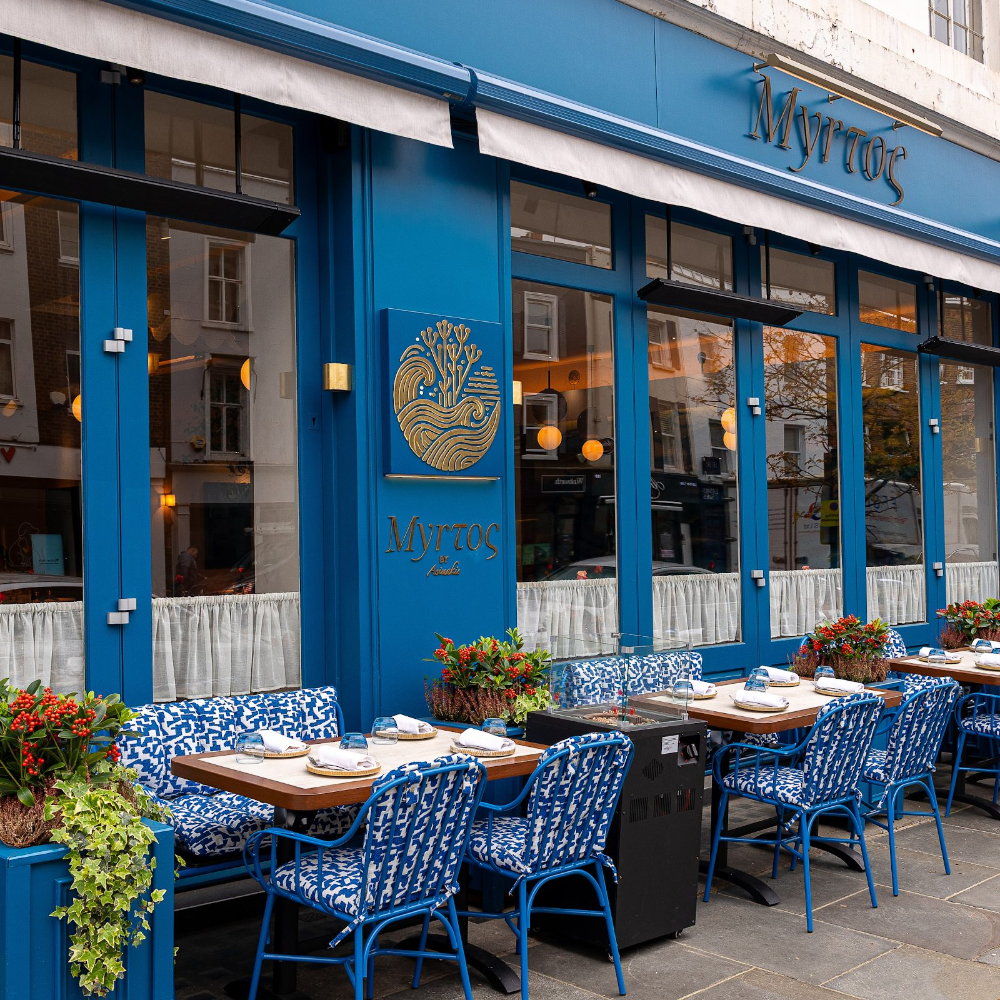

*Myrtos on Brompton Road.*

Order the **taramosalata** with trout roe and dill oil (£11), **tirokafteri**, which Michelin calls "a winner", and the **lamb moussaka**, which the menu describes as "the non-deconstructed, traditional way" (£24).

**Lunch is two courses for £25 or three for £29.**

### Maza, Mayfair — the Mazi team's 1980s Athens taverna

*£££ · 21-23 Bruton Place, W1J 6NB · #3 of 17, Time Out · Cited by 6 sources · [book a table](https://www.sevenrooms.com/explore/maza/reservations/create/search/)*

The third restaurant from Mazi's founders, opened in early 2026 in a low-ceilinged mews room that Time Out says has "1970s conversation pit energy". Time Out gave it four stars and ranks it third; The Infatuation rates it 8.4.

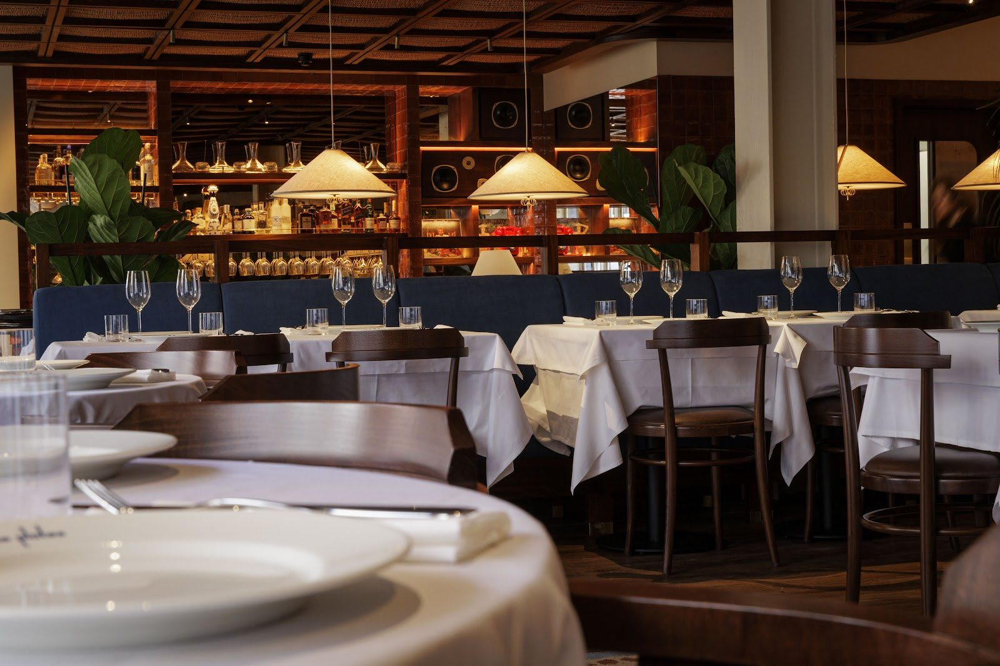

*Maza's dining room.*

The Infatuation's orders are **Grandmama's meatballs** and the **chicken souvlaki**, then the baklava and pistachio ice-cream sandwich. Condé Nast Traveller singles out the maza itself, an ancient barley bread.

**Dinner only: from 6pm to midnight Monday to Saturday, and to 11pm on Sunday.**

### Zylia, Covent Garden — a new Greek-Cypriot taverna

*£££ · 6 Bedford Street, WC2E 9HZ · #7 of 17, Time Out · Cited by 6 sources · [book a table](https://www.sevenrooms.com/explore/zyliacoventgarden/reservations/create/search/)*

Opened in 2026 beside the Arcade food hall by Nick Molyviatis, an Athenian who ran the kitchen at Kiln, and Barry Karacostas, whose family is Cypriot. Whitewashed walls, lace doilies framed on them and an open charcoal grill. Grace Dent said it had "the feel of a family taverna that's already been here for about 62 years".

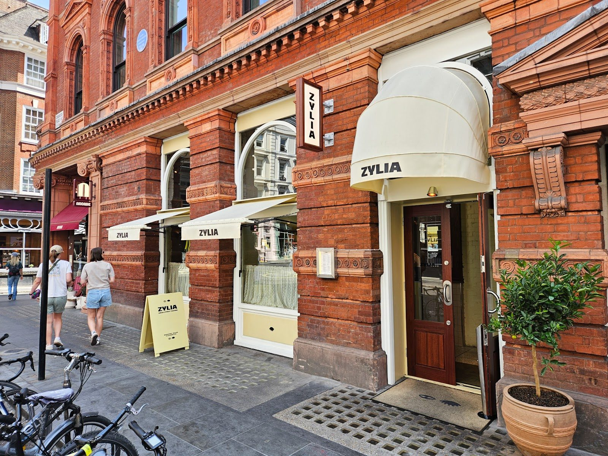

*Zylia on Bedford Street.*

Order Karacostas's mother's **taramosalata** (£7), **sheftalia** (£14) and the **wild prawn saganaki** in a spiced tomato, yoghurt and tahini sauce (£18.50), which Dent called outstanding. The milk-fed **lamb shoulder kleftiko** is £58 to share.

**Bookings open 60 days ahead,** but The Infatuation says some space is held back for walk-ins.

### Taverna Ermou, Marylebone — an Athens taverna's London branch

*££ · 38-40 James Street, Marylebone · Cited by 6 sources · [book a table](https://www.sevenrooms.com/reservations/ermoutaverna)*

The London outpost of a taverna from Ergon, the Athens food group, which opened in March 2026 on a street of chain restaurants south of Wigmore Street. Wooden beams, vintage ornaments and an outdoor terrace; food comes on metal trays.

Condé Nast Traveller ate **keftedes** (meatballs), saganaki and **galaktoboureko**, custard baked under filo; The Infatuation's tip is the **spanakopita dip**, and a breakfast of freddo espresso and **bougatsa**, the filo custard pie (£6.50 on the brunch menu).

**The set lunch is two courses for £25.**

### Zephyr, Notting Hill — Greek with a late bar downstairs

*£££ · 100 Portobello Road, W11 2QD · Cited by 5 sources · [book a table](https://www.zephyr.london/book-a-table)*

The Pachamama group's first Greek restaurant, a bright room on Portobello Road whose front windows open in summer, with a bar downstairs that runs late from Wednesday to Sunday. The Infatuation rates it 8.3.

Luxury London's picks are the **crispy potato terrine** and the **Greek salad** with thick wedges of feta; Hot Dinners says the crudo is strong. The Infatuation notes South American touches, such as a whole grilled fish with amarillo chilli butter.

**Dinner only, from 6pm.**

### Vori, Holland Park — the Hungry Donkey brothers' taverna

*£££ · 120 Holland Park Avenue, W11 4UA · Cited by 5 sources · [book a table](https://vorigreekitchen.co.uk/reservations)*

Opened in January 2023 by Markos, Alexandros and Stefanos Tsimikalis, who ran Hungry Donkey in Spitalfields, and named after a beach on Andros. Tables outside on Holland Park Avenue, an all-Greek wine list, and meat from Lidgates, the butcher next door.

From the charcoal: **pork suvlaki skewers** (£24), **octopus with Santorini fava** (£28) and paidakia, lamb chops (£38). Hot Dinners says the **koulouri** with thyme-honey butter at weekend brunch is "unmissable".

**Closed Monday.** A weekday suvlaki lunch runs from Tuesday to Friday.

### Lagana, Shoreditch — flatbreads and crayons on the tablecloths

*££ · 19 Willow Street, EC2A 3HU · Cited by 4 sources · [book a table](https://www.lagana.london/reservations)*

The Pachamama group's casual Greek restaurant, opened in 2025 on the old Pachamama East site. Paper tablecloths, crayons on every table, a chrome open kitchen and flatbreads coming out of the oven non-stop. The Infatuation rates it 8.4.

Order a flatbread (Condé Nast Traveller had the **prawn saganaki** one), the smoked **chicken thigh** with lemon sauce, and the **salted caramel cheesecake**, which The Infatuation would "plan an entire dinner around".

**Tables are held back for walk-ins,** and 4.30pm bookings are easy to get.

### Estiatorio Milos, St James's — Greek seafood at Mayfair prices

*££££ · 1 Regent Street, St James's · Cited by 4 sources · [book a table](https://www.estiatoriomilos.com/location/london/reserve)*

The London branch, opened in 2015, of Costas Spiliadis's international chain of Greek fish restaurants, in a marble-and-pale-wood dining room off Pall Mall. Fish is priced by weight from an iced display. The London Economic's critic was reminded of "long lunches of grilled fish before the Aegean Sea".

Order **octopus over Santorini fava**, the lightly fried **calamari**, and a whole fish grilled with lemon and olive oil.

**A three-course set menu runs at weekday lunch and from 5pm to 7pm every day,** the only affordable way in.

### Meraki, Fitzrovia — dinner, then dancing

*£££ · 80-82 Great Titchfield Street, W1W 7QT · #17 of 17, Time Out · Cited by 3 sources · [book a table](https://meraki-restaurant.com/london/reservations/)*

From the family behind Roka and Zuma, opened in 2017. Bare brick, glass-fronted wine cabinets and a downstairs room that turns into a club. Cookout, the food site of Greek broadcaster SKAI, places it "somewhere between the classic taverna and the modern Greek restaurant".

Time Out's pick is the **kopanisti**, a barrel-aged feta dip with Florina peppers, from the wooden meze trays; Luxury London's is the **Greek-style rosti** with egg and black truffle.

**From Thursday to Saturday, the Living Room serves dinner from 6.30pm with dancing from 10.30pm to 1am, smart dress required.**

### Suzi Tros, Notting Hill — northern Greek food, two doors from Mazi

*£££ · 18 Hillgate Street, W8 7SR · Cited by 3 sources · [book a table](https://suzitros.com/reservations/)*

Mazi's sister, opened in 2019 and named after a line by the Greek actress Rena Vlachopoulou. Its menu looks to Thessaloniki and northern Greece. Luxury London calls the room "bright and bouncy".

The owner's recommendations, as Luxury London reports them, are the **smoked aubergine** with red pepper cream and **Grandmama's meatballs**; Cookout adds kebabs, soutzoukakia and pork belly.

**It takes bookings but keeps space for walk-ins;** confirm your table by 4pm on the day.

### Krokodilos, Kensington — wild goat for two

*£££ · Lancer Square, 28A Kensington Church Street, W8 4EP · Cited by 3 sources · [book a table](https://www.krokodilos.co.uk/reservations)*

A large, smart Greek restaurant from the group behind Wild Tavern, cooked by Angelos Togias, who worked at The Connaught. Athinorama describes a bronze, peach and gold room split into three, and a tasting of five Greek olive oils to start.

Hot Dinners says to "save room for the phenomenal **wild goat**, cooked for 14 hours"; it comes with Cretan spaghetti at £45 a head for two. Grace Dent's order was the **prawn saganaki** (£32). The Infatuation disagrees, rating it 6.8 and calling it forgettable.

**Prices are high:** signature dishes run from £28 to £34.

### Clio, Marylebone — new on Chiltern Street

*£££ · 66 Chiltern Street, W1U 4EJ · Michelin selected, 2026 guide · Cited by 2 sources · [the restaurant's site](https://cliorestaurant.co.uk/)*

A modern Greek restaurant below a block of flats, named after one of Zeus's daughters; Michelin describes "a faux-rustic look with plenty of tasteful Hellenic touches", and The Infatuation rates it 7.

From the menu: **taramasalata with bottarga**, fresh sea urchin, charred homemade **loukaniko** sausage, and a **monkfish kebab** with wild greens. Michelin singles out a deconstructed red prawn saganaki and suckling pig.

**Michelin calls the wine list "fairly priced",** with Greek bottles to the fore.

### Bottarga, Chelsea — Pachamama's Greek room on the King's Road

*£££ · 383 King's Road, SW10 0LP · Cited by 2 sources · [book a table](https://bottarga.london/reservations)*

The Pachamama group's second Greek restaurant, in a small, dark room on the King's Road with a covered, heated terrace. The Infatuation rates it 8.3 and calls it "effortless, chic, cool"; The London Economic's critic said it showed Chelsea "being reborn as a dining destination".

The Infatuation's formula: **raw yellowtail** or a whole grilled **sea bass**, the cucumber dip, and the **lamb belly**, which "needs to be studied for its crisp-factor".

**For a same-week table, The Infatuation's advice is to phone and ask for the bar or the terrace,** or try a Monday.

### Hera, Stratford — chandeliers at Stratford Cross

*£££ · 4 Arber Way, Stratford Cross, E20 1JS · #10 of 17, Time Out · Cited by 2 sources · [book a table](https://www.sevenrooms.com/explore/hera/reservations/create/search/)*

A big room on the far side of Stratford Cross, with chandeliers, a lot of greenery and plush booths. Chef Mario Salimis cooks Greek classics with modern twists. Time Out gave it four stars.

Time Out's orders are the **melitzanosalata** with honey and balsamic, fried **calamari**, and orzo with prawns and mussels, but it says the best thing on the table, "as basic as it sounds", is the **Greek salad**.

**Cookout reports a Greek night with live music on the last Friday of each month.**

### Gaia, Mayfair — the Dubai import

*££££ · 50 Dover Street, W1S 4NY · Cited by 2 sources · [book a table](https://www.sevenrooms.com/explore/gaialondon/reservations/create/search/)*

The London branch, opened in 2023, of a Greek-Mediterranean group from Dubai, Monaco and Doha, cooked by Izu Ani and Orestis Kotefas. Time Out gave it four stars; Cookout calls it Greek cooking "as a luxury restaurant experience", with gemista, octopus and fava alongside bluefin tuna with caviar and a sea bream **ceviche**. There is a bar on the first floor.

**Book online; the dress code is smart elegant, with no shorts or sportswear.**

### Bacchanalia, Mayfair — Richard Caring's Greco-Roman fantasy

*££££ · 1-3 Mount Street, W1K 3NA · Cited by 2 sources · [the restaurant's site](https://bacchanalia.co.uk/)*

Richard Caring's huge room of hand-painted ceiling murals and Damien Hirst statues. The food is Greek-led: Athinorama names chef Athinagoras Kostakos and his meatballs with smoked yoghurt and slow-cooked lamb with thyme. The Standard called the room "rather fun".

**Two courses from the set menu are £36,** the cheap way to see it.

### Fenix, Mayfair — from Manchester to Piccadilly

*£££ · 80 Piccadilly, W1J 8HX · Cited by 2 sources · [book a table](https://fenixrestaurants.com/booking/)*

The London branch of a Manchester restaurant, opened in March 2026 under chandeliers on Piccadilly. Luxury London's picks are the Athenian tartare, langoustine orzo and wagyu stifado. Grace Dent was split: "big, bright, brash, dumbed down", but "the tartare is very good indeed".

**There is an all-day set menu,** which Dent and Luxury London both point to as the way in.

---

## Tavernas and Greek-Cypriot classics

The family restaurants, most of them in Camden, Bayswater and Belsize Park, where Greek-Cypriot families settled from the 1950s. Big meze menus, grills, kleftiko and moussaka, and owners who have been there for decades.

### Daphne, Camden — three floors, run by one family since the 1980s

*££ · 83 Bayham Street, NW1 0AG · #5 of 17, Time Out · Cited by 5 sources · phone 020 7267 7322*

A Greek-Cypriot restaurant on three floors: floral booths and black-and-white photographs of Cypriot villages on the ground floor, whitewashed walls and tiled floors on the first. The Standard says the Lymbouri family has run it since the 1980s, in a corner of Camden it calls the old "Peloponnese Triangle".

Time Out's orders are the **koubes**, deep-fried bulgur shells stuffed with lamb, then spanakopita and lamb souvlaki; Stylist's is **afelia**, pork in red wine. A Reddit reply calls it "quite good... I believe the owners are Cypriot".

**Book by phone.**

### Evi's, East Dulwich — the souvlaki stall that became a taverna

*££ · 18 North Cross Road, SE22 9EU · Cited by 5 sources · [book a table](https://www.evisrestaurant.com/book)*

Evi Peroulaki and Conor Mills ran the street-food stall Souvlaki Street before opening this candlelit neighbourhood room off Lordship Lane, with booths at the back. The Infatuation says most people "stumble in as walk-ins".

From the grill: **hoirina kalamakia**, pork skewers with fennel (£16), and **paidakia**, Yorkshire lamb chops (£18). The Infatuation's tip is the **courgette fritters**. Every wine is Greek, retsina included.

**Card only. Closed Sunday and Monday;** lunch is served Thursday to Saturday only.

### Halepi, Bayswater — the charcoal grill by the door since the 1960s

*££ · 18 Leinster Terrace, W2 3ET · Cited by 4 sources*

A family-owned Greek-Cypriot taverna north of Hyde Park, where, Hot Dinners says, owner Kosta tends a custom-built grill at the front, much as it has been since the 1960s. A Greek-Cypriot UFC fighter took the YouTuber Dilan Kurt there in 2026 because his family had eaten there for years.

The order is the **lamb sharing platters**, then the homemade baklava. Reddit calls it "homely and hearty although more Cypriot".

**Book for evenings,** says a regular: "it gets packed".

### Aphrodite Taverna, Bayswater — the Cypriot taverna of 1988

*££ · 15 Hereford Road, W2 4AB · #12 of 17, Time Out · Cited by 3 sources · [the restaurant's site](http://www.aphroditerestaurant.co.uk/)*

Opened by a Cypriot chef and his wife in 1988, with every wall covered in plates, statuettes and gourds, and bouzouki on the stereo. Eater London called it "one of London's most beloved Greek tavernas".

On the menu: **kleftiko** (£27), **souvla**, spit-roast lamb (£28), and meze for two or more at £30 a head vegetarian, £40 meat or £50 fish. Eater's must-order is the homemade smoked taramasalata.

**It is a small room; the restaurant recommends booking.**

### Retsina, Belsize Park — 30 years of meze

*££ · 48-50 Belsize Lane, NW3 5AR · #13 of 17, Time Out · Cited by 3 sources · phone 020 7431 5855*

A family-run Greek restaurant open for more than 30 years, more formal than most: Time Out describes an elegant room with heavy tablecloths and a smartly dressed crowd. Eater London said owner Zita Mina makes "arguably the best kleftiko in the whole city".

Order one of the **meze feasts**, or the **kleftiko**; Time Out adds avgolemono soup and grilled octopus.

**Bookings by phone,** and it does takeaway on the same number.

### Alexander the Great, Camden — Reddit's Camden alternative

*££ · 8 Plender Street, NW1 0JT · Cited by 2 sources · [book a table](https://alexanderthegreatgreekrestaurant.co.uk/en/reservation)*

A Greek taverna a few minutes from Camden Town station, with a private dining room. Gary Eats reviewed it in December 2024 after viewers sent him there from Andy's, a few seconds' walk away. On Reddit it is where "my Greek coworkers took me and it was fantastic".

Reddit's orders are the **mixed meze** for a group and the **sheftalia**. House wine is £20.95 a bottle.

**Weekday lunch runs from noon to 3pm.**

### Attica, Clerkenwell — the Kolossi Grill, restored

*££ · Rosebery Avenue, EC1R 4RR · Cited by 2 sources*

The Kolossi Grill opened in 1966 near Exmouth Market and fed generations of Guardian and Observer journalists. New owners, involved with the nearby Sekforde pub, took over the lease and renamed it Attica: the mock-Palladian front is now painted deep blue, the wood panelling cream, and the tables are marble under a canopy of fairy-lit twigs. Jay Rayner reviewed it in 2023: "It's not revelatory, it's much better than that." On Reddit in 2026 it is "a classic".

Rayner's orders were the **tarama**, "whipped and frothy", **prawns saganaki** baked with feta and cherry tomatoes, and **sea bass** on new potatoes.

**A short menu now, where the old one was long.**

### Peckham Bazaar, Peckham — Greek, Albanian and Turkish over charcoal

*£££ · 119 Consort Road, SE15 3RU · #11 of 17, Time Out · Cited by 3 sources · [book a table](https://www.peckhambazaar.com/book-now)*

Run by chef John Gionleka, who has Albanian roots, and cooking across the Balkans with Greek dishes prominent; Time Out files it as Balkan. Athinorama counts it among the restaurants that put modern Greek cooking on London's map. A summer terrace and Greek wines.

Athinorama's two dishes that "have been on the menu since day one" are the **courgette fritters** with kohlrabi tarator and **grilled octopus** with potato salad and taramas.

**Dinner only on weekdays, from 6pm;** lunch on Saturday and Sunday.

### The Life Goddess, Bloomsbury and Soho — a Greek deli with 100 wines

*££ · 29 Store Street, WC1E 7BS, and 1 Kingly Court, W1B 5PW · #15 of 17, Time Out · Cited by 4 sources*

Two Greek deli-restaurants: the original on Store Street, which Georgina Hayden visits "for their cake and wine", and a Soho branch in Kingly Court that Time Out ranks. A Reddit regular counts "over 100 Greek wines".

Time Out's orders are slow-cooked **octopus with fava** and pork marinated in red wine, honey and orange; Hayden's is a slice of sweet or savoury **pie** at a pavement table.

**Casual and daytime-friendly;** weekend brunch at the Soho branch.

---

## Palmers Green: Greek-Cypriot north London

North London's Cypriot community moved up Green Lanes from the 1970s, and Palmers Green, Southgate and Wood Green still have the city's densest run of Cypriot bakeries, souvlaki counters and tavernas. Eater London's Jonathan Nunn called it "one of the luckiest neighbourhoods in the capital". Most of the food here is eaten on the go or at home, so the restaurants are fewer and quieter than the Turkish ocakbaşı grills down Green Lanes in Harringay.

### Paneri Taverna, Wood Green — the mix kebab

*£ · 340 High Road, N22 8JW · Cited by 4 sources*

Eater London called it the souvlaki house "most resembling the experience in Cyprus": charcoal smoke, wicker chairs outside and regulars at the counter, with a dining room at the back for meze. The Standard noted the sign that still reads "Exclusive Greek cuisine".

Order the **mix**: a giant Cypriot pitta filled with salted pork souvlaki, tomato, cucumber and **sheftalia**, the caul-fat pork sausages. The Standard adds pastitsio, stifado and keftedes.

**A takeaway counter at the front,** seats at the back.

### Nissi, Palmers Green — Georgina Hayden's family restaurant

*££ · 62 Aldermans Hill, N13 4PP · Cited by 2 sources*

The cookery writer Georgina Hayden, whose grandparents ran a Cypriot restaurant in north London, told Condé Nast Traveller: "It's where I take my Yiayia and my kids." Eater London describes a narrow room that does most of its business from sit-down diners, rare in Palmers Green, with the grill visible from the middle tables.

Order the **mezedakia**, small dishes, and Hayden's favourite, the **fish meze**; calamari and chips for a quick lunch.

**Big groups take the wider back room;** Hayden recommends a long lunch.

### Dionysus, Southgate — the West End souvlaki house, moved north

*£ · 44 High Street, Southgate, N14 6EB · Cited by 2 sources · [the restaurant's site](https://www.dionysus.co.uk/)*

Dionysus began in the West End in the 1950s, as its own site puts it, and closed there in 2009; the sign came back in Southgate. A Reddit reply calls it "an authentic Greek Souvlaki House" whose pittas are "exactly as they are in Cyprus", and Eater London picks the grilled loukaniko and pastourma.

The **mixed souvlaki** in Cypriot pitta is the order; the menu also runs to kleftiko, louvi (black-eyed beans with greens) and makaronia tou fournou.

**Takeaway and delivery as well as a dining room.**

### Also on the strip

Named by one source each, mostly Eater London's 2020 and 2022 maps. Check before travelling: these are the oldest recommendations on the page.

| Place | What it is | Where |
| --- | --- | --- |
| **Aroma Patisserie** | Cypriot bakery: koupes, loukoumades, rose ice cream in summer | 424 Green Lanes, N13 |
| **Wilton Patisserie** | Cypriot café-bakery, tahinopita and Greek coffee | 49-53 Chase Side, Southgate, N14 |
| **Lefteris Bakery** | Sesame village bread and halloumi bread | 23 Green Lanes, N13 |
| **Taste of Cyprus** | Bakery; Eater rated its dessert pastries above Aroma's | 34 Green Lanes, N13 |
| **Babinondas** | Big meze taverna for Cypriot family parties | 598 Green Lanes, Winchmore Hill, N13 |
| **The Blue Olive** | Family taverna with a takeaway counter | Cockfosters Road, Barnet, EN4 |

---

## Souvlaki and street food

### Suvlaki, Soho — skewers threaded on site every day

*£ · 21 Bateman Street, W1D 3AL · #16 of 17, Time Out · Cited by 2 sources · [the restaurant's site](https://www.suvlaki.co.uk/)*

A small room off Frith Street, from two founders from Athens, with a second branch in Shoreditch. Time Out says the meat is threaded on site daily and cooked over charcoal on a robata grill. On Reddit, asked to choose between it and The Real Greek chain, a regular said Suvlaki was "leagues better".

**Wraps are £9.50 to £10,** skewer plates £11 to £12. Open until 9.30pm, and 10.30pm on Friday and Saturday.

### Pittagoras, Tooting and Hackney Wick — gyros from a Kefalonian family

*£ · Tooting Broadway Market and Colour Factory, Hackney Wick · Cited by 2 sources · [the restaurant's site](https://www.pittagoras.co.uk/)*

A gyros counter in Tooting Broadway Market, with a second site at the Colour Factory in Hackney Wick; its co-founder Ilias is the third generation of a Kefalonian restaurant family. MyLondon called the wraps "some of the best Greek wraps and dishes in London", and a Reddit reply "by far the best gyro I've had".

Order the **chicken gyros wrap**, with chips inside, or a souvlaki platter.

**Market tables, a cold Mythos, open from 11am every day.**

### Tony's Pita, Palmers Green, Ealing and Swiss Cottage — the kebab-award winner

*£ · 378 Green Lanes, N13; 29 Bond Street, Ealing, W5; and Swiss Cottage · Cited by 2 sources · [the restaurant's site](https://www.tonyspita.co.uk/)*

Opened in Swiss Cottage in 2018 by Tony Shyti, who learned to cook in Greek restaurants as a teenager. MyLondon reported in 2023 that it had won Best Greek Restaurant at the British Kebab Awards three years running. A Reddit reply recommends the Ealing branch "for cheap takeaway (souvlaki wraps etc)".

**A small chain now, with more branches opening;** the three above are the ones the sources name.

### The Souvlaki, Kingston and East Sheen — the takeaway award winner

*£ · Kingston (KT1) and 405 Upper Richmond Road West, East Sheen, SW14 7NX · Cited by 2 sources · [the restaurant's site](https://www.thesouvlaki.london/)*

Started on a stall in Kingston market by Valentinos Varelas and Sandy Tsagdi, who moved from Greece in 2014. MyLondon visited after it won Just Eat's 2023 Greater London Takeaway of the Year, and found Greek Londoners there "for a taste of home".

Order a **chicken gyros wrap** with oregano fries, or a souvlaki box.

**Most of its trade is delivery and takeaway.**

---

## Cheapest

* **Agora**, Borough Market — skewers from £3.50, pork souvlaki £5 each. Cited by 10 sources.
* **Suvlaki**, Soho — wraps £9.50 to £10. Cited by 2 sources.
* **Paneri Taverna**, Wood Green — the mix kebab in Cypriot pitta. Cited by 4 sources.
* **Lemonia**, Primrose Hill — three courses for **£29.75**, Monday to Thursday dinner. Cited by 7 sources.
* **Myrtos**, South Kensington — two courses for **£25** at lunch. Cited by 6 sources.
* **Kima**, Marylebone — two courses for **£35** on Thursday and Friday lunch. Cited by 9 sources.
* **Opso**, Marylebone — set lunch **£35**, Monday to Friday. Cited by 10 sources.
* **Bacchanalia**, Mayfair — two courses for **£36**. Cited by 2 sources.

## Late

* **Maza**, Mayfair — until midnight Monday to Saturday. Cited by 6 sources.
* **Meraki**, Fitzrovia — dancing until 1am Thursday to Saturday. Cited by 3 sources.
* **Zephyr**, Notting Hill — the bar downstairs runs late Wednesday to Sunday. Cited by 5 sources.

## Recent arrivals

* **Taverna Ermou**, Marylebone — opened March 2026. Cited by 6 sources.
* **Maza**, Mayfair — opened early 2026. Cited by 6 sources.
* **Zylia**, Covent Garden — opened 2026. Cited by 6 sources.
* **Fenix**, Mayfair — opened March 2026. Cited by 2 sources.
* **Myrtos**, South Kensington — opened 2025. Cited by 6 sources.

## Gone, and named by the sources anyway

* **Vrisaki**, the meze taverna on Myddleton Road in Bowes Park that Eater London called home to "the city's most famous souvlaki", closed in 2025 after about fifty years.
* **Retsina & Mousaka** in West Ealing, on Eater's 2020 list, has closed. Retsina in Belsize Park is a different restaurant and is open.
* **Hungry Donkey**, the Tsimikalis brothers' Spitalfields restaurant, has closed; they now run Vori.

---

## Continue planning your London trip

- 🍽️ **[Eat in London: Restaurants, Food Markets & Quick Food Hub](/articles/eat-in-london-guide/)**
- 🧆 **[The Best Middle Eastern Restaurants in London](/articles/best-middle-eastern-restaurants-london/)** — Lebanese, Palestinian, Syrian and Persian kitchens
- 🔥 **[The Best Turkish Restaurants in London](/articles/best-turkish-restaurants-london/)** — the ocakbaşı grills further down Green Lanes
- 🌿 **[The Best Vegetarian and Vegan Restaurants in London](/articles/best-vegetarian-vegan-restaurants-london/)**
- 💷 **[Cheap Eats in London](/articles/cheap-eats-london/)**
- 🐟 **[The Best Seafood Restaurants in London](/articles/best-seafood-restaurants-london/)**
- 🏛️ **[Camden Area Guide](/articles/camden-area-guide/)**
- 🏙️ **[Fitzrovia Area Guide](/articles/fitzrovia-area-guide/)**
- 🛍️ **[Marylebone Area Guide](/articles/marylebone-area-guide/)**
- 🎨 **[Notting Hill Area Guide](/articles/notting-hill-area-guide/)**
