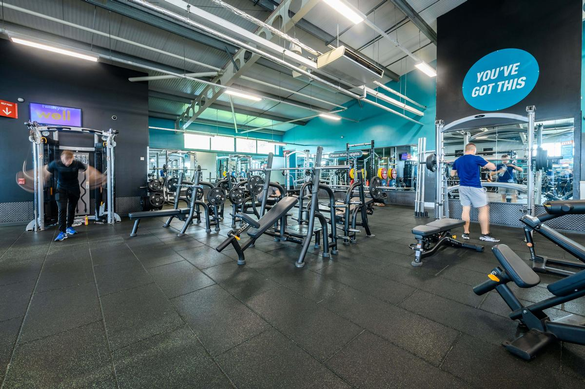
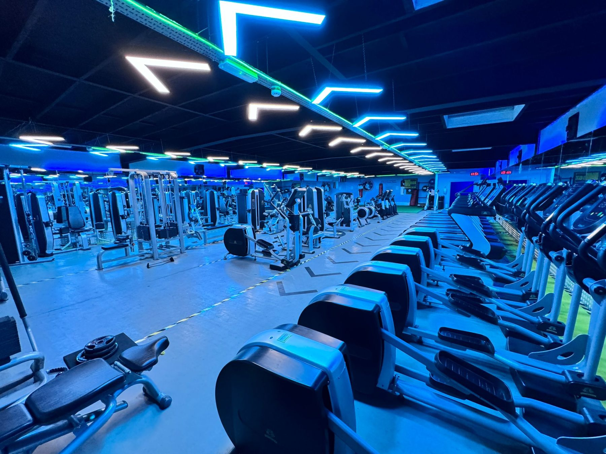
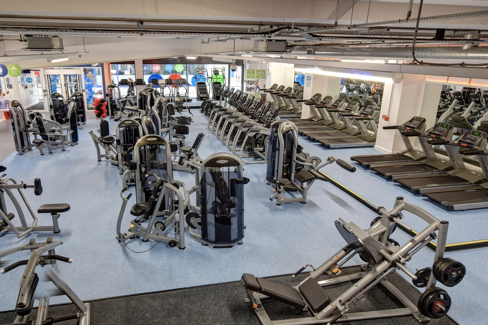

Nearly every "best gyms in London" page you will find is earning a referral fee on the sign-up. That shapes what gets printed, and more importantly what does not: the joining fee, the clause that lets one chain move you onto a dearer club's rate, and the fact that **the cheapest way to swim in London costs £3.20 and involves no membership at all**.

So here is the same thing done the other way round. Every figure below was **read off the operator's own website or the council's own website on 9 September 2026** — no comparison sites, no affiliate roundups. Where an operator publishes no price, that is recorded as a fact about the operator, because it is one.

> 💡 **The Short Version:** **Public leisure is not automatically cheaper.** Better runs **£34.25** at Phoenix to **£60.00** at Vauxhall, dearer than most commercial chains. Where public wins outright is casual swimming — **£3.20** at Crystal Palace against **£26–£35** for a single boutique class. The cheapest membership in London is **Fitness4Less at £20**, flat across all three clubs including one in Zone 1. **The joining fee is where the advertised price stops being the price:** Virgin Active charges **£25 to £250** depending on the club, and doubles it if you go rolling. **JD Gyms is the only chain in London with a genuine standing no-fee policy.** And if you swim twice a week, **pay-as-you-go beats the membership** — by **£150 a year** at Britannia.

> ⚠️ **The resident discount is the biggest number on this page and nobody prints it.** A Camden resident pays **£54.10** a year for a Better Pay As You Go card. A non-resident pays **£109.40** for the same card — exactly double. In Kensington and Chelsea the card is **free** to residents and **£37** to everybody else. Southwark residents swim and use the gym free at set times. Check your own borough before you sign anything.

---

## What a London gym actually costs

Ordered cheapest first within each block: budget chains, then mid-range, then premium, then public leisure. Boutique studios sell classes rather than gym floors and have their own table further down.

| Brand | London sites | Monthly | Joining fee | Contract | Pool |
| --- | --- | --- | --- | --- | --- |
| **Fitness4Less** | 3 | **£20.00** flat | Charged, half price today, amount not published | No contract | No |
| **PureGym** | 87 | £22.99–£49.99 | £0–£25; commonest is £15 | Rolling, or fixed term | No |
| **The Gym Group** | 86 | £23.99–£39.99 | £0, £10, £15 or £20 | Rolling, or 9/12-month saver | No |
| **JD Gyms** | 3 | £25.99–£34.99 | **None, as standing policy** | Rolling, or 14-months-for-12 | No |
| **UK Fitness Club** | 3 | £25.99–£29.99 | £15 or £20 | No contract, or 6/12 months upfront | No |
| **énergie Fitness** | 18 | Not published | £0 at all 18 today, framed as an offer | Both offered | No |
| **Snap Fitness** | 10 | Not published | £30, waived at some clubs | Rolling or fixed term | No |
| **Bannatyne** | 4 | £49.99–£69.99 | Charged, half price today, amount not published | Not published | Yes, all four |
| **Fitness First** | 17 | £54–£120 | Charged, amount never published | Minimum term, or monthly | 7 of 17 |
| **Nuffield Health** | 33 | £77–£137 | **£29** (£39 at three City clubs) | 12 months, or rolling | **31 of 33** |
| **Everlast Gyms** | 1 | From £100 | £20, waived today | Not published | Yes, Chiswick |
| **Gymbox** | 10 | £82–£141 | £30; £0–£10 on longer terms | 12 months, 3 months or rolling | No |
| **Virgin Active** | 32 | £160–£300 | **£25–£250** | 12 months, or rolling | Almost every club |
| **Third Space** | 17 | £257–£345 | £100 (£200 all-clubs) | Rolling on notice, fixed term sold | 11 of 17 |
| **David Lloyd** | 20 | Not published | Not published | 12 months, or 3 months | **Yes, every club** |
| **Equinox** | 3 | Not published | Not published | Not published | None listed at Kensington |
| **Be Well** (Tower Hamlets) | 7 | £15.00–£99.00 | **None** | No contract | 4 of 5 pools open |
| **Everyone Active** | 12 | £30.00–£75.99 | £0 today | No contract, month in advance | Most centres |
| **Move Southwark** | 8 | £31.99–£61.49 | £25 | Not stated | Most centres |
| **Better (GLL)** | 85 | £34.25–£72.00 | £12.50 setup | No minimum term monthly | 53+ centres |
| **Places Leisure** | 11 | £35.00–£75.00 | Folded into the first payment | No minimum term | Most Wandsworth sites |
| **Mytime Active** (Bromley) | 6 | Not published | **None** | No contract | Yes, all six |

**Reading the "from" column.** Several of those floor prices are restricted tiers rather than a normal adult membership: Be Well's £15 is its disability membership, Everyone Active's £30 is swim-only at Porchester, Move Southwark's £31.99 is a concession rate, and Virgin Active's £160 is a twelve-month rate at two of only five London clubs where it publishes anything. The ceiling figures include multi-site tiers — Better's £72 is its UK-wide pass, Third Space's £345 opens all seventeen clubs.

**Anytime Fitness operates in London**, but its UK site currently serves a bot-protection check rather than a club list, a price or a joining fee, so no Anytime figures appear anywhere on this page rather than figures borrowed from somewhere else.

---

## Budget: £20 to £50 a month

*PureGym runs 87 London clubs and prices every one of them separately — this floor could be £22.99 or £49.99 depending which postcode it is in.*

**Fitness4Less is the sharpest price in central London and almost nobody names it.** Three clubs — Canning Town, Cambridge Heath and Southwark — all at **£20.00 a month**, including a site on Great Suffolk Street two minutes from Southwark Underground. Against PureGym at £41.99 in Holborn or The Gym Group at £39.99 at Monument, that is a remarkable Zone 1 number. Two caveats: the joining fee exists and its amount is nowhere on the public site behind the standing "50% OFF Joining Fees" banner, and only the Monthly tab on the club pages renders a figure at all — the Short-Term, Annual and Off-Peak tabs are unpriced until checkout, and the price panel still carries the developer's unedited "DESCRIPTION PLACEHOLDER" text. Canning Town runs 05:00–01:00 Monday to Thursday, which is close to 24 hours without being it.

**PureGym has 87 London clubs and a 2.2x price spread across them.** The same Core membership is **£22.99** at Croydon and Wembley and **£49.99** at Clapham. Off-peak runs £17.99 to £35.99 — but only at 61 of the 87 clubs, so a quarter of London PureGyms have no off-peak tier at all, and the off-peak hours are not published on the gym pages. Sixty-eight of the 87 club pages are titled "24 hour gym"; PureGym's own footnote is the more careful "†Most gyms open 24/7". Classes are included at most gyms. A guest costs you either the Plus tier or the **Buddy Access bolt-on "from just £3 extra per month"** for four guest visits.

**The Gym Group is the same shape with a tighter ceiling** — **£23.99** at Alperton, Colindale and Wembley Central to **£39.99** at Monument, and off-peak from £16.99 at 79 of its 86 clubs. The off-peak hours are the awkward part: there are **eleven distinct schedules** across the London estate, one of which chops the day into 00:00–06:00, 09:00–11:00 and 13:00–16:30. Classes are free on every tier. Personal training is not — the trainers are freelance and set their own rates — though new members get one free session inside 60 days. Lockers need your own padlock or £5 from the vending machine.

**JD Gyms has only three London clubs, and the honest joining-fee policy.** Charlton, Enfield and Uxbridge, **£25.99 to £34.99**, all three open 24/7, saunas in the changing rooms included, classes included even on a day pass. "No Joining Fee" appears as a permanent feature bullet on every membership card at every club — not a banner, not a countdown. The trap here is the opposite of the usual one: **the teaser rate is not the price.** Enfield and Uxbridge both advertise "£15 1st month" and then charge £34.99 and £25.99. Charlton has no teaser and charges £29.99 from month one, which makes the club that looks dearest on the shelf the cheapest of the three over a year.

*UK Fitness Club's East Ham floor. It is the only one of its clubs with a sauna and jacuzzi, at £4.99 a session on top of the membership.*

**UK Fitness Club is a small east London independent, and its real price is the year paid upfront.** Three London clubs: Barking, East Ham, and a women-only club next door to East Ham on Castle Street (a fourth is in Tilbury, Essex). Direct debit with no contract is **£25.99** at Barking, £28.99 at East Ham and £29.99 at the women-only club, plus a £15–£20 sign-up fee; paying monthly without a direct debit costs £4 to £6 more. A year upfront at Barking is **£219.99 — £18.33 a month, and £91.89 less than twelve direct debits**. East Ham adds the sauna and jacuzzi (£6.99 a session for non-members) and a family membership covering up to three people for £73.99 a month. Barking and East Ham open 06:00–23:00 every day; the women-only club closes at 22:30 on weekdays and keeps 09:00–21:00 at weekends. There is no personal training to buy, and the FAQ's "from just £16.66/month" matches no plan on the price list.

**Snap Fitness and énergie both decline to publish a monthly price.** Snap's ten London clubs route membership to a "Submit Interest" form; its £30 joining fee is confirmed only because some clubs advertise "Save £30" when waiving it. What Snap does publish is unusually generous multi-site access — every plan covers all 1,000+ Snap gyms worldwide, with no tier cap — and unusually punitive local rules, of which more below. énergie's eighteen London clubs all run a no-joining-fee offer today and every one frames it as temporary, which tells you the fee is real; Cricklewood's still advertises an offer whose own end date has passed.

> ⚠️ **easyGym has no gym left in London.** Its only London site, Camberwell, carries the line "easyGym Cambewell is now permanently closed" on its own page — while the homepage still runs a "Join easyGym from £12.99 per month" hero, still lists Camberwell in the navigation and still shows a JOIN NOW button. **TruGym** has shrunk to five clubs and none is in London. **Village Health + Wellness** has 35 clubs and the nearest to London is Watford.

---

## Mid-range: £50 to £140

*The floor space is what the mid-range buys you over budget. What it does not buy you, at most chains, is a pool.*

**Nuffield Health is the most honest chain on this page and the one with the pools.** £29 joining fee, printed plainly on every plan card as "£29.00 one-time joining fee", not framed as a promotion and not waived by any offer — £39 at the three City clubs. Membership runs **£77** at Ilford to **£137** at Barbican, City and Moorgate on a twelve-month Anytime plan, with rolling costing £17 to £25 a month more.

The thing to work out is which tier you want, not which contract. At Islington the ladder is **£109 off-peak, £128 Anytime, £150 rolling** — so the off-peak tier saves £41 a month, more than twice what a year's commitment saves. The catch is that off-peak means something different at every club: Covent Garden is 09:00–17:00 weekdays with weekends entirely free, while **Bromley is 06:00–16:00 weekdays with no weekend access at all**. There are eight distinct London off-peak schedules. Check the specific club's hours before the price.

**Fitness First runs £54 at Brixton to £120 at Baker Street, London Bridge Cottons and Marylebone**, with Streatham at £65, Oxford Circus and The Strand at £75, and a cluster at £90. It charges a joining fee and is the only chain here that never says how much — the terms confirm it exists ("your first payment including any joining fee will be paid upfront by card payment") and no figure appears anywhere on the public site. Multi-club access is included but tiered: "you can use any club at your membership tier or below". The club pages state the reach inconsistently — Bishopsgate says 22 other gyms, Streatham says 13, Baker Street names three. Liverpool Street's own page advertises "from just £85 a month" beside a price card reading £90.

**Bannatyne has four London clubs and a pool at all of them** — Chingford a 25-metre pool with sauna, steam and spa pool, Orpington 15 metres plus a Bannatyne Spa, and swim timetables at Grove Park and Maida Vale. Published prices exist only at the two clubs *not* running the aggressive offer: **£49.99 at Maida Vale, £69.99 at Grove Park**. Chingford and Orpington are advertising "THE REST OF SEPTEMBER IS FREE" and publish no monthly figure at all.

**Everlast Gyms is the surprise, and not in a good way.** This is the Sports Direct gym brand, so everyone assumes cheap. Its only London club, at Chiswick Sports Ground, is **from £100 a month** — more than double a PureGym in the same postcode area and dearer than Nuffield at Ealing. It does have a pool, aqua classes, Hyrox, reformer Pilates, ice baths and free parking. It also has the shortest hours of any chain here: **Mon–Thu 06:00–22:00, Fri to 21:00, weekends 08:00–18:00.** Nothing at all after six on a Saturday, for £100 a month.

> **Sports Direct Fitness no longer exists as a brand.** The domain does not resolve and the estate trades as Everlast under Frasers Group. Guides still listing Sports Direct gyms in London are describing something that is not there.

---

## Premium: £160 to £345

**Virgin Active publishes a price for five of its 32 London clubs.** Mayfair, Chiswick Riverside, Kensington, Canary Riverside and Strand have a rates page with figures on it. The other 27 — Aldersgate, Bank, Barbican, Clapham, Islington Angel, Moorgate, Notting Hill, Swiss Cottage, Tower Bridge, Wimbledon and the rest — show no price at all. You book a tour to find out.

What the five do show is the widest joining fee in London. **Strand: £25 on twelve months, £50 on rolling.** Canary Riverside £30 / £50. Kensington £45 / £75. **Mayfair and Chiswick Riverside: £250 on all membership types.** That is ten times the Strand fee, at the same brand, in the same city. The rolling premium on the monthly rate is severe on top — Strand £160 against £218, Chiswick Riverside £300 against £404 — so flexibility costs you 26–36% plus a doubled fee.

The one genuinely useful thing Virgin Active publishes is its **seven-tier club access table**, last edited 21 August 2026: you can use any club in your tier or below. Tier 1 is Chiswick Riverside and Mayfair, Tier 2 Kensington, Tier 3 the Strand-and-Bank group, and so on. Because the tiers line up exactly with the published prices, the table is how you infer roughly what an unpriced club costs. There is no off-peak tier; the discount instead is 15% off the twelve-month rate for 16–17s, 18–25s and over-65s.

**Third Space is the most expensive gym floor in London and the most transparent about it.** **£257** at Canary Wharf, City, Moorgate and Wood Wharf; £259 Tower Bridge; £265 Paternoster Square and Queen's Park; £269 Battersea, Clapham Junction and Wimbledon; £274 Richmond; **£287** at Islington, Marylebone, Soho and The Whiteley. Chelsea and Mayfair publish no single-club price at all. The multi-club tier has a hole in the middle of it: the £299 Group tier's own wording is "includes full access to all Third Space clubs, **excluding Mayfair and Chelsea**", and only Group Plus at **£345** opens everything. The two clubs most people picture are the two the middle tier does not include.

**David Lloyd publishes no price anywhere.** Its memberships page is an enquiry funnel — pick a club, a duration, a tier, then "Enquire now" — which means the price is negotiated, which means what you pay depends on how you negotiate. What it does publish is the tier structure. **Club** is the off-peak tier and the hours are the narrowest of any chain here: **11am–4pm weekdays and after 2pm at weekends**, with no racquets, no spa and no Blaze. **Club Plus** adds unrestricted hours. **Platinum** adds racquets, Blaze, spa retreats, multi-club and a monthly guest pass — except that the guest pass is withdrawn at five London clubs, Acton Park, Enfield, Finchley, Hampton and Northwood. The "Flexible" three-month term is not available at Colliers Wood or Notting Hill, where twelve months is the only option. Every London club has a pool, which is the point of the brand.

**Gymbox is London-only, ten clubs, and prices every contract length openly.** Holborn and Old Street are cheapest at **£82** on twelve months; Farringdon and Victoria dearest at **£108 / £131 / £141** across twelve-month, three-month and rolling. Saunas at every club, red light therapy, snow shower and hyperbaric oxygen at Farringdon, unlimited classes across seven categories with resident DJs, five guest passes a year on every plan, and a free trial with no card details. No pool anywhere.

**Equinox has three London clubs — Bishopsgate, Kensington and St James's — and publishes no price, no joining fee and no facility list for any of them.** Its London clubs page renders a permanent "Finding Clubs…" state with no clubs underneath, and the only offer shown on it is denominated in US dollars: "$0 initiation." The Kensington page lists yoga and boxing studios, a strength floor and a spa. No swimming.

---

Powered by <a target="_blank" rel="sponsored" href="https://www.getyourguide.com/london-l57/">GetYourGuide</a>

## Public leisure, and why it is not automatically cheaper

This is the finding that surprised us most. **Better in Lambeth costs £60.00 a month.** Chelsea Sports Centre is £59.50. The Lewisham trio — Glass Mill, Forest Hill, Wavelengths — are £55.70. Britannia in Hackney is £55.00. Those are all more than a mid-market commercial gym and roughly double a budget one, and at Vauxhall, Glass Mill, Forest Hill and Wavelengths you cannot even buy the multi-centre tier — single-centre is all there is.

Better's cheapest London centre is **Phoenix Fitness Centre in Hammersmith at £34.25** single-centre, £39.45 multi-centre. Its ladder at Britannia shows the shape: **£55.00 single centre, £64.10 multi-centre, £72.00 UK-wide**, plus a **£12.50 setup fee** on every monthly membership. Off-peak knocks £6 to £11 off — Kensington £39.00 against £49.00, Cally Pool £32.00 against £40.00 — with each centre setting its own hours.

The other public operators:

- **Everyone Active** runs the Westminster cluster plus, importantly, the **London Aquatics Centre** — which is Sports & Leisure Management, not GLL, whatever the older guides say. Porchester MOVE+ is £39.99, the Aquatics Centre £42.99, and a swim-only membership at Porchester is £30.00. Joining fee is £0 today. The "no contract" claim comes with a compulsory **final month paid in advance** at sign-up, which you get back as a notice period rather than as money.
- **Places Leisure** runs Wandsworth and Kingston. Premium Flexi at Putney is **£47.00** with no minimum term — but the first payment is **£63.99**, described as "a pro rata payment to cover the remaining days of this period and a one-off fee". Its Wandsworth resident scheme is the most generous in London and is covered below.
- **Move Southwark** is council-run, uniform across eight centres: **£39.49** for Move Essential up to **£61.49** for Move Unlimited, £25 joining fee, freeze at £7.50 a month. The tiers differ on how many sites and how far ahead you can book, not on time of day.
- **Be Well** is Tower Hamlets in-house: **£44.45** anytime, **£36.60** off-peak, **£15.00** disability membership, **no joining fee and no contract**, and every membership covers all six centres. A "Be Well For Now" membership runs from one day upwards.
- **Mytime Active** runs Bromley's six centres as a charity with no contract and no joining fee — and **publishes no prices at all**. Every tier says "Join today" or "Enquire today"; the figures appear only inside the join flow.

> ⚠️ **Fusion Lifestyle is gone.** Its own homepage records administration on 1 April 2026 and that it **ceased to trade on 30 June 2026**. **Golden Lane Sport and Fitness closed on 30 April 2026.** **Brockwell Lido transferred to Active Lambeth**, Lambeth Council's own leisure service, on 1 July 2026. Any London gym guide still listing Fusion centres is out of date.

---

## The resident discount nobody prints

Membership price is not where public leisure separates from private. Residency is. The same card, at the same centre, on the same day, costs wildly different amounts depending on your address — and in three boroughs the answer is nothing at all.

| Borough | Operator | Resident | Non-resident |
| --- | --- | --- | --- |
| **Kensington & Chelsea** | Better | **£0.00** a year, adult, junior and concession | £37.00 adult, £21.00 junior |
| **Camden** | Better | £54.10–£54.35 adult; **£6.90** senior 60+ | **£109.40** adult; £45.85 senior |
| **Hillingdon** | Better | £0.00 card; swim £5.55 peak, lido £8.00 | Swim £6.40 peak, lido **£11.40** |
| **Hackney** | Better | £49.70 adult | £49.70 adult — **identical** |
| **Southwark** | Move Southwark | **Free** swim and gym at set times | £39.49–£61.49 a month |
| **Tower Hamlets** | Be Well | **Free** swimming for eligible groups | £44.45 a month anytime |
| **Wandsworth** | Places Leisure | Free 6- or 12-month memberships, means-tested | £47.00 a month Premium Flexi |
| **Greenwich** | Better | One Card: £9.50 at Charlton Lido, £5.75 off-peak | £11.50 at Charlton Lido |
| **Richmond** | Better | Resident card £28.00 a year; gym £10.40 | Gym £11.40 |
| **Lambeth** | Better | **£75.00** a year — the dearest card in London | Not separately priced |
| **Islington** | Better | £81.70–£81.90 adult; £37.80–£38.60 concession | Not separately priced |

**Camden is the widest gap in London.** A non-resident pays exactly double for an adult Pay As You Go card and **6.6 times** as much for a senior one — £45.85 against £6.90. Camden residents over 60 also swim free off-peak at Swiss Cottage and Oasis.

**Kensington and Chelsea gives residents the card free.** The swim price is the same £4.50 either way; the whole resident advantage is that the card itself costs £37 if you live over the boundary.

**Southwark is the best deal in London and almost nobody writes about it.** The council's own page: "Southwark residents can use the swimming and gym facilities for free in all of our leisure centres" — all day Friday, Saturday 14:00–17:30, Sunday 14:00–21:00, Silver sessions all week for over-60s, and seven days a week for eligible disabled residents. Register with ID and proof of address. It is free, and it is time-boxed: turn up on a Tuesday evening and you pay.

**Tower Hamlets has just widened its free swimming.** Resident women and girls 16 and over can register at any time; residents 55 and over likewise; men 35 and over from 1 April 2026, with sessions bookable from 6 April. A parent-and-child option lets an adult member bring up to two children free at designated family sessions. Proof of age *and* Tower Hamlets residency, in person at a centre. As with Southwark, it applies at designated session times rather than being open access.

**Wandsworth's Access for All** is the most substantial means-tested scheme: a free six-month membership on Universal Credit, JSA, Housing Benefit, Council Tax Support, DLA or Incapacity Benefit; a free one-year membership for children on free school meals that covers one adult and up to two children; a free year of Premium for foster carers; £20 a month for care leavers aged 16–25; and free swimming for **all** under-8s with an adult. The free tiers are off-peak and weekends only — peak access is a £23.50 a month upgrade — and the Universal Credit membership expires after six months and needs re-proving with documents dated within the last 28 days.

**Hackney is the exception worth naming**, because it charges residents and non-residents exactly the same £49.70. What it gives residents instead is free swimming all year for under-18s, over-60s, disabled residents and carers at Britannia, Clissold and King's Hall.

---

## When pay-as-you-go beats a membership

The operators' own break-even claim is twice a week. Everyone Active states it in its FAQ: "if you intend to visit the centre at least twice a week then a membership will normally be the best value option for you." On Better's published numbers, for a swimmer, that is optimistic.

**Britannia Leisure Centre, Hackney.** Single-centre membership is £55.00 a month plus the £12.50 setup — **£672.50 over a year**. A swim with a Pay As You Go card is £4.55, and the card is £49.70. Two swims a week for a year: 104 × £4.55 + £49.70 = **£522.90**. **Pay-as-you-go wins by £150**, and the membership only pulls ahead at about three visits a week — and only if you use the gym and classes as well.

**Crystal Palace.** A non-member off-peak swim is **£3.20**, with no card at all. Two a week is £332.80 against a £50.50 membership — £618.50 with the setup fee. Pay-as-you-go wins outright and you never need the card.

**Vauxhall, Lambeth.** The card is £75, the dearest in London, and an off-peak swim is £6.50 with it. Two a week comes to £751 against £732.50 on the membership. Near enough a dead heat, and the membership pulls ahead from about two and a half visits a week. Lambeth is the one borough where the twice-a-week swimmer should take the membership.

**The cards need the same arithmetic.** A Hackney card at £49.70 saves £1.85 a swim, so it needs **27 swims a year** to break even. An Islington concession card at £38.50 needs about **16**. A Kensington and Chelsea resident card is free and breaks even on the first visit. At Vauxhall a non-member swim is £9.25 against £6.50 with the card — it pays for itself in a couple of dozen swims, and nothing on the poolside tells you that.

**In the boutique world the answer flips.** The studios have already run this calculation and the membership always wins on unit price: Psycle is £29 a single credit against £15.67 a class on PSYCLE15; 1Rebel £26 a session against £14.58 on All-Access 12; Heartcore £35 against £22.14; SoulCycle £28 against £19.50. Which is exactly why every one of those memberships carries a minimum term and an expiry.

---

Powered by <a target="_blank" rel="sponsored" href="https://www.getyourguide.com/london-l57/">GetYourGuide</a>

## Boutique studios: the price is per class

Boutique studios do not sell a gym floor. They sell a booked class at £26 to £35, then sell you a way of paying less per class in exchange for going more often. **Nothing here has a pool.**

| Studio | London sites | One class | Membership from | Membership to | The catch |
| --- | --- | --- | --- | --- | --- |
| **Digme Fitness** | 2 | £26 | £69 (4 a month) | £159 unlimited | Classes valid one month, no carry-over |
| **1Rebel** | 13 | £26 | £75 (4 a month) | £229 unlimited | **6-month minimum on every membership** |
| **SoulCycle** | 1 (Soho) | £28 | £90 (4) | £312 (16) | Classes expire 30 days from purchase |
| **Psycle** | 7 | £29 | £100 (5 credits) | £350 | **Credits do not roll over** |
| **BXR London** | 2 | £30 (£15 for members) | £95 (weekends) | On enquiry | Full gym price is enquiry-only |
| **KXU** | 1 | £31 | £230 (10) | £350 (30) | "Unlimited" is capped at 30 a month |
| **Heartcore** | 8 | £35 | £237 (10) | £310 (14) | Every pack expires, 1 to 6 months |
| **Barry's** | 7 | Not published | Not published | Not published | Publishes no price at all |
| **F45 Training** | 35 | Not published | Not published | Not published | No price; trial is residents-only |

**The expiry is the real price.** 1Rebel's own wording is unambiguous: "all bookings need to be made before you reach the expiry date" — booking, not attending. A single 1Rebel session dies in 30 days and the £59 intro pack in 14. Psycle's membership credits "must be used within the current billing period and do not roll over", so a £235 PSYCLE15 costs £235 whether you take fifteen classes or four. Heartcore's packs run one month for a single class up to six months for thirty. SoulCycle's £312 sixteen-class membership expires 30 days from purchase — four rides a week, no grace.

**Barry's, Equinox, F45 and Mytime Active publish no prices on their own websites.** That is a finding about them rather than a gap here. Barry's pricing page renders an empty table to a logged-out visitor and its old .co.uk domain is parked. F45 is franchised and its "Membership Options" button opens a lead-capture form asking for your name, email and phone before it tells you anything — and the 14-day trial it dangles is "Local Residents Only". Equinox routes everything to an enquiry. Mytime Active's every tier says "Join today".

**Two corrections to the guides.** **SoulCycle still trades in London**, from one studio at 3–4 Great Marlborough Street, W1F 7HH — pages listing it as closed are wrong, and so are pages listing several London studios. **Digme Fitness also still trades**, from Moorgate and Richmond plus online, which is much smaller than the estate older articles describe.

---

## Where to swim

If a pool is what you are actually buying, this is the section that matters — and it rules out most of the budget market immediately.

**No PureGym, Gym Group, JD Gyms, Snap Fitness, énergie, Fitness4Less or Gymbox in London has a swimming pool.** Not one, at any of roughly 220 sites between them.

**Nuffield Health has a pool at 31 of its 33 London clubs.** The two exceptions are **Battersea** and **Bromley**. This matters more than it sounds, because Nuffield prints the same boilerplate on every club page including those two: "All plans include full access to the gym floor, swimming pool, sauna and steam room, plus unlimited fitness classes." At Battersea and Bromley that sentence is not true of the club you would be joining. Read the welcome bullets rather than the amenity tiles.

**David Lloyd has a pool at every London club.** **Bannatyne has one at all four.** **Virgin Active has one at almost every club and publishes the length** — 25 metres at Bromley, Chiswick Park, Islington Angel, Moorgate, Swiss Cottage and Wandsworth; 20 metres at Aldersgate, Canary Riverside, Mayfair, Mill Hill, Notting Hill and Wimbledon; 24 at Repton Park, 17 at Clapham, 16 at Bank and Crouch End, 14 at Streatham. Aldersgate and Clapham add hydrotherapy pools.

**Third Space has a pool at 11 of its 17 clubs.** Yes at Battersea, Canary Wharf, City, Islington (20m, six lanes), Marylebone (16m, three lanes), Richmond, Soho (20m, four lanes, with a suspended glass training floor above it), Tower Bridge, Wimbledon (25m), The Whiteley and Wood Wharf. **No pool at Mayfair, Moorgate, Chelsea, Clapham Junction, Queens Park or Paternoster Square** — Chelsea has a cold plunge, Queens Park a hydro pool for 25 people, Paternoster Square one for 14.

**Fitness First has a pool at 7 of its 17 London clubs**: Baker Street (17m), Bishopsgate (16m), London Bridge Cottons, Hammersmith, Highbury, Streatham (20m) and Thomas More Square in Wapping (12m). No pool at Balham, Brixton, Clapham Junction, Oxford Circus, Queens Park or The Strand. **Marylebone has no pool of its own** — its page instead offers "access to our nearby Baker Street club, less than a mile away" and charges the same £120 that Baker Street charges for having one.

### The 50-metre pools, and the big outdoor ones

| Pool | Where | Operator | Size | A single swim |
| --- | --- | --- | --- | --- |
| **Tooting Bec Lido** | Tooting SW16 | Places Leisure for Wandsworth | **91m**, unheated, seasonal from 1 May | Not published |
| **Parliament Hill Lido** | Hampstead Heath NW5 | City of London | **60m**, unheated, open 365 days | £5.00–£8.80 by session |
| **London Aquatics Centre** | Olympic Park E20 | Everyone Active | **Two 50m pools** plus a diving pool | £7.90 peak, £7.30 off-peak |
| **Hillingdon Sports & Leisure** | Uxbridge UB8 | Better | **50m indoor and a 50m lido** | £5.55 resident, £6.40 non-resident |
| **London Fields Lido** | Hackney E8 | Better | **50m** heated, floodlit, open all year at 24°C | £6.40, or £4.55 with a card |
| **Charlton Lido** | Greenwich SE18 | Better | **50m** heated outdoor | £11.50 — the dearest public swim found |

**Parliament Hill's pricing is the sharpest off-peak deal in London swimming.** In summer the Morning and Afternoon blocks are £8.80, but the **Breakfast and Evening sessions are £5.00** — a 07:00 or 19:00 swim costs 43% less than the same swim at 11:00. In winter it is £5.00 flat, £1.50 for a 5–15 year old, with a sauna at £7.00 from October to May that cannot be bought without a swim ticket. **Under-16s and over-60s swim free before 09:30, every day of the year**, at the Lido and at all three ponds, and it is almost never mentioned.

**The Hampstead ponds are £5.00** — Kenwood Ladies', Highgate Men's and the Mixed Pond, open all year, £3.00 concession and under-16. They are deep, opaque and unlifeguarded in the way open water always is; competent swimmers only. Season tickets run £83 for six months or £157 for a year on the ponds alone, £171 and £252 on the Lido, £216 and £348 for both.

**And the rest worth knowing.** **Oasis in Covent Garden** has an outdoor heated pool and an indoor one in the middle of the West End (£8.10, or £5.80 with a Pay&Play card). **Ironmonger Row Baths** in Islington has the Turkish spa (£7.60 off-peak). **Pools on the Park** in Richmond has both indoor and outdoor. **Porchester** has a 30m four-lane main pool, a 20m teaching pool and the Porchester Spa. **Britannia** and **London Fields Lido** are £6.40, or £4.55 with a card. **Crystal Palace at £3.20 off-peak is the cheapest swim we found anywhere in London**, with seniors at £2.50 any time.

> ⚠️ **Crystal Palace and the 50-metre pool.** Better's own centre page now describes "a 25-metre pool for lane swimming and a teaching pool", and its facilities list reads "25m Training Pool" and "Teaching Pool". The famous 50m Olympic pool is not on it. Plenty of guides still send people to Crystal Palace for a 50-metre swim. **This page reports what the operator currently lists and no more** — check with the centre before you travel across London for a long-course lane.

---

Powered by <a target="_blank" rel="sponsored" href="https://www.getyourguide.com/london-l57/">GetYourGuide</a>

## What the price does not include

Every chain here advertises a monthly figure. For most of them that figure is the smallest number in the transaction.

### The joining fee

**Virgin Active is the extreme.** £25 to £250 depending on the club, and roughly doubled if you choose rolling over twelve months. Mayfair and Chiswick Riverside charge £250 on every membership type; Strand charges £25 on twelve months and £50 on monthly.

**PureGym's £0 is a promotion, not a price.** Today exactly **5 of its 87 London clubs** charge nothing — Camden High Street, Chiswick Park, Cricklewood, Harrow and Kensington High Street — under a SAVEHALF banner that reads "Hurry, ends midnight!". The commonest London fee is £15 at 25 clubs, then £20 at 18 and £19.99 at 14; the dearest is £25 at Bow Wharf, Fulham, Limehouse, Moorgate, Piccadilly and St Pauls.

**The Gym Group advertises a fee most of its London clubs do not charge.** Its own London region page says "pay from £30.99 today including a one-off £10 joining fee". In fact **45 of its 86 London clubs charge £15**, 17 charge £10, 23 charge £0 and two charge £20. Its footer hedges: "Applicable terms, conditions and joining fees may apply." Its 9- and 12-month Saver plans carry no fee at all.

**JD Gyms is the only genuine standing exception.** Nuffield's £29 is at least printed honestly on every plan card and never waived. Better charges £12.50 as a setup fee, waived on annual prepaid and on Pay As You Go cards. Be Well, Mytime Active and JD charge nothing.

### The clause that moves you to a dearer club

This one has no equal in London. **Clause 9 of Fitness First's membership terms:** "If you use another club other than your home club more frequently over a two-month period, we may transfer your membership to that club, which could impact your fees."

Join at **Brixton for £54**, take a job near **Baker Street at £120**, use the club by your office more often for two months, and Fitness First reserves the right to move your membership — and your monthly payment — onto the dearer club. Nothing else here works that way.

Fitness First also charges a settlement fee to leave a minimum term early, defined as the total discount you received for committing, with its own worked example of £15 × 3 = £45 after three months of a twelve-month term. Free exit applies only for medical reasons, job loss, or moving more than five miles from your home club. And paying monthly costs more than the sticker price: "If you pay by monthly Direct Debit an additional charge for credit will be included in the membership fee."

### The discount that ends mid-contract

**Gymbox's 50% off is a cliff, not a discount.** Its own wording: "Get 50% off your first six months when you join. Your membership will then automatically go to the full price in **April 2027**." So a Farringdon sign-up sees £54 a month on the card, pays that for six months, then pays £108 for the remaining six months of a contract they cannot leave. The advertised price is half what you will actually average.

### "Open 24/7", except where it isn't

**The Gym Group's headline is 24/7 and four London clubs are not.** Its own London FAQ names them: **Caledonian Road** (Mon–Fri 06:30–23:00, weekends 08:00–21:00), **Charing Cross** (Mon–Fri 6am–10pm, weekends 10am–5pm), **East Ham High Street** and **Oxford Street** (both Mon–Fri 6am–10pm, weekends 8am–8pm). Charing Cross and Oxford Street are two of the three most expensive Gym Group clubs in London.

PureGym's own footnote is "†Most gyms open 24/7", and 19 of its 87 open London club pages are not titled "24 hour gym". Everlast Chiswick closes at 18:00 at weekends.

### The multi-site tier that is really a price band

**PureGym Plus** sounds like a nationwide pass. Its actual wording: "Get access to every other full priced PureGym at the same price or lower than yours." Buy Plus at Croydon for £28.99 and Clapham at £59.99 is not included. Buy it at Clapham and everything is.

**Bannatyne does the same and reserves the right to change it:** "Membership of a club allows you to use any club in a lower or equal cost tier. **Tiers may change without notice.**" Which means access you already had can be removed without warning. **Fitness First** and **Virgin Active** both tier the same way. **Snap Fitness** is the outlier at this price point — every plan includes every Snap gym worldwide, no cap.

### The rest of the small print, briefly

- **Third Space charges £40 a month to freeze**, the highest here — Fitness First charges £8, PureGym from £6.99, The Gym Group nothing on its top tier. It also takes a **£100 joining fee before it tells you when you can start**: "Initial access to these clubs will be staggered due to waitlists, and your confirmed access date will be provided upon joining." Cancelling the direct debit at your bank is **not** notice — it is treated as non-payment and triggers debt recovery — and notice runs to the end of the month *after* the month you give it, so resigning on 2 October keeps you paying to 30 November.
- **Snap Fitness fines its own members.** Belvedere's club FAQ: letting someone else use your card means "you will incur a £50 fine directly onto your membership account", and not racking your weights "may incur a £20". A replacement card is £15. Snap is a franchise, so these are one club's published rules rather than a national policy — but no other London chain publishes penalties like this at all.
- **PureGym's fixed-term plans keep half your money.** "You can cancel you fixed-term membership anytime. Get a refund of 50% of the remaining credit on the account from the day you contact us."
- **Fitness First's extras add up:** a £30 refundable locker deposit forfeited if you lose the key, Reformer Pilates on £10 credits that expire in 60 days and are not reinstated after a late cancellation, and class access that "may result in members class booking access being revoked" after repeated no-shows.
- **Better's Flex membership is advertised at £10 a month** on the national page and prices at £12.50 in the join flow, plus the £12.50 setup fee, for one free booking a month.
- **Everyone Active's "no contract" comes with a compulsory month in advance.** On the Porchester swim membership that made the first payment £40.00 against a £30.00 monthly fee. Cancel the direct debit at the bank and you cancel every membership you hold; cancel after the 20th and you may have missed that month's collection.
- **énergie's discounts do not stack.** Acton's page: blue light 10%, student 10%, corporate 15% — "These discounts cannot be used in conjunction with the monthly offer." A student takes one or the other, not both.

---

## Just visiting, or not ready to sign

You do not have to join anything. Almost every operator here sells a way in for a day or a fortnight, and for a visitor the public pool is usually both the cheapest and the most interesting option.

**Day passes at the chains.** The Gym Group sells one day for **£9.99–£16.99** depending on the club (£9.99 at Alperton, Colindale and East Croydon; £16.99 at Monument), with three- and five-day passes at Oxford Street for £26.99 and £33.99. JD Gyms is **£10.99** at Uxbridge and **£11.99** at Charlton and Enfield, bought as a QR code in the app and valid 24 hours with full access including classes. UK Fitness Club is **£6.99** at Barking, £7.99 at East Ham and £8.99 at its women-only club. Snap Fitness is **£15** for a day or **£39.99** for fourteen at Elephant and Castle, during staffed hours. PureGym sells passes from one to thirty days with "no contract or sign up fees", priced per gym. Nuffield offers a complimentary three-day gym pass at club level. **Gymbox and énergie both offer a free trial with no card details.** Third Space sells no day pass at all.

**Public leisure.** Better charges **£15 for a day and £30 for a week** at most centres, with thirty days at £54.95–£75 — but £25 a day at Oasis, £20 a day at Jubilee Hall, and £41 a day at Charlton Lido. Everyone Active's card is free to register: at the Aquatics Centre a gym session is £15.00, a swim £7.90 peak or £7.30 off-peak, a class £14.40.

**But the single swim is the bargain.** £3.20 off-peak at Crystal Palace. £5.00 in the Hampstead ponds or at Parliament Hill Lido in winter. £5.90 at Kensington. £6.40 at Britannia or London Fields Lido. Against £15 for a gym day pass or £26–£35 for one boutique class, that is the best-value hour of exercise in London, and you can buy it on the door.

**Boutique intro offers are where the discounting is.** 1Rebel gives new customers **5 sessions for £59** — £11.80 each — but only 14 days to use them. Psycle does **3 classes for £50**, or two weeks unlimited for £100. Heartcore does 3 Coreformer classes for £55, or 3 mat classes for £45. KXU does 3 for £59. SoulCycle's New Rider first class is **£15**, with 3 for £50 or unlimited for 14 days at £89. BXR does **4 classes for £49**, and a single BXR City class is £15. Digme does 3 for £30, or two weeks unlimited for £49.

---

Powered by <a target="_blank" rel="sponsored" href="https://www.getyourguide.com/london-l57/">GetYourGuide</a>

## How to choose, in order

1. **Check your borough first, before any brand.** If you live in Southwark or Tower Hamlets, or you qualify in Wandsworth, part of your swimming and gym use is free and no commercial membership will beat it.
2. **Price the specific club, never the brand.** The same PureGym membership is £22.99 or £49.99. The same Nuffield is £77 or £137. The same Virgin Active joining fee is £25 or £250.
3. **Count your visits honestly.** Under three a week, pay-as-you-go usually wins at a public pool. At a boutique studio, a pack beats a membership below twice a week — as long as you read the expiry.
4. **Add the joining fee to the first year.** A £15 monthly saving disappears against a £250 fee inside two months.
5. **If you need a pool, that decides it.** It rules out the entire budget market and Gymbox, and it makes Nuffield, David Lloyd, Bannatyne or your council the realistic choice.
6. **Read the off-peak hours, not the off-peak price.** Nuffield has eight different London schedules and The Gym Group eleven. David Lloyd's entry tier is 11am–4pm on weekdays. Same discount, completely different product.
7. **Check the contract length against how sure you are.** Rolling costs 26–36% more at Virgin Active, about 35% at Gymbox and 18–20% at Nuffield. That is the price of being able to leave, and for a lot of people it is worth paying.

---

## Continue planning your London trip

- 🌳 **[The Best Parks and Gardens in London](/articles/best-parks-gardens-london/)** — the Heath, the lidos and the ponds in context
- 💷 **[London on a Budget](/articles/london-on-a-budget/)** — the same arithmetic applied to everything else
- ☔ **[London in the Rain](/articles/london-in-the-rain/)** — indoor pools included
- 🏃 **[The London Marathon Guide](/articles/london-marathon-guide/)** — if the training is the reason you are joining
- 🌲 **[Hampstead Area Guide](/articles/hampstead-area-guide/)** — the ponds, the Lido and Parliament Hill
- 🚴 **[Cycling and Bike Hire in London](/articles/cycling-bike-hire-scooters-london/)** — the cheapest cardio in the city
- 🏙️ **[Stratford Area Guide](/articles/stratford-area-guide/)** — for the London Aquatics Centre
- 🏨 **[Aparthotels in London](/articles/aparthotels-london/)** — several include a gym in the nightly rate

---

*All prices, joining fees, contract terms and pool listings were read off each operator's own website or the relevant council's own website on 9 September 2026. Gym pricing in London is set club by club and changes often, and several chains are running joining-fee promotions that will not last — confirm the figure for your specific club before you sign. Where an operator publishes no price, that is stated rather than filled in from elsewhere.*
