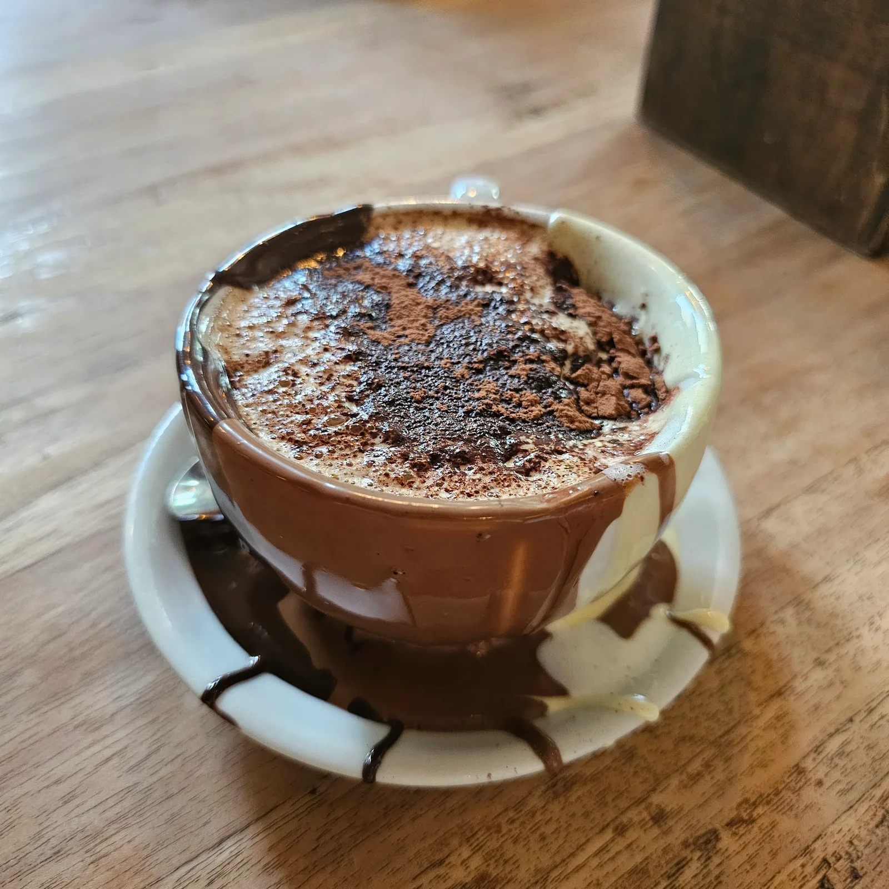
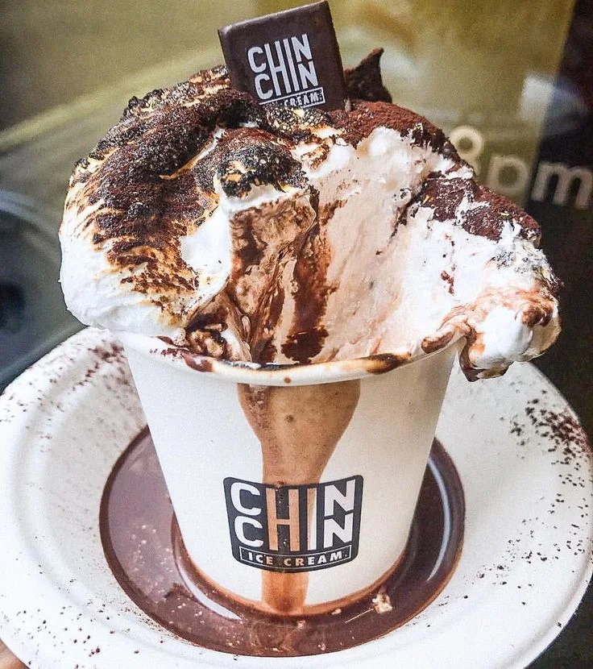
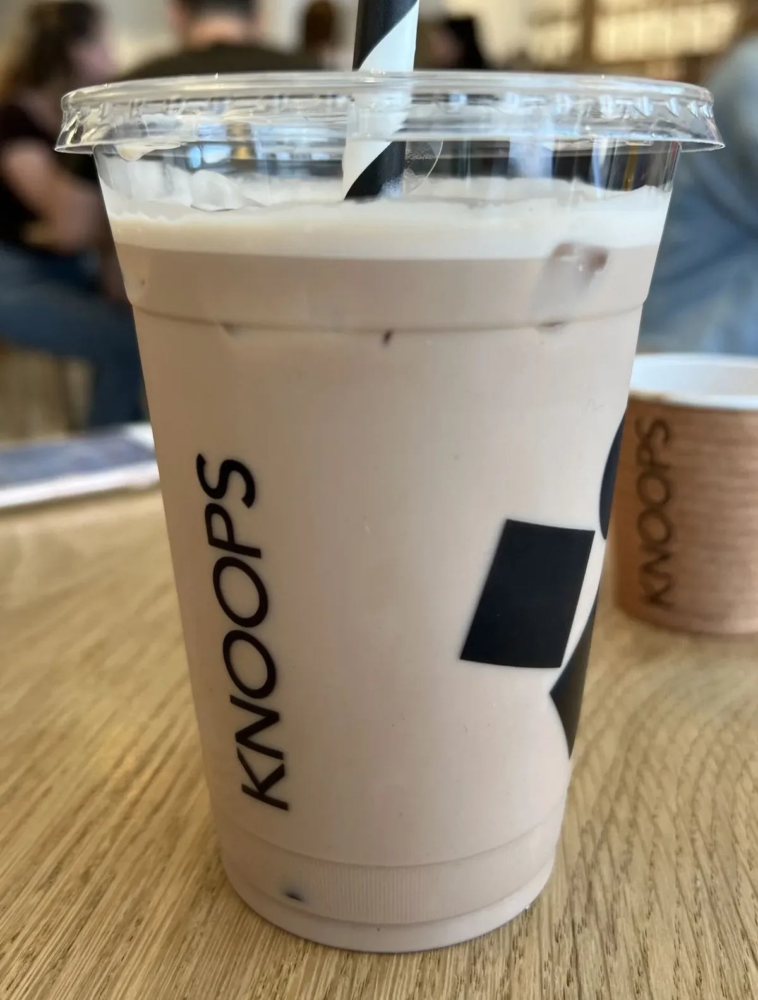

**London's best hot chocolate is not a drink you sip.** At the top of this list it is closer to melted ganache in a cup, thick enough that the spoon is doing real work, and at £4 to £6 it is one of the few things in central London that has barely moved in price.

This page is not our opinion. Every venue is ranked by how many independent lists, blogs and video reviews name it.

> 📊 **The evidence behind this guide.**
> Nothing here rests on one visit. This pass reads **12 sources carrying 67 citations** across **39 named venues** — the editorial mastheads (Time Out, The Infatuation), the independent blogs (Mostly Food and Travel, Clumsy Girl Travels, DesignMyNight) and the year's London hot chocolate videos. **Eight venues are named by two or more independent sources.**
> *Evidence rebuilt 7 September 2026 · [How we rank →](/how-we-rank/)*

> ⏱️ **When to go.**
> None of these take bookings — they are counters and shops rather than restaurants, so turning up is the only way in. Two things decide whether that works: **Andrea's opens at weekends only**, and **Dark Sugars, Chin Chin and Italian Bear all queue at weekends**. Go on a weekday afternoon and you walk straight in.

---

## The winners

### Italian Bear Chocolate

*£ · Carnaby · 4 min from Oxford Circus · Cited by 9 sources · [italianbearchocolate.com](https://www.italianbearchocolate.com/)*

*The chocolate is not only in the cup — it is painted round the inside and left to run down the outside. This is what "overflowing" means here.*

**41 Broadwick Street, W1F 9QL.** The thick Italian style, poured in three layers so the cup arrives striped, and dense enough that it behaves more like warm ganache than a drink. From **£4.90**. One reviewer's description — "poured triple-layered and overflowing" — is the whole proposition.

It is a narrow shop with a handful of stools rather than a café, so most people take the cup out onto Broadwick Street and drink it standing up. **No booking; weekday afternoons are calm, and Saturdays queue onto the pavement.**

> 💡 **This is the old Said dal 1923 site.** Said had a near-identical reputation for spoon-thick chocolate at the same address, and several lists still name it. Italian Bear took the premises over, which is why the two names resolve to one shop — and why merging them makes this the most-cited hot chocolate in London.

---

## Also strongly backed

### Dark Sugars Cocoa House

*£ · Brick Lane · 8 min from Shoreditch High Street · Cited by 8 sources · [darksugars.co.uk](http://www.darksugars.co.uk/)*

**141 Brick Lane, E1 6SB.** Chocolate is grated over frothed milk in front of you and the cup arrives buried under shavings — three kinds, piled high enough that the first inch is solid. The shop makes 72 of its own chocolates and works with Ghanaian cocoa, and Time Out's line is that you smell it before you see it.

Standing room only, with truffles heaped in mango-leaf bowls along the counter. **It is the busiest place on this page at weekends**, when Brick Lane's markets run.

### Chin Chin Dessert Club

*£ · Soho · 3 min from Tottenham Court Road · Cited by 6 sources · [chinchinicecream.com](https://www.chinchinicecream.com/)*

*Ten seconds under a blowtorch is the whole show. The marshmallow is bigger than the cup and does not stay upright for long.*

**54 Greek Street, W1D 3DS.** A paper cup topped with a handmade marshmallow the size of a fist, blowtorched at the counter until it chars and slumps. **£4.95**, with a vegan version done in raspberry and apricot. The same kitchen makes nitrogen ice cream, which is what the shop is better known for.

Tiny, loud and built for a queue rather than a sit-down. **The blowtorching is the visit** — it happens in front of you and takes about ten seconds, which is why this is the one to bring children to.

### Knoops

*£ · Covent Garden · 3 min from Leicester Square · Cited by 4 sources · [knoops.com](https://knoops.com/uk)*

*The same percentages are sold iced, which is the version to know about in summer — order it exactly the way you would the hot one.*

**2 New Row, WC2N 4LH.** You order by number, not by flavour: its own menu runs **nine cocoa percentages — 28, 34, 38, 43, 54, 65, 70, 80 and 100%** — and the same drink tastes like four different things across that range. From **£4**. Ask for 70% if you have no idea; 100% is genuinely bitter and not a beginner's cup.

Small, bright and counter-led, with a few seats. **Five London stores** — Chelsea, Covent Garden, Kensington, Knightsbridge and Notting Hill — so this is the one you can reach from most of west and central London.

### Mamasons Dirty Ice Cream

*£ · Chinatown · 2 min from Leicester Square · Cited by 3 sources*

**32 Newport Court, WC2H 7PQ.** The ube hot cocoa, **£5**, made with purple yam so it arrives a startling violet — the only drink on this page that is not brown. Filipino desserts are the main business; the cocoa is the winter version of the ice cream.

A narrow Chinatown shopfront with almost nowhere to sit, and a queue on Friday and Saturday nights that is mostly there for the ice cream. **Late opening is the reason to know about it** — when the Soho counters have shut, this one has not, which makes it the answer after a show or a late dinner in Chinatown.

### Andrea's Hot Chocolate

*£ · Columbia Road · 10 min from Hoxton · Cited by 2 sources · [andreacacao.com](http://andreacacao.com/)*

**The Courtyard, Ezra Street, E2 7RH.** A single-origin specialist tucked behind Columbia Road, and the most serious cup on this page about the cocoa itself rather than what is piled on top.

**It opens weekends only — closed Monday to Friday.** That is not a quirk, it is the whole plan: Ezra Street sits beside the Columbia Road flower market, which runs on Sundays, and the shop trades to that crowd. Turn up midweek and you will find it shut.

### Melt Chocolates

*££ · Notting Hill · 6 min from Notting Hill Gate · Cited by 2 sources · [meltchocolates.com](https://www.meltchocolates.com/)*

**59 Ledbury Road, W11 2AA.** A working chocolate kitchen with the counter at the front, so the drink is made from the same chocolate being tempered a few feet behind it. Boxed chocolates, slabs and hampers are the main business — the shop sorts its gifting by price, from under £25 upwards — and the hot chocolate is what you drink while choosing them.

**No booking and no queue.** That makes it the calmest room on this page by some distance, and the one to choose if you want to sit down with the cup rather than carry it down the street.

### Badiani

*£ · Covent Garden · 4 min from Covent Garden · Cited by 2 sources · [badiani1932.com](http://www.badiani1932.com/)*

**2 Mercer Walk, WC2H 9QP.** A Florentine gelateria trading since 1932, whose hot chocolate comes out thick and dessert-like — no surprise from a business built on gelato rather than on drinks. The cocoa is the cold-weather line here, not the reason the counter is busy in July.

**No booking, and it is a counter rather than a room**, so most people take the cup out into Mercer Walk. Worth knowing if you are already in Covent Garden; not worth a journey when Italian Bear is fifteen minutes away.

> ⚠️ **Sources name Badiani as a brand, not a branch.** There are several London sites and this is the Covent Garden one. Check which you are heading for.

---

Powered by <a target="_blank" rel="sponsored" href="https://www.getyourguide.com/london-l57/">GetYourGuide</a>

## What the widely-shared list gets wrong

The page that ranks highest for this search on most days is Time Out's, and **it is dated 28 October 2022**. Checking its sixteen names against Google's business records in September 2026 produced the most useful finding of this pass:

| Of Time Out's 13 unique names | |
| --- | --- |
| **Closed permanently** | Paul A Young Fine Chocolates, Ruby Violet, DeRosier |
| **No longer findable as a chocolate business** | Rabot 1745, Intermission, Cafe La Divina, Après Food Co |
| **Still trading** | Chin Chin, Dark Sugars, Italian Bear, Melange, Farm Girl, The Haberdashery, Kapihan, The Parlour at Fortnum & Mason |

**Seven of thirteen are gone or unverifiable in four years.** Paul A Young was the best-known chocolatier on it. Rabot 1745 — Hotel Chocolat's Borough Market café — now resolves only to the company's beauty line in White City, which suggests the café has gone.

To be precise about the four in the middle row: a records search matching a different business is not proof the original closed. Those four are **unverified**, not confirmed dead. But none of them can currently be found as a place to drink chocolate, and any list still recommending them has not checked.

The corroboration test is what protects against this. Every venue in the section above is named by at least two independent sources **and** confirmed trading — which is why Time Out's list and The Infatuation's current one share not a single name between them.

---

## Cheapest

Everything on this page except Melt sits in the **£4 to £6** band, which makes price a poor way to choose. The genuinely cheap end:

- 💷 **[Knoops](#knoops)** — from **£4**, and the 28% is the cheapest way to find out whether you even like the strong stuff
- 💷 **[Italian Bear Chocolate](#italian-bear-chocolate)** — from **£4.90** for the thickest cup in London
- 💷 **[Chin Chin Dessert Club](#chin-chin-dessert-club)** — **£4.95** including the blowtorched marshmallow

The one to know about rather than book: **The Chocolate Cocktail Club** runs bottomless chocolate cocktails at **£32 a head**. It is an evening out, not a hot chocolate.

---

## By style

**Thick Italian** — [Italian Bear Chocolate](#italian-bear-chocolate). Melted rather than mixed, eaten with a spoon.

**Classic, chocolate-forward** — [Dark Sugars](#dark-sugars-cocoa-house) and [Melt](#melt-chocolates). Real chocolate into hot milk, no theatre.

**Single origin and dark** — [Andrea's](#andreas-hot-chocolate) for the cocoa itself, [Knoops](#knoops) if you want to pick the percentage yourself.

**Topped and photogenic** — [Chin Chin](#chin-chin-dessert-club) for the blowtorched marshmallow, [Mamasons](#mamasons-dirty-ice-cream) for the purple ube.

---

Powered by <a target="_blank" rel="sponsored" href="https://www.getyourguide.com/london-l57/">GetYourGuide</a>

## Booking essentials

**Nothing on this page takes bookings.** They are shops and counters, and the whole category works on walking in. Three things decide the trip instead:

- **Andrea's is weekends only.** Closed Monday to Friday.
- **Weekend queues** at Dark Sugars, Chin Chin and Italian Bear. A weekday afternoon is a different experience entirely.
- **Most of these have almost nowhere to sit.** If you want a table rather than a paper cup, Melt in Notting Hill is the one.

---

## Continue planning your London trip

- 🍰 **[Afternoon tea in London](/articles/best-afternoon-tea-london/)** — every room, every price
- 🍦 **[Best ice cream in London](/articles/best-ice-cream-london/)** — several of these shops appear on both
- ☕ **[Best coffee in London](/articles/best-coffee-london/)** — the other winter drink
- 🎄 **[Christmas in London](/articles/christmas-in-london/)** — markets, lights and what is worth queueing for

*Prices, addresses and trading status checked against each venue's own website and Google's business records on 7 September 2026. Source counts are derived from data/consensus/hot-chocolate.json, not typed by hand.*
