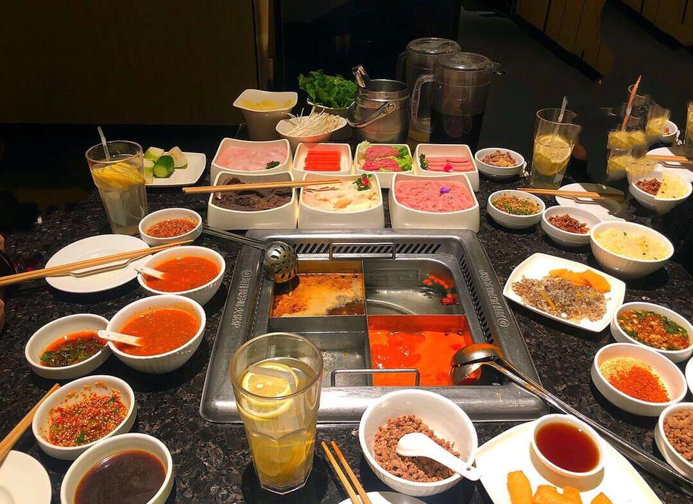

Hot pot is the only restaurant format where the kitchen hands you the raw ingredients and lets you get on with it. A pot of broth arrives at the table already boiling, plates of thinly sliced meat and vegetables arrive beside it, and for the next two hours you cook your own dinner piece by piece.

**It is a format rather than a cuisine**, and that is the thing most guides get wrong. A Chongqing pot and a Beijing copper pot have almost nothing in common: one is a slab of beef tallow melting into a kilo of dried chillies, the other is clear water in a charcoal chimney with lamb sliced thin enough to see through. Sending someone who wants the second to the first is not a small mistake.

> 📌 **The short version**
> **Haidilao** is named by more independent sources than any other hot pot in London — seven of seventeen — and it is the right first one, because the chain does the hand-holding. **Chilli Cool** and **Shu Xiang Ge** are the most widely named independents at five each. For clear-broth lamb rather than chilli, go to a **Beijing copper pot**. For one person and under £15, go to a **malatang** counter and fill a basket. Budget £25 to £40 a head, and remember the broth is charged separately.

> 📊 **The evidence behind this guide**
> Nothing here rests on one visit. This pass reads **17 sources carrying 86 citations** across **42 named venues** — three editorial titles (The Infatuation, DesignMyNight and Broadsheet), seven independent blogs and Chinese-language diaspora guides, and seven London hot pot videos counted per creator. **20 restaurants are named by two or more independent sources.**
> **The known weakness in this topic:** no judged award exists for hot pot anywhere — not a Michelin category, not a Good Food Guide list, nothing — so **not one venue on this page carries a dated ranking**, and the guide does not pretend to rank them. Masthead coverage is unusually thin too: nine publication guides were checked for a London hot pot list and none exists. That leaves the weight with blogs, Chinese-language guides and video, which is also why this page reaches Poplar, Rotherhithe and the Isle of Dogs when the English-language lists stop at Zone 1. Reddit could not be read from this environment, so the argue-about-it tier is missing entirely.
> *Evidence rebuilt 3 September 2026 · [How we rank →](/how-we-rank/)*

> ⏱️ **How far ahead to book**
> **A few days, and always at weekends:** Haidilao, Shu Xiang Ge, Da Long Yi, Happy Lamb, Dragon Inn Club, Niu Hot Pot. **Bookable but rarely needed:** Super Three, Han Restaurant, Mailinda, Shan Shui Jian, Water House, Laoma, Simmer Huang, Muyang. **Walk in:** the malatang counters — Mr Wang, Yangguofu, Pot Pot, Mealtime, Mao Master. Haidilao's own booking page says some tables are always held back for walk-ins, so a queue is not a closed door.

## How ordering actually works

This is the part nobody explains, and it is why a first hot pot can feel like an exam.

**First, the broth.** It is a separate line on the bill from everything you put in it, which surprises people, and it is the decision that shapes the meal. Most restaurants will split the pot — a yin-and-yang divider, or a nine-grid tray — so a table can run one spicy side and one mild. Standard mild bases are tomato, mushroom, chicken bone and pork bone; the spicy one is usually beef tallow with dried chillies and Sichuan peppercorn, and it is numbing as much as it is hot.

**Then the ingredients**, ordered by the plate. Thinly sliced beef and lamb, tofu in several forms, leafy greens, mushrooms, lotus root, potato, noodles, and — if you want the full menu — tripe, ox aorta, duck intestine, pork brain and duck blood. Order less than you think. You can keep adding all night, and everybody over-orders on the first plate.

**Then the sauce bar.** A counter of sesame paste, minced garlic, coriander, spring onion, chilli oil, black vinegar, soy and a dozen other things, and you build your own dip. Most places print recipe cards; some charge a couple of pounds for access to the counter and some fold it into the cover. Sesame paste, garlic, coriander and a splash of soy is a reliable first attempt.

**Then you cook.** Wait for the broth to return to a rolling boil. You get two sets of chopsticks — one for raw, one for eating — and a slotted ladle for fishing things out. Do not tip everything in at once: the pot stops boiling and nothing cooks properly.

| What goes in | How long it needs |
| --- | --- |
| Thinly sliced beef or lamb | Under 30 seconds — hold it with chopsticks and swish until the colour turns |
| Leafy greens and tofu skin | Under a minute |
| Mushrooms, lotus root, potato | 3–5 minutes |
| Meatballs, prawn paste, seafood | 3–5 minutes, sometimes longer |
| Noodles | Last, once the broth has taken on everything else |

The broth gets better as the meal goes on, because everything you have cooked has flavoured it. Save the noodles for the end and drink some of the soup off a clear base before you leave — that is what a Chaoshan or Cantonese pot is actually for.

**What it costs.** Two figures move independently: the broth, typically a few pounds and more for a split pot or a luxury base, and the ingredients, priced by the plate. Most London hot pot restaurants land between £20 and £40 a head before drinks, with the Chinatown and Pimlico rooms above that and the buffets below. A table of four ordering sensibly at a mid-range Sichuan pot is a £120 to £160 dinner. The buffets and the all-you-can-eat rooms cap that — Leong's Legend in Chinatown runs around £25 a head — and a single-bowl malatang will feed one person for well under £15.

## Where they are

  

    Map of London's hot pot restaurants
  

  

    
Loading the interactive map…

  

  

    <i class="restaurant-map-key restaurant-map-key--editorial" aria-hidden="true"></i> Named in this guide
  

  <noscript>
    
The interactive map requires JavaScript. Every entry below lists its area.

  </noscript>

| If you are near… | Where to go |
| --- | --- |
| **Chinatown and Leicester Square** | Haidilao, Shu Xiang Ge, Leong's Legend, Yangguofu Malatang, Real Beijing, Nan Hotpot, Pot Pot Malatang, Xiong Qi |
| **Holborn, Bloomsbury and King's Cross** | Happy Lamb, Shujie Hotpot, Chilli Cool, Laoma, Mao Master |
| **Fitzrovia** | Da Long Yi, Teo Hot Pot, Ning's Fresh Beef Hotpot, Mealtime Malatang |
| **Aldgate and Spitalfields** | Hotto Potto, Mr Wang Hot Pot, Niu Hot Pot |
| **Poplar, Limehouse and the Isle of Dogs** | Super Three, Han Restaurant, Mailinda, Shan Shui Jian, Simmer Huang |
| **Further out** | Tian Fu and Muyang (Shepherd's Bush), Crystal China (Bermondsey), Water House (Rotherhithe), Dragon Inn Club (Pimlico), Big Brother (Bayswater), Little Sichuan (Swiss Cottage), Shu La La (Holloway) |

**Price guide:** **£** under £20 a head · **££** £20–£40 · **£££** £40–£60.

---

## The most-named hot pots in London

There is no award to win here, so this is not a ranking — it is agreement. These are the restaurants that the most independent sources, across the most different kinds of source, put their name to.

### Haidilao, Leicester Square

*£££ · Leicester Square · Cited by 7 sources · book a few days ahead*

*The sauce counter is the part people underestimate — the bowls around the pot are all built from it, and they are included.*

**The most-cited hot pot in London**, named by seven of the seventeen sources read for this page, and the one to start with if you have never done this. Sichuan broths — mala, tomato, mushroom, pork bone — with wagyu slices, prawn paste, tripe and duck blood if you want it, and a noodle order that arrives as a performance, one long strand stretched and whipped at the table.

What you are actually paying for is the scaffolding. On arrival you get an apron, a hair tie and a fabric bag so your coat does not come out smelling of chilli oil; there is a tablet menu with pictures, a large sauce counter with printed recipes, and free snacks, board games and manicures for anyone waiting.

**You do not have to stand in the queue.** Tables are always held back for walk-ins, and when you put your name down the staff take your phone number and text you when the table is ready.

**There are two London branches, and the second one is the tip.** The original is at the Trocadero off Piccadilly Circus; the other is **inside The O2**, and it is materially quieter except on arena nights.

### Happy Lamb Hot Pot, Holborn

*££ · Holborn · Cited by 6 sources · book a few days ahead*

Mongolian rather than Sichuan, and the clearest demonstration in central London that hot pot is not synonymous with chilli. The house broth is a clear herbal bone stock simmered for six hours with goji berries, jujubes and ginseng, and the lamb is sliced thin enough to curl. The Mongolian principle is that a good broth should not need a dipping sauce, and this is the London restaurant that best makes that argument.

It was founded by the original team behind Little Sheep, which is why the older Chinese-language guides treat it with more respect than a chain usually gets — it came first in a UK-wide readers' poll run by the diaspora site Red Scarf in 2023. Two London branches, Holborn and Bayswater. Loud, bright and full of students.

### Chilli Cool, King's Cross

*££ · King's Cross · Cited by 5 sources · book a few days ahead*

**Named by more sources than any other independent**, and by every Chinese-language guide in this set — which, on this topic, is the endorsement that counts. Two shopfronts on the same Bloomsbury street: stir-fries on one side, a separate hot pot room on the other, so you can eat here twice and have two different dinners.

The thing to order beyond the pot is boboji — meat and vegetables threaded on skewers, cooked in mala oil and priced by the stick, which is the cheapest way to eat properly here. It is a plain, functional room with no design to speak of, and it is the only restaurant in this entire set whose address has not changed in the eight years the sources cover.

### Shu Xiang Ge, Chinatown

*£££ · Chinatown · Cited by 5 sources · book a few days ahead*

The nine-grid pot, or jiugongge: one broth divided into nine compartments, so tripe that wants thirty seconds and beef aorta that wants five minutes each cook in the grid that suits them. Almost nobody else in London serves it, and it is worth ordering for the mechanics alone. A yuanyang split pot is the way out for anyone at the table who cannot take the mala.

It claims to be London's first dedicated Sichuan hot pot restaurant, and the older sources treat it as the original. It has moved from New Oxford Street to Gerrard Street since then, and the room is on the basic side — one guide is blunt that the service can be hit and miss while the flavours are not.

### Tian Fu, Shepherd's Bush

*££ · Shepherd's Bush · Cited by 5 sources · book a few days ahead*

The West London Sichuanese that the guides keep sending people to, and the one where the offal is taken seriously rather than tolerated: intestine, tripe, blood tofu and ox tongue, alongside the more familiar lamb and beef. Buffet or à la carte, which is unusual — most places make you choose a format when you book.

The stir-fry menu is rated as highly as the pot by people who go regularly, so this is a reasonable place to bring someone who does not want to cook their own dinner. Bright, busy and firmly a neighbourhood restaurant rather than a night out.

### Hotto Potto, Aldgate

*££ · Aldgate · Cited by 4 sources · book a few days ahead*

A fiery beef tallow broth, a charcoal barbecue list running alongside the pot, and — the single most useful thing a beginner can be handed — a menu that prints a recommended cooking time against each ingredient. There are mixed platters for anyone frozen by the length of the order sheet.

It runs a dedicated halal menu, which is rare in a format built on pork, and a **£20 solo hot pot set** listed on its own site: your own broth, meat, vegetables and rice or noodles for one person. Almost nowhere else in London makes eating hot pot alone straightforward. There are karaoke rooms downstairs if the evening goes that way.

### Da Long Yi, Fitzrovia

*£££ · Fitzrovia · Cited by 3 sources · book a few days ahead*

The signature broth is beef tallow, dried chillies, Sichuan peppercorns and more than twenty aromatics, and the reviewers who describe it all say the same thing — that the heat builds in layers rather than arriving all at once. Order it as a dual pot with the tomato and fried egg base on the other side and you get both readings of the format in one sitting.

The dish to order is the Volcano Beef: marbled beef built into a cone over crushed ice with chilli oil poured down the middle, which is as theatrical as it sounds and cooks in seconds. Ordering is by tablet, the sauce station has printed recipe cards, and the room off Berners Street is warmer and softer-lit than most.

### Super Three, Poplar

*££ · Poplar · Cited by 3 sources · book a few days ahead*

All-you-can-eat Sichuan hot pot on a spicy butter base with a Korean charcoal grill built into the same table — so the group that cannot agree between hot pot and barbecue does not have to. You grill while the pot comes up to heat, then swap.

It has been on East India Dock Road for years and is one of two long-standing hot pot restaurants a few doors apart; Han Restaurant is the other. Neither is on any English-language list, which tells you something about where the published record stops. This is the value end of proper Sichuan cooking in London, and the Sichuan à la carte menu is as well regarded as the pot.

### Han Restaurant, Poplar

*££ · Poplar · Cited by 2 sources · book a few days ahead*

The beef tallow arrives moulded into the shape of a bear and melts into the broth in front of you, which is the reason half the internet knows this restaurant. The reason to actually come is the Hainanese coconut chicken pot — sweet, clear and gentle, and the best answer in East London for anyone who wants the format without any heat at all.

Crab pot, barbecue, Dongbei stews and Sichuan stir-fries fill out a long menu. It sits two doors from Super Three, so if one has a queue the other will not.

### Shujie Hotpot, Holborn

*££ · Holborn · Cited by 2 sources · book a few days ahead*

The pot its regulars call the most Sichuanese in London, and the one where duck intestine, pork brain and beef aorta are the point rather than a dare. Both sources naming it are Chinese-language, and both make the same recommendation: order the red sugar ciba — glutinous rice cakes fried and rolled in brown sugar — to finish.

It came third in Red Scarf's 2023 UK readers' poll once the list is narrowed to London. The room is plain and the extraction is not great; the standing advice from people who go often is to wear clothes you do not mind smelling of chilli oil afterwards.

### Mr Wang Hot Pot, Aldgate

*£ · Aldgate · Cited by 2 sources · walk in*

Malatang rather than shared hot pot, and the easiest first solo meal in this whole guide. You take a basket to a chilled counter and load it with what you want — beef rolls, tripe, lotus root, Fuzhou fish balls, frozen tofu, sweet potato vermicelli, greens — then it is weighed, priced and cooked into one bowl for you. No sharing, no negotiating over the spice level.

The rule of thumb published by Broadsheet is 400 to 500 grams of ingredients per person, which most first-timers overshoot. The milky beef bone broth is the one to have; it absorbs the sauce better than the clear bases. Build the dip from Chinkiang black vinegar, light soy, sesame paste, chilli powder, minced garlic and a lot of coriander.

### Yangguofu Malatang, Chinatown

*£ · Chinatown · Cited by 2 sources · walk in*

The other malatang worth knowing, in the old Wing Wing site on Charing Cross Road, and the bigger operation — the group has more than seven thousand restaurants worldwide and this was its first central London site, after years of being a Hammersmith-only proposition in Britain.

There are over a hundred things to put in the basket: sliced meat, fish, tofu in every form, fresh ramen noodles, mini youtiao, pak choi and gai lan. The herbal beef bone broth is creamy, lightly spiced and not oily, and a chef quoted by Broadsheet says she does not bother with the sauce station at all when she orders it. Two floors, and quicker than it looks at lunchtime.

---

## By style

The regional traditions are where this format gets interesting, and they are genuinely different meals.

### Real Beijing, Chinatown

*££ · Chinatown · Cited by 1 source · book a few days ahead*

The northern format, and the one that surprises people who think hot pot means chilli. A charcoal-fired copper pot with a chimney up the middle sits in the centre of the table, the broth is water with preserved cabbage in it, and the lamb is sliced so thin it cooks in the time it takes to count to ten. You dip it in sesame sauce, not chilli oil.

This is shuan yang rou — instant-boiled lamb — and it is what most of northern China means by hot pot. The charcoal adds a faint smokiness and holds the broth at a steady simmer, so it never goes off the boil the way an induction pot does. The clearest example in Chinatown of a tradition with nothing to do with Sichuan.

### Mailinda, Isle of Dogs

*££ · Isle of Dogs · Cited by 2 sources · book a few days ahead*

The other copper pot in this guide, and the cheaper one. Old Beijing pot on one side of the order and charcoal skewers on the other, so you eat lamb from the broth and lamb from the grill in the same sitting, plus chive boxes and guo bao rou — pork in a sweet-sour batter — from the northern menu.

It is a neighbourhood canteen rather than a destination, and both sources that name it are Chinese-language guides describing it as the local. Worth the trip only if you are already east, but genuinely good if you are.

### Niu Hot Pot, Spitalfields

*££ · Spitalfields · Cited by 1 source · book a few days ahead*

Chaoshan beef, which is the third great hot pot tradition and the one where the broth deliberately stays out of the way. The menu is organised by cut rather than by dish — sirloin, short rib, rump, brisket, hand-cut omasum, ox aorta, hand-made beef balls — and each one has its own cooking time measured in seconds. A mala pot would drown exactly what you are paying for, so people order the beef bone clear soup or the spring water base.

There is a congee base served with two live crabs if you want the Cantonese end of things, a halal section on the ordering sheet, charcoal skewers, and a private karaoke room for afterwards. Teo Hot Pot in Fitzrovia does the same Chaoshan thing at a higher price.

### Shan Shui Jian, Limehouse

*££ · Limehouse · Cited by 1 source · book a few days ahead*

Yang xie zi — lamb spine hot pot, and the only place in this guide that does it. The spines arrive stewed to the point of collapse and you eat them with your hands and a pair of gloves, working the meat off the bone; then the pot is topped up with broth and used to cook everything else, which by that stage tastes of an afternoon of lamb.

It is a branch of a well-known Chinese chain, with the owner stewing to his own recipe, and it does the rest of the Dongbei repertoire alongside — grilled fish, chicken stewed with mushrooms. Not to be confused with Shan Shui Social, which is a different restaurant entirely.

### Simmer Huang, Canary Wharf

*££ · Canary Wharf · Cited by 1 source · book a few days ahead*

Not quite hot pot, and that is why it is here. A simmer pot arrives with the ingredients already stacked in the pan, cooking down dry rather than swimming — and once you have eaten the top layers, the staff pour broth in and it becomes a hot pot for the second half of the meal. Two dinners from one pan.

It is halal throughout, on a menu that would otherwise be full of pork, which makes it one of the few places in London where a mixed group can eat this format without editing the order. Baltimore Wharf, a walk from Canary Wharf proper.

### Dragon Inn Club, Pimlico

*£££ · Pimlico · Cited by 2 sources · book a few days ahead*

The Cantonese end of the format and the most expensive broths in this guide: a fish maw and chicken soup base alongside coconut chicken, beef tallow red soup and tomato, served from a pot with a dragon's head on it. The point of a fish maw broth is that you drink it — it is the dish, and the things you cook in it are seasoning.

It draws a mix of students and office tables from around Victoria, and it is the one place here you could take someone who thinks of hot pot as a cheap meal and change their mind. The Sichuan side of the menu is good too, if less remarkable.

### Muyang Hot Pot & BBQ, Shepherd's Bush

*££ · Shepherd's Bush · Cited by 2 sources · book a few days ahead*

One pot per person rather than one for the table — the mini hot pot, which it claims to have brought to London first. If you want your own broth and your own spice level without giving up the shared table, this is the format that solves it.

The hand-made fish balls are the thing to order, with black fungus, quail eggs and rice cake, and the menu runs on into pig intestine, trotters and bamboo for anyone who wants it. Barbecue alongside. It is a short walk from Tian Fu, so Shepherd's Bush is quietly the best hot pot neighbourhood in West London.

### Crystal China, Bermondsey

*££ · Bermondsey · Cited by 2 sources · book a few days ahead*

Dry hot pot, which is not hot pot at all in the broth sense: the ingredients are stir-fried together in mala oil and arrive already cooked, so there is no simmering, no waiting and no cooking times to learn. Think of it as the mala flavour without the ritual.

Useful to know about when you want the taste on a weeknight and cannot face a two-hour dinner, and useful for a mixed group where somebody is squeamish about raw meat on the table. On Tower Bridge Road, and named by Strictly Dumpling on a Chinatown food tour that then walked all the way here for it.

### Leong's Legend, Chinatown

*££ · Chinatown · Cited by 2 sources · book a few days ahead*

A Taiwanese snack house hung with Water Margin murals, where the all-you-can-eat hot pot runs around **£25 a head** — among the cheapest sit-down pots in Chinatown, and the reason it has been in the Chinese-language guides for the better part of a decade.

The Taiwanese menu is the other half of the reason to come: xiao long bao, braised pork rice, oyster omelette. It is small, it is busy, and the hot pot is a simpler proposition than the Sichuan rooms up the street rather than a worse one.

---

## Cheapest, and the buffets

The buffet rooms are where London's students eat, and none of them appear on an English-language list.

- **Laoma** — King's Cross Road. All-you-can-eat hot pot, free soft drinks and no service charge, which is close to unheard of. Mostly students from the surrounding streets. *£ · Cited by 1 source*
- **Water House Restaurant** — Albion Street, Rotherhithe. Buffet hot pot with broths most places do not offer: old duck, old chicken and mutton alongside the usual mala and clear. Chuanchuan skewers and a Hunanese menu too. *££ · Cited by 1 source*
- **Big Brother Hot Pot** — Bishop's Bridge Road, Bayswater. One of London's few double buffets: all-you-can-eat hot pot and all-you-can-eat grilled meat at the same table, on a Mongolian base. *££ · Cited by 1 source*
- **Pot Pot Malatang** — Newport Court, Chinatown. A basket, a chilled counter and a set of scales. The cheapest way into the format for one person in the centre of town. *£ · Cited by 1 source*
- **Little Sichuan** — Northways Parade, Swiss Cottage. A Finchley Road parade Sichuanese that customers from Sichuan vouch for; order the mala base. *££ · Cited by 2 sources*

## For one person

Hot pot is built for groups, and eating it alone is harder than it should be. Four options, in order of how easy they make it.

- **Mr Wang Hot Pot**, Aldgate, and **Yangguofu Malatang**, Chinatown — full entries above. Pay by weight, one bowl, no explaining yourself.
- **Mao Master Hotpot Noodle**, by Russell Square — maocai rather than malatang, which is the same one-bowl idea with a Sichuan accent. Classic spicy, chicken or fresh tomato broths; lotus root, Chinese yam, enoki, tofu puffs and bean curd rolls hold their texture best. *£ · Cited by 1 source*
- **Mealtime Malatang**, Fitzrovia — sliced lamb and beef, Chinese spam, tofu skin, potato, oyster mushrooms, kelp and greens, on a mala base a Gansu-born food writer says is the only base worth having. *£ · Cited by 1 source*
- **Hotto Potto**, Aldgate — full entry above. The £20 solo set is the only proper sit-down single-portion hot pot found anywhere in this research.

## Also named, and worth knowing

These are named by one source each and have no street address in any of them, so they are not on the map above. They fill real gaps.

- **Nan Hotpot**, Chinatown — Chongqing style, a half-and-half mushroom and tomato broth for people who want the format without the heat, and the latest kitchen in Chinatown. *££ · Cited by 2 sources*
- **Teo Hot Pot**, Fitzrovia — Chaoshan beef at the smart end: hand-cut cuts cooked seconds at a time in a light broth. *£££ · Cited by 1 source*
- **Ning's Fresh Beef Hotpot**, Fitzrovia — grass-fed beef in a delicate Cantonese-Teochew soup base, where the broth is a poaching liquid rather than a sauce. *££ · Cited by 1 source*
- **Shu La La**, Holloway — dry spicy hot pot in scarlet oil, heavy on the peppercorn. The numbing end rather than the soupy end. *££ · Cited by 1 source*
- **Xiong Qi Hot Pot**, Leicester Square — a group option a minute from the square, with suggested cooking times posted on the wall and staff who will tell a beginner what goes in when. Sixth in Red Scarf's 2023 UK poll. *££ · Cited by 1 source*
- **Feng Wei Shi Tang** — copper pot upstairs, the northern repertoire downstairs. Red Scarf vouches for it as genuine instant-boiled lamb but gives only "two London branches" and no address, so it is listed here rather than mapped. *££ · Cited by 1 source*

---

## The chains, honestly

Five of the best-known names here — Haidilao, Happy Lamb, Da Long Yi, Yangguofu and Shu Xiang Ge — are branches of large Chinese groups, and it is worth being straight about what that buys and what it does not.

**What the chains genuinely do better.** They take bookings, which most of the independents handle badly or not at all. They open late and keep opening when the independents have shut. They give you a picture menu on a tablet, printed cooking times, an apron and a bag for your coat. Their staff are trained to walk a first-timer through the order without making them feel stupid. If you have never eaten hot pot and you are bringing four people who have not either, a chain removes every way the evening can go wrong.

**Where the independents win.** Specificity and price. No chain in London serves a charcoal copper pot, a lamb spine, a Chaoshan menu sorted by cut, or a Hainanese coconut chicken broth — those are all single-site restaurants, and they are the meals worth travelling for. The independents are also materially cheaper: the Poplar and Isle of Dogs rooms will feed four for what two spend in Chinatown.

**One thing to know about the published lists.** DesignMyNight's London hot pot guide still recommends Sichuan Folk on Brick Lane, which shut in 2025. Its old web domain now serves unrelated content and should not be visited. This is worth knowing generally: hot pot lists are updated rarely, and a recent-looking date at the top of a page is not evidence a restaurant is open.

## What to know

* **The broth is charged separately** from everything you cook in it. Two people ordering a split pot are paying for two broths.
* **Order less than you think** on the first round. You can add all night; nobody can un-order a plate.
* **Thin meat takes under 30 seconds.** Hold it with chopsticks and swish rather than dropping it in and hunting for it later.
* **Two sets of chopsticks** — one for raw, one for eating. It is not fussiness.
* **Your clothes will smell of it.** The better-ventilated rooms are the chains; the independents mostly are not.
* **Not all hot pot is spicy.** Beijing copper pot, Mongolian lamb and Chaoshan beef are all clear-broth traditions.
* **Halal is available** at Hotto Potto, Niu Hot Pot and Simmer Huang, but assume nothing elsewhere — pork and pork blood are standard.

---

## Continue planning your London trip

- 🥟 **[Best Chinese and East Asian Restaurants](/articles/best-chinese-east-asian-restaurants-london/)**
- 🥢 **[Best Dim Sum in London](/articles/best-dim-sum-london/)**
- 🇰🇷 **[Best Korean Restaurants in London](/articles/best-korean-restaurants-london/)**
- 🇯🇵 **[Best Japanese Restaurants in London](/articles/best-japanese-restaurants-london/)**
- 💷 **[Cheap Eats in London](/articles/cheap-eats-london/)**
- 🏮 **[Soho Area Guide](/articles/soho-area-guide/)**
