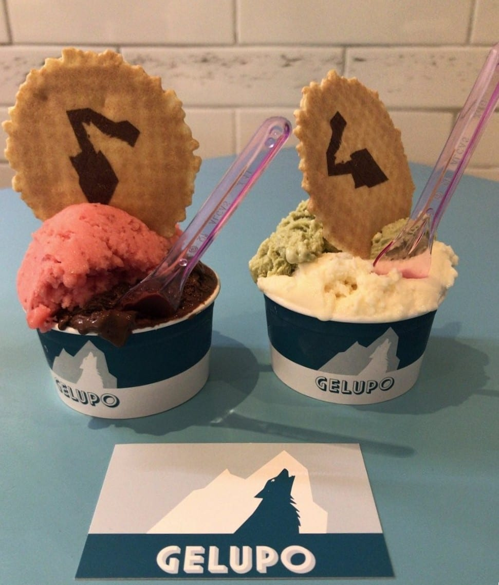

London's ice cream splits into things that have almost nothing to do with each other. There are **Italian gelaterias** run by families who have been at it for generations, a wave of **small-batch makers** doing miso caramel and fig leaf, **Filipino ube** and **Lebanese booza**, and a **vegan scene** good enough that the dairy question has stopped being interesting.

So this guide is arranged by what you are actually queuing for, because "ice cream" covers a Florentine cream custard and a black-sesame oat gelato with equal uselessness.

> 💡 **The Short Version:** **Gelupo** in Soho is the one that turns up on every list, and it is open to midnight at weekends. **Nardulli** in Clapham has the queue. **Romeo & Giulietta** in Stoke Newington is Time Out's current number one. **Badiani** for the Buontalenti and nothing else. And **Marcelo's** in Crystal Palace is the best vegan ice cream in the city, two days a week only.

> 📊 **The evidence behind this guide**
> Nothing here is ranked on one visit. This pass reads **7 sources carrying 105 citations** across **74 named shops**. **20 shops are named by two or more independent sources.**
> **Built on:** gelato, soft serve and scoop shops counted together, so the guide covers the whole field rather than one format.
> *Evidence rebuilt 30 August 2026 · [How we rank →](/how-we-rank/)*

## Where they are

| If you are near… | Where to go |
| --- | --- |
| **Soho & Covent Garden** | Gelupo, La Gelatiera, Udderlicious, Mamasons (Chinatown) |
| **Clapham** | Nardulli |
| **Stoke Newington** | Romeo & Giulietta |
| **Islington & Angel** | Udderlicious |
| **Chelsea** | Ice Cream Union |
| **South Kensington** | Oddono's |
| **Holland Park & Notting Hill** | Unico Gelato, Badiani |
| **Kentish Town & Camden** | Mamasons, Caliendo's counter |
| **Crystal Palace** | Marcelo's |
| **Marylebone** | Festok |

---

## The Italian gelaterias

### Gelupo, Soho

*7 Archer Street · open to midnight Fri–Sat* · Cited by 4 sources

The most-listed ice cream in London, attached to Jacob Kenedy's Bocca di Lupo across the road, and the one to pick if you only get one.

**Ricotta and sour cherry** is the flavour people describe years later, and the dark chocolate sorbet has its own following. There is also **Cremolato**, a lower-sugar southern Italian style that sits between a gelato and a granita and which almost nobody else in London makes.

The vegan sorbets are marked on the menu — watermelon, apricot, almond, lemon and rosemary, blood orange — which sounds like a small thing and is not, because most places make you ask.

Open to **midnight on Fridays and Saturdays**, which makes it one of the few genuinely late desserts in the West End.

*Across the road from its own restaurant, Bocca di Lupo. The ricotta and sour cherry is the one to get. Photo: [andreasivarsson](https://www.flickr.com/photos/35254833@N04/7555706866), [CC BY 2.0](https://creativecommons.org/licenses/by/2.0/).*

### Romeo & Giulietta, Stoke Newington

*137 Albion Road* · Cited by 2 sources

A Stoke Newington gelateria run by two Italians who make everything on site in small batches — the shop that north London ice cream arguments tend to end at.

**Pistachio** is the flavour to judge it on, made with Bronte pistachios rather than colouring, and the **stracciatella** is the other test. The base is a proper custard gelato rather than the whipped, over-aerated stuff, so it is denser and melts more slowly.

**£, walk-in.** Church Street, and the queue reaches the pavement on a warm evening. Closed through the coldest months in some years, so check before travelling in winter.

### Nardulli, Clapham

*29 The Pavement · busy year-round* · Cited by 4 sources

The queue that settles arguments. Four separate writers describe it independently, one noting it **stretches towards the tube station on Saturdays** — and all four also note that it moves fast.

Traditional family gelato: **pistachio** is the consensus order, with Valrhona chocolate, liquorice, fig and a proper fior di latte behind it.

The detail that matters more than the queue: it is busy **in December**. A summer queue means the weather is good. A December queue means the ice cream is good.

### Badiani 1932, twelve London shops

*Founded in Florence, 1932* · Cited by 2 sources

**Order the Buontalenti.** Cream, sugar, and essentially nothing else — four ingredients, no flavouring, named after the Renaissance architect credited with inventing it.

It is the single most specific "order this" in London gelato, and the reason a Florentine company that started in 1932 now has twelve shops here. Everything else on the counter is good; the Buontalenti is the point.

Widest footprint of any serious operator in the city, so there is usually one near you.

### Unico Gelato, Holland Park

*78 Holland Park Avenue · also St John's Wood, Gloucester Road, Bromley* · Cited by 2 sources

An Italian gelateria with a laboratory attached, importing its raw materials directly from Italian producers — the most technically serious ice cream operation in this guide.

The **pistachio** uses Bronte DOP pistachios and the **hazelnut** uses Piedmont IGP, which is the difference between a nut flavour and a nut. Made fresh daily in the room behind the counter and served from covered pozzetti rather than heaped in tubs, which keeps it at the right temperature.

**£, walk-in.** There is a second site in Victoria. Ask for a *spatola* rather than a scoop — that is how it is meant to be served.

### Oddono's, South Kensington

*14 Bute Street · six or seven branches* · Cited by 2 sources

The gelateria that has been the South Kensington standard for two decades, and the one most Londoners name first when asked.

**Gelato** made daily on the premises, with the **pistachio** and the **fior di latte** — the plain milk flavour, and the hardest to hide behind — as the two to judge it on. Fresh fruit sorbets alongside for anyone avoiding dairy.

**£, walk-in.** Several sites across London now, but the Bute Street original is the one with the queue. Open late in summer.

### La Gelatiera, Covent Garden

*New Row · also East Village and the OXO Tower* · Cited by 3 sources

A small Covent Garden gelateria making everything on site, and one of the few places in central London where the ice cream is worth crossing the road for rather than simply nearby.

The **pistachio** and the **salted caramel** are the standing orders, with a rotating list of seasonal and unusual flavours — herbs, spices and vegetables among them, which sounds like a stunt and is done well.

**£, walk-in.** Just off the piazza, and open late enough to work after a show.

---

Powered by <a target="_blank" rel="sponsored" href="https://www.getyourguide.com/london-l57/">GetYourGuide</a>

## Small-batch and award-winning

### Ice Cream Union, Chelsea

*166 Pavilion Road · factory shop in Bermondsey* · Cited by 3 sources

**Named the best in the UK by The Times in July 2025**, and described in the same piece as London's best-kept secret — which is supported by the fact that their own website does not mention the award anywhere.

Eighteen years in, making its own nut pastes, fruit juices, ripple sauces and honeycomb rather than buying them in, across fifty-plus flavours. **Banana split, cornflake, dulce de leche**, and an Aperol Spritz sorbet.

They supply Michelin-starred Trinity in Clapham and Fortnum & Mason, which is the sort of detail that tells you more than a review.

> ⚠️ **The Bermondsey factory shop opens Saturdays only, March to December** — so it is shut in January and February. The Chelsea parlour is open daily and year-round.

### Caliendo's, Kentish Town counter

*Inside Phoenicia Food Hall, 186 Kentish Town Road*

A Kentish Town counter making Neapolitan-style gelato, run by a family from Campania — small, plain and entirely focused on the product.

**Pistachio, nocciola and fior di latte** are the core, made in small batches and turned over quickly, with a short rotating list beside them. Neapolitan gelato is denser and less sweet than the northern Italian style, which is the distinction here.

**£, walk-in.** A counter rather than a parlour — there is nowhere to sit. Best in the evening when the batch is fresh.

> ⚠️ **This is not a Kentish Town parlour**, despite how it is often written up. Caliendo's is a Bedfordshire producer with a counter inside a London food hall. Go for the counter, not for a shopfront.

---

## Vegan and dairy-free

### Marcelo's, Crystal Palace

*Haynes Lane Courtyard · Saturdays and Sundays only* · Cited by 1 source

**The best vegan ice cream in London**, and the only one that turned up in every source we looked at. Entirely vegan, made on a **house oat-milk base**, from a chef couple who started after a trip to Naples.

Ninety-plus flavours created so far, rotating weekly: **miso peanut butter and chocolate chip**, burnt miso caramel, chocolate Guinness cake, fig leaf, sea buckthorn with spiced rooibos. Their own line is the best summary of it — *this isn't "good for a vegan" ice cream*.

> ⚠️ **Weekends only**, Saturday 10–5 and Sunday 11–5, from a fixed pitch at Haynes Lane Courtyard. They no longer keep a regular market stall, so ignore older listings that send you to Herne Hill. Pint pre-orders open Mondays at 10am.

### Udderlicious, Islington

*187 Upper Street · also Covent Garden, Camden, Crouch End* · Cited by 3 sources

An Islington ice cream shop making everything in small batches on site, and a fixture on Upper Street for years.

The range is broad and changes constantly — **honeycomb, salted caramel** and a rotating list of specials — with **vegan and dairy-free options** made properly rather than as an afterthought, which is why it turns up on lists that most gelaterias miss.

**£, walk-in.** Upper Street and a second Covent Garden site. Queues on a summer evening; almost none in the day.

### Crosstown

*Battersea Power Station and Greenwich scoop bars* · Cited by 1 source

A doughnut business that makes **serious gelato as a second act**, which is unusual and works because the same kitchen discipline applies to both.

The **gelato** is made in small batches and sold alongside the sourdough doughnuts the company is known for — and the **doughnut-and-gelato combination** is the thing to order, one used as the vessel for the other.

**£, walk-in.** Sites across central and east London, most of them counters rather than places to sit. The Broadwick Street and Leather Lane shops are the busiest.

---

## Ice cream from somewhere else entirely

### Mamasons Dirty Ice Cream, Kentish Town and Chinatown

*91 Kentish Town Road · 32 Newport Court* · Cited by 3 sources

London's first Filipino *sorbetes* — "dirty ice cream", so called because it was traditionally sold from carts on the street rather than because of anything about the product.

**Ube**, the purple yam, is the draw, alongside Milo, queso and black buko. Order it as a **bilog**: a toasted pandesal milk bun stuffed with ice cream and dusted with icing sugar.

Two honest notes. This is the most social-media-driven place on the page — the colour is made for a camera, and reviewers say outright they came because of TikTok. But it also reviews well on its merits, and the sandwiches are worth the queue. The other: **ube runs out**, regularly and early.

### Festok, Marylebone

*65 Weymouth Street* · Cited by 2 sources

A Marylebone shop built around **Middle Eastern flavours in ice cream** — pistachio, rose, cardamom and halva — which almost nothing else in London is doing at this level.

The **pistachio** is the headline and is made with real pistachio paste rather than flavouring, and the **halva** and **rose** flavours are the ones worth travelling for. Toppings and kunafa are added at the counter.

**£, walk-in.** Small counter, no seating, and busiest in the evening. The most distinctive ice cream in this guide.

---

Powered by <a target="_blank" rel="sponsored" href="https://www.getyourguide.com/london-l57/">GetYourGuide</a>

## Best value

Ice cream is cheap by definition, but the range in London is wider than people expect — a scoop runs from about £3.45 to over £6 depending on the postcode.

* **Crosstown** publishes the clearest price in London coffee-shop gelato: **£3.45 a scoop**, cup or cone, in store. Most parlours publish nothing at all.
* **Caliendo's** sells **pints for £12 online**, which is the cheapest way to eat award-winning gelato at home.
* **Markets and food halls.** **Borough Market**, **Mercato Mayfair** and **Seven Dials Market** all carry gelato counters, and market pitches are consistently cheaper than shopfronts in the same postcode.
* **Buy a tub, not a cone.** Almost every parlour here sells takeaway tubs at a much better rate per scoop, and most will pack them with dry ice if you ask.
* **Avoid delivery apps.** They mark ice cream up substantially over the counter price, and it arrives in worse condition than anything else you can order.

---

## What to know

* **Check the season and the days.** Marcelo's is weekends only; Ice Cream Union's factory shop shuts for January and February. Ice cream keeps stranger hours than restaurants.
* **Prices are rarely published.** Most London parlours put no menu prices online at all, and delivery apps mark up substantially — a delivery price is not the shop price. Expect roughly £4–£6 for a scoop in central London and take that as a guide rather than a quote.
* **Photogenic is not the same as good.** Soft Serve Society and Milktrain are built for the camera first; the ice cream is incidental. Mamasons is the interesting exception — it looks engineered for TikTok and still holds up.
* **Order the plain one first.** Buontalenti at Badiani, fior di latte at Nardulli, nocciola at Oddono's. A gelateria that gets the simplest flavour right will get the rest right; the reverse is not reliable.
