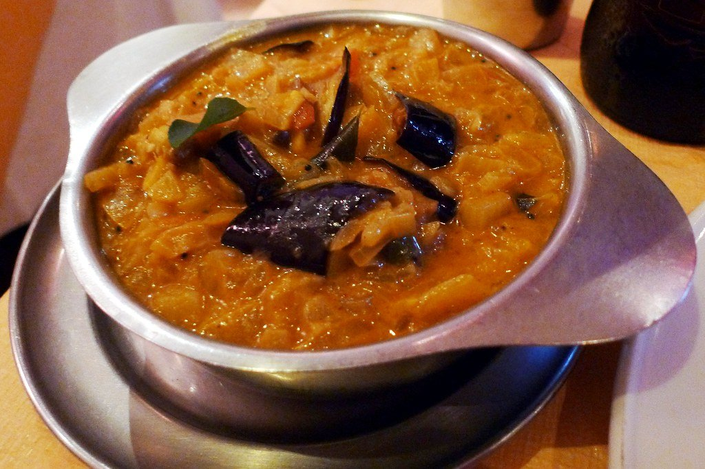
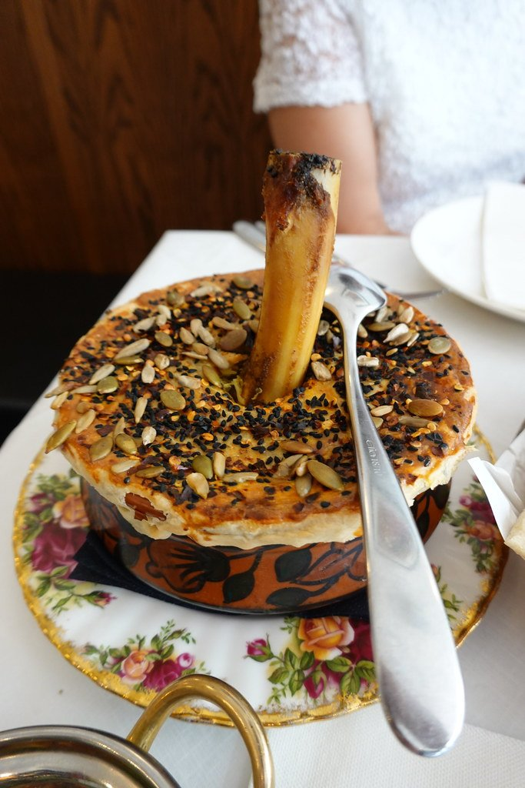
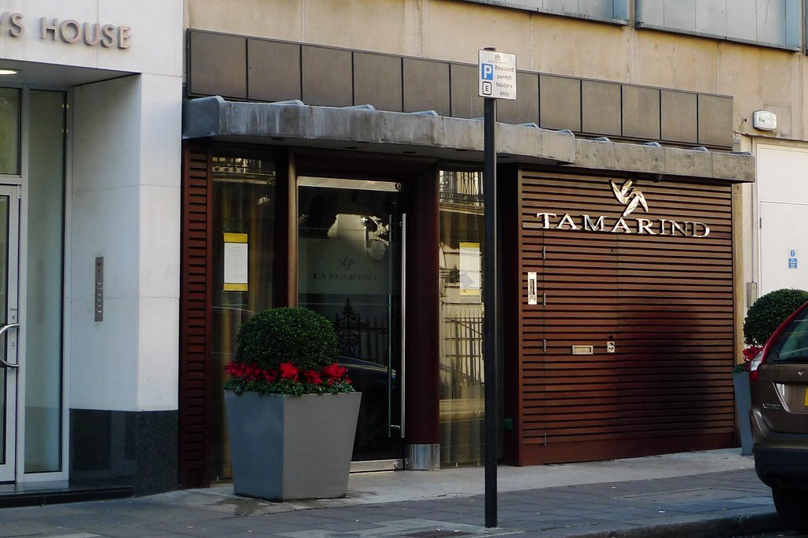

London does not have one Indian restaurant scene. It has a dozen running in parallel, and a British menu convention files them all under one word. A Mayfair club room cooking game over charcoal. A Keralan kitchen working coconut, curry leaf and appam. Awadhi biryani from the courts of Lucknow. Assamese and Naga food from the north-east, smoky and fermented and nothing like a curry. Gujarati thalis at a market stall for a fiver.

So this guide does two things. It starts with the restaurants that actually won something — the stars, the icons, the award winners — then arranges the rest **by what each kitchen cooks**. Once you know you want appam rather than a tandoor, half the famous names stop mattering.

> 💡 **The Short Version:** **Gymkhana** holds two Michelin stars and is named by more sources than anything else here — book months out. **Trishna** is the same idea at half the price and the safest booking on this page. **Dishoom** or **Kricket** for a good central meal with no plan. **Rasa** for Keralan vegetarian cooking that shames most Mayfair vegetable courses. **Shree Krishna Vada Pav** for the best £6 in London.

> 📊 **The evidence behind this guide**
> Nothing here is ranked on one visit. This pass reads **22 sources carrying 242 citations** across **103 named restaurants**. **43 restaurants are named by two or more independent sources; 42 carry a dated award.**
> **Built on:** the Asian Curry Awards, a Michelin selection reaching well beyond the West End, and thirteen independent publications.
> *Evidence rebuilt 30 August 2026 · [How we rank →](/how-we-rank/)*

## Where they are

  

    Best Indian Restaurants in London map
  

  

    
Loading the interactive map…

  

  

    <i class="restaurant-map-key restaurant-map-key--editorial" aria-hidden="true"></i> Recommended in this guide
    <i class="restaurant-map-key restaurant-map-key--streetfood" aria-hidden="true"></i> Street food, counter & market stall
  

  <noscript>
    
The interactive map requires JavaScript. Nearest stations and walking times are listed against every entry below.

  </noscript>

| If you are near… | Where to eat |
| --- | --- |
| **Mayfair & Green Park** | Gymkhana, BiBi, Jamavar, Benares, Tamarind, Kanishka |
| **Soho, Piccadilly & Covent Garden** | Veeraswamy, Kricket, Hoppers, Darjeeling Express, Dishoom, Kolkati |
| **Westminster & St James's Park** | Quilon, The Cinnamon Club |
| **Marylebone** | Trishna, Jikoni |
| **Knightsbridge & Chelsea** | Amaya, Kutir, Vatavaran |
| **The City & Borough** | Brigadiers, Oudh 1722, Horn OK Please, Gujarati Rasoi |
| **Bloomsbury & Fitzrovia** | Colonel Saab, Shree Krishna Vada Pav |
| **Further out** | Kokum (East Dulwich), Rasa (Stoke Newington), Babur (Brockley), Empire Empire (Notting Hill), The Tamil Prince (Islington) |

**Price guide:** **£** under £20 a head · **££** £25–£45 · **£££** £50–£80 · **££££** £100+.

---

## The most decorated

Every restaurant in this section holds a current Michelin star, a British Indian Good Food Guide London Icon, or both. These are the judged results rather than press consensus, and they are the closest thing this category has to a settled answer.

### Gymkhana, Mayfair

*££££ · Mayfair · 3 min from Green Park · book months ahead · Cited by 11 sources · 2 Michelin stars · London Icon 2025*

The only Indian kitchen in Britain with two stars, and the most-cited Indian restaurant in London by a clear margin — eleven independent sources, including six of the year's food videos. The room takes its cues from the colonial-era gymkhana clubs: ceiling fans, dark wood, a bar that behaves like a members' club. The kitchen leans hard into game and grilling, and the wild boar biryani is the order.

Book as far ahead as the window allows, which in practice means months rather than weeks. This is not a meal you slot in before a show; it is the evening.

▶ **In the videos:** [TOPJAW visits from 14:15](https://www.youtube.com/watch?v=AHUnqeRroYk&t=855s).

**4 minutes from Benares.**

### Trishna, Marylebone

*£££ · Marylebone · 8 min from Bond Street · book weeks ahead · Cited by 9 sources · 1 Michelin star*

**Michelin-starred cooking from India's south-west coast**, and the most-cited Indian restaurant in London across every guide read for this page — the Konkan and Kerala coastline rather than the Punjabi repertoire that shaped British Indian food.

Seafood is the whole proposition. The **hariyali bream** is the signature — whole fish in a green herb marinade — and the **butter pepper garlic crab** is the dish regulars order before looking at the menu. Coastal spicing: coconut, curry leaf, tamarind, and far less cream than a curry house.

**£££ and it books weeks ahead.** Marylebone. The set lunch is a fraction of dinner and comes out of the same kitchen.

### Jamavar, Mayfair

*££££ · Mayfair · 8 min from Bond Street · book weeks ahead · Cited by 9 sources · 1 Michelin star · London Icon 2025*

**Named for the handwoven Kashmiri shawl**, and cooking across the whole subcontinent rather than one region of it — which is unusual at this level, where most kitchens pick a coastline and stay there.

The menu moves from Kashmiri to Keralan in a few pages: **rogan josh**, coastal seafood, and a **biryani** sealed under pastry and opened at the table. Michelin-starred, and the cooking is precise rather than showy.

**££££ and it books weeks ahead.** Mount Street. Amaya and Benares are within walking distance, which makes this stretch of Mayfair the densest Indian fine dining in the country.

### Veeraswamy, Piccadilly

*££££ · Piccadilly · 4 min from Piccadilly Circus · book weeks ahead · Cited by 8 sources · 1 Michelin star · London Icon 2025*

**Open since 1926 and the oldest surviving Indian restaurant in Britain**, above Regent Street — with a Michelin star to go with the history, which very few centenarian restaurants manage.

The **dum biryani** is the signature: rice and meat sealed under a pastry lid and steamed, cracked open at the table. Around it, dishes from across India cooked in the old formal register, in a room of chandeliers and colour that has been there since the Raj was a going concern.

**££££ and it books weeks ahead.** The entrance is easy to miss — it is on Swallow Street, up a lift.

> ⚠️ **Check the rules before you book.** Veeraswamy runs a smart-casual dress code, age guidance for evening service, and a minimum spend at dinner outside the [pre-theatre menu](https://www.veeraswamy.com/whats-on/pre-theatre-and-post-theatre-dining/).

### Benares, Mayfair

*££££ · Mayfair · 4 min from Green Park · book weeks ahead · Cited by 5 sources · 1 Michelin star · London Icon 2025*

**Named Best Fine Dining Restaurant in London at the Asian Curry Awards**, and a Berkeley Square fixture for two decades — the room Atul Kochhar built and the one that won London's first Michelin star for Indian cooking.

Modern Indian in the fine-dining sense: British produce through Indian technique, a **tasting menu** that changes seasonally, and a bar that is a destination in itself. Less regional than Trishna, more composed than a curry house.

**££££ and it books weeks ahead.** Up a flight of stairs off Berkeley Square, which keeps it quieter than the street below.

### Amaya, Knightsbridge

*££££ · Knightsbridge · 6 min from Knightsbridge · Cited by 4 sources · 1 Michelin star*

**An open kitchen of tawa, sigri and tandoor in Belgravia, with a Michelin star for grilling rather than saucing** — which is the whole idea and makes it unlike every other starred Indian room in London.

Three cooking methods, all visible from the tables: the **tawa** griddle, the **sigri** charcoal grill and the **tandoor** clay oven. Order the **tandoori lamb chops** and the griddled scallops; there is barely a curry on the menu and that is deliberate.

**££££ and it books weeks ahead.** Ask for a table facing the kitchen — the cooking is the entertainment.

### Quilon, Westminster

*££££ · Westminster · 5 min from St. James's Park · book weeks ahead · Cited by 4 sources · 1 Michelin star · London Icon 2025*

Kerala and the Malabar coast: appam, coconut, curry leaf, and seafood treated as the main event. Quilon has held its star since 2008 and remains the one starred kitchen in London working the south-west rather than the north. Order the Mangalorean chicken.

It sits inside the St James' Court hotel, a short walk from Buckingham Palace and Westminster Abbey, which makes it an unusually easy dinner to attach to a sightseeing day.

**9 minutes from The Cinnamon Club.**

**Book:** [Reserve a table](https://www.sevenrooms.com/reservations/thequilon)

### The Cinnamon Club, Westminster

*££££ · Westminster · 7 min from St. James's Park · Cited by 3 sources · London Icon 2025*

**Inside the Grade II listed old Westminster Library**, bookshelves still in place and the gallery still running round the room — the most unusual dining room of any Indian restaurant in London, and it sits close enough to Parliament that it fills with MPs and lobbyists whenever the House is sitting.

Vivek Singh's cooking is Indian technique applied to British produce: **game, venison and grouse in season**, spiced rather than curried, with a wine list built to match. The breakfast service is a genuine oddity worth knowing about.

**££££, closed Sunday, and it books weeks ahead.** Great Smith Street, two minutes from Westminster Abbey.

### Ambassadors Clubhouse, Mayfair

*£££ · Mayfair · Cited by 3 sources · 1 Michelin star, new for 2026*

**A Mayfair room built around the food of undivided Punjab** — the region split between India and Pakistan in 1947 — from the JKS group, and styled as a 1920s Bombay gentlemen's club.

The cooking is Punjabi and north Indian rather than the coastal food elsewhere in this guide: **tandoori meats, rich gravies, breads off the grill**, with a **butter chicken** that regulars order without discussion. Two floors and a bar with a serious cocktail list.

**££££ and it books weeks ahead.** Heddon Street, and busier and louder than the Mayfair rooms around it.

---

Powered by <a target="_blank" rel="sponsored" href="https://www.getyourguide.com/london-l57/">GetYourGuide</a>

## Also strongly backed

No star, but the widest agreement in the city after the section above.

### Brigadiers, City of London

*£££ · City of London · 1 min from Cannon Street · Cited by 8 sources · British Indian Good Food Guide 2025*

Built on the idea of an Indian army mess bar: several large rooms, barbecue over coals, a serious whisky list, and live sport on the screens. It is loud, and that is a design decision rather than an accident — nobody at Brigadiers is having a quiet conversation.

Which makes it the obvious answer for a group of six or more, and the wrong answer for almost everything else. The tandoori lamb chops are what to order first. TOPJAW's best-curry list, voted by 200 chefs and industry figures they interviewed, put it top.

▶ **In the videos:** [TOPJAW opens here](https://www.youtube.com/watch?v=AHUnqeRroYk&t=0s), and so does [Harrison Webb](https://www.youtube.com/watch?v=6mDJrJFvllo&t=0s).

**Book:** [Reserve a table](https://www.sevenrooms.com/explore/brigadiers/reservations/create/search?venues=brigadiers%2Cambassadorsclubhouse%2Ctrishna)

### BiBi, Mayfair

*££££ · Mayfair · 6 min from Bond Street · book weeks ahead · Cited by 7 sources*

Chet Sharma's room, and the one on this page that most rewards paying attention. The menu works through regional Indian dishes with fine-dining technique and British produce, and the drinks list was built alongside the food rather than bolted on afterwards.

It is small and the seating is scheduled, so allergies, deposits and timings are worth settling when you book rather than on the night.

▶ **In the videos:** [TOPJAW visits from 7:20](https://www.youtube.com/watch?v=AHUnqeRroYk&t=440s).

**7 minutes from Jamavar.**

**Book:** [Reserve a table](https://www.sevenrooms.com/reservations/bibi)

### Dishoom, Covent Garden

*££ · Covent Garden · 3 min from Covent Garden · Cited by 7 sources · British Indian Good Food Guide 2025*

**The Irani cafés of old Bombay recreated in careful detail** — Parsi-run all-day rooms that were among the few places in the city where anyone could sit regardless of caste or religion. Covent Garden was the first, in 2010.

The **bacon naan roll** made it a breakfast destination as much as a dinner one: smoked streaky bacon, cream cheese and chilli-tomato jam in fresh naan. At dinner the **black daal**, cooked for twenty-four hours, and the **chicken ruby** are the standing orders, with chai poured from a height.

**££. Any party size can book before 6pm; after 6pm bookings are for groups of six or more only**, and most tables are held for walk-ins either way. Seven London branches.

> 💡 **Getting a table:** 6pm is the cut-off, not the party size — any number can book before it, six or more after. Most tables are held for walk-ins at every hour, so an empty booking page is not a full restaurant. Breakfast and lunch barely queue.

### Darjeeling Express, Covent Garden

*£££ · Covent Garden · 3 min from Piccadilly Circus · book weeks ahead · Cited by 5 sources · British Indian Good Food Guide 2025*

**Asma Khan's kitchen, staffed entirely by women** — most of whom had never cooked professionally before she hired them — **cooking the food of Calcutta and the royal Mughlai tradition she grew up in.**

The **Calcutta biryani** is the dish: Mughlai rice with meat and, distinctively, **a whole potato**, which Bengali biryani has and no other regional version does. Around it, Bengali fish, puchka, and the home cooking of a household rather than a restaurant repertoire.

**£££, closed Sunday, and it books weeks ahead.** Kingly Court. The story is not decoration — the kitchen model is the restaurant.

### Kricket, Soho

*££ · Soho · 1 min from Piccadilly Circus · Cited by 5 sources · British Indian Good Food Guide 2025*

**Started in a Brixton shipping container and grew into several sites**, doing Indian cooking as **small plates rather than curries** — which was a genuinely new idea in London when it opened.

The **Keralan fried chicken** with curry leaf mayonnaise is the signature and has been since the container. Beside it, **bhel puri**, samphire pakoras and a **smoked haddock kedgeree**, ordered four or five at a time across the table.

**££, and the counter seats are walk-in.** Soho is the busiest site; Brixton and White City are easier. Book for a table.

### Oudh 1722, Borough

*££££ · Borough · 5 min from Borough · book weeks ahead · Cited by 4 sources*

**Two-Michelin-star chef Aktar Islam cooking the Awadhi food of Lucknow** — biryanis and kebabs — **across three floors of a Victorian townhouse near London Bridge.** The year in the name is the founding of the Oudh court kitchens.

Awadhi cooking is slow and perfumed rather than hot: **dum biryani** sealed and steamed, **galouti kebab** — minced lamb so soft it was made for a toothless nawab — and breads off the tandoor. Almost nowhere else in Britain cooks this specifically.

**££££, closed Monday, and it books weeks ahead.** The ground floor is the bar; the dining rooms are above it.

### Kutir, Chelsea

*£££ · Chelsea · 6 min from Sloane Square · Cited by 4 sources · British Indian Good Food Guide 2025*

**A Chelsea townhouse done as an Indian hunting lodge**, with a menu built around game and the outdoors — a *kutir* is a cottage or hut, and the room commits to the idea completely.

**Game is the distinguishing feature**: venison, partridge and grouse in season, cooked with Indian spicing rather than European. Rohit Ghai holds a Michelin star elsewhere and the technique shows. Tasting menus alongside the à la carte.

**£££ and it books ahead.** Lincoln Street, off the King's Road, and one of the quieter fine-dining rooms in this guide.

### The Tamil Prince, Islington

*££ · Islington · Cited by 4 sources*

**A Victorian pub with a Tamil kitchen in it** — the format London does better than anywhere, and this is the room that made it fashionable. Prince Durairaj cooks the food of Tamil Nadu and Sri Lanka in a proper Islington boozer with the carpet and the bar intact.

The **Chettinad chicken** and the **lamb kari dosa** are the orders, with heat that is not moderated for the pub setting, and breads and sambals alongside. The Sunday roast comes with masala gravy.

**££, and it books weeks ahead** — it is small and the reputation outran the room years ago. Sibling to The Tamil Crown, also in Islington; two separate pubs, not two names for one.

---

Powered by <a target="_blank" rel="sponsored" href="https://www.getyourguide.com/london-l57/">GetYourGuide</a>

## By region

The section that justifies the page. Each of these is the only serious representative of its regional tradition in London, or close to it.

### South Indian and Keralan

#### Rasa, Stoke Newington

*£ · Stoke Newington · book days ahead · Cited by 2 sources · British Indian Good Food Guide 2025*

The same coast as Quilon for a fifth of the price. An entirely vegetarian Keralan kitchen behind a shocking pink shopfront on Stoke Newington Church Street, built on coconut, curry leaf and mustard seed rather than cream and tomato — which is what south Indian vegetarian food actually tastes like and what most of London's vegetarian curry does not.

*Keralan vegetarian cooking in Stoke Newington, and one of the few places in London doing it properly. Photo: [Ewan-M](https://www.flickr.com/photos/55935853@N00/4829536059), [CC BY-SA 2.0](https://creativecommons.org/licenses/by-sa/2.0/).*

#### Hoppers, Soho

*£££ · Soho · Cited by 4 sources · British Indian Good Food Guide 2025*

Sri Lankan and Tamil cooking built around the hopper — a fermented rice-and-coconut pancake cooked in a bowl-shaped pan — with fast service and confident heat. Karan Gokani's kitchen, and the one most likely to change what a reader thinks "Indian food" covers.

#### Kokum, East Dulwich

*£££ · East Dulwich · 13 min from East Dulwich · Cited by 3 sources*

Named for the sour, dark coastal fruit used along India's western shore, and the menu follows it — Goan and Konkani seafood, tamarind and coconut, very little cream. Three independent guides name a neighbourhood restaurant thirteen minutes' walk from a suburban station.

**Book:** [Reserve a table](https://order.kokumlondon.com/reservations)

### North-eastern and Himalayan

#### Kanishka, Mayfair

*£££ · Mayfair · 4 min from Oxford Circus · Cited by 3 sources · British Indian Good Food Guide 2025*

Atul Kochhar cooking the north-eastern states — Assam, Nagaland, Sikkim — which almost nothing else in London attempts at any price. The flavours run smokier, more fermented and less obviously "curry" than anything else in Mayfair, and that is the point of going.

**7 minutes from Benares.**

**Book:** [Reserve a table](https://www.sevenrooms.com/explore/kanishka/reservations/create/search/)

#### Vatavaran, Knightsbridge

*£££ · Knightsbridge · Cited by 2 sources*

Cooking from the Himalayan foothills, a region nothing else in London represents. Named by both the Good Food Guide and Time Out.

### Mughlai, Punjabi and the modern rooms

#### Empire Empire, Notting Hill

*£££ · Notting Hill · 8 min from Westbourne Park · Cited by 3 sources*

A love letter to the Bombay dining rooms of the 1970s, from the group behind Gymkhana and Trishna — velvet, brass, mirrored panels and a disco-era swagger played entirely straight. The food is north Indian and unfussy; the room is the reason it gets written about.

▶ **In the videos:** [Harrison Webb visits from 18:15](https://www.youtube.com/watch?v=6mDJrJFvllo&t=1095s).

**Book:** [Reserve a table](https://www.sevenrooms.com/reservations/empireempirelondon)

*Styled as a 1970s Bombay drinking den, down to the crockery. The food is more serious than the theming suggests. Photo: [Brokentaco](https://www.flickr.com/photos/92024986@N00/54019764399), [CC BY 2.0](https://creativecommons.org/licenses/by/2.0/).*

#### Colonel Saab, Bloomsbury

*£££ · Bloomsbury · Cited by 4 sources · Newcomer of the Year (London), Asian Curry Awards*

The old Holborn Town Hall, filled with the owner's family collection of Indian antiques — carved doors, brass, textiles, most of it carried over from India rather than sourced to a brief. Took Newcomer of the Year at the Asian Curry Awards.

#### Tamarind, Mayfair

*££££ · Mayfair · 5 min from Green Park · book weeks ahead · Cited by 2 sources · British Indian Good Food Guide 2025*

One of the first two Indian restaurants anywhere in the world to win a Michelin star — it and Zaika were awarded jointly in 2001. It is still a Mayfair basement doing tandoor cooking, and it has never tried to become anything else: no reinvention, no small plates, no counter.

**6 minutes from Benares.**

**Book:** [Reserve a table](http://www.tamarindrestaurant.com/)

*One of the first two Indian restaurants in the world to get a Michelin star, in 2001. Photo: [Ewan-M](https://www.flickr.com/photos/55935853@N00/5211344376), [CC BY-SA 2.0](https://creativecommons.org/licenses/by-sa/2.0/).*

#### Babur, Brockley

*£££ · Brockley · Cited by 3 sources · British Indian Good Food Guide 2025*

Thirty years of quietly outcooking most of central London, in south-east London, and in the Good Food Guide as well as the BIGFG top 100.

#### Jikoni, Marylebone

*£££ · Marylebone · 8 min from Bond Street · book weeks ahead*

Ravinder Bhogal cooks across her Kenyan, Indian and British background without picking one of them, which is why Jikoni is hard to file and easy to love. This is food built on borrowing rather than on authenticity.

**1 minute from Trishna.**

**Book:** [Reserve a table](https://www.sevenrooms.com/reservations/jikoni)

---

## Cheap and quick

Everything here comes in under £20 a head and none of it takes a booking.

- **Shree Krishna Vada Pav**, Fitzrovia — vada pav, a spiced potato fritter in a soft bun with chutneys, from a counter rather than a dining room. Three independent guides name a place where nothing costs more than a sandwich. *Cited by 3 sources*
- **[Rasa](#rasa-stoke-newington)**, Stoke Newington — Keralan vegetarian, cheaper than almost anything in this guide and better than most of it. *Cited by 2 sources*
- **Horn OK Please**, Borough Market — an all-vegetarian stall whose samosa chaat is built in front of you: the samosas crushed under hot chickpea curry, then yoghurt, then tamarind. Eat it standing up; it does not survive being carried.
- **Gujarati Rasoi**, Borough Market — mother-and-son Gujarati cooking a few steps away and a completely different tradition: thalis, bhajia and dhal, gently sweet where the other stall is sharp.
- **Kolkati**, Seven Dials Market — kati rolls the Kolkata way: paratha cooked with egg through it, wrapped around spiced chicken or paneer with pickled onion and lime.

---

## Curry house or dining room

The split most guides blur. A 1970s Tooting curry house and a Mayfair tasting menu both get called "the best Indian in London", and they are not the same trip.

**Dining rooms** are everything in the two sections above: booked weeks out, £50 and up, tasting menus and sommeliers. **Curry houses** are the neighbourhood institutions — often decades old, family-run, walk-in, and where most Londoners actually eat.

> 🌶️ **A note on what "Indian" means here.** London's best-known curry streets are largely *not* Indian. Brick Lane's kitchens are Bangladeshi; Whitechapel's are Pakistani; Tooting runs to Peshawari and Punjabi Lahori grilling. Those are their own traditions, not sub-types of Indian cooking, and this guide keeps them separate rather than quietly filing them under one word the way most London guides do.
>
> That is a labelling decision, not a quality one — Tayyabs in Whitechapel is among the best-value serious meals in the city. You will find those kitchens in the **[Pakistani restaurants guide](/restaurants/cuisine/pakistani)** instead.

---

## Worth knowing, briefly

Restaurants the sources back that did not earn a full entry, either because only one or two guides name them or because they sit further out.

| Restaurant | Area | Price | What it is | Cited by |
| --- | --- | --- | --- | --- |
| **Gunpowder** | Spitalfields | ££ | Sharing plates, confidently seasoned and clearly defined | 3 sources |
| **The Tamil Crown** | Islington | ££ | A Tamil kitchen inside a Victorian pub. Sibling to The Tamil Prince | 2 sources |
| **Tamila** | Clapham | ££ | Tamil home cooking, picked up by both the Good Food Guide and Time Out | 2 sources |
| **Bombay Bustle** | Mayfair | £££ | Bombay tiffin-culture cooking from the Jamavar group | 2 sources |
| **Pahli Hill** | Fitzrovia | £££ | Bombay small plates, with a basement bar that runs later than the dining room | 2 sources |
| **Kahani** | Chelsea | £££ | Peter Joseph's kitchen, in the BIGFG top 100 | 2 sources |
| **Heritage** | Dulwich | £££ | Modern compositions backed by discipline and technique | 2 sources |
| **Shiuli** | Twickenham | £££ | Contemporary Indian from a two-Michelin-star chef, well outside the centre | 2 sources |
| **Masala Zone** | Piccadilly | ££ | Thalis and street-food plates well below Mayfair prices, from the Amaya group | 2 sources |
| **Fatt Pundit** | Covent Garden | ££ | Indian-Chinese Hakka cooking, which barely exists elsewhere in London | 2 sources |
| **Thecha** | — | ££ | Maharashtrian cooking named for the chilli-and-garlic relish | 2 sources |
| **Udaya Kerala** | East Ham | ££ | Appam, coastal fish and coconut, out where the Keralan community actually eats | 2 sources |
| **Hyderabadi Spice** | East Ham | ££ | Hyderabadi biryani treated as its own tradition rather than as a side dish | 2 sources |
| **Madhu's** | Southall | ££ | Kenyan-Punjabi cooking, and Southall's most consistently named kitchen | 2 sources |
| **Shankeys** | Homerton | ££ | Named by both The Infatuation and Time Out, a narrow overlap to land in | 2 sources |
| **Asher's Africana** | Wembley | ££ | East African Indian cooking, a tradition with almost no other London representative | 2 sources |

[See all 50 Indian restaurants →](/restaurants/cuisine/indian) · [See all 6 Pakistani restaurants →](/restaurants/cuisine/pakistani)

---

## Booking and dietary essentials

* **Book months ahead** for Gymkhana. **Weeks ahead** for BiBi, Veeraswamy, Jamavar, Benares, Tamarind, Quilon, Oudh 1722, Darjeeling Express and Jikoni.
* **You cannot book at all** at Shree Krishna Vada Pav or any of the market stalls.
* **Dishoom takes any party size before 6pm**, and groups of six or more after it. It holds most tables for walk-ins regardless.
* **Fully vegetarian:** Rasa, Shree Krishna Vada Pav and Horn OK Please. Everywhere else here has a substantial marked vegetarian menu.
* **Halal** preparation varies by branch and by dish even within one restaurant. Confirm directly with the venue rather than assuming from the cuisine.
* **Service charge** of 12.5% is discretionary and standard on London restaurant bills.

---

Powered by <a target="_blank" rel="sponsored" href="https://www.getyourguide.com/london-l57/">GetYourGuide</a>

## Watch the restaurant tours

<figure class="youtube-embed">
  

    <button class="youtube-embed__button" type="button" data-youtube-video="AHUnqeRroYk" data-youtube-title="Best Curry in London: Where Chefs Eat by TOPJAW" aria-label="Play Best Curry in London: Where Chefs Eat by TOPJAW">
      
      
    </button>
  

  <figcaption>
    <strong>Best Curry in London: Where Chefs Eat — TOPJAW</strong>
    Their top five, voted by 200 chefs and industry figures: <a href="https://www.youtube.com/watch?v=AHUnqeRroYk&amp;t=0s">Brigadiers (0:00)</a>, Tayyabs (3:48), <a href="https://www.youtube.com/watch?v=AHUnqeRroYk&amp;t=440s">BiBi (7:20)</a>, <a href="https://www.youtube.com/watch?v=AHUnqeRroYk&amp;t=677s">Darjeeling Express (11:17)</a> and <a href="https://www.youtube.com/watch?v=AHUnqeRroYk&amp;t=855s">Gymkhana (14:15)</a>.
  </figcaption>
</figure>

<figure class="youtube-embed">
  

    <button class="youtube-embed__button" type="button" data-youtube-video="6mDJrJFvllo" data-youtube-title="I Ate London's Best Indian Food by Harrison Webb" aria-label="Play I Ate London's Best Indian Food by Harrison Webb">
      
      
    </button>
  

  <figcaption>
    <strong>I Ate London's Best Indian Food — Harrison Webb</strong>
    Restaurants visited: <a href="https://www.youtube.com/watch?v=6mDJrJFvllo&amp;t=0s">Brigadiers (0:00)</a>, <a href="https://www.youtube.com/watch?v=6mDJrJFvllo&amp;t=476s">Kricket (7:56)</a>, <a href="https://www.youtube.com/watch?v=6mDJrJFvllo&amp;t=1095s">Empire Empire (18:15)</a> and <a href="https://www.youtube.com/watch?v=6mDJrJFvllo&amp;t=1485s">Indian Lounge (24:45)</a>.
  </figcaption>
</figure>

---

## Continue planning your London trip

- 🍽️ **[Eat in London: Restaurants, Food Markets & Quick Food Hub](/articles/eat-in-london-guide/)**
- 🍕 **[The Best Pizza in London](/articles/best-pizza-london/)**
- 🏛️ **[Best Areas to Visit in London: Neighbourhood Guide](/articles/best-areas-to-visit-london/)**
- 🎭 **[Covent Garden Area Guide](/articles/covent-garden-area-guide/)**
- 🍜 **[Soho Area Guide](/articles/soho-area-guide/)**
- 🏙️ **[City of London Area Guide](/articles/city-of-london-area-guide/)**
- ⏱️ **[Three Days in London Itinerary](/articles/three-days-in-london-itinerary/)**
