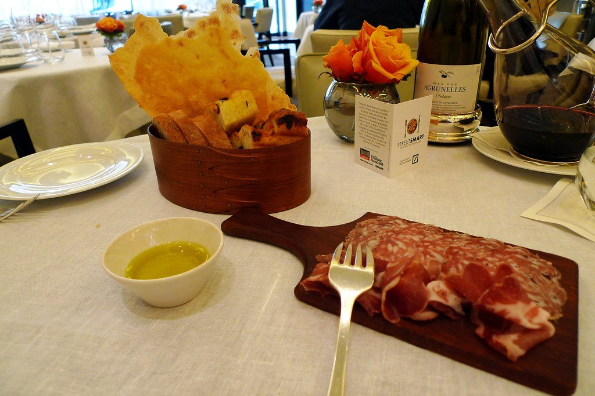
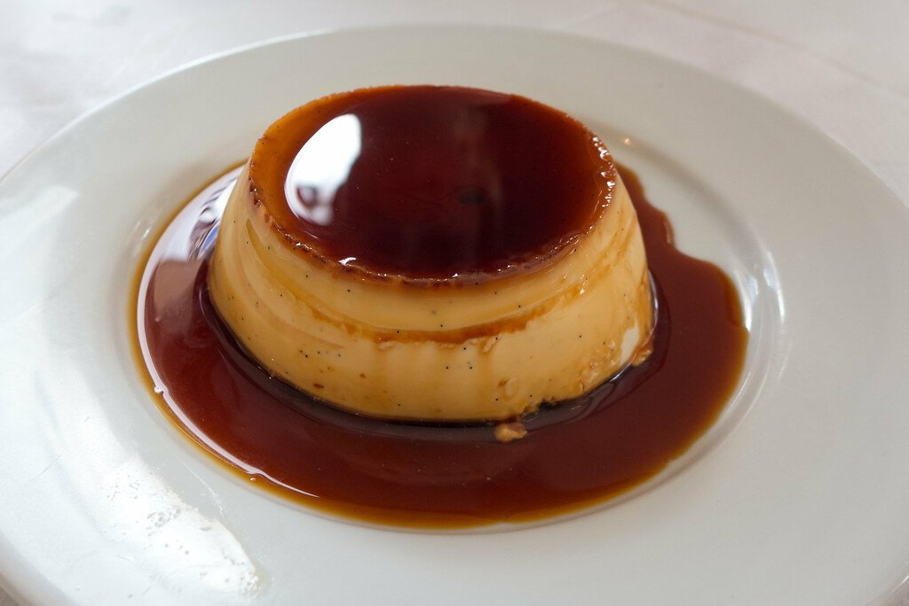
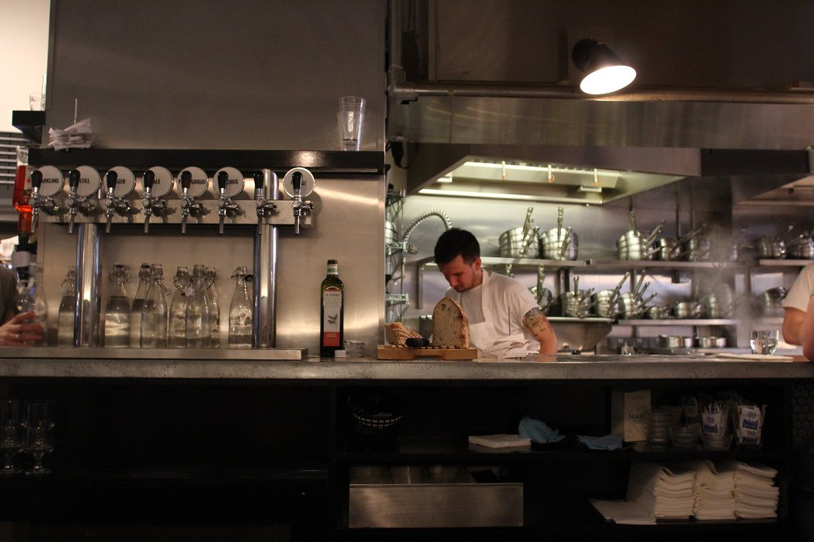
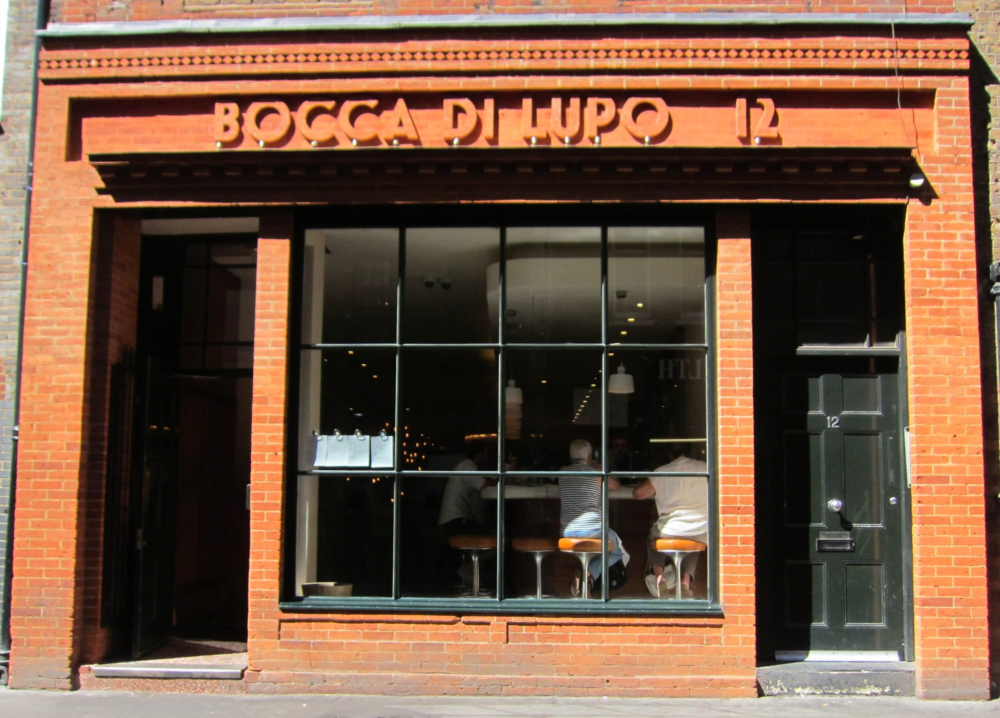
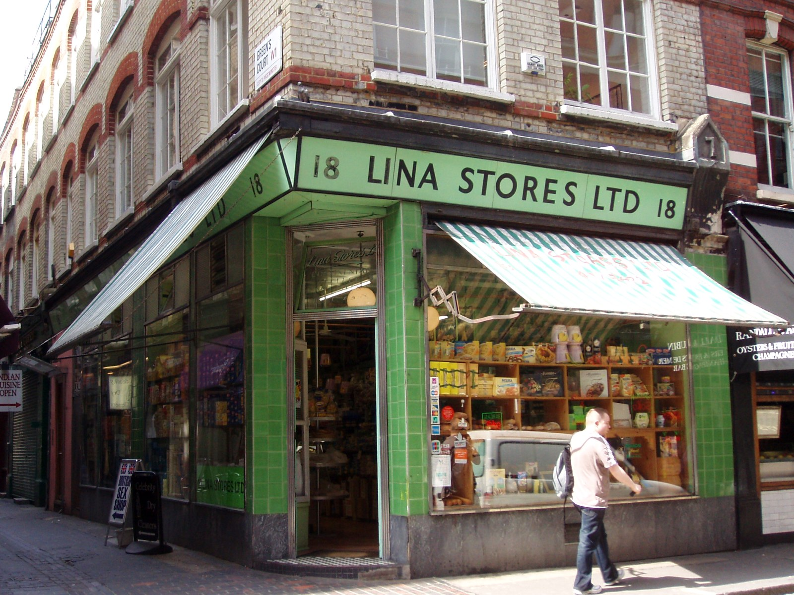
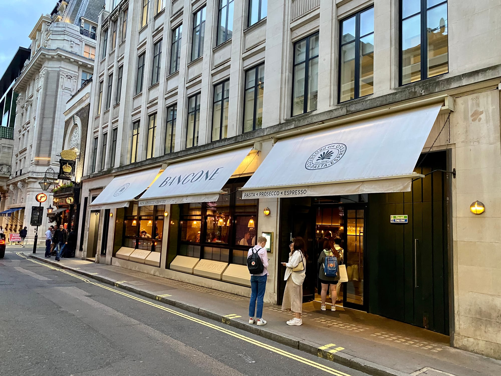
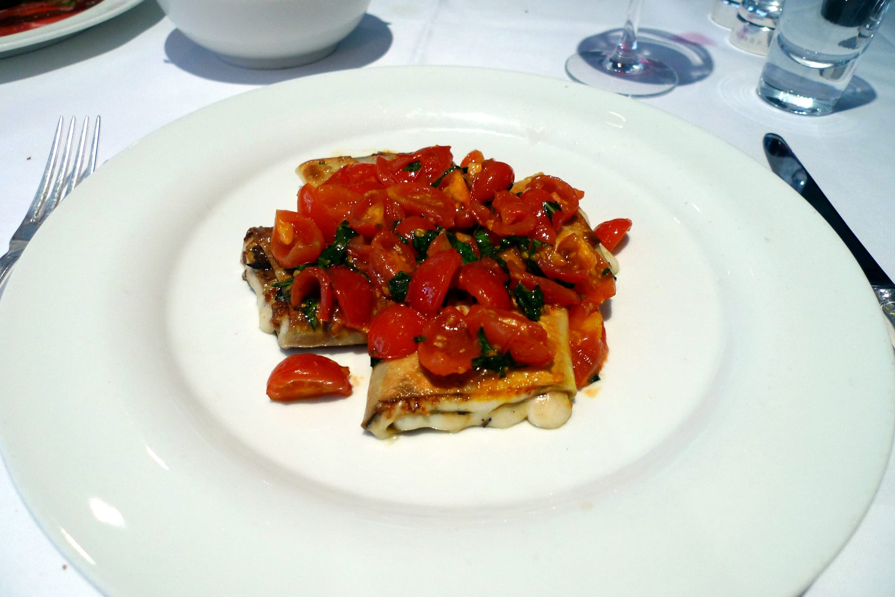
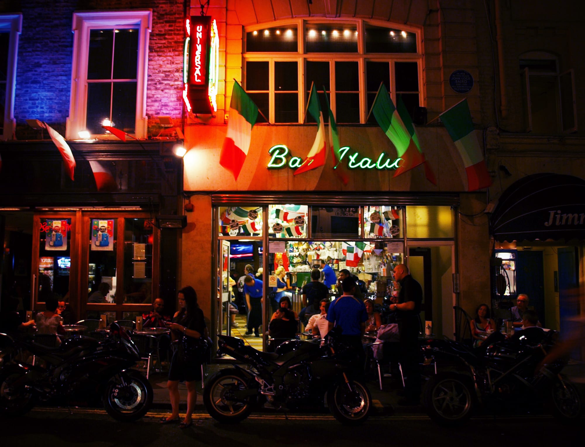

London's Italian restaurants stopped being one thing about a decade ago. A Sicilian room in Fitzrovia, a Florentine steak house in Clerkenwell, a Milanese kitchen in London Fields, a Piedmontese butcher's counter in South Kensington — they cook genuinely different food, and "Italian" tells you almost nothing useful about any of them.

So this guide starts with the restaurants the sources actually agree on, then splits the rest by **region**, by **price**, and by **which rooms are worth booking for the room alone**.

> 💡 **The Short Version:** **Trullo** and **Padella** are the two most-cited Italian restaurants in London. **River Café**, **Murano** and **Luca** are the three holding a Michelin star. **Bancone** and **Al Dente** are the value picks. **Norma** for Sicilian, **Brutto** for Florentine steak. And **Circolo Popolare** if you want the room more than the meal.

> 📊 **The evidence behind this guide**
> Nothing here is ranked on one visit. This pass reads **47 sources carrying 333 citations** across **182 named restaurants**. **45 restaurants are named by two or more independent sources; 22 carry a dated award.**
> **Built on:** twenty-seven independent publications — more sources than any guide here except pizza.
> *Evidence rebuilt 30 August 2026 · [How we rank →](/how-we-rank/)*

## Where they are

  

    Map of the best Italian restaurants in London
  

  

    
Loading the interactive map…

  

  <noscript>
    
The interactive map requires JavaScript. Every entry below lists its area.

  </noscript>

| If you are near… | Where to eat |
| --- | --- |
| **Mayfair & Green Park** | Murano, Cecconi's, Il Gattopardo |
| **Soho & Piccadilly** | Bocca di Lupo, Lina Stores, Bar Italia, 40 Dean Street |
| **Covent Garden** | Bancone, Café Murano, Ave Mario |
| **Fitzrovia & Marylebone** | Norma, Circolo Popolare, Al Dente, The Italian Greyhound, Carlotta |
| **Clerkenwell & the City** | Luca, Brutto, Eataly |
| **Islington & north** | Trullo, Noci, Ciao Bella |
| **Shoreditch & east** | Manteca, Gloria, Campania & Jones, Ombra, E. Pellicci |
| **Borough & South Bank** | Padella, Flour and Grape, Legare, Forza Wine |
| **West London** | River Café, Jacuzzi, Como Garden |
| **South London** | Artusi (Peckham) |
| **Knightsbridge & Chelsea** | Sale e Pepe, Mucci's, Daphne's, Sette |

**Price guide:** **£** under £15 · **££** £15–£35 · **£££** £40–£70 · **££££** £90+.

---

## The starred kitchens

Three Italian restaurants in London hold a Michelin star in the 2026 guide. Locanda Locatelli held one for years and closed in January 2025.

### River Café, Hammersmith

*££££ · book months ahead · Cited by 4 sources · 1 Michelin star*

**Michelin-starred simplicity on the Thames**, and the kitchen where **Jamie Oliver and Hugh Fearnley-Whittingstall both trained** — Ruth Rogers and the late Rose Gray built the room that taught Britain what Italian cooking actually is.

The principle is a short menu of very few ingredients handled precisely: **wood-roasted whole fish**, hand-rolled pasta, and the **chocolate nemesis** — a flourless cake that is on every list of London's best puddings. Produce is flown from Italian growers weekly and priced accordingly.

**££££ and it books months ahead. The terrace tables are the ones everyone wants** and go first — ask specifically. Informal in atmosphere, upmarket in every other respect.

### Luca, Clerkenwell

*£££ · 4 min from Farringdon · book weeks ahead · Cited by 8 sources · 1 Michelin star*

**Italian cooking through British produce, from the Clove Club team** — the constraint is deliberate and it is what separates the room from a straight trattoria.

The **parmesan fries** are the thing everyone mentions and deserve it, but the pasta is the reason to go: hand-rolled, changing weekly, built on British ingredients rather than imported ones. There is a bar at the front that takes walk-ins and a conservatory dining room behind it.

**£££, closed Sunday, books weeks ahead.** Clerkenwell. The bar menu is a cheaper way into the same kitchen.

### Murano, Mayfair

*££££ · 5 min from Green Park · book weeks ahead · Cited by 3 sources · 1 Michelin star*

**Angela Hartnett's Mayfair dining room, starred within four months of opening in 2008** and holding it since — named after the Venetian glass-making island.

Northern Italian cooking in a formal room: **hand-made pasta**, veal, and a set-price menu structure that lets you build two, three or four courses. Precise rather than showy, and one of the calmest fine-dining rooms in Mayfair.

**££££, closed Sunday, and it books weeks ahead.** The set lunch is materially cheaper than dinner from the same kitchen.

*Angela Hartnett's Mayfair dining room. The pasta course is the one to build the meal around. Photo: [Ewan-M](https://www.flickr.com/photos/55935853@N00/5210809193), [CC BY-SA 2.0](https://creativecommons.org/licenses/by-sa/2.0/).*

---

## The most agreed on

No star, but the widest agreement in the city — and between them the answer to "where should I eat Italian in London" for most people, most nights.

### Trullo, Highbury

*£££ · 3 min from Highbury & Islington · book weeks ahead · Cited by 9 sources*

**Tim Siadatan — ex St John and Moro — cooking a frequently changing seasonal menu of hand-made pasta and charcoal-grilled meats**, in a Highbury trattoria long regarded as one of London's best neighbourhood Italians.

The signature is **pappardelle with eight-hour beef shin ragù**, and it has been on the menu since the beginning. Everything else changes: the charcoal grill does whatever is in season, and the pasta is rolled daily.

**£££ and it books weeks ahead.** Sibling to Padella, which explains the pasta. St Paul's Road, and worth the trip north.

*Islington. The hand-rolled pasta changes daily and the beef over charcoal is the constant. Photo: [Ewan-M](https://www.flickr.com/photos/55935853@N00/14194656052), [CC BY-SA 2.0](https://creativecommons.org/licenses/by-sa/2.0/).*

### Padella, Borough

*£ · walk-in only · Cited by 9 sources*

**A short menu of hand-rolled pasta at low prices**, which is the entire reason the queue exists and has done since 2016.

Eight or nine dishes, most under a tenner: **pici cacio e pepe**, **tagliarini with Dorset crab**, and the pappardelle with beef shin ragù it shares with Trullo. Pasta is rolled in the room and cooked to order at a counter you can watch.

**£. No bookings at Borough Market — join the virtual queue on the Walk-In app** and go for a drink until it calls you. The Shoreditch and Soho sites take limited bookings, which is the trick most people miss.

*Sit at the counter and watch the pasta being rolled. The queue moves faster than it looks. Photo: [Bex.Walton](https://www.flickr.com/photos/7831824@N04/28035454561), [CC BY 2.0](https://creativecommons.org/licenses/by/2.0/).*

### Manteca, Shoreditch

*£££ · 10 min from Old Street · Cited by 8 sources · Bib Gourmand*

**Chris Leach and David Carter's nose-to-tail Italian**, with **whole-animal butchery feeding a menu of house-cured salumi and hand-rolled pasta** — the salumeria is on site and visible.

The **pig skin ragù** with rigatoni is the dish that made its name, and the **house salumi** — cured in the building from whole animals broken down there — is what to start with. Bread, butter and offal all get the same attention as the pasta.

**£££ and it books weeks ahead.** Shoreditch, loud, and among the most-cited Italian rooms in this guide at eight sources.

### Bocca di Lupo, Soho

*£££ · 2 min from Piccadilly Circus · book weeks ahead · Cited by 7 sources*

**Regional cooking from across the whole of Italy, served trattoria-style in a buzzy Soho room** — and **every dish is labelled with the region it comes from**, which is the point of the place.

Everything comes in **small or large plate sizes**, so a table can order eight regional dishes rather than three courses. Expect Piedmontese, Venetian and Sicilian on the same menu. The **counter seats face the kitchen** and are the best in the room.

**£££ and it books ahead.** Archer Street, and Gelupo across the road is the same owners' ice cream shop — go afterwards.

*Six separate mastheads name it — more editorial agreement than any other Italian restaurant in London. Photo: [Andrew Davidson](https://commons.wikimedia.org/wiki/File:Bocca_Di_Lupo.JPG), [CC BY-SA 4.0](https://creativecommons.org/licenses/by-sa/4.0).*

### Lina Stores, Soho

*££ · Brewer Street · Cited by 5 sources*

The **mint-green deli on Brewer Street since 1944**, opened by an Italian couple for Soho's Italian community, and still selling to it.

The restaurants came seventy years later and the shop is still the point: fresh pasta cut to order, salumi, cheese and tinned things worth carrying home. **Take the pasta home** — it is a fraction of the restaurant price and the best souvenir on this page.

*The mint-green deli has been on Brewer Street since 1944. The restaurants came seventy years later. Photo: [Ewan-M](https://commons.wikimedia.org/wiki/File:Lina_Stores,_Soho,_W1.jpg), [CC BY-SA 2.0](https://creativecommons.org/licenses/by-sa/2.0).*

### Bancone, Covent Garden

*££ · 3 min from Charing Cross · Cited by 5 sources · Bib Gourmand*

Watch the pasta being rolled at the counter, at prices well below what a Bib Gourmand normally costs. The **silk handkerchiefs with walnut butter and confit egg yolk** are the signature and genuinely originated here — the dish has since been copied across half of London.

The Covent Garden original takes no bookings for small tables. The Borough and Golden Square sites do, and the pasta is the same.

*The Golden Square site, which unlike the Covent Garden original does take bookings. Photo: [No Swan So Fine](https://commons.wikimedia.org/wiki/File:Bancone,_Lower_James_Street,_Soho,_August_2023_02.jpg), [CC BY-SA 4.0](https://creativecommons.org/licenses/by-sa/4.0).*

### Ciao Bella, Bloomsbury

*£ · 5 min from Russell Square · Cited by 5 sources*

**A Lamb's Conduit Street institution: red sauce, low prices, a pianist, and no interest in changing** — the kind of place the guides keep listing because nothing has replaced it.

This is the old Anglo-Italian repertoire done without embarrassment: **lasagne, veal milanese, spaghetti vongole**, garlic bread, and house wine by the carafe. The **live pianist** plays most evenings and the room is loud with regulars.

**£, and it books ahead** despite the prices — Bloomsbury has been coming here for decades. One of the cheapest sit-down Italian meals in central London.

---

Powered by <a target="_blank" rel="sponsored" href="https://www.getyourguide.com/london-l57/">GetYourGuide</a>

## By region

The section that justifies the page. Each of these cooks somewhere specific rather than "Italy".

### Norma, Fitzrovia — Sicilian

*£££ · 5 min from Goodge Street · Cited by 4 sources · Michelin Guide*

**Sicilian cooking with the Moorish influence kept in**, across four floors of a Fitzrovia townhouse — named both for the Bellini opera and for *pasta alla Norma*.

Sicily's Arab inheritance is the through-line and the reason it does not taste like mainland Italian: **saffron, almonds, raisins, cinnamon and spice** in dishes Rome does not cook. Expect **pasta alla Norma** with fried aubergine and ricotta salata, seafood crudo, and arancini done properly.

**£££, closed Sunday, and it books ahead.** Charlotte Street. The ground-floor raw bar takes walk-ins when the dining rooms above have gone.

### Campania & Jones, Bethnal Green — Campanian

*£££ · a converted dairy · Cited by 4 sources*

Cooking from the Campania region — the stretch of coast around Naples and Amalfi — in a **converted Victorian dairy** a minute from Columbia Road flower market.

Pasta is made by hand every day and the menu is short enough that the kitchen clearly means it. The room is half the reason to go: white tiles, marble, and the original dairy fittings left where they were.

**Go on a Sunday** and do the flower market first — it runs 8am to about 3pm.

### Brutto, Clerkenwell — Florentine

*££ · 4 min from Farringdon · Cited by 4 sources*

Deliberately unfussy Florentine cooking from the late Russell Norman, who did more than anyone to make London restaurants stop trying so hard.

**The bistecca is the order** — an 800g Florentine T-bone for sharing, priced by weight at around £8.25 per 100g, so a big one lands near £80 between two. The rest is cheap, short and knows what it is for: crostini, a few pastas, and negronis at prices that belong to another decade.

Walk-ins are taken at the bar.

### Artusi, Peckham — seasonal Italian

*££ · 5 min from Peckham Rye · Cited by 4 sources*

**A Peckham dining room doing classically based seasonal cooking with hand-made pasta, at prices well below its central equivalents** — named after Pellegrino Artusi, who wrote the book that codified Italian home cooking.

The menu is short and changes constantly with what is in season: **pasta rolled that day**, one or two grilled dishes, and a handful of vegetable plates. Nothing is on it for longer than the produce lasts.

**££ and it books ahead** at weekends. Bellenden Road, and one of the reasons people started travelling to Peckham to eat.

### Legare, Shad Thames — modern Italian

*££ · 8 min from London Bridge · Cited by 4 sources*

**Opened in 2019 by Jay Patel (ex Barrafina) and chef Matt Beardmore (ex Trullo)**, in the warehouse streets by Tower Bridge — a neighbourhood Italian in a quarter that mostly serves tourists.

Modern Italian with the Trullo pedigree showing in the pasta: **hand-rolled, changing weekly**, with grilled fish and meat around it and a short Italian wine list. The room is small and plain by Shad Thames standards.

**££ and it books ahead.** Five minutes from Tower Bridge and considerably better than anything on the riverside itself.

### Noci, Islington — pasta-led

*££ · 4 min from Angel · Cited by 4 sources*

**A short, frequently changing pasta menu drawn from across the Italian regions, at prices well below the central equivalents** — the format Padella popularised, done in a neighbourhood rather than a queue.

Six or seven pastas at a time, rolled in the room and rotated constantly: **cacio e pepe, ragù, and regional shapes** most London menus never carry. Small plates and a few desserts around them.

**££, and it takes bookings**, which is the advantage over Padella. Islington is the original; there are sites in Shoreditch and Battersea.

### Ornella, London Fields — Milanese

*£££ · 7 min from Hackney Central*

**Milanese cooking on Wilton Way** from the team behind Roman-influenced Lupa in Highbury — a butter-yellow corner site done simply, and the only kitchen in this guide cooking the north specifically.

Milanese means butter and rice rather than olive oil and tomato: **risotto alla milanese** stained with saffron, **cotoletta** — the breaded veal cutlet — and vitello tonnato. The menu is short and changes with what is available.

**££, closed Monday and Tuesday, and it books ahead.** A small neighbourhood room; the pavement tables go first in summer.

### Macellaio RC, South Kensington — Piedmontese

*£££ · 5 min from South Kensington*

**A butcher's shop with a restaurant attached** — *macellaio* means butcher — hanging Piedmontese **Fassona** beef in the window and cutting it to order.

Fassona is a lean Piedmontese breed, and the point is that it is served rare and unadorned: **tagliata**, carpaccio and a **battuta** tartare cut by hand. Pasta and a short Italian list around it, but the beef is why the shop is there.

**£££, and it books ahead.** Several London sites; South Kensington is the original. Steak is priced by weight and cut in front of you.

---

Powered by <a target="_blank" rel="sponsored" href="https://www.getyourguide.com/london-l57/">GetYourGuide</a>

## The nicest rooms

Sometimes the room is the booking. These are the ones people photograph before they eat — and it is worth being honest that on several of them the cooking is good rather than the point.

### The Big Mamma group

Five London rooms from the same French-Italian group, all built to be looked at: maximalist, loud, all-Italian menus, big portions and fair prices. **The food is good rather than remarkable. What you are booking is the spectacle**, and on that they deliver completely.

- **Circolo Popolare**, Fitzrovia — the wall of thousands of backlit bottles, and a lemon meringue pie the size of a fin. The most-photographed of the five. *Cited by 3 sources* · [Book](https://www.sevenrooms.com/explore/circolopopolare/reservations/create/search?venues=avemariolondon%2Ccircolopopolare%2Ccarlottauk%2Cgloria%2Cjacuzzi%2Cbarbarellacanarywharf&tracking=bmg)
- **Ave Mario**, Covent Garden — stripy humbug walls and bright red seats across a basement, with a carousel bar. *Cited by 3 sources* · [Book](https://www.sevenrooms.com/explore/avemariolondon/reservations/create/search?venues=avemariolondon%2Ccircolopopolare%2Ccarlottauk%2Cgloria%2Cjacuzzi%2Cbarbarellacanarywharf&tracking=bmg)
- **Jacuzzi**, Kensington — the grandest of them, in a former Whiteleys building, with painted ceilings and a marble bar. *Cited by 2 sources* · [Book](https://www.sevenrooms.com/explore/jacuzzi/reservations/create/search?venues=avemariolondon%2Ccircolopopolare%2Ccarlottauk%2Cgloria%2Cjacuzzi%2Cbarbarellacanarywharf&tracking=bmg)
- **Gloria**, Shoreditch — the first one, a Capri-styled trattoria with green banquettes and the ten-layer lasagne. [Book](https://www.sevenrooms.com/explore/gloria/reservations/create/search?venues=avemariolondon%2Ccircolopopolare%2Ccarlottauk%2Cgloria%2Cjacuzzi%2Cbarbarellacanarywharf&tracking=bmg)
- **Carlotta**, Marylebone — Italian-American rather than Italian, done as a 1970s New York dining room. [Book](https://www.sevenrooms.com/explore/carlottauk/reservations/create/search?venues=avemariolondon%2Ccircolopopolare%2Ccarlottauk%2Cgloria%2Cjacuzzi%2Cbarbarellacanarywharf&tracking=bmg)

> ⚠️ **Book weeks ahead, and expect noise.** All five are loud by design. Walk-in seats at the bar early in the evening are the way in without a booking.

### Forza Wine, South Bank

*£££ · 5 min from Waterloo · Cited by 4 sources*

A terrace on top of the **National Theatre** looking straight up the Thames — arguably the best free view attached to any restaurant in London, and no ticket required.

Italian small plates rather than a full menu: cauliflower fritti with aioli, burrata with pickled onions, whatever is seasonal. The wine list is the real draw — natural, low-intervention, heavy on chilled reds and orange.

**Go for the golden hour and go early.** It is first-come on the terrace and everyone else has had the same idea.

### Sale e Pepe, Knightsbridge

*£££ · 3 min from Knightsbridge · Cited by 3 sources*

**A Knightsbridge trattoria that has been loudly, unapologetically itself since 1974** — waiters who sing, regulars who have been coming for decades, and no concession to the postcode's usual restraint.

The cooking is the classic Italian repertoire done properly rather than reinvented: **hand-made pasta, veal milanese, whole fish** and a trolley of desserts. Portions are large and the room is deafening by nine.

**£££ and it books ahead.** Pavilion Road, minutes from Harrods, and the antithesis of everything else in the area.

### Cecconi's, Mayfair

*£££ · 3 min from Green Park · Cited by 3 sources*

**A Mayfair fixture since 1978**, now part of the Soho House group — the Burlington Gardens room where the fashion and art trade eats, and one of the few places in London that is busy at every hour it is open.

Venetian-leaning all-day Italian: **cicchetti** at the bar, **crab and chilli linguine**, veal milanese, and a breakfast service that is as booked as dinner. The green-and-white tiled room is as much the draw as the menu.

**££££ and it books weeks ahead.** Non-members welcome, despite the Soho House ownership. The bar seats take walk-ins.

*The awnings are the landmark. Mayfair's default Italian lunch since 1978. Photo: [Ewan Munro](https://commons.wikimedia.org/wiki/File:Cecconis,_Mayfair,_London_(3872025826).jpg), [CC BY-SA 2.0](https://creativecommons.org/licenses/by-sa/2.0).*

---

## Best value

Everything here is a genuinely good meal well under what the postcode suggests.

- **Mucci's**, Chelsea — **every starter £10, every main £20**, including a 200g sliced sirloin. A Chelsea steak at that price does not otherwise exist. *Cited by 4 sources*
- **[Ciao Bella](#ciao-bella-bloomsbury)**, Bloomsbury — a full Italian dinner under £30, with a pianist. *Cited by 5 sources*
- **[Padella](#padella-borough)**, Borough — most plates under £12. *Cited by 9 sources*
- **Al Dente**, Fitzrovia — handmade pasta rolled in front of you on Goodge Street, **every plate under £15**. The cacio e pepe is the order. *Cited by 2 sources*
- **Flour and Grape**, Bermondsey — pasta and a short wine list on Bermondsey Street, with almost everything under £13. *Cited by 3 sources*
- **[Café Murano](#murano-mayfair)**, Covent Garden — Angela Hartnett's everyday counterpart to Murano at roughly a third of the price. The set lunch is where the maths gets silly. *Cited by 2 sources*
- **E. Pellicci**, Bethnal Green — family-run since 1900, Grade II listed, and as much a full English as an Italian menu. *Cited by 2 sources*
- **Emilia's**, Canary Wharf and St Katharine Docks — fresh pasta, counter service, and the cheapest serious plate east of the City. *Cited by 2 sources*

---

Powered by <a target="_blank" rel="sponsored" href="https://www.getyourguide.com/london-l57/">GetYourGuide</a>

## Other restaurants worth knowing

Backed by the sources but not written up above, either because only two guides name them or because they sit further out.

| Restaurant | Area | Price | What it is | Cited by |
| --- | --- | --- | --- | --- |
| **Norma** | Fitzrovia | £££ | *(see above)* — Sicilian, and the one the critics disagree about | 4 sources |
| **The Italian Greyhound** | Marylebone | £££ | A Marylebone dining room named by three mastheads and almost no one else | 3 sources |
| **Eataly** | City of London | ££ | Italian marketplace by Liverpool Street — several counters, one roof | 3 sources |
| **Il Gattopardo** | Mayfair | £££ | Southern Italian fine dining in a Mayfair townhouse, with a fixed-price lunch | 2 sources |
| **Daphne's** | Chelsea | £££ | A Draycott Avenue fixture since 1964, with a glass-roofed back room | 2 sources |
| **Sette** | Knightsbridge | ££££ | Italian-American in the Bulgari hotel, priced for the postcode | 2 sources |
| **Como Garden** | Kensington | £££ | Lake Como cooking under a retractable glass roof and a lot of foliage | 2 sources |
| **Bar Italia** | Soho | £ | Frith Street since 1949, open almost around the clock, coffee rather than dinner | 2 sources |
| **ICCO** | Fitzrovia | £ | Twelve-inch pizza from £3.95, made to order, two minutes from Goodge Street | 2 sources · Harden's |
| **Ombra** | Bethnal Green | ££ | Venetian cooking on the Regent's Canal, cicchetti and short pastas | 2 sources |
| **40 Dean Street** | Soho | ££ | An old-school Soho favourite, lobster ravioli and no reinvention | 2 sources |
| **Bardo St James's** | St James's | £££ | Opulent room near the National Gallery, with live classical evenings | 2 sources |
| **Casa Tua** | Camden | ££ | Small independent family kitchen; the carbonara is the one people go for | 2 sources |
| **Al Boccon di'vino** | Richmond | £££ | No menu at all — course after course of whatever is cooked that night | 2 sources |
| **Langosteria London** | Westminster | ££££ | The Milan seafood group inside the Old War Office on Whitehall | — |
| **Sale e Pepe Mare** | Marylebone | ££££ | Ligurian seafood in The Langham; cacio e pepe finished in the wheel | — |
| **Ornella** | London Fields | £££ | *(see above)* — Milanese, a neighbourhood restaurant rather than a destination | — |
| **Macellaio RC** | South Kensington | £££ | *(see above)* — Piedmontese Fassona beef, cut to order | — |

*Bar Italia has been on Frith Street since 1949 and still opens almost around the clock — the oldest thing on this page by some margin. Photo: [SomeDriftwood](https://commons.wikimedia.org/wiki/File:Bar_Italia_-_Soho_(4764432107).jpg), [CC BY 2.0](https://creativecommons.org/licenses/by/2.0).*

[See all 112 Italian restaurants →](/restaurants/cuisine/italian)

---

## What to know

* **Region beats rating.** Choosing between Sicilian, Florentine and Milanese will change your meal more than a star will.
* **Padella and Bancone do not take bookings** at their original sites. Both run virtual queues.
* **The Big Mamma rooms** book out weeks ahead and are loud by design. Bar seats early in the evening are the walk-in route.
* **The pizza is a separate question** — see the dedicated guide below.
* **Service charge** of 12.5% is discretionary and standard on London restaurant bills.

---

## Continue planning your London trip

- 🍕 **[The Best Pizza in London](/articles/best-pizza-london/)**
- 🍛 **[The Best Indian Restaurants in London](/articles/best-indian-restaurants-london/)**
- 🍽️ **[Eat in London: Restaurants, Food Markets & Quick Food Hub](/articles/eat-in-london-guide/)**
- 💷 **[Cheap Eats in London](/articles/cheap-eats-london/)**
- 🌿 **[Best Vegetarian and Vegan Restaurants](/articles/best-vegetarian-vegan-restaurants-london/)**
- 🎭 **[Covent Garden Area Guide](/articles/covent-garden-area-guide/)**
- 🍜 **[Soho Area Guide](/articles/soho-area-guide/)**
