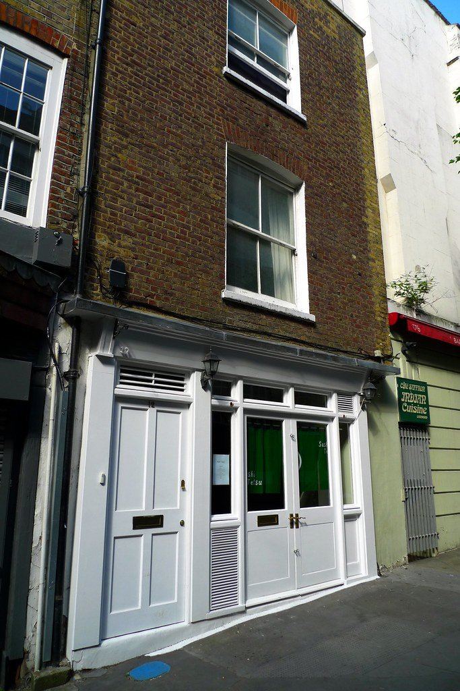
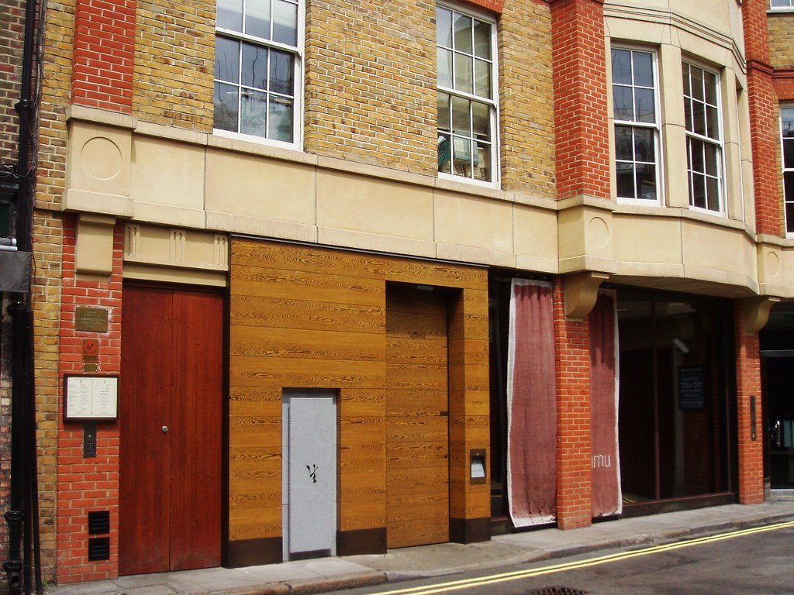
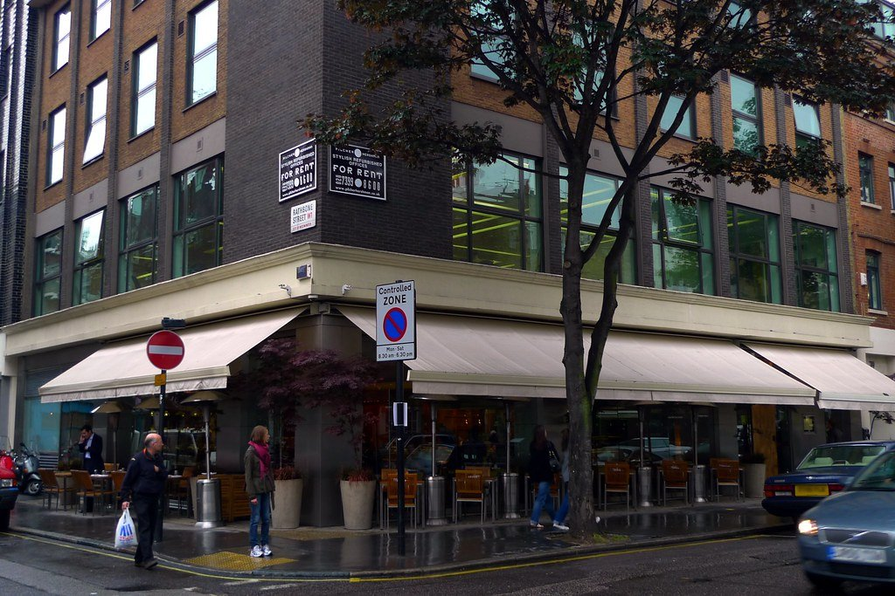
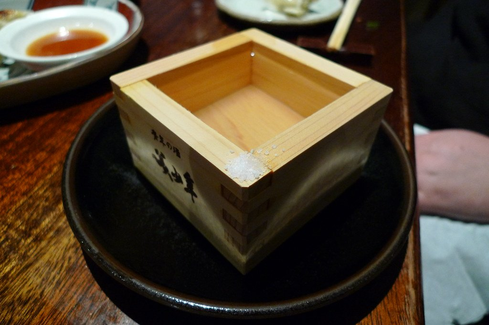

Japanese food in London splits cleanly by **format**, not by price. A seven-seat sushi counter, a charcoal yakitori grill, an izakaya built for drinking and a ramen shop are four completely different evenings, and knowing which one you want settles most of the decision before you look at a single menu.

The city has the deepest omakase scene outside Japan and a thinner budget end than it should — which this guide is honest about.

> 💡 **The Short Version:** **Sushi Tetsu** is the hardest table in London and worth the effort. **Sushi Atelier** is the best-value serious counter. **Roka** and **Zuma** invented the London izakaya template and still do it best. **Jin Kichi** in Hampstead is the value pick nobody writes about enough. **Umu** is the only proper Kyoto kaiseki in the city.

> 📊 **The evidence behind this guide**
> Nothing here is ranked on one visit. This pass reads **12 sources carrying 163 citations** across **114 named restaurants**. **28 restaurants are named by two or more independent sources; 5 hold a Michelin star.**
> **Built on:** specialists with real depth in one format each — ramen, omakase, izakaya — plus a Michelin selection reaching five kitchens.
> *Evidence rebuilt 30 August 2026 · [How we rank →](/how-we-rank/)*

## Where they are

| If you are near… | Where to eat |
| --- | --- |
| **Mayfair & Green Park** | The Araki, Sushi Kanesaka, Umu, Nobu Old Park Lane |
| **Knightsbridge** | Zuma, The Aubrey |
| **Fitzrovia & Marylebone** | Roka, Sushi Atelier, Nobu Portman Square, TOKii |
| **Clerkenwell** | Sushi Tetsu |
| **Soho & Piccadilly** | Engawa |
| **Chelsea & Kensington** | Dinings SW3, Akira at Japan House |
| **The City** | SUSHISAMBA |
| **Bloomsbury & Holborn** | Koya Ko, Cocoro |
| **Islington & north** | Jin Kichi (Hampstead), Monohon Ramen, Ramo Ramen |
| **Covent Garden** | Kanada-Ya |
| **South London** | Kurisu Omakase (Brixton) |

**Price guide:** **£** under £20 · **££** £20–£45 · **£££** £50–£90 · **££££** £120+.

---

## The omakase counters

Omakase means the chef chooses. You sit at the counter, courses arrive in sequence, and you are paying for sourcing and for proximity rather than for a long menu.

### Sushi Tetsu, Clerkenwell

*££££ · seven seats · the hardest table in London* · Cited by 3 sources

**Seven seats at a pale hinoki counter in a Clerkenwell alley**, run by Toru Takahashi and his wife Harumi — and only them. He cures, cuts and serves; she runs the room. That two-person arrangement is why it is the hardest table in London to get.

Edomae omakase: nigiri served one piece at a time, the rice at body temperature, the fish aged to Takahashi's timing rather than the market's. He tells you what each piece is and when to eat it, and the pace is his.

**Booking opens in windows and goes almost immediately** — set a reminder, refresh, and expect to fail several times. ££££, and there is no walk-in list.

*Seven seats and one chef. Booking is genuinely difficult and the reason people persist is the omakase. Photo: [Ewan-M](https://www.flickr.com/photos/55935853@N00/7670311580), [CC BY-SA 2.0](https://creativecommons.org/licenses/by-sa/2.0/).*

### The Araki, Mayfair

*££££ · around £310 · two sittings a night* · Cited by 2 sources

**A no-choice menu at around £310**, built on rare ingredients and served in two sittings a night to a handful of people — the most expensive meal in this guide and among the shortest menus.

Edomae sushi in the strictest sense: nigiri only, aged and cured to the chef's timing, served piece by piece across a counter with no substitutions and no à la carte. What arrives depends entirely on what the kitchen has been ageing.

**Tuesday to Saturday only, two sittings a night, closed Sunday and Monday, and it books months ahead.** ££££. The narrowest proposition on this page and it does not pretend otherwise.

### Sushi Kanesaka, Mayfair

*££££ · 45 Park Lane · thirteen covers* · Cited by 4 sources

**Thirteen covers inside 45 Park Lane** — nine at the counter, four in a private room — doing **omakase only**, brought over from the Tokyo original, which opened here in July 2023.

**No à la carte at all.** The chef sets the sequence and the pace: nigiri built on fish flown in and aged on site, rice seasoned to the Tokyo house style, served one piece at a time across the hinoki counter.

**££££, closed Sunday and Monday, and it books weeks ahead.** Sit at the counter rather than in the private room — the private room misses the point of the format.

### Sushi Atelier, Fitzrovia

*£££ · 7 min from Oxford Circus · the value pick* · Cited by 3 sources

Repeatedly named **the best-value serious omakase in central London** — the same counter discipline as the Mayfair rooms at a fraction of the outlay, which is why it turns up in three separate guides.

Omakase nigiri built the same way it is a mile east at four times the price: fish aged properly, rice at body temperature, and a chef who talks you through each piece. There is an à la carte if you want to eat more cheaply still.

**£££, closed Sunday and Monday, book weeks ahead.** Seven minutes from Oxford Circus, and the entry to recommend to anyone meeting the format for the first time.

### Kurisu Omakase, Brixton

*££££ · eighteen courses* · Cited by 1 source

**Eighteen courses in Brixton**, where chef Chris Restrepo runs Japanese technique through his Thai-Colombian background — the least likely omakase address in London and one of the best.

The sequence holds to omakase structure but the seasoning does not: Japanese cures and knife work meeting South American and Thai flavours, across eighteen courses served to a small counter. Nothing else in this guide cooks like it.

**££££, open Tuesday to Friday only** — closed Saturday, Sunday and Monday — and it books weeks ahead.

---

Powered by <a target="_blank" rel="sponsored" href="https://www.getyourguide.com/london-l57/">GetYourGuide</a>

## Kaiseki and fine dining

### Umu, Mayfair

*££££ · 7 min from Green Park* · Cited by 3 sources

**Kaiseki in the Kyoto tradition** — a fixed seasonal progression rather than a sushi counter, which makes it the odd one out among Mayfair's Japanese rooms and the only place in London doing the format at this level.

Kaiseki is a sequence with rules: a set order of preparations — raw, simmered, grilled, steamed — following what is in season, built to a structure rather than a chef's whim. Expect charcoal-grilled fish, delicate dashi, and vegetables treated as seriously as the protein.

**££££, closed Sunday, and it books weeks ahead.** Seven minutes from Green Park. The most formal Japanese meal in the guide.

*Kyoto-style kaiseki, and one of the most expensive rooms in London to eat in. Photo: [Ewan-M](https://www.flickr.com/photos/55935853@N00/2570835137), [CC BY-SA 2.0](https://creativecommons.org/licenses/by-sa/2.0/).*

### Engawa, Soho

*££££ · 2 min from Piccadilly Circus* · Cited by 2 sources

**Built around certified Kobe beef**, which very few London kitchens are licensed to serve — the sushi is good and the beef is the reason to book.

Kobe is served several ways across a set menu: seared on a hot stone at the table, as sukiyaki, and in sushi. The certification matters — most London "Kobe" is wagyu from elsewhere, and this room can show you the papers.

**££££, closed Monday and Tuesday, books weeks ahead.** Two minutes from Piccadilly Circus.

### Dinings SW3, Chelsea

*££££ · the most-cited Japanese room in London* · Cited by 5 sources

**The most-cited Japanese room in London** across these sources — izakaya-scale plates done at sushi-counter precision, and with **a courtyard that most guides forget to mention**.

The format is small plates rather than a set sequence: **tar tar chips** — spicy tuna on crisp discs — seared scallops, black cod, and nigiri from the same kitchen. It reads as a bar menu and eats like a tasting one.

**££££ and it books weeks ahead.** Ask for the courtyard in summer; it is the best outdoor Japanese table in the city.

---

## Izakaya

The Japanese pub format — small plates and grilled skewers, ordered across the table.

### Roka, Fitzrovia

*££££ · 5 min from Goodge Street* · Cited by 1 source

**The robata grill sits in the middle of the room and everything comes off it** — open since 2003 and still the reference point for the format in London, with every table arranged to look at the fire.

The signature is **black cod on a hoba leaf**, grilled over charcoal and served on the leaf it cooked on. Around it, robata-grilled lamb, skewers and a sushi counter, ordered as small plates across the table rather than as courses.

**££££ and it books weeks ahead.** Five minutes from Goodge Street. Ask for a counter seat at the grill — the tables are a lesser version of the same meal.

*Robata grilling around a central counter. Sit at it rather than at a table. Photo: [Ewan-M](https://www.flickr.com/photos/55935853@N00/3694773151), [CC BY-SA 2.0](https://creativecommons.org/licenses/by-sa/2.0/).*

### Zuma, Knightsbridge

*££££ · 2 min from Knightsbridge* · Cited by 2 sources

Opened in 2002 and **effectively invented the London template for informal, izakaya-inspired Japanese dining** — since exported to 27 sites across four continents, which is either the achievement or the objection.

Three kitchens work at once: **robata grill**, sushi counter and main kitchen, and the menu is built to be ordered across all three. The **miso-marinated black cod** and the robata-grilled lamb chops are the dishes that travelled worldwide.

**££££ and it books weeks ahead.** Two minutes from Knightsbridge, and still louder and better than most of the rooms that copied it.

### The Aubrey, Knightsbridge

*££££ · inside the Mandarin Oriental* · Cited by 2 sources

**A maximalist take on a Ginza night out inside the Mandarin Oriental** — closer to a bar with exceptional food than to a hotel dining room, and decorated to within an inch of its life.

Izakaya plates and robata off the grill, built to be eaten alongside a serious cocktail and sake list rather than as a sequence. The **wagyu skewers** and the sushi are the food to order; the room and the drinks are what you are paying for.

**££££ and it books weeks ahead.** Go late and treat it as a bar that feeds you.

### Jin Kichi, Hampstead

*£££ · 2 min from Hampstead* · Cited by 1 source

**A small family-run izakaya on Heath Street** doing charcoal yakitori at prices that have never caught up with the postcode — which is why it has survived on Hampstead regulars for decades.

**Yakitori** is the order: skewers grilled over binchōtan charcoal, and the whole bird used properly — thigh, skin, liver, heart, tail — rather than just breast. Sushi and sashimi alongside, and a short list of izakaya plates.

**£££, closed Monday, and book weeks ahead** — it is small and Hampstead has known about it for forty years. Two minutes from Hampstead station.

*A cramped Hampstead grill house that has been doing charcoal skewers since 1978. Photo: [Ewan-M](https://www.flickr.com/photos/55935853@N00/3955871266), [CC BY-SA 2.0](https://creativecommons.org/licenses/by-sa/2.0/).*

---

Powered by <a target="_blank" rel="sponsored" href="https://www.getyourguide.com/london-l57/">GetYourGuide</a>

## Nobu, and the London-Peruvian thread

### Nobu Old Park Lane, Mayfair

*££££ · the original* · Cited by 2 sources

The original London Nobu, and **the room that put miso black cod on menus worldwide** — co-founded by Nobu Matsuhisa with Robert De Niro, which makes it the celebrity-owned restaurant in London that is genuinely about the food.

**Black cod with miso** is the dish, marinated for three days and grilled until it flakes — copied by every hotel restaurant on earth and still better here. Yellowtail with jalapeño and the new-style sashimi are the other originals.

**££££ and it books weeks ahead.** The Old Park Lane room is the first one; the newer sites are slicker and less interesting.

### SUSHISAMBA, City of London and Covent Garden

*££££ · 39th floor* · Cited by 2 sources

**An orange tree growing through an open-air terrace on the 39th floor** of Heron Tower — the highest outdoor dining in the City, with the glass lift ride up the outside of the building as part of the experience.

Japanese-Peruvian-Brazilian cooking: **sushi and robata** alongside ceviche and churrasco skewers, which sounds scattered and works because the three cuisines genuinely share a history. Order across all of them.

**££££ and it books weeks ahead.** Ask for a terrace table specifically — inside is a different and lesser proposition. A second, ground-level site in Covent Garden has the food without the view.

### Los Mochis, Notting Hill

*££££ · Japanese-Mexican* · Cited by 1 source

**Sashimi and maki on the same menu as ceviche, tiradito and tacos.** It sounds like a gimmick and is not — Japanese-Mexican cooking has a real lineage on Mexico's Pacific coast, and the kitchen treats it seriously.

Order across the divide: **tuna tostadas**, sashimi dressed with chilli and lime, and tacos built with Japanese cures. The Notting Hill room is the original; a City rooftop site followed.

**££££ and it books ahead**, particularly at weekends. Loud, and designed for a night out rather than a quiet dinner.

---

## Ramen and noodles

The part of Japanese London that has improved most in the last decade, and the part you can eat on any budget.

### Kanada-Ya, Covent Garden

*£ · no bookings* · Cited by 4 sources

**Tonkotsu broth simmered for eighteen hours** and **no bookings**, which is why there is usually a queue on St Giles High Street — the broth recipe was worked out in Fukuoka before the first London site opened.

The **tonkotsu ramen** is the whole point: pork-bone broth boiled until it turns opaque and heavy, thin Hakata-style noodles cooked to your stated firmness, and chāshū on top. Order the noodles *barikata* if you like them firm; the kitchen will do it properly.

**£, walk-in only. The queue is shortest before noon and after 2pm** — it is longest at exactly the hour you would normally go.

### Monohon Ramen, Old Street

*£ · walk-in* · Cited by 4 sources

**The specialist's choice**, doing a lighter, cleaner broth than the tonkotsu shops — and taken seriously enough by ramen obsessives that it is named by four independent sources.

The house style is **shoyu and shio** rather than the heavy pork-bone broth everyone else leads with: clearer, more savoury, and easier to finish. Noodles are firmer than the chains serve, and the toppings are restrained on purpose.

**£, walk-in only.** Old Street, and quieter than the Covent Garden ramen queues at almost every hour.

### Ramo Ramen, Soho

*££ · Filipino-Japanese* · Cited by 2 sources

**Filipino-Japanese ramen**, which sounds like a fusion gimmick and is a coherent tradition — ramen run *through* Filipino cooking rather than beside it.

The **oxtail kare kare ramen** is the dish the whole place is built around: the Filipino peanut-and-oxtail stew rebuilt as a ramen broth, rich and slightly sweet, with bagoong on the side to season it yourself. Sisig and Filipino small plates alongside.

**££, walk-in.** 28 Brewer Street, and busiest in the evening. The most original bowl of ramen in London and not a close contest.

**It moved.** The original Kentish Town Road site closed in August 2024 and the space is now a different restaurant — Soho is the only Ramo Ramen, so ignore any list still sending you to NW1.

### Koya Ko, Bloomsbury

*£ · udon* · Cited by 2 sources

**Hand-cut udon rather than ramen**, in a broth made to order — thicker, chewier and considerably more interesting than the noodles most people mean by Japanese noodle soup.

The udon is made in-house and cut by hand, and the classic order is **kake udon** — the plainest bowl, hot dashi and nothing else — which is how you judge whether a udon shop is any good. **Kamatama**, the raw-egg version, and a walnut miso are the two to try after it.

**£, walk-in.** There are several Koya sites; this one and the Broadway Market outpost have the same noodles without the Soho queue.

### Cocoro, Bloomsbury

*££ · Japanese home cooking* · Cited by 2 sources

Neither sushi counter nor ramen shop — **everyday Japanese home cooking**, and open since 2006. The sort of place Japanese office groups and families actually eat, which is the strongest recommendation a Japanese restaurant in London can have.

**Donburi and set meals** are the format: rice bowls topped with grilled fish, katsu or beef, with miso soup and pickles. Sushi and **sukiyaki** are on the menu too, and the **tonkotsu ramen** punches well above the room.

**££, walk-in, and cheap for Bloomsbury.** Lunch sets are the best value on the page.

---

Powered by <a target="_blank" rel="sponsored" href="https://www.getyourguide.com/london-l57/">GetYourGuide</a>

## Everyday and best value

Omakase counters get the attention, but the everyday end of Japanese London is where most of the eating happens — and it is cheap.

#### Under £15

* **Kanada-Ya**, Covent Garden — a bowl of eighteen-hour tonkotsu for less than a central London sandwich.
* **Koya Ko**, Bloomsbury — hand-cut udon, and the breakfast service is cheaper still.
* **Marugame Udon** — a canteen where you walk the line watching the noodles being cut, under £12, with sites across London.
* **Monohon** and **Tonkotsu** — both consistent, both around the same money.

#### Markets and food halls

* **Seven Dials Market**, Covent Garden — Japanese counters in a two-floor food hall, and the best way to eat one good dish without committing to a restaurant.
* **Arcade Food Hall** at Centre Point and Battersea Power Station carries several Japanese and Japanese-adjacent counters, generally around £10–£14 a dish.
* **Japan Centre**, Panton Street — as much a food shop as a restaurant. The bento and onigiri counter is the cheapest genuinely Japanese food in the West End, and the supermarket behind it is where Londoners buy the ingredients.

#### Worth the money rather than cheap

* **Jin Kichi**, Hampstead — charcoal yakitori, and the best value-for-quality on this page.
* **Cocoro** — home-style set meals, the category London under-serves.
* **Akira at Japan House**, Kensington — sourcing directly from Japan, with bento and donburi built on produce nowhere else here has.
* **Lunch sets** at the omakase counters run at a fraction of dinner for the same fish. This is the single biggest saving in this guide.

---

## What to know

* **Book omakase weeks ahead.** Sushi Tetsu releases in batches; set a reminder.
* **Lunch is materially cheaper** at almost every counter here, for the same kitchen.
* **Izakaya is for sharing** and ordering in waves, not for a starter and a main.
* **The budget end is thin.** If you want cheap Japanese food in London, ramen and udon are the honest answer.
* **Service charge** of 12.5% is discretionary and standard.

---

## Continue planning your London trip

- 🍽️ **[Eat in London: Restaurants, Food Markets & Quick Food Hub](/articles/eat-in-london-guide/)**
- 🥟 **[Best Chinese and East Asian Restaurants](/articles/best-chinese-east-asian-restaurants-london/)**
- 💷 **[Cheap Eats in London](/articles/cheap-eats-london/)**
- 🍕 **[The Best Pizza in London](/articles/best-pizza-london/)**
- 🏙️ **[City of London Area Guide](/articles/city-of-london-area-guide/)**
- 🍜 **[Soho Area Guide](/articles/soho-area-guide/)**
