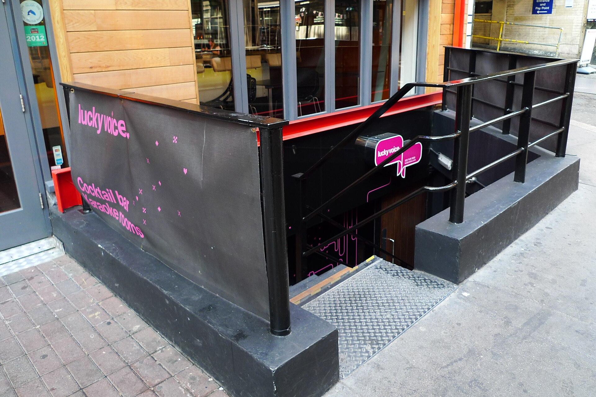
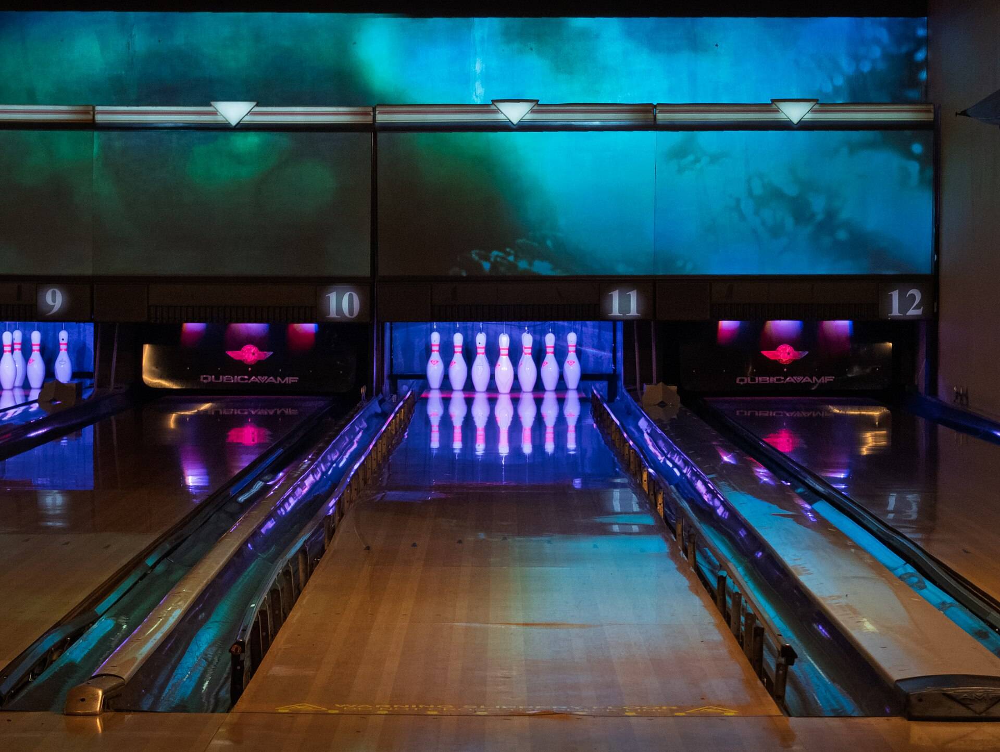
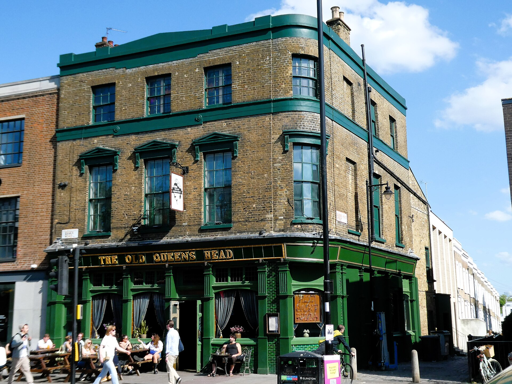
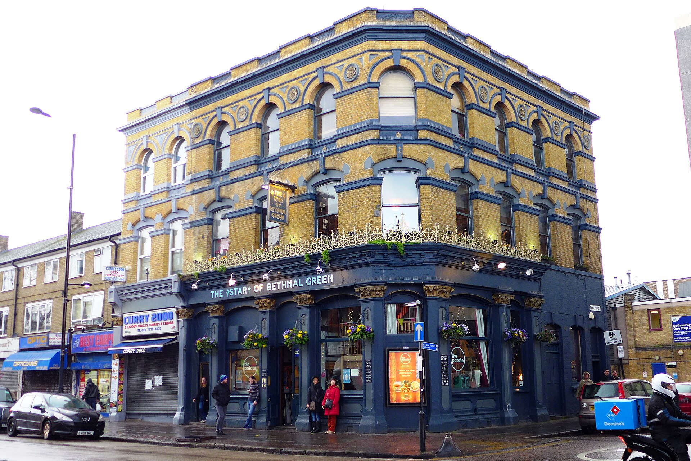
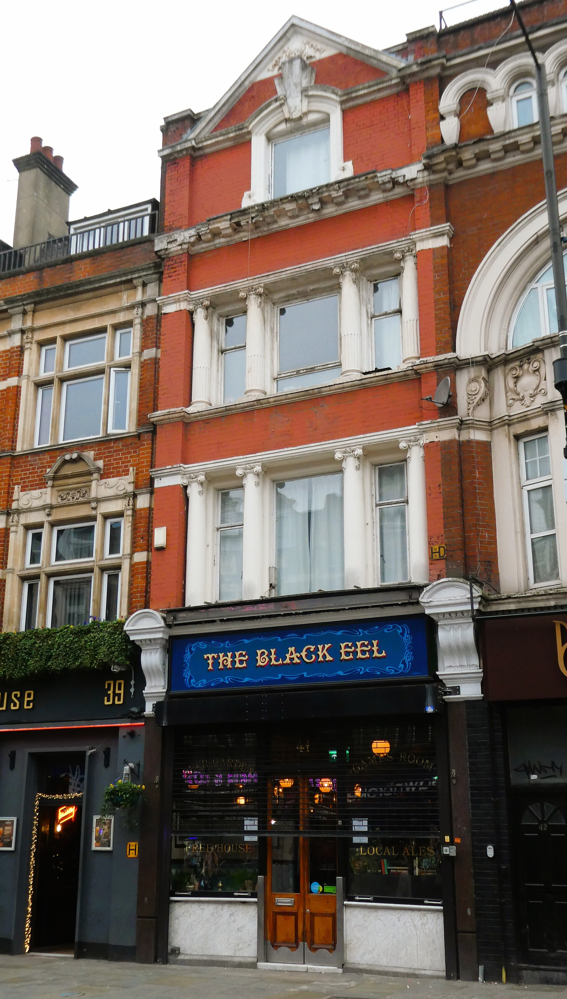
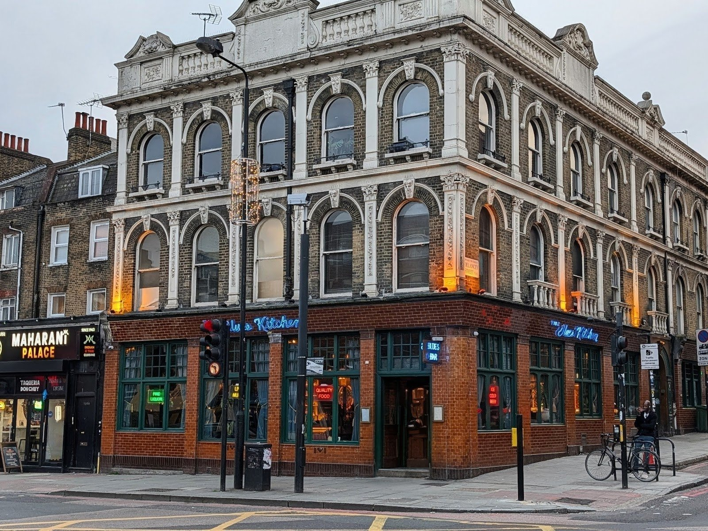
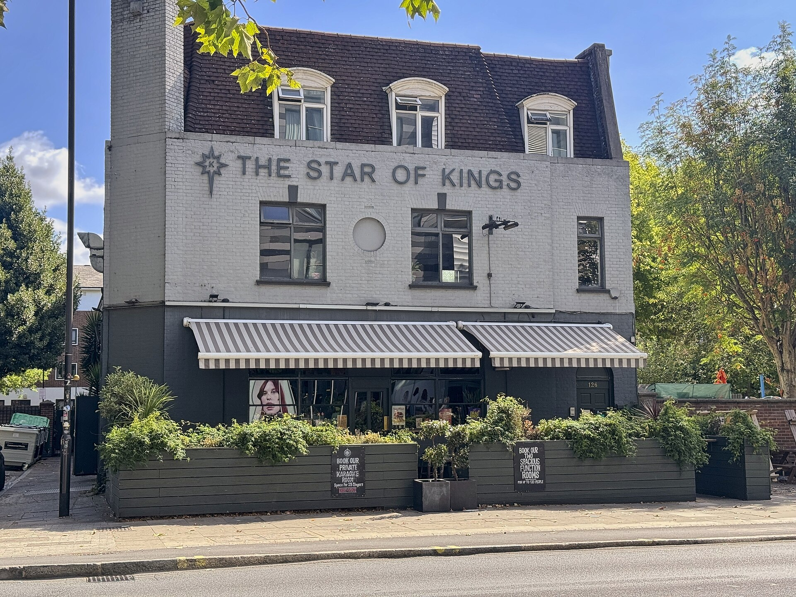

**This guide covers the three ways to sing karaoke in London**: a private room you book for your own group, a KTV room inside an East Asian restaurant, and an open stage in a pub where anyone can put their name down. The private room is what most people mean, and it is where most of the sources' attention goes.

Prices come in three shapes, and they are not comparable at a glance. Some venues charge **per person per hour**, some charge **for the room by the hour**, and BAO and U9 charge **nothing for the room** but set a minimum spend on food and drink. The table below puts them side by side.

> 💡 **The Short Version:** **Lucky Voice** is the most-named karaoke in London, with private rooms in Soho, Holborn and Liverpool Street from £8 a head an hour. **BAM Karaoke Box** in Victoria has 22 themed rooms and an open-mic stage in its bar. Time Out ranks **Rowans**, a 1913 bowling alley in Finsbury Park, number one. **BAO** charges no room fee, just £35 a head on food and drink. **Bloomsbury Lanes** is half price on Sunday, Monday and Tuesday, and **Jihwaja** in Vauxhall is the Korean noraebang, open until 3am at weekends. For free karaoke, **The Star of Kings** runs an open stage every Friday.

> 📊 **The evidence behind this guide.**
> **24 independent sources carrying 221 citations** across **99 named venues**. **42 venues are named by two or more independent sources.**
> **Built on:** Time Out's ranked list; DesignMyNight, The Nudge, Londonist, Secret London, SquareMeal, Hot Dinners, Condé Nast Traveller and others; YouTube and TikTok; and Reddit.
> *Evidence built 8 October 2026 · [How we rank →](/how-we-rank/)*

> ⚠️ **Two Lucky Voice branches closed on 6 October 2026.** Islington and Waterloo shut when the company was sold out of administration; Soho, Holborn and Liverpool Street carry on. Karaoke Box's Smithfield site has closed too, and Soho and Mayfair remain.

## Booking at a glance

* **Book ahead for a Friday or Saturday:** Moyagi says its weekend slots usually go weeks ahead, and it takes payment when you book. BAM, Lucky Voice, BAO and Karaoke Box all book online by the slot.
* **A few days:** the pub rooms — The Star of Bethnal Green, The Star by Hackney Downs, The Old Queen's Head, Bloomsbury Lanes.
* **Walk-ins taken when a room is free:** Bunga 90 (every day except Saturday before 4pm) and Karaoke Epoc.
* **No booking at all:** the open-stage nights at The Star of Kings and the Sebright Arms.
* **Check the day:** Moyagi is closed Monday and Tuesday, U9 on Monday, Lucky Voice Holborn on Sunday and Monday, and The Star by Liverpool Street on Sunday.

## Room size, price and closing time

| Venue | Rooms for | Price | Open until | What it is |
| --- | --- | --- | --- | --- |
| **Lucky Voice** | 2–30 | £8–£14 a head an hour | 3am (Holborn, Thu–Sat) | Soundproofed rooms since 2005, with a Thirsty button for drinks |
| **BAM Karaoke Box** | 1–35 | £45 a head for 2 hours with drinks (package) | 1.30am (Thu–Sat) | 22 themed rooms in Victoria, plus an open-mic stage in the bar |
| **BAO KTV** | 2–23 | No room fee; £35 a head minimum on food and drink | Restaurant hours | Six rooms across five BAO restaurants, with a KTV menu of sharing platters |
| **Moyagi** | 6–30 | £22–£30 a head per 1h45 session | 3am (Fri–Sat) | Japanese-styled boutique rooms off one corridor in Marylebone |
| **All Star Lanes** | up to 14 | £10–£12 a head an hour | Varies by site | Booths beside the bowling lanes at four sites |
| **Rowans** | up to 18 a booth | £28–£80 a room an hour | 2.30am (Fri–Sat) | Six glass-fronted booths in a bowling alley that opened in 1913 |
| **The Star of Bethnal Green** | 6–18 | £4–£13 a head an hour | 2am (Fri–Sat) | Five themed rooms above a Bethnal Green pub |
| **Bloomsbury Lanes** | 8–30 | £60–£120 a room an hour; half price Sun–Tue | — | Five rooms beside the lanes under the Tavistock Hotel |
| **Bunga 90** | 6–10 | From £29 (Mon–Wed) to £79 (Sat) a room for 90 min | 3am (Fri–Sat) | A 1990s-themed bar with three rooms and karaoke at the bar |
| **Karaoke Box** | 2–12 | About £52 an hour for 4, £156 for 12 | 3am (Thu–Sat) | Soho since 1997, Mayfair since 2010 |
| **Jihwaja** | up to 30 | £35–£100 a room an hour by day, £45–£180 in the evening | 3am (Fri–Sat) | Korean restaurant with private noraebang rooms in Vauxhall |
| **Plum Valley** | 6–30 | Room from £70 plus a £200 minimum spend | Restaurant hours | Four rooms above a Chinatown dim sum restaurant; final bill cash only |
| **Karaoke Epoc** | small groups | £7–£13 a head an hour, 2-hour minimum | 11pm | Japanese-style boxes on Brewer Street |
| **The Star of Kings** | open stage | Free | 1am (Fri) | Open karaoke on Fridays, and a private room for 25 |

## Where they are

| If you are near… | Where to sing |
| --- | --- |
| **Soho** | [Lucky Voice](#lucky-voice-soho-holborn-and-liverpool-street) Soho, [Karaoke Box](#karaoke-box-soho-and-mayfair) Soho, [Karaoke Epoc](#karaoke-epoc-soho--japanese-style-boxes), Simmons |
| **Covent Garden & Leicester Square** | [Bunga 90](#bunga-90-covent-garden--1990s-rooms-and-karaoke-at-the-bar), [U9](#u9-leicester-square--suites-on-a-minimum-spend) |
| **Holborn & St Giles** | Lucky Voice Holborn, [SuperStar BBQ](#superstar-bbq-st-giles--one-room-under-a-korean-grill), All Star Lanes Holborn |
| **Chinatown** | [Plum Valley](#plum-valley-chinatown--four-rooms-above-the-dim-sum) |
| **Marylebone & Mayfair** | [Moyagi](#moyagi-marylebone--japanese-styled-rooms-off-one-corridor), Karaoke Box Mayfair, BAO Marylebone |
| **Bloomsbury & King's Cross** | [Bloomsbury Lanes](#bloomsbury-lanes-bloomsbury--rooms-by-the-hour-half-price-three-days-a-week), [The Star of Kings](#the-star-of-kings-kings-cross--free-on-fridays) |
| **Victoria** | [BAM Karaoke Box](#bam-karaoke-box-victoria--22-rooms-and-an-open-mic-stage) |
| **The City & Liverpool Street** | Lucky Voice Liverpool Street, BAO City, [The Star by Liverpool Street](#the-star-by-liverpool-street--six-rooms-in-the-basement) |
| **Shoreditch & Bethnal Green** | [The Star of Bethnal Green](#the-star-of-bethnal-green--five-themed-rooms-a-few-pounds-a-head), [The Cocktail Club](#the-cocktail-club-shoreditch), [The Blues Kitchen](#the-blues-kitchen-shoreditch-brixton-and-camden), [Three Colts Tavern](#three-colts-tavern-bethnal-green), [Sebright Arms](#sebright-arms-bethnal-green--fridays), BAO Shoreditch, All Star Lanes Brick Lane |
| **Hackney, Dalston & Stoke Newington** | [The Black Eel](#the-black-eel-dalston), [The Star by Hackney Downs](#the-star-by-hackney-downs--one-room-upstairs), [Stokey Karaoke](#stokey-karaoke-stamford-hill) |
| **Islington & Finsbury Park** | [The Old Queen's Head](#the-old-queens-head-islington--a-room-with-its-own-host), [Rowans](#rowans-finsbury-park--time-outs-number-one) |
| **London Bridge, Borough & Waterloo** | BAO Borough, [The Old School Yard](#the-old-school-yard-london-bridge), [Molly Mc's](#molly-mcs-waterloo--singing-rooms-in-an-irish-pub) |
| **Vauxhall** | [Jihwaja](#jihwaja-vauxhall--korean-noraebang-until-3am) |
| **Battersea, Clapham & Balham** | BAO Battersea, [The Thieves](#the-thieves-battersea), [Infernos](#infernos-clapham), [The Exhibit](#the-exhibit-balham--a-lucky-voice-suite-south-of-the-river) |

---

## The most backed

Only Time Out ranks London's karaoke, and its number one, Rowans in Finsbury Park, is named by three of the 24 sources. The two places the most sources name are both central private-room operators: Lucky Voice by 14 and BAM by 12. The difference is the brief: Time Out leads with pubs and bowling alleys, while the other lists lead with purpose-built rooms.

### Lucky Voice, Soho, Holborn and Liverpool Street

*Soho: 52 Poland Street, W1F 7NQ · Holborn: 84 Chancery Lane, WC2A 1DL · Liverpool Street: Devonshire Square, EC2M 4YP · Cited by 14 sources · #6 of 14, Time Out · [book a room](https://bookings.luckyvoice.com/)*

*Lucky Voice, Poland Street. Photo: [Ewan Munro](https://commons.wikimedia.org/wiki/File:Lucky_Voice,_Soho,_W1_(7293681070).jpg), [CC BY-SA 2.0](https://creativecommons.org/licenses/by-sa/2.0/).*

**Named by 14 of the 24 sources, more than any other venue here**, from Time Out and Londonist to two YouTube channels and Reddit, where one regular calls it "the longest standing karaoke venue in London". It opened on Poland Street in 2005, and calls itself London's first dedicated private karaoke venue. Each soundproofed room has two microphones and a "Thirsty?" button that brings cocktails and sharing plates to the door, so nobody queues at the bar mid-song.

Soho has nine rooms for two to 15; Holborn, the biggest, has ten rooms, an LED dance floor and DJs at weekends, with one room for 30. **Every booking is two or three hours, at £8 a head an hour off-peak and £11 to £14 at peak**, which starts at 7pm on weekdays. Holborn runs to 3am Thursday to Saturday and is closed Sunday and Monday.

> ⚠️ **Islington and Waterloo closed on 6 October 2026**, when Moyagi Group bought Lucky Voice out of administration. Several lists still name five London branches; three are open.

### BAM Karaoke Box, Victoria — 22 rooms and an open-mic stage

*74 Victoria Street, SW1E 6SQ · Cited by 12 sources · [book a room](https://booking.bam-karaokebox.com/london)*

A Paris karaoke brand that opened in Victoria in April 2024, in the space The Sauce remembers as M Restaurant, and bills itself as Europe's largest premium karaoke venue. **Twelve sources name it**, the most after Lucky Voice; on Reddit it comes up for cheap rooms and two-for-one drinks, and The Date Connoisseur called it her favourite karaoke spot in London.

There are 22 rooms over three floors, each decorated around Nell Gwyn and 18th-century excess, from four-person rooms such as the Library and the Slipper Room up to rooms for 35, with 45,000 songs and in-room games. Food in the BAM BAM Bar is by the chef Sabrina Gidda. **Thursday to Saturday the bar runs open-mic karaoke on its stage**, so you can sing to strangers after your room time ends.

**The hen and stag package is £45 a head for two hours with a drink on arrival and two house drinks, or £62.50 with food**, and in a group of ten the bride or groom goes free. Open until 1.30am Thursday to Saturday and 9pm on Sunday.

### BAO KTV, five restaurants — no room fee

*Borough, the City, Marylebone, Shoreditch and Battersea · Cited by 9 sources · #4 of 14, Time Out · [book a room](https://baolondon.com/bookings/karaoke/)*

The Taiwanese bun restaurants have six private KTV rooms, the East Asian karaoke format where you eat in the room, and **charge no room hire: you spend at least £35 a head on food and drink in a two-hour slot**. Nine sources name it, and a Redditor adds that you don't mind the minimum "when the food is that good".

The rooms each take a film for a theme. The City has two: the Taipei Room, 13 to 23 people, with a wrap-around LED screen after Edward Yang's *Taipei Story*, and the New York Room for up to 12, which switches between dining and karaoke mode. Borough's red Paris, Texas Room was the first and takes 16; Marylebone's Hong Kong Room, after *In the Mood for Love*, takes 10. **Order from the KTV menu of mini baos and xiao chi platters**, or pre-order the set so the food arrives through the session.

### Moyagi, Marylebone — Japanese-styled rooms off one corridor

*5 Cavendish Place, W1G 0QA · Cited by 8 sources · [book a room](https://moyagi.com/london/book)*

A Swedish karaoke brand that opened its London rooms in March 2024 behind Oxford Circus, and since October 2026 the owner of Lucky Voice too. The Nudge describes eight private rooms off "one beautifully moody, glowing corridor"; Country & Town House compares it to a members' club. On Reddit two Londoners single out the drinks.

Rooms take six to 30, with 200,000 songs, a host and drinks served to the room; a separate bar, the Hidden Bar, is open to people who are not singing. **A session is 1 hour 45 minutes at £22 to £30 a head**, cheapest early on Wednesday or Sunday and dearest late on Thursday to Saturday, and food and drink are extra.

**Closed Monday and Tuesday. You pay when you book, and Friday and Saturday slots usually go weeks ahead**, by Moyagi's own account. Free cancellation ends 72 hours before.

### All Star Lanes, four bowling alleys

*Brick Lane, Holborn, Stratford and White City · Cited by 8 sources · #12 of 14, Time Out · [book a booth](https://www.allstarlanes.co.uk/play/karaoke)*

A 1950s-styled bowling chain with American diner food, where the karaoke booths sit beside the lanes. Eight sources name it, from Time Out to LondonWorld, mostly as the cheaper way to book a room for a group that also wants to bowl.

**Booths are £10 a head an hour off-peak and £12 at peak**, booked by the hour. Brick Lane and Stratford have two booths each for up to 14, White City two for up to 12, and Holborn one for seven, so a group of more than seven at Holborn needs another site. Drinks are served in the booth.

### Rowans, Finsbury Park — Time Out's number one

*10 Stroud Green Road, N4 2DF · Cited by 3 sources · #1 of 14, Time Out · [booking request](https://rowans.co.uk/karaoke/)*

*Rowans, Finsbury Park. Photo: [Tom Page](https://commons.wikimedia.org/wiki/File:Rowans_Tenpin_Bowl_2025-02-16.jpg), [CC BY-SA 2.0](https://creativecommons.org/licenses/by-sa/2.0/).*

**Time Out's number one**, and its pick for "getting messy": a bowling alley open since 1913 with "a private-ish karaoke booth (glass windows mean everyone can see you, even if they can't hear you)". There are six booths, together taking groups of up to 50, beside the lanes, pool tables and a dance floor.

**The room is charged by the hour, not by the head: £28 on weekday daytimes, £38 at weekend daytimes, £50 Sunday to Thursday evenings and £80 on Friday and Saturday evenings**, when bookings are capped at two hours. A 50% deposit holds it. Open until 2.30am on Friday and Saturday; **only over-21s are admitted after 7pm**, with photo ID.

---

## Also strongly backed

### The Old Queen's Head, Islington — a room with its own host

*44 Essex Road, N1 8LN · Cited by 6 sources · #11 of 14, Time Out · [booking form](https://theoldqueenshead.com/parties-group-bookings/)*

*The Old Queen's Head. Photo: [Ewan-M](https://commons.wikimedia.org/wiki/File:Old_Queen%27s_Head,_Islington,_N1.jpg), [CC BY-SA 4.0](https://creativecommons.org/licenses/by-sa/4.0/).*

A late-licence pub on Essex Road whose upstairs karaoke room takes 15, with **its own host serving drinks and pizza**, so nobody leaves the room to get a round in. The food is Hot Saint pizza. For bigger groups the Playroom takes 60, with beer pong, karaoke, its own sound system and a private bar. Six sources name it.

**Room hire is free Sunday to Tuesday in October and November 2026**; book through the form. The pub is open until 2am on Friday and 3am on Saturday.

### The Star of Bethnal Green — five themed rooms, a few pounds a head

*359 Bethnal Green Road, E2 6LG · Cited by 6 sources · [karaoke rooms](https://starofbethnalgreen.co.uk/karaoke/)*

*The Star of Bethnal Green. Photo: [Ewan-M](https://commons.wikimedia.org/wiki/File:Star_of_Bethnal_Green,_Bethnal_Green,_E2.jpg), [CC BY-SA 2.0](https://creativecommons.org/licenses/by-sa/2.0/).*

An East End party pub whose karaoke grew into five themed rooms the pub calls Karaoke Heaven, on a Lucky Voice system: Studio 54 for 18, the Viper Room and the Love Heart Room for 15, the Wild Room for eight and the Rainbow Room for six. The Sauce went for its piece and found the rooms freshly done out. Food comes from the pub's Peck Peck kitchen.

**Rooms start at £4 a head an hour: £4 to £10 off-peak and £6 to £13 at peak**, which starts at 6pm (5pm on Saturday), with Sunday and Monday cheapest and Saturday dearest. Rooms book in one- or two-hour slots for two to 25 people, two hours minimum on Saturday. Open until 2am on Friday and Saturday.

### Bloomsbury Lanes, Bloomsbury — rooms by the hour, half price three days a week

*Basement, Tavistock Hotel, Bedford Way, WC1H 9EU · Cited by 5 sources · #10 of 14, Time Out · [book a room](https://bloomsburybowling.com/book-now)*

A basement bowling alley under a hotel, with an American diner and five karaoke rooms beside the eight lanes, each with a big screen, banquettes and a hand-picked library of 30,000 songs. The Sauce likens the set-up to "a student union circa year 2000"; on Reddit someone held a 30th there and says it "does the job".

**Rooms are hired by the hour, not the head: £60 for eight to ten people, up to £120 for 21 to 30, and half price on Sunday, Monday and Tuesday.** For twelve people off-peak that is about £3 a head an hour. Card only, no under-18s after 8pm (7pm on Friday and Saturday), and no refunds, though a booking can be moved with 72 hours' notice.

### The Exhibit, Balham — a Lucky Voice suite south of the river

*12 Balham Station Road, SW12 9SG · Cited by 5 sources · [book the suite](https://book.theexhibit.co.uk/)*

A Balham bar, restaurant and cinema with one karaoke suite running the Lucky Voice system and its 10,000 songs; The Nudge notes the seating faces the screen like an audience. Five sources name it, all as the south London alternative to the central rooms.

The suite takes groups for packages with drinks and food from the bar. **It is open until 2am on Friday and Saturday, and on Monday and Tuesday it is private hire only.** Wednesday and Sunday close at 11pm.

### Bunga 90, Covent Garden — 1990s rooms and karaoke at the bar

*167 Drury Lane, WC2B 5PG · Cited by 5 sources · #5 of 14, Time Out · [book a room](https://www.bunga90.com/karaoke/)*

The old Bunga Bunga site, relaunched in September 2025 as a 1990s bar you enter through a mock video-rental shop. Time Out notes karaoke "in various spaces", from the main bar to a set-up in the toilet lobby; several lists still call it Bunga Bunga.

Three private rooms — Mel B's for six, Mark's for eight and Gwen's for ten — are booked for 90 minutes with pizza and cocktails sent in. **A room costs from £29 Monday to Wednesday, £39 on Thursday and Sunday, £69 on Friday and £79 on Saturday**, and the bar is open until 3am on Friday and Saturday. **Walk-ins are taken every day except Saturday before 4pm.**

### The Star by Hackney Downs — one room upstairs

*35 Queensdown Road, E5 8NN · Cited by 5 sources · #2 of 14, Time Out · [karaoke room](https://starbyhackneydowns.co.uk/karaoke/)*

**Time Out's number two**: "a somewhat scruffy but deeply charming pub" by Hackney Downs with one karaoke room upstairs for 15, where the staff bring pints up. The kitchen is Dragon Flame BBQ, and the pub's drinks packages save trips downstairs.

**The room is £49 an hour Sunday to Wednesday, £69 on Thursday and £109 on Friday and Saturday**, with 50% off on Fridays until 22 November 2026. Over-18s only after 8pm; open until 1am on Friday and Saturday.

### The Star by Liverpool Street — six rooms in the basement

*94 Middlesex Street, E1 7EZ · Cited by 5 sources · #13 of 14, Time Out · [karaoke rooms](https://starbyliverpoolstreet.co.uk/karaoke-liverpool-street/)*

The same group's City pub, with the karaoke downstairs: the Disco and Star Rooms for eight, the Gold and Jungle Rooms for ten, and bigger rooms up to the Backstage Bar, for groups from eight to 50 in all, with 20,000 songs. Burgers come from the pub's Patty & Bun kitchen, and there is a karaoke bottomless brunch.

**£4 to £9 a head an hour off-peak and £6 to £14 at peak**, with a two-hour minimum on Saturday. Over-18s only after 8pm. **Closed on Sunday**; open until 1am Thursday to Saturday.

### Karaoke Box, Soho and Mayfair

*Soho: 18 Frith Street, W1D 4RF · Mayfair: Basement, 14 Maddox Street, W1S 1PQ · Cited by 5 sources · #14 of 14, Time Out · [book a room](https://karaokebox.co.uk/book.php)*

By its own account the UK's first private karaoke booths, open on Frith Street, next door to Ronnie Scott's, since 1997; the Mayfair basement on Maddox Street followed in 2010. The Nudge calls it "no-frills but endlessly dependable". **Time Out's entry was the Smithfield branch, which has closed**; the two West End sites carry on under the same management.

Rooms take two to 12 and are charged for the room. **An evening slot costs £104 for two hours in a four-person room and £312 in a twelve-person room, the same on a Tuesday as a Saturday**; afternoon slots are cheaper. Bookings are two or three hours. Both sites stay open until 3am Thursday to Saturday.

---

## KTV and noraebang: karaoke inside a restaurant

KTV is the East Asian format: a private room in or next to a restaurant, with food served to the room and songs in Korean, Mandarin, Cantonese and Japanese as well as English. In Korea it is called noraebang, "song room". [BAO](#bao-ktv-five-restaurants--no-room-fee) is the best-known London version, and the [Korean restaurants guide](/articles/best-korean-restaurants-london/) covers the grills around these rooms.

### Jihwaja, Vauxhall — Korean noraebang until 3am

*353A Kennington Lane, SE11 5QY · Cited by 4 sources · [booking page](https://www.jihwaja.co.uk/booking)*

A Korean restaurant whose own site explains noraebang to newcomers, with private rooms for four to 30 and lyrics in English, Korean, Chinese and Japanese. The Infatuation calls it a place for "fried chicken and warbling" and says "it's about the karaoke too"; two Reddit threads recommend it for KTV.

**Rooms are priced by size and time: £35 an hour for up to four at lunch, £45 in the evening, rising to £180 an hour for 26 to 30**, with 10% added on Thursday and Friday nights and all day at weekends. Open until 3am on Friday and Saturday and 1am on Thursday; Sunday is evenings only.

### Plum Valley, Chinatown — four rooms above the dim sum

*20 Gerrard Street, W1D 6JQ · Cited by 4 sources · [karaoke rooms](https://plumvalley.co.uk/karaoke-room-hire/)*

A Cantonese restaurant serving dim sum all day, with four karaoke rooms upstairs where food and drink come to the room. SquareMeal and Country & Town House both list it; on Reddit "the rooms are decent and you can order food + drinks".

Each booking is a room fee plus a minimum spend: **two hours in K3, for six to eight, is £70 plus £200 on food and drink**, and K4, for 13 to 30, is £250 plus £750 for three hours. A deposit secures it; **the final bill is cash only**, with 12.5% service.

### Karaoke Epoc, Soho — Japanese-style boxes

*30 Brewer Street, W1F 0SS · Cited by 3 sources · [book a room](https://epoclondon.com/reserve/)*

Londonist calls it "as authentic experience as you're going to get on this side of the globe": a Japanese karaoke box with a large Japanese, Korean and Chinese catalogue — its own most-sung list starts with Ikimonogakari's "Blue Bird" and Kenshi Yonezu's "Lemon" — plus yakitori and highballs. On Reddit, "my Japanese friends love EPOC".

**£7 to £10 a head an hour before 4pm and £10 to £13 after, two hours minimum**, with no booking fee. Walk-ins are taken when a room is free, at separate walk-in prices and for an hour. **It closes at 11pm every night.**

### U9, Leicester Square — suites on a minimum spend

*47 Whitcomb Street, WC2H 7DH · Cited by 2 sources · [private rooms](https://www.u9-london.com/private-roomsu9)*

A basement karaoke bar opened in 2025 with nine suites for ten to 35, 450,000 songs, East Asian food and a lounge for 120 with a DJ. The Nudge describes it as "spacecraft-meets-speakeasy".

**There is no room fee; each suite carries a minimum spend on food and drink**, set by room, day and session, and a deposit comes off it. It rises 30% from late November through December. **Closed Monday**; open until 3am Thursday to Saturday. Bring photo ID: it is scanned at the door.

### SuperStar BBQ, St Giles — one room under a Korean grill

*4 Central St Giles Piazza, WC2H 8AB · Cited by 1 source · [karaoke room](https://www.superstarbbq.co.uk/karaoke)*

A Korean barbecue restaurant with one wood-clad karaoke room underneath for up to 14, with English, Korean and Japanese songs. There is no dining in the room, only drinks and a short list of sides, so eat upstairs first. Hot Dinners lists it.

**The room is a flat fee: £70 an hour Monday to Wednesday and £100 Thursday to Sunday.** Book by form; the restaurant closes at 10pm.

---

## Pub and bar rooms

### The Black Eel, Dalston

*41 Kingsland High Street, E8 2JS · Cited by 2 sources · #3 of 14, Time Out · [the pub's site](https://www.theblackeel.uk/)*

*The Black Eel, Dalston. Photo: [Ewan-M](https://commons.wikimedia.org/wiki/File:Black_Eel,_Dalston,_E8.jpg), [CC BY-SA 4.0](https://creativecommons.org/licenses/by-sa/4.0/).*

**Time Out's number three**: Exale Brewery's pub in the Grade II-listed F Cooke pie and mash shop, with the karaoke room at the top of the building. The Infatuation describes the décor as "Pat Butcher party girl"; the pub's own page lists a leopard-print carpet, a stage and 140,000 songs for up to 25. **It is up a flight of stairs**, and prices are set in the booking system.

### The Cocktail Club, Shoreditch

*Unit 12, 29 Sclater Street, E1 6HR · Cited by 3 sources · [karaoke packages](https://www.thecocktailclub.com/bars/shoreditch/occasions/karaoke)*

A cocktail bar off Brick Lane with one private karaoke room and a bartender assigned to it. **Bookings start at ten people, at £10 a head an hour**, and packages from £15 a head add a glass of prosecco and a cocktail. Condé Nast Traveller lists jam-jar daiquiris and espresso martinis among the drinks sent to the room, and Londonist notes the disco-ball wallpaper. The bar is open until 1.30am, and the room books through the form on the karaoke page.

### The Blues Kitchen, Shoreditch, Brixton and Camden

*Shoreditch: 134–146 Curtain Road, EC2A 3AR · Cited by 3 sources · [karaoke rooms](https://theblueskitchen.com/shoreditch/bookings/)*

*The Blues Kitchen, Camden.*

A bar and barbecue kitchen with live blues, soul and funk most nights and private karaoke rooms at its sites; the Shoreditch Playroom takes 30 with its own sound system and server. **Karaoke room hire is free Sunday to Tuesday in October and November 2026**, by enquiry. The [dinner and a show guide](/articles/dinner-and-a-show-london/) covers its music.

### Simmons, eight bars

*Soho, Greek Street, Leicester Square, King's Cross, Old Street, Oxford Street, Liverpool Street and Monument · Cited by 3 sources · [karaoke rooms](https://www.simmonsbar.co.uk/event/karaoke/)*

A late-night bar chain with happy hours and private karaoke rooms in several branches and 50,000 songs: **Soho's room takes 25; Old Street's takes five, from £5 a head**; and Oxford Street has a karaoke recording studio for 15. Condé Nast Traveller and DesignMyNight name it for happy-hour drinks.

### The Old School Yard, London Bridge

*111 Long Lane, SE1 4PH · Cited by 3 sources · [the bar's site](https://theoldschoolyard.com/)*

A school-themed cocktail bar with five karaoke rooms downstairs for two to 20. **Two-hour sessions start at 5.45pm, 8pm and 10.15pm**, and either cost £10 a head (Tuesday and Wednesday) or £15 (Thursday to Saturday) for up to eight, or a flat £100 or £150 for nine or more. Bookings are online only.

### Molly Mc's, Waterloo — singing rooms in an Irish pub

*96 Isabella Street, SE1 8DD · Cited by 2 sources · [the pub's site](https://mollymcs.com/)*

An Irish pub under the railway arches whose singing rooms are named from the owners' family story, with salvaged wallpaper and wood panelling: Slim's upstairs is the smallest, for up to four, and the largest takes ten to 15. **The kitchen is Thai**, and there is live trad music Thursday to Saturday.

### Three Colts Tavern, Bethnal Green

*199 Cambridge Heath Road, E2 0EL · Cited by 2 sources · #7 of 14, Time Out · [party bookings](https://www.threecoltstavern.co.uk/party)*

**Time Out's pick for a private party**: Exale's other pub, whose Glue Factory room has a karaoke set-up, a self-serve private bar, disco balls and a mirrored ceiling, for up to 80. Karaoke may cost extra. The pizza is Short Road's Romana-style thin crust with American toppings, and the room is booked as a private hire through the pub's party enquiry form.

### The Thieves, Battersea

*51 Lavender Gardens, SW11 1DJ · Cited by 2 sources · [the pub's site](https://www.thethieves.pub/)*

The old Four Thieves, reopened as The Thieves in October 2025 with arcade games, darts, pool and private karaoke booths it calls Singpods. The kitchen's dish is chicken parmigiana, two for £20 on Tuesdays from 5pm to 9pm, and there is live music, DJs and comedy on other nights. Book a pod on the pub's booking page.

### Stokey Karaoke, Stamford Hill

*20 Stamford Hill, N16 6XZ · Cited by 1 source · #9 of 14, Time Out · [the venue's site](https://www.stokeykaraoke.com/)*

**Time Out's number nine**: an independent basement venue, the old Cotton Club, still run by the same family, with props and fancy dress and room for up to 60. **Two hours start at £125 and three hours at £175, two hours minimum**, booked by email through the site. It is the one room on this page priced for a whole party rather than a table of friends.

### Infernos, Clapham

*146 Clapham High Street, SW4 7UH · Cited by 3 sources · [the club's site](https://www.infernos.co.uk/)*

A two-floor nightclub with private karaoke suites, where a pre-booked suite comes with drinks ordered in advance and **queue-jump entry before midnight**. Country & Town House notes the suites are booked from 10pm to 3am, for groups of 15 or 30, and everyone in the room needs club entry too. Book it for the end of a night out, not the start.

### More rooms named by two sources

* **[Colours Hoxton](https://colourshoxton.com/karaoke-shoreditch-london/)**, 2–4 Hoxton Square — one room for up to 30, £50 an hour Monday to Thursday and £75 Friday and Saturday. Cited by 2 sources.
* **[Boom Battle Bar](https://boombattlebar.com/uk/london-oxford-street/battleground/karaoke/)**, Oxford Street and other sites — Boom Box karaoke booths with 100,000 songs, £33 a head; minimum six people Thursday to Saturday. Cited by 2 sources.
* **[Peckham Levels](https://peckhamlevels.org/karaoke/)**, 95a Rye Lane — one private room with 80,000 songs, booked in one- or two-hour slots at a per-head rate. Cited by 2 sources.
* **[HUCKSTER](https://hucksterlondon.co.uk/karaoke/)**, 4 Kingdom Street, Paddington — private karaoke rooms for up to 45, with a table for drinks afterwards. Cited by 2 sources.
* **[Bow Street Tavern](https://www.bowstreettavern.com/karaoke)**, Covent Garden — a Young's pub with its karaoke room on the fourth floor and a rooftop bar. Cited by 2 sources.

---

## Open-stage karaoke: sing to the whole room

### The Star of Kings, King's Cross — free on Fridays

*126 York Way, N1 0AX · Cited by 2 sources · [open karaoke](https://starofkings.co.uk/whats-on/open-karaoke/)*

*The Star of Kings. Photo: [Bex Walton](https://commons.wikimedia.org/wiki/File:Star_of_Kings,_King%27s_Cross_2026-08-22.jpg), [CC BY 4.0](https://creativecommons.org/licenses/by/4.0/).*

**Free open karaoke every Friday from 8pm to 1am** in a pub by the King's Cross development; Reddit also points here for Rockaoke, karaoke with a live band, on some nights. The pub has a private karaoke room for 25 as well, at £49 to £109 an hour. Over-18s only after 8pm.

### Sebright Arms, Bethnal Green — Fridays

*31–35 Coate Street, E2 9AG · Cited by 2 sources · [the pub's site](https://www.sebrightarms.com/)*

A back-street pub with Yard Sale pizza and club nights, running **Sebright Karaoke every Friday**, open until 2am. Named on Reddit for public karaoke and listed by DesignMyNight.

**BAM's bar** in Victoria has open-mic karaoke Thursday to Saturday, and **Bunga 90** has karaoke at the bar as well as its rooms; both are described above.

---

## Cheapest

* **[The Star of Bethnal Green](#the-star-of-bethnal-green--five-themed-rooms-a-few-pounds-a-head)** — from £4 a head an hour off-peak on Sunday and Monday. Cited by 6 sources.
* **[Bloomsbury Lanes](#bloomsbury-lanes-bloomsbury--rooms-by-the-hour-half-price-three-days-a-week)** — half price Sunday to Tuesday, about £3 a head an hour for a group of twelve. Cited by 5 sources.
* **[Karaoke Epoc](#karaoke-epoc-soho--japanese-style-boxes)** — from £7 a head an hour before 4pm. Cited by 3 sources.
* **[Lucky Voice](#lucky-voice-soho-holborn-and-liverpool-street)** — £8 a head an hour off-peak. Cited by 14 sources.
* **[The Old Queen's Head](#the-old-queens-head-islington--a-room-with-its-own-host)** and **[The Blues Kitchen](#the-blues-kitchen-shoreditch-brixton-and-camden)** — free room hire Sunday to Tuesday through November 2026.
* **[The Star of Kings](#the-star-of-kings-kings-cross--free-on-fridays)** and **[Sebright Arms](#sebright-arms-bethnal-green--fridays)** — free on Fridays, on stage.

## Late

* **Lucky Voice Holborn** — until 3am Thursday to Saturday. Cited by 14 sources.
* **Karaoke Box**, Soho and Mayfair — until 3am Thursday to Saturday. Cited by 5 sources.
* **Moyagi** — until 3am Friday and Saturday. Cited by 8 sources.
* **Jihwaja** — until 3am Friday and Saturday. Cited by 4 sources.
* **U9** — until 3am Thursday to Saturday. Cited by 2 sources.
* **Bunga 90** — until 3am Friday and Saturday. Cited by 5 sources.
* **Rowans** — until 2.30am Friday and Saturday, over-21s after 7pm. Cited by 3 sources.

## Gone, and still on the lists

* **Lucky Voice Islington and Waterloo** closed on 6 October 2026.
* **Karaoke Box Smithfield** closed in the company's restructuring in summer 2026.
* **The Karaoke Hole**, the drag-hosted bar under Voodoo Ray's in Dalston, closed in January 2026.
* **Mama Shelter**'s karaoke rooms on Hackney Road went when the hotel closed on 1 February 2026.

---

## Continue planning your London trip

- 🎯 **[Competitive Socialising in London](/articles/competitive-socialising-london/)** — darts, golf and the other games bars, several with karaoke
- 👰 **[Hen Do in London](/articles/hen-do-london/)** — karaoke packages and the rest of the weekend
- 🍻 **[Stag Do in London](/articles/stag-do-london/)**
- 🇰🇷 **[The Best Korean Restaurants in London](/articles/best-korean-restaurants-london/)** — the grills around the noraebang rooms
- 🌙 **[Late-Night Eating in London](/articles/late-night-eating-london/)** — for after the room time ends
- 🎭 **[Dinner and a Show in London](/articles/dinner-and-a-show-london/)**
- 🍸 **[The Best Cocktail Bars in London](/articles/best-cocktail-bars-london/)**
- 🎨 **[Soho Area Guide](/articles/soho-area-guide/)**
- 🛹 **[Shoreditch Area Guide](/articles/shoreditch-area-guide/)**
- 🌿 **[Hackney Area Guide](/articles/hackney-area-guide/)**
- 🏛️ **[Covent Garden Area Guide](/articles/covent-garden-area-guide/)**
