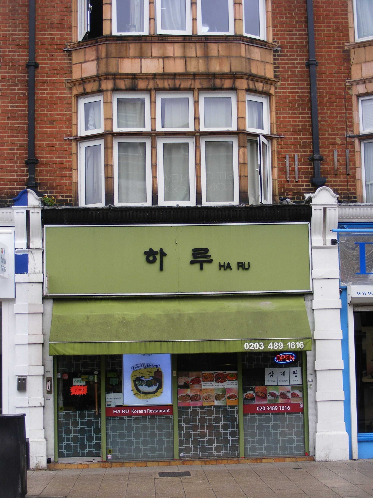
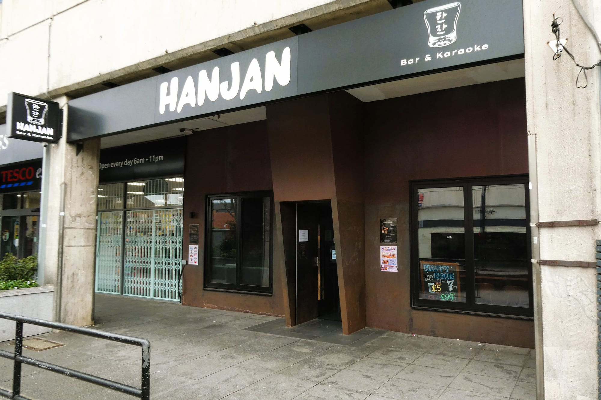
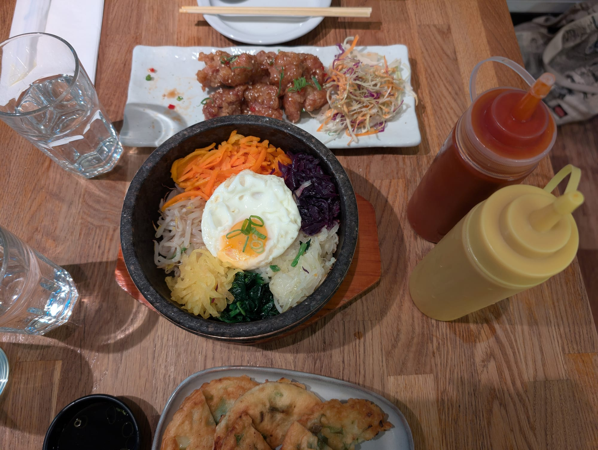

The best Korean food in London is not really in London. **New Malden has one of the largest Korean communities in Europe** — around 10,000 people in the town itself and up to 20,000 across the surrounding area — and three of its streets have the grills, supermarkets and bakeries to match. It is about thirty minutes from Waterloo.

Central London has caught up in the last few years, and one Hackney kitchen was recently named the best restaurant in the entire city.

> 💡 **The Short Version:** **Jin Go Gae** in New Malden uses real charcoal, which is why purists go. **Imone** is the home cooking everyone sends you to. **You Me** has been there since 1988. **Chick and Beers** does the fried chicken. **Seoul Bakery** in Bloomsbury is the cheap central one, and **Mukbap** is London's first fully vegan Korean kitchen.

> 📊 **The evidence behind this guide**
> Nothing here is ranked on one visit. This pass reads **10 sources carrying 130 citations** across **82 named restaurants**. **18 restaurants are named by two or more independent sources; 2 hold a Michelin star.**
> **Built on:** where Korean London actually is. Nearly half these sources point at one high street in New Malden, and the counts show it.
> *Evidence rebuilt 30 August 2026 · [How we rank →](/how-we-rank/)*

## Where they are

| If you are near… | Where to eat |
| --- | --- |
| **New Malden** | Jin Go Gae, Imone, You Me, Cah Chi, Seoul Matjib, Chick and Beers, Tongdak |
| **Bloomsbury** | Seoul Bakery |
| **Shoreditch** | Mukbap |
| **Finsbury Park** | Dotori |
| **Soho & Chinatown** | Olle, Chung'dam, Pochawa Grill |
| **Hackney** | Miga |
| **Canary Wharf** | Sagye |

**Price guide:** **££** £15–£35 · **£££** £40–£70 · **££££** £90+.

---

## New Malden

Thirty minutes from Waterloo, and the reason to make the trip.

The restaurants run along **three streets** rather than one: New Malden High Street, Burlington Road and Kingston Road. Thirty minutes from Waterloo, and the reason to make the trip.

### Jin Go Gae, Burlington Road

*£££ · charcoal, not gas* · Cited by 4 sources

**Real charcoal rather than gas**, which is the purist's choice in a town full of Korean grills — the smoke gets into the meat, the fat renders differently, and everyone in New Malden can taste which shops have made the switch and which have not.

Table barbecue is the format: **galbi** — marinated short rib — and pork belly grilled in front of you, with the full **banchan** spread of kimchi, pickles and namul arriving unasked and refilled free. The stews behind the grill are worth ordering as well as it.

**£££, book a few days ahead** for a weekend table. Named by four independent sources, more than either of London's Michelin-starred Korean restaurants.

*New Malden has one of the largest Korean communities in Europe, and its high street reflects it. Photo: [sludgegulper](https://commons.wikimedia.org/wiki/File:Korean_Restaurant,_New_Malden_KT3.jpg), [CC BY-SA 2.0](https://creativecommons.org/licenses/by-sa/2.0/).*

### Imone, New Malden High Street

*££ · family-run* · Cited by 4 sources

**A small family-run room on New Malden high street**, and the one locals send you to — strong on seafood, and with **halal chicken options** that most Korean kitchens do not offer.

Seafood is what distinguishes it: **haemul pajeon**, the seafood and spring onion pancake, cooked crisp at the edges, and stews built on squid and prawn rather than pork. The banchan spread is generous and changes with what has been made that day.

**££, book a few days ahead** — it is small and it fills with people who live nearby rather than with visitors.

> Note that **Imone BBQ next door is a separate, newer venue** — a dedicated grill room. Easy to book the wrong one.

### You Me, Burlington Road

*££ · trading since 1988*

One of the plainer New Malden rooms, and the sort of place that exists for the Korean community rather than for a guide — no styling, no English-first menu, and a following built entirely on word of mouth.

Grilled meats at the table and a long list of **jjigae** — the bubbling stews that arrive still boiling — with **banchan** refilled without asking. Order the stews rather than the barbecue if you want to know why people come.

**Walk-in, cheap.** Burlington Road, a few minutes from New Malden station, and busiest at weekends when the whole street is.

### Cah Chi, Kingston Road

*££ · long-standing local favourite* · Cited by 2 sources

One of the **oldest Korean restaurants in New Malden**, family-run and considerably plainer than the newer grills — the room people go to for the stews rather than the barbecue.

**Sundubu jjigae** — soft tofu stew, arriving at the table still boiling — and **jeon**, the savoury pancakes, are the orders. The **yukhoe** beef tartare is still on the menu, which not every New Malden kitchen bothers with. Barbecue exists and is not the point.

**Walk-in and cheap.** A short bus or walk from New Malden station. The one to pick for Korean home cooking rather than a table grill.

### Seoul Matjib, Burlington Road

*££ · drinking food* · Cited by 2 sources

**Tteokbokki with exactly the right chew, served without ceremony** — the New Malden room people go to when they want feeding rather than impressing.

**Tteokbokki** is the signature: cylindrical rice cakes in a sweet-hot gochujang sauce, and the whole dish turns on the texture of the cake — too soft and it is porridge, too firm and it is rubber. This kitchen gets it right. Fried snacks and stews alongside.

**££, walk-in, closed Monday.** Small, plain and quick; it is a snack shop as much as a restaurant.

### Chick and Beers, Burlington Road

*£ · Korean fried chicken* · Cited by 4 sources

**Family-owned, double-fried, and widely held to be the best Korean fried chicken in London** — in the middle of New Malden's Koreatown rather than in town, which is why it stays honest.

**Double-frying** is the technique and the point: the chicken is fried, rested, then fried again, which drives out the moisture between skin and meat and leaves a shell that stays crisp under sauce. Order it plain and in the **yangnyeom** sweet-hot glaze to compare the two.

**££, walk-in, closed Monday.** Named by four independent sources. Beer is the accompaniment the name promises and the correct one.

### Tongdak, Kingston Road

*£ · fried chicken* · Cited by 1 source

**A New Malden chicken specialist that trades almost entirely on the Korean community's own recommendation** rather than on guides — which is a stronger signal than a listing.

Korean fried chicken done the same double-fried way as its neighbours, in plain, soy-garlic and **yangnyeom** versions, plus the pickled radish that always comes with it and cuts the fat. A takeaway counter more than a dining room.

**££, walk-in.** Order ahead by phone at peak; the frying takes as long as it takes and they will not rush it.

---

Powered by <a target="_blank" rel="sponsored" href="https://www.getyourguide.com/london-l57/">GetYourGuide</a>

## Central

*Burlington Road and the High Street carry most of it — the train from Waterloo takes about half an hour. Photo: [Ewan-M](https://commons.wikimedia.org/wiki/File:HanJan,_New_Malden,_KT3.jpg), [CC BY-SA 4.0](https://creativecommons.org/licenses/by-sa/4.0/).*

### Olle, Soho

*£££ · 3 min from Leicester Square* · Cited by 3 sources

**Table grills in the middle of Soho**, so the New Malden format without the forty-minute train — which is the entire argument for it and a reasonable one.

Charcoal barbecue at the table: **marinated galbi**, pork belly and brisket cooked in front of you, with **banchan** and lettuce leaves to wrap it in. The kitchen also runs stews and **bibimbap** for anyone not grilling.

**£££, book a few days ahead**, three minutes from Leicester Square. The extraction is better than most central Korean rooms, so you leave smelling of less than you would in New Malden.

### Pochawa Grill, Chinatown

*£££ · 3 min from Piccadilly Circus* · Cited by 2 sources

**A neon-pink Korean pub format dropped into Chinatown** — a *pojangmacha*, the street-tent drinking spot, rebuilt indoors. You grill at the table and the room is built for a night rather than a meal.

Barbecue at the table, and the drinking food that goes with it: **fried chicken, tteokbokki** and stews, eaten alongside soju and beer. Loud, bright, and busy until late.

**£££, book a few days ahead** at weekends. Come as a group and expect to stay; two people eating quietly are in the wrong room.

### Chung'dam, Soho

*££££ · 2 min from Leicester Square* · Cited by 1 source

**Named for Seoul's Cheongdam-dong** — the district that is to Seoul what Mayfair is to London — and priced accordingly. The most polished Korean room in central London.

The thing to order is the **pyeonbaek steam box**: a three-tiered wooden steamer of prawns, mussels and brisket cooked over hot stones and brought to the table sealed, then opened in front of you. Table barbecue and a proper wine and soju list behind it.

**££££, closed Sunday, and it books weeks ahead.** The occasion Korean restaurant rather than the everyday one.

---

## Elsewhere

### Miga, Hackney

*£££ · 4 min from Cambridge Heath* · Cited by 1 source

A family-run kitchen that **moved from New Malden to Hackney in 2024** and was promptly named Time Out's best restaurant in London — the clearest sign that Korean cooking in this city has stopped being a suburban speciality.

The dish everyone writes about is the **yukhwe beef tartare with crisp Asian pear** — raw beef, sesame and egg yolk, with the sweet-sharp pear cutting through it. Behind it the family's New Malden repertoire: stews, pancakes and banchan made properly rather than scaled down for a Hackney audience.

**£££, closed Monday, and it books months ahead.** Small room; book the moment you decide.

### Sagye, Canary Wharf

*£££ · 13 min from Mudchute*

**Korean cooking on the Isle of Dogs rather than in the Wharf itself** — a mile south of the office towers and all the better for it, with prices to match the distance.

**Kimchi jjigae** is the order and the way it is served is the point: portioned out between bowls for a big table rather than served individually, which is how it is eaten at home. Grills and banchan around it.

**£££, book a few days ahead.** Worth the walk from Canary Wharf; nothing in the estate itself comes close.

---

### Seoul Bakery, Bloomsbury

*£ · 14 Great Russell Street · cash-friendly* · Cited by 2 sources

Tiny, graffiti-covered, plastered in K-pop memorabilia, and **the cheapest proper Korean food in central London**. Kimchi fried rice and seafood pancake, family-run for about nineteen years, with a cult student following from the university buildings around it.

It moved here from St Giles High Street when Crossrail demolished the old Koreatown — several guides still print the dead address.

*Dolsot bibimbap, served in the stone bowl that keeps crisping the rice at the bottom while you eat. Photo: [Andy Li](https://commons.wikimedia.org/wiki/File:Dol_sot_bibimbap_with_white_rice_-_Bibimbap_Soho_2025-09-18.jpg), CC0.*

### Mukbap, Shoreditch

*££ · 91 Worship Street · walk-in only* · Cited by 2 sources

**Entirely vegan Korean cooking — a category that barely exists in London** — served with the warmth of a family kitchen rather than the earnestness the format usually attracts.

The Korean repertoire rebuilt without meat or fish sauce: **kimchi made without shrimp paste**, jjigae stews, japchae glass noodles and **bibimbap**, plus mock-meat versions of the barbecue dishes. Nothing tastes like a substitution, which is the whole test.

**££, closed Monday, book a few days ahead.** Shoreditch, and the only place in this guide a vegan can order across the entire menu.

### Dotori, Finsbury Park

*£ · 3 Stroud Green Road · cash only · walk-in only* · Cited by 2 sources

A tiny Finsbury Park room serving **Korean and Japanese food side by side**, which sounds like hedging and works because the kitchen does both properly.

On the Korean side: **bibimbap** in a hot stone bowl, **japchae**, and kimchi jjigae. On the Japanese: katsu, udon and donburi. The stone-bowl bibimbap is the order — the rice crisps against the bowl while you eat it.

**££, and tiny — the queue outside is permanent.** No bookings for small tables; go early or late, and expect to wait at any hour in between.

### Assa, Soho

*££ · 23 Romilly Street* · Cited by 2 sources

**The budae jjigae — army stew — is the order**, and it is among the best in London, in a room that spends nothing on looking the part.

Budae jjigae has a history worth knowing: it was built after the Korean War out of American army surplus, and still contains **spam, hot dogs, instant noodles and processed cheese** in a gochujang broth. It should not work and it is one of the great comfort dishes. Grills and stews alongside.

**££, walk-in.** St Giles rather than Soho proper, plain inside, and cheap. Order the army stew and share it.

---

## Best value

Korean barbecue is not cheap. Almost everything else on a Korean menu is.

#### The cheapest good meals

* **Seoul Bakery**, Bloomsbury — the cheapest proper Korean food in central London, in a room the size of a corridor.
* **Dotori**, Finsbury Park — cash only, walk-in only, and the reason there is always a queue.
* **Chick and Beers** or **Tongdak**, New Malden — fried chicken feeds two for the price of one barbecue cover.
* **Stews and rice dishes** — kimchi jjigae, sundubu and bibimbap run roughly £12–£16 almost everywhere, *including* at the barbecue restaurants. Order those and the same room becomes affordable.

#### Supermarkets and food halls

* **The New Malden Korean supermarkets** are the real bargain. H Mart and the smaller independents along the High Street sell excellent prepared banchan, kimbap and marinated meat to take away, at a fraction of restaurant prices — and they are the reason locals shop there rather than eat out.
* **Seven Dials Market** and **Arcade Food Hall** in central London both carry Korean counters if you want a single dish without committing to a full table.

#### General rules

* **New Malden is cheaper than central** across the board, for better food. The train fare is less than the price difference.
* **Lunch sets** at the central restaurants are materially cheaper than dinner.

---

Powered by <a target="_blank" rel="sponsored" href="https://www.getyourguide.com/london-l57/">GetYourGuide</a>

## What to know

* **Barbecue is £30–£45 a head** with drinks. The stews are half that.
* **Charcoal beats gas** and only a handful of London grills still use it.
* **Banchan are free and refillable** — the small side dishes that arrive unasked. Ask for more of the ones you like.
* **Soju is stronger than it tastes** and is usually ordered by the bottle for the table.
* **New Malden is Zone 4**, about 30 minutes from Waterloo, and worth the journey if you are serious about this food.

---

## Continue planning your London trip

- 🥟 **[Best Chinese and East Asian Restaurants](/articles/best-chinese-east-asian-restaurants-london/)**
- 🇯🇵 **[Best Japanese Restaurants in London](/articles/best-japanese-restaurants-london/)**
- 🌶️ **[Best Thai Restaurants in London](/articles/best-thai-restaurants-london/)**
- 💷 **[Cheap Eats in London](/articles/cheap-eats-london/)**
- 🍜 **[Soho Area Guide](/articles/soho-area-guide/)**
- 🎨 **[Hackney Area Guide](/articles/hackney-area-guide/)**
