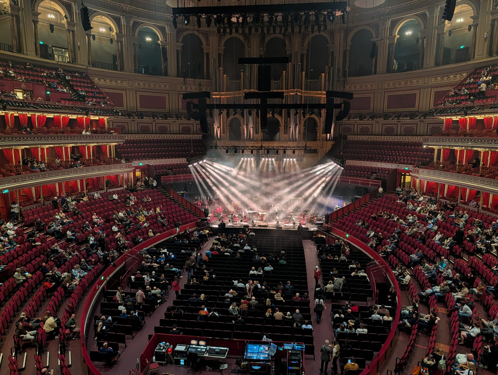
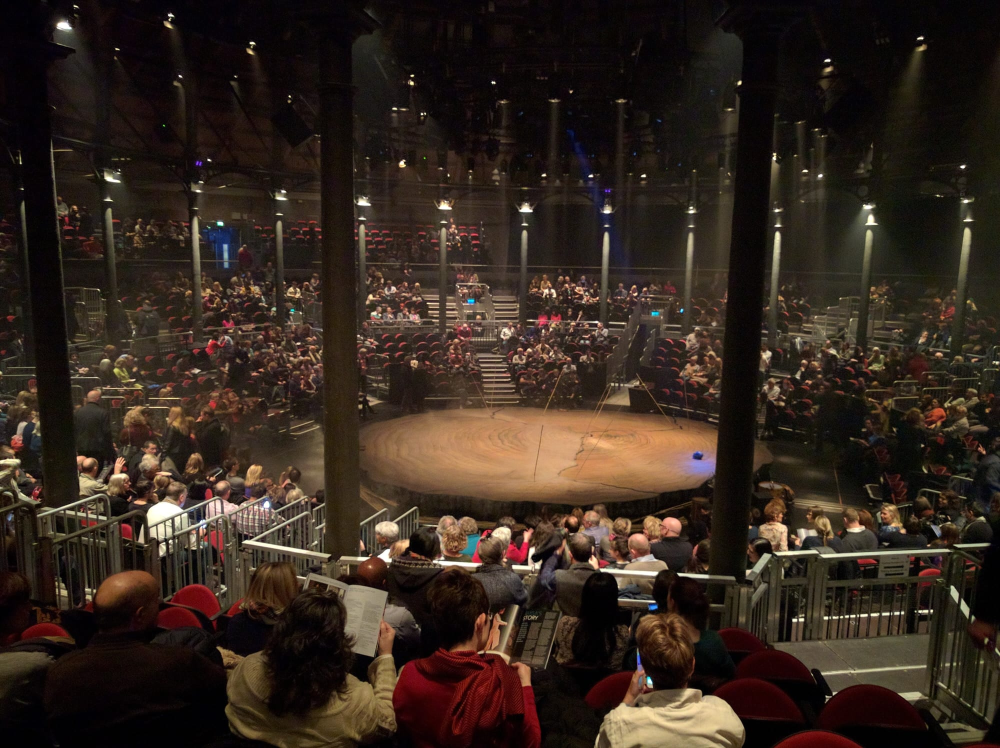
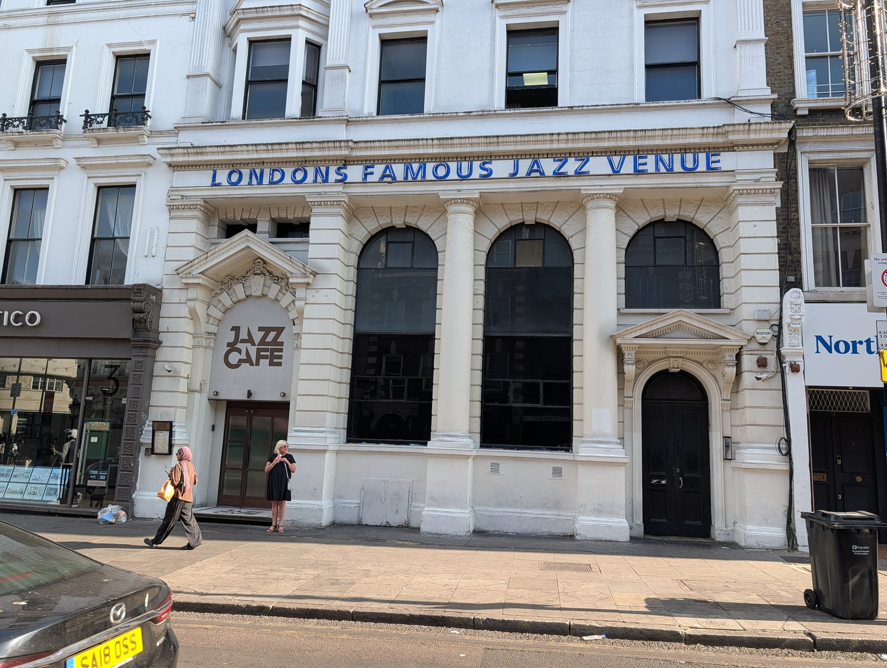

London's music rooms are mostly buildings that were something else first — a railway turning shed, a Victorian theatre, a church, a veterans' social club. That is not incidental; it is why they sound and feel the way they do.

This guide covers the rooms rather than the listings, arranged by size, because a 20,000-seat arena and a back room behind a Dalston pub are different nights out.

> 💡 **The Short Version:** **O2 Academy Brixton** has the sloping floor bands rave about. **The Roundhouse** is a Victorian railway shed. **Union Chapel** is a working church with extraordinary acoustics. **Cafe OTO** is the most committed small room in the city. And **MOTH Club** has a gold tinsel curtain and is still a members' social club.

> 📘 **How we choose these (editorial note)**
> No paid placements. These are drawn from a wide spread of sources rather than any single list - the food and travel press, the big listings sites, independent blogs and specialists, video, and what Londoners recommend themselves - and cross-referenced against each other. Capacities are approximate and change with the layout of a given show.

## Where they are

| If you are near… | Where to go |
| --- | --- |
| **Camden & Chalk Farm** | The Roundhouse, KOKO, Jazz Cafe |
| **Soho & Oxford Street** | Ronnie Scott's, the 100 Club, Below Stone Nest |
| **Shoreditch** | Village Underground |
| **Wood Green** | Alexandra Palace |
| **Islington** | Union Chapel |
| **The City** | Barbican Hall |
| **Dalston & Hackney** | Cafe OTO, EartH, Shacklewell Arms, MOTH Club |
| **Brixton** | O2 Academy Brixton |
| **Greenwich** | The O2 |
| **Covent Garden** | Stereo, Blue Note London |
| **Chelsea** | The 606 Club |
| **Notting Hill** | Notting Hill Arts Club |
| **Barnes & west** | The Bull's Head, Eventim Apollo |

---

## The big rooms

### O2 Academy Brixton

*around 5,000 · Brixton*

**The floor slopes down towards the stage**, which is why everyone can see and why bands talk about it the way they do. A **Grade II\* listed art deco former cinema**, and the best big room in London by a distance.

It is worth knowing what happened here. The venue lost its licence after a fatal crush at a show in December 2022 in which two people died. Lambeth ruled in September 2023 that it could reopen, but only once **77 new safety conditions** were met — reinforced doors, a rebuilt crowd management system, new ticketing, a centralised control room and new security management. The council's own decision described it as set to become **among the most highly regulated licensed venues in the country**.

It ran test events at half capacity in April 2024 and has been trading normally since, and is currently booking well into 2027.

### The O2, Greenwich

*20,000 · North Greenwich*

**The largest indoor venue in the country**, and for years the busiest music arena in the world by ticket sales. It is the arena inside the old Millennium Dome, which is why the building is far bigger than the room.

It is an arena, and it behaves like one: the sound is competent rather than special, the upper tiers are a long way from the stage, and the seated blocks at the very back are worth avoiding if the tour is one you actually care about. What it does well is scale — this is where you see the acts that cannot play anywhere smaller.

**Getting out is the part to plan.** Twenty thousand people leave at once into one Jubilee line station; wait twenty minutes in the bars rather than joining it, or walk to the Thames Clipper pier. **Up at The O2** lets you climb over the roof on a walkway, sold separately from any gig.

### Eventim Apollo, Hammersmith

*around 5,000 · Hammersmith*

**A 1932 art deco cinema, Grade II\* listed, and the other room in Brixton's class** — the two of them are where most bands too big for Shepherd's Bush and too small for an arena end up.

The interior is the reason: a vast barrel-vaulted auditorium with the original Robert Cromie fittings largely intact, and a Compton organ still in place. It works **either seated or standing**, and which one you get depends on the show, so check before you buy — the same act can be a very different night in each configuration.

**The balcony is genuinely good here**, unlike most rooms this size. Hammersmith station is directly opposite, which makes the exit far easier than the Apollo's capacity suggests.

### Royal Albert Hall, South Kensington

*5,272 · High Street Kensington or South Kensington*

**The most beautiful big room in Britain to hear music in**, and since 1871 the one every performer wants. A vast oval under a glazed dome, tiers of red and gold boxes running all the way round, and the Proms every summer.

**The sound and the sightlines are the reason to come.** It did not start that way: the hall had a notorious echo for its first century — the joke was that it was the only place a composer could hear their work twice — until the **135 fibreglass diffusers** were hung from the roof in 1969. Those are the "flying saucers", and they turned a famously difficult room into one of the best-sounding large halls anywhere. Almost every seat has a clear view of the stage, and the boxes give you a private vantage that no arena can match.

**Book by seat, not by price band.** The gallery at the very top is the cheapest and the acoustics up there are still good, but the standing arena at Proms concerts is the bargain: **Promming tickets are a few pounds on the day**, and they are the whole point of the season.

*The Royal Albert Hall mid-performance. It seats over 5,000 and the Proms run here every summer.*

### Alexandra Palace, Wood Green

*up to around 10,400 · N22*

**A Victorian palace of 1873 on a hill with one of the best views in north London**, and its Great Hall takes upwards of ten thousand for a concert. Also a Victorian theatre, an ice rink and the World Darts Championship, which is a sentence that only works in London.

The Great Hall is enormous and largely undivided, so it behaves more like a festival tent than a concert hall — the sound at the back is noticeably worse than the front and there is no raked floor, which makes height an advantage. The restored **Alexandra Palace Theatre** next door is the opposite: 1875, about 1,300 seats, deliberately left semi-derelict when it reopened, and a far better room for anything acoustic.

**The hill is free and the terrace view over the city is worth the trip on its own.** Getting home is the catch — Alexandra Palace station is a fifteen-minute walk downhill, Wood Green Tube is twenty, and ten thousand people leave at once.

### Barbican Hall, City of London

*1,900 · Barbican*

**Home of the London Symphony Orchestra**, and the most serious concert hall in the City — a 1,900-seat room at the centre of the Barbican's brutalist estate.

The programming is the unusual part. Classical, jazz, contemporary composition, film scores played live and touring international artists all share the same season, so the audience changes completely week to week. Sightlines are good from almost everywhere because the hall is wide and shallow rather than deep.

**Allow ten minutes to find it.** The Barbican estate is famously hard to navigate and the yellow line painted on the ground from the Tube exists for exactly that reason. There are bars and a restaurant on site, and the conservatory upstairs is free on the Sundays it opens.

---

### British Airways ARC, Olympia

*3,800 · Kensington (Olympia)*

**London's newest big music room**, opened on **16 June 2026** above the west exhibition hall at Olympia and run by AEG Presents. Self Esteem played the opening two nights.

It fills a real gap. At 3,800 it sits **between the Apollo and Brixton at one end and the arenas at the other** — the size band London has been short of for years, and the reason a lot of mid-tier international tours previously skipped the city or overreached into an arena.

It arrived as part of Olympia's whole redevelopment, so the surroundings are new too: a rooftop canopy of bars and restaurants, a food hall, a theatre and two hotels all opened within weeks of it. **Kensington (Olympia) station is at the door**, though its off-peak service is thinner than you would expect for a venue this size — check your route home before the encore.

---

## Historic buildings

### The Roundhouse, Chalk Farm

*around 1,700 · Chalk Farm*

**A circular Victorian railway turning shed, built in 1847 to turn locomotives around**, and now one of the most distinctive rooms in London to see a band in. The iron columns that held the roof up are still there, and the space is genuinely round, so the crowd wraps the stage rather than facing it in a block.

That shape is the whole experience: there is no bad angle exactly, but there is no deep floor either, so it feels far more intimate than 1,700 suggests. The gallery running round the upper level is the seated option and worth taking.

**It is a charity, and an unusually serious one** — a large share of what it makes goes into studios, rehearsal space and creative programmes for 11-to-25-year-olds in the building. Chalk Farm station is two minutes away and much easier than Camden Town after a show.

*The Roundhouse. It was built to turn steam locomotives, which is why the room is a true circle and the columns are where they are.*

### KOKO, Camden Town

*around 1,400 · Mornington Crescent*

**A gilded Victorian theatre of 1900 with three tiers of horseshoe balconies**, and one of the most beautiful rooms in London to see a band in. It has been the Camden Palace, the Music Machine and a BBC theatre; Charlie Chaplin, the Goons and Madonna's first UK show all happened here.

A fire tore through the roof during restoration in 2020. It reopened in 2022 after a rebuild that added a tower, a recording studio and several members' floors above the auditorium — which drew some criticism — but **the main room came back intact**, gold leaf and all.

**Get on a balcony if you can.** The floor is small and fills fast, and the view down onto the stage from the second tier is the reason to be in this particular building rather than any other room of the same size.

### The 100 Club, Oxford Street

*around 350 · since 1942*

A basement under Oxford Street that has had **live music in it continuously since 1942**, when it opened as the Feldman Jazz Club. It has traded as the 100 Club since 1964 and claims to be **the oldest independent music venue in the world**.

It hosted the **1976 Punk Festival** — the Sex Pistols, The Clash and Siouxsie and the Banshees on the same small stage — and Oasis, The Rolling Stones and Metallica have all played it since. Tickets are usually **£10–£25**, which for the room's history is absurd.

The stage is at floor level with pillars in the way. That is part of it.

### Union Chapel, Islington

*around 900 · Grade I listed*

A **working Congregational church**, built 1874–77, that runs around 250 gigs a year between Sunday services. The acoustics are what nothing purpose-built can match.

Three things nobody tells you before you go. **The seating is unreserved**, first-come-first-served on the original wooden pews, so arrive early and expect a queue. **There is a bar**, on the first floor — but alcohol has to stay in the bar area and cannot come into the chapel itself, though soft drinks and snacks can. And the building runs the **Margins Project**, a homelessness charity with a twice-weekly drop-in, showers, laundry and a winter night shelter, funded partly by the gigs.

It is fully accessible by ramp, with a platform lift up to the bar, and it houses an 1877 Henry Willis organ that still runs on its original hydraulic blowing system.

### Village Underground, Shoreditch

*around 700 · Shoreditch High Street*

**A Victorian warehouse with four disused Jubilee line tube carriages parked on the roof**, converted into artists' studios — which is the detail everybody remembers and the reason the building is listed in every guide to Shoreditch.

The main space below is a raw brick-and-steel hall with a high ceiling, and it is one of the better mid-size rooms in east London: electronic bookings, club nights and touring bands, with the sound built for volume rather than nuance. There are no seats and no sightline problems because the floor is flat and the stage is high.

**The rooftop has opened to the public**, which it never used to be. Shoreditch High Street station is three minutes away.

### EartH, Dalston

*1,200 standing · 680 seated · Dalston Kingsland*

**The former Savoy art deco cinema of 1937**, shut for decades and reopened in 2018 as two venues in one building — the name stands for Evolutionary Arts Hackney.

The two rooms are completely different nights. **EartH Hall** is a stripped-back standing space downstairs for touring bands and club bookings. **EartH Theatre** upstairs is the original tiered auditorium with **680 seats and the decay deliberately left visible** — peeling plaster, exposed brick, the proscenium half-ruined. It is one of the most atmospheric rooms in London and it is used for seated shows, film and spoken word as well as music.

**Check which of the two your ticket is for**, because people turn up expecting the theatre and find themselves standing downstairs. Dalston Kingsland is a few minutes' walk.

### MOTH Club, Hackney

*around 200*

**A Memorable Order of Tin Hats veterans' club with a gold-tinsel stage curtain behind the stage**, and still run as a members' social club during the day — bingo, cheap pints, regulars who have been coming for decades — before it turns into one of London's best small music rooms at night.

There is nothing else like it. The room takes about 200, the ceiling is low, the tinsel is permanent, and the bookings run from guitar bands on the way up to established acts playing deliberately small. The bar prices are still closer to a social club than a venue.

**Tickets are cheap and go quickly**, and it is a five-minute walk from Hackney Central. Go on a weeknight if you want to be able to move.

> ⚠️ **Go while you can.** MOTH Club is fighting two planning applications for flats next door and has been since 2025. Hackney Council refused the first in March 2026, citing the developer's failure to show the flats would not restrict the club — **a second application on the adjoining plot is still undecided**. The petition passed 30,000 signatures and the venue's own programmer says they are not out of the woods.

---

## Jazz

### Blue Note, Covent Garden

*Opens 23 September 2026*

> ⚠️ **Not open yet at the time of writing.** It opens on **23 September 2026** — deliberately, what would have been **John Coltrane's 100th birthday**. Tickets went on general sale in August.

The New York institution's **first UK venue**, in the basement beneath the St Martins Lane hotel. A **250-capacity main room running two sets a night at 7pm and 9.30pm**, food served at the tables, and a second 100-seat room called **B-Side** given over to emerging UK musicians.

**Robert Glasper** opens it on the 23rd and 24th — **both grand opening sets are already sold out** — with Erykah Badu, Jamie Cullum, Nubya Garcia, Yussef Dayes, KOKOROKO and Hak Baker announced behind him. Sinead Harnett follows on the 25th.

The address is **42–49 St Martin's Lane, WC2N 4EJ**.

The two-sets-a-night format is the thing to understand: the 7pm show is the civilised one and the 9.30 is where it loosens up.

### Ronnie Scott's, Soho

*since 1959 · 47 Frith Street*

The institution, and the first UK club to book American jazz musicians regularly. Ronnie Scott and Pete King opened it on **30 October 1959** — but in a basement at **39 Gerrard Street**. The Frith Street room everybody pictures is the second one, taken over in **1965**, and a lot of guides quietly merge the two.

Miles Davis, Nina Simone, Ella Fitzgerald, Chet Baker, Jimi Hendrix, Prince and Amy Winehouse have all played it. **Depeche Mode played their first ever gig under that name here**, in October 1980, which is not what anyone expects.

**The programme is four things, not one**, and the difference is most of the price:

* **Main shows** — two every evening, seven nights a week, seated at tables with food and drink served throughout. Usually **£40–£65**.
* **The Late Late Show** — Wednesday to Saturday, on at **11.15pm**, and **£12**. The cheapest way into the main room by a distance.
* **The Monday Jazz Jam** — long-running, and the one night the club shuts at 1am rather than 3am.
* **Afternoon shows** on Saturdays and Sundays, including the Sunday lunch sittings.

> **The Late Late Show is the move.** Same room, same stage, a fifth of the price, and it runs until the club closes at 3am.

### Upstairs at Ronnie's, Soho

*140 capacity · reopened after a rebuild*

A **140-capacity room above the main club**, rebuilt with purpose-built acoustics, a Yamaha S3X grand and its own kitchen. It runs the same shape as downstairs — two shows a night, late shows Thursday to Saturday, a vocal jazz jam on Wednesdays and Sunday afternoon shows — but ranges wider than jazz, into soul, R&B, gospel, hip hop and classical.

Tickets run around **£20–£30**, roughly half the main room, which makes it the sensible way into the building if the headline downstairs is out of reach.

> **The Greene Rooms open in 2027** — a members-only backstage lounge above the club, and the first time that part of the building has been open to anyone.

### The 606 Club, Chelsea

*90 Lots Road, SW10 0QD · two sets a night*

A basement on Lots Road that has been one of London's serious jazz rooms for decades, and the one most people wrongly assume they cannot get into. **Non-members are welcome** — the club says so on every page of its own site.

It charges a **music charge per person** rather than a ticket price, which is unusually transparent: **£18** Monday to Thursday and Sunday evening, **£23** Friday and Saturday, and **£16** for Sunday lunch. Two sets a night in every case, doors from 6.30pm on weeknights and 7pm at weekends, with music from 8pm or 9pm.

Booking is recommended rather than required, and it runs a full kitchen — this is a room you eat in while the band plays.

### Jazz Cafe, Camden Town

*around 440 · Camden Town*

**Live acts every night of the week, across a far wider range than the name suggests** — soul, funk, hip-hop, Afrobeat, Latin and neo-soul as often as anything a purist would call jazz.

The room is small and rectangular with **a balcony you can book a table on and eat from**, looking straight down at the stage. That balcony is the decision: standing on the floor gets you closer and sweatier, the balcony gets you a seat, a view and dinner, and the two are genuinely different nights out.

**Late licence at weekends**, when it turns into a club after the band. Camden Town station is a minute away, and it is one of the few Camden venues where the queue is not the main memory.

*The Jazz Cafe on Parkway. The building was a bank before it was a music venue, which is why the frontage looks nothing like one.*

### The Bull's Head, Barnes

*since 1959 · 373 Lonsdale Road, SW13 9PY*

A jazz venue since 1959 — the same year Ronnie Scott's opened — and once nicknamed the suburban Ronnie's. It still is one: a **Young's pub on the Thames** that calls itself a historic London jazz venue and programmes live music **every week** in a dedicated **Jazz Room** behind the bar, rather than in a corner of the pub.

Five minutes from Barnes Bridge, and the only room on this list where the gig and a proper Sunday lunch are the same outing.

Powered by <a target="_blank" rel="sponsored" href="https://www.getyourguide.com/london-l57/">GetYourGuide</a>

---

## Small rooms

Where London's music actually happens most nights.

### Cafe OTO, Dalston

*around 150*

**Time Out's own pick as London's most consistently committed live venue** — free jazz, noise, improvisation and experimental music, most nights of the week, in a room of about 150 that treats an audience as participants rather than spectators.

The format is unusual and worth understanding before you go: it is a café and bar by day, the chairs come out for the evening, and the audience is expected to listen rather than talk over the set. Musicians from around the world play here who would not otherwise appear in London at all, often for two nights running with different material.

**Usually £8 to £20**, with advance and member discounts and some nights free to members. It runs its own record label and record shop next door, and the programme is published months ahead — worth browsing rather than waiting for a name you recognise.

### Shacklewell Arms, Dalston

*around 200 · Dalston Kingsland*

**A back room behind an ordinary Dalston pub**, ranked among Time Out's UK top venues, and the kind of place where bands play twice — once on the way up and once, years later, as a surprise warm-up.

The venue is genuinely just a room: low ceiling, no raised stage to speak of, and a capacity that means you are never more than a few metres from whoever is playing. The front is a working pub with a decent beer list, so you can arrive early without committing to the gig.

**Tickets are usually under £15** and often sell out on word of mouth rather than advertising. Free entry on some club nights after the band.

### Notting Hill Arts Club, Notting Hill

*around 200 · Notting Hill Gate*

**A basement that has run new music and club nights since 1993**, and — more remarkably — has survived west London's rents while almost everything comparable around it did not.

It is a low, dark room under Notting Hill Gate with a reputation built on booking people before anyone else did: Adele, Franz Ferdinand and the Libertines all played here early. The programme still mixes new bands with long-running club nights, and it leans harder into DJ nights later in the week.

**Early doors and cheap** — a lot of shows start at 7pm and finish by 11pm, which makes it one of the few central venues you can do on a weeknight without writing off the next morning.

### Below Stone Nest, Soho

*around 250 · Tottenham Court Road*

**A raw basement underneath a former Welsh Presbyterian chapel on Shaftesbury Avenue**, which is not a sentence that describes anywhere else in the West End.

The chapel above, Stone Nest, is a Grade II\* listed 1888 building left deliberately unrestored — bare brick, stripped walls, no seats fixed down. Below it, the venue takes about 250 for electronic, experimental and club bookings, and the low arched ceiling does most of the work on the sound.

**It is genuinely central**, which is the surprise: everything else programming this kind of music is in Dalston or Peckham, and this is ninety seconds from Tottenham Court Road.

### Stereo, Covent Garden

*Covent Garden Piazza*

**Live music, cocktails and dining combined right on the Piazza** — the polished, central alternative to the Dalston rooms, and a useful answer when half your party wants a gig and the other half wants dinner.

The bookings lean soul, funk and covers rather than anything you would travel for, and the room is a restaurant that hosts music rather than a venue that serves food. That is the trade: you will not discover anything here, but you can eat properly, sit down, and still hear a band, two minutes from the Tube.

**Book a table rather than turning up**, particularly at weekends, when the Piazza is at its worst for walk-ins.

---

## Free and cheap gigs

Live music in London does not have to cost £40 and a booking fee.

* **The Windmill**, Brixton — the room where Black Country, New Road, Squid and most of the south London scene played first. Entry is often a few pounds, and on a good night you are watching a band before anyone else has heard of them.
* **The Lexington**, Angel — a **200-capacity** indie gig room above a bourbon bar on Pentonville Road, open since 2008 and one of the most respected small rooms on the circuit.
* **The Shacklewell Arms**, Dalston — several of its club nights are **free entry**, in a proper back-room venue with a heated courtyard.
* **The Late Late Show at Ronnie Scott's** is **£12** for the same room that costs £40–£65 earlier in the evening. It starts at 11.15pm, Wednesday to Saturday, and most tickets are available on the door if the advance ones have gone.
* **Ronnie's concessions are unusually generous** if you qualify. On Wednesdays and Thursdays, **Musicians' Union members get into the Late Late Show free** on production of a card, and students and other musicians pay **£6**.
* **The Vortex**, Dalston — **not free**, and often listed as though it were. Tickets are usually **£15–£25**, though **Vortex members, students and Universal Credit recipients** pay substantially less, sometimes half. Gigs run Tuesday to Sunday from 7.45pm, and seats are only guaranteed to members.
* **Church and lunchtime concerts.** St Martin-in-the-Fields, St James's Piccadilly and the Southbank Centre all run free or pay-what-you-can lunchtime recitals, usually by conservatoire students who are very good.
* **The Southbank Centre foyers** have free live music most days — a real programme, not background.
* **Grassroots venues are the point.** Almost every act now filling an arena spent years in rooms like these, and a £6 ticket at The Windmill has better odds of being memorable than £80 at the O2.

> Buy directly from the venue where you can. The resale sites add 20–30% and the grassroots rooms keep more of the money.

---

## What to know

* **Buy direct from the venue.** Every room here sells its own tickets, and resale prices are frequently multiples of face value.
* **Brixton Academy's sloping floor** means the back is genuinely fine. Do not pay extra to be near the front.
* **Union Chapel seating is unreserved.** Original wooden pews, first come first served, so arrive early. It is a Victorian church, so dress for the temperature.
* **The grassroots circuit is genuinely under pressure.** Thirty UK venues closed permanently between mid-2024 and mid-2025, more than half made no profit, and around 200 are on the Music Venue Trust's red alert list. Buying direct from a small venue is not a small gesture.
* **The late set at Ronnie Scott's costs £12** against £40–£65 for a main show, in the same room. It is the single biggest price gap in London live music.
* **Jazz in London is rarely free**, whatever the listings say. The 606 charges a music charge, the Vortex charges £15–£25, and Ronnie's late show is £12. The genuine free jazz is in pubs and at lunchtime recitals, not in the clubs.
* **Cafe OTO and MOTH Club** rarely sell out weeks ahead — you can decide on the day.
* **Night Tube runs Friday and Saturday** on the Victoria line for Brixton and the Northern for Camden.

---

## Continue planning your London trip

- 🎭 **[Camden Area Guide](/articles/camden-area-guide/)**
- 🍸 **[The Best Cocktail Bars in London](/articles/best-cocktail-bars-london/)**
- 🌙 **[Late-Night Eating in London](/articles/late-night-eating-london/)**
- 🎪 **[Free Things to Do in London](/free/)**
- 🎨 **[Shoreditch Area Guide](/articles/shoreditch-area-guide/)**
- 🍜 **[Soho Area Guide](/articles/soho-area-guide/)**
