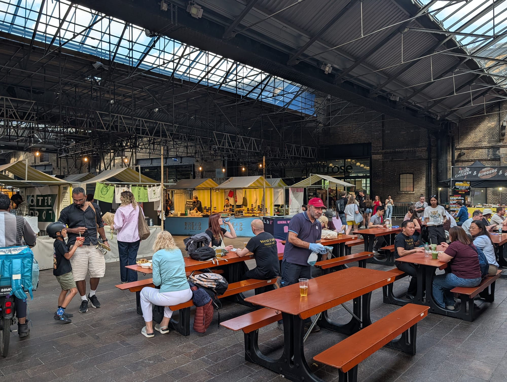
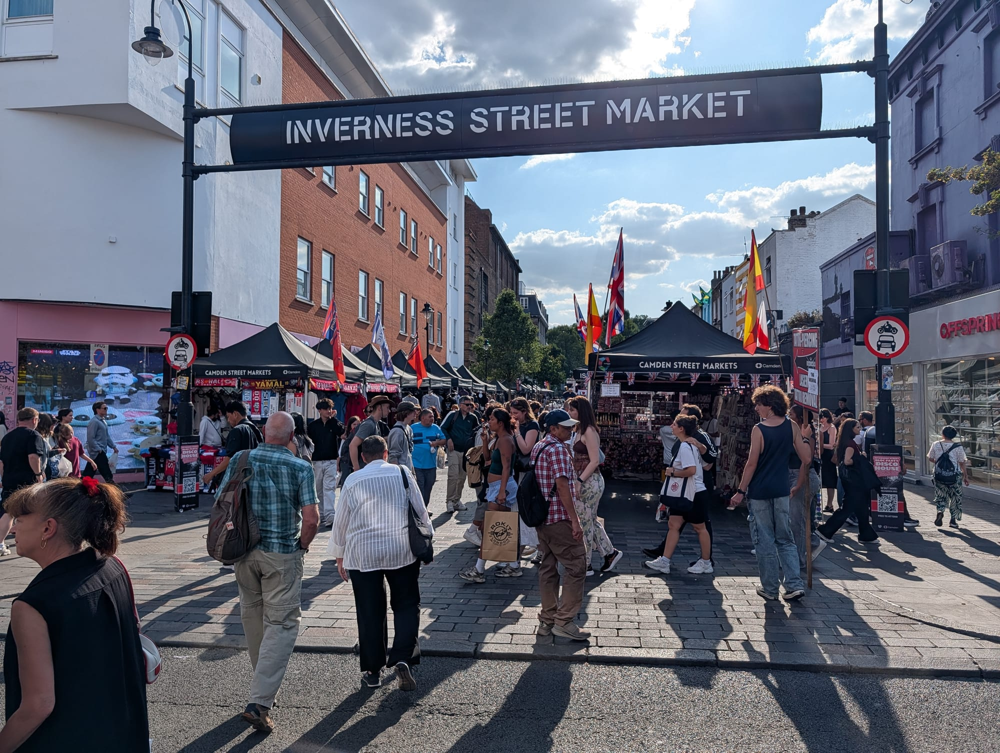
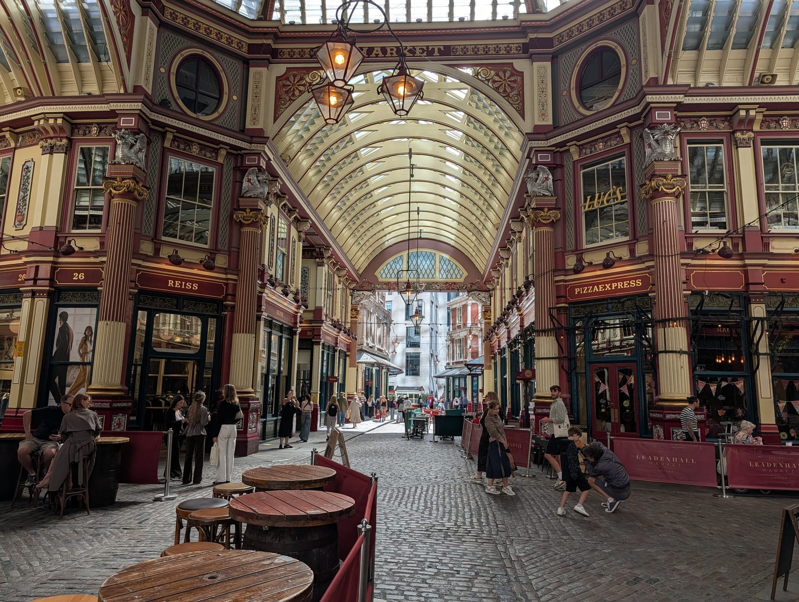

The single most useful thing to know about London markets is **which days they exist**. Columbia Road is a street of flower sellers on Sunday and an ordinary road the rest of the week. Broadway Market is a Saturday. Turning up on the wrong day is the standard way to waste a morning.

We keep a full [markets by day](/markets/) page for exactly that reason. This guide is about what each one is actually *for* — including the flower, antiques and shopping markets.

**If you are only here to eat**, our [best street food in London](/articles/best-street-food-london/) guide compares every food hall, market and container yard on traders, variety, seating and trading days.

> 💡 **The Short Version:** **Borough** is the food market everything else is measured against. **Columbia Road** is Sunday only and worth the alarm. **Maltby Street** is the one locals use instead of Borough. And **Billingsgate** trades before dawn and is finished by 8am.

> 📘 **How we choose these (editorial note)**
> No paid placements. These are drawn from a wide spread of sources rather than any single list - the food and travel press, the big listings sites, independent blogs and specialists, video, and what Londoners recommend themselves - and cross-referenced against each other. Trading days are the thing that changes most and the thing that ruins a trip — every one here was checked in August 2026, but confirm before travelling for a specific market.

## Where they are

  

    Map of the best markets in London
  

  

    
Loading the interactive map…

  

  

    <i class="restaurant-map-key restaurant-map-key--editorial" aria-hidden="true"></i> Recommended in this guide
    <i class="restaurant-map-key restaurant-map-key--streetfood" aria-hidden="true"></i> Market stall & food hall
  

  <noscript>
    
The interactive map requires JavaScript. Every entry below lists its area.

  </noscript>

| If you are near… | Which market |
| --- | --- |
| **Borough & Bermondsey** | Borough Market, Maltby Street |
| **Covent Garden** | Apple Market |
| **The City** | Leadenhall Market |
| **Shoreditch & Bethnal Green** | Old Spitalfields, Columbia Road, Brick Lane |
| **Hackney** | Broadway Market |
| **Camden** | Camden Market, Hawley Wharf, Inverness Street |
| **Notting Hill** | Portobello Road |
| **Greenwich** | Greenwich Market |
| **King's Cross** | Canopy Market |
| **Canary Wharf** | Billingsgate Fish Market |

---

## Food markets

### Borough Market, Southwark

*Free to enter · most days*

The one everything else is measured against — traders and produce side by side, with the hot-food stalls that made it famous. **Busiest Friday and Saturday**; Tuesday and Wednesday are genuinely pleasant.

Horn OK Please and Gujarati Rasoi are the two vegetarian Indian stalls worth crossing London for.

### Maltby Street Market, Bermondsey

*Weekends*

A **narrow ropewalk of food traders wedged under the railway arches** since 2010 — oysters, waffles, gin. The market locals use instead of Borough, ten minutes away.

### Canopy Market, King's Cross

*Free to enter · Wednesday to Sunday*

A market of food traders, producers and designer-makers under the glass roof of the **West Handyside Canopy**, a Victorian goods canopy behind Granary Square. Long communal benches, a bar, and far calmer than Camden or Borough.

**It runs on two schedules.** Wednesday and Thursday are street food only, midday to 8pm. **Friday to Sunday is the full market** — produce, jewellery, homeware and accessories alongside the food — noon to 8pm on Friday, 11am to 6pm at the weekend, and the same hours on bank holiday Mondays.

Come at the weekend if you want the makers rather than lunch.

### Billingsgate Fish Market, Canary Wharf

*Free to enter · before dawn*

The **UK's largest inland fish market**, trading from around 4am a few minutes from the towers. The public can buy, and it is finished by about 8am.

---

Powered by <a target="_blank" rel="sponsored" href="https://www.getyourguide.com/london-l57/">GetYourGuide</a>

## One day a week

### Columbia Road Flower Market, Bethnal Green

*Sunday only*

A Victorian street **packed shoulder to shoulder with flower sellers shouting prices down**, plus the independent shops behind them. Prices drop sharply in the last hour.

Sunday only. It does not exist any other day.

### Broadway Market, Hackney

*Saturday only*

Food, produce and vintage along a single street, with London Fields at one end.

---

## Shopping markets

### Portobello Road, Notting Hill

*Antiques Saturday*

Antiques on Saturday — the largest antiques market in the world by number of dealers — and general goods the rest of the week.

### Inverness Street Market, Camden

*Most days*

A short street market off Camden High Street, west of the crowds — produce, street food and general goods, and the part of Camden locals actually shop in.

### Old Spitalfields Market, Shoreditch

*Most days*

A covered Victorian market hall with different themes by day: antiques Thursday, vintage Friday, general the rest.

### Camden Market, Camden Town

*Every day*

**Camden Lock, the Stables and Hawley Wharf** run together into the best-known collection of street vendors in Britain. Busy and touristy and still genuinely good. Weekday mornings if you dislike crowds.

### Greenwich Market, Greenwich

*Most days*

**Trading since 1737 and the only London market inside a World Heritage site** — designer-makers, antiques and a good run of food stalls.

---

### Brick Lane Market, Shoreditch

*Sundays for the whole stretch · the Vintage Market daily*

On Sundays the whole stretch turns into a patchwork of markets — **Upmarket, Backyard Market** and the Old Truman Brewery yards — selling vintage clothes, records, antiques and some of the best street food in east London. Chaotic, crowded and much larger than it looks from the street.

**The Brick Lane Vintage Market itself runs seven days a week**, in the basement at F Block, 85 Brick Lane: Mon–Fri 11am–6.30pm, Sat 11am–6pm, Sun 10am–6pm. It is the biggest vintage market in London and covers the 1920s to the 1990s — so if you only want the clothes and records, **come on a weekday** and skip the crowds entirely.

Go early on a Sunday if you want the vintage, late if you want the food.

### Alfies Antique Market, Marylebone

*Tue–Sat · Church Street*

**Britain's largest indoor antiques market**, four floors of it in an old Edwardian department store on Church Street, with a rooftop café most people never find.

Twentieth-century design, vintage fashion and jewellery rather than genuine antiques in the auction-house sense. Closed Sundays and Mondays.

### Brixton Village and Market Row, Brixton

*Daily · covered arcades*

Two covered arcades off Electric Avenue that went from near-derelict to one of the best places to eat in south London — and still hold the Caribbean grocers, fishmongers and butchers that were there first.

The mix is the point: a Colombian bakery next to a record shop next to a family greengrocer.

### Victoria Park Market, Hackney

*Sundays · east London*

Street food, groceries, fashion and cut flowers on the edge of Victoria Park, and the one east London market that is still mostly locals rather than visitors.

---

## Covered and historic

### Leadenhall Market, City of London

*Free · weekdays*

An **1881 covered market in cream, maroon and green wrought iron**, standing where the Roman forum was. Played Diagon Alley in Harry Potter.

Closed at weekends — it serves the City's weekday trade.

### The Apple Market, Covent Garden

*Daily*

Under the glass roof of the 1830 market building — antiques Monday, crafts and general goods the rest of the week.

---

## Not markets, but sold as them

Worth knowing the difference before you plan a morning around one.

* **Battersea Power Station** — 150 shops and restaurants inside Gilbert Scott's power station. A shopping centre in an extraordinary building.
* **The King's Road**, Chelsea — a shopping street with history rather than a market. Mary Quant opened Bazaar here in 1955.
* **Coal Drops Yard**, King's Cross — Heatherwick's converted coal drops, now retail.

---

## What things cost, and the free part

Markets are the cheapest good food in London and one of the few genuinely free things to do that is not a museum.

* **Walking round costs nothing.** Borough, Spitalfields, Columbia Road, Portobello, Camden and Leadenhall are all free to enter and worth an hour on their own. Columbia Road on a Sunday morning is one of the best free hours in London.
* **Street food runs roughly £8–£14 a dish** across Borough, Maltby Street and Brick Lane — cheaper than a restaurant, more expensive than a supermarket, and the quality at the top end matches restaurants charging double.
* **Go at closing time for flowers.** Columbia Road traders cut prices hard in the last hour, and the shouting is half the entertainment.
* **Borough's free samples are real.** The cheese, charcuterie and oil stalls expect you to taste, and a slow circuit of the market is close to a free lunch, though buying something is the decent thing.
* **Billingsgate is free to walk into** and over by 8am. Bring cash and a cool bag.
* **Maltby Street is cheaper than Borough** for the same standard of food, ten minutes away, at weekends only.

---

Powered by <a target="_blank" rel="sponsored" href="https://www.getyourguide.com/london-l57/">GetYourGuide</a>

## What to know

* **Check the day.** Columbia Road is Sunday, Broadway Market is Saturday, Leadenhall trades on City hours, so weekdays. See our [markets by day](/markets/) page.
* **Borough on a Tuesday** is a completely different and better experience than Borough on a Saturday.
* **Columbia Road's last hour** is when the prices collapse.
* **Billingsgate is over by 8am.** It is not a late-morning activity.
* **Most food markets take cards**, but a few of the smaller antiques dealers still prefer cash.

---

## Continue planning your London trip

- 🛍️ **[Shopping in London](/articles/shopping-in-london/)** — the streets, stores and arcades around the markets- 🛍️ **[London Markets by Day](/markets/)**
- 💷 **[Cheap Eats in London](/articles/cheap-eats-london/)**
- 🍽️ **[Eat in London: Restaurants, Food Markets & Quick Food Hub](/articles/eat-in-london-guide/)**
- 🎪 **[Free Things to Do in London](/free/)**
- 🎨 **[Shoreditch Area Guide](/articles/shoreditch-area-guide/)**
- 🎭 **[Camden Area Guide](/articles/camden-area-guide/)**
