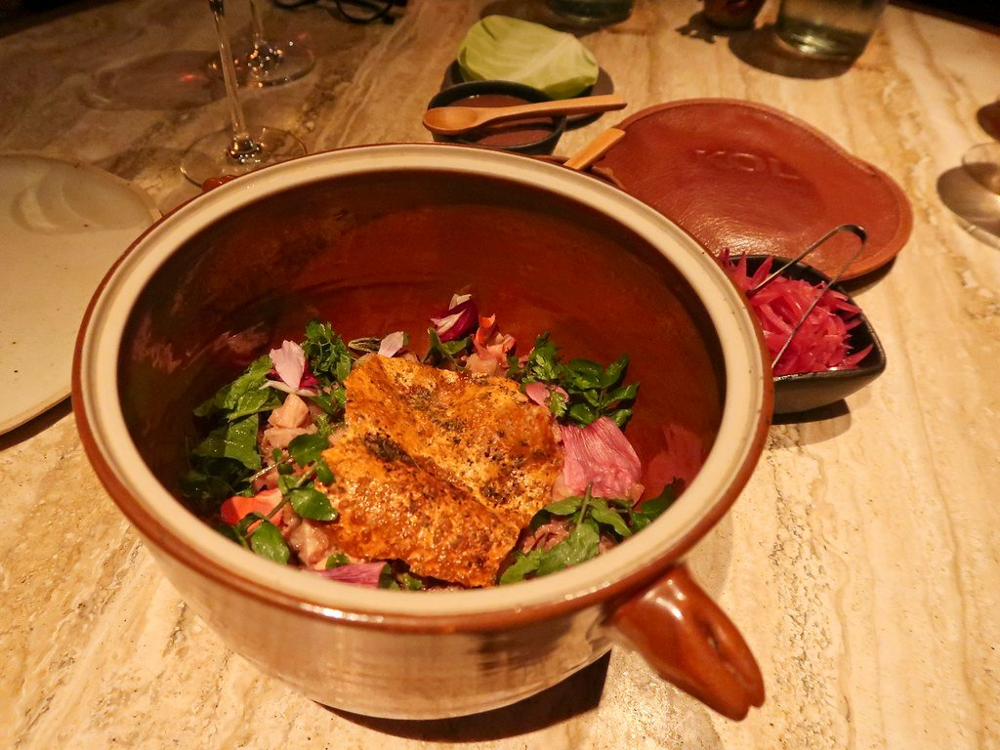
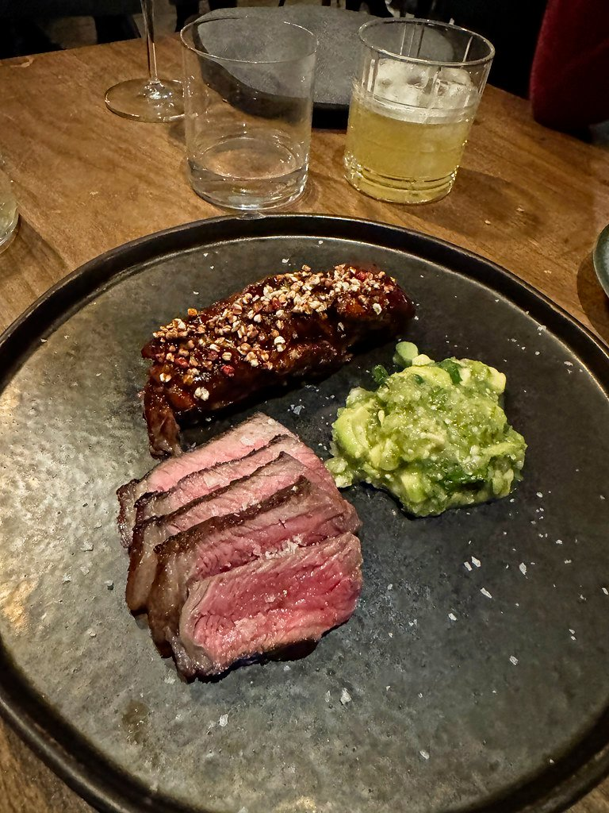
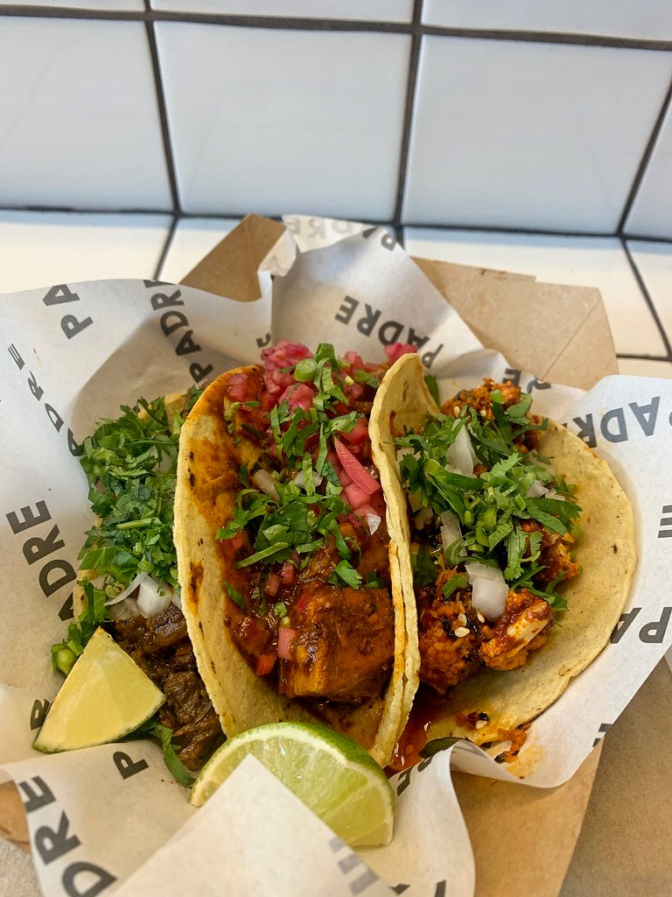

London's Mexican food splits sharply. At the top there are two Marylebone restaurants doing genuinely serious work — one of them holding a Michelin star for cooking Mexican technique **with no imported ingredients at all**. Below that there is a lot of burrito.

This guide skips the burrito.

> 💡 **The Short Version:** **Kol** has the Michelin star and uses only British produce. **Cavita** is Time Out's pick. **Santo Remedio** cooks the dishes other London Mexicans avoid. **Comalera** in Walthamstow presses its own tortillas and is the cheapest good one. And **Mestizo** is where the mezcal is.

> 📊 **The evidence behind this guide**
> Nothing here is ranked on one visit. This pass reads **11 sources carrying 131 citations** across **59 named restaurants**. **22 restaurants are named by two or more independent sources; 1 holds a Michelin star.**
> **Built on:** specialist taquería writers, plus KOL — the one Mexican restaurant in London holding a Michelin star.
> *Evidence rebuilt 30 August 2026 · [How we rank →](/how-we-rank/)*

## Where they are

| If you are near… | Where to eat |
| --- | --- |
| **Marylebone** | Kol, Cavita |
| **Fitzrovia** | Cometa, Mestizo |
| **Mayfair & Soho** | Fonda, Club Mexicana (Mercato Mayfair) |
| **Borough & London Bridge** | El Pastor, Tacos Padre |
| **Bermondsey** | Santo Remedio |
| **Chelsea** | Ixchel |
| **Notting Hill** | Los Mochis |
| **Shoreditch** | Zapote |
| **Dalston & Stoke Newington** | Corrochio's, Sonora Taquería |
| **Peckham & south** | Guacamoles, Taquiza, Taca Tacos, La Chingada (Rotherhithe) |
| **East London** | Homies on Donkeys (Leytonstone), Comalera (Walthamstow) |
| **Tooting** | Guacamoles |

**Price guide:** **£** under £15 · **£££** £40–£70 · **££££** £90+.

---

## The serious end

### Kol, Marylebone

*££££ · Michelin star* · Cited by 9 sources

**Santiago Lastra cooks Mexican technique using British ingredients — no imported produce at all**, which is the constraint the whole menu is built on and the reason it holds a Michelin star.

No avocados, no Mexican chillies flown in. Instead: **Cornish lobster in a chilli butter**, langoustine tacos, and moles built from British produce fermented and dried in-house to stand in for what he cannot get. The **tortillas are made from corn nixtamalised on site**.

**££££, closed Sunday and Monday, and it books months ahead.** The mezcal bar downstairs takes walk-ins and is worth knowing about on its own.

*Mexican technique applied strictly to British ingredients — no imported produce, which is the whole conceit. Photo: [Bex.Walton](https://www.flickr.com/photos/7831824@N04/51604595625), [CC BY 2.0](https://creativecommons.org/licenses/by/2.0/).*

### Cavita, Marylebone

*££££ · 3 min from Bond Street* · Cited by 5 sources

**Time Out's pick for the best Mexican in London** — the tacos get the headlines but the point is the dishes nobody else here cooks.

Adriana Cavita worked at Pujol in Mexico City, and the menu shows it: **mole** aged for months, **cochinita pibil** cooked in banana leaf, and vegetables over the wood fire that anchors the room. Tortillas pressed from nixtamalised corn.

**££££, closed Monday, and it books weeks ahead.** Marylebone, and considerably more ambitious than a taqueria.

### Santo Remedio, Bermondsey

*£££ · 10 min from London Bridge* · Cited by 8 sources

**Edson and Natalie Diaz-Fuentes cook the dishes most London Mexicans skip** — which is the entire reason to go rather than to a taco counter.

**Mole negro** made properly, **soft-shell crab tacos**, and **guacamole topped with grasshoppers** — chapulines, toasted and salted, which is a genuine Oaxacan garnish rather than a dare. The mole is the dish to judge it on and takes days to make.

**£££ and it books weeks ahead.** Bermondsey, over two floors, and the upstairs room is the calmer one.

---

## Specialists

### Cometa, Fitzrovia

*£££ · 5 min from Goodge Street* · Cited by 3 sources

**Mexican seafood specifically** — tostadas, ceviche and aguachile rather than the meat-led menu everywhere else runs, which makes it the odd one out in this guide.

**Aguachile** is the dish to order: raw prawns cured in lime and chilli water, served cold and sharp, closer to a Sinaloan beach shack than to anything else in Fitzrovia. **Tuna tostadas** and ceviche either side of it.

**£££, closed Sunday and Monday, books weeks ahead.** Small, and the counter is the seat to ask for.

### Los Mochis, Notting Hill

*££££ · Japanese-Mexican* · Cited by 2 sources

**Sashimi and maki on the same menu as ceviche, tiradito and tacos.** It sounds like a gimmick and is not — Japanese-Mexican cooking has a real lineage on Mexico's Pacific coast, where Japanese immigrants settled around Sinaloa, and Los Mochis is a city in that state.

Order across the divide: **tuna tostadas**, sashimi dressed with chilli and lime rather than soy, and tacos built with Japanese cures. The Notting Hill room is the original; a City rooftop site followed and has the view rather than the atmosphere.

**££££ and it books ahead**, particularly at weekends. Loud, and designed for a night out rather than a quiet dinner.

### Mestizo, Fitzrovia

*£££ · 4 min from Euston Square* · Cited by 4 sources

**A long-running mezcaleria and dining room** — the **tequila and mezcal list is the reason to sit at the bar** rather than at a table, and it runs to well over a hundred bottles.

The kitchen does the full regional repertoire — **mole poblano**, cochinita pibil, chiles en nogada in season — but the bar is the draw. Ask the staff to walk you through the mezcals; they know them and most London bars do not.

**£££, book a few days ahead** for a table; the bar takes walk-ins. Near Warren Street, and open later than most of this guide.

### Ixchel, Chelsea

*£££ · 7 min from Sloane Square* · Cited by 3 sources

**A Chelsea room that leans as hard on mezcal and the bar as on the kitchen** — named for the Maya goddess, and decorated to the same level of commitment.

Tacos, ceviche and grilled meats from the kitchen, and a long agave list at the bar. It is a night-out room rather than a dinner one, and busiest late.

**£££ and it books weeks ahead** at weekends. Come for the bar and eat while you are there.

---

Powered by <a target="_blank" rel="sponsored" href="https://www.getyourguide.com/london-l57/">GetYourGuide</a>

## The taquerias

The most interesting Mexican cooking in London is not in the restaurants at the top of this page. It is in taquerias and market stalls, and the marker of a good one is simple: **do they make their own tortillas?**

### El Pastor, Borough

*££ · 7A Stoney Street · also Soho, King's Cross and Battersea* · Cited by 7 sources

A **Mexico City taqueria** built around the *trompo* — the vertical spit of marinated pork that gives tacos al pastor their name — and the group that did more than any other to make proper tacos normal in London.

Its own account is that the Stoney Street original served its first taco **on a house-made heirloom corn tortilla**, which at the time was close to unheard of here. Four sites now.

### Zapote, Shoreditch

*£££ · 70 Leonard Street* · Cited by 3 sources

The most serious corn programme in London. Chef Yahir Gonzalez, from Aguascalientes, runs **named heritage varieties** — chalqueño cremoso and cónico rojo from Mexico State, bolita blanco from Oaxaca — with some of the corn grown on his family's ranch in Jalisco.

Sourcing that specific tells you the masa is made from scratch daily. The scallop aguachile with Clamato and pomegranate is the dish.

*Mexican cooking in Hackney with the corn treated as the main event rather than the wrapper. Photo: [Bex.Walton](https://www.flickr.com/photos/7831824@N04/53436663110), [CC BY 2.0](https://creativecommons.org/licenses/by/2.0/).*

### Sonora Taquería, Stoke Newington

*££ · 208 Stoke Newington High Street* · Cited by 6 sources

**Northern Mexican, and the clearest regional claim in London** — Michelle Salazar de la Rocha is from Sonora, and the cooking is hers rather than a general Mexican menu.

The detail worth understanding: Sonoran tortillas are **flour, not corn**. They are made in house from flour, salt, fat and water, and there is no nixtamal involved at all. That is the authentic northern tradition rather than a shortcut. Carne asada is the taco to order.

Started as a Netil Market stall and took a permanent room in 2023.

### Corrochio's, Dalston

*££ · 76 Stoke Newington Road* · Cited by 4 sources

**Founder Daniel grew up in Guadalajara and trained in the Yucatán** — so the cooking is genuinely regional rather than pan-Mexican, and **the cocktail bar runs long after the kitchen stops.**

Yucatecan and Jaliscan dishes: **cochinita pibil**, tacos with proper salsas, and a brunch at weekends that gets named alongside the dinner menu. The bar does agave spirits seriously.

**£££, closed Monday, book a few days ahead.** Dalston, and the room stays busy long past the point most kitchens have closed.

### La Chingada, Rotherhithe

*££ · 12 Rotherhithe New Road · also Euston* · Cited by 6 sources

**A southeast London taquería that regulars rate above anything in zone 1** — a small room in Rotherhithe with no interest in being discovered.

The taco list is the menu: **al pastor** carved off the trompo, **suadero**, **carnitas**, chorizo and baja prawn. Al pastor is the one to judge it on — pork marinated in achiote, stacked on the vertical spit and shaved with pineapple.

**£, walk-in.** Cheap, plain, and a long way from anywhere else on this page. Worth the journey.

### Fonda, Mayfair

*£££ · 12 Heddon Street* · Cited by 2 sources

A Mayfair *fonda* — the word means a small family eating house, which this emphatically is not, but the cooking underneath the room is the real thing.

**Tacos on nixtamalised corn tortillas**, ceviche, and grilled meats, with a mezcal and tequila list built for the postcode. The tortillas are pressed on site, which is the detail that separates the serious Mexican rooms in London from the rest.

**£££ and it books ahead.** Mayfair pricing for taquería food, which is the objection; the tortillas are the answer to it.

### Homies on Donkeys, Leytonstone

*££ · 686 High Road · closed Sunday and Monday* · Cited by 5 sources

**A Leytonstone taco counter that built a following on the strength of the tacos alone** — no room to speak of, no marketing, and a queue anyway.

Tacos on **hand-pressed tortillas**, with al pastor, birria and baja fish among them, and salsas made in-house rather than bought in. It began as a market stall and the counter format never really changed.

**£, walk-in, closed Sunday and Monday.** Cash-friendly, quick, and one of the cheapest proper meals in the guide.

---

## Best value: markets and stalls

The cheapest Mexican food in London is also some of the best, and most of it is sold from a stall.

### Guacamoles — Peckham, Tooting and Hackney Wick

*£ · three market stalls* · Cited by 4 sources

**Hand-pressed tortillas dipped in birria juice before they hit the griddle**, from a stall that started in Rye Lane Market — which is the detail that makes the birria taco work rather than just exist.

**Birria tacos** are the order: slow-cooked beef, the tortilla stained and crisped in the fat and juices, served with a cup of consommé to dip. Three sites now — Peckham, Tooting and Hackney Wick — all counters.

**£, walk-in.** Order the consommé; eating birria without it misses the point.

### Tacos Padre, Borough Market

*££ · Borough Market Kitchen · closed Mondays*

**Corn nixtamalised on site and tortillas pressed to order** at a Borough Market counter — the detail most taquerías skip, and the reason this one is named by five sources.

Nixtamalisation is the process of cooking dried corn in an alkaline solution before grinding it: it is what makes a tortilla taste of corn rather than of flour, and almost nobody in London does it. The taco fillings change daily with what the market has.

**££, walk-in, closed Monday.** Market hours only — it is shut by evening, so this is lunch.

*Borough Market. They nixtamalise their own corn on site, which almost nobody else in London does. Photo: [Bex.Walton](https://www.flickr.com/photos/7831824@N04/50251889493), [CC BY 2.0](https://creativecommons.org/licenses/by/2.0/).*

### Taquiza, Peckham

*£ · Arch 164, 115 Rye Lane · Wednesday to Saturday only* · Cited by 3 sources

A Peckham taquería doing the format straight: **a short taco list, made properly, at a price the area can sustain.**

Tortillas pressed to order and fillings that rotate — al pastor, carnitas, and vegetable options that are not an afterthought. Salsas made in-house and set out for you to add yourself.

**£, walk-in.** Small, quick, and busiest in the evening when Rye Lane fills up.

### Taca Tacos — Deptford and Peckham

*£ · market yard and sit-down* · Cited by 2 sources

**Six-hour beef birria and crisp baja fish tacos out of a Deptford railway arch**, with margaritas to match — one of the better arch conversions in south London.

The **beef birria taco** is the signature: six hours of slow cooking, the tortilla griddled in the fat, consommé on the side. The **baja fish** taco is the other order — battered, fried and dressed with slaw and chipotle mayo.

**££, walk-in, closed Monday.** Two sites; the Deptford arch is the more atmospheric.

### Comalera, Walthamstow

*£ · 2 min from St James Street · walk-in* · Cited by 3 sources

**A Walthamstow stall pressing its own tortillas** — and **the cheapest serious tacos on any of these lists**, which is the whole reason it is here.

A *comal* is the flat griddle a tortilla is cooked on, and the name is the promise: masa pressed and griddled to order rather than bought in packs. A short list of fillings and salsas made on site.

**£, walk-in, and open Friday to Sunday only** — closed Monday through Thursday, so check the day before travelling.

### Club Mexicana, Mayfair

*£ · entirely vegan*

**Tacos, nachos and burritos built on jackfruit and vegan chicken** — started as a market stall and now in Kingly Court, and **the rare vegan restaurant nobody eats at because it is vegan**.

The **jackfruit carnitas** and the vegan **al pastor** are the orders, with salsas and pickles doing the work the meat would. It is loud, cheap and busy, and the menu never mentions what is missing.

**££.** Also at **Seven Dials Market and on Commercial Street in Spitalfields** — Kingly Court is the sit-down one, the market sites are counters.

---

## What to know

* **The tortilla is the tell.** Kitchens that press their own say so; the difference is considerable.
* **Mezcal is not smoky tequila** — it is its own spirit with enormous range. Ask at Mestizo and they will walk you through it.
* **Kol and Cavita need booking** weeks ahead. Everything else here is a few days or walk-in.
* **Grasshoppers at Santo Remedio** are a genuine Oaxacan ingredient, not a dare.
* **Service charge** of 12.5% is discretionary and standard.

---

## Continue planning your London trip

- 🌮 **[Cheap Eats in London](/articles/cheap-eats-london/)**
- 🌿 **[Best Vegetarian and Vegan Restaurants](/articles/best-vegetarian-vegan-restaurants-london/)**
- 🍸 **[The Best Cocktail Bars in London](/articles/best-cocktail-bars-london/)**
- 🍽️ **[Eat in London: Restaurants, Food Markets & Quick Food Hub](/articles/eat-in-london-guide/)**
- 🛍️ **[Marylebone Area Guide](/articles/marylebone-area-guide/)**
- 🏙️ **[Bermondsey Area Guide](/articles/bermondsey-area-guide/)**
