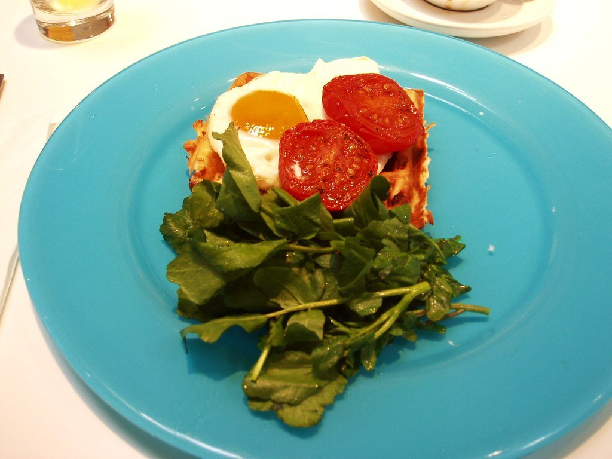

This is the broadest category on the site and the one where the label does the least work. Lebanese mezze, a Turkish charcoal grill in Dalston, Palestinian home cooking in a Notting Hill townhouse, Kuwaiti machboos in Knightsbridge and modern Greek small plates in Marylebone are five different cuisines, and London does all of them well.

Arranged **by tradition**, because that is what actually determines the meal.

> 💡 **The Short Version:** **Al Waha** is the Lebanese room the guides agree on. **The Barbary** is the best seat in London if you like watching food cooked. **Mangal 2** in Dalston is the most inventive Turkish kitchen in Britain. **Akub** is the only serious Palestinian restaurant here. And **Pilpel** does the best £8 lunch in the City.

> 📊 **The evidence behind this guide**
> Nothing here is ranked on one visit. This page reads three separate corpora, because these are three separate cuisines that London menus file together: **Middle Eastern — 14 sources, 177 citations across 103 restaurants, 37 named twice or more**; **Turkish — 7 sources, 97 citations across 52 restaurants, 27 named twice or more**; **Greek — 4 sources, 64 citations across 39 restaurants, 14 named twice or more**. Every count below comes from the venue's own cuisine, never from another.
> **Built on:** nine independent publications across three cuisines that London menus file together but which are not the same food.
> *Evidence rebuilt 30 August 2026 · [How we rank →](/how-we-rank/)*

## Where they are

| If you are near… | Where to eat |
| --- | --- |
| **Marylebone** | Fairuz, Ishtar, OPSO, Kima, Clio |
| **Soho & Covent Garden** | The Barbary, Imad's Syrian Kitchen |
| **Fitzrovia** | Rovi, Meraki, Lokal |
| **Notting Hill** | Akub, Mazi, Zephyr, Kinz |
| **Knightsbridge** | Em Sherif, Ishbilia, Freej Swaileh, The Mantl |
| **Shoreditch & Dalston** | Mangal 2, Sohaila, Berber & Q |
| **Borough & London Bridge** | Oma, Pyro, Kismet |
| **Bayswater & west** | Al Waha, Vori |
| **Islington & Bloomsbury** | Ottolenghi, Honey & Co |

**Price guide:** **£** under £15 · **££** £15–£35 · **£££** £40–£70 · **££££** £90+.

---

## Levantine

### Al Waha, Bayswater

*£££ · 7 min from Bayswater · the consensus pick* · Cited by 4 sources

**The most-cited Lebanese room in London** across these sources — white walls, hanging foliage, and mezze taken seriously rather than served as filler while you wait for the grill.

The mezze is the meal: **hummus, moutabal, tabbouleh and fattoush** made properly, warm flatbread arriving continuously, and *makanek* — small spiced sausages — among the hot dishes. Charcoal-grilled meats behind them if you want them, but ordering ten cold plates and stopping there is a legitimate dinner here.

**£££, book a few days ahead.** Seven minutes from Bayswater. Quiet, formal, and run by people who have been doing it a long time.

### The Barbary, Covent Garden

*£££ · Neal's Yard · about twenty seats* · Cited by 1 source

**A horseshoe counter wrapped around an open grill** in Neal's Yard, seating about twenty — you watch every plate being made, and there is nowhere to hide from the smoke.

The cooking follows the old Barbary Coast, from Morocco through to Israel: **naan e barbari**, the blistered flatbread the place is named for, **jerusalem bagel**, octopus and lamb cutlets off the coals, and a **pata negra neck** that regulars order before sitting down.

**Walk-in only and there is always a wait** — put your name down and drink somewhere in Seven Dials until they call. £££, and worth the queue for a counter seat.

### Akub, Notting Hill

*££££ · 3 min from Notting Hill Gate* · Cited by 4 sources

**Fadi Kattan** opened Fawda in Bethlehem before bringing **Palestinian cooking** to a Notting Hill townhouse — the first London kitchen to treat it as a fine-dining cuisine rather than a regional footnote of something else.

The signature is **bukjet mousakhan** — the sumac-and-onion chicken dish of the West Bank, reworked as a parcel. Around it, dishes built on Palestinian produce and technique that Kattan sources deliberately, and a brunch at weekends of qalayet bandora, zahra fritters and Arabic-coffee French toast.

**££££ and it books weeks ahead** — a small room on a residential street, three minutes from Notting Hill Gate.

### Imad's Syrian Kitchen, Soho

*£££ · Kingly Court* · Cited by 4 sources

**Imad Alarnab cooked his way from Damascus to a Kingly Court balcony**, running kitchens in refugee camps along the route. The Syrian home cooking is the draw and the story is not decoration — it is why the room is full.

Mezze first: **muhammara**, the walnut and red pepper paste, **fattoush**, and freekeh. Then the slow-cooked dishes — lamb with yoghurt, stuffed vine leaves, and the sort of food that comes out of a family kitchen rather than a restaurant one.

**£££ and it books weeks ahead.** The Kingly Court balcony is the seat to ask for.

### Em Sherif at Harrods, Knightsbridge

*££££ · a set menu in sequence* · Cited by 3 sources

The Beirut group's London outpost inside Harrods — **a set Lebanese menu served in sequence** rather than a mezze free-for-all, which is either the appeal or the objection depending on how you like to eat.

Course after course arrives without you ordering: cold mezze, then hot, then grills, then dessert, in the order a Beirut host would send them. The cooking is precise and the room is opulent to the point of theatre.

**££££ and it books weeks ahead.** No à la carte — you are agreeing to the whole sequence when you sit down.

### Freej Swaileh, Knightsbridge

*£££ · Kuwaiti* · Cited by 2 sources

**One of very few Kuwaiti kitchens in London** — Gulf cooking rather than the Levantine mezze that everywhere else on this page does, which makes it the most unusual entry here.

**Machboos** is the dish to order: spiced rice cooked with meat or fish, closer to a biryani than to anything Lebanese, with loomi — dried lime — giving it the sour note that defines Gulf food. **Kabsa** alongside it, and Kuwaiti breads that appear nowhere else in the city.

**£££, book a few days ahead.** Order the machboos and let the table share it.

---

## Turkish

Turkish cooking is its own tradition rather than a branch of Levantine, and London has enough of it to need a separate page — [**The Best Turkish Restaurants in London**](/articles/best-turkish-restaurants-london/) compares 25 rooms, most of them on or near **Green Lanes**, where nine of the most-cited sit on a single road.

The short version: **Mangal II** in Dalston is the most-cited and the one that turned an ocakbaşı into a destination kitchen; **Antepliler** and **Gökyüzü** are the Green Lanes benchmarks; **Kismet** in Borough is the meyhane worth a night out; and **Ishtar** in Marylebone is the reliable central room for a table that does not want to travel.

---

Powered by <a target="_blank" rel="sponsored" href="https://www.getyourguide.com/london-l57/">GetYourGuide</a>

## Modern Greek

### OPSO, Marylebone

*£££ · 8 min from Baker Street* · Cited by 4 Greek sources

**Greek small plates reworked with restaurant technique** — the room most responsible for London taking modern Greek cooking seriously, rather than filing it under holiday food.

The format is sharing: **taramasalata** made properly, grilled octopus, slow-cooked lamb, and a **loukoumades** — honey doughnuts — that most tables order without discussing it. Greek wine list to match, which was unusual when it opened.

**£££ and it books weeks ahead.** Eight minutes from Baker Street.

### Oma and Pyro, Borough

*££££ / £££ · London Bridge* · Cited by 3 Greek sources

Two restaurants in one building by London Bridge, from the same team: **Oma cooks Greek food over fire at serious prices upstairs**, and **Pyro** is the more casual room below it.

At Oma the fire does everything — **whole fish**, aged meat and vegetables over wood, plated with a fine-dining restraint that Greek cooking in London rarely gets. **Pyro** does pizza and small plates from the same kitchen for roughly half the outlay, which makes it one of the better-value tables in Borough.

**££££ at Oma, £££ at Pyro; both book well ahead.** Pick by budget rather than by cooking — the kitchen is the same.

### Kima, Marylebone

*££££ · whole fish* · Cited by 2 Greek sources

**Greek seafood treated at fine-dining level**, which almost nothing else in London does — the fish counter is the menu and you choose from what came in.

**Whole fish** is the order: grilled simply over charcoal, dressed with lemon and oil, served to the table to be filleted. Around it, raw plates, sea urchin when it is on, and the Greek staples done with restaurant precision rather than taverna generosity.

**££££ and it books weeks ahead.** Small room, high prices, and the best Greek fish cooking in the city.

### Vori, Holland Park

*£££ · the wine list* · Cited by 2 Greek sources

**The only wine list in London built entirely on indigenous Greek varieties** — assyrtiko, xinomavro, agiorgitiko and a dozen more nobody stocks — in a Holland Park Avenue taverna with tables out on the pavement.

The food is taverna rather than restaurant: **grilled meats, salads, dips and whole fish**, cooked straightforwardly and priced fairly for the postcode. The wine is the reason to make the trip, and the staff will talk you through it.

**£££, book a few days ahead.** Ask them to pick the bottle; the whole point of the list is that you have not heard of most of it.

### Mazi and Zephyr, Notting Hill

*£££ · garden and photographs* · Cited by 3 Greek sources

Two modern Greek rooms in the same postcode, and worth knowing apart. **Mazi** treats the classics as a starting point and has a **garden at the back** — the better table on a warm evening. **Zephyr**, from the same team, is the more photographed of the pair.

At Mazi the cooking pulls the taverna repertoire into restaurant shape: **taramasalata**, grilled octopus, and lamb given more technique than tradition requires. Zephyr runs a similar menu in a brighter, busier room.

**£££ at both.** Book Mazi's garden specifically; it is the thing that separates them.

---

## Vegetable-led

Mezze is vegetable-led by tradition, which makes this the easiest category on the site to eat well in without meat.

### Rovi, Fitzrovia

*£££ · Ottolenghi group* · Cited by 1 source

The Ottolenghi group's **fermentation-and-fire** room, where **vegetables go on the grill and get the treatment meat usually gets** — the clearest statement of what that kitchen has been arguing for twenty years.

Everything passes through fire or a ferment: charred cabbage, koji-aged vegetables, and a menu where the meat dishes are the afterthought rather than the centre. The pickling programme is visible from the room.

**£££ and it books weeks ahead.** The one to bring someone who thinks vegetarian cooking is a compromise.

### Bubala, Spitalfields

*£££ · entirely vegetarian* · Cited by 5 sources

**Entirely vegetarian and almost never described that way** — the point is that nobody at the table notices what is missing, which is why it is named by five independent sources while vegetarian rooms with more evangelism are named by none.

Middle Eastern small plates off charcoal: **halloumi with black seed honey**, the dish everyone orders and photographs, **confit potato latkes**, oyster mushroom skewers and hummus with a depth most meat kitchens do not reach. The grill does the work meat would normally do.

**£££ and it books weeks ahead.** Small, loud, and busy enough that nobody is there as a concession to somebody else's diet.

### Ottolenghi, Islington

*£££ · 12 min from Angel*

**The window display of salads and cakes is the London original** — the counter that shaped how a generation of home cooks eat, and still the best of the group's rooms to see the idea in its first form.

The counters are stacked with **salads built on grains, roasted vegetables and herbs by the handful**, and the cake display behind them is deliberately excessive. Communal tables to eat at, a deli counter to take from, and a menu that changes with what has been roasted that morning.

**£££, counter service and communal seating** — it works for one person with a book and less well for four wanting a conversation. Book a few days ahead for a table.

*The counters are stacked with salads by the metre. Islington is the original branch. Photo: [Ewan-M](https://www.flickr.com/photos/55935853@N00/2466885795), [CC BY-SA 2.0](https://creativecommons.org/licenses/by-sa/2.0/).*

### Berber & Q, Haggerston

*£££ · a railway arch* · Cited by 2 sources

**A railway arch built around charcoal and smoke** — lamb shawarma and cauliflower off the same grill, in a room that gets very loud very quickly and is not apologising for it.

The **whole roast cauliflower** is the signature and deserves to be: charred whole over coals, dressed and brought to the table intact. Beside it the **lamb shawarma** carved off the spit, short rib, and mezze that are a good deal more than a holding pattern.

**£££ and it books weeks ahead.** Go as a group; the format and the volume both assume one.

---

Powered by <a target="_blank" rel="sponsored" href="https://www.getyourguide.com/london-l57/">GetYourGuide</a>

## By country, not "Middle Eastern"

"Middle Eastern" covers a dozen cuisines that share a mezze format and very little else. These kitchens each cook somewhere specific.

### Imad's Syrian Kitchen, Soho — Syrian

*££ · Top Floor, Kingly Court · Michelin Bib Gourmand* · Cited by 4 sources

**Damascene cooking**, and a **Michelin Bib Gourmand for 2026**, from a restaurateur who lost a Damascus business to the war, crossed six countries, and spent 64 nights sleeping on the steps of a church in Calais cooking for the people around him.

He ran his first London pop-up on Columbia Road in 2017 and moved to this Kingly Court room in 2023. Mezze, grilled meats and spiced salads.

### Berenjak, Soho — Persian

*££ · 27 Romilly Street · also Borough Market* · Cited by 3 sources

**A Tehran hole-in-the-wall kabab house rebuilt in Soho**, from Kian Samyani and the JKS group — counter seating, charcoal, and none of the carpeted formality London Persian restaurants usually come with.

Order the **mahi** (saffron-marinated fish) and **jujeh** (chicken) kababs off the coals, with **torshi** — the sharp Persian pickles — and taftoon bread baked in the room. The **kashke bademjan**, aubergine with whey and fried onion, is the starter to have.

**£££ and it books weeks ahead.** 27 Romilly Street, with a second counter at Borough Market that is easier to get into.

### Nandine, Camberwell — Kurdish

*££ · 82 Vestry Road · also Camberwell Church Street* · Cited by 3 sources

**The only Kurdish kitchen of any profile in London.** Pary Baban came to the UK as a refugee from Kurdistan and cooks the food she grew up with — a cuisine that gets folded into Turkish or Persian on most menus and is neither.

Expect **kubba** — bulgur dumplings stuffed with spiced meat — flatbreads baked to order, slow-cooked stews with dried lime and pomegranate, and vegetable dishes that carry the meal rather than accompany it. Breakfast and brunch are the busiest services.

**££, walk-in.** Two sites: 82 Vestry Road and Camberwell Church Street. Go for brunch at the weekend.

### The Palomar, Soho — Jerusalem

*£££ · 34 Rupert Street · Bib Gourmand since 2014* · Cited by 3 sources

The Soho counter that made **modern Jerusalem cooking** mainstream in London, and has held a **Bib Gourmand since 2014**. **The zinc counter, not the tables** — sit at it and the cooking happens a foot from your plate, with the room loud enough to make it a night out rather than a dinner.

The **kubaneh** — a pull-apart Yemeni bread served with tahini and grated tomato — is the thing to order first and the dish people describe afterwards. Behind it, polenta Jerusalem-style, octopus, and a short menu that changes often.

**£££. Counter seats are held back for walk-ins**, tables book weeks ahead. 34 Rupert Street.

### Palmyra's Kitchen, Finsbury Park — Syrian and Lebanese

*££ · 5–7 Wells Terrace · open to midnight* · Cited by 2 sources

**Tucked round the back of Finsbury Park station** next to the bus stands — hidden in plain sight, and named for Palmyra deliberately, to put Syrian cooking in the foreground rather than filing it under Lebanese.

**Mezze platters** are the format: hummus, moutabal, fattoush and warm bread, with **shawarma** and charcoal grills behind them. Portions are large and the pricing is a fraction of central London for the same cooking.

**££, open to midnight**, which makes it one of the better late options in north London. Walk-in; 5–7 Wells Terrace.

### Maramia Cafe, Golborne Road — Palestinian

*££ · 48 Golborne Road · closed Mondays* · Cited by 2 sources

**Palestinian and Arabic home cooking on Golborne Road since 2005** — long before anyone was writing guides to it, and still run the same way.

All-day cooking rather than a fixed menu: **maqluba**, the upside-down rice and vegetable dish, **musakhan**, mezze, and grills, with **set-menu nights and live music** that are the reason regulars book rather than drop in.

**££, closed Mondays.** 48 Golborne Road, a few minutes from Portobello. Ask what is on before you order from the menu.

### Meza, Tooting — Lebanese

*££ · 34 Trinity Road* · Cited by 3 sources

**A tiny Tooting room** where the mezze arrives faster than the table can clear it, at prices that explain the permanent queue — the sort of place that survives entirely on regulars.

The **mezze** is the whole proposition: hummus, moutabal, halloumi, sujuk, kibbeh and warm flatbread, ordered by the handful and replaced as fast as you finish. Grills exist and are beside the point.

**££, tiny, and no bookings** — put your name down and wait on Trinity Road. Cash-friendly, and among the cheapest proper meals in this guide.

---

## Bakeries and counters

The cheapest and often the best Middle Eastern food in London is sold across a counter, not at a table.

### Al-Jabal Bakery, Park Royal

*£ · manakeesh £2–£3 · 8am–4pm*

A Lebanese bakery of **more than twenty years** in an Acton business centre, with **no dining room at all** — you order at the counter and eat standing or take it away.

**Mana'eesh from about £2**, made to order: **spinach, cheese, or lahem beajin** — the minced-lamb flatbread — baked while you wait, plus trays of **baklawa** sold by weight. That is essentially the menu and it does not need to be longer.

**The weekend queue is drawn from across west London**, which is the clearest recommendation available. Walk-in, cash-friendly, and worth the industrial-estate location.

### Ta'mini Lebanese Bakery, Fulham, Bloomsbury and Kensington

*£ · ka'ak £3.00 · za'atar manakish £3.95*

Husband-and-wife Lebanese bakers — **Ali from north Lebanon and Nermin from Beirut** — who opened in the first lockdown and have been expanding since. Three London counters now.

**Za'atar manakish £3.95**, **ka'ak with za'atar or sumac £3.00**, falafel wrap £8.95, and **fatayer** — the folded spinach or cheese pastries — through the day. Everything is baked to order and handed over hot.

**Counter service, walk-in, all day.** The cheapest good lunch in three separate postcodes, and one of the few bakeries in this guide cited by more sources than most restaurants.

### Common Breads, Belgravia

*£ · ka'ak from £2.50 · manouche from £4.50 · 8am–6pm*

**A Beirut bakery counter opposite Victoria station**, from three childhood friends from Lebanon — a bakery rather than a restaurant, and cited by more guides than most of the restaurants on this page.

**Flatbreads and manakish straight out of the oven**, and purse-shaped **ka'ak from £2.50** — the sesame-crusted bread sold from carts across Beirut, filled here with cheese or za'atar. Manouche flatbreads baked to order behind them.

**Walk-in, quick, and cheap for the postcode** — one of very few things near Victoria worth eating that costs under a fiver.

### Mr Falafel, Shepherd's Bush Market

*£ · Palestinian · market stall*

**Twenty-four years of Palestinian falafel** from a Shepherd's Bush Market stall, and one of the few entries in this guide where the whole menu fits on a board above the hatch.

Falafel **wraps in two sizes**, wholemeal available, fried to order so they arrive hot with a crisp shell and a green centre — the test any falafel stand passes or fails on. Pickles, tahini and chilli sauce added at the counter.

**Walk-in, cash-friendly, market hours** — closed by late afternoon, and gone if you turn up expecting dinner. Among the cheapest meals in the guide.

### Green Valley, Edgware Road

*£ · grocery and hot counter · 8am to midnight*

**A Lebanese supermarket with a food counter attached** on Edgware Road, and one of the few places in London where the shopping and the eating are the same trip.

The counter runs **shawarma carved off the spit**, mana'eesh from the oven, and trays of mezze sold by weight, with a **patisserie counter** of baklawa and knafeh at the front that is worth the visit alone. The supermarket behind it stocks what the restaurants on this page cook with.

**Open late, walk-in, and cheap.** Buy the food to take away and the ingredients to repeat it at home.

---

Powered by <a target="_blank" rel="sponsored" href="https://www.getyourguide.com/london-l57/">GetYourGuide</a>

## Best value

Falafel is where this cuisine is cheapest and best, and all of these are entirely vegetarian.

* **Pilpel**, Spitalfields — the best £8 lunch in the City, and several sites.
* **Hoxton Beach Falafel**, Shoreditch — market-stall origins, still under £10.
* **Magic Falafel**, Camden Town — under £10 and entirely vegetarian.
* **Hiba Express**, Holborn — the lunch counter people who work in Holborn actually queue at.
* **Zeit & Za'atar**, Ealing — wood-fired manakish, and the cheapest proper Levantine bakery food in west London.

---

## The two streets

**Edgware Road** is the Arab Middle Eastern quarter — Lebanese, Syrian, Egyptian and Iraqi — running north from Marble Arch. Green Valley is the anchor grocer, and **Ranoush Juice** (shawarma to 3am) and the tiny Persian grill **Patogh** are the other names locals give. Late-night is the point of this street.

**Green Lanes** in Harringay is a different thing entirely: **Turkish and Turkish-Kurdish**, not Arab. **Gökyüzü**, **Antepliler** for Gaziantep kebabs and baklava, and **Yaşar Halim** for the bakery-supermarket. Do not go looking for Lebanese mezze there.

---

## What to know

* **Mezze is ordered across the table** in waves, not as a starter. Over-ordering is the standard mistake and most kitchens will steer you.
* **Ocakbaşı grills in Dalston and on Green Lanes** run very late and are cheap for the quality.
* **Turkish, Greek and Persian are separate cuisines** and we file them that way — most published lists do not, which is why their "best Middle Eastern" lists read oddly.
* **Vegetarians do unusually well here** without anything being adapted for them.
* **Service charge** of 12.5% is discretionary and standard.

---

## Continue planning your London trip

- 🍽️ **[Eat in London: Restaurants, Food Markets & Quick Food Hub](/articles/eat-in-london-guide/)**
- 🌿 **[Best Vegetarian and Vegan Restaurants](/articles/best-vegetarian-vegan-restaurants-london/)**
- 💷 **[Cheap Eats in London](/articles/cheap-eats-london/)**
- 🍛 **[The Best Indian Restaurants in London](/articles/best-indian-restaurants-london/)**
- 🎨 **[Shoreditch Area Guide](/articles/shoreditch-area-guide/)**
- 🛍️ **[Notting Hill Area Guide](/articles/notting-hill-area-guide/)**
