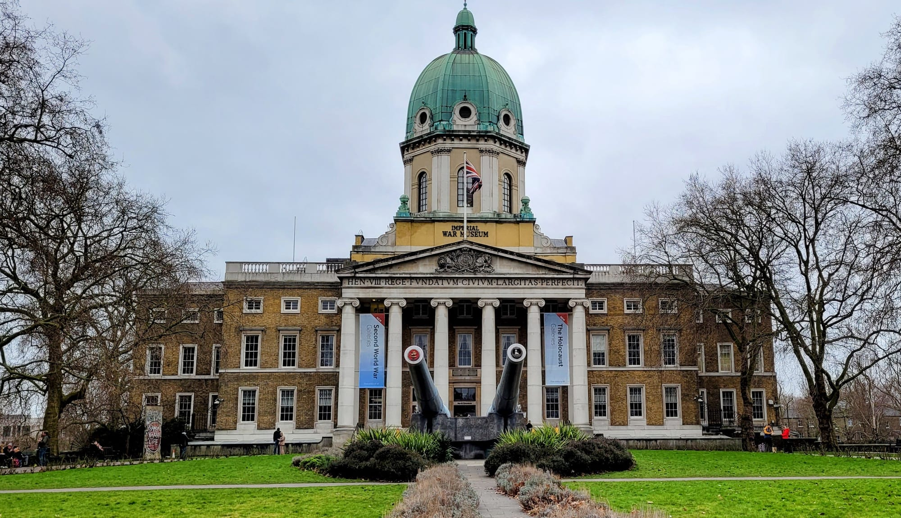

London has the best free museums in the world and most visitors see three of them. The Natural History Museum was the UK's most visited attraction in 2025 with over seven million people through the door — and a mile away, a house preserved exactly as its owner left it in 1837 gets a fraction of that.

This guide covers both: the ones you have heard of, and the ones worth crossing London for.

> 💡 **The Short Version:** The **British Museum** and **Natural History Museum** are the ones everybody does, and both deserve it. **Sir John Soane's Museum** is the best small museum in Britain. **The Wellcome Collection** is the strangest free thing in London. **Young V&A** is the answer with children. The **Postal Museum's Mail Rail** puts you on a train inside real Post Office tunnels. And **V&A East Storehouse** in Stratford will bring almost any object in the collection out for you to look at, free.

> 📘 **How we choose these (editorial note)**
> No paid placements. These are drawn from a wide spread of sources rather than any single list - the food and travel press, the big listings sites, independent blogs and specialists, video, and what Londoners recommend themselves - and cross-referenced against each other. Visitor figures are ALVA's audited numbers for 2025. Admission prices are the museums' own and were checked in August 2026 — special exhibitions inside free museums are almost always ticketed separately.

## Where they are

| If you are near… | Where to go |
| --- | --- |
| **Bloomsbury** | British Museum, Wellcome Collection, Sir John Soane's, Grant Museum, Petrie Museum, Foundling Museum, Postal Museum |
| **South Kensington** | Natural History Museum, Science Museum, V&A |
| **Westminster & Trafalgar Square** | National Gallery, National Portrait Gallery, Tate Britain, Churchill War Rooms |
| **South Bank & Bankside** | Tate Modern, Imperial War Museum |
| **The City** | Bank of England Museum, London's Roman Amphitheatre |
| **Covent Garden** | London Transport Museum |
| **East London** | Young V&A (Bethnal Green), London Museum Docklands (Canary Wharf) |
| **Stratford & the Olympic Park** | V&A East Storehouse, V&A East Museum |
| **Further out** | Horniman (Forest Hill), RAF Museum (Colindale), Musical Museum (Brentford) |

---

## The big free ones

### The British Museum, Bloomsbury

*Free · 6.4m visits in 2025*

The Rosetta Stone, the Parthenon sculptures and the Sutton Hoo helmet, under Foster's glass-roofed Great Court. Impossible to do properly in one visit — pick two galleries and accept it.

### Natural History Museum, South Kensington

*Free · the UK's most visited attraction*

Over **7 million visits in 2025**, an all-time record for a British museum. The building is as much of the draw as the collection.

### Science Museum, South Kensington

*Free*

Next door to the Natural History Museum, and the better of the two with older children.

### Tate Modern, Bankside

*Free · 4.5m visits*

The national collection of international modern art inside a power station, with the Turbine Hall running its full length. **The tenth-floor viewing level is free** and one of the best views in London.

### Imperial War Museum, Lambeth

*Free*

Housed in what was **Bethlem Royal Hospital — the original Bedlam** — with two enormous naval guns on the lawn outside. The First and Second World War galleries are the core, and the Holocaust Galleries are among the most carefully made permanent exhibitions in the country.

*The guns are 15-inch, from HMS Ramillies and HMS Resolution. The building behind them held the Bethlem asylum until 1930.*

> ⚠️ **The Holocaust Galleries are not recommended for under-14s**, and the museum says so at the entrance. Worth knowing before arriving with children.

### National Gallery and National Portrait Gallery, Trafalgar Square

*Free*

Two thousand paintings from the 1200s to 1900 at the National, including Van Gogh's Sunflowers. The Portrait Gallery round the corner reopened in 2023 and is markedly quieter.

---

*Hintze Hall at the Natural History Museum. The blue whale replaced Dippy the diplodocus in 2017.*

## The best small museums

### Sir John Soane's Museum, Bloomsbury

*Free · Lincoln's Inn Fields*

The architect's own house, **preserved by Act of Parliament exactly as he left it in 1837** — mirrors, top-lit wells, and a sarcophagus in the basement. The best small museum in Britain and it costs nothing.

Very small, so entry is sometimes timed.

### Wellcome Collection, Bloomsbury

*Free · Euston Road*

Genuinely strange, and built around Henry Wellcome's collection of medical objects. The most interesting free hour in London.

### Grant Museum of Zoology, Bloomsbury

*Free · UCL*

One cramped room of UCL's teaching collection — **68,000 specimens**, including a jar packed with preserved moles that has become internet-famous.

### Petrie Museum of Egyptian Archaeology, Bloomsbury

*Free · UCL*

Where the British Museum has the monuments, the Petrie has the **ordinary things** — including what is claimed as the world's oldest dress.

Sir John Soane's, the Grant and the Petrie are within fifteen minutes of each other, which makes Bloomsbury the densest museum walk in London.

---

## Newly open

The two biggest additions to London's museums in a generation both opened in the last eighteen months, and a third arrives this November.

### V&A East Storehouse, Stratford

*Free · opened May 2025*

Not a museum in the usual sense but a **working store you can walk into** — more than half a million objects on open racking, from samurai swords to Elton John's costumes, with conservators visible at work rather than hidden behind the scenes.

The **Order an Object** service is the thing that makes it extraordinary: you can request almost anything in the collection and have it brought out to you, free, by appointment. Nowhere else in Britain does this.

The **David Bowie Centre** opened inside it in September 2025, holding his personal archive.

### V&A East Museum, Stratford

*Opened April 2026*

The separate, purpose-built museum on **East Bank** in the Olympic Park, opened 18 April 2026 — the V&A's first new museum in London in over a century. It opened with *The Music is Black: A British Story*, on 125 years of Black British music.

Two very different buildings ten minutes apart. The Storehouse is the one people come out of talking about; do both in a morning.

### London Museum, Smithfield

*Free · opens 28 November 2026*

> ⚠️ **Not open yet.** The date is 28 November 2026 — check before travelling.

The old Museum of London, rehoused in the **Victorian General Market at Smithfield** after a decade-long restoration by Stanton Williams and Asif Khan. Free permanent galleries, DJ nights on Fridays and Saturdays, and a six-metre window looking onto a **live railway line running past the galleries** — which no other museum in the world has.

The opening programme, *London Tastes*, runs to August 2027 and is about the city's food.

---

## With children

### Young V&A, Bethnal Green

*Free*

The V&A's museum **built entirely around children**, reopened in 2023 after a redesign that put play first. Three galleries, a stage, and things to climb rather than only look at.

### The Postal Museum and Mail Rail, Bloomsbury

*Ticketed*

A **miniature train ride through the actual tunnels** of the Post Office's own underground railway, closed to mail in 2003.

### London Transport Museum, Covent Garden

*Ticketed*

Real Tube carriages and horse buses you can climb into, plus the poster and Johnston-typeface archive.

### Horniman Museum and Gardens, Forest Hill

*Free; aquarium ticketed*

A Victorian tea trader's collection, most famous for **a walrus stuffed by taxidermists who had never seen one** and therefore filled it until the skin was smooth.

---

## Specialist

* **Bank of England Museum**, City — free, inside the Bank, and it **lets you lift a real gold bar**.
* **London's Roman Amphitheatre**, City — free, in the basement of the Guildhall Art Gallery, with the missing seating drawn in light.
* **London Museum Docklands**, Canary Wharf — free, in a Georgian sugar warehouse, covering the port and the slave trade that built it.
* **National Army Museum**, Chelsea — free and genuinely quiet.
* **RAF Museum**, Colindale — free, over a hundred aircraft in hangars on the old Hendon aerodrome.
* **Fashion and Textile Museum**, Bermondsey — founded by Zandra Rhodes in a building she painted hot pink and orange.
* **The Cartoon Museum**, Fitzrovia — three hundred years of British cartooning, with drawing tables.
* **The Musical Museum**, Brentford — self-playing pianos and a Wurlitzer, actually demonstrated rather than displayed.

---

## How to actually do the big ones

The free national museums are enormous and most people do them badly. These are the things that make the difference.

* **Pick three things and leave.** The British Museum has around eight million objects and about 80,000 on display. Completeness is not available, and trying for it is how people end up exhausted in Room 62 having enjoyed none of it.
* **Go at opening or in the last two hours.** The V&A, the Natural History Museum and the British Museum are all substantially quieter before 11am and after 4pm. The queues at the Natural History Museum in half-term are the worst in London.
* **Use the side entrances.** The Natural History Museum's Exhibition Road entrance is almost always shorter than the Cromwell Road one. The V&A's tunnel entrance from South Kensington station skips the street entirely.
* **Free does not mean no booking.** Several still ask for a timed slot at busy periods even though entry costs nothing, and turning up without one on a Saturday can mean a wait.
* **The temporary exhibitions are what you pay for**, and they are where the queues are. The permanent collections are free, permanently, and are the reason these museums are internationally famous.
* **Lates are the best-kept secret.** The V&A, the Science Museum, the Natural History Museum and the Wellcome Collection all run evening openings, usually monthly, usually free, and usually with a bar and a much better atmosphere than a Saturday afternoon.
* **The gift shops and cafés are the funding.** Entry is free because of them, so buying a coffee is closer to paying admission than it looks.

---

## What to know

* **Free means free.** The national museums have no admission charge and never ask for one at the door, though donation boxes are prominent.
* **Special exhibitions are ticketed** even inside free museums, often £18–£25.
* **Late openings are the quietest slots.** Several run Friday evenings.
* **Bags are searched** at the big museums and large luggage is usually refused.
* **The Bloomsbury cluster** — British Museum, Soane, Wellcome, Grant, Petrie, Foundling — is walkable in a day and mostly free.

---

## Continue planning your London trip

- 🎨 **[The Best Galleries in London](/articles/best-galleries-london/)**
- 🎪 **[Free Things to Do in London](/free/)**
- 🏛️ **[Historic Houses in London](/articles/historic-houses-london/)**
- 👀 **[The Best Views in London](/articles/best-views-london/)**
- 📚 **[Bloomsbury Area Guide](/articles/bloomsbury-area-guide/)**
- 🏙️ **[South Kensington Area Guide](/articles/south-kensington-area-guide/)**
